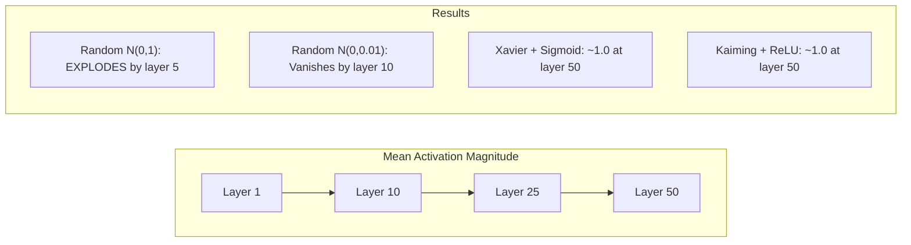
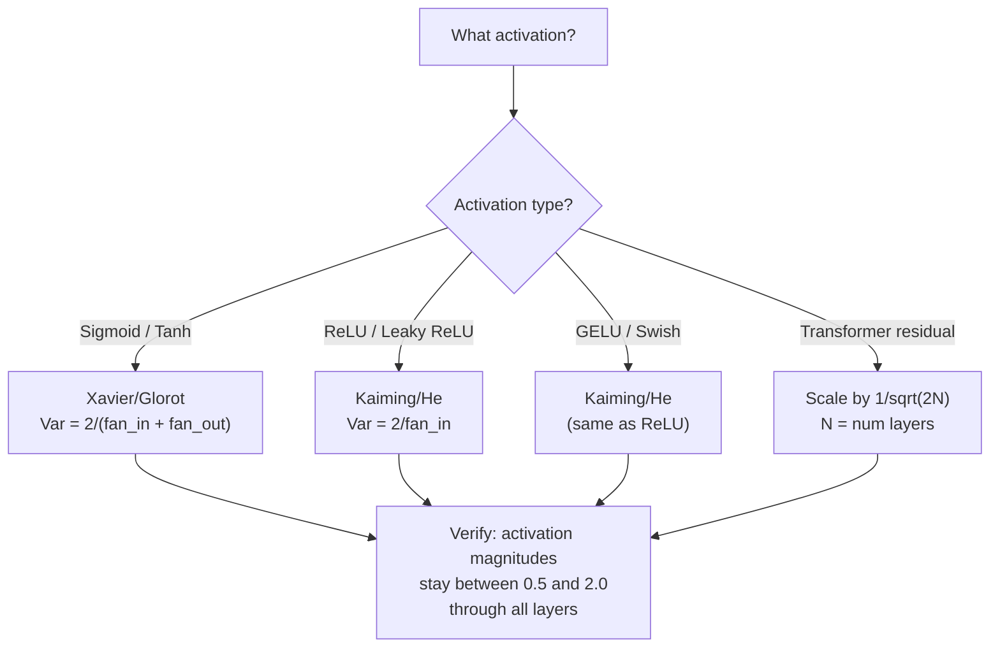

# آغاز وزن و ثبات آموزش

> شروع کردن اشتباه و آموزش هرگز شروع نمی شود شروع کردن درست و 50 لایه آموزش به طور سلسله ای به عنوان 3.

**Type:** Build
**Languages:** Python
**Prerequisites:** Lesson 03.04 (Activation Functions), Lesson 03.07 (Regularization)
**Time:** ~90 minutes

## اهداف یادگیری

- استراتژی های ابتدایی صفر، تصادفی، Xavier/Glorot و Kaiming/He را پیاده سازی کنید و تاثیر آنها را بر شدت فعال سازی از طریق 50 لایه اندازه گیری کنید
- نتیجه گیری کنید که چرا Xavier init از Var(w) = 2/(fan_in + fan_out) و Kaiming از Var(w) = 2/fan_in استفاده می کند
- مسئله همپردازی را با صفر آغاز نشان دهید و توضیح دهید که چرا مقیاس تصادفی به تنهایی کافی نیست
- مطابقت با استراتژی صحیح ابتدایی با تابع فعال سازی: Xavier برای sigmoid/tanh، Kaiming برای ReLU/GELU

## مشکل

تمام وزن ها را به صفر شروع کنید. هیچ چیز یاد نمی گیرد. هر نورون عملکرد مشابهی را محاسبه می کند، همان گرادیانت را دریافت می کند و به طور یکسان به روز می شود. پس از 10 هزار دوره، لایه پنهان 512 نورون شما هنوز 512 نسخه از همان نورون است. شما برای 512 پارامتر پرداخت کرده اید و 1 دریافت کردید.

در سطح 10، ارزش ها به 1e15 می رسند. در سطح 20، آنها به بی نهایت فرا می روند. درجه بندی ها مسیر مشابه را به عقب دنبال می کنند.

این سیگنال ها را به صورت تصادفی از یک توزیع استاندارد طبیعی شروع کنید. برای 3 لایه کار می کند. در 50 لایه، سیگنال به صفر یا انفجار به بی نهایت بسته به اینکه مقیاس تصادفی کمی کوچک یا کمی بزرگ بود یا خیر. مرز بین "کار" و "شکسته" نازک است.

شروع کردن وزن، کمترین تصمیم در یادگیری عمیق است. معماری، کاغذات را می گیرد. بهینه سازان، پست های وبلاگ را می گیرد. شروع کردن، یادداشت پا را می گیرد. اما اشتباه کنید و هیچ چیز دیگری مهم نیست - شبکه شما قبل از شروع آموزش مرده است.

## مفهوم

### مشکل هم تراز

هر نورون در یک لایه ساختار مشابهی دارد: ورودی را با وزن ضرب کنید، تعصب اضافه کنید، فعال سازی را اعمال کنید. اگر همه وزن ها از همان مقدار شروع شوند (صفر حالت شدید است) ، هر نورون تولید مشابهی را محاسبه می کند. در طول پخش عقب، هر نورون گرادینت مشابهی دریافت می کند. در مرحله بروزرسانی، هر نورون با مقدار مشابه تغییر می کند.

شما گیر کرده اید. شبکه صدها پارامتر دارد، اما همه آنها به صورت قفل حرکت می کنند. این را همتایی می نامند، و ابتدایی تصادفی راه شکستن آن است. هر نورون در نقطه ای متفاوت در فضای وزن شروع می شود، بنابراین هر یک ویژگی متفاوتی را یاد می گیرد.

اما "صدایی" کافی نیست. مقیاس تصادفی تعیین می کند که آیا شبکه قطار است.

### گسترش تنوع از طریق لایه ها

یک لایه ی واحد با ورودی های fan_in را در نظر بگیرید:

```
z = w1*x1 + w2*x2 + ... + w_n*x_n
```

اگر هر وزن wi از توزیع با ویرانس Var(w) گرفته شود و هر ورودی xi دارای ویرانس Var(x باشد، ویرانس خروجی:

```
Var(z) = fan_in * Var(w) * Var(x)
```

اگر Var(w) = 1 و fan_in = 512, متغیر خروجی 512x متغیر ورودی است. پس از 10 لایه: 512^10 = 1.2e27. سیگنال شما منفجر شده است.

اگر Var ((w) = 0.001، تفاوت خروجی 0.001 * 512 = 0.512 در هر لایه کاهش می یابد. پس از 10 لایه: 0.512^10 = 0.00013. سیگنال شما ناپدید شده است.

هدف: انتخاب Var(w) به طوری که Var(z) = Var(x. شدت سیگنال در سراسر لایه ها ثابت باقی می ماند.

### شروع کردن Xavier/Glorot

گلوروت و بنگیو (2010) راه حل فعال سازی سیگمائید و تان را بدست آوردند. برای حفظ متغیر ثابت در هم پیش و هم عقب:

```
Var(w) = 2 / (fan_in + fan_out)
```

در عمل، وزنه ها از:

```
w ~ Uniform(-limit, limit)  where limit = sqrt(6 / (fan_in + fan_out))
```

یا:

```
w ~ Normal(0, sqrt(2 / (fan_in + fan_out)))
```

این کار به این دلیل است که سیگمائید و تانه تقریبا خطی نزدیک به صفر هستند، جایی که فعال سازی های اولیه به درستی زندگی می کنند.

### آغاز کاری Kaiming/He

ReLU نیمی از خروجی را می کشد (همه چیز منفی صفر می شود). فان_این موثر به نصف کاهش می یابد زیرا به طور متوسط نیمی از ورودی ها صفر می شوند. Xavier init این را حساب نمی کند - این تفاوت مورد نیاز را دست کم می داند.

He et al. (2015) فرمول را اصلاح کرد:

```
Var(w) = 2 / fan_in
```

وزن ها از:

```
w ~ Normal(0, sqrt(2 / fan_in))
```

عامل 2 تعویض برای ReLU صفر کردن نیمی از فعال سازی. بدون آن، سیگنال به ~ 0.5x در هر لایه کاهش می یابد. با 50 لایه: 0.5^50 = 8.8e-16.

### شروع کردن ترانسفورماتور

GPT-2 الگوی متفاوتی را معرفی کرد. اتصال های باقیمانده تولید هر لایه زیر را به ورودی اضافه می کنند:

```
x = x + sublayer(x)
```

هر اضافه کننده تفاوت را افزایش می دهد. با N لایه های باقیمانده، تفاوت متناسب با N رشد می کند. GPT-2 وزن لایه های باقیمانده را با 1/sqrt ((2N) مقیاس می دهد، جایی که N تعداد لایه ها است. این باعث می شود که شدت سیگنال جمع شده پایدار باشد.

لامای 3 (405B پارامتر، 126 لایه) از یک طرح مشابه استفاده می کند. بدون این مقیاس بندی، جریان باقیمانده از طریق 126 لایه توجه و بلوک های پیشرو بدون مرز رشد می کند.

```mermaid
flowchart TD
    subgraph "Zero Init"
        Z1["Layer 1<br/>All weights = 0"] --> Z2["Layer 2<br/>All neurons identical"]
        Z2 --> Z3["Layer 3<br/>Still identical"]
        Z3 --> ZR["Result: 1 effective neuron<br/>regardless of width"]
    end

    subgraph "Xavier Init"
        X1["Layer 1<br/>Var = 2/(fan_in+fan_out)"] --> X2["Layer 2<br/>Signal stable"]
        X2 --> X3["Layer 50<br/>Signal stable"]
        X3 --> XR["Result: Trains with<br/>sigmoid/tanh"]
    end

    subgraph "Kaiming Init"
        K1["Layer 1<br/>Var = 2/fan_in"] --> K2["Layer 2<br/>Signal stable"]
        K2 --> K3["Layer 50<br/>Signal stable"]
        K3 --> KR["Result: Trains with<br/>ReLU/GELU"]
    end
```



### شدت فعال سازی از طریق 50 لایه



### انتخاب اصل درست



```figure
weight-init-variance
```

## آن را بسازید

### مرحله اول: استراتژی های ابتدایی

چهار راه برای شروع کردن ماتریس وزن. هر کدام یک لیست از لیست ها (ماتریس 2D) را با ستون های fan_in و ردیف fan_out باز می کند.

```python
import math
import random


def zero_init(fan_in, fan_out):
    return [[0.0 for _ in range(fan_in)] for _ in range(fan_out)]


def random_init(fan_in, fan_out, scale=1.0):
    return [[random.gauss(0, scale) for _ in range(fan_in)] for _ in range(fan_out)]


def xavier_init(fan_in, fan_out):
    std = math.sqrt(2.0 / (fan_in + fan_out))
    return [[random.gauss(0, std) for _ in range(fan_in)] for _ in range(fan_out)]


def kaiming_init(fan_in, fan_out):
    std = math.sqrt(2.0 / fan_in)
    return [[random.gauss(0, std) for _ in range(fan_in)] for _ in range(fan_out)]
```

### مرحله دوم: عملکردهای فعال سازی

ما به sigmoid، tanh و ReLU برای تست هر استراتژی init با فعال سازی مورد نظر نیاز داریم.

```python
def sigmoid(x):
    x = max(-500, min(500, x))
    return 1.0 / (1.0 + math.exp(-x))


def tanh_act(x):
    return math.tanh(x)


def relu(x):
    return max(0.0, x)
```

### مرحله سوم: از 50 لایه جلو عبور کنید

اطلاعات تصادفی را از طریق یک شبکه عمیق منتقل کنید و میزان فعال سازی متوسط را در هر لایه اندازه گیری کنید.

```python
def forward_deep(init_fn, activation_fn, n_layers=50, width=64, n_samples=100):
    random.seed(42)
    layer_magnitudes = []

    inputs = [[random.gauss(0, 1) for _ in range(width)] for _ in range(n_samples)]

    for layer_idx in range(n_layers):
        weights = init_fn(width, width)
        biases = [0.0] * width

        new_inputs = []
        for sample in inputs:
            output = []
            for neuron_idx in range(width):
                z = sum(weights[neuron_idx][j] * sample[j] for j in range(width)) + biases[neuron_idx]
                output.append(activation_fn(z))
            new_inputs.append(output)
        inputs = new_inputs

        magnitudes = []
        for sample in inputs:
            magnitudes.append(sum(abs(v) for v in sample) / width)
        mean_mag = sum(magnitudes) / len(magnitudes)
        layer_magnitudes.append(mean_mag)

    return layer_magnitudes
```

### مرحله چهارم: آزمایش

تمام ترکیب ها را اجرا کنید: صفر init، تصادفی N(0,1), تصادفی N(0,0.01), Xavier با sigmoid، Xavier با tanh، Kaiming با ReLU. حجم را در لایه های کلیدی چاپ کنید.

```python
def run_experiment():
    configs = [
        ("Zero init + Sigmoid", lambda fi, fo: zero_init(fi, fo), sigmoid),
        ("Random N(0,1) + ReLU", lambda fi, fo: random_init(fi, fo, 1.0), relu),
        ("Random N(0,0.01) + ReLU", lambda fi, fo: random_init(fi, fo, 0.01), relu),
        ("Xavier + Sigmoid", xavier_init, sigmoid),
        ("Xavier + Tanh", xavier_init, tanh_act),
        ("Kaiming + ReLU", kaiming_init, relu),
    ]

    print(f"{'Strategy':<30} {'L1':>10} {'L5':>10} {'L10':>10} {'L25':>10} {'L50':>10}")
    print("-" * 80)

    for name, init_fn, act_fn in configs:
        mags = forward_deep(init_fn, act_fn)
        row = f"{name:<30}"
        for idx in [0, 4, 9, 24, 49]:
            val = mags[idx]
            if val > 1e6:
                row += f" {'EXPLODED':>10}"
            elif val < 1e-6:
                row += f" {'VANISHED':>10}"
            else:
                row += f" {val:>10.4f}"
        print(row)
```

### مرحله 5: نشان دادن هم تراز

نشان بده که صفر init سلول های عصبی مشابهی تولید می کند.

```python
def symmetry_demo():
    random.seed(42)
    weights = zero_init(2, 4)
    biases = [0.0] * 4

    inputs = [0.5, -0.3]
    outputs = []
    for neuron_idx in range(4):
        z = sum(weights[neuron_idx][j] * inputs[j] for j in range(2)) + biases[neuron_idx]
        outputs.append(sigmoid(z))

    print("\nSymmetry Demo (4 neurons, zero init):")
    for i, out in enumerate(outputs):
        print(f"  Neuron {i}: output = {out:.6f}")
    all_same = all(abs(outputs[i] - outputs[0]) < 1e-10 for i in range(len(outputs)))
    print(f"  All identical: {all_same}")
    print(f"  Effective parameters: 1 (not {len(weights) * len(weights[0])})")
```

### مرحله ۶: گزارش حجم لایه به لایه

یک نمودار بینایی از شدت فعال سازی را از طریق 50 لایه چاپ کنید.

```python
def magnitude_report(name, magnitudes):
    print(f"\n{name}:")
    for i, mag in enumerate(magnitudes):
        if i % 5 == 0 or i == len(magnitudes) - 1:
            if mag > 1e6:
                bar = "X" * 50 + " EXPLODED"
            elif mag < 1e-6:
                bar = "." + " VANISHED"
            else:
                bar_len = min(50, max(1, int(mag * 10)))
                bar = "#" * bar_len
            print(f"  Layer {i+1:3d}: {bar} ({mag:.6f})")
```

## ازش استفاده کن

PyTorch این ها را به عنوان عملکردهای داخلی ارائه می دهد:

```python
import torch
import torch.nn as nn

layer = nn.Linear(512, 256)

nn.init.xavier_uniform_(layer.weight)
nn.init.xavier_normal_(layer.weight)

nn.init.kaiming_uniform_(layer.weight, nonlinearity='relu')
nn.init.kaiming_normal_(layer.weight, nonlinearity='relu')

nn.init.zeros_(layer.bias)
```

وقتي که زنگ ميزني`nn.Linear(512, 256)`این دلیل است که اکثر شبکه های ساده "فقط کار می کنند" - PyTorch قبلاً انتخاب درست را انجام داده است. اما وقتی معماری سفارشی ایجاد می کنید یا بیش از 20 لایه را عمیق تر می کنید، باید بدانید چه اتفاقی می افتد و به طور بالقوه از پیش فرض رد کنید.

برای ترانسفورماتورها، مدل های HuggingFace معمولاً شروع کردن در دستگاه های خود را مدیریت می کنند.`_init_weights`روش: پیاده سازی GPT-2 مقیاس رادای پیش بینی ها را با 1/sqrt ((N) می کند. اگر شما یک ترانسفورماتور را از نو می سازید، شما باید این را خودتان اضافه کنید.

## -باده

این درس نتیجه می دهد:
- `outputs/prompt-init-strategy.md`-- یک پیامک که مشکلات شروع وزن را تشخیص می دهد و استراتژی درست را توصیه می کند

## تمرینات

1. اضافه کردن شروع کردن LeCun (Var = 1/fan_in، طراحی شده برای فعال سازی SELU). آزمایش 50 لایه را با LeCun init + tanh اجرا کنید و با Xavier + tanh مقایسه کنید.

2. پیاده سازی مقیاس باقیمانده GPT-2: تولید هر لایه را با 1/sqrt ((2*N) ضرب کنید قبل از اضافه کردن به جریان باقیمانده. 50 لایه را با و بدون مقیاس اجرا کنید، اندازه گیری کنید که میزان باقیمانده چقدر سریع رشد می کند.

3. یک تابع "تحقیق سلامت init" ایجاد کنید که ابعاد لایه و نوع فعال سازی یک شبکه را در نظر بگیرد، سپس شروع صحیح را توصیه می کند و هشدار می دهد که اگر init فعلی باعث مشکلات شود.

4. آزمایش را با fan_in = 16 vs fan_in = 1024 اجرا کنید. Xavier و Kaiming به fan_in تطبیق می کنند، اما init تصادفی نمی کند. نشان دهید که چگونه فاصله بین "کار" و "پراکنده" با لایه های بزرگتر گسترش می یابد.

5. پیاده سازی ابتدایی orthogonal (تولید یک ماتریس تصادفی، محاسبه SVD آن، استفاده از ماتریس orthogonal U). مقایسه با Kaiming برای شبکه های ReLU در 50 لایه.

## اصطلاحات کلیدی

| Term | What people say | What it actually means |
|------|----------------|----------------------|
| Weight initialization | "Set starting weights randomly" | The strategy for choosing initial weight values that determines whether a network can train at all |
| Symmetry breaking | "Make neurons different" | Using random initialization to ensure neurons learn distinct features instead of computing identical functions |
| Fan-in | "Number of inputs to a neuron" | The number of incoming connections, which determines how input variance accumulates in the weighted sum |
| Fan-out | "Number of outputs from a neuron" | The number of outgoing connections, relevant for maintaining gradient variance during backpropagation |
| Xavier/Glorot init | "The sigmoid initialization" | Var(w) = 2/(fan_in + fan_out), designed to preserve variance through sigmoid and tanh activations |
| Kaiming/He init | "The ReLU initialization" | Var(w) = 2/fan_in, accounts for ReLU zeroing half the activations |
| Variance propagation | "How signals grow or shrink through layers" | The mathematical analysis of how activation variance changes layer by layer based on weight scale |
| Residual scaling | "GPT-2's init trick" | Scaling residual connection weights by 1/sqrt(2N) to prevent variance growth through N transformer layers |
| Dead network | "Nothing trains" | A network where poor initialization causes all gradients to be zero or all activations to saturate |
| Exploding activations | "Values go to infinity" | When weight variance is too high, causing activation magnitudes to grow exponentially through layers |

## خواندن بیشتر

- گلوروت و بنگیو، "فهامیدن مشکل آموزش شبکه های عصبی عمیق" (2010) - مقاله اصلی آغاز کاری Xavier با تجزیه و تحلیل متغیر
- او و همکارانش، "گوشی عمیق به اصلاحات" (2015) -- پیشگیری از کاراکترهای Kaiming برای شبکه های ReLU
- رادفورد و همکاران، "نمادها زبان یادگیری چند وظیفه بدون نظارت هستند" (2019) -- مقاله GPT-2 با شروع مقیاس گذاری باقیمانده
- میشکین و ماتاس، "همه چیزی که نیاز دارید یک ابتدایی خوب است" (2016) - ابتدایی واحد-فرق طبقه بندی، یک جایگزین تجربی برای فرمول های تحلیلی
