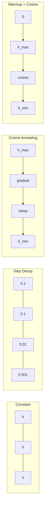
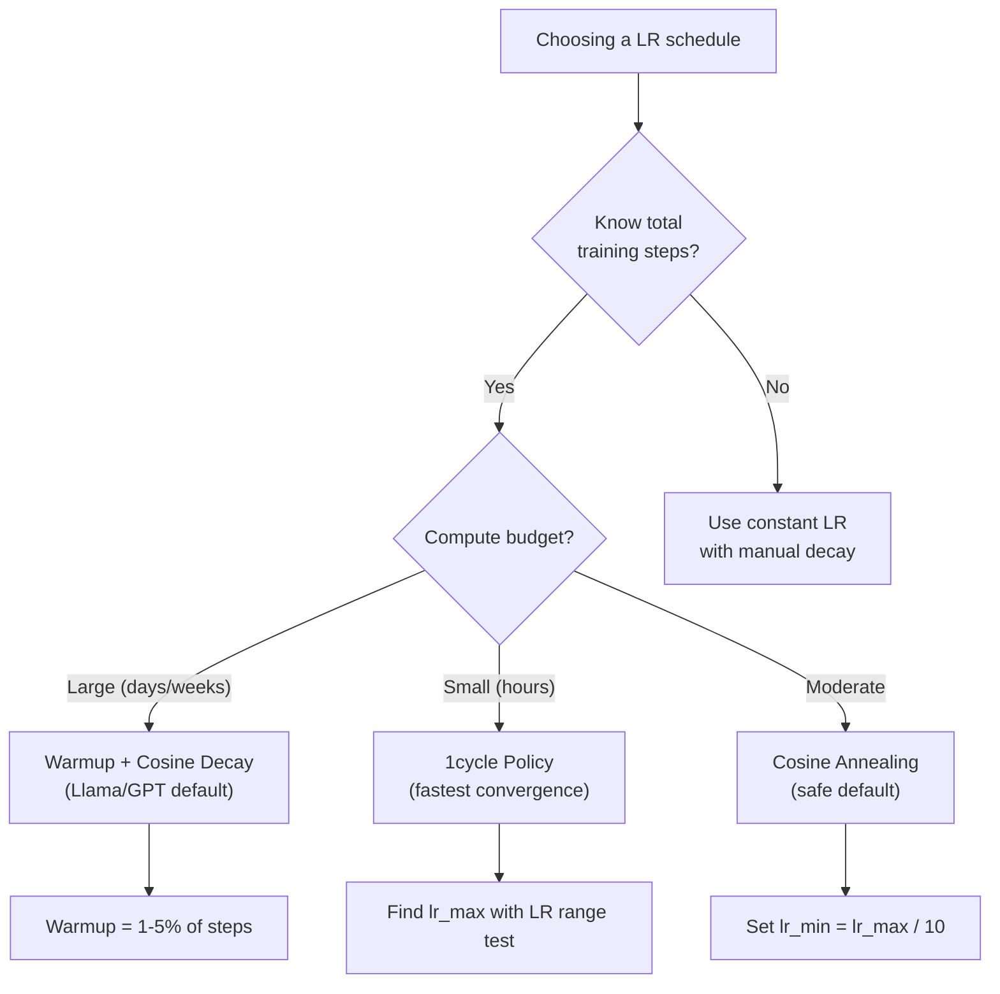
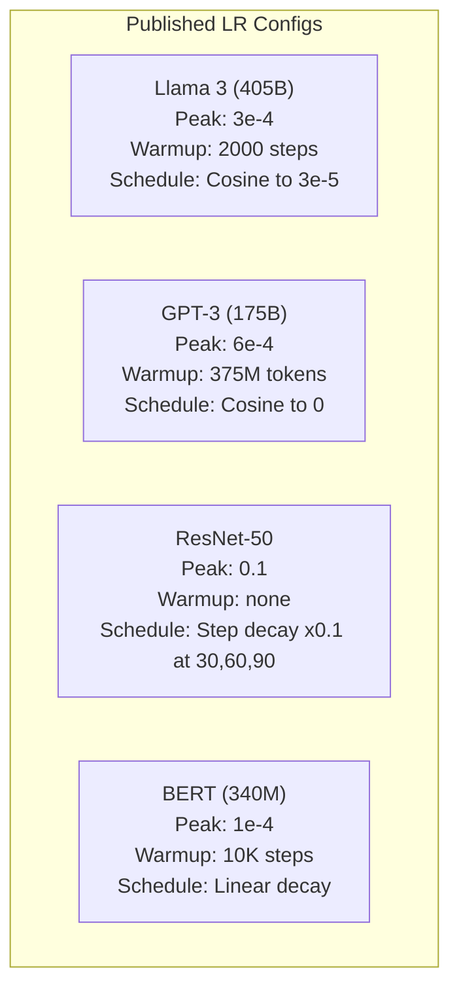

# برنامه های یادگیری و گرم شدن

> سرعت یادگیری مهم ترین هائپر پارامتر است نه معماری نه اندازه مجموعه داده ها نه عملکرد فعال سازی نرخ یادگیری اگر چیزی دیگر تنظیم نکنید، این را تنظیم کنید

**Type:** Build
**Languages:** Python
**Prerequisites:** Lesson 03.06 (Optimizers), Lesson 03.08 (Weight Initialization)
**Time:** ~90 minutes

## اهداف یادگیری

- از ابتدا برنامه های ثابت، کاهش مرحله ای، تکرار کوسین، گرم شدن + کوسین و سرعت یادگیری یک چرخه را اجرا کنید
- سه حالت شکست انتخاب نرخ یادگیری را نشان دهید: انحراف (بسیار بالا) ، توقف (بسیار کم) و نوسان (بدون انحلال)
- توضیح دهید که چرا گرم کردن برای اصلاح کنندگان مبتنی بر آدم ضروری است و چگونه آموزش اولیه را ثابت می کند
- سرعت تقابل در تمام پنج برنامه در یک کار را مقایسه کنید و یکی مناسب را برای بودجه آموزش مشخص انتخاب کنید

## مشکل

سرعت یادگیری را به 0.1 تنظیم کنید. آموزش منحرف می شود - از دست دادن به بی نهایت در 3 مرحله می رود. آن را به 0.0001 تنظیم کنید. آموزش خزید - پس از 100 دوره، مدل به سختی از تصادفی حرکت کرده است. آن را به 0.01 تنظیم کنید. آموزش برای 50 دوره کار می کند، سپس از دست دادن به حداقل می تواند هرگز به آن برسد زیرا مراحل بیش از حد بزرگ است.

سرعت یادگیری مطلوب ثابت نیست. در طول آموزش تغییر می کند. در ابتدا، شما می خواهید گام های بزرگ را به سرعت پوشش زمین. در اواخر آموزش، شما می خواهید گام های کوچک را به حداقل حاد تنظیم کنید. تفاوت بین مدل 90٪ دقیق و مدل 95٪ دقیق اغلب فقط برنامه است.

هر مدل اصلی منتشر شده در سه سال گذشته از یک جدول نرخ یادگیری استفاده می کند. Llama 3 از lr = 3e-4 با 2000 مرحله گرم شدن و تجزیه کوسین به 3e-5 استفاده می کند. GPT-3 از lr = 6e-4 با گرم شدن بیش از 375 میلیون توکن استفاده می کند. این انتخاب های تعسفی نیستند. آنها نتیجه از سوائپ های گسترده های هیپر پارامتر هستند که هزینه میلیون ها دلار را دارند.

شما باید برنامه ها را درک کنید زیرا پیش فرض ها برای مشکل شما کار نمی کنند. وقتی یک مدل پیش از آموزش را خوب تنظیم می کنید، برنامه مناسب متفاوت از آموزش از ابتدا است. وقتی اندازه دسته را افزایش می دهید، دوره گرمایش باید تغییر کند. وقتی تمرین در مرحله 10,000 متوقف می شود، باید بدانید که آیا این یک مشکل برنامه است یا چیزی دیگر.

## مفهوم

### نرخ یادگیری مداوم

ساده ترين روش، شماره اي انتخاب کن، و هر قدم رو ازش استفاده کن

```
lr(t) = lr_0
```

به ندرت مطلوب است. یا برای پایان تمرین (تذبذب در حدود حداقل) یا برای شروع (حساب تلف شده در مراحل کوچک) بسیار پایین است. برای مدل های کوچک و اشکال زدایی خوب کار می کند. یک انتخاب وحشتناک برای هر چیزی که بیش از یک ساعت تمرین می کند.

### مرحله انحلال

روش مدرسه ی قدیمی از عصر ResNet. نرخ یادگیری را با یک عامل (معمولاً 10 برابر) در دوره های ثابت کاهش دهید.

```
lr(t) = lr_0 * gamma^(floor(epoch / step_size))
```

جایی که گاما = 0.1 و step_size = 30 است: lr هر 30 دوره کاهش می یابد. ResNet-50 از این استفاده کرد -- lr = 0.1، کاهش 10 برابر در دوره های 30, 60 و 90.

مشکل: نقاط فاضلاب مطلوب به مجموعه داده ها و معماری بستگی دارد. به یک مشکل مختلف بروید و باید زمانی که سقوط کنید را دوباره تنظیم کنید. انتقال ها ناگهانی هستند - وقتی نرخ ناگهانی تغییر می کند، از دست دادن می تواند افزایش یابد.

### کوزین آنلینگ

تجزیه نرم از حداکثر میزان یادگیری به حداقل، با دنبال کردن منحنی کوسین:

```
lr(t) = lr_min + 0.5 * (lr_max - lr_min) * (1 + cos(pi * t / T))
```

جایی که t مرحله فعلی است و T تعداد کل مراحل است.

در t=0، اصطلاح کوسین 1 است، بنابراین lr = lr_max. در t=T، اصطلاح کوسین -1 است، بنابراین lr = lr_min. تجزیه در ابتدا نرمی است، در وسط تسریع می کند و در نزدیکی پایان دوباره نرمی می شود.

این پیش فرض برای اکثر تمرینات مدرن است. هیچ پارامترهای هیپراتیری برای تنظیم فراتر از lr_max و lr_min وجود ندارد. شکل کوسین با مشاهدات تجربی مطابقت دارد که بیشتر یادگیری در وسط تمرین اتفاق می افتد - شما می خواهید اندازه های مناسب مرحله در این دوره حیاتی.

### گرم شدن: چرا از کوچک شروع می کنید

آدم و سایر بهینه سازان سازنده ای تخمین های میانگین گرادینت و متغیر را در حال اجرا نگه می دارند. در مرحله 0، این تخمین ها به صفر آغاز می شوند. اولین چند بروزرسانی گرادینت بر اساس آمار زباله است. اگر میزان یادگیری شما در این دوره زیاد باشد، مدل گام های بزرگی و نامناسب را می گیرد.

Warmup این مشکل را حل می کند. با یک نرخ یادگیری کوچک (معمولاً lr_max / warmup_steps یا حتی صفر) شروع کنید و به صورت خطی تا lr_max در طول مراحل اول N افزایش دهید. تا زمانی که به سرعت یادگیری کامل برسید، آمار آدم ثابت شده است.

```
lr(t) = lr_max * (t / warmup_steps)     for t < warmup_steps
```

گرمایش معمولی: 1-5% کل مراحل آموزش. Llama 3 برای حدود 1.8 تریلیون توکن آموزش داده و برای 2000 مرحله گرم شده است. GPT-3 بیش از 375 میلیون توکن گرم شده است.

### گرم شدن خطی + تجزیه کوزین

.البته با روش مدرن ، خطيانه بالا مي رود و بعد با کوسينوس مي ذره

```
if t < warmup_steps:
    lr(t) = lr_max * (t / warmup_steps)
else:
    progress = (t - warmup_steps) / (total_steps - warmup_steps)
    lr(t) = lr_min + 0.5 * (lr_max - lr_min) * (1 + cos(pi * progress))
```

این چیزی است که Llama، GPT، PaLM و اکثر ترانسفورماتورهای مدرن استفاده می کنند. گرمایش از عدم ثبات اولیه جلوگیری می کند. تجزیه کوسین مدل را به حداقل می رساند.

### سیاست چرخه ی 1

کشف لسلی اسمیت (2018): افزایش نرخ یادگیری از یک مقدار پایین به یک مقدار بالا در نیمه اول آموزش، سپس کاهش آن در نیمه دوم. ضد بدیهی - چرا شما * افزایش * نرخ یادگیری در نیمه راه؟

نظریه: نرخ یادگیری بالا به عنوان تنظیم کننده عمل می کند با اضافه کردن صدا به مسیر بهینه سازی. مدل بیشتر از چشم انداز از دست دادن را در طول مرحله افزایش کشف می کند و حوضچه های بهتری را پیدا می کند. مرحله کاهش سپس در بهترین حوضچه یافت می شود.

```
Phase 1 (0 to T/2):    lr ramps from lr_max/25 to lr_max
Phase 2 (T/2 to T):    lr ramps from lr_max to lr_max/10000
```

یک چرخه اغلب سریع تر از یک چرخنده برای یک بودجه ثابت محاسبه می شود.

### شکل های برنامه



### نمودار جریان تصمیم گیری



### اعداد واقعی از مدل های منتشر شده



```figure
lr-schedule
```

## آن را بسازید

### مرحله ی اول: برنامه ی کاری

هر تابع مرحله فعلی را می گیرد و سرعت یادگیری را در آن مرحله باز می گرداند.

```python
import math


def constant_schedule(step, lr=0.01, **kwargs):
    return lr


def step_decay_schedule(step, lr=0.1, step_size=100, gamma=0.1, **kwargs):
    return lr * (gamma ** (step // step_size))


def cosine_schedule(step, lr=0.01, total_steps=1000, lr_min=1e-5, **kwargs):
    if step >= total_steps:
        return lr_min
    return lr_min + 0.5 * (lr - lr_min) * (1 + math.cos(math.pi * step / total_steps))


def warmup_cosine_schedule(step, lr=0.01, total_steps=1000, warmup_steps=100, lr_min=1e-5, **kwargs):
    if total_steps <= warmup_steps:
        return lr * (step / max(warmup_steps, 1))
    if step < warmup_steps:
        return lr * step / warmup_steps
    progress = (step - warmup_steps) / (total_steps - warmup_steps)
    return lr_min + 0.5 * (lr - lr_min) * (1 + math.cos(math.pi * progress))


def one_cycle_schedule(step, lr=0.01, total_steps=1000, **kwargs):
    mid = max(total_steps // 2, 1)
    if step < mid:
        return (lr / 25) + (lr - lr / 25) * step / mid
    else:
        progress = (step - mid) / max(total_steps - mid, 1)
        return lr * (1 - progress) + (lr / 10000) * progress
```

### مرحله دوم: تمام برنامه ها را در ذهن خود ببینید

نقشه ای مبتنی بر متن چاپ کنید که نشان می دهد هر برنامه در طول آموزش چگونه تکامل می یابد.

```python
def visualize_schedule(name, schedule_fn, total_steps=500, **kwargs):
    steps = list(range(0, total_steps, total_steps // 20))
    if total_steps - 1 not in steps:
        steps.append(total_steps - 1)

    lrs = [schedule_fn(s, total_steps=total_steps, **kwargs) for s in steps]
    max_lr = max(lrs) if max(lrs) > 0 else 1.0

    print(f"\n{name}:")
    for s, lr_val in zip(steps, lrs):
        bar_len = int(lr_val / max_lr * 40)
        bar = "#" * bar_len
        print(f"  Step {s:4d}: lr={lr_val:.6f} {bar}")
```

### مرحله سوم: شبکه آموزش

یک شبکه دو لایه ساده در مجموعه داده های دایره، همان طور که در درس های قبلی بود، اما اکنون برنامه را تغییر می دهیم.

```python
import random


def sigmoid(x):
    x = max(-500, min(500, x))
    return 1.0 / (1.0 + math.exp(-x))


def relu(x):
    return max(0.0, x)


def relu_deriv(x):
    return 1.0 if x > 0 else 0.0


def make_circle_data(n=200, seed=42):
    random.seed(seed)
    data = []
    for _ in range(n):
        x = random.uniform(-2, 2)
        y = random.uniform(-2, 2)
        label = 1.0 if x * x + y * y < 1.5 else 0.0
        data.append(([x, y], label))
    return data


def train_with_schedule(schedule_fn, schedule_name, data, epochs=300, base_lr=0.05, **kwargs):
    random.seed(0)
    hidden_size = 8
    total_steps = epochs * len(data)

    std = math.sqrt(2.0 / 2)
    w1 = [[random.gauss(0, std) for _ in range(2)] for _ in range(hidden_size)]
    b1 = [0.0] * hidden_size
    w2 = [random.gauss(0, std) for _ in range(hidden_size)]
    b2 = 0.0

    step = 0
    epoch_losses = []

    for epoch in range(epochs):
        total_loss = 0
        correct = 0

        for x, target in data:
            lr = schedule_fn(step, lr=base_lr, total_steps=total_steps, **kwargs)

            z1 = []
            h = []
            for i in range(hidden_size):
                z = w1[i][0] * x[0] + w1[i][1] * x[1] + b1[i]
                z1.append(z)
                h.append(relu(z))

            z2 = sum(w2[i] * h[i] for i in range(hidden_size)) + b2
            out = sigmoid(z2)

            error = out - target
            d_out = error * out * (1 - out)

            for i in range(hidden_size):
                d_h = d_out * w2[i] * relu_deriv(z1[i])
                w2[i] -= lr * d_out * h[i]
                for j in range(2):
                    w1[i][j] -= lr * d_h * x[j]
                b1[i] -= lr * d_h
            b2 -= lr * d_out

            total_loss += (out - target) ** 2
            if (out >= 0.5) == (target >= 0.5):
                correct += 1
            step += 1

        avg_loss = total_loss / len(data)
        accuracy = correct / len(data) * 100
        epoch_losses.append(avg_loss)

    return epoch_losses
```

### مرحله چهارم: تمام برنامه ها را مقایسه کنید

شبكه اي را با هر برنامه آموزش دهيد و رفتار تلفات و تقارب نهایی را با هم مقایسه كنيد.

```python
def compare_schedules(data):
    configs = [
        ("Constant", constant_schedule, {}),
        ("Step Decay", step_decay_schedule, {"step_size": 15000, "gamma": 0.1}),
        ("Cosine", cosine_schedule, {"lr_min": 1e-5}),
        ("Warmup+Cosine", warmup_cosine_schedule, {"warmup_steps": 3000, "lr_min": 1e-5}),
        ("1cycle", one_cycle_schedule, {}),
    ]

    print(f"\n{'Schedule':<20} {'Start Loss':>12} {'Mid Loss':>12} {'End Loss':>12} {'Best Loss':>12}")
    print("-" * 70)

    for name, schedule_fn, extra_kwargs in configs:
        losses = train_with_schedule(schedule_fn, name, data, epochs=300, base_lr=0.05, **extra_kwargs)
        mid_idx = len(losses) // 2
        best = min(losses)
        print(f"{name:<20} {losses[0]:>12.6f} {losses[mid_idx]:>12.6f} {losses[-1]:>12.6f} {best:>12.6f}")
```

### مرحله 5: LR بیش از حد بالا و پایین

سه حالت شکست را نشان دهید: بیش از حد بالا (تباور) ، بیش از حد پایین (زیر شدن) و درست.

```python
def lr_sensitivity(data):
    learning_rates = [1.0, 0.1, 0.01, 0.001, 0.0001]

    print("\nLR Sensitivity (constant schedule, 100 epochs):")
    print(f"  {'LR':>10} {'Start Loss':>12} {'End Loss':>12} {'Status':>15}")
    print("  " + "-" * 52)

    for lr in learning_rates:
        losses = train_with_schedule(constant_schedule, f"lr={lr}", data, epochs=100, base_lr=lr)
        start = losses[0]
        end = losses[-1]

        if end > start or math.isnan(end) or end > 1.0:
            status = "DIVERGED"
        elif end > start * 0.9:
            status = "BARELY MOVED"
        elif end < 0.15:
            status = "CONVERGED"
        else:
            status = "LEARNING"

        end_str = f"{end:.6f}" if not math.isnan(end) else "NaN"
        print(f"  {lr:>10.4f} {start:>12.6f} {end_str:>12} {status:>15}")
```

## ازش استفاده کن

پیتورچ برنامه ریزی کننده ها را در `torch.optim.lr_scheduler`:

```python
import torch
import torch.optim as optim
from torch.optim.lr_scheduler import CosineAnnealingLR, OneCycleLR, StepLR

model = nn.Sequential(nn.Linear(10, 64), nn.ReLU(), nn.Linear(64, 1))
optimizer = optim.Adam(model.parameters(), lr=3e-4)

scheduler = CosineAnnealingLR(optimizer, T_max=1000, eta_min=1e-5)

for step in range(1000):
    loss = train_step(model, optimizer)
    scheduler.step()
```

برای گرم شدن + کوسین، از برنامه ریزی کننده لامبا یا `get_cosine_schedule_with_warmup`از HuggingFace:

```python
from transformers import get_cosine_schedule_with_warmup

scheduler = get_cosine_schedule_with_warmup(
    optimizer,
    num_warmup_steps=2000,
    num_training_steps=100000,
)
```

عملکرد HuggingFace چیزی است که اکثر اسکریپت های تنظیم دقیق Llama و GPT استفاده می کنند. در صورت تردید، استفاده از گرم کردن + cosine با گرم کردن = 3-5% کل مراحل. این برای تقریبا همه چیز کار می کند.

## -باده

این درس نتیجه می دهد:
- `outputs/prompt-lr-schedule-advisor.md`-- یک پیام که برنامه ی مناسب یادگیری و پارامترهای فوق العاده را برای تنظیمات آموزش شما توصیه می کند

## تمرینات

1. انجام تجزیه نمایی: lr(t) = lr_0 * گاما^t جایی که گاما = 0.999. مقایسه با کوسین انیل در مجموعه داده دایره.

2. آزمایش محدوده سرعت یادگیری را پیاده سازی کنید (لسی اسمیت): چند صد مرحله تمرین کنید در حالی که LR را از 1e-7 به 1 افزایش می دهید.

3. تمرین با گرم کردن + کوسین اما طول گرم کردن را تغییر دهید: 0٪، 1٪، 5٪، 10٪، 20٪ از کل مراحل. نقطه شیرین را پیدا کنید که تمرین پایدارترین است.

4. اجرای بازپوشیدن کوسین با راه اندازی مجدد گرم (SGDR): سرعت یادگیری را به lr_max در هر مرحله T تنظیم کنید و دوباره تجزیه کنید.

5. یک "جراح برنامه" بسازید که از دست دادن تمرین نظارت کند و وقتی که از دست دادن ثابت می شود از گرم شدن به طور خودکار به کوسینوس تغییر می کند و اگر از دست دادن برای مدت طولانی کاهش یابد،

## اصطلاحات کلیدی

| Term | What people say | What it actually means |
|------|----------------|----------------------|
| Learning rate | "How fast the model learns" | The scalar that multiplies the gradient to determine the parameter update size |
| Schedule | "Change the LR over time" | A function that maps training step to learning rate, designed to optimize convergence |
| Warmup | "Start with a small LR" | Linearly ramping the LR from near-zero to the target value over the first N steps to stabilize optimizer statistics |
| Cosine annealing | "Smooth LR decay" | Decreasing the LR following a cosine curve from lr_max to lr_min over training |
| Step decay | "Drop LR at milestones" | Multiplying the LR by a factor (usually 0.1) at fixed epoch intervals |
| 1cycle policy | "Up then down" | Leslie Smith's method of ramping LR up then down in a single cycle for faster convergence |
| LR range test | "Find the best learning rate" | Training briefly while increasing LR to find the value where loss starts diverging |
| Cosine with warm restarts | "Reset and repeat" | Periodically resetting the LR to lr_max and decaying again (SGDR) |
| Eta min | "The floor for the LR" | The minimum learning rate that the schedule decays to |
| Peak learning rate | "The maximum LR" | The highest LR reached during training, typically after warmup |

## خواندن بیشتر

- لوشچیلوف و هاتر، "SGDR: کاهش درجه Stochastic Gradient با شروع مجدد گرم" (2017) -- معرفی cosine annealing و گرم شروع مجدد
- اسمیت، "سپر کنوگرنس: آموزش بسیار سریع شبکه های عصبی با استفاده از نرخ یادگیری بزرگ" (2018) -- مقاله سیاست یک چرخه
- Touvron و همکارانش، "Llama 2: Open Foundation and Fine-Tuned Chat Models" (2023) -- برنامه گرمایش + کوسین مورد استفاده در مقیاس را مستند می کند
- Goyal et al., "SGD دقیق و بزرگ: آموزش ImageNet در 1 ساعت" (2017) -- قانون مقیاس بندی خطی و گرمایش برای آموزش دسته های بزرگ
