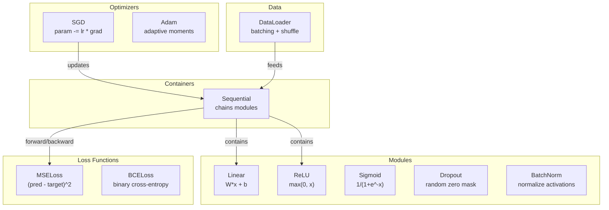
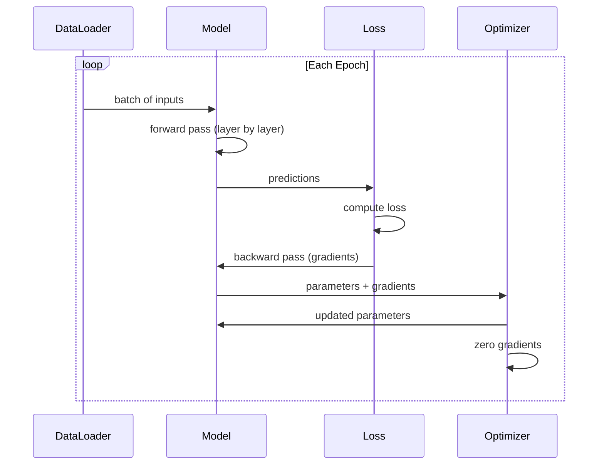
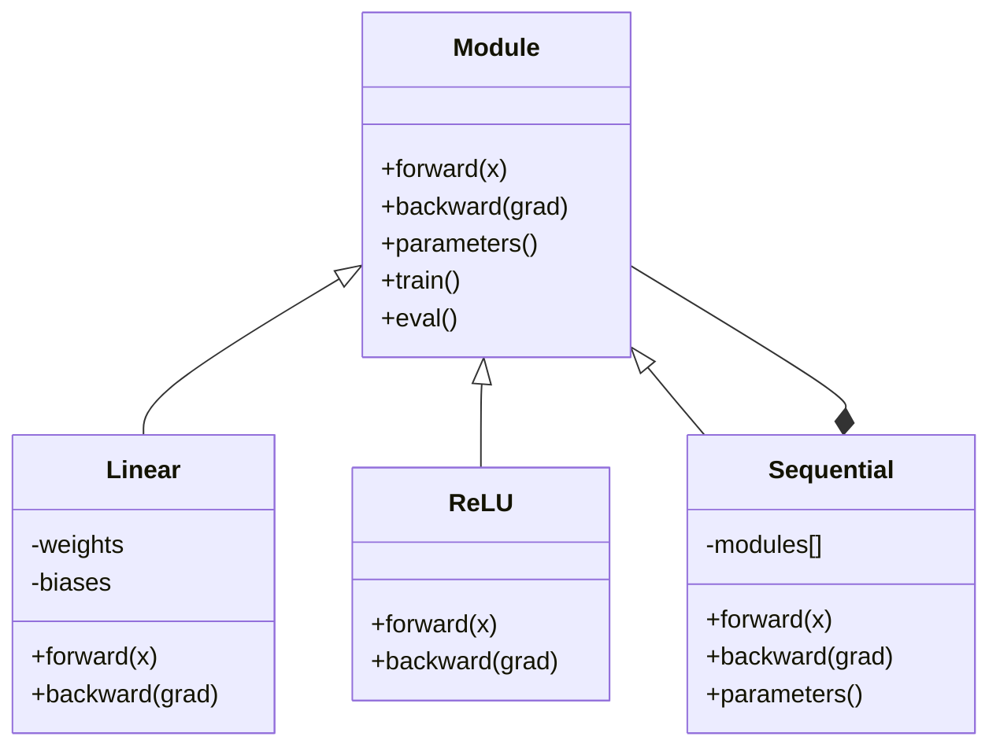

# ساخت چارچوب کوچک خود

> شما نورون ها، لایه ها، شبکه ها، پشت پشت، فعال سازی، عملکردهای از دست دادن، بهینه سازی، تنظیم، ابتدایی، و برنامه های LR را ساخته اید. همه اینها به عنوان قطعات جداگانه ای. حالا آنها را به یک چارچوب متصل کنید. نه PyTorch. نه TensorFlow. شما.

**Type:** Build
**Languages:** Python
**Prerequisites:** All of Phase 03 (Lessons 01-09)
**Time:** ~120 minutes

## اهداف یادگیری

- ساخت یک چارچوب یادگیری عمیق کامل (~ 500 خط) با Module، Linear، ReLU، Sigmoid، Dropout، BatchNorm، Sequential، loss functions، optimizers و DataLoader
- توضیح دهید که ماژول (پیش، عقب، پارامترها) را تجرید کنید و چرا تغییر حالت قطار/هوازم ضروری است.
- تمام قطعات را به یک حلقه آموزشی کار می کنند که یک شبکه چهار لایه را در طبقه بندی دایره آموزش می دهد
- هر جزء چارچوب خود را به معادل PyTorch آن نقشه بزنید (nn.Module, nn.Sequential, optim.Adam, DataLoader)

## مشکل

تو ده درس از بلوک های ساختمانی رو در پرونده های جداگانه پخش می کنی`Value`کلاس اینجا، یک حلقه آموزش اینجا، شروع وزن در فایل دیگری، برنامه های نرخ یادگیری در فایل دیگری. برای آموزش یک شبکه، شما از پنج درس مختلف کپی و پیوند می کنید و آنها را به صورت دستی به هم متصل می کنید.

اين چيزيه که چارچوب ها حل مي کنن.`nn.Module`،`nn.Sequential`،`optim.Adam`،`DataLoader`و یک الگوی حلقه آموزشی که آنها را با هم متصل می کند. TensorFlow به شما می دهد`keras.Layer`،`keras.Sequential`،`keras.optimizers.Adam`این ها جادویی نیستند، این ها الگوهای سازمانی هستند که امکان تعریف، آموزش و ارزیابی شبکه ها را بدون اختراع مجدد لوله کشی هر بار فراهم می کنند.

شما می خواهید همان چیزی را در حدود 500 خط پایتون بسازید. هیچ numpy. هیچ وابستگی خارجی. یک چارچوبی که می تواند هر شبکه بازخورد را تعریف کند، آن را با SGD یا آدم آموزش دهد، داده ها را دسته بندی کند، حذف و عادی سازی دسته بندی را اعمال کند، از هر گونه فعال سازی استفاده کند و سرعت یادگیری را برنامه ریزی کند.

وقتی تمومش کردی، دقیقا می فهمی وقتی می نویسی چی میشه`model = nn.Sequential(...)`تو پي تورچ مي فهمي چرا`model.train()`و`model.eval()`وجود داره، تو متوجه ميشي چرا`optimizer.zero_grad()`شما همه چیز را درک می کنید، چون شما همه چیز را ساخته اید.

## مفهوم

### خلاصه ی ماژول

هر لایه اي در PyTorch از`nn.Module`. یک ماژول سه مسئولیت دارد:

1. **forward()**-- محاسبه خروجی داده شده در ورودی
2. **parameters()**-- تمام وزنهاي قابل آموزش رو برگردونيد
3. **backward()**-- ترازحات محاسباتی (به وسیله autograd در PyTorch، صریح در ما)

یک لایه خطی یک ماژول است. یک فعال سازی ReLU یک ماژول است. یک لایه ترک یک ماژول است. یک لایه عادی سازی دسته یک ماژول است. همه آنها رابط مشابه دارند.

### کنتینر ترتیب

`nn.Sequential`زنجیره ها ماژول ها. پیشگویی: داده های تغذیه از طریق ماژول 1، سپس ماژول 2، سپس ماژول 3. پسگویی: رد زنجیره. خود کانتینر ماژول است - آن را به جلو ((() ، پارامترهای ((() و به عقب ((() دارد. این الگوی ترکیب است: یک سلسله ماژول خود را ماژول است.

### آموزش در مقابل حالت ارزیابی

ترک کردن به طور تصادفی نورون ها را در طول تمرین صفر می کند اما در طول ارزیابی همه چیز را از طریق می گذرد.`train()`و`eval()`روش ها این رفتار را تغییر می دهند.`training`پرچم

### بهینه سازی

بهینه ساز پارامترها را با استفاده از گرادیانت آنها به روز می کند. SGD: `param -= lr * grad`آدم: تخمین های حرکت و متغیر را حفظ می کند، سپس به روز می شود. بهینه ساز درباره معماری شبکه نمی داند - فقط یک لیست صاف پارامترها و گرادیان آنها را می بیند.

### DataLoader

دسته بندی به دو دلیل مهم است. اول، شما نمی توانید کل مجموعه داده ها را در حافظه برای مشکلات بزرگ قرار دهید. دوم، کاهش گرادینت دسته بندی کوچک باعث ایجاد صدا می شود که به فرار از حداقل های محلی کمک می کند. DataLoader داده ها را به دسته بندی تقسیم می کند و به طور اختیاری بین دوره ها را تغییر می دهد.

### معماری چارچوب



### چرخه آموزش



### سلسله مراتب ماژول



```figure
gradient-clipping
```

## آن را بسازید

### مرحله اول: کلاس پایه ماژول

رابط انتزاعی که هر لایه ای اجرا می کند.

```python
class Module:
    def __init__(self):
        self.training = True

    def forward(self, x):
        raise NotImplementedError

    def backward(self, grad):
        raise NotImplementedError

    def parameters(self):
        return []

    def train(self):
        self.training = True

    def eval(self):
        self.training = False
```

### مرحله دوم: لایه خطی

بلوک ساختمانی اساسی. وزن و تعصب را ذخیره می کند، Wx + b را به جلو و گرادینت وزن / ورودی به عقب محاسبه می کند.

```python
import math
import random


class Linear(Module):
    def __init__(self, fan_in, fan_out):
        super().__init__()
        std = math.sqrt(2.0 / fan_in)
        self.weights = [[random.gauss(0, std) for _ in range(fan_in)] for _ in range(fan_out)]
        self.biases = [0.0] * fan_out
        self.weight_grads = [[0.0] * fan_in for _ in range(fan_out)]
        self.bias_grads = [0.0] * fan_out
        self.fan_in = fan_in
        self.fan_out = fan_out
        self.input = None

    def forward(self, x):
        self.input = x
        output = []
        for i in range(self.fan_out):
            val = self.biases[i]
            for j in range(self.fan_in):
                val += self.weights[i][j] * x[j]
            output.append(val)
        return output

    def backward(self, grad):
        input_grad = [0.0] * self.fan_in
        for i in range(self.fan_out):
            self.bias_grads[i] += grad[i]
            for j in range(self.fan_in):
                self.weight_grads[i][j] += grad[i] * self.input[j]
                input_grad[j] += grad[i] * self.weights[i][j]
        return input_grad

    def parameters(self):
        params = []
        for i in range(self.fan_out):
            for j in range(self.fan_in):
                params.append((self.weights, i, j, self.weight_grads))
            params.append((self.biases, i, None, self.bias_grads))
        return params
```

### مرحله سوم: ماژول های فعال سازی

ReLU، Sigmoid و Tanh به عنوان ماژول ها هر کدام آنچه برای گذرگاه عقب نیاز دارند را ذخیره می کنند.

```python
class ReLU(Module):
    def __init__(self):
        super().__init__()
        self.mask = None

    def forward(self, x):
        self.mask = [1.0 if v > 0 else 0.0 for v in x]
        return [max(0.0, v) for v in x]

    def backward(self, grad):
        return [g * m for g, m in zip(grad, self.mask)]


class Sigmoid(Module):
    def __init__(self):
        super().__init__()
        self.output = None

    def forward(self, x):
        self.output = []
        for v in x:
            v = max(-500, min(500, v))
            self.output.append(1.0 / (1.0 + math.exp(-v)))
        return self.output

    def backward(self, grad):
        return [g * o * (1 - o) for g, o in zip(grad, self.output)]


class Tanh(Module):
    def __init__(self):
        super().__init__()
        self.output = None

    def forward(self, x):
        self.output = [math.tanh(v) for v in x]
        return self.output

    def backward(self, grad):
        return [g * (1 - o * o) for g, o in zip(grad, self.output)]
```

### مرحله 4: ماژول ترک

به طور تصادفی عناصر را در طول آموزش صفر می کند. عناصر باقیمانده را با 1/(1-پ) مقیاس می کند بنابراین ارزش های انتظار شده یکسان باقی می مانند. در طول ارزیابی هیچ کاری نمی کند.

```python
class Dropout(Module):
    def __init__(self, p=0.5):
        super().__init__()
        self.p = p
        self.mask = None

    def forward(self, x):
        if not self.training:
            return x
        self.mask = [0.0 if random.random() < self.p else 1.0 / (1 - self.p) for _ in x]
        return [v * m for v, m in zip(x, self.mask)]

    def backward(self, grad):
        if self.mask is None:
            return grad
        return [g * m for g, m in zip(grad, self.mask)]
```

### مرحله 5: ماژول BatchNorm

فعال سازی ها را به صفر متوسط و متغیر واحد در هر ویژگی در سراسر دسته عادی می کند. آمار اجرا را برای حالت ارزیابی حفظ می کند.

```python
class BatchNorm(Module):
    def __init__(self, size, momentum=0.1, eps=1e-5):
        super().__init__()
        self.size = size
        self.gamma = [1.0] * size
        self.beta = [0.0] * size
        self.gamma_grads = [0.0] * size
        self.beta_grads = [0.0] * size
        self.running_mean = [0.0] * size
        self.running_var = [1.0] * size
        self.momentum = momentum
        self.eps = eps
        self.x_norm = None
        self.std_inv = None
        self.batch_input = None

    def forward_batch(self, batch):
        batch_size = len(batch)
        output_batch = []

        if self.training:
            mean = [0.0] * self.size
            for sample in batch:
                for j in range(self.size):
                    mean[j] += sample[j]
            mean = [m / batch_size for m in mean]

            var = [0.0] * self.size
            for sample in batch:
                for j in range(self.size):
                    var[j] += (sample[j] - mean[j]) ** 2
            var = [v / batch_size for v in var]

            self.std_inv = [1.0 / math.sqrt(v + self.eps) for v in var]

            self.x_norm = []
            self.batch_input = batch
            for sample in batch:
                normed = [(sample[j] - mean[j]) * self.std_inv[j] for j in range(self.size)]
                self.x_norm.append(normed)
                output = [self.gamma[j] * normed[j] + self.beta[j] for j in range(self.size)]
                output_batch.append(output)

            for j in range(self.size):
                self.running_mean[j] = (1 - self.momentum) * self.running_mean[j] + self.momentum * mean[j]
                self.running_var[j] = (1 - self.momentum) * self.running_var[j] + self.momentum * var[j]
        else:
            std_inv = [1.0 / math.sqrt(v + self.eps) for v in self.running_var]
            for sample in batch:
                normed = [(sample[j] - self.running_mean[j]) * std_inv[j] for j in range(self.size)]
                output = [self.gamma[j] * normed[j] + self.beta[j] for j in range(self.size)]
                output_batch.append(output)

        return output_batch

    def forward(self, x):
        result = self.forward_batch([x])
        return result[0]

    def backward(self, grad):
        if self.x_norm is None:
            return grad
        for j in range(self.size):
            self.gamma_grads[j] += self.x_norm[0][j] * grad[j]
            self.beta_grads[j] += grad[j]
        return [grad[j] * self.gamma[j] * self.std_inv[j] for j in range(self.size)]

    def parameters(self):
        params = []
        for j in range(self.size):
            params.append((self.gamma, j, None, self.gamma_grads))
            params.append((self.beta, j, None, self.beta_grads))
        return params
```

### مرحله 6: ظرف های ترتیب

ماژول های زنجیره ای، جلو از چپ به راست، عقب از راست به چپ می رود.

```python
class Sequential(Module):
    def __init__(self, *modules):
        super().__init__()
        self.modules = list(modules)

    def forward(self, x):
        for module in self.modules:
            x = module.forward(x)
        return x

    def backward(self, grad):
        for module in reversed(self.modules):
            grad = module.backward(grad)
        return grad

    def parameters(self):
        params = []
        for module in self.modules:
            params.extend(module.parameters())
        return params

    def train(self):
        self.training = True
        for module in self.modules:
            module.train()

    def eval(self):
        self.training = False
        for module in self.modules:
            module.eval()
```

### مرحله هفتم: از دست دادن عملکرد

MSE و Binary Cross-Entropy. هر یک ارزش ضرر را باز می گرداند و یک عقب نشینی فراهم می کند که گرادینت را باز می گرداند.

```python
class MSELoss:
    def __call__(self, predicted, target):
        self.predicted = predicted
        self.target = target
        n = len(predicted)
        self.loss = sum((p - t) ** 2 for p, t in zip(predicted, target)) / n
        return self.loss

    def backward(self):
        n = len(self.predicted)
        return [2 * (p - t) / n for p, t in zip(self.predicted, self.target)]


class BCELoss:
    def __call__(self, predicted, target):
        self.predicted = predicted
        self.target = target
        eps = 1e-7
        n = len(predicted)
        self.loss = 0
        for p, t in zip(predicted, target):
            p = max(eps, min(1 - eps, p))
            self.loss += -(t * math.log(p) + (1 - t) * math.log(1 - p))
        self.loss /= n
        return self.loss

    def backward(self):
        eps = 1e-7
        n = len(self.predicted)
        grads = []
        for p, t in zip(self.predicted, self.target):
            p = max(eps, min(1 - eps, p))
            grads.append((-t / p + (1 - t) / (1 - p)) / n)
        return grads
```

### مرحله 8: SGD و آدم Optimizers

هر دو لیستی از پارامترها را بگیرند و با استفاده از گرادیانت وزن ها را به روز کنند.

```python
class SGD:
    def __init__(self, parameters, lr=0.01):
        self.params = parameters
        self.lr = lr

    def step(self):
        for container, i, j, grad_container in self.params:
            if j is not None:
                container[i][j] -= self.lr * grad_container[i][j]
            else:
                container[i] -= self.lr * grad_container[i]

    def zero_grad(self):
        for container, i, j, grad_container in self.params:
            if j is not None:
                grad_container[i][j] = 0.0
            else:
                grad_container[i] = 0.0


class Adam:
    def __init__(self, parameters, lr=0.001, beta1=0.9, beta2=0.999, eps=1e-8):
        self.params = parameters
        self.lr = lr
        self.beta1 = beta1
        self.beta2 = beta2
        self.eps = eps
        self.t = 0
        self.m = [0.0] * len(parameters)
        self.v = [0.0] * len(parameters)

    def step(self):
        self.t += 1
        for idx, (container, i, j, grad_container) in enumerate(self.params):
            if j is not None:
                g = grad_container[i][j]
            else:
                g = grad_container[i]

            self.m[idx] = self.beta1 * self.m[idx] + (1 - self.beta1) * g
            self.v[idx] = self.beta2 * self.v[idx] + (1 - self.beta2) * g * g

            m_hat = self.m[idx] / (1 - self.beta1 ** self.t)
            v_hat = self.v[idx] / (1 - self.beta2 ** self.t)

            update = self.lr * m_hat / (math.sqrt(v_hat) + self.eps)

            if j is not None:
                container[i][j] -= update
            else:
                container[i] -= update

    def zero_grad(self):
        for container, i, j, grad_container in self.params:
            if j is not None:
                grad_container[i][j] = 0.0
            else:
                grad_container[i] = 0.0
```

### مرحله 9: DataLoader

داده ها را به دسته ها تقسیم می کند، هر دوره را به صورت اختیاری مخلوط می کند.

```python
class DataLoader:
    def __init__(self, data, batch_size=32, shuffle=True):
        self.data = data
        self.batch_size = batch_size
        self.shuffle = shuffle

    def __iter__(self):
        indices = list(range(len(self.data)))
        if self.shuffle:
            random.shuffle(indices)
        for start in range(0, len(indices), self.batch_size):
            batch_indices = indices[start:start + self.batch_size]
            batch = [self.data[i] for i in batch_indices]
            inputs = [item[0] for item in batch]
            targets = [item[1] for item in batch]
            yield inputs, targets

    def __len__(self):
        return (len(self.data) + self.batch_size - 1) // self.batch_size
```

### مرحله ۱۰: آموزش شبکه چهار لایه در طبقه بندی دایره

همه چيز رو به هم ببندين، مدل رو تعريف کنين، يه بازي انتخاب کنين، يک بهینه سازي انتخاب کنين، و يه حلقه آموزش رو اجرا کنين.

```python
def make_circle_data(n=500, seed=42):
    random.seed(seed)
    data = []
    for _ in range(n):
        x = random.uniform(-2, 2)
        y = random.uniform(-2, 2)
        label = 1.0 if x * x + y * y < 1.5 else 0.0
        data.append(([x, y], [label]))
    return data


def train():
    random.seed(42)

    model = Sequential(
        Linear(2, 16),
        ReLU(),
        Linear(16, 16),
        ReLU(),
        Linear(16, 8),
        ReLU(),
        Linear(8, 1),
        Sigmoid(),
    )

    criterion = BCELoss()
    optimizer = Adam(model.parameters(), lr=0.01)

    data = make_circle_data(500)
    split = int(len(data) * 0.8)
    train_data = data[:split]
    test_data = data[split:]

    loader = DataLoader(train_data, batch_size=16, shuffle=True)

    model.train()

    for epoch in range(100):
        total_loss = 0
        total_correct = 0
        total_samples = 0

        for batch_inputs, batch_targets in loader:
            batch_loss = 0
            for x, t in zip(batch_inputs, batch_targets):
                pred = model.forward(x)
                loss = criterion(pred, t)
                batch_loss += loss

                optimizer.zero_grad()
                grad = criterion.backward()
                model.backward(grad)
                optimizer.step()

                predicted_class = 1.0 if pred[0] >= 0.5 else 0.0
                if predicted_class == t[0]:
                    total_correct += 1
                total_samples += 1

            total_loss += batch_loss

        avg_loss = total_loss / total_samples
        accuracy = total_correct / total_samples * 100

        if epoch % 10 == 0 or epoch == 99:
            print(f"Epoch {epoch:3d} | Loss: {avg_loss:.6f} | Train Accuracy: {accuracy:.1f}%")

    model.eval()
    correct = 0
    for x, t in test_data:
        pred = model.forward(x)
        predicted_class = 1.0 if pred[0] >= 0.5 else 0.0
        if predicted_class == t[0]:
            correct += 1
    test_accuracy = correct / len(test_data) * 100
    print(f"\nTest Accuracy: {test_accuracy:.1f}% ({correct}/{len(test_data)})")

    return model, test_accuracy
```

## ازش استفاده کن

اين معادل PyTorch از چيزي که تازه ساختي:

```python
import torch
import torch.nn as nn
from torch.utils.data import DataLoader, TensorDataset

model = nn.Sequential(
    nn.Linear(2, 16),
    nn.ReLU(),
    nn.Linear(16, 16),
    nn.ReLU(),
    nn.Linear(16, 8),
    nn.ReLU(),
    nn.Linear(8, 1),
    nn.Sigmoid(),
)

criterion = nn.BCELoss()
optimizer = torch.optim.Adam(model.parameters(), lr=0.01)

for epoch in range(100):
    model.train()
    for inputs, targets in dataloader:
        optimizer.zero_grad()
        predictions = model(inputs)
        loss = criterion(predictions, targets)
        loss.backward()
        optimizer.step()

    model.eval()
    with torch.no_grad():
        test_predictions = model(test_inputs)
```

ساختارش همش مثل اونه`Sequential`،`Linear`،`ReLU`،`Sigmoid`،`BCELoss`،`Adam`،`zero_grad`،`backward`،`step`،`train`،`eval`هر مفهوم یک به یک نقشه می کند. تفاوت این است که PyTorch به طور خودکار autograd را (هیچ نیازی به پیاده سازی به عقب نیست) در هر ماژول) ، روی GPU اجرا می کند و برای سال ها بهینه سازی شده است. اما استخوان ها یکسان هستند.

حالا وقتی کد PyTorch رو می بینید دقیقا می دانید که در هر خط چه اتفاق می افتد. این درک همه چیز است.

## -باده

این درس نتیجه می دهد:
- `outputs/prompt-framework-architect.md`-- یک دستور برای طراحی معماری شبکه عصبی با استفاده از انتزاع چارچوب

## تمرینات

1. اضافه کنید`SoftmaxCrossEntropyLoss`کلاس برای طبقه بندی چند طبقه. نرم کردن پیش بینی ها، محاسبه از دست دادن انترپی متقاطع، و مدیریت رد برگشت ترکیبی. آن را در یک مجموعه داده های اسپرالی سه کلاس تست کنید.

2. برنامه ریزی سرعت یادگیری را در بهینه ساز پیاده سازی کنید: اضافه کردن `set_lr()`روش و سیم در جدول کوسین از درس ۹. طبقه بندی دایره را با گرم کردن + کوسین تمرین کنید و با LR ثابت مقایسه کنید.

3. اضافه کنید`save()`و`load()`روش به دنباله دار که تمام وزن ها را به یک فایل JSON سریالیز می کند و آنها را بار می کند. بررسی کنید که یک مدل بارگذاری شده پیش بینی های مشابه با اصلی را تولید می کند.

4. کاهش وزن (تدبیر L2) را در بهینه ساز Adam اجرا کنید.`weight_decay`پارامتر که وزن ها را به سمت صفر در هر مرحله کاهش می دهد.

5. حلقه آموزش هر نمونه را با تراکم تراکم مینی تراکم مناسب جایگزین کنید: تراکم را در تمام نمونه های یک دسته جمع کنید، سپس به اندازه دسته تقسیم کنید و یک مرحله بهینه سازی را انجام دهید. اندازه گیری کنید که آیا این سرعت تقارب را تغییر می دهد.

## اصطلاحات کلیدی

| Term | What people say | What it actually means |
|------|----------------|----------------------|
| Module | "A layer" | The base abstraction in a framework -- anything with forward(), backward(), and parameters() |
| Sequential | "Stack layers in order" | A container that chains modules, applying them in sequence for forward and reverse for backward |
| Forward pass | "Run the network" | Computing the output by passing input through each module in order |
| Backward pass | "Compute gradients" | Propagating the loss gradient through each module in reverse to compute parameter gradients |
| Parameters | "The trainable weights" | All values in the network that the optimizer can update -- weights and biases |
| Optimizer | "The thing that updates weights" | An algorithm that uses gradients to update parameters, implementing SGD, Adam, or other rules |
| DataLoader | "The thing that feeds data" | An iterator that splits a dataset into batches, optionally shuffling between epochs |
| Training mode | "model.train()" | A flag that enables stochastic behavior like dropout and batch normalization with batch stats |
| Evaluation mode | "model.eval()" | A flag that disables dropout and uses running statistics for batch normalization |
| Zero grad | "Clear the gradients" | Resetting all parameter gradients to zero before computing the next batch's gradients |

## خواندن بیشتر

- پاسک و همکارانش، "PyTorch: یک سبک ضروری، کتابخانه یادگیری عمیق با عملکرد بالا" (2019) - مقاله ای که تصمیمات طراحی PyTorch را توصیف می کند
- چولت، "تعلمی عمیق با پایتون، نسخه دوم" (2021) - فصل 3 شامل داخلی کراس با همان ماژول / لایه انتزاع است
- جانسون، "تینی-داینن" (https://github.com/tiny-dnn/tiny-dnn) -- یک چارچوب یادگیری عمیق C++ فقط برای درک داخلی چارچوب
