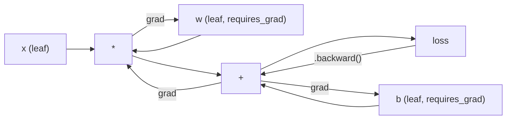
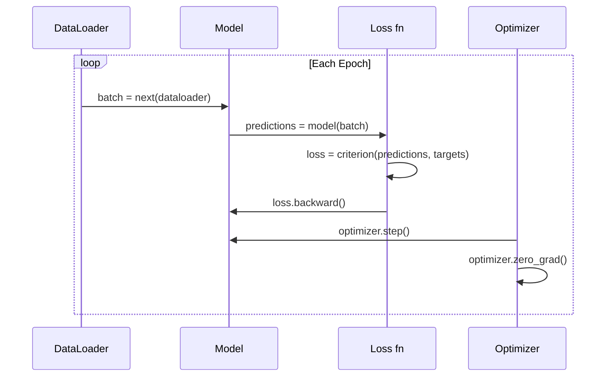

# معرفی پیتورچ

> تو موتور رو از پستون و کرکشاف ساخته بودي حالا ياد بگي اوني که همه واقعاً ميکنن

**Type:** Build
**Languages:** Python
**Prerequisites:** Lesson 03.10 (Build Your Own Mini Framework)
**Time:** ~75 minutes

## اهداف یادگیری

- ساخت و آموزش شبکه های عصبی با استفاده از nn.Module، nn.Sequential و autograd PyTorch
- استفاده از تنسورهای PyTorch، تسریع GPU و حلقه آموزش استاندارد (zero_grad، پیش، از دست دادن، عقب، مرحله)
- از اجزای فرمت کوچکی خود را به معادل های PyTorch تبدیل کنید
- پروفایل و مقایسه سرعت آموزش بین چارچوب خالص پایتون و PyTorch در همان کار

## مشکل

شما یک چارچوب کوچک کار می کنید. لایه های خطی، ReLU، dropout، batch norm، Adam، DataLoader، یک حلقه آموزشی. این یک شبکه چهار لایه را در یک مشکل طبقه بندی دایره در پایتون خالص آموزش می دهد.

همچنین 500 برابر کندتر از PyTorch در همان مشکل است.

این فریم ورک کوچک شما با حلقه های پایتون به صورت یک نمونه در یک زمان پردازش می کند. PyTorch همان عملیات را به هسته های C ++ / CUDA بهینه شده که بر روی GPU اجرا می شود ارسال می کند. در یک NVIDIA A100، PyTorch یک ResNet-50 (25.6M پارامتر) را در ImageNet (1.28M تصاویر) در حدود 6 ساعت آموزش می دهد. فریم ورک شما تقریباً 3000 ساعت برای انجام همان کار می برد - اگر ابتدا از حافظه اش تمام نشود.

سرعت تنها شکاف نیست. چارچوب شما هیچ پشتیبانی GPU ندارد. هیچ تفاوتی خودکار - شما دست به عقب نوشتید. برای هر ماژول. هیچ سریالیزاسیون. هیچ آموزش توزیع شده. هیچ دقت مخلوط. هیچ راهی برای اشکال زدایی جریان گرادینت بدون بیانیه های چاپ نیست.

PyTorch هر یک از این شکاف ها را پر می کند. و این کار را با حفظ دقیقا همان مدل ذهنی که قبلا ساخته اید انجام می دهد: ماژول، جلو((), پارامترهای((), عقب(), بهینه سازی. مرحله(). مفاهیم یک به یک انتقال می کنند. ترکیب تقریبا یکسان است. تفاوت این است که PyTorch یک دهه مهندسی سیستم را پشت همان رابط طراحی شده از ابتدا می پوشاند.

## مفهوم

### چرا پیتورچ برنده شد

در سال 2015، TensorFlow شما را مجبور کرد تا قبل از اجرای هر چیزی یک گراف محاسباتی جامد تعریف کنید. شما گراف را ساختید، آن را مرتب کردید، سپس داده ها را از طریق آن تغذیه کردید. Debugging به معنای نگاه کردن به تصویربرداری گراف بود. تغییر معماری به معنای بازسازی گراف از ابتدا بود.

PyTorch در سال 2017 با فلسفه ی متفاوتی راه اندازی شد: اجرای مشتاق. شما پایتون را می نویسید. آن را بلافاصله اجرا می کنید.`y = model(x)`در واقع در حال حاضر y را محاسبه می کند، نه "یک گره را به یک گراف اضافه کنید که بعدا y را محاسبه می کند". این بدان معنی است که ابزارهای دیبگینگ استاندارد پایتون کار کرده است. چاپ() کار کرده است. pdb کار کرده است. اگر / Else در گذرگاه پیش رو شما کار کرده است.

تا سال 2020، بازار صحبت کرده بود. سهم PyTorch در مقالات تحقیقاتی ML از 7٪ (2017) به بیش از 75٪ (2022) افزایش یافت. Meta، Google DeepMind، OpenAI، Anthropic و Hugging Face همه از PyTorch به عنوان چارچوب اصلی خود استفاده می کنند. TensorFlow 2.x به عنوان پاسخ اجرای مشتاق را اتخاذ کرد - اعتراف ساکت که طراحی PyTorch درست است.

درس: توسعه دهنده تجربه مرکبات. یک چارچوب که 10 درصد کندتر اما 50 درصد سریعتر برای ترمیم هر بار برنده می شود.

### تنسورها

یک تنسور یک آرایه چند بعدی با سه ویژگی مهم است: شکل، dtype و دستگاه.

```python
import torch

x = torch.zeros(3, 4)           # shape: (3, 4), dtype: float32, device: cpu
x = torch.randn(2, 3, 224, 224) # batch of 2 RGB images, 224x224
x = torch.tensor([1, 2, 3])     # from a Python list
```

**Shape**یک مقیاس شکل (), یک بردار (n) ، یک ماتریکس (m, n) ، یک دسته از تصاویر (بند، کانال، ارتفاع، عرض) است.

**Dtype**دقت و حافظه رو کنترل مي کنه

| dtype | Bits | Range | Use case |
|-------|------|-------|----------|
| float32 | 32 | ~7 decimal digits | Default training |
| float16 | 16 | ~3.3 decimal digits | Mixed precision |
| bfloat16 | 16 | Same range as float32, less precision | LLM training |
| int8 | 8 | -128 to 127 | Quantized inference |

**Device**تعیین می کند که محاسبه کجا اتفاق می افتد.

```python
device = torch.device("cuda" if torch.cuda.is_available() else "cpu")
x = torch.randn(3, 4, device=device)
x = x.to("cuda")
x = x.cpu()
```

هر عملیه تمام تنسورها را در یک دستگاه نیاز داره. این خطای اولی است که مبتدی های PyTorch به آن رسیده اند:`RuntimeError: Expected all tensors to be on the same device`. با حرکت همه چیز به همان دستگاه قبل از محاسبه درستش کن

**Reshaping**زمان ثابت است -- میتا داده ها را تغییر می دهد، نه داده ها.

```python
x = torch.randn(2, 3, 4)
x.view(2, 12)      # reshape to (2, 12) -- must be contiguous
x.reshape(6, 4)    # reshape to (6, 4) -- works always
x.permute(2, 0, 1) # reorder dimensions
x.unsqueeze(0)     # add dimension: (1, 2, 3, 4)
x.squeeze()        # remove size-1 dimensions
```

### آتوگراد

چارچوب کوچک شما نیاز به شما برای پیاده سازی به عقب برای هر ماژول. PyTorch نمی کند. آن را ثبت هر عملیات در تنسور به یک گراف آسیکل هدایت شده (گراف محاسباتی) و سپس عبور از آن گراف به عقب به حساب gradients به طور خودکار.



تفاوت اصلی از چارچوب شما: PyTorch از خودکار سازی مبتنی بر نوار استفاده می کند. هر عملیاتی در طول عبور جلو به یک "نوار" متصل می شود. تماس`.backward()`نوار رو به عقب باز مي کنه

```python
x = torch.randn(3, requires_grad=True)
y = x ** 2 + 3 * x
z = y.sum()
z.backward()
print(x.grad)  # dz/dx = 2x + 3
```

سه قانون اتوگريد:

1. فقط با داراي تانسور برگ`requires_grad=True`تراز های جمع آوری
2. درجه بندی ها به طور پیش فرض جمع می شوند -- تماس`optimizer.zero_grad()`قبل از هر گذرگاه عقب
3. `torch.no_grad()`ردیابی گرادینتی را غیرفعال می کند (استفاده در هنگام ارزیابی)

### nn.مودول

`nn.Module`این کلاس پایه برای هر قطعه شبکه عصبی در PyTorch است. شما قبلا این انتزاع را در درس 10 ساخته اید. نسخه PyTorch شامل ثبت پارامترهای خودکار، کشف ماژول های تکراری، مدیریت دستگاه و سریال سازی حالت است.

```python
import torch.nn as nn

class MLP(nn.Module):
    def __init__(self, input_dim, hidden_dim, output_dim):
        super().__init__()
        self.layer1 = nn.Linear(input_dim, hidden_dim)
        self.relu = nn.ReLU()
        self.layer2 = nn.Linear(hidden_dim, output_dim)

    def forward(self, x):
        x = self.layer1(x)
        x = self.relu(x)
        x = self.layer2(x)
        return x
```

وقتی یه کار رو انجام میدی`nn.Module`یا`nn.Parameter`به عنوان یک ویژگی در `__init__`،پایتورچ به طور خودکار ثبتش می کنه`model.parameters()`این دلیل است که شما هرگز مجبور نیستید وزن ها را به صورت دستی جمع آوری کنید مانند آنچه در چارچوب کوچک انجام می دهید.

قطعات اصلی ساختمان:

| Module | What it does | Parameters |
|--------|-------------|------------|
| nn.Linear(in, out) | Wx + b | in*out + out |
| nn.Conv2d(in_ch, out_ch, k) | 2D convolution | in_ch*out_ch*k*k + out_ch |
| nn.BatchNorm1d(features) | Normalize activations | 2 * features |
| nn.Dropout(p) | Random zeroing | 0 |
| nn.ReLU() | max(0, x) | 0 |
| nn.GELU() | Gaussian error linear | 0 |
| nn.Embedding(vocab, dim) | Lookup table | vocab * dim |
| nn.LayerNorm(dim) | Per-sample normalization | 2 * dim |

### عملکردهای از دست دادن و بهینه سازی

"پایتورچ" نسخه های آماده تولید از هر چیزی که ساختی را میفرستد.

**Loss functions**(از:`torch.nn`):

| Loss | Task | Input |
|------|------|-------|
| nn.MSELoss() | Regression | Any shape |
| nn.CrossEntropyLoss() | Multi-class classification | Logits (not softmax) |
| nn.BCEWithLogitsLoss() | Binary classification | Logits (not sigmoid) |
| nn.L1Loss() | Regression (robust) | Any shape |
| nn.CTCLoss() | Sequence alignment | Log probabilities |

يادداشت:`CrossEntropyLoss`ترکیب می کند`LogSoftmax`+ `NLLLoss`.در داخل .گروه هاي خام را عبور بده نه خروجي هاي نرم . اين اشتباه معمولي است که به طور خاموشي گرادينت هاي اشتباه را تولید مي کند

**Optimizers**(از:`torch.optim`):

| Optimizer | When to use | Typical LR |
|-----------|-------------|-----------|
| SGD(params, lr, momentum) | CNNs, well-tuned pipelines | 0.01--0.1 |
| Adam(params, lr) | Default starting point | 1e-3 |
| AdamW(params, lr, weight_decay) | Transformers, fine-tuning | 1e-4--1e-3 |
| LBFGS(params) | Small-scale, second-order | 1.0 |

### چرخه آموزش

هر حلقه آموزش PyTorch از همان 5 مرحله رو دنبال ميکنه.



الگوی قنونی:

```python
for epoch in range(num_epochs):
    model.train()
    for inputs, targets in train_loader:
        inputs, targets = inputs.to(device), targets.to(device)
        optimizer.zero_grad()
        outputs = model(inputs)
        loss = criterion(outputs, targets)
        loss.backward()
        optimizer.step()
```

پنج خط در داخل حلقه دسته پنج خط که آموزش GPT-4، انتشار پایدار و LLaMA. معماری تغییر می کند. داده ها تغییر می کند. این پنج خط تغییر نمی کند.

### مجموعه داده ها و DataLoader

"پایتورچ"`Dataset`یک کلاس انتزاعی با دو روش است: `__len__`و`__getitem__`.`DataLoader`با دسته بندی، مخلوط کردن و بارگذاری داده های چند فرآیند بسته می شود.

```python
from torch.utils.data import Dataset, DataLoader

class MNISTDataset(Dataset):
    def __init__(self, images, labels):
        self.images = images
        self.labels = labels

    def __len__(self):
        return len(self.labels)

    def __getitem__(self, idx):
        return self.images[idx], self.labels[idx]

loader = DataLoader(dataset, batch_size=64, shuffle=True, num_workers=4)
```

`num_workers=4`این فرآیند 4 فرآیند را برای بارگذاری داده ها به طور موازی در حالی که GPU در دسته فعلی ترن می شود. در بار کاری متصل به دیسک (تصاویر بزرگ، صوتی) ، این تنها می تواند سرعت آموزش را دو برابر کند.

### آموزش GPU

نقل مدل به GPU:

```python
device = torch.device("cuda" if torch.cuda.is_available() else "cpu")
model = model.to(device)
```

این به صورت تکراری هر پارامتر و بفر را به GPU منتقل می کند. سپس هر دسته را در طول آموزش حرکت می دهد:

```python
inputs, targets = inputs.to(device), targets.to(device)
```

**Mixed precision**استفاده از حافظه را در دو برابر می کند و در GPU های مدرن (A100، H100، RTX 4090)، با حرکت به جلو/پیچھے در float16 و در عین حال نگه داشتن وزنهای اصلی در float32، تولیدات را دو برابر می کند:

```python
from torch.amp import autocast, GradScaler

scaler = GradScaler()
for inputs, targets in loader:
    with autocast(device_type="cuda"):
        outputs = model(inputs)
        loss = criterion(outputs, targets)
    scaler.scale(loss).backward()
    scaler.step(optimizer)
    scaler.update()
    optimizer.zero_grad()
```

### مقایسه: مینی فریم ورک vs پیتورچ vs جیاکس

| Feature | Mini Framework (L10) | PyTorch | JAX |
|---------|---------------------|---------|-----|
| Autodiff | Manual backward() | Tape-based autograd | Functional transforms |
| Execution | Eager (Python loops) | Eager (C++ kernels) | Traced + JIT compiled |
| GPU support | No | Yes (CUDA, ROCm, MPS) | Yes (CUDA, TPU) |
| Speed (MNIST MLP) | ~300s/epoch | ~0.5s/epoch | ~0.3s/epoch |
| Module system | Custom Module class | nn.Module | Stateless functions (Flax/Equinox) |
| Debugging | print() | print(), pdb, breakpoint() | Harder (JIT tracing breaks print) |
| Ecosystem | None | Hugging Face, Lightning, timm | Flax, Optax, Orbax |
| Learning curve | You built it | Moderate | Steep (functional paradigm) |
| Production use | Toy problems | Meta, OpenAI, Anthropic, HF | Google DeepMind, Midjourney |

```figure
dropout-mask
```

## آن را بسازید

يه 3 لایه MLP آموزش داده شده در MNIST با استفاده از فقط PyTorch primitives.`torchvision.datasets`ما داده های خام رو خودمان دانلود و تجزیه می کنیم.

### مرحله ی اول: MNIST را از فایل های خام بارگذاری کنید

MNIST به عنوان 4 فایل gzipped ارسال می شود: تصاویر آموزش (60,000 x 28 x 28), برچسب های آموزش, تصاویر آزمایش (10,000 x 28 x 28), برچسب های آزمایش. ما آنها را دانلود و تجزیه و تحلیل فرمت دوگانه.

```python
import torch
import torch.nn as nn
import struct
import gzip
import urllib.request
import os

def download_mnist(path="./mnist_data"):
    base_url = "https://storage.googleapis.com/cvdf-datasets/mnist/"
    files = [
        "train-images-idx3-ubyte.gz",
        "train-labels-idx1-ubyte.gz",
        "t10k-images-idx3-ubyte.gz",
        "t10k-labels-idx1-ubyte.gz",
    ]
    os.makedirs(path, exist_ok=True)
    for f in files:
        filepath = os.path.join(path, f)
        if not os.path.exists(filepath):
            urllib.request.urlretrieve(base_url + f, filepath)

def load_images(filepath):
    with gzip.open(filepath, "rb") as f:
        magic, num, rows, cols = struct.unpack(">IIII", f.read(16))
        data = f.read()
        images = torch.frombuffer(bytearray(data), dtype=torch.uint8)
        images = images.reshape(num, rows * cols).float() / 255.0
    return images

def load_labels(filepath):
    with gzip.open(filepath, "rb") as f:
        magic, num = struct.unpack(">II", f.read(8))
        data = f.read()
        labels = torch.frombuffer(bytearray(data), dtype=torch.uint8).long()
    return labels
```

### مرحله دوم: نماد را تعریف کنید

3-طبقات MLP: 784 -> 256 -> 128 -> 10. فعال شدن ReLU. ترک برای تنظیم. هیچ استاندارد دسته ای برای حفظ آن ساده است.

```python
class MNISTModel(nn.Module):
    def __init__(self):
        super().__init__()
        self.net = nn.Sequential(
            nn.Linear(784, 256),
            nn.ReLU(),
            nn.Dropout(0.2),
            nn.Linear(256, 128),
            nn.ReLU(),
            nn.Dropout(0.2),
            nn.Linear(128, 10),
        )

    def forward(self, x):
        return self.net(x)
```

لایه خروجی 10 Logit خام (یک در هر رقم) تولید می کند. هیچ softmax -- `CrossEntropyLoss`اين موضوع رو در داخل اداره ميکنه

تعداد پارامتر: 784*256 + 256 + 256*128 + 128 + 128*10 + 10 = 235,146. کوچک با استانداردهای مدرن. GPT-2 کوچک 124M دارد. این قطار در ثانیه می چرخد.

### مرحله سوم: چرخه آموزش

الگوی پیش و پس و پس و پس و پس و پس و پس و پس و پس و پس و پس و پس

```python
def train_one_epoch(model, loader, criterion, optimizer, device):
    model.train()
    total_loss = 0
    correct = 0
    total = 0
    for images, labels in loader:
        images, labels = images.to(device), labels.to(device)
        optimizer.zero_grad()
        outputs = model(images)
        loss = criterion(outputs, labels)
        loss.backward()
        optimizer.step()
        total_loss += loss.item() * images.size(0)
        _, predicted = outputs.max(1)
        correct += predicted.eq(labels).sum().item()
        total += labels.size(0)
    return total_loss / total, correct / total


def evaluate(model, loader, criterion, device):
    model.eval()
    total_loss = 0
    correct = 0
    total = 0
    with torch.no_grad():
        for images, labels in loader:
            images, labels = images.to(device), labels.to(device)
            outputs = model(images)
            loss = criterion(outputs, labels)
            total_loss += loss.item() * images.size(0)
            _, predicted = outputs.max(1)
            correct += predicted.eq(labels).sum().item()
            total += labels.size(0)
    return total_loss / total, correct / total
```

يادداشت`torch.no_grad()`این کار خودترددی را غیرفعال می کند، استفاده از حافظه را کاهش می دهد و نتیجه گیری را سریع تر می کند. بدون آن، PyTorch یک نمودار محاسباتی را ایجاد می کند که هرگز استفاده نمی کنید.

### مرحله چهارم: همه چیز را با هم وصل کنید

```python
def main():
    device = torch.device("cuda" if torch.cuda.is_available() else "cpu")

    download_mnist()
    train_images = load_images("./mnist_data/train-images-idx3-ubyte.gz")
    train_labels = load_labels("./mnist_data/train-labels-idx1-ubyte.gz")
    test_images = load_images("./mnist_data/t10k-images-idx3-ubyte.gz")
    test_labels = load_labels("./mnist_data/t10k-labels-idx1-ubyte.gz")

    train_dataset = torch.utils.data.TensorDataset(train_images, train_labels)
    test_dataset = torch.utils.data.TensorDataset(test_images, test_labels)
    train_loader = torch.utils.data.DataLoader(
        train_dataset, batch_size=64, shuffle=True
    )
    test_loader = torch.utils.data.DataLoader(
        test_dataset, batch_size=256, shuffle=False
    )

    model = MNISTModel().to(device)
    criterion = nn.CrossEntropyLoss()
    optimizer = torch.optim.Adam(model.parameters(), lr=1e-3)

    num_params = sum(p.numel() for p in model.parameters())
    print(f"Device: {device}")
    print(f"Parameters: {num_params:,}")
    print(f"Train samples: {len(train_dataset):,}")
    print(f"Test samples: {len(test_dataset):,}")
    print()

    for epoch in range(10):
        train_loss, train_acc = train_one_epoch(
            model, train_loader, criterion, optimizer, device
        )
        test_loss, test_acc = evaluate(
            model, test_loader, criterion, device
        )
        print(
            f"Epoch {epoch+1:2d} | "
            f"Train Loss: {train_loss:.4f} | Train Acc: {train_acc:.4f} | "
            f"Test Loss: {test_loss:.4f} | Test Acc: {test_acc:.4f}"
        )

    torch.save(model.state_dict(), "mnist_mlp.pt")
    print(f"\nModel saved to mnist_mlp.pt")
    print(f"Final test accuracy: {test_acc:.4f}")
```

تولید انتظار می رود پس از 10 دوره: ~ 97.8٪ دقت آزمون. زمان تمرین در CPU: ~ 30 ثانیه. در GPU: ~ 5 ثانیه. در چارچوب کوچک با معماری مشابه: ~ 45 دقیقه.

## ازش استفاده کن

### مقایسه سریع: مینی فریم ورک vs PyTorch

| Mini Framework (Lesson 10) | PyTorch |
|---------------------------|---------|
| `model = Sequential(Linear(784, 256), ReLU(), ...)` | `model = nn.Sequential(nn.Linear(784, 256), nn.ReLU(), ...)` |
| `pred = model.forward(x)` | `pred = model(x)` |
| `optimizer.zero_grad()` | `optimizer.zero_grad()` |
| `grad = criterion.backward()` then `model.backward(grad)` | `loss.backward()` |
| `optimizer.step()` | `optimizer.step()` |
| No GPU | `model.to("cuda")` |
| Manual backward for every module | Autograd handles everything |

رابط تقريباً يه جوريه فرق اينه که همه چيز تحت هود هست

### مدل های ذخیره سازی و بارگذاری

```python
torch.save(model.state_dict(), "model.pt")

model = MNISTModel()
model.load_state_dict(torch.load("model.pt", weights_only=True))
model.eval()
```

همیشه نگه دار`state_dict()`(دکشنری پارامتر) ، نه شی مدل. ذخیره شی مدل با استفاده از مرطوب، که در هنگام تغییر کد شکسته می شود. دیکت های دولت قابل حمل هستند.

### برنامه ریزی نرخ یادگیری

```python
scheduler = torch.optim.lr_scheduler.CosineAnnealingLR(
    optimizer, T_max=10
)
for epoch in range(10):
    train_one_epoch(model, train_loader, criterion, optimizer, device)
    scheduler.step()
```

PyTorch 15 برنامه ریزی کننده را ارسال می کند: StepLR، ExponentialLR، CosineAnnealingLR، OneCycleLR، ReduceLROnPlateau. همه آنها به یک رابط بهینه سازی متصل می شوند.

## -باده

این درس دو اثر هنری را تولید می کند:

- `outputs/prompt-pytorch-debugger.md`-- یک پیام برای تشخیص شکست های رایج آموزش PyTorch
- `outputs/skill-pytorch-patterns.md`-- یک مرجع مهارت برای الگوهای آموزش PyTorch

## تمرینات

1. **Add batch normalization.**وارد کنید`nn.BatchNorm1d`بعد از هر لایه خطی (قبل از فعال شدن) دقت آزمایش و سرعت تمرین را در مقایسه با نسخه تنها ترک کنید.

2. **Implement a learning rate finder.**تمرین برای یک دوره با افزایش نمایی نرخ یادگیری (از 1e-7 به 1.0).

3. **Port to GPU with mixed precision.**اضافه کردن`torch.amp.autocast`و`GradScaler`در یک A100، انتظار ~ 2x سرعت را داشته باشید.

4. **Build a custom Dataset.**دانلود Fashion-MNIST (مثل فرمت MNIST اما با لباس)`FashionMNISTDataset(Dataset)`کلاس با `__getitem__`و`__len__`. تمرین کردن همان MLP و مقایسه دقت. مد-MNIST سخت تر است - انتظار ~88٪ در مقابل ~98٪.

5. **Replace Adam with SGD + momentum.**قطار با`SGD(params, lr=0.01, momentum=0.9)`. منحنیات تقارب را مقایسه کنید. سپس یک`CosineAnnealingLR`برنامه ریزی کنم و ببینم که آیا SGD تا عصر 10 به آدم دست می دهد

## اصطلاحات کلیدی

| Term | What people say | What it actually means |
|------|----------------|----------------------|
| Tensor | "A multi-dimensional array" | A typed, device-aware array with automatic differentiation support baked into every operation |
| Autograd | "Automatic backprop" | A tape-based system that records operations during forward pass, then replays them in reverse to compute exact gradients |
| nn.Module | "A layer" | The base class for any differentiable computation block -- registers parameters, supports nesting, handles train/eval modes |
| state_dict | "The model weights" | An OrderedDict mapping parameter names to tensors -- the portable, serializable representation of a trained model |
| .backward() | "Compute gradients" | Traverse the computational graph in reverse, computing and accumulating gradients for every leaf tensor with requires_grad=True |
| .to(device) | "Move to GPU" | Recursively transfer all parameters and buffers to the specified device (CPU, CUDA, MPS) |
| DataLoader | "The data pipeline" | An iterator that batches, shuffles, and optionally parallelizes data loading from a Dataset |
| Mixed precision | "Use float16" | Train with float16 forward/backward for speed while keeping float32 master weights for numerical stability |
| Eager execution | "Run it now" | Operations execute immediately when called, not deferred to a later compilation step -- the core design choice that differentiates PyTorch from TF 1.x |
| zero_grad | "Reset gradients" | Set all parameter gradients to zero before the next backward pass, since PyTorch accumulates gradients by default |

## خواندن بیشتر

- پاسک و همکارانش، "PyTorch: یک سبک ضروری، کتابخانه یادگیری عمیق با عملکرد بالا" (2019) - مقاله اصلی توضیح دهنده معامله های طراحی PyTorch
- آموزش های PyTorch: "تعلّم PyTorch با مثال" (https://pytorch.org/tutorials/beginner/pytorch_with_examples.html) -- مسیر رسمی از تنسورها به nn.Module
- راهنمای تنظیم عملکرد PyTorch (https://pytorch.org/tutorials/recipes/recipes/tuning_guide.html) -- دقت مخلوط، کارگران DataLoader، حافظه ی ثابت و دیگر بهینه سازی های تولید
- هراس هِ، "تعلّم عمیق را به کار می برد"https://horace.io/brrr_intro.html) -- چرا آموزش GPU سریع است، با استراتژی های بهینه سازی خاص PyTorch
