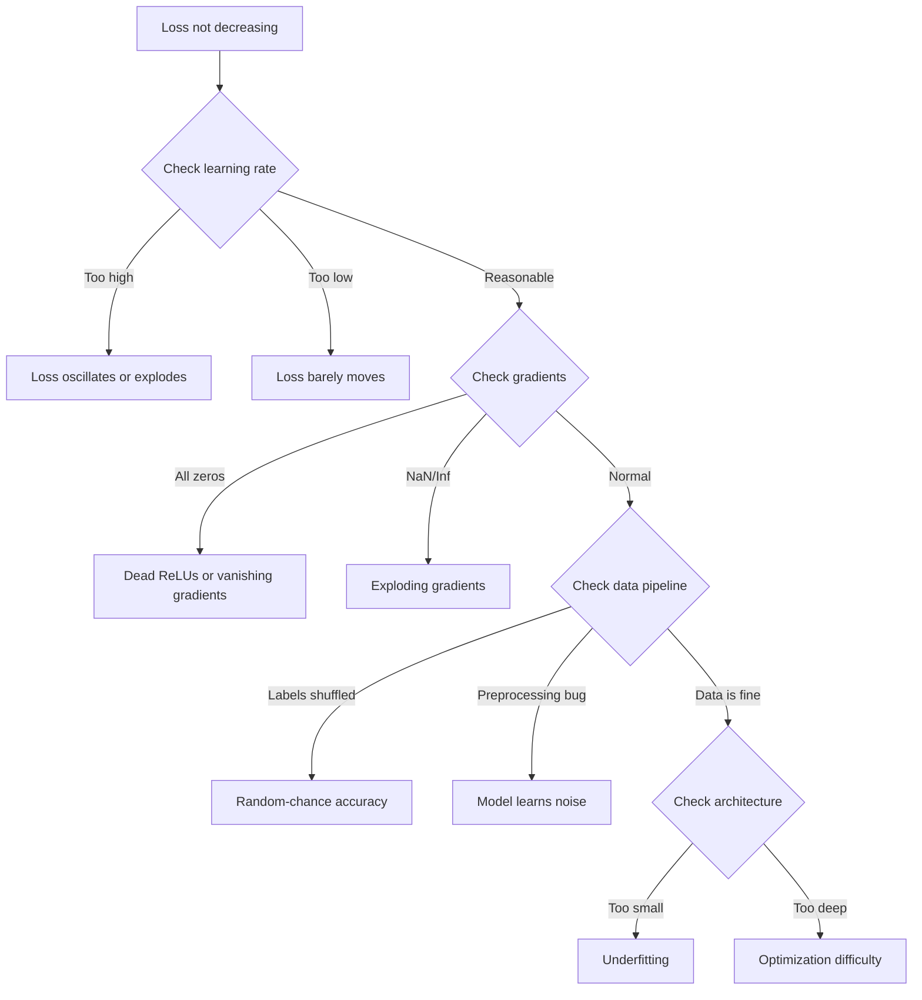
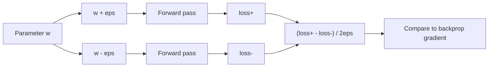
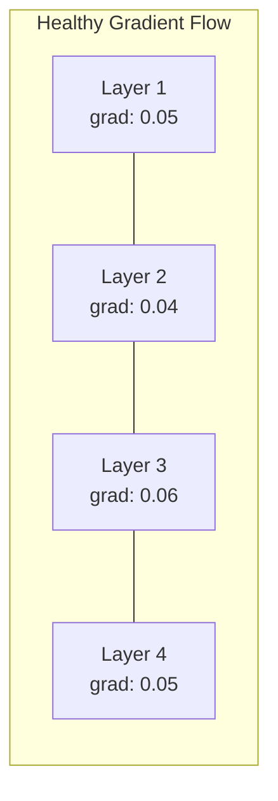
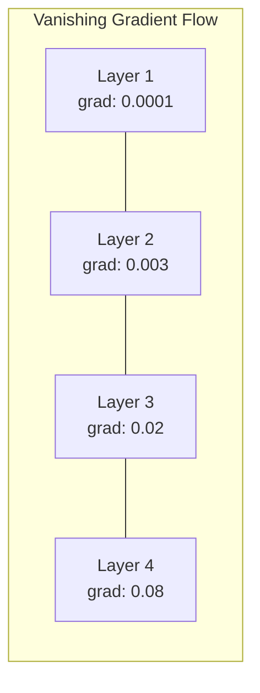
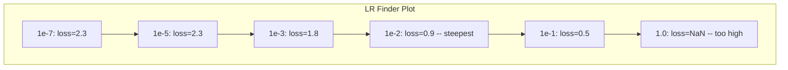

# اصلاح شبکه های عصبی

> شبکه شما جمع آوری شده است. اجرا شده است. تعداد تولید شده است. شماره اشتباه است و هیچ چیز سقوط نکرده است. خوش آمدید به سخت ترین نوع دیبگینگ - نوعی که هیچ پیام خطا وجود ندارد.

**Type:** Build
**Languages:** Python, PyTorch
**Prerequisites:** Phase 03 Lessons 01-10 (especially backpropagation, loss functions, optimizers)
**Time:** ~90 minutes

## اهداف یادگیری

- تشخیص شکست های شبکه عصبی رایج (نقش NaN، منحنی نقش مسطح، بیش از حد مناسب، نوسان) با استفاده از استراتژی های سیستماتیک اشکال زدایی
- استفاده از تکنیک "overfit one batch" برای بررسی اینکه معماری مدل و حلقه آموزش شما درست است
- بررسی بزرگی گرادینت، توزیع فعال سازی و نورمال وزن برای شناسایی مشکلات ناپدید شدن/فجر گرادینت
- ایجاد یک لیست چک کردن دیبگینگ که شامل خط لوله داده ها، معماری مدل، عملکرد از دست دادن، بهینه سازی و مشکلات نرخ یادگیری می شود

## مشکل

یک نرم افزار سنتی وقتی خراب شده خرابی می کند. یک اشاره صفر یک استثنا می گذارد. یک عدم مطابقت نوع در زمان مرتب کردن شکست می خورد. یک خطا یک به یک به طور واضح یک خروجی اشتباه تولید می کند.

شبکه های عصبی این لوکس را به شما نمی دهند.

شبکه عصبی شکسته تا پایان کار می کند، ارزش تلفات را چاپ می کند و پیش بینی ها را می سازد. ممکن است خسارت کاهش پیدا کند. پیش بینی ها ممکن است قابل قبول به نظر برسند. اما مدل به طور خاموش اشتباه است -- یادگیری میانگوشی ها، حفظ صدا، یا نزدیک شدن به حداقل محلی بی فایده. محققان گوگل تخمین زده اند که 60-70 درصد از زمان تخلفات ML در اشکال "خاموش" صرف می شود که هیچ خطایی ایجاد نمی کنند اما کیفیت مدل را کاهش می دهند.

تفاوت بین یک مدل کار و یک مدل خراب اغلب یک خط گم شده است: یک خط گمشده `zero_grad()`، یک ابعاد منتقل شده، نرخ یادگیری 10 برابر. "وصیه برای آموزش شبکه های عصبی" (2019) با این آغاز می شود: " شایع ترین اشتباهات شبکه عصبی، خطا هایی هستند که سقوط نمی کنند".

اين درس به تو مي آموزد که چطوري اون حشرات رو پيدا کني

## مفهوم

### طرز فکر اشتباه

از دیبگینگ چاپ و پرای فراموش کنید. دیبگینگ شبکه عصبی نیازمند رویکرد سیستماتیک است زیرا حلقه بازخورد کند است (دقیقه ها تا ساعت ها در هر تمرین) و علائم مبهم است (خسارت بد می تواند 20 چیز مختلف را معنی داشته باشد).

قانون طلایی:**start simple, add complexity one piece at a time, and verify each piece independently.**



### علائم اول: کاهش ضایعات

این شایع ترین شکایت است که چرخه تمرین ادامه می یابد، دوره ها می گذرد و خسارت ثابت می ماند یا به شدت نوسان می کند.

**Wrong learning rate.**برای آدم، از 1e-3 شروع کنید. برای SGD، از 1e-1 یا 1e-2 شروع کنید. همیشه 3 نرخ یادگیری را امتحان کنید که هر کدام 10 برابر است (به عنوان مثال، 1e-2, 1e-3, 1e-4) قبل از اینکه نتیجه بگیرید چیزی دیگر اشتباه است.

**Dead ReLUs.**اگر یک نورون ReLU ورودی منفی بزرگ دریافت کند، 0 را خارج می کند و گرادیانت آن 0 است. هرگز دوباره فعال نمی شود. اگر نورون های کافی مرده باشند، شبکه نمی تواند یاد بگیرد. چک کنید: بخش فعال سازی هایی که دقیقاً 0 بعد از هر لایه ReLU هستند را چاپ کنید. اگر >50٪ مرده باشند، به LeakyReLU بروید یا نرخ یادگیری را کاهش دهید.

**Vanishing gradients.**در شبکه های عمیق با فعال سازی سیگمائید یا تان، گرادیانت ها به سرعت به سرعت به عقب کاهش می یابند. وقتی به لایه اول می رسند، آنها ~ 0 هستند. لایه های اول یادگیری را متوقف می کنند. اصلاح: از ReLU / GELU استفاده کنید، ارتباطات باقیمانده را اضافه کنید یا از عادی سازی دسته استفاده کنید.

**Exploding gradients.**مشکل برعکس - گرادینت ها به طور نمایی رشد می کنند. در RNN ها و شبکه های بسیار عمیق رایج است. از دست دادن به NaN می رود.`torch.nn.utils.clip_grad_norm_`), نرخ یادگیری پایین تر، یا اضافه کردن نورمال سازی.

### علامت دوم: کاهش خسارت اما مدل بد

.وگرنه، از دست دادن به 99 درصد، اما از دست دادن به 55 درصد، وگرنه مدل به نتایج بی معنی از داده های واقعی می رسد

**Overfitting.**این مدل اطلاعات آموزشی را به جای الگوهای یادگیری به یاد می آورد. شکاف بین آموزش و از دست دادن اعتبار با گذشت زمان افزایش می یابد. اصلاح: اطلاعات بیشتر، ترک، کاهش وزن، توقف زودرس، افزایش داده ها.

**Data leakage.**داده های تست در آموزش نفوذ کرده است. دقت بسیار زیاد است. علل رایج: مخلوط کردن قبل از تقسیم، پردازش پیش از آماری از مجموعه داده های کامل، نمونه های تکراری در میان تقسیم ها. تصحیح: تقسیم اول، پردازش پیش از دو، چک برای تکراری.

**Label errors.**۵ تا ۱۰ درصد از برچسب ها در اکثر مجموعه داده های واقعی اشتباه هستند (Northcutt و همکاران، ۲۰۲۱ - "خطای گسترده برچسب در مجموعه های آزمایش"). مدل از صدا یاد می گیرد. اصلاح: از یادگیری مطمئن برای پیدا کردن و اصلاح نمونه های نامزدی استفاده کنید، یا از کاهش خسارت برای نادیده گرفتن نمونه های با ضرر بالا استفاده کنید.

### علائم سوم: NaN یا Inf در خسارت

ارزش خسارت به `nan`یا`inf`آموزش تموم شده

**Learning rate too high.**تازه ها تا اين حد که وزنه ها منفجر بشه، از حد بالا رفت

**log(0) or log(negative).**شمارش های از دست دادن کراس انترپی `log(p)`اگر مدل شما به طور دقیق 0 یا احتمال منفی برسد، سوابق انفجار می کند.`[eps, 1-eps]`کجا`eps=1e-7`. .

**Division by zero.**استاندارد سازی دسته با انحراف استاندارد تقسیم می شود. یک دسته با ارزش های ثابت std=0 دارد. درست: اضافه کردن epsilon به نامگذاری (PyTorch این کار را به طور پیش فرض انجام می دهد، اما پیاده سازی های سفارشی ممکن است انجام نشود).

**Numerical overflow.**فعاليت هاي بزرگ به داخل داده شده`exp()`نرم ترین مقدار به خصوص مستعد است. درست: قبل از نمادگذاری حداکثر را از دست بدهید (ترک log-sum-exp).

### تکنیک ۱: بررسی درجه بندی

گرادینت های تحلیلی خود را (از پشت پشت) با گرادینت های عددی (از تفاوت های محدود) مقایسه کنید. اگر با آنها مخالف باشند، پاس عقب شما یک خطای دارد.

تراز عددی برای پارامتر `w`:

```
grad_numerical = (loss(w + eps) - loss(w - eps)) / (2 * eps)
```

متریک توافق (فرق نسبی):

```
rel_diff = |grad_analytical - grad_numerical| / max(|grad_analytical|, |grad_numerical|, 1e-8)
```

اگه`rel_diff < 1e-5`درست است.`rel_diff > 1e-3`تقریباً حتماً يه حشره



### تکنیک 2: آمار فعال سازی

در طول آموزش، میانگین و انحراف استاندارد فعال سازی ها را پس از هر لایه کنترل کنید. شبکه های سالم فعال سازی را با میانگین نزدیک به 0 و std نزدیک به 1 (پس از نرمال سازی) یا حداقل محدود نگه می دارند.

| Health indicator | Mean | Std | Diagnosis |
|-----------------|------|-----|-----------|
| Healthy | ~0 | ~1 | Network is learning normally |
| Saturated | >>0 or <<0 | ~0 | Activations stuck at extreme values |
| Dead | 0 | 0 | Neurons are dead (all zeros) |
| Exploding | >>10 | >>10 | Activations growing without bound |

### تکنیک سوم: تصویربرداری جریان درجه

در یک شبکه سالم، مقادیر گرادینت باید تقریباً مشابه در سراسر لایه ها باشد. اگر لایه های اولیه گرادینت 1000 برابر کوچکتر از لایه های بعدی داشته باشند، گرادینت های ناپدید می شوند.





### تکنیک چهارم: آزمایش بیش از حد مناسب یک دسته

مهم ترین تکنیک تخمینی در یادگیری عمیق

یک دسته کوچک (8-32 نمونه) را بگیرید. روی آن برای 100 تکرار بیشتر تمرین کنید. ضایعه باید به صفر نزدیک شود و دقت آموزش باید به 100 درصد برسد. اگر این کار را نکند، مدل یا حلقه آموزش شما یک خطای اساسی دارد - به آموزش کامل ادامه ندهید.

این آزمایش نشان می دهد:
- عملکردهای شکست خورده
- گذرگاه های عقب شکسته شده
- معماری خیلی کوچک برای نمایش داده ها
- بهینه سازی کننده که به پارامترهای مدل متصل نیست
- داده ها و برچسب ها اشتباه است

این کار 30 ثانیه طول می کشد تا اجرا شود و ساعت ها از بازیابی کامل تمرینات را صرفه جویی می کند.

### تکنیک ۵: سنجش نرخ یادگیری

لزلی اسمیت (2017) پیشنهاد کرد که نرخ یادگیری را از بسیار کوچک (1e-7) به بسیار بزرگ (10) در طول یک دوره در حالی که از دست دادن را ثبت می کند.



بهترین LR در این مثال: ~1e-3 (یک حکم از شدت قبل از عمق ترین نقطه).

### حشرات رایج پایتورچ

اين ها حرومزادهايي هستن که بيشترين ساعت ها رو در جامعه PyTorch تلف ميکنن:

| Bug | Symptom | Fix |
|-----|---------|-----|
| Forgetting `optimizer.zero_grad()` | Gradients accumulate across batches, loss oscillates | Add `optimizer.zero_grad()` before `loss.backward()` |
| Forgetting `model.eval()` at test time | Dropout and batch norm behave differently, test accuracy varies between runs | Add `model.eval()` and `torch.no_grad()` |
| Wrong tensor shapes | Silent broadcasting produces wrong results, no error | Print shapes after every operation during debugging |
| CPU/GPU mismatch | `RuntimeError: expected CUDA tensor` | Use `.to(device)` on model AND data |
| Not detaching tensors | Computation graph grows forever, OOM | Use `.detach()` or `with torch.no_grad()` |
| In-place operations breaking autograd | `RuntimeError: modified by in-place operation` | Replace `x += 1` with `x = x + 1` |
| Data not normalized | Loss stuck at random-chance level | Normalize inputs to mean=0, std=1 |
| Labels as wrong dtype | Cross-entropy expects `Long`, got `Float` | Cast labels: `labels.long()` |

### میز اصلی اصلاح خطا

| Symptom | Likely cause | First thing to try |
|---------|-------------|-------------------|
| Loss stuck at -log(1/num_classes) | Model predicting uniform distribution | Check data pipeline, verify labels match inputs |
| Loss NaN after a few steps | Learning rate too high | Reduce LR by 10x |
| Loss NaN immediately | log(0) or division by zero | Add epsilon to log/division operations |
| Loss oscillating wildly | LR too high or batch size too small | Reduce LR, increase batch size |
| Loss decreasing then plateaus | LR too high for fine-tuning phase | Add LR schedule (cosine or step decay) |
| Training acc high, test acc low | Overfitting | Add dropout, weight decay, more data |
| Training acc = test acc = chance | Model not learning anything | Run overfit-one-batch test |
| Training acc = test acc but both low | Underfitting | Bigger model, more layers, more features |
| Gradients all zero | Dead ReLUs or detached computation graph | Switch to LeakyReLU, check `.requires_grad` |
| Out of memory during training | Batch too large or graph not freed | Reduce batch size, use `torch.no_grad()` for eval |

```figure
learning-curves
```

## آن را بسازید

یک ابزار تشخیصی که فعال سازی ها، گرادینت ها و منحنیات از دست دادن را نظارت می کند. شما به طور عمدی یک شبکه را شکسته و از ابزار استفاده می کنید تا هر مشکل را تشخیص دهید.

### مرحله اول: کلاس NetworkDebugger

به یک مدل PyTorch برای ثبت فعالیت و آمار گرادینت در هر لایه متصل می شود.

```python
import torch
import torch.nn as nn
import math


class NetworkDebugger:
    def __init__(self, model):
        self.model = model
        self.activation_stats = {}
        self.gradient_stats = {}
        self.loss_history = []
        self.lr_losses = []
        self.hooks = []
        self._register_hooks()

    def _register_hooks(self):
        for name, module in self.model.named_modules():
            if isinstance(module, (nn.Linear, nn.Conv2d, nn.ReLU, nn.LeakyReLU)):
                hook = module.register_forward_hook(self._make_activation_hook(name))
                self.hooks.append(hook)
                hook = module.register_full_backward_hook(self._make_gradient_hook(name))
                self.hooks.append(hook)

    def _make_activation_hook(self, name):
        def hook(module, input, output):
            with torch.no_grad():
                out = output.detach().float()
                self.activation_stats[name] = {
                    "mean": out.mean().item(),
                    "std": out.std().item(),
                    "fraction_zero": (out == 0).float().mean().item(),
                    "min": out.min().item(),
                    "max": out.max().item(),
                }
        return hook

    def _make_gradient_hook(self, name):
        def hook(module, grad_input, grad_output):
            if grad_output[0] is not None:
                with torch.no_grad():
                    grad = grad_output[0].detach().float()
                    self.gradient_stats[name] = {
                        "mean": grad.mean().item(),
                        "std": grad.std().item(),
                        "abs_mean": grad.abs().mean().item(),
                        "max": grad.abs().max().item(),
                    }
        return hook

    def record_loss(self, loss_value):
        self.loss_history.append(loss_value)

    def check_loss_health(self):
        if len(self.loss_history) < 2:
            return "NOT_ENOUGH_DATA"
        recent = self.loss_history[-10:]
        if any(math.isnan(v) or math.isinf(v) for v in recent):
            return "NAN_OR_INF"
        if len(self.loss_history) >= 20:
            first_half = sum(self.loss_history[:10]) / 10
            second_half = sum(self.loss_history[-10:]) / 10
            if second_half >= first_half * 0.99:
                return "NOT_DECREASING"
        if len(recent) >= 5:
            diffs = [recent[i+1] - recent[i] for i in range(len(recent)-1)]
            if max(diffs) - min(diffs) > 2 * abs(sum(diffs) / len(diffs)):
                return "OSCILLATING"
        return "HEALTHY"

    def check_activations(self):
        issues = []
        for name, stats in self.activation_stats.items():
            if stats["fraction_zero"] > 0.5:
                issues.append(f"DEAD_NEURONS: {name} has {stats['fraction_zero']:.0%} zero activations")
            if abs(stats["mean"]) > 10:
                issues.append(f"EXPLODING_ACTIVATIONS: {name} mean={stats['mean']:.2f}")
            if stats["std"] < 1e-6:
                issues.append(f"COLLAPSED_ACTIVATIONS: {name} std={stats['std']:.2e}")
        return issues if issues else ["HEALTHY"]

    def check_gradients(self):
        issues = []
        grad_magnitudes = []
        for name, stats in self.gradient_stats.items():
            grad_magnitudes.append((name, stats["abs_mean"]))
            if stats["abs_mean"] < 1e-7:
                issues.append(f"VANISHING_GRADIENT: {name} abs_mean={stats['abs_mean']:.2e}")
            if stats["abs_mean"] > 100:
                issues.append(f"EXPLODING_GRADIENT: {name} abs_mean={stats['abs_mean']:.2e}")
        if len(grad_magnitudes) >= 2:
            first_mag = grad_magnitudes[0][1]
            last_mag = grad_magnitudes[-1][1]
            if last_mag > 0 and first_mag / last_mag > 100:
                issues.append(f"GRADIENT_RATIO: first/last = {first_mag/last_mag:.0f}x (vanishing)")
        return issues if issues else ["HEALTHY"]

    def print_report(self):
        print("\n=== NETWORK DEBUGGER REPORT ===")
        print(f"\nLoss health: {self.check_loss_health()}")
        if self.loss_history:
            print(f"  Last 5 losses: {[f'{v:.4f}' for v in self.loss_history[-5:]]}")
        print("\nActivation diagnostics:")
        for item in self.check_activations():
            print(f"  {item}")
        print("\nGradient diagnostics:")
        for item in self.check_gradients():
            print(f"  {item}")
        print("\nPer-layer activation stats:")
        for name, stats in self.activation_stats.items():
            print(f"  {name}: mean={stats['mean']:.4f} std={stats['std']:.4f} zero={stats['fraction_zero']:.1%}")
        print("\nPer-layer gradient stats:")
        for name, stats in self.gradient_stats.items():
            print(f"  {name}: abs_mean={stats['abs_mean']:.2e} max={stats['max']:.2e}")

    def remove_hooks(self):
        for hook in self.hooks:
            hook.remove()
        self.hooks.clear()
```

### مرحله دوم: آزمایش بیش از حد مناسب

```python
def overfit_one_batch(model, x_batch, y_batch, criterion, lr=0.01, steps=200):
    optimizer = torch.optim.Adam(model.parameters(), lr=lr)
    model.train()
    print("\n=== OVERFIT ONE BATCH TEST ===")
    print(f"Batch size: {x_batch.shape[0]}, Steps: {steps}")

    for step in range(steps):
        optimizer.zero_grad()
        output = model(x_batch)
        loss = criterion(output, y_batch)
        loss.backward()
        optimizer.step()

        if step % 50 == 0 or step == steps - 1:
            with torch.no_grad():
                preds = (output > 0).float() if output.shape[-1] == 1 else output.argmax(dim=1)
                targets = y_batch if y_batch.dim() == 1 else y_batch.squeeze()
                acc = (preds.squeeze() == targets).float().mean().item()
            print(f"  Step {step:3d} | Loss: {loss.item():.6f} | Accuracy: {acc:.1%}")

    final_loss = loss.item()
    if final_loss > 0.1:
        print(f"\n  FAIL: Loss did not converge ({final_loss:.4f}). Model or training loop is broken.")
        return False
    print(f"\n  PASS: Loss converged to {final_loss:.6f}")
    return True
```

### مرحله سوم: شرح یادگیری

```python
def find_learning_rate(model, x_data, y_data, criterion, start_lr=1e-7, end_lr=10, steps=100):
    import copy
    original_state = copy.deepcopy(model.state_dict())
    optimizer = torch.optim.SGD(model.parameters(), lr=start_lr)
    lr_mult = (end_lr / start_lr) ** (1 / steps)

    model.train()
    results = []
    best_loss = float("inf")
    current_lr = start_lr

    print("\n=== LEARNING RATE FINDER ===")

    for step in range(steps):
        optimizer.zero_grad()
        output = model(x_data)
        loss = criterion(output, y_data)

        if math.isnan(loss.item()) or loss.item() > best_loss * 10:
            break

        best_loss = min(best_loss, loss.item())
        results.append((current_lr, loss.item()))

        loss.backward()
        optimizer.step()

        current_lr *= lr_mult
        for param_group in optimizer.param_groups:
            param_group["lr"] = current_lr

    model.load_state_dict(original_state)

    if len(results) < 10:
        print("  Could not complete LR sweep -- loss diverged too quickly")
        return results

    min_loss_idx = min(range(len(results)), key=lambda i: results[i][1])
    suggested_lr = results[max(0, min_loss_idx - 10)][0]

    print(f"  Swept {len(results)} steps from {start_lr:.0e} to {results[-1][0]:.0e}")
    print(f"  Minimum loss {results[min_loss_idx][1]:.4f} at lr={results[min_loss_idx][0]:.2e}")
    print(f"  Suggested learning rate: {suggested_lr:.2e}")

    return results
```

### مرحله چهارم: بررسی درجه

```python
def _flat_to_multi_index(flat_idx, shape):
    multi_idx = []
    remaining = flat_idx
    for dim in reversed(shape):
        multi_idx.insert(0, remaining % dim)
        remaining //= dim
    return tuple(multi_idx)


def gradient_check(model, x, y, criterion, eps=1e-4):
    model.train()
    x_double = x.double()
    y_double = y.double()
    model_double = model.double()

    print("\n=== GRADIENT CHECK ===")
    overall_max_diff = 0
    checked = 0

    for name, param in model_double.named_parameters():
        if not param.requires_grad:
            continue

        layer_max_diff = 0

        model_double.zero_grad()
        output = model_double(x_double)
        loss = criterion(output, y_double)
        loss.backward()
        analytical_grad = param.grad.clone()

        num_checks = min(5, param.numel())
        for i in range(num_checks):
            idx = _flat_to_multi_index(i, param.shape)
            original = param.data[idx].item()

            param.data[idx] = original + eps
            with torch.no_grad():
                loss_plus = criterion(model_double(x_double), y_double).item()

            param.data[idx] = original - eps
            with torch.no_grad():
                loss_minus = criterion(model_double(x_double), y_double).item()

            param.data[idx] = original

            numerical = (loss_plus - loss_minus) / (2 * eps)
            analytical = analytical_grad[idx].item()

            denom = max(abs(numerical), abs(analytical), 1e-8)
            rel_diff = abs(numerical - analytical) / denom

            layer_max_diff = max(layer_max_diff, rel_diff)
            checked += 1

        overall_max_diff = max(overall_max_diff, layer_max_diff)
        status = "OK" if layer_max_diff < 1e-5 else "MISMATCH"
        print(f"  {name}: max_rel_diff={layer_max_diff:.2e} [{status}]")

    model.float()

    print(f"\n  Checked {checked} parameters")
    if overall_max_diff < 1e-5:
        print("  PASS: Gradients match (rel_diff < 1e-5)")
    elif overall_max_diff < 1e-3:
        print("  WARN: Small differences (1e-5 < rel_diff < 1e-3)")
    else:
        print("  FAIL: Gradient mismatch detected (rel_diff > 1e-3)")
    return overall_max_diff
```

### مرحله پنجم: شبکه های عمدا شکسته شده

حالا ابزارها را به شبکه های شکسته ای اعمال کنید و هر یک را تشخیص دهید.

```python
def demo_broken_networks():
    torch.manual_seed(42)
    x = torch.randn(64, 10)
    y = (x[:, 0] > 0).long()

    print("\n" + "=" * 60)
    print("BUG 1: Learning rate too high (lr=10)")
    print("=" * 60)
    model1 = nn.Sequential(nn.Linear(10, 32), nn.ReLU(), nn.Linear(32, 2))
    debugger1 = NetworkDebugger(model1)
    optimizer1 = torch.optim.SGD(model1.parameters(), lr=10.0)
    criterion = nn.CrossEntropyLoss()
    for step in range(20):
        optimizer1.zero_grad()
        out = model1(x)
        loss = criterion(out, y)
        debugger1.record_loss(loss.item())
        loss.backward()
        optimizer1.step()
    debugger1.print_report()
    debugger1.remove_hooks()

    print("\n" + "=" * 60)
    print("BUG 2: Dead ReLUs from bad initialization")
    print("=" * 60)
    model2 = nn.Sequential(nn.Linear(10, 32), nn.ReLU(), nn.Linear(32, 32), nn.ReLU(), nn.Linear(32, 2))
    with torch.no_grad():
        for m in model2.modules():
            if isinstance(m, nn.Linear):
                m.weight.fill_(-1.0)
                m.bias.fill_(-5.0)
    debugger2 = NetworkDebugger(model2)
    optimizer2 = torch.optim.Adam(model2.parameters(), lr=1e-3)
    for step in range(50):
        optimizer2.zero_grad()
        out = model2(x)
        loss = criterion(out, y)
        debugger2.record_loss(loss.item())
        loss.backward()
        optimizer2.step()
    debugger2.print_report()
    debugger2.remove_hooks()

    print("\n" + "=" * 60)
    print("BUG 3: Missing zero_grad (gradients accumulate)")
    print("=" * 60)
    model3 = nn.Sequential(nn.Linear(10, 32), nn.ReLU(), nn.Linear(32, 2))
    debugger3 = NetworkDebugger(model3)
    optimizer3 = torch.optim.SGD(model3.parameters(), lr=0.01)
    for step in range(50):
        out = model3(x)
        loss = criterion(out, y)
        debugger3.record_loss(loss.item())
        loss.backward()
        optimizer3.step()
    debugger3.print_report()
    debugger3.remove_hooks()

    print("\n" + "=" * 60)
    print("HEALTHY NETWORK: Correct setup for comparison")
    print("=" * 60)
    model_good = nn.Sequential(nn.Linear(10, 32), nn.ReLU(), nn.Linear(32, 2))
    debugger_good = NetworkDebugger(model_good)
    optimizer_good = torch.optim.Adam(model_good.parameters(), lr=1e-3)
    for step in range(50):
        optimizer_good.zero_grad()
        out = model_good(x)
        loss = criterion(out, y)
        debugger_good.record_loss(loss.item())
        loss.backward()
        optimizer_good.step()
    debugger_good.print_report()
    debugger_good.remove_hooks()

    print("\n" + "=" * 60)
    print("OVERFIT-ONE-BATCH TEST (healthy model)")
    print("=" * 60)
    model_test = nn.Sequential(nn.Linear(10, 32), nn.ReLU(), nn.Linear(32, 2))
    overfit_one_batch(model_test, x[:8], y[:8], criterion)

    print("\n" + "=" * 60)
    print("LEARNING RATE FINDER")
    print("=" * 60)
    model_lr = nn.Sequential(nn.Linear(10, 32), nn.ReLU(), nn.Linear(32, 2))
    find_learning_rate(model_lr, x, y, criterion)

    print("\n" + "=" * 60)
    print("GRADIENT CHECK")
    print("=" * 60)
    model_grad = nn.Sequential(nn.Linear(10, 8), nn.ReLU(), nn.Linear(8, 2))
    gradient_check(model_grad, x[:4], y[:4], criterion)
```

## ازش استفاده کن

### ابزار های ساخته شده PyTorch

```python
import torch
import torch.nn as nn

model = nn.Sequential(
    nn.Linear(768, 256),
    nn.ReLU(),
    nn.Linear(256, 10),
)

with torch.autograd.detect_anomaly():
    output = model(input_tensor)
    loss = criterion(output, target)
    loss.backward()

for name, param in model.named_parameters():
    if param.grad is not None:
        print(f"{name}: grad_mean={param.grad.abs().mean():.2e}")
```

### ادغام وزن و تعصب

```python
import wandb

wandb.init(project="debug-training")

for epoch in range(100):
    loss = train_one_epoch()
    wandb.log({
        "loss": loss,
        "lr": optimizer.param_groups[0]["lr"],
        "grad_norm": torch.nn.utils.clip_grad_norm_(model.parameters(), float("inf")),
    })

    for name, param in model.named_parameters():
        if param.grad is not None:
            wandb.log({f"grad/{name}": wandb.Histogram(param.grad.cpu().numpy())})
```

### صفحه تنسور

```python
from torch.utils.tensorboard import SummaryWriter

writer = SummaryWriter("runs/debug_experiment")

for epoch in range(100):
    loss = train_one_epoch()
    writer.add_scalar("Loss/train", loss, epoch)

    for name, param in model.named_parameters():
        writer.add_histogram(f"weights/{name}", param, epoch)
        if param.grad is not None:
            writer.add_histogram(f"gradients/{name}", param.grad, epoch)
```

### فهرست چک کردن اشکال (قبل از آموزش کامل)

1. تست یک دسته بیش از حد انجام بده اگه شکست خورد، متوقف شو
2. خلاصه مدل چاپ - تعداد پارامترها را تایید کنید منطقی است.
3. یک مرور پیش رو با داده های تصادفی اجرا کنید -- شکل خروجی را بررسی کنید.
4. 5 دوره قطار - از دست دادن کاهش را تایید کنید
5. آمار فعاليت رو چک کن، هيچ لایه مرده اي، هيچ انفجاري نيست.
6. جریان گرادینت رو چک کن، نه ناپدید شدن، نه انفجار.
7. لوله داده ها را بررسی کنید -- 5 نمونه تصادفی با برچسب چاپ کنید.

## -باده

این درس نتیجه می دهد:
- `outputs/prompt-nn-debugger.md`-- یک پیام برای تشخیص شکست های آموزش شبکه عصبی
- `outputs/skill-debug-checklist.md`-- یک لیست چک درخت تصمیم برای مشکلات آموزش های دیبگینگ

الگوهای اصلی انتشار برای دیبگینگ:
- اضافه کردن هک های نظارت به اسکریپت های آموزش تولید
- فعال سازی روزنامه و آمار گرادینت به W&B یا TensorBoard هر N قدم
- اجرای هشدارهای خودکار برای از دست دادن NaN، نورون های مرده (> 80٪ صفر) یا انفجار گرادینت
- همیشه هنگام تغییر معماری یا لوله های داده، تست یک دسته بیش از حد مناسب را اجرا کنید

## تمرینات

1. **Add an exploding gradient detector.**تغییر دادن `NetworkDebugger`برای تشخیص زمانی که گرادینت ها از حد عبور کنند و به طور خودکار یک مقدار تراش گرادینت را پیشنهاد کنند. آن را در یک شبکه 20 لایه بدون نرمال سازی آزمایش کنید.

2. **Build a dead neuron resurrector.**یک تابع بنویسید که نورون های مرده ReLU را شناسایی کند (همیشه 0 را خارج می کند) و با شروع کار کایمینگ وزنه های وارد شده را دوباره شروع کند. نشان دهید که این شبکه ای را که > 70% نورون ها مرده است بازمی گرداند.

3. **Implement the learning rate finder with plotting.**طولاني`find_learning_rate`برای ذخیره نتایج به عنوان یک CSV و نوشتن یک اسکریپت جداگانه که CSV را می خواند و منحنی LR در مقابل ضرر را با استفاده از matplotlib نشان می دهد. برای ResNet-18 در CIFAR-10 بهترین LR را شناسایی کنید.

4. **Create a data pipeline validator.**یک تابع بنویسید که برای: نمونه های تکراری در میان قطعات قطار/تخت، عدم تعادل توزیع برچسب (> نسبت 10: 1) ، نرمال سازی ورودی (متوسط نزدیک به 0، std نزدیک به 1) و ارزش های NaN/Inf در داده ها را بررسی کند. آن را در مجموعه داده های به عمد فاسد اجرا کنید.

5. **Debug a real failure.**از چارچوب کوچک در درس 10 استفاده کنید، یک خطا ظریف را معرفی کنید (به عنوان مثال، ماتریس وزن را به عقب منتقل کنید) و از بررسی گرادیانت برای یافتن دقیقاً کدام پارامتر گرادیانت نادرست دارد استفاده کنید. فرآیند دیبگینگ را مستند کنید.

## اصطلاحات کلیدی

| Term | What people say | What it actually means |
|------|----------------|----------------------|
| Silent bug | "It runs but gives bad results" | A bug that produces no error but degrades model quality -- the dominant failure mode in ML |
| Dead ReLU | "The neurons died" | A ReLU neuron whose input is always negative, so it outputs 0 and receives 0 gradient permanently |
| Vanishing gradients | "Early layers stop learning" | Gradients shrink exponentially through layers, making weights in early layers effectively frozen |
| Exploding gradients | "Loss went to NaN" | Gradients grow exponentially through layers, causing weight updates so large they overflow |
| Gradient checking | "Verify backprop is correct" | Comparing analytical gradients from backprop to numerical gradients from finite differences |
| Overfit-one-batch | "The most important debug test" | Training on a single small batch to verify the model CAN learn -- if it cannot, something is fundamentally broken |
| LR finder | "Sweep to find the right learning rate" | Exponentially increasing the learning rate over one epoch and picking the rate just before loss diverges |
| Data leakage | "Test data leaked into training" | When information from the test set contaminates training, producing artificially high accuracy |
| Activation statistics | "Monitor layer health" | Tracking mean, std, and zero-fraction of each layer's output to detect dead, saturated, or exploding neurons |
| Gradient clipping | "Cap the gradient magnitude" | Scaling gradients down when their norm exceeds a threshold, preventing exploding gradient updates |

## خواندن بیشتر

- اسمیت، " نرخ های یادگیری چرخه ای برای آموزش شبکه های عصبی" (2017) - مقاله معرفی آزمون محدوده میزان یادگیری (LR finder)
- Northcutt و همکاران، "خطای گسترده برچسب در مجموعه های تست استقرار برهان های یادگیری ماشین را از بین می برد" (2021) -- نشان می دهد که 3-6٪ از برچسب ها در ImageNet، CIFAR-10 و سایر معیار های اصلی اشتباه هستند
- ژانگ و همکارانش، "فهمیدن یادگیری عمیق نیاز به بازبینی عمومی سازی دارد" (2017) - مقاله ای که نشان می دهد شبکه های عصبی می توانند برچسب های تصادفی را به یاد بگیرند، به همین دلیل تست بیش از حد یک دسته کار می کند
- اسناد PyTorch در مورد `torch.autograd.detect_anomaly`و`torch.autograd.set_detect_anomaly`برای تشخیص NaN/Inf ساخته شده
