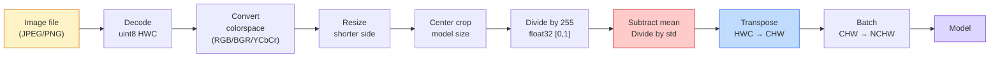
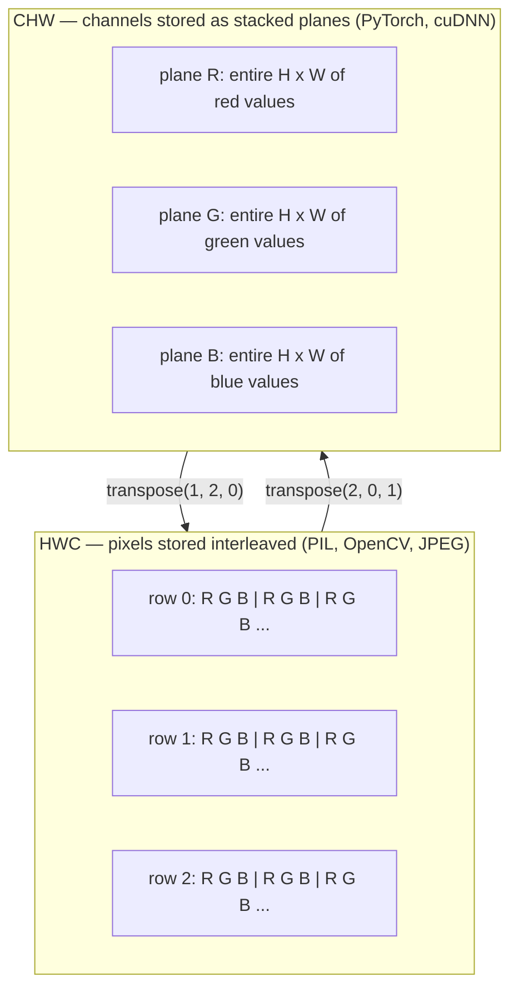

# اصول تصویر  پیکسل ها، کانال ها، فضای رنگی

> یک تصویر یک تنسور از نمونه های نور است. هر مدل دید که شما تا به حال استفاده می کنید از این یک واقعیت شروع می شود.

**Type:** Build
**Languages:** Python
**Prerequisites:** Phase 1 Lesson 12 (Tensor Operations), Phase 3 Lesson 11 (Intro to PyTorch)
**Time:** ~45 minutes

## اهداف یادگیری

- توضیح دهید که چگونه یک صحنه مداوم به پیکسل ها تقسیم می شود و چرا تصمیمات نمونه گیری/کوانتیزاسیون بر روی هر مدل پایین تر محدودیت را تعیین می کند
- تصاویر را به عنوان آرایه های NumPy بخوانید، برش دهید و بررسی کنید و به طور روان بین طرح های HWC و CHW تغییر دهید
- تبدیل بین RGB، مقیاس خاکستری، HSV و YCbCr و توجیه کردن دلیل وجود هر فضای رنگی
- استفاده از پردازش پیش از پیکسل (معمول سازی، استاندارد سازی، تغییر اندازه، کانال اول) دقیقا همان طور که مدل های پیش از آموزش دیده از دید PyTorch انتظار دارند

## مشکل

هر مقاله ای که می خوانید، هر وزن پیش از آموزش که می دانلودید، هر API دید که می خوانید فرض می کند یک کدگذاری خاص ورودی داشته باشد.`uint8`تصویر جایی که مدل میخواد`float32`و هنوز هم  اجرا می شود و به طور خاموش زباله تولید می کند. BGR را به یک شبکه آموزش داده شده بر روی RGB و دقت به ۱۰ نقطه سقوط می کند. یک مدل کانال را تحویل دهید - آخرین ورودی زمانی که انتظار می رود که کانال را - اول و لایه اول conv ارتفاع را به عنوان یک کانال ویژگی می شناسد. هیچ یک از این موارد خطا نمی کند. این فقط معیارهای شما را خراب می کند و شما یک هفته را در جستجوی یک خطای زندگی می کنید که در نحوه بارگذاری فایل زندگی می کند.

یک کنولوشن زمانی پیچیده نیست که بدانید چه چیزی را روی آن می کند. بخش سخت این است که "تصاویر" به معنای چیزهای مختلفی برای یک دوربین، یک decoder JPEG، PIL، OpenCV، torchvision و یک هسته CUDA است. هر دسته دارای ترتیب محور خود، محدوده بایت و کنوانسیون کانال است. یک مهندس بینایی که نمی تواند این کشتی های مستقیم را از لوله های شکسته نگه دارد.

این درس پایه را درست می کند تا بقیه مرحله بر روی آن بسازد. تا پایان شما می دانید که پیکسل چیست، چرا سه عدد در هر پیکسل به جای یک وجود دارد، "معمول سازی با آمار ImageNet" واقعا چه می کند، و چگونه بین دو یا سه طرح که هر درس دیگر در این مرحله فرض خواهد کرد حرکت کنید.

## مفهوم

### کل خط لوله پیش پردازش در یک نگاه

هر سيستم تصويري که در تولید وجود داره، يه سلسله از تحولات برگشتي هست. يک قدم اشتباه ميکني و مدل يه ورودی متفاوت از اوني که در موردش آموزش داده شده رو مي بينه.



دو جعبه قرمز و آبی جایی هستند که 80 درصد از شکست های خاموش زندگی می کنند: معیاری سازی و طرح اشتباه.

### یک پیکسل نمونه ای است نه یک مربع

یک سنسور دوربین فۆتون هایی را که روی یک شبکه از آشکارسازهای کوچک فرود می آیند می شمرد. هر آشکارساز نور را برای یک بخش از ثانیه ادغام می کند و ولتاژ متناسب با تعداد فۆتون هایی که به آن برخورد می کنند را منتشر می کند. سپس این ولتاژ را به یک عدد کامل بازمی گرداند. یک آشکارساز به یک پیکسل تبدیل می شود.

```
Continuous scene                 Sensor grid                     Digital image
(infinite detail)                (H x W detectors)               (H x W integers)

    ~~~~~                        +--+--+--+--+--+                 210 198 180 155 120
   ♪ ♪ ♪ ♪ ♪ ♪ ♪ ♪ ♪ ♪ ♪ ♪ ♪ ♪ ♪ ♪ ♪ ♪ ♪ ♪ ♪ ♪ ♪ ♪ ♪ ♪ ♪ ♪ ♪ ♪ ♪ ♪ ♪ ♪ ♪ ♪ ♪ ♪ ♪ ♪ ♪ ♪ ♪ ♪ ♪ ♪ ♪ ♪ ♪ ♪ ♪ ♪ ♪ ♪ ♪ ♪ ♪ ♪ ♪ ♪ ♪ ♪ ♪ ♪ ♪ ♪ ♪ ♪ ♪ ♪ ♪ ♪ ♪ ♪ ♪ ♪ ♪ ♪ ♪ ♪ ♪ ♪ ♪ ♪ ♪ ♪ ♪ ♪ ♪ ♪ ♪ ♪ ♪ ♪ ♪ ♪ ♪ ♪ ♪ ♪ ♪ ♪ ♪ ♪ ♪ ♪ ♪ ♪ ♪ ♪ ♪ ♪ ♪ ♪ ♪ ♪ ♪ ♪ ♪ ♪ ♪ ♪ ♪ ♪ ♪ ♪ ♪ ♪ ♪ ♪ ♪ ♪ ♪ ♪ ♪ ♪ ♪ ♪ ♪ ♪ ♪ ♪ ♪ ♪ ♪ ♪ ♪ ♪ ♪ ♪ ♪ ♪ ♪ ♪ ♪ ♪ ♪ ♪ ♪ ♪ ♪ ♪ ♪ ♪ ♪ ♪ ♪ ♪ ♪ ♪ ♪ ♪ ♪ ♪ ♪ ♪ ♪ ♪ ♪ ♪ ♪ ♪ ♪ ♪ ♪ ♪ ♪ ♪ ♪ ♪ ♪ ♪ ♪ ♪ ♪ ♪ ♪ ♪ ♪ ♪ ♪ ♪ ♪ ♪ ♪ ♪ ♪ ♪ ♪ ♪ ♪ ♪ ♪ ♪ ♪ ♪ ♪ ♪ ♪ ♪ ♪ ♪ ♪ ♪ ♪ ♪ ♪ ♪ ♪ ♪ ♪ ♪ ♪ ♪ ♪ ♪ ♪ ♪ ♪ ♪ ♪ ♪ ♪ ♪ ♪ ♪ ♪ ♪ ♪ ♪ ♪ ♪ ♪ ♪ ♪ ♪ ♪ ♪ ♪ ♪ ♪ ♪ ♪ ♪ ♪ ♪ ♪ ♪ ♪ ♪ ♪ ♪ ♪ ♪ ♪ ♪ ♪ ♪ ♪ ♪ ♪ ♪ ♪ ♪ ♪ ♪ ♪ ♪ ♪ ♪ ♪ ♪ ♪ ♪ ♪ ♪ ♪ ♪ ♪ ♪ ♪ ♪ ♪ ♪ ♪ ♪ ♪ ♪ ♪ ♪ ♪ ♪ ♪ ♪ ♪ ♪ ♪ ♪ ♪ ♪ ♪ ♪ ♪ ♪ ♪ ♪ ♪ ♪ ♪ ♪ ♪ ♪ ♪ ♪ ♪ ♪ ♪ ♪ ♪ ♪ ♪ ♪ ♪ ♪ ♪ ♪ ♪ ♪ ♪ ♪ ♪ ♪ ♪ ♪ ♪ ♪ ♪ ♪ ♪ ♪ ♪ ♪ ♪ ♪ ♪ ♪ ♪ ♪ ♪ ♪ ♪ ♪ ♪ ♪ ♪ ♪ ♪ ♪ ♪ ♪ ♪ ♪ ♪ ♪ ♪ ♪ ♪ ♪ ♪ ♪ ♪ ♪ ♪ ♪ ♪ ♪ ♪ ♪ ♪ ♪ ♪ ♪ ♪ ♪ ♪ ♪ ♪ ♪ ♪ ♪ ♪ ♪ ♪ ♪ ♪ ♪ ♪ ♪ ♪ ♪ ♪ ♪ ♪ ♪ ♪ ♪ ♪ ♪ ♪ ♪ ♪ ♪ ♪ ♪ ♪ ♪ ♪ ♪ ♪ ♪ ♪ ♪ ♪ ♪ ♪ ♪ ♪ ♪ ♪ ♪ ♪ ♪ ♪ ♪ ♪ ♪ ♪ ♪ ♪ ♪ ♪ ♪ ♪ ♪ ♪ ♪ ♪ ♪ ♪ ♪ ♪ ♪ ♪ ♪ ♪ ♪ ♪ ♪ ♪ ♪ ♪ ♪ ♪ ♪ ♪ ♪ ♪ ♪ ♪ ♪ ♪ ♪ ♪ ♪ ♪ ♪ ♪ ♪ ♪ ♪ ♪ ♪ ♪ ♪ ♪ ♪ ♪ ♪ ♪ ♪
  - نور - - - - - - - - - - - - - - - - - - - - - - - - - - - - - - - - - - - - - - - - - - - - - - - - - - - - - - - - - - - - - - - - - - - - - - - - - - - - - - - - - - - - - - - - - - - - - - - - - - - - - - - - - - - - - - - - - - - - - - - - - - - - - - - - - - - - - - - - - - - - - - - - - - - - - - - - - - - - - - - - - - - - - - - - - - - - - - - - - - - - - - - - - - - - - - - - - - - - - - - - - - - - - - - - - - - - - - - - - - - - - - - - - - - - - - - - - - - - - - - - - - - - - - - - - - - - - - - - - - - - - - - - - - - - - - - - - - - - - - - - - - - - - - - - - - - - - - - - - - - - - - - - - - - - - - - - - - - - - - - - - - - - - - - - - - - - - - - - - - - - - - - - - - - - - - - - - - - - - - - - - - - - - - - - - - - - - - - - - - - - - - - - - - - - - - - - - - - - - - - - - - - - - - - - - - - - - - - - - - - - - - - - - - - - - - - - - - - - - - - - - - - - - - - - - - - - - - - - - - - - - - - - - - - - - - - - - - - - - - - - - - - - - - - - - - - - - - - - - - - - - - - - - - - -
   ~~~~~                         |  |  |  |  |  |                 195 185 170 148 112
                                 +--+--+--+--+--+                 188 180 165 145 108
```

دو انتخاب در این مرحله اتفاق می افتد و آنها سقف را در هر چیزی که به سمت زیر رود قرار می دهند:

- **Spatial sampling**این کار به این نتیجه می رسد که چند تا از این دستگاه ها در هر درجه صحنه قرار می گیرند. خیلی کم، و لبه ها به صورت جنجال (aliasing) تبدیل می شوند. خیلی زیاد، و ذخیره سازی و محاسبه انفجار می کنند.
- **Intensity quantization**8-بایت ها 256 سطح را می دهند و برای نمایش استاندارد هستند. 10-بایت ها، 12-بایت ها، 16-بایت ها، تراشه های صاف تر و مواد برای تصویربرداری پزشکی، HDR و لوله های سنسور خام را می دهند.

یک پیکسل یک مربع رنگین با مساحت نیست. این یک اندازه گیری است. وقتی اندازه گیری را تغییر دهید یا به طور خودکار به آن تبدیل کنید، شما دوباره این شبکه اندازه گیری را نمونه می کنید.

### چرا سه کانال

یک آشکارساز فۆتون ها را در سراسر طیف بینایی (که خاکستری است) می شمرد. برای دریافت رنگ، حسگر شبکه را با موزایک فیلترهای قرمز، سبز و آبی پوشش می دهد. پس از دموسایک کردن، هر مکان فضایی سه عدد کامل دارد: پاسخ آشکارساز قرمز فیلتر شده، سبز فیلتر شده و آبی فیلتر شده در نزدیکی. این سه عدد یک پیکسل است.

```
One pixel in memory:

    (R, G, B) = (210, 140, 30)   <- reddish-orange

An H x W RGB image:

    shape (H, W, 3)     stored as   H rows of W pixels of 3 values
                                    each in [0, 255] for uint8
```

سه جادویی نیست. دوربین های عمق یک کانال Z را اضافه می کنند. ماهواره ها باند های زیر قرمز و فوق بنفش را اضافه می کنند. اسکن های پزشکی اغلب یک کانال (X-ray، CT) یا بسیاری (هایپر اسپکترا) دارند. تعداد کانال ها محور آخر است؛ لایه های کنو یاد می گیرند که در آن مخلوط شوند.

### دو کنوانسیون طرح: HWC و CHW

همون تنسور، دو ترتيب هر کتابخانه يکي رو ميگيرد

```
HWC (height, width, channels)           CHW (channels, height, width)

   W ->                                    H ->
  +-----+-----+-----+                     +-----+-----+
H |R G B|R G B|R G B|                   C |R R R R R R|
| +-----+-----+-----+                   | +-----+-----+
v |R G B|R G B|R G B|                   v |G G G G G G|
  +-----+-----+-----+                     +-----+-----+
                                          |B B B B B B|
                                          +-----+-----+

   PIL, OpenCV, matplotlib,              PyTorch, most deep learning
   almost every image file on disk       frameworks, cuDNN kernels
```

CHW وجود دارد زیرا هسته های کنولوشن از طریق H و W حرکت می کنند. نگه داشتن محور کانال در ابتدا به این معنی است که هر هسته یک خط 2D متصل را در هر کانال می بیند، که به صورت تمیز وکتور می شود. فرمت های دیسک HWC را نگه می دارند زیرا این با چگونگی خروج خط های اسکن از یک سنسور مطابقت دارد.

تبدیل یک خط شما هزار بار تایپ می کنید:

```
img_chw = img_hwc.transpose(2, 0, 1)      # NumPy
img_chw = img_hwc.permute(2, 0, 1)        # PyTorch tensor
```

طرح حافظه، تصویر:



### دامنه های بایت و dtype

سه کنوانسیون مهم:

| Convention | dtype | Range | Where you see it |
|------------|-------|-------|------------------|
| Raw | `uint8` | [0, 255] | Files on disk, PIL, OpenCV output |
| Normalized | `float32` | [0.0, 1.0] | After `img.astype('float32') / 255` |
| Standardized | `float32` | roughly [-2, +2] | After subtracting mean and dividing by std |

شبکه های کنولوشن به منظور ورودی های استاندارد آموزش دیده اند.`mean=[0.485, 0.456, 0.406]`،`std=[0.229, 0.224, 0.225]`متوسط ریاضی و انحراف استاندارد سه کانال در کل مجموعه آموزش ImageNet است که بر روی پیکسل های عادی [0, 1] محاسبه می شود.`uint8`در یک مدل که انتظار دارد شناور استاندارد شده است تنها رایج ترین شکست خاموش در دید کاربردی است.

### فضاهای رنگی و اینکه چرا وجود دارند

RGB فرمت ضبط است اما همیشه مفید ترین نمایش برای یک مدل نیست.

```
 RGB               HSV                       YCbCr / YUV

 R red             H hue (angle 0-360)       Y luminance (brightness)
 G green           S saturation (0-1)        Cb chroma blue-yellow
 B blue            V value/brightness (0-1)  Cr chroma red-green

 Linear to         Separates color from      Separates brightness from
 sensor output     brightness. Useful for    color. JPEG and most video
                   color thresholding, UI    codecs compress the chroma
                   sliders, simple filters   channels harder because the
                                             human eye is less sensitive
                                             to chroma detail than to Y.
```

براي بيشتر سي ان ان هاي مدرن شما RGB رو مي خوريد و وقتي با فضاها ديگر آشنا مي شويد:

- **HSV** کد CV کلاسیک، بخش بندی مبتنی بر رنگ، تعادل سفید.
- **YCbCr** خواندن فایل های داخلی JPEG، خط لوله های ویدئویی، مدل های با وضوح بالا که فقط روی Y کار می کنند.
- **Grayscale** OCR، مدل های سند، هر موردی که رنگ متغیر آزار دهنده به جای سیگنال باشد.

مقیاس خاکستری از RGB یک مبلغ وزن شده است، نه یک میانگین، زیرا چشم انسان نسبت به سبز نسبت به قرمز یا آبی حساس تر است:

```
Y = 0.299 R + 0.587 G + 0.114 B       (ITU-R BT.601, the classic weights)
```

### نسبت جنبه ها، تغییر اندازه و مداخله

هر مدل دارای اندازه ورودی ثابت است (224x224 برای اکثر دسته بندی کنندگان ImageNet، 384x384 یا 512x512 برای آشکارساز های مدرن). تصاویر شما به ندرت با هم مطابقت دارند. سه گزینه تغییر اندازه مهم:

- **Resize shorter side, then center crop** دستور استاندارد ImageNet. نسبت ابعاد را حفظ می کند، یک پکسل لبه را از بین می برد.
- **Resize and pad** نسبت ابعاد و هر پیکسل را حفظ می کند، لبه های سیاه را اضافه می کند. استاندارد برای تشخیص و OCR.
- **Resize directly to target** تصویر را دراز می کند. ارزان، هندسه را تحریف می کند، برای بسیاری از وظایف طبقه بندی خوب است.

روش انترپلاسیون تصمیم می گیرد که چگونه پیکسل های میانگین محاسبه می شوند وقتی شبکه جدید با شبکه قدیمی تعادل ندارد:

```
Nearest neighbour     fastest, blocky, only choice for masks/labels
Bilinear              fast, smooth, default for most image resizing
Bicubic               slower, sharper on upscaling
Lanczos               slowest, best quality, used for final display
```

قانون انگشت: دو خط برای آموزش، دو قطب یا لنزو برای دارایی هایی که شما می بینید، نزدیک ترین برای هر چیزی که حاوی شناسه های کلاس عدد کامل است.

```figure
conv-output-size
```

## آن را بسازید

### مرحله ی اول: یک تنسور تصویر بسازید و شکل آن را بررسی کنید

با یک تصویر مصنوعی تعیین کننده شروع کنید تا اولین آزمایشگاه با فقط NumPy غیر فعال شود. رمزگذاری فایل یک مرز جداگانه است: هنگامی که یک رمزگذاری JPEG یا PNG بایت های RGB را باز می کند، هر عملیات تنسور زیر یکسان است.

```python
import numpy as np

def synthetic_rgb(h=128, w=192, seed=0):
    rng = np.random.default_rng(seed)
    yy, xx = np.meshgrid(np.linspace(0, 1, h), np.linspace(0, 1, w), indexing="ij")
    r = (np.sin(xx * 6) * 0.5 + 0.5) * 255
    g = yy * 255
    b = (1 - yy) * xx * 255
    rgb = np.stack([r, g, b], axis=-1) + rng.normal(0, 6, (h, w, 3))
    return np.clip(rgb, 0, 255).astype(np.uint8)

arr = synthetic_rgb()

print(f"type:   {type(arr).__name__}")
print(f"dtype:  {arr.dtype}")
print(f"shape:  {arr.shape}     # (H, W, C)")
print(f"min:    {arr.min()}")
print(f"max:    {arr.max()}")
print(f"pixel at (0, 0): {arr[0, 0]}")
```

تولید انتظار می رود: `shape: (H, W, 3)`،`dtype: uint8`، دامنه`[0, 255]`این نمایش کاینونیک رمزگذاری شده است، چه بائتهایی از دوربین، یک رمزنگاری تصویر، یا این ژنراتور مصنوعی آمده باشند.

### مرحله دوم: کانال های تقسیم شده و تنظیم مجدد

R، G، B رو جداً بردارید و بعد از HWC به CHW برای PyTorch تبدیل کنید.

```python
R = arr[:, :, 0]
G = arr[:, :, 1]
B = arr[:, :, 2]
print(f"R shape: {R.shape}, mean: {R.mean():.1f}")
print(f"G shape: {G.shape}, mean: {G.mean():.1f}")
print(f"B shape: {B.shape}, mean: {B.mean():.1f}")

arr_chw = arr.transpose(2, 0, 1)
print(f"\nHWC shape: {arr.shape}")
print(f"CHW shape: {arr_chw.shape}")
```

سه سطح خاکستری، یک در هر کانال. CHW فقط محورها را تنظیم می کند؛ هیچ کپی داده ای به طور دقیق مورد نیاز نیست زمانی که طرح حافظه اجازه می دهد.

### مرحله سوم: تبدیل خاکستری و HSV

تراز وزن شده، بعد از آن یک دستی RGB به HSV.

```python
def rgb_to_grayscale(rgb):
    weights = np.array([0.299, 0.587, 0.114], dtype=np.float32)
    return (rgb.astype(np.float32) @ weights).astype(np.uint8)

def rgb_to_hsv(rgb):
    rgb_f = rgb.astype(np.float32) / 255.0
    r, g, b = rgb_f[..., 0], rgb_f[..., 1], rgb_f[..., 2]
    cmax = np.max(rgb_f, axis=-1)
    cmin = np.min(rgb_f, axis=-1)
    delta = cmax - cmin

    h = np.zeros_like(cmax)
    mask = delta > 0
    argmax = np.argmax(rgb_f, axis=-1)
    rmax = mask & (argmax == 0)
    gmax = mask & (argmax == 1)
    bmax = mask & (argmax == 2)
    h[rmax] = ((g[rmax] - b[rmax]) / delta[rmax]) % 6
    h[gmax] = ((b[gmax] - r[gmax]) / delta[gmax]) + 2
    h[bmax] = ((r[bmax] - g[bmax]) / delta[bmax]) + 4
    h = h * 60.0

    s = np.divide(delta, cmax, out=np.zeros_like(delta), where=cmax > 0)
    v = cmax
    return np.stack([h, s, v], axis=-1)

gray = rgb_to_grayscale(arr)
hsv = rgb_to_hsv(arr)
print(f"gray shape: {gray.shape}, range: [{gray.min()}, {gray.max()}]")
print(f"hsv   shape: {hsv.shape}")
print(f"hue range: [{hsv[..., 0].min():.1f}, {hsv[..., 0].max():.1f}] degrees")
print(f"sat range: [{hsv[..., 1].min():.2f}, {hsv[..., 1].max():.2f}]")
print(f"val range: [{hsv[..., 2].min():.2f}, {hsv[..., 2].max():.2f}]")
```

رنگ در درجه، شتاب و ارزش در [0, 1] ظاهر می شود.`hsv_full`کنوانسیون

### مرحله چهارم: عادی سازی، استاندارد سازی و برگشت آن

از بايت هاي خام به تنسور درستي که مدل پيش از آموزش شده اي ImageNet انتظارش رو داره بريم و پس ازش برگرديم

```python
mean = np.array([0.485, 0.456, 0.406], dtype=np.float32)
std = np.array([0.229, 0.224, 0.225], dtype=np.float32)

def preprocess_imagenet(rgb_uint8):
    x = rgb_uint8.astype(np.float32) / 255.0
    x = (x - mean) / std
    x = x.transpose(2, 0, 1)
    return x

def deprocess_imagenet(chw_float32):
    x = chw_float32.transpose(1, 2, 0)
    x = x * std + mean
    x = np.clip(x * 255.0, 0, 255).astype(np.uint8)
    return x

x = preprocess_imagenet(arr)
print(f"preprocessed shape: {x.shape}     # (C, H, W)")
print(f"preprocessed dtype: {x.dtype}")
print(f"preprocessed mean per channel:  {x.mean(axis=(1, 2)).round(3)}")
print(f"preprocessed std  per channel:  {x.std(axis=(1, 2)).round(3)}")

roundtrip = deprocess_imagenet(x)
max_diff = np.abs(roundtrip.astype(int) - arr.astype(int)).max()
print(f"roundtrip max pixel diff: {max_diff}    # should be 0 or 1")
```

متوسط هر کانال باید نزدیک به صفر باشد، std نزدیک به یک.`transforms.Normalize`تماس تحت هود داره

### مرحله 5: اندازه را از نو تغییر دهید

نزدیک ترین همسایه هر هماهنگی خروجی را به یک پیکسل منبع می کند. انترپولاسیون دو خطی چهار پیکسل اطراف را پیدا می کند و آنها را با فاصله ترکیب می کند. هر دو پیاده سازی زیر از هماهنگی های هماهنگی با نقطه پایان استفاده می کنند تا اولین و آخرین پیکسل منبع ثابت بمانند.

```python
def resize_coordinates(source_length, target_length):
    if target_length == 1:
        return np.zeros(1, dtype=np.float32)
    return np.linspace(0, source_length - 1, target_length, dtype=np.float32)

def nearest_resize(image, target_height, target_width):
    y = np.rint(resize_coordinates(image.shape[0], target_height)).astype(int)
    x = np.rint(resize_coordinates(image.shape[1], target_width)).astype(int)
    return image[y[:, None], x[None, :]]

def bilinear_resize(image, target_height, target_width):
    y = resize_coordinates(image.shape[0], target_height)
    x = resize_coordinates(image.shape[1], target_width)
    y0 = np.floor(y).astype(int)
    x0 = np.floor(x).astype(int)
    y1 = np.minimum(y0 + 1, image.shape[0] - 1)
    x1 = np.minimum(x0 + 1, image.shape[1] - 1)
    wy = (y - y0)[:, None, None]
    wx = (x - x0)[None, :, None]

    source = image.astype(np.float32)
    top = source[y0[:, None], x0[None, :]] * (1 - wx)
    top += source[y0[:, None], x1[None, :]] * wx
    bottom = source[y1[:, None], x0[None, :]] * (1 - wx)
    bottom += source[y1[:, None], x1[None, :]] * wx
    result = top * (1 - wy) + bottom * wy
    return np.clip(np.rint(result), 0, 255).astype(image.dtype)

target_height = arr.shape[0] * 3
target_width = arr.shape[1] * 3
nearest = nearest_resize(arr, target_height, target_width)
bilinear = bilinear_resize(arr, target_height, target_width)

def local_roughness(x):
    gy = np.diff(x.astype(float), axis=0)
    gx = np.diff(x.astype(float), axis=1)
    return float(np.abs(gy).mean() + np.abs(gx).mean())

for name, out in [("nearest", nearest), ("bilinear", bilinear)]:
    print(f"{name:>8}  shape={out.shape}  roughness={local_roughness(out):6.2f}")
```

نزدیک ترین امتیاز در خشن بودن بالاتر است زیرا حواشی سخت را حفظ می کند. بیلینیر آسان تر است زیرا هر پیکسل جدید دو موقعیت را در هر محور ترکیب می کند. همراه قابل اجرا ایده قابل جدایی را به چهار همسایه در هر محور با هسته مکعب Catmull-Rom گسترش می دهد، سپس هر سه نتیجه را بدون کتابخانه تصویر چاپ می کند.

## ازش استفاده کن

PyTorch همان عملیات را در تنسورهای دسته بندی و آگاه از دستگاه انجام می دهد. کد زیر سایز کوتاه تر را تغییر می دهد، یک محصول مرکزی را می گیرد، هر کانال را استاندارد می کند و تنسور NCHW را تولید می کند که یک مدل پیش از آموزش انتظار دارد.

```python
import torch
import torch.nn.functional as F

image_hwc = torch.from_numpy(synthetic_rgb(256, 320))
batch = image_hwc.permute(2, 0, 1).unsqueeze(0).float() / 255.0

height, width = batch.shape[-2:]
scale = 256 / min(height, width)
resized_height = round(height * scale)
resized_width = round(width * scale)
batch = F.interpolate(
    batch,
    size=(resized_height, resized_width),
    mode="bilinear",
    align_corners=False,
    antialias=True,
)

top = (resized_height - 224) // 2
left = (resized_width - 224) // 2
batch = batch[:, :, top:top + 224, left:left + 224]

mean = torch.tensor([0.485, 0.456, 0.406]).view(1, 3, 1, 1)
std = torch.tensor([0.229, 0.224, 0.225]).view(1, 3, 1, 1)
batch = (batch - mean) / std

print(f"tensor dtype: {batch.dtype}")
print(f"batched shape: {tuple(batch.shape)}")
print(f"per-channel mean: {batch.mean(dim=(0, 2, 3)).tolist()}")
print(f"per-channel std:  {batch.std(dim=(0, 2, 3)).tolist()}")
```

چهار مرحله، در این ترتیب دقیق: تبدیل بائتهای به شناور و تبدیل HWC به NCHW، اندازه بخش کوتاه تر را به 256 تغییر دهید، یک محصول مرکزی 224x224 را بگیرید، سپس متوسط ImageNet را از آن بردارید و با انحراف استاندارد آن تقسیم کنید. معکوس کردن این ترتیب به طور خاموش تغییر می کند که چه چیزی به مدل می رسد.

## -باده

این درس نتیجه می دهد:

- `outputs/prompt-vision-preprocessing-audit.md` یک پیام که هر کارت مدل یا کارت مجموعه داده را به یک لیست چک دقیق از متغیرهای پیش پردازش تبدیل می کند که یک تیم باید رعایت کند.
- `outputs/skill-image-tensor-inspector.md` یک مهارت که با توجه به هر تنسور یا آرایه شکل تصویر، گزارش dtype، طرح، محدوده و اینکه آیا آن را خام، عادی یا استاندارد به نظر می رسد.

## تمرینات

1. **(Easy)**2x2 RGB بسازید`uint8`HWC را به CHW و عقب تبدیل کنید، هر دو شکل را چاپ کنید و ثابت کنید که سفر برگشت و برگشت هر مقدار را حفظ می کند.
2. **(Medium)**بنویس`standardize(img, mean, std)`و برعکسش که با هم عبور می کنند`roundtrip_max_diff <= 1`عملکرد شما باید روی یک تصویر در HWC و یک دسته در NCHW با همان تماس کار کند.
3. **(Hard)**یک تنسور استاندارد 3 کانال ImageNet را بگیرید و آن را از طریق یک کنتور 1x1 اجرا کنید که ترکیبی وزن شده از RGB را به یک کانال خاکستری واحد می آموزد. وزنه ها را به `[0.299, 0.587, 0.114]`، آنها را منجمد کنید و بررسی کنید که محصول با دستور کار شما مطابقت دارد`rgb_to_grayscale`چه تحولات کلاسیک دیگر از فضای رنگی را می توان به عنوان پیچیدگی های 1x1 نوشت؟

## اصطلاحات کلیدی

| Term | What people say | What it actually means |
|------|----------------|----------------------|
| Pixel | "A coloured square" | One sample of light intensity at one grid location — three numbers for colour, one for grayscale |
| Channel | "The colour" | One of the parallel spatial grids stacked into an image tensor; last axis in HWC, first in CHW |
| HWC / CHW | "The shape" | Axis orderings for an image tensor; disk and PIL use HWC, PyTorch and cuDNN use CHW |
| Normalize | "Scale the image" | Divide by 255 so pixels live in [0, 1] — necessary but not sufficient |
| Standardize | "Zero-center" | Subtract mean and divide by std per channel so the input distribution matches what the model was trained on |
| Grayscale conversion | "Average the channels" | A weighted sum with coefficients 0.299/0.587/0.114 that matches human luminance perception |
| Interpolation | "How resize picks pixels" | The rule that decides output values when the new grid does not align with the old one — nearest for labels, bilinear for training, bicubic for display |
| Aspect ratio | "Width over height" | The ratio that distinguishes "resize and pad" from "resize and stretch" |

## خواندن بیشتر

- [Charles Poynton — A Guided Tour of Color Space](https://web.archive.org/web/20251220000525/https://poynton.ca/PDFs/Guided_tour.pdf) روشن ترین روش فنی برای درک اینکه چرا اینقدر فضاهای رنگی وجود دارد و زمانی که هر یک از آنها مهم است
- [PyTorch Vision Transforms Docs](https://pytorch.org/vision/stable/transforms.html) کل خط تبدیلاتی که در تولید درست می کنید
- [How JPEG Works (Colt McAnlis)](https://www.youtube.com/watch?v=F1kYBnY6mwg) یک دورۀ بصری تیز از نمونه گیری زیر کروم، DCT، و چرا JPEG کد YCbCr به جای RGB
- [ImageNet Preprocessing Conventions (torchvision models)](https://pytorch.org/vision/stable/models.html) منبع حقیقت برای `mean=[0.485, 0.456, 0.406]`و چرا هر مدل در باغ وحش انتظارش رو داره
