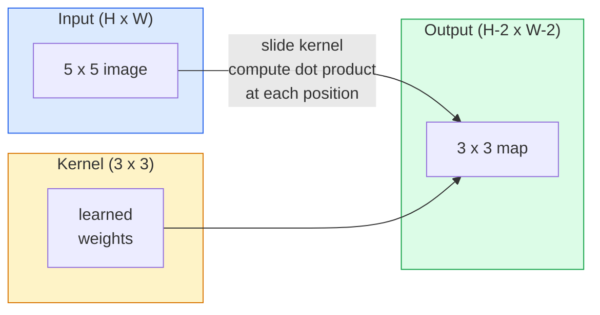
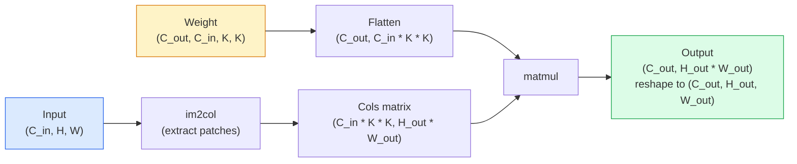

# کاوش ها از صفر

> یک پیچ یک لایه کوچک و کثیف است که شما در یک تصویر حرکت می کنید، و در هر مکان وزن های مشابه را به اشتراک می گذارد.

**Type:** Build
**Languages:** Python
**Prerequisites:** Phase 3 (Deep Learning Core), Phase 4 Lesson 01 (Image Fundamentals)
**Time:** ~75 minutes

## اهداف یادگیری

- از ابتدا به شکل 2D از طریق استفاده از فقط NumPy، از جمله نسخه حلقه ی سرپوش و یک ویکتور استفاده کنید `im2col`نسخه
- اندازه فضایی خروجی را برای هر ترکیب از اندازه ورودی، اندازه هسته، پوشاندن و قدم محاسبه کنید و توجیه کنید `(H - K + 2P) / S + 1`فرمول
- هسته های طراحی دستی (ساحر، مبهم، تیز، Sobel) و توضیح دهید که چرا هر کدام الگوی فعال سازی را تولید می کند
- پیچ های دسته به یک استخراج کننده ویژگی و اتصال عمق دسته به اندازه میدان گیرنده

## مشکل

یک لایه کاملا متصل در یک تصویر RGB 224x224 به 224 * 224 * 3 = 150,528 وزن ورودی در هر نورون نیاز دارد. یک لایه پنهان با 1000 واحد، 150 میلیون پارامتر است قبل از اینکه چیزی مفید یاد بگیرید. بدتر از همه، این لایه هیچ ایده ای ندارد که یک سگ در سمت بالا چپ و یک سگ در سمت پایین راست الگوی مشابهی هستند. این هر موقعیت پیکسل را به عنوان مستقل می داند، که برای تصاویر کاملاً اشتباه است: ترجمه یک گربه به سه پیکسل نباید شبکه را مجبور به یادگیری مجدد مفهوم کند.

دو ویژگی که یک مدل تصویر نیاز دارد:**translation equivariance**(خروجی در زمان تغییر ورودی تغییر می کند) و**parameter sharing**(دستکتور ویژگی های مشابه در همه جا اجرا می شود) لایه های ضخیم هیچ یک را به شما نمی دهند. کنولوشن هر دو را به شما می دهد رایگان.

کنولوشن برای یادگیری عمیق اختراع نشده است. این همان عملیات است که تقویت فشرده سازی JPEG، گیوسین بلور در فوتوشاپ، تشخیص حاشیه در دید صنعتی و هر فیلتر صوتی که تاکنون ارسال شده است. دلیل CNNs از سال 2012 تا 2020 بر ImageNet تسلط داشته است این است که کنولوشن پیش از داده هایی است که ارزش های نزدیک در آن ارتباط دارند و الگوی مشابه می تواند در هر نقطه ظاهر شود.

## مفهوم

### یک هسته، حرکت

یک کنولوشن 2D یک ماتریس وزن کوچک به نام هسته (یا فیلتر) را می گیرد، آن را در ورودی حرکت می دهد و در هر مکان مجموعه محصولات هوشمند عنصر را محاسبه می کند. این مقدار به یک پیکسل خروجی تبدیل می شود.



یک مثال 3x3 بتن در ورودی 5x5 (بدون پوشاندن، مرحله 1):

```
Input X (5 x 5):                Kernel W (3 x 3):

  1  2  0  1  2                   1  0 -1
  0  1  3  1  0                   2  0 -2
  2  1  0  2  1                   1  0 -1
  1  0  2  1  3
  2  1  1  0  1

The kernel slides across every valid 3 x 3 window. Output Y is 3 x 3:

 Y[0,0] = sum( W * X[0:3, 0:3] )
 Y[0,1] = sum( W * X[0:3, 1:4] )
 Y[0,2] = sum( W * X[0:3, 2:5] )
 Y[1,0] = sum( W * X[1:4, 0:3] )
 ... and so on
```

اون فرمولي**shared weights, locality, sliding window**همه چيز ديگه حسابداري است

### فرمول اندازه تولید

با توجه به اندازه فضای ورودی `H`، اندازه هسته`K`، پر کردن`P`، قدم بزن`S`:

```
H_out = floor( (H - K + 2P) / S ) + 1
```

اینو به یاد داشته باشید. شما آن را به طور کامل به طور کامل به طور کامل به طور کامل به طور کامل به طور کامل به طور کامل به طور کامل به طور کامل به طور کامل به طور کامل به طور کامل به طور کامل به طور کامل به طور کامل به طور کامل به طور کامل به طور کامل به طور کامل به طور کامل به طور کامل به طور کامل به طور کامل به طور کامل به طور کامل به طور کامل به طور کامل به طور کامل به طور کامل به طور کامل به طور کامل به طور کامل به طور کامل به طور کامل به طور کامل به طور کامل به طور کامل به طور کامل به طور کامل به طور کامل به طور کامل به طور کامل به طور کامل به طور کامل به طور کامل به طور کامل به طور کامل به طور کامل به طور کامل به طور کامل به طور کامل به طور کامل به طور کامل به طور کامل به طور کامل به طور کامل به طور کامل به طور کامل به طور کامل به طور کامل به طور کامل به طور کامل به طور کامل به طور کامل به طور کامل به شما خواهد رسید.

| Scenario | H | K | P | S | H_out |
|----------|---|---|---|---|-------|
| Valid conv, no padding | 32 | 3 | 0 | 1 | 30 |
| Same conv (preserves size) | 32 | 3 | 1 | 1 | 32 |
| Downsample by 2 | 32 | 3 | 1 | 2 | 16 |
| Pool 2x2 | 32 | 2 | 0 | 2 | 16 |
| Large receptive field | 32 | 7 | 3 | 2 | 16 |

"مثل پوشاندن" به معنای انتخاب P است تا H_out == H در S == 1. برای K عجیب، این P = (K - 1) / 2 است. به همین دلیل هسته های 3x3 غالب هستند.

### پادینگ

بدون پوشاندن، هر پیچ نقشه ویژگی را کوچک می کند. 20 از آنها را جمع کنید و تصویر 224x224 شما به 184x184 تبدیل می شود، که محاسبه در مرز را ضایع می کند و ارتباطات باقیمانده را پیچیده می کند که نیاز به شکل های مطابقت دارد.

```
Zero padding (P = 1) on a 5 x 5 input:

  0  0  0  0  0  0  0
  0  1  2  0  1  2  0
  0  0  1  3  1  0  0
  0  2  1  0  2  1  0       Now the kernel can centre on pixel
  0  1  0  2  1  3  0       (0, 0) and still have three rows and
  0  2  1  1  0  1  0       three columns of values to multiply.
  0  0  0  0  0  0  0
```

روش هایی که در عمل می بینید:`zero`(معمول ترین) ،`reflect`(آینه ای از لبه، از مرز های سخت در مدل های تولید کننده اجتناب می کند)`replicate`(کاپي کناره)`circular`(تلفان اطراف، در مشکلات توئیدال استفاده می شود).

### قدم

قدم اندازه قدم از اسلاید است. `stride=1`.`stride=2`این روش کلاسیک برای نمونه برداری در داخل CNN بدون یک لایه جمع آوری جداگانه است. هر معماری مدرن (ResNet، ConvNeXt، MobileNet) از کنو های قدم به جای max-pool استفاده می کند.

```
Stride 1 on a 5 x 5 input, 3 x 3 kernel:

  starts: (0,0) (0,1) (0,2)        -> output row 0
          (1,0) (1,1) (1,2)        -> output row 1
          (2,0) (2,1) (2,2)        -> output row 2

  Output: 3 x 3

Stride 2 on the same input:

  starts: (0,0) (0,2)              -> output row 0
          (2,0) (2,2)              -> output row 1

  Output: 2 x 2
```

### کانال های ورودی چندگانه

تصاویر واقعی سه کانال دارند. یک کنولوشن 3x3 در ورودی RGB در واقع حجم 3x3x3 است: یک قطعه 3x3 در هر کانال ورودی. در هر موقعیت فضایی، شما در هر سه قطعه ضرب و جمع می کنید و یک تعصب اضافه می کنید.

```
Input:   (C_in,  H,  W)        3 x 5 x 5
Kernel:  (C_in,  K,  K)        3 x 3 x 3 (one kernel)
Output:  (1,     H', W')       2D map

For a layer that produces C_out output channels, you stack C_out kernels:

Weight:  (C_out, C_in, K, K)   e.g. 64 x 3 x 3 x 3
Output:  (C_out, H', W')       64 x 3 x 3

Parameter count: C_out * C_in * K * K + C_out   (the + C_out is biases)
```

این خط آخر همان خطی است که شما هنگام طراحی یک مدل محاسبه می کنید. یک 64 کانال 3x3 conv در یک ورودی 3 کانال دارای `64 * 3 * 3 * 3 + 64 = 1,792`پارامترها ارزان

### ترفند "مکس"

حلقه های سرپوشیده آسان برای خواندن هستند اما آهسته. GPU ها می خواهند ماتریکس بزرگ چندان شود. ترفند: هر پنجره میدان گیرنده ورودی را به یک ستون ماتریکس بزرگ صاف کنید، هسته را به یک ردیف صاف کنید و کل پیچ یک ماتمول شود.



هر اجرای تولید conv نوعی از این ترفند و ترفند های کاش است (conv مستقیم، Winograd، FFT conv برای هسته های بزرگ).

### میدان دریافت کننده

یک 3x3 conv به 9 پیکسل ورودی نگاه می کند. دو 3x3 conv را جمع کنید و یک نورون در لایه دوم به 5x5 پیکسل ورودی نگاه می کند. سه 3x3 conv به 7x7 می دهد. به طور کلی:

```
RF after L stacked K x K convs (stride 1) = 1 + L * (K - 1)

With strides:   RF grows multiplicatively with stride along each layer.
```

دلیل اصلی کار "3x3 all the way down" (VGG، ResNet، ConvNeXt) این است که دو کنو 3x3 همان منطقه ورودی را با یک کنو 5x5 می بینند اما با پارامترهای کمتر و غیر خطی اضافی در بین آنها.

```figure
convolution-kernel
```

## آن را بسازید

### مرحله اول: یک صف را بپوشید

با کوچکترین ابتدایی شروع کنید: یک تابع که با صفر ها در اطراف یک صف H x W بسته بندی می شود.

```python
import numpy as np

def pad2d(x, p):
    if p == 0:
        return x
    h, w = x.shape[-2:]
    out = np.zeros(x.shape[:-2] + (h + 2 * p, w + 2 * p), dtype=x.dtype)
    out[..., p:p + h, p:p + w] = x
    return out

x = np.arange(9).reshape(3, 3)
print(x)
print()
print(pad2d(x, 1))
```

. . . . . . . . . . . . . . . . . . . . . . . . . . . . . . . . . . . . . . . . . . . . . . . . . . . . . . . . . . . . . . . . . . . . . . . . . . . . . . . . . . . . . . . . . . . . . . . . . . . . . . . . . . . . . . . . . . . . . . . . . . . . . . . . . . . . . . . . . . . . . . . . . . . . . . . . . . . . . . . . . . . . . . . . . . . . . . . . . . . . . . . . . . . . . . . . . . . . . . . . . . . . . . . . . . . . . . . . . . . . . . . . . . . . . . . . . . . . . . . . . . . . . . . . . . . . . . . . . . . . . . . . . . . . . . . . . . . . . . . . . . . . . . . . . . . . . . . . . . . . . . . . . . . . . . . . . . . . . . . . . . . . . . . . . . . . . . . . . . . . . . . . . . . . . . . . . . . . . . . . . . . . . . . . . . . . . . . . . . . . . . . . . . . . . . . . . . . . . . . . . . . . . . . . . . . . . . . . . . . . . . . . . . . . . . . . . . . . . . . . . . . . . . . . . . . . . . . . . . . . . . . . . . . . . . . . . . . . . . . . . . . . . . . . . . . . . . . . . . . . . . . . . . . . . .`x.shape[:-2]`یعنی همون تابع روی `(H, W)`،`(C, H, W)`، یا`(N, C, H, W)`بدون تغییر

### مرحله 2: پیچ 2D با حلقه های سربند

اجرای مرجع آهسته اما واضح است. این چیزی است که`torch.nn.functional.conv2d`در اصل هم هست

```python
def conv2d_naive(x, w, b=None, stride=1, padding=0):
    c_in, h, w_in = x.shape
    c_out, c_in_w, kh, kw = w.shape
    assert c_in == c_in_w

    x_pad = pad2d(x, padding)
    h_out = (h + 2 * padding - kh) // stride + 1
    w_out = (w_in + 2 * padding - kw) // stride + 1

    out = np.zeros((c_out, h_out, w_out), dtype=np.float32)
    for oc in range(c_out):
        for i in range(h_out):
            for j in range(w_out):
                hs = i * stride
                ws = j * stride
                patch = x_pad[:, hs:hs + kh, ws:ws + kw]
                out[oc, i, j] = np.sum(patch * w[oc])
        if b is not None:
            out[oc] += b[oc]
    return out
```

چهار حلقه ی سرپوش (قنایل خروجی، صف، ستون، به علاوه مجموع ضمنی C_in، kh، kw) این حقیقت اصلی است که شما هر اجرای سریع تر را با آن بررسی خواهید کرد.

### مرحله 3: با یک هسته طراحی شده دستی تأیید کنید

یک هسته عمودی Sobel بسازید، آن را روی یک تصویر مرحله ای مصنوعی اعمال کنید و به سمت عمودی نور بزنید.

```python
def synthetic_step_image():
    img = np.zeros((1, 16, 16), dtype=np.float32)
    img[:, :, 8:] = 1.0
    return img

sobel_x = np.array([
    [[-1, 0, 1],
     [-2, 0, 2],
     [-1, 0, 1]]
], dtype=np.float32)[None]

x = synthetic_step_image()
y = conv2d_naive(x, sobel_x, padding=1)
print(y[0].round(1))
```

انتظار دارید که در ستون ۷ (به سمت چپ به سمت راست افزایش نور) و صفر ها در هر جای دیگر، مقدار مثبت زیادی داشته باشید. این چاپ یکگانه، بررسی عقل شما است که آیا ریاضیات درست است.

### مرحله 4: im2col

هر پنجره به اندازه هسته در ورودی را به یک ستون ماتریکس تبدیل کنید. برای `C_in=3, K=3`، هر ستون 27 عدد است.

```python
def im2col(x, kh, kw, stride=1, padding=0):
    c_in, h, w = x.shape
    x_pad = pad2d(x, padding)
    h_out = (h + 2 * padding - kh) // stride + 1
    w_out = (w + 2 * padding - kw) // stride + 1

    cols = np.zeros((c_in * kh * kw, h_out * w_out), dtype=x.dtype)
    col = 0
    for i in range(h_out):
        for j in range(w_out):
            hs = i * stride
            ws = j * stride
            patch = x_pad[:, hs:hs + kh, ws:ws + kw]
            cols[:, col] = patch.reshape(-1)
            col += 1
    return cols, h_out, w_out
```

هنوز یک حلقه پایتون است، اما حالا حمل سنگین یک ماتمول متروک واحد خواهد بود.

### مرحله 5: سریع از طریق im2col + matmul

حلقه چهار برابر را با یک ضرب ماتریک جایگزین کنید.

```python
def conv2d_im2col(x, w, b=None, stride=1, padding=0):
    c_out, c_in, kh, kw = w.shape
    cols, h_out, w_out = im2col(x, kh, kw, stride, padding)
    w_flat = w.reshape(c_out, -1)
    out = w_flat @ cols
    if b is not None:
        out += b[:, None]
    return out.reshape(c_out, h_out, w_out)
```

بررسی درستی: هر دو پیاده سازی را اجرا کنید و مقایسه کنید.

```python
rng = np.random.default_rng(0)
x = rng.normal(0, 1, (3, 16, 16)).astype(np.float32)
w = rng.normal(0, 1, (8, 3, 3, 3)).astype(np.float32)
b = rng.normal(0, 1, (8,)).astype(np.float32)

y_naive = conv2d_naive(x, w, b, padding=1)
y_im2col = conv2d_im2col(x, w, b, padding=1)

print(f"max abs diff: {np.max(np.abs(y_naive - y_im2col)):.2e}")
```

`max abs diff`باید در اطراف باشه`1e-5` تفاوت در ترتیب جمع شدن نقطه شناور است، نه یک خطا.

### مرحله 6: یک بانک هسته های دست ساخت

پنج فیلتر که نشان می دهد یک لایه واحد کنو قبل از هر آموزش چه می تواند بیان کند.

```python
KERNELS = {
    "identity": np.array([[0, 0, 0], [0, 1, 0], [0, 0, 0]], dtype=np.float32),
    "blur_3x3": np.ones((3, 3), dtype=np.float32) / 9.0,
    "sharpen": np.array([[0, -1, 0], [-1, 5, -1], [0, -1, 0]], dtype=np.float32),
    "sobel_x": np.array([[-1, 0, 1], [-2, 0, 2], [-1, 0, 1]], dtype=np.float32),
    "sobel_y": np.array([[-1, -2, -1], [0, 0, 0], [1, 2, 1]], dtype=np.float32),
}

def apply_kernel(img2d, kernel):
    x = img2d[None].astype(np.float32)
    w = kernel[None, None]
    return conv2d_im2col(x, w, padding=1)[0]
```

به هر تصویر در مقیاس خاکستری اعمال می شود، نرم می شود، لبه های تیز را به بالا می برد، Sobel-x لبه های عمودی را روشن می کند، Sobel-y لبه های افقی را روشن می کند. این دقیقاً الگوهای است که لایه conv آموزش دیده در AlexNet و VGG به پایان رسید. زیرا یک مدل تصویر خوب به تشخیص دهنده لبه ها و بلوک ها نیاز دارد، مهم نیست که بعدا چه کاری انجام شود.

## ازش استفاده کن

"پایتورچ"`nn.Conv2d`این کار با کارایی مشابه با خودگرد، هسته های CUDA و بهینه سازی cuDNN انجام می شود.

```python
import torch
import torch.nn as nn

conv = nn.Conv2d(in_channels=3, out_channels=64, kernel_size=3, stride=1, padding=1)
print(conv)
print(f"weight shape: {tuple(conv.weight.shape)}   # (C_out, C_in, K, K)")
print(f"bias shape:   {tuple(conv.bias.shape)}")
print(f"param count:  {sum(p.numel() for p in conv.parameters())}")

x = torch.randn(8, 3, 224, 224)
y = conv(x)
print(f"\ninput  shape: {tuple(x.shape)}")
print(f"output shape: {tuple(y.shape)}")
```

عوضش کن`padding=1`برای`padding=0`و خروجی به 222x222 کاهش می یابد.`stride=1`برای`stride=2`و به 112x112 کاهش می یابد. همان فرمولی که در بالا یاد گرفتید.

## -باده

این درس نتیجه می دهد:

- `outputs/prompt-cnn-architect.md` یک پیام که با توجه به اندازه ورودی، بودجه پارامتر و میدان گیرنده هدف، یک دسته از`Conv2d`لایه هایی که در هر مرحله K/S/P درست است.
- `outputs/skill-conv-shape-calculator.md` یک مهارت که یک لایه مشخصات شبکه را به لایه ای حرکت می کند و شکل خروجی، میدان گیرنده و شمارش پارامتر را برای هر بلوک باز می کند.

## تمرینات

1. **(Easy)**با توجه به ورودی 128×128 در مقیاس خاکستری و یک دسته از`[Conv3x3(s=1,p=1), Conv3x3(s=2,p=1), Conv3x3(s=1,p=1), Conv3x3(s=2,p=1)]`, اندازه فضای خروجی و میدان گیرنده در هر لایه را به دست محاسبه کنید. با PyTorch تایید کنید`nn.Sequential`از ماشین های ساختگی
2. **(Medium)**طولاني`conv2d_naive`و`conv2d_im2col`قبول کردن یک`groups`بحث ميکنيم.`groups=C_in=C_out`تکرار یک پیچیدگی در عمق و تعداد پارامتر آن`C * K * K`به جای`C * C * K * K`. .
3. **(Hard)**اجرا کردن گذرگاه عقب`conv2d_im2col`با دست: با توجه به گرادینت تولید، گرادینت  را محاسبه کنید`x`و`w`. با هم بررسي کن`torch.autograd.grad`در مورد همان ورودی ها و وزنه ها.`col2im`و باید پنجره های متداول را جمع کند.

## اصطلاحات کلیدی

| Term | What people say | What it actually means |
|------|----------------|----------------------|
| Convolution | "Sliding a filter" | A learnable dot product applied at every spatial location with shared weights; mathematically a cross-correlation, but everyone calls it convolution |
| Kernel / filter | "The feature detector" | A small weight tensor of shape (C_in, K, K) whose dot product with a window of input produces one output pixel |
| Stride | "How far you jump" | The step size between consecutive kernel placements; stride 2 halves each spatial dimension |
| Padding | "Zeros on the edges" | Extra values added around the input so the kernel can centre on border pixels; `same` padding keeps output size equal to input size |
| Receptive field | "How much the neuron sees" | The patch of original input that a given output activation depends on, growing with depth and stride |
| im2col | "The GEMM trick" | Rearranging every receptive window into columns so convolution becomes one big matrix multiply — the core of every fast conv kernel |
| Depthwise conv | "One kernel per channel" | A conv with `groups == C_in`, computing each output channel from only its matching input channel; the backbone of MobileNet and ConvNeXt |
| Translation equivariance | "Shift in, shift out" | Property that shifting the input by k pixels shifts the output by k pixels; comes for free with shared weights |

## خواندن بیشتر

- [A guide to convolution arithmetic for deep learning (Dumoulin & Visin, 2016)](https://arxiv.org/abs/1603.07285) نمودار های قطعی از پر کردن/پیاده/پیاده شدن که هر دوره به صورت ساکت کپی می کند
- [CS231n: Convolutional Neural Networks for Visual Recognition](https://cs231n.github.io/convolutional-networks/) یادداشت های سخنرانی های کانونیکی، از جمله توضیح اصلی im2col
- [The Annotated ConvNet (fast.ai)](https://nbviewer.org/github/fastai/fastbook/blob/master/13_convolutions.ipynb) یک دفترچه یادداشت که از پیچ دستی به طبقه بندی انگشت آموزش دیده می رود
- [Receptive Field Arithmetic for CNNs (Dang Ha The Hien)](https://distill.pub/2019/computing-receptive-fields/) توضیح دهنده تعاملی با کیفیت کاغذی برای محاسبه های میدان گیر
