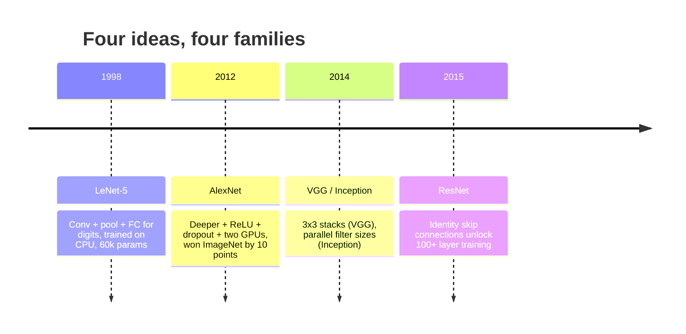
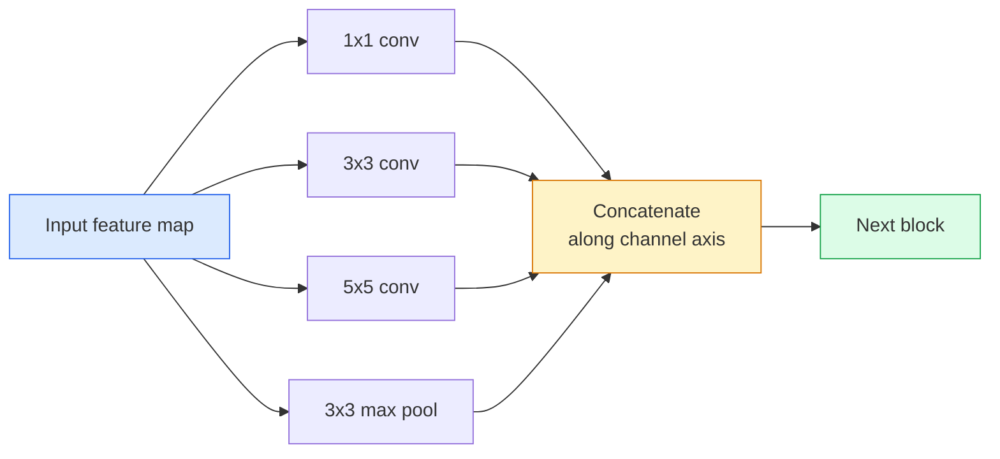
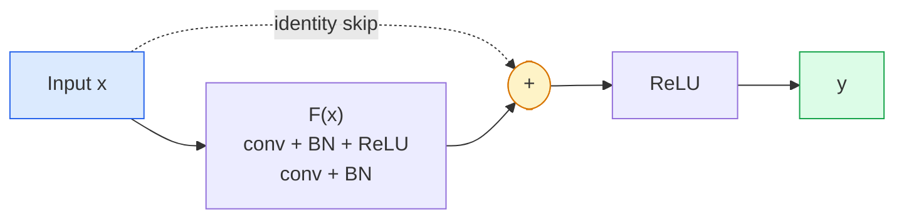

# سی ان ان  لنت به رزنت

> هر سی ان ان بزرگ در سی سال گذشته همان ترکیب غیر خطی است.

**Type:** Learn + Build
**Languages:** Python
**Prerequisites:** Phase 3 Lesson 11 (PyTorch), Phase 4 Lesson 01 (Image Fundamentals), Phase 4 Lesson 02 (Convolutions from Scratch)
**Time:** ~75 minutes

## اهداف یادگیری

- ردیابی سلسله معماری LeNet-5 -> AlexNet -> VGG -> آغاز -> ResNet و بیان ایده جدید واحد هر خانواده کمک کرد
- پیاده سازی LeNet-5، یک بلوک سبک VGG، و یک بلوک اساسی ResNet در PyTorch، هر کدام تحت 40 خط
- توضیح بده که چرا اتصال های باقیمانده شبکه ی 1000 لایه را از غیر قابل آموزش به پیشرفته تر می کند
- یک ستون فقرات مدرن را بخوانید (ResNet-18, ResNet-50) و قبل از نگاه کردن به منبع، شکل خروجی، میدان گیرنده و شمارش پارامتر آن را پیش بینی کنید

## مشکل

در سال 2011، بهترین تصنیفگر ImageNet حدود 74٪ دقت 5 درجه را کسب کرد. در سال 2012، آلیکسنت 85 درصد امتیاز داشت. در سال 2015، ResNet 96 درصد امتیاز داد. هيچ اطلاعات جديدي وجود نداره هيچ نسل جديد گپيوي نيست دستاوردهای حاصل از ایده های معماری بود. یک مهندس دید کار می کند باید بداند که کدام ایده از کدام کاغذ آمده است زیرا هر ستون فقرات تولیدی که در سال 2026 ارسال می کنید یک ترکیب مجدد از همان قطعات است و چون ایده ها به طور مداوم انتقال می یابند: کنوانس های گروهی از سی ان ان به ترانسفورماتور ها رفتند، ارتباطات باقیمانده از رز نت به هر LLM موجود رفتند، نرمال سازی دسته در مدل های انتشار زندگی می کند.

مطالعه این شبکه ها همچنین شما را در برابر یک اشتباه رایج ایمن می کند: رسیدن به بزرگترین مدل موجود در زمانی که یک شبکه به اندازه LeNet مشکل را حل می کند. MNIST به ResNet نیاز ندارد. دانستن منحنی مقیاس هر خانواده به شما می گوید که کجا روی آن نشسته باشید.

## مفهوم

### چهار ایده که چشم را تغییر دادند



هيچ چيز ديگه اي در چشم هاي کلاسیک به اندازه اين چهار پرش مهم نبود

### LeNet-5 (1998)

شناسه انگشت يان لکن 60 هزار پارامتر دو بلوک مخزن، دو لایه کاملاً متصل، فعاليت تان

```
input (1, 32, 32)
  conv 5x5 -> (6, 28, 28)
  avg pool 2x2 -> (6, 14, 14)
  conv 5x5 -> (16, 10, 10)
  avg pool 2x2 -> (16, 5, 5)
  flatten -> 400
  dense -> 120
  dense -> 84
  dense -> 10
```

هر چیزی که دنیای مدرن به CNN می گوید  پیچیدگی های متناوب و نمونه گیری پایین یک سر طبقه بندی کوچک  LeNet با لایه های بیشتر، کانال های بزرگتر و فعال سازی های بهتر است.

### AlexNet (2012)

سه تغییر که با هم ImageNet را شکستند:

1. **ReLU**در عوض از تانه، درجه بندي ها از بين رفتن متوقف مي شوند.
2. **Dropout**در سر کاملاً متصل شده است. تنظیم به یک لایه تبدیل می شود، نه یک ترفند.
3. **Depth and width**پنج لایه مخزن، سه لایه گنده، پارامتر 60 ميليتر، که روی دو گپيو آموزش داده شده و مدل در آن ها تقسیم شده است.

شکل 2 هنوز هم GPU را به دو جریان موازی تقسیم می کند. این موازی یک راه حل سخت افزاری بود، نه یک بینش معماری  اما سه ایده فوق هنوز در هر مدل استفاده می شود.

### VGG (2014)

VGG پرسید: چه اتفاقی می افتد اگر شما فقط از 3x3 پیچ استفاده کنید و عمیق شوید؟

```
stack:   conv 3x3 -> conv 3x3 -> pool 2x2
repeat:  16 or 19 conv layers
```

دو کنو 3x3 همان منطقه ورودی 5x5 را با یک کنو 5x5 می بینند اما با پارامترهای کمتری (2 * 9 * C^2 = 18C^2 در مقابل 25 * C^2) و یک ReLU اضافی در میان. VGG این مشاهده را به یک معماری کامل تبدیل کرد. سادگی  یک نوع بلوک ، تکرار  آن را نقطه مرجع برای همه چیز بعد از آن ساخت.

هزینه: 138 میلیون پارامتر، آموزش کند، در نتیجه گیری گران است.

### آغاز (2014, همان سال)

پاسخ گوگل به "چه اندازه هسته ای باید استفاده کنم؟" این بود: همه آنها، به طور موازی.



هر شاخه تخصصی  1x1 برای مخلوط کردن کانال، 3x3 برای بافت محلی، 5x5 برای الگوهای بزرگتر، جمع آوری برای ویژگی های تغییر تغییر تغییر  و concat اجازه می دهد لایه بعدی انتخاب هر شاخه مفید است. ابتدا v1 از پیچیدگی های 1x1 در داخل هر شاخه به عنوان یک گلو بطری برای حفظ شمارش پارامتر سالم استفاده کرد.

### مشکل تخریب

در سال 2015، VGG-19 کار کرد و VGG-32 کار نکرد. عمق قرار بود کمک کند، اما پس از ~20 لایه هر دو تمرین و از دست دادن آزمایش بدتر شد. این بیش از حد مناسب نیست. این بهینه سازی کننده نمی تواند وزنه های مفید را پیدا کند زیرا گرادینت ها در هر لایه چندان کوچک می شوند.

```
Plain deep network:
  y = f_L( f_{L-1}( ... f_1(x) ... ) )

Gradient wrt early layer:
  dL/dW_1 = dL/dy * df_L/df_{L-1} * ... * df_2/df_1 * df_1/dW_1

Each multiplicative term has magnitude roughly (weight magnitude) * (activation gain).
Stack 100 of them with gains < 1 and the gradient is effectively zero.
```

VGG در 19 لایه کار می کرد زیرا استاندارد دسته (در همان زمان منتشر شده) فعال سازی ها را به خوبی مقیاس بندی می کرد. اما حتی استاندارد دسته نمی توانست عمق بیش از 30 لایه را نجات دهد.

### ResNet (2015)

اون، ژانگ، رن، سون يک تغییر پيشنهاد کردند که همه چيز رو درست کرد

```
standard block:   y = F(x)
residual block:   y = F(x) + x
```

.`+ x`یعنی لایه ها همیشه می توانند انتخاب کنند که با رانندگی هیچ کاری نکنند`F(x)`یک شبکه رزنت 1000 لایه ای در حال حاضر به اندازه یک شبکه یک لایه بد است، زیرا هر بلوک اضافی یک دریچه فرار معمولی دارد. با این تضمین، بهینه سازی کننده مایل است که هر بلوک * کمی * مفید باشد و کمی مفید باشد، 100 بار جمع شده، پیشرفته است.



دو نوع بلوک همه جا ظاهر شده:

- **BasicBlock**(ResNet-18, ResNet-34): دو تا 3x3 کنو، دور هر دو.
- **Bottleneck**(ResNet-50، -101، -152): 1x1 پایین، 3x3 وسط، 1x1 بالا، دور سه نفره، پایین تر وقتی تعداد کانال ها بالا باشد.

هنگامی که skip باید یک نمونه پایین (دستور=2) را عبور کند، مسیر هویت با یک 1x1دستور=2 conv جایگزین می شود تا اشکال را مطابقت دهد.

### چرا بقایای مواد مهم تر از دید است

این ایده در واقع در مورد طبقه بندی تصویر نبود. این در مورد تبدیل شبکه های عمیق از "برگ های خود را عبور کنید و امید کنید که گرادینت ها زنده بمانند" به یک ابزار مهندسی قابل اعتماد و مقیاس پذیر است. هر ترانسفورماتور که در مورد مرحله بعدی خواهید خواند دقیقا همان اتصال تخلیه در هر بلوک دارد. بدون ResNet، GPT وجود ندارد.

```figure
pooling
```

## آن را بسازید

### مرحله ی اول: لینت ۵

حداقل و وفادار به لنت فعاليت هاي تانهاي متوسط جمعيت تنها تخفیف جديديت اينه که ما از`nn.CrossEntropyLoss`به جاي ارتباط هاي اصلي گاسسي به پايين سير

```python
import torch
import torch.nn as nn
import torch.nn.functional as F

class LeNet5(nn.Module):
    def __init__(self, num_classes=10):
        super().__init__()
        self.conv1 = nn.Conv2d(1, 6, kernel_size=5)
        self.conv2 = nn.Conv2d(6, 16, kernel_size=5)
        self.pool = nn.AvgPool2d(2)
        self.fc1 = nn.Linear(16 * 5 * 5, 120)
        self.fc2 = nn.Linear(120, 84)
        self.fc3 = nn.Linear(84, num_classes)

    def forward(self, x):
        x = self.pool(torch.tanh(self.conv1(x)))
        x = self.pool(torch.tanh(self.conv2(x)))
        x = torch.flatten(x, 1)
        x = torch.tanh(self.fc1(x))
        x = torch.tanh(self.fc2(x))
        return self.fc3(x)

net = LeNet5()
x = torch.randn(1, 1, 32, 32)
print(f"output: {net(x).shape}")
print(f"params: {sum(p.numel() for p in net.parameters()):,}")
```

تولید انتظار می رود: `output: torch.Size([1, 10])`،`params: 61,706`این کل طبقه بندی اعداد است که شروع به دید مدرن کرد.

### مرحله دوم: یک بلاک VGG

یک بلوک قابل استفاده مجدد: دو کنو 3×3، ReLU، استاندارد دسته، حداکثر حوضچه.

```python
class VGGBlock(nn.Module):
    def __init__(self, in_c, out_c):
        super().__init__()
        self.conv1 = nn.Conv2d(in_c, out_c, kernel_size=3, padding=1)
        self.bn1 = nn.BatchNorm2d(out_c)
        self.conv2 = nn.Conv2d(out_c, out_c, kernel_size=3, padding=1)
        self.bn2 = nn.BatchNorm2d(out_c)
        self.pool = nn.MaxPool2d(2)

    def forward(self, x):
        x = F.relu(self.bn1(self.conv1(x)))
        x = F.relu(self.bn2(self.conv2(x)))
        return self.pool(x)

class MiniVGG(nn.Module):
    def __init__(self, num_classes=10):
        super().__init__()
        self.stack = nn.Sequential(
            VGGBlock(3, 32),
            VGGBlock(32, 64),
            VGGBlock(64, 128),
        )
        self.head = nn.Sequential(
            nn.AdaptiveAvgPool2d(1),
            nn.Flatten(),
            nn.Linear(128, num_classes),
        )

    def forward(self, x):
        return self.head(self.stack(x))

net = MiniVGG()
x = torch.randn(1, 3, 32, 32)
print(f"output: {net(x).shape}")
print(f"params: {sum(p.numel() for p in net.parameters()):,}")
```

سه بلوک VGG با ورودی اندازه CIFAR، یک استخر سازنده، یک لایه خطی. ~290k پارامتر.

### مرحله 3: یک بلاک اساسی ResNet

سنگ اصلی ساخت و ساز ResNet-18 و ResNet-34.

```python
class BasicBlock(nn.Module):
    def __init__(self, in_c, out_c, stride=1):
        super().__init__()
        self.conv1 = nn.Conv2d(in_c, out_c, kernel_size=3, stride=stride, padding=1, bias=False)
        self.bn1 = nn.BatchNorm2d(out_c)
        self.conv2 = nn.Conv2d(out_c, out_c, kernel_size=3, stride=1, padding=1, bias=False)
        self.bn2 = nn.BatchNorm2d(out_c)
        if stride != 1 or in_c != out_c:
            self.shortcut = nn.Sequential(
                nn.Conv2d(in_c, out_c, kernel_size=1, stride=stride, bias=False),
                nn.BatchNorm2d(out_c),
            )
        else:
            self.shortcut = nn.Identity()

    def forward(self, x):
        out = F.relu(self.bn1(self.conv1(x)))
        out = self.bn2(self.conv2(out))
        out = out + self.shortcut(x)
        return F.relu(out)
```

`bias=False`در لایه های conv یک کنوانسیون استاندارد دسته است  پارامتر بتا BN قبلاً با تعصب کار می کند، بنابراین حمل تعصب conv نیز ضایعه است.`shortcut`تنها زمانی که تعداد گام ها یا کانال ها تغییر کند به یک conv واقعی نیاز دارد؛ در غیر این صورت یک هویت بدون عملیات است.

### مرحله چهارم: یک شبکه کوچک

چهار گروه از بلاک های اساسی را جمع کنید تا یک ResNet کار برای ورودی های اندازه CIFAR داشته باشید.

```python
class TinyResNet(nn.Module):
    def __init__(self, num_classes=10):
        super().__init__()
        self.stem = nn.Sequential(
            nn.Conv2d(3, 32, kernel_size=3, stride=1, padding=1, bias=False),
            nn.BatchNorm2d(32),
            nn.ReLU(inplace=True),
        )
        self.layer1 = self._make_group(32, 32, num_blocks=2, stride=1)
        self.layer2 = self._make_group(32, 64, num_blocks=2, stride=2)
        self.layer3 = self._make_group(64, 128, num_blocks=2, stride=2)
        self.layer4 = self._make_group(128, 256, num_blocks=2, stride=2)
        self.head = nn.Sequential(
            nn.AdaptiveAvgPool2d(1),
            nn.Flatten(),
            nn.Linear(256, num_classes),
        )

    def _make_group(self, in_c, out_c, num_blocks, stride):
        blocks = [BasicBlock(in_c, out_c, stride=stride)]
        for _ in range(num_blocks - 1):
            blocks.append(BasicBlock(out_c, out_c, stride=1))
        return nn.Sequential(*blocks)

    def forward(self, x):
        x = self.stem(x)
        x = self.layer1(x)
        x = self.layer2(x)
        x = self.layer3(x)
        x = self.layer4(x)
        return self.head(x)

net = TinyResNet()
x = torch.randn(1, 3, 32, 32)
print(f"output: {net(x).shape}")
print(f"params: {sum(p.numel() for p in net.parameters()):,}")
```

چهار گروه دو بلوک هر کدام. مرحله 2 در آغاز گروه های 2, 3, 4. تعداد کانال در هر نمونه پایین دو برابر می شود. حدود 2.8M پارامتر. این دستور استاندارد است که به طور تمیز به ResNet-152 مقیاس می کند.

### مرحله 5: مقایسه عملکرد پارامتر به ویژگی

همان ورودی را در تمام سه شبکه اجرا کنید و شمارش پارامترها را مقایسه کنید.

```python
def summary(name, net, x):
    y = net(x)
    params = sum(p.numel() for p in net.parameters())
    print(f"{name:12s}  input {tuple(x.shape)} -> output {tuple(y.shape)}  params {params:>10,}")

x = torch.randn(1, 3, 32, 32)
summary("LeNet5",     LeNet5(),       torch.randn(1, 1, 32, 32))
summary("MiniVGG",    MiniVGG(),      x)
summary("TinyResNet", TinyResNet(),   x)
```

سه مدل، سه دوران، سه درجه از شدت در تعداد پارامترها برای دقت CIFAR-10، شما به طور متوسط نیاز دارید: 60٪ LeNet، 89٪ MiniVGG، 93٪ TinyResNet پس از چند دوره آموزش.

## ازش استفاده کن

`torchvision.models`این نسخه های پیش از آموزش شما را از همه موارد بالا می دهد. امضای تماس در سراسر خانواده ها یکسان است، که دقیقا نقطه انتزاع ستون فقرات است.

```python
from torchvision.models import resnet18, ResNet18_Weights, vgg16, VGG16_Weights

r18 = resnet18(weights=ResNet18_Weights.IMAGENET1K_V1)
r18.eval()

print(f"ResNet-18 params: {sum(p.numel() for p in r18.parameters()):,}")
print(r18.layer1[0])
print()

v16 = vgg16(weights=VGG16_Weights.IMAGENET1K_V1)
v16.eval()
print(f"VGG-16   params: {sum(p.numel() for p in v16.parameters()):,}")
```

ResNet-18 دارای 11.7M پارامتر است. VGG-16 دارای 138M. دقت مشابه ImageNet top-1 (69.8% در مقابل 71.6%). ارتباطات باقیمانده به شما یک 12x بهره وری پارامتر می خرید. به همین دلیل است که نسخه های ResNet از سال 2016 تا رسیدن ViT در سال 2021 تسلط داشتند و هنوز هم تسلط بر انتشار در دنیای واقعی دارند که در آن محاسبات محدودیت است.

برای یادگیری انتقال، دستور کار همیشه یکسان است: بار قبل از آموزش، یخچال ستون فقرات، جایگزین سر طبقه بندی کننده.

```python
for p in r18.parameters():
    p.requires_grad = False
r18.fc = nn.Linear(r18.fc.in_features, 10)
```

حالا شما یک طبقه بندی کننده CIFAR کلاس 10 دارید که از نمایش هایی که ImageNet پرداخت کرده است، ارث می گیرد.

## -باده

این درس نتیجه می دهد:

- `outputs/prompt-backbone-selector.md` یک پیامک که خانواده CNN مناسب را انتخاب می کند (LeNet/VGG/ResNet/MobileNet/ConvNeXt) به عنوان یک کار، اندازه مجموعه داده ها و بودجه محاسبه.
- `outputs/skill-residual-block-reviewer.md` یک مهارت که یک ماژول PyTorch را می خواند و اشتباهات اتصال عبور را نشان می دهد (مفتوت شارٹ کُت در تغییر گام، ترتیب فعال سازی شارٹ کُت، قرار دادن BN نسبت به اضافه).

## تمرینات

1. **(Easy)**پارامترهای دستي را بشمارید`TinyResNet`طبقه به طبقه مقایسه کنید`sum(p.numel() for p in net.parameters())`. بیشتر بودجه پارامتر ها به کجا می رود  convs, BN یا سر طبقه بندی کننده؟
2. **(Medium)**بلاک گلو بوتل (1x1 -> 3x3 -> 1x1 با skip) را پیاده سازی کنید و از آن برای ساخت یک شبکه سبک ResNet-50 برای CIFAR استفاده کنید.`TinyResNet`. .
3. **(Hard)**اتصال skip رو از  حذف کن`BasicBlock`، یک شبکه "درد" 34 بلوک و یک شبکه ResNet 34 بلوک را در CIFAR-10 برای هر 10 دوره آموزش دهید. از دست دادن تمرین در مقابل دوره برای هر دو. نتیجه He et al. را تکرار کنید. شکل 1 جایی که شبکه عمق ساده به ضرر بالاتر از دوقلو کمتر آن نزدیک می شود.

## اصطلاحات کلیدی

| Term | What people say | What it actually means |
|------|----------------|----------------------|
| Backbone | "The model" | The stack of convolutional blocks that produces the feature map fed to the task head |
| Residual connection | "Skip connection" | `y = F(x) + x`; lets the optimiser learn identity by setting F to zero, which makes arbitrary depth trainable |
| BasicBlock | "Two 3x3 convs with a skip" | The ResNet-18/34 building block: conv-BN-ReLU-conv-BN-add-ReLU |
| Bottleneck | "1x1 down, 3x3, 1x1 up" | The ResNet-50/101/152 block; cheap at high channel counts because the 3x3 runs on a reduced width |
| Degradation problem | "Deeper is worse" | Past ~20 plain conv layers, both training and test error increase; solved by residual connections, not by more data |
| Stem | "The first layer" | The initial conv that converts 3-channel input into the base feature width; usually 7x7 stride 2 for ImageNet, 3x3 stride 1 for CIFAR |
| Head | "The classifier" | The layers after the final backbone block: adaptive pool, flatten, linear(s) |
| Transfer learning | "Pretrained weights" | Loading a backbone trained on ImageNet and fine-tuning only the head on your task |

## خواندن بیشتر

- [Deep Residual Learning for Image Recognition (He et al., 2015)](https://arxiv.org/abs/1512.03385) مقاله ResNet؛ هر ارقام ارزش مطالعه دارد
- [Very Deep Convolutional Networks (Simonyan & Zisserman, 2014)](https://arxiv.org/abs/1409.1556) مقاله VGG؛ هنوز بهترین مرجع برای "چرا 3x3"
- [ImageNet Classification with Deep CNNs (Krizhevsky et al., 2012)](https://papers.nips.cc/paper_files/paper/2012/hash/c399862d3b9d6b76c8436e924a68c45b-Abstract.html) الکس نت؛ روزنامه ای که عصر ویژگی های دستکاری را به پایان رساند
- [Going Deeper with Convolutions (Szegedy et al., 2014)](https://arxiv.org/abs/1409.4842) ابتدایی v1؛ ایده فیلتر موازی که هنوز در ترانسفورماتورهای دید ظاهر می شود
