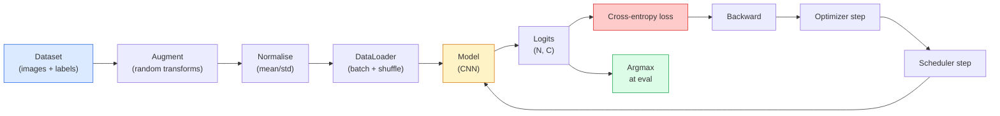

# طبقه بندی تصویر

> طبقه بندیگر یک تابع از پیکسل ها تا توزیع احتمال در کلاس ها است.

**Type:** Build
**Languages:** Python
**Prerequisites:** Phase 2 Lesson 09 (Model Evaluation), Phase 3 Lesson 10 (Mini Framework), Phase 4 Lesson 03 (CNNs)
**Time:** ~75 minutes

## اهداف یادگیری

- ایجاد یک خط پایانی طبقه بندی تصویر از انتهای CIFAR-10: مجموعه داده ها، افزون، مدل، حلقه آموزش، ارزیابی
- نقش هر جزء (دائیتلوڈر، از دست دادن، بهینه سازی، برنامه ریزی، افزایش) را توضیح دهید و پیش بینی کنید که چگونه شکستن هر یک از آنها در منحنی از دست دادن ظاهر می شود
- از ابتدا مخلوط کردن، برش کردن و صاف کردن برچسب ها را اجرا کنید و توجیه کنید که هر کدام ارزش اضافه کردن را داشته باشند
- یک ماتریس سردرگمی و یک جدول دقیق/بازگیره در هر کلاس را برای تشخیص شکست های مجموعه داده ها و مدل ها فراتر از دقت کلی بخوانید

## مشکل

هر کار دید که ارسال می شود به طبقه بندی تصویر در برخی سطوح کاهش می یابد. تشخیص مناطق را طبقه بندی می کند. بخش بندی پیکسل ها را طبقه بندی می کند. بازیافت با شباهت با کلاس مرکزین رتبه بندی می کند. درست طبقه بندی کردن  حلقه مجموعه داده ها، سیاست افزایش، از دست دادن، ارزیابی  مهارت است که به هر کار دیگر در مرحله انتقال می دهد.

بیشتر اشکال طبقه بندی در مدل وجود ندارد. آنها در خط زندگی می کنند: یک استاندارد سازی شکسته، یک مجموعه آموزشی بدون تغییر، افزایش که برچسب ها را تحریف می کند، یک تقسیم اعتبار با داده های آموزش آلوده شده، نرخ یادگیری که بعد از دوره 30 به طور ساکت متفاوت است. یک سی ان ان که با تنظیم درست به 93 درصد در CIFAR-10 برسد معمولاً با خراب شدن 70 تا 75 درصد امتیاز می دهد و منحنی زیان همیشه قابل قبول به نظر می رسد.

این درس تمام لوله ها را به دست میبراند تا هر قسمت قابل بازرسی باشد.`torchvision.datasets`که می تونه یه حشره رو مخفی کنه

## مفهوم

### خط لوله طبقه بندی



هر خطي که در اين حلقه هست يه بگ مي تونه زندگي کنه.`model(x).softmax()`قبل از اینکه از دست دادن به طور آرام gradient اشتباه محاسبه می شود. افزونه ها فقط برای ورودی ها اعمال می شوند، نه برچسب ها  به جز مخلوط، که هر دو را مخلوط می کند. `optimizer.zero_grad()`هر یک از این اشکال منحنی یادگیری را بدون خطا صاف می کند.

### انترپی کراس، لوگیت ها و نرمترین

یک طبقه بندی کننده تولید می کند`C`اعداد هر تصویر به نام logits. استفاده از softmax آنها را به توزیع احتمال تبدیل می کند:

```
softmax(z)_i = exp(z_i) / sum_j exp(z_j)
```

اینترپی متقابل احتمال منفی ثبت کلاس درست را اندازه گیری می کند:

```
CE(z, y) = -log( softmax(z)_y )
        = -z_y + log( sum_j exp(z_j) )
```

شکل دست راست ثابت عددی است (log-sum-exp).`nn.CrossEntropyLoss`نرم ماکس + NLL را در یک عملیات ترکیب می کند و به طور مستقیم logits خام را می گیرد. استفاده از نرم ماکس خود را به صورت اولیه تقریبا همیشه یک خطا است.

### چرا افزونه کار می کند

یک CNN دارای تعصب حرکتی برای ترجمه (از اشتراک وزن) است اما هیچ تغییراتی به محصولات، فلپ ها، رنگ های عصبی یا خاموشی ساخته نشده است. تنها راه برای آموزش آن این تغییراتی این است که پیکسل هایی را که آنها را تمرین می کنند نشان دهید. هر تغییر تصادفی در طول تمرین یک راه برای گفتن است: "این دو تصویر دارای یک برچسب هستند؛ ویژگی هایی را که تفاوت را نادیده می گیرند یاد بگیرید".

```
Original crop:  "dog facing left"
Flip:           "dog facing right"       <- same label, different pixels
Rotate(+15):    "dog, slight tilt"
Colour jitter:  "dog in warmer light"
RandomErasing:  "dog with patch missing"
```

قانون: افزایش باید برچسب را حفظ کند. قطع و چرخش روی یک رقم می تواند "6" را به "9" تبدیل کند؛ برای این مجموعه داده ها از محدوده های چرخش کوچکتر استفاده می کنید و افزایشاتی را انتخاب می کنید که به انواریت های خاص رقم احترام می گذارند.

### مخلوط کردن و برش کردن

افزونه عادي پيكسل ها رو تبديل ميکنه ولي برچسب ها رو تنها نگه مي داره**Mixup**و**cutmix**با همگویی آن را شکستن.

```
Mixup:
  lambda ~ Beta(a, a)
  x = lambda * x_i + (1 - lambda) * x_j
  y = lambda * y_i + (1 - lambda) * y_j

Cutmix:
  paste a random rectangle of x_j into x_i
  y = area-weighted mix of y_i and y_j
```

چرا این کار مفید است: مدل از یاد گرفتن اهداف یک گرم و تیز می ماند و می آموزد که بین کلاس ها بین کلاس ها ارتباط برقرار کند. از دست دادن آموزش افزایش می یابد، دقت آزمون افزایش می یابد. این ارزان ترین ارتقاء ثبات برای هر طبقه بندی کننده است.

### صاف کردن برچسب

يه پسر عموي اشتباه به جاي آموزش در مقابل`[0, 0, 1, 0, 0]`، قطار ضد`[eps/C, eps/C, 1-eps, eps/C, eps/C]`برای یه بچه کوچک`eps`مانند 0.1 . مانع از تولید الگوی به طور تعسفی تیز و بهبود کالیبریشن تقریبا بدون هزینه.`nn.CrossEntropyLoss(label_smoothing=0.1)`از پيترش 1.10

### ارزیابی فراتر از دقت

دقت جمع آوری عدم تعادل را پنهان می کند. یک طبقه بندی کننده دوگانه 90-10 که همیشه نمره اکثریت را پیش بینی می کند 90٪ است. ابزارهای که واقعا به شما می گویند چه اتفاقی می افتد:

- **Per-class accuracy** یک عدد در هر کلاس؛ بلافاصله دسته های کم عملکرد را ظاهر می کند.
- **Confusion matrix** C x C grid با ردیف i col j = تعداد کلاس واقعی i پیش بینی شده به عنوان کلاس j؛ قطر قطر درست است، قطر خارج از قطر قطر جایی است که مدل شما زندگی می کند.
- **Top-1 / Top-5** اینکه آیا کلاس درست در پیش بینی های 1 یا 5 برتر قرار دارد؛ Top-5 برای ImageNet مهم است زیرا کلاس هایی مانند "نورویچ تریئر" در مقابل "نورفولک تریئر" واقعاً مبهم هستند.
- **Calibration (ECE)** آیا پیش بینی 0.8 اطمینان در 80٪ زمان درست است؟ شبکه های مدرن به طور سیستماتیک بیش از حد مطمئن هستند؛ با مقیاس گذاری دمای یا صاف کردن برچسب درست کنید.

```figure
receptive-field
```

## آن را بسازید

### مرحله ی اول: مجموعه داده های سنتی تعیین کننده

CIFAR-10 در دیسک زندگی می کند. برای اینکه این درس قابل بازیافت و سریع باشد ما مجموعه داده های مصنوعی ایجاد می کنیم که شبیه به CIFAR  32x32 تصاویر RGB با ساختار کلاس خاص مدل باید یاد بگیرد. دقیقا همان خط لوله بدون تغییر در CIFAR-10 واقعی کار می کند.

```python
import numpy as np
import torch
from torch.utils.data import Dataset


def synthetic_cifar(num_per_class=1000, num_classes=10, seed=0):
    rng = np.random.default_rng(seed)
    X = []
    Y = []
    for c in range(num_classes):
        centre = rng.uniform(0, 1, (3,))
        freq = 2 + c
        for _ in range(num_per_class):
            yy, xx = np.meshgrid(np.linspace(0, 1, 32), np.linspace(0, 1, 32), indexing="ij")
            r = np.sin(xx * freq) * 0.5 + centre[0]
            g = np.cos(yy * freq) * 0.5 + centre[1]
            b = (xx + yy) * 0.5 * centre[2]
            img = np.stack([r, g, b], axis=-1)
            img += rng.normal(0, 0.08, img.shape)
            img = np.clip(img, 0, 1)
            X.append(img.astype(np.float32))
            Y.append(c)
    X = np.stack(X)
    Y = np.array(Y)
    idx = rng.permutation(len(X))
    return X[idx], Y[idx]


class ArrayDataset(Dataset):
    def __init__(self, X, Y, transform=None):
        self.X = X
        self.Y = Y
        self.transform = transform

    def __len__(self):
        return len(self.X)

    def __getitem__(self, i):
        img = self.X[i]
        if self.transform is not None:
            img = self.transform(img)
        img = torch.from_numpy(img).permute(2, 0, 1)
        return img, int(self.Y[i])
```

هر کلاس رنگ و فرکانس خود را می گیرد، به علاوه صداهای گاوسی برای مجبور کردن مدل به یادگیری سیگنال به جای حفظ پیکسل ها. ده کلاس، هر یک از هزاران تصویر، متناوب است.

### مرحله دوم: عادی سازی و افزایش

این دو تغییراتی که هر خط خط دید دارد.

```python
def standardize(mean, std):
    mean = np.array(mean, dtype=np.float32)
    std = np.array(std, dtype=np.float32)
    def _fn(img):
        return (img - mean) / std
    return _fn


def random_hflip(p=0.5):
    def _fn(img):
        if np.random.random() < p:
            return img[:, ::-1, :].copy()
        return img
    return _fn


def random_crop(pad=4):
    def _fn(img):
        h, w = img.shape[:2]
        padded = np.pad(img, ((pad, pad), (pad, pad), (0, 0)), mode="reflect")
        y = np.random.randint(0, 2 * pad)
        x = np.random.randint(0, 2 * pad)
        return padded[y:y + h, x:x + w, :]
    return _fn


def compose(*fns):
    def _fn(img):
        for fn in fns:
            img = fn(img)
        return img
    return _fn
```

بازتاب-پاد قبل از محصول، نه صفر-پاد، چون مرز های سیاه یک سیگنال است که مدل می خواهد یاد بگیرد به شیوه ای بی فایده نادیده بگیرد.

### مرحله سوم: مخلوط کردن

دو تصویر و دو برچسب را در داخل مرحله آموزش مخلوط می کند. به عنوان یک دسته تبدیل اجرا می شود تا در کنار گذرگاه جلو به جای داخل مجموعه داده ها زندگی کند.

```python
def mixup_batch(x, y, num_classes, alpha=0.2):
    if alpha <= 0:
        return x, torch.nn.functional.one_hot(y, num_classes).float()
    lam = float(np.random.beta(alpha, alpha))
    idx = torch.randperm(x.size(0), device=x.device)
    x_mixed = lam * x + (1 - lam) * x[idx]
    y_onehot = torch.nn.functional.one_hot(y, num_classes).float()
    y_mixed = lam * y_onehot + (1 - lam) * y_onehot[idx]
    return x_mixed, y_mixed


def soft_cross_entropy(logits, soft_targets):
    log_probs = torch.log_softmax(logits, dim=-1)
    return -(soft_targets * log_probs).sum(dim=-1).mean()
```

`soft_cross_entropy`این در برابر توزیع نرم لیبل، به صورت یک گرم معمولی کاهش می یابد وقتی هدف دقیقاً یک گرم است.

### مرحله چهارم: حلقه آموزش

نسخه کامل: یک گذر از داده ها، گرادینت ها یک بار در هر دسته، برنامه ریزی کننده یک بار در هر دوره قدم می زند.

```python
import torch
import torch.nn as nn
from torch.utils.data import DataLoader
from torch.optim import SGD
from torch.optim.lr_scheduler import CosineAnnealingLR

def train_one_epoch(model, loader, optimizer, device, num_classes, use_mixup=True):
    model.train()
    total, correct, loss_sum = 0, 0, 0.0
    for x, y in loader:
        x, y = x.to(device), y.to(device)
        if use_mixup:
            x_m, y_soft = mixup_batch(x, y, num_classes)
            logits = model(x_m)
            loss = soft_cross_entropy(logits, y_soft)
        else:
            logits = model(x)
            loss = nn.functional.cross_entropy(logits, y, label_smoothing=0.1)
        optimizer.zero_grad()
        loss.backward()
        optimizer.step()
        loss_sum += loss.item() * x.size(0)
        total += x.size(0)
        # Training accuracy vs the un-mixed labels `y` is only an approximation
        # when mixup is on (the model saw soft targets, not y). Treat it as a
        # rough progress signal; rely on val accuracy for real performance.
        with torch.no_grad():
            pred = logits.argmax(dim=-1)
            correct += (pred == y).sum().item()
    return loss_sum / total, correct / total


@torch.no_grad()
def evaluate(model, loader, device, num_classes):
    model.eval()
    total, correct = 0, 0
    loss_sum = 0.0
    cm = torch.zeros(num_classes, num_classes, dtype=torch.long)
    for x, y in loader:
        x, y = x.to(device), y.to(device)
        logits = model(x)
        loss = nn.functional.cross_entropy(logits, y)
        pred = logits.argmax(dim=-1)
        for t, p in zip(y.cpu(), pred.cpu()):
            cm[t, p] += 1
        loss_sum += loss.item() * x.size(0)
        total += x.size(0)
        correct += (pred == y).sum().item()
    return loss_sum / total, correct / total, cm
```

پنج تا جريان نامتعدى که هر بار که يه حلقه آموزش مي نويسيد چک مي كنيد:

1. `model.train()`قبل از آموزش`model.eval()`قبل از ارزیابی  رفتارهای ترک و دسته بندی عادی را رد می کند.
2. `.zero_grad()`قبل از`.backward()`. .
3. `.item()`وقتی که متریک ها را جمع می کنیم هیچ چیز نمودار محاسبه را زنده نگه نمی دارد.
4. `@torch.no_grad()`در زمان ارزیابی  حافظه و زمان را ذخیره می کند، از حوادث ظریف جلوگیری می کند.
5. Argmax در مقابل logits خام، نه softmax  همان نتیجه، یک آپ کمتر.

### مرحله پنجم: جمعش کن

از  استفاده کن`TinyResNet`از درس قبلی، چند دوره آموزش، ارزیابی.

```python
from main import synthetic_cifar, ArrayDataset
from main import standardize, random_hflip, random_crop, compose
from main import mixup_batch, soft_cross_entropy
from main import train_one_epoch, evaluate
# TinyResNet comes from the previous lesson (03-cnns-lenet-to-resnet).
# Adjust the import path to wherever you stored the previous lesson's code.
from cnns_lenet_to_resnet import TinyResNet  # example placeholder

X, Y = synthetic_cifar(num_per_class=500)
split = int(0.9 * len(X))
X_train, Y_train = X[:split], Y[:split]
X_val, Y_val = X[split:], Y[split:]

mean = [0.5, 0.5, 0.5]
std = [0.25, 0.25, 0.25]
train_tf = compose(random_hflip(), random_crop(pad=4), standardize(mean, std))
eval_tf = standardize(mean, std)

train_ds = ArrayDataset(X_train, Y_train, transform=train_tf)
val_ds = ArrayDataset(X_val, Y_val, transform=eval_tf)

train_loader = DataLoader(train_ds, batch_size=128, shuffle=True, num_workers=0)
val_loader = DataLoader(val_ds, batch_size=256, shuffle=False, num_workers=0)

device = "cuda" if torch.cuda.is_available() else "cpu"
model = TinyResNet(num_classes=10).to(device)
optimizer = SGD(model.parameters(), lr=0.1, momentum=0.9, weight_decay=5e-4, nesterov=True)
scheduler = CosineAnnealingLR(optimizer, T_max=10)

for epoch in range(10):
    tr_loss, tr_acc = train_one_epoch(model, train_loader, optimizer, device, 10, use_mixup=True)
    va_loss, va_acc, _ = evaluate(model, val_loader, device, 10)
    scheduler.step()
    print(f"epoch {epoch:2d}  lr {scheduler.get_last_lr()[0]:.4f}  "
          f"train {tr_loss:.3f}/{tr_acc:.3f}  val {va_loss:.3f}/{va_acc:.3f}")
```

در مجموعه داده های مصنوعی، این به دقت تایید تقریبا کامل در عرض پنج دوره می رسد، که این نکته است: خط لوله درست است، مدل می تواند آنچه را که قابل یادگیری است یاد بگیرد. مجموعه داده را برای CIFAR-10 واقعی تغییر دهید و همان لوله بدون تغییر به ~ 90% حرکت می کند.

### مرحله 6: ماتریس سردرگمی را بخوانید

دقت به تنهایی هرگز به شما نمی گوید که مدل کجا شکست خورده است. ماتریس سردرگمی می گوید.

```python
def print_confusion(cm, labels=None):
    c = cm.shape[0]
    labels = labels or [str(i) for i in range(c)]
    print(f"{'':>6}" + "".join(f"{l:>5}" for l in labels))
    for i in range(c):
        row = cm[i].tolist()
        print(f"{labels[i]:>6}" + "".join(f"{v:>5}" for v in row))
    print()
    tp = cm.diag().float()
    fp = cm.sum(dim=0).float() - tp
    fn = cm.sum(dim=1).float() - tp
    prec = tp / (tp + fp).clamp_min(1)
    rec = tp / (tp + fn).clamp_min(1)
    f1 = 2 * prec * rec / (prec + rec).clamp_min(1e-9)
    for i in range(c):
        print(f"{labels[i]:>6}  prec {prec[i]:.3f}  rec {rec[i]:.3f}  f1 {f1[i]:.3f}")

_, _, cm = evaluate(model, val_loader, device, 10)
print_confusion(cm)
```

صف ها کلاس های واقعی هستند، ستون ها پیش بینی هستند. یک دسته از شمارش های خارج از دایگن بین کلاس های 3 و 5 به این معنی است که مدل این دو را اشتباه می گیرد و نقطه شروع برای جمع آوری داده های هدفمند یا افزایش خاص کلاس را به شما می دهد.

## ازش استفاده کن

`torchvision`برای CIFAR-10 واقعی، کل خط چهار خط و یک حلقه آموزش است.

```python
from torchvision.datasets import CIFAR10
from torchvision.transforms import Compose, RandomCrop, RandomHorizontalFlip, ToTensor, Normalize

mean = (0.4914, 0.4822, 0.4465)
std = (0.2470, 0.2435, 0.2616)
train_tf = Compose([
    RandomCrop(32, padding=4, padding_mode="reflect"),
    RandomHorizontalFlip(),
    ToTensor(),
    Normalize(mean, std),
])
eval_tf = Compose([ToTensor(), Normalize(mean, std)])

train_ds = CIFAR10(root="./data", train=True,  download=True, transform=train_tf)
val_ds   = CIFAR10(root="./data", train=False, download=True, transform=eval_tf)
```

دو چیز برای توجه: متوسط / std**dataset-specific** بر روی مجموعه آموزش CIFAR-10 محاسبه شده است، نه ImageNet  و صفحه بازتاب سیاست محصول پیش فرض جامعه است. نقل و پیوند آمار ImageNet در اینجا یک رسوب دقت ~ 1% است که هیچ کس تا زمانی که کسی پروفایل مدل را پیدا نکند، نمی گیرد.

## -باده

این درس نتیجه می دهد:

- `outputs/prompt-classifier-pipeline-auditor.md` یک پیام که یک اسکریپت آموزش برای پنج متغیر فوق را بررسی می کند و اولین نقض را نشان می دهد.
- `outputs/skill-classification-diagnostics.md` یک مهارت که با توجه به یک ماتریس سردرگمی و یک لیست نام های کلاس، شکست های هر کلاس را خلاصه می کند و موثرترین راه حل را پیشنهاد می کند.

## تمرینات

1. **(Easy)**تمرین یک مدل با و بدون مخلوط برای پنج دوره در مجموعه داده های مصنوعی.
2. **(Medium)**پیاده سازی Cutout  صفر یک مربع تصادفی 8x8 در هر تصویر آموزش  و اجرا کردن ablation در مقابل هیچ افزایش, hflip+crop, hflip+crop+cutout, hflip+crop+mixup. گزارش val دقت برای هر.
3. **(Hard)**یک خط لوله CIFAR-100 (100 کلاس، اندازه ورودی یکسان) بسازید و یک تمرین تمرین ResNet-34 را با دقت 1% از انتشارات بازیافت کنید. اضافه: سه نرخ یادگیری و دو کاهش وزن را پاک کنید، به یک CSV محلی وارد شوید، جدول سردرگمی-ماتریکس-در بالا سردرگمی نهایی را تولید کنید.

## اصطلاحات کلیدی

| Term | What people say | What it actually means |
|------|----------------|----------------------|
| Logits | "Raw outputs" | The pre-softmax vector of C numbers per image; cross-entropy expects these, not softmaxed values |
| Cross-entropy | "The loss" | Negative log-probability of the correct class; combines log-softmax and NLL in one stable op |
| DataLoader | "The batcher" | Wraps a dataset with shuffling, batching, and (optional) multi-worker loading; gets blamed for half of training bugs |
| Augmentation | "Random transforms" | Any pixel-level transform at training time that preserves the label; teaches invariances the CNN does not have natively |
| Mixup / Cutmix | "Mix two images" | Blend both inputs and labels so the classifier learns smooth interpolations instead of hard boundaries |
| Label smoothing | "Softer targets" | Replace one-hot with (1-eps, eps/(C-1), ...); improves calibration and slightly boosts accuracy |
| Top-k accuracy | "Top-5" | The correct class is in the k highest-probability predictions; used on datasets with genuinely ambiguous classes |
| Confusion matrix | "Where errors live" | C x C table where entry (i, j) counts images of true class i predicted as j; diagonal is right, off-diagonal tells you what to fix |

## خواندن بیشتر

- [CS231n: Training Neural Networks](https://cs231n.github.io/neural-networks-3/) هنوز هم روشن ترین دورۀ خط آموزش در یک صفحه
- [Bag of Tricks for Image Classification (He et al., 2019)](https://arxiv.org/abs/1812.01187) هر ترفند کوچک که به طور مشترک ۳ تا ۴ درصد به دقت ResNet در ImageNet اضافه می کند
- [mixup: Beyond Empirical Risk Minimization (Zhang et al., 2017)](https://arxiv.org/abs/1710.09412) مقاله اصلی مخلوط؛ سه صفحه نظریه و آزمایشات متقاعد کننده
- [Why temperature scaling matters (Guo et al., 2017)](https://arxiv.org/abs/1706.04599) کاغذی که ثابت کرد شبکه های مدرن اشتباه استنویس شده و با یک پارامتر مقیاس بندی شده است
