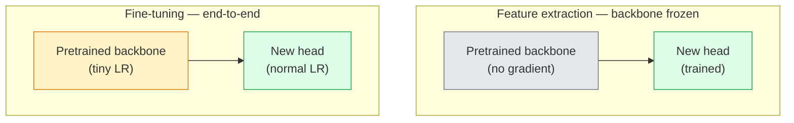

# انتقال یادگیری و تنظیم دقیق

> يه نفر ديگه ميليون ساعت گپيوي رو صرف آموزش دادن به يه شبکه که حواسن، بافت ها و قطعات اجسام چطوري هستن

**Type:** Build
**Languages:** Python
**Prerequisites:** Phase 4 Lesson 03 (CNNs), Phase 4 Lesson 04 (Image Classification)
**Time:** ~75 minutes

## اهداف یادگیری

- از استخراج ویژگی ها با تنظیم دقیق تشخیص دهید و یکی مناسب را بر اساس اندازه مجموعه داده ها، فاصله دامنه و بودجه محاسبه انتخاب کنید
- یک ستون فقرات پیش از آموزش، سر طبقه بندی کننده را جایگزین کنید و فقط سر را به یک خط اصلی کار در کمتر از 20 خط آموزش دهید
- لایه های با نرخ یادگیری تبعیض آمیز را به تدریج از یخ زدایی کنید بنابراین ویژگی های اولیه عمومی از آخرین ویژگی های خاص وظیفه کوچک تر هستند
- تشخیص سه شکست رایج: انحراف ویژگی از LR بیش از حد بالا در بلوک های غیر منجمد، سقوط آمار BN در مجموعه داده های کوچک و فراموشی فاجعه بار

## مشکل

آموزش یک ResNet-50 در ImageNet حدود 2000 ساعت GPU هزینه دارد. خیلی کمی از تیم ها برای هر کاری که ارسال می کنند بودجه ای دارند. آنچه تقریباً هر تیم در واقع ارسال می کند یک ستون فقرات پیش از آموزش است با یک سر جدید که در چند صد یا چند هزار تصویر خاص وظیفه آموزش دیده است.

اين يه راه کوتاه نيست اولین بلاک کنو هر سی ان ان ای که توسط ImageNet آموزش دیده است، حاشیه ها و فیلترهای شبیه به گابور را یاد می گیرد. چند بلوک بعد از آن بافت ها و موتیف های ساده را یاد می گیرند. بلوک های وسط قسمت های شی را یاد می گیرند. بلوک های آخر ترکیبی را یاد می گیرند که به عنوان 1000 دسته ای از ImageNet ظاهر می شوند. ۹۰ درصد اول این سلسله مراتب تقریبا بدون تغییر به تصویربرداری پزشکی، بازرسی صنعتی، داده های ماهواره ای و هر وظیفه دید دیگر منتقل می شود  زیرا طبیعت دارای یک ذخایر محدود از لبه ها و بافت ها است. 10 درصد آخرش اونيه که واقعاً آموزش ميدي

در حال دستیابی به حق انتقال سه خطای وجود دارد که منتظر شما هستند: از بین بردن ویژگی های پیش از آموزش شده با نرخ یادگیری بیش از حد بالا، گرسنگی مدل اطلاعات با یخ زدن بیش از حد، و اجازه دادن به آمار در حال اجرا BatchNorm به سمت مجموعه داده های کوچک که بقیه شبکه هرگز از آن یاد نگرفته است. این درس هر یک از آنها را به طور عمدی راه می رود.

## مفهوم

### استخراج ویژگی ها در مقابل تنظیم دقیق

دو رژیم، با توجه به اینکه چقدر به ویژگی های پیش از آموزش اعتماد می کنید و چقدر اطلاعات دارید.



قوانین عمومي:

| Dataset size | Domain distance | Recipe |
|--------------|-----------------|--------|
| < 1k images | close to ImageNet | Freeze backbone, train head only |
| 1k-10k | close | Freeze first 2-3 stages, fine-tune the rest |
| 10k-100k | any | Fine-tune end-to-end with discriminative LR |
| 100k+ | far | Fine-tune everything; consider training from scratch if domain is far enough |

"به تصویر شبکه نزدیک" به طور خلاصه به معنای عکس های طبیعی RGB با محتوای شبیه به اشیاء است. اسکن های CT پزشکی، تصاویر ماهواره ای و میکروسکوپی دامنه های دور هستند.

### چرا یخ زدن اصلاً کار ميکنه

شبکه تصویر نشان می دهد که CNN می داند که آنها به 1000 دسته تخصصی ندارند. آنها متخصص در آمار تصاویر طبیعی هستند: حواشی در جهت گیری های خاص، بافت ها، الگوهای تعارض، شکل های اولیه. این آمار در تقریباً هر حوزه بصری که انسان می تواند نام دهد پایدار است. به همین دلیل است که یک مدل آموزش دیده در ImageNet و ارزیابی صفر شات در CIFAR-10 با فقط یک سر خطی جدید (هیچ تنظیم دقیق ستون فقرات) به 80٪ + دقت می رسد. سر داره یاد میگیره که کدام ویژگی هایی که قبلاً یاد گرفته شده برای این کار وزن می کنن.

### نرخ یادگیری تبعیض آمیز

وقتی شما یخ زدید، لایه های اولیه باید آهسته تر از لایه های دیر تر تمرین کنند. لایه های اولیه ویژگی های عمومی را که می خواهید حفظ کنید، کدگذاری می کنند؛ لایه های دیر ساختار خاص وظیفه را که نیاز به حرکت زیادی دارید، کدگذاری می کنند.

```
Typical recipe:

  stage 0 (stem + first group): lr = base_lr / 100    (mostly fixed)
  stage 1:                       lr = base_lr / 10
  stage 2:                       lr = base_lr / 3
  stage 3 (last backbone group): lr = base_lr
  head:                          lr = base_lr  (or slightly higher)
```

در PyTorch این فقط یک لیست از گروه های پارامتر منتقل به بهینه ساز است. یک مدل، پنج نرخ یادگیری، صفر کد اضافی.

### مشکل BatchNorm

لایه های BN نگه دارند`running_mean`و`running_var`بفر هایی که در ImageNet محاسبه شده اند. اگر وظیفه شما توزیع پیکسل های متفاوتی دارد  نور مختلف، سنسور مختلف، فضای رنگ مختلف  این بفر ها اشتباه هستند. سه گزینه در ترتیب ترجیح:

1. **Fine-tune with BN in train mode.**اجازه دهید BN آمار اجرا خود را با همه چیز دیگر به روز کند. انتخاب پیش فرض هنگامی که مجموعه داده های کار متوسط است (>= 5k نمونه).
2. **Freeze BN in eval mode.**آمار ImageNet رو نگه دار و فقط وزن ها رو تمرین کن درسته وقتي که مجموعه داده ات به اندازه کافی كوچك باشه که متوسط حرکت BN شور باشه
3. **Replace BN with GroupNorm.**مشکل متوسط حرکت را کاملاً حذف می کند. در ستون فقرات تشخیص و بخش بندی استفاده می شود که در آن اندازه دسته در هر GPU کوچک است.

اشتباه کردن این به طور خاموش دقت 5 تا 15 درصد را افزایش می دهد.

### طراحی سر

سر طبقه بندی کننده 1-3 لایه خطی و یک حذف اختیاری است. هر ستون فقرات مشعل یک سر پیش فرض را ارسال می کند که شما جایگزین می کنید:

```
backbone.fc = nn.Linear(backbone.fc.in_features, num_classes)          # ResNet
backbone.classifier[1] = nn.Linear(..., num_classes)                    # EfficientNet, MobileNet
backbone.heads.head = nn.Linear(..., num_classes)                       # torchvision ViT
```

برای مجموعه داده های کوچک، یک لایه خطی معمولا کافی است. اضافه کردن یک لایه پنهان (خطی -> ReLU -> Droput -> خطی) هنگامی که توزیع کار از توزیع آموزش ستون فقرات دور تر است، کمک می کند.

### تجزیه LR طبق لایه

یک نسخه نرم تر از LR تبعیض آمیز مورد استفاده در تنظیمات جدید (BEiT، DINOv2، ViT-B fine-tunes) به جای گروه بندی لایه ها به مراحل، به هر لایه LR کمی کوچکتر از آن بالا را بدهید:

```
lr_layer_k = base_lr * decay^(L - k)
```

با تجزیه = 0.75 و L = 12 بلوک ترانسفورماتور، اولین بلوک قطار در `0.75^11 ≈ 0.04x`این برای ترانسفارمر های دقیق مهم تر از برای سی ان ان است، جایی که LR های گروه بندی شده به طور معمول کافی هستند.

### چه چیزی را ارزیابی کنیم

دو عدد در زمان انتقال یادگیری مورد نیاز است که شما در یک زمان شروع به کار نمی توانید ردیابی کنید:

- **Pretrained-only accuracy**درست بودن سر با ستون فقرات منجمد
- **Fine-tuned accuracy** همون مدل بعد از آموزش تمام وقت

اگر اندازه ی دقیق کمتر از اندازه ی پیش از آموزش باشد، شما یک خطا یادگیری یا BN دارید. همیشه هر دو را چاپ کنید.

```figure
transfer-learning
```

## آن را بسازید

### مرحله ی اول: یک ستون فقرات پیش از آموزش را بارگذاری کنید و آن را بررسی کنید

```python
import torch
import torch.nn as nn
from torchvision.models import resnet18, ResNet18_Weights

backbone = resnet18(weights=ResNet18_Weights.IMAGENET1K_V1)
print(backbone)
print()
print("classifier head:", backbone.fc)
print("feature dim:", backbone.fc.in_features)
```

`ResNet18`چهار مرحله دارد (`layer1..layer4`) به علاوه یک ساقه و یک`fc`هر ستون فقرات طبقه بندی مشعل دارای ساختار مشابهی است.

### مرحله دوم: استخراج ویژگی  همه چیز را منجمد کنید، سر را جایگزین کنید

```python
def make_feature_extractor(num_classes=10):
    model = resnet18(weights=ResNet18_Weights.IMAGENET1K_V1)
    for p in model.parameters():
        p.requires_grad = False
    model.fc = nn.Linear(model.fc.in_features, num_classes)
    return model

model = make_feature_extractor(num_classes=10)
trainable = sum(p.numel() for p in model.parameters() if p.requires_grad)
frozen = sum(p.numel() for p in model.parameters() if not p.requires_grad)
print(f"trainable: {trainable:>10,}")
print(f"frozen:    {frozen:>10,}")
```

فقط`model.fc`ستون فقرات یک استخراج کننده منجمد است.

### مرحله سوم: تنظیم دقیق تبعیض آمیز

یک ابزار که گروه های پارامتر را با نرخ یادگیری مرحله ای خاص ایجاد می کند.

```python
def discriminative_param_groups(model, base_lr=1e-3, decay=0.3):
    stages = [
        ["conv1", "bn1"],
        ["layer1"],
        ["layer2"],
        ["layer3"],
        ["layer4"],
        ["fc"],
    ]
    groups = []
    for i, names in enumerate(stages):
        lr = base_lr * (decay ** (len(stages) - 1 - i))
        params = [p for n, p in model.named_parameters()
                  if any(n.startswith(k) for k in names)]
        if params:
            groups.append({"params": params, "lr": lr, "name": "_".join(names)})
    return groups

model = resnet18(weights=ResNet18_Weights.IMAGENET1K_V1)
model.fc = nn.Linear(model.fc.in_features, 10)
for p in model.parameters():
    p.requires_grad = True

groups = discriminative_param_groups(model)
for g in groups:
    print(f"{g['name']:>10s}  lr={g['lr']:.2e}  params={sum(p.numel() for p in g['params']):>8,}")
```

`decay=0.3`یعنی هر مرحله از قطار ها با ۳۰ درصد سرعت قطار بعدی. `fc`میره`base_lr`،`layer4`میره`0.3 * base_lr`،`conv1`میره`0.3^5 * base_lr ≈ 0.00243 * base_lr`صداي زيادي، تجربيانه کار ميکنه

### مرحله 4: کار با دسته بندی

کمک به منجمد کردن آمار BN بدون منجمد کردن وزنش

```python
def freeze_bn_stats(model):
    for m in model.modules():
        if isinstance(m, (nn.BatchNorm1d, nn.BatchNorm2d, nn.BatchNorm3d)):
            m.eval()
            for p in m.parameters():
                p.requires_grad = False
    return model
```

بعد از اينکه قرار گرفتي بهش زنگ بزن`model.train()`در آغاز هر دوران`model.train()`همه چیز را به حالت آموزش می کند؛ این فقط برای لایه های BN آن را معکوس می کند.

### مرحله 5: یک حلقه دقیق تنظیم حداقل از انت به انت

```python
from torch.optim import SGD
from torch.utils.data import DataLoader
from torch.optim.lr_scheduler import CosineAnnealingLR
import torch.nn.functional as F

def fine_tune(model, train_loader, val_loader, device, epochs=5, base_lr=1e-3, freeze_bn=False):
    model = model.to(device)
    groups = discriminative_param_groups(model, base_lr=base_lr)
    optimizer = SGD(groups, momentum=0.9, weight_decay=1e-4, nesterov=True)
    scheduler = CosineAnnealingLR(optimizer, T_max=epochs)

    for epoch in range(epochs):
        model.train()
        if freeze_bn:
            freeze_bn_stats(model)
        tr_loss, tr_correct, tr_total = 0.0, 0, 0
        for x, y in train_loader:
            x, y = x.to(device), y.to(device)
            logits = model(x)
            loss = F.cross_entropy(logits, y, label_smoothing=0.1)
            optimizer.zero_grad()
            loss.backward()
            optimizer.step()
            tr_loss += loss.item() * x.size(0)
            tr_total += x.size(0)
            tr_correct += (logits.argmax(-1) == y).sum().item()
        scheduler.step()

        model.eval()
        va_total, va_correct = 0, 0
        with torch.no_grad():
            for x, y in val_loader:
                x, y = x.to(device), y.to(device)
                pred = model(x).argmax(-1)
                va_total += x.size(0)
                va_correct += (pred == y).sum().item()
        print(f"epoch {epoch}  train {tr_loss/tr_total:.3f}/{tr_correct/tr_total:.3f}  "
              f"val {va_correct/va_total:.3f}")
    return model
```

پنج دوره با دستور فوق در مورد CIFAR-10 طول می کشد `ResNet18-IMAGENET1K_V1`از 70 درصد دقت صفر شوت لاینری به 93 درصد دقت دقیق تنظیم شده. سر به تنهایی در حدود 86 درصد بدون اینکه هرگز به ستون فقرات دست بزند.

### مرحله ۶: تخفیف آهسته آهسته

برنامه ای که از پایان تا آغاز هر دوره ای یک مرحله را از یخ می کشاند. کاهش دهنده ها با هزینه برخی دوره های اضافی حرکت می کنند.

```python
def progressive_unfreeze_schedule(model):
    stages = ["layer4", "layer3", "layer2", "layer1"]
    yielded = set()

    def start():
        for p in model.parameters():
            p.requires_grad = False
        for p in model.fc.parameters():
            p.requires_grad = True

    def unfreeze(epoch):
        if epoch < len(stages):
            name = stages[epoch]
            yielded.add(name)
            for n, p in model.named_parameters():
                if n.startswith(name):
                    p.requires_grad = True
            return name
        return None

    return start, unfreeze
```

تماس بگیرید`start()`قبل از اولين دوره`unfreeze(epoch)`هر وقت که مجموعه پارامترهای قابل آموزش تغییر کند، اصلاح کننده را بازسازی کنید، در غیر این صورت پارام های منجمد هنوز لحظه های ذخیره شده را نگه می دارند که آن را گیج می کند.

## ازش استفاده کن

براي اکثر وظایف واقعي،`torchvision.models`+ سه خط کافی است. ماشین آلات سنگین تر در بالا مهم است وقتی شما با مشکلات که پیش فرض کتابخانه نمی تواند حل شود.

```python
from torchvision.models import resnet50, ResNet50_Weights

model = resnet50(weights=ResNet50_Weights.IMAGENET1K_V2)
model.fc = nn.Linear(model.fc.in_features, num_classes)
optimizer = torch.optim.AdamW(model.parameters(), lr=1e-4, weight_decay=1e-4)
```

دو مورد دیگر از معیارهای درجه تولید:

- `timm`کشتی ها ~ 800 نخاع بینایی پیش از آموزش با یک API سازگار (`timm.create_model("resnet50", pretrained=True, num_classes=10)`) براي هر سازنده اي که خارج از باغ وحش مشعل چشم انداز باشه اين استاندارديه
- برای ترانسفورماتورها`transformers.AutoModelForImageClassification.from_pretrained(name, num_labels=N)`به شما ViT / BEiT / DeiT با همان بارگذاری سیمانیک به عنوان مدل های متن.

## -باده

این درس نتیجه می دهد:

- `outputs/prompt-fine-tune-planner.md` یک پرامپت که انتخاب ویژگی استخراج در مقابل پیشرفت در مقابل پایان به پایان تنظیم دقیق بر اساس اندازه مجموعه داده ها، فاصله دامنه و بودجه محاسبه.
- `outputs/skill-freeze-inspector.md` یک مهارت که با توجه به یک مدل PyTorch، گزارش می دهد که کدام پارامترها قابل آموزش هستند، کدام لایه های BatchNorm در حالت ارزیابی هستند و آیا بهینه سازی کننده در واقع به پارامترهای قابل آموزش داده می شود.

## تمرینات

1. **(Easy)**قطار یک`ResNet18`به عنوان یک ساند خطی (پشته ی جمجمه) و به عنوان یک تنظیم کامل در همان مجموعه داده های مصنوعی CIFAR. هر دو دقت را کنار هم گزارش کنید. توضیح دهید که کدام شکاف به شما می گوید ویژگی ها به خوبی انتقال می دهند و کدام می گوید آنها نمی کنند.
2. **(Medium)**به طور عمدی یک خطا وارد کنید: set `base_lr = 1e-1`نشان دهید که از دست دادن تمرین انفجار، سپس با استفاده از `discriminative_param_groups`کمک کننده. LR را ثبت کنید که در آن هر مرحله شروع به منحرف شدن می کند.
3. **(Hard)**یک مجموعه داده های تصویربرداری پزشکی (به عنوان مثال CheXpert-small، PatchCamelyon یا HAM10000) را بگیرید و سه رژیم را مقایسه کنید: (أ) ستون فقرات یخ زده + سر خطی آموزش داده شده توسط ImageNet؛ (ب) آموزش دقیق از انتهای تا انتهای آموزش داده شده توسط ImageNet؛ (ج) آموزش سکریچ. دقت و هزینه محاسبه را برای هر یک گزارش دهید. در چه اندازه مجموعه داده آموزش سکریچ رقابتی می شود؟

## اصطلاحات کلیدی

| Term | What people say | What it actually means |
|------|----------------|----------------------|
| Feature extraction | "Freeze and train head" | Backbone parameters frozen, only the new classifier head receives gradient |
| Fine-tuning | "Retrain end-to-end" | All parameters trainable, usually with much smaller LR than scratch training |
| Discriminative LR | "Smaller LR for early layers" | Optimizer parameter groups where early-stage LR is a fraction of late-stage LR |
| Layer-wise LR decay | "Smooth LR gradient" | Per-layer LR multiplied by decay^(L - k); common in transformer fine-tunes |
| Catastrophic forgetting | "The model lost ImageNet" | A too-high LR overwrites pretrained features before the new task signal is learnt |
| BN statistics drift | "Running mean is wrong" | BatchNorm running_mean/var computed on a different distribution than the current task, silently hurting accuracy |
| Linear probe | "Frozen backbone + linear head" | Evaluation of pretrained features — accuracy of the best linear classifier on top of the frozen representation |
| Catastrophic collapse | "Everything predicts one class" | Happens when fine-tuning with an LR high enough to destroy features before gradients from the head can stabilise |

## خواندن بیشتر

- [How transferable are features in deep neural networks? (Yosinski et al., 2014)](https://arxiv.org/abs/1411.1792) کاغذی که قابلیت انتقال ویژگی ها را در سطوح چندگانه مشخص کرد
- [Universal Language Model Fine-tuning (ULMFiT, Howard & Ruder, 2018)](https://arxiv.org/abs/1801.06146) نسخه اصلی تبعیضگرای LR / تخفیف یخچال پیشرفته؛ ایده ها مستقیماً به چشم منتقل می شوند
- [timm documentation](https://huggingface.co/docs/timm) مرجع برای ستون فقرات بینایی مدرن و معیارهای دقیق دقیق که آنها با آن آموزش دیده اند
- [A Simple Framework for Linear-Probe Evaluation (Kornblith et al., 2019)](https://arxiv.org/abs/1805.08974) چرا دقت سرزنش خطی مهم است و چگونه به درستی گزارش شود
