# تشخیص اشیاء  YOLO از ابتدا

> تشخیص طبقه بندی و بازگشت است، در هر موقعیت در نقشه ویژگی اجرا می شود، سپس با سرکوب غیر حداکثر تمیز می شود.

**Type:** Build
**Languages:** Python
**Prerequisites:** Phase 4 Lesson 03 (CNNs), Phase 4 Lesson 04 (Image Classification), Phase 4 Lesson 05 (Transfer Learning)
**Time:** ~75 minutes

## اهداف یادگیری

- طراحی شبکه و لنگر را که تشخیص را به یک مشکل پیش بینی کثیف تبدیل می کند توضیح دهید و نشان دهید که هر عدد در تنسور خروجی چه معنایی دارد
- محاسبه تقاطع بین جعبه ها و اجرای حذف غیر حداکثر از ابتدا
- یک سر کوچک سبک یولو را روی یک ستون فقرات پیش از آموزش بسازید، از جمله طبقه بندی، اعتراض و بازپسین جعبه
- یک ردیف متریک تشخیص (در دقت@0.5، یادآوری، mAP@0.5، mAP@0.5:0.95) را بخوانید و انتخاب کنید که کدام دکمه را به بعد بزنید

## مشکل

طبقه بندی می گوید "این تصویر یک سگ است". تشخیص می گوید "یک سگ در پیکسل ها (112, 40, 280, 210) وجود دارد، یک گربه در (400, 180, 560, 310) وجود دارد و هیچ چیز دیگری در چارچوب نیست". این یک تغییر ساختاری  پیش بینی تعداد متغیر جعبه های برچسب شده به جای یک برچسب در هر تصویر  چیزی است که هر سیستم مستقل، هر محصول نظارت، هر پارسر طرح اسناد و هر خط دید کارخانه بستگی دارد.

تشخیص هم جایی است که هر معامله مهندسی در بینایی به یکباره ظاهر می شود. شما می خواهید جعبه هایی که دقیق هستند (سر بازپسین) ، شما می خواهید کلاس مناسب برای هر جعبه (سر طبقه بندی) ، شما می خواهید مدل زمانی که هیچ چیز برای تشخیص وجود ندارد را بدانید (نمره شی) و شما می خواهید دقیقا یک پیش بینی برای هر شی واقعی (غیر حداکثر سرکوب). هرکدوم از این ها را از دست بده و لوله یا اشیاء را از دست بده، جعبه های توهم شده را گزارش بده، یا یک شی را پانزده بار در موقعیت های کمی متفاوت پیش بینی کند.

YOLO (You Only Look Once، Redmon et al. 2016) طراحی است که این همه را با یک مرور به جلو از یک شبکه مخزن انجام داد و همان تصمیمات ساختاری هنوز هم ستون فقرات آشکارساز های مدرن (YOLOv8, YOLOv9, YOLO-NAS, RT-DETR) هستند.

## مفهوم

### تشخیص به عنوان پیش بینی کثافت

یک طبقه بندی کننده تعداد C را برای هر تصویر تولید می کند. یک آشکارساز سبک YOLO تولید می کند.`(S x S x (5 + C))`اعداد هر تصویر، جایی که S اندازه شبکه فضایی است.

```mermaid
flowchart LR
    IMG["Input 416x416 RGB"] --> BB["Backbone<br/>(ResNet, DarkNet, ...)"]
    BB --> FM["Feature map<br/>(C_feat, 13, 13)"]
    FM --> HEAD["Detection head<br/>(1x1 convs)"]
    HEAD --> OUT["Output tensor<br/>(13, 13, B * (5 + C))"]
    OUT --> DEC["Decode<br/>(grid + sigmoid + exp)"]
    DEC --> NMS["Non-max suppression"]
    NMS --> RESULT["Final boxes"]

    style IMG fill:#dbeafe,stroke:#2563eb
    style HEAD fill:#fef3c7,stroke:#d97706
    style NMS fill:#fecaca,stroke:#dc2626
    style RESULT fill:#dcfce7,stroke:#16a34a
```



هر یک از آنها`S * S`سلول های شبکه پیش بینی می کنند`B`جعبه ها.برای هر جعبه:

- 4 عدد هندسه رو شرح ميده:`tx, ty, tw, th`. .
- شماره 1 نمره شیری است: "آیا یک شی در این سلول متمرکز است؟"
- اعداد C احتمالات کلاس هستند.

کل هر سلول: `B * (5 + C)`. برای VOC با `S=13, B=2, C=20`، که 50 عدد در هر سلول است.

### چرا شبکه ها و لنگرها

بازپسین ساده پیش بینی می کنه`(x, y, w, h)`برای هر شی به عنوان یک هماهنگی مطلق. این برای یک شبکه conv دشوار است زیرا ترجمه تصویر نباید همه پیش بینی ها را با همان مقدار ترجمه کند  هر شی به صورت فضایی لنگر گرفته است. شبکه با اختصاص هر جعبه حقیقت اصلی به سلول شبکه که مرکز آن در آن قرار دارد پاسخ می دهد. تنها آن سلول مسئول این شی است.

لنگرها به یک مشکل دوم پاسخ می دهند. یک 3x3 conv نمی تواند به راحتی یک جعبه 500 پیکسل گسترده را از یک سلول ویژگی میدان گیرنده 16 پیکسل باز کند. در عوض، ما پیش تعریف می کنیم`B`مدل یاد می گیرد که لنگر درست را انتخاب کند و آن را به جای عقب نشینی از هیچ چیز به عقب بکشد.

```
Anchor box priors (example for 416x416 input):

  small:   (30,  60)
  medium:  (75,  170)
  large:   (200, 380)

At each grid cell, every anchor emits (tx, ty, tw, th, obj, c_1, ..., c_C).
```

آشکارساز های مدرن اغلب از FPN با مجموعه های مختلف لنگر در هر رزولوشن استفاده می کنند لنگرهای کوچک در نقشه های سطح بالا، لنگرهای بزرگ در نقشه های سطح پایین. همان ایده، مقیاس های بیشتری.

### پیش بینی های رمزگذاری

خام`tx, ty, tw, th`هماهنگی های جعبه ای نیستند، بلکه اهداف بازپسین هستند که قبل از نقشه برداری باید تغییر داده شوند:

```
centre x  = (sigmoid(tx) + cell_x) * stride
centre y  = (sigmoid(ty) + cell_y) * stride
width     = anchor_w * exp(tw)
height    = anchor_h * exp(th)
```

`sigmoid`در داخل سلول، تعویضات مرکز را حفظ می کند. `exp`اجازه می دهد که مقیاس عرض بدون تغییر علامت از لنگر آزاد شود.`stride`این مرحله رمزگذاری در هر نسخه یولو از v2 به بعد یکسان است.

### اینو

متریک شباهت جهانی تشخیص بین دو جعبه:

```
IoU(A, B) = area(A intersect B) / area(A union B)
```

IoU = 1 به معنای یکسان است؛ IoU = 0 به معنای هیچ تعادل نیست. IoU بین پیش بینی و جعبه حقیقت اصلی است که آنچه تصمیم می گیرد آیا یک پیش بینی به عنوان یک مثبت واقعی حساب می شود (به طور معمول IoU > = 0.5). IoU بین دو پیش بینی است که NMS برای تخفیف استفاده می کند.

### سرکوب غیر حداکثر

شبکه conv که در لنگر های مجاور آموزش دیده است اغلب جعبه های همپوشانی را برای همان شی پیش بینی می کند. NMS پیش بینی با بالاترین اطمینان را حفظ می کند و هر پیش بینی دیگری را با IoU بالاتر از یک حد حذف می کند.

```
NMS(boxes, scores, iou_threshold):
    sort boxes by score descending
    keep = []
    while boxes not empty:
        pick the top-scoring box, add to keep
        remove every box with IoU > iou_threshold to the picked box
    return keep
```

حدّی معمولی: 0.45 برای تشخیص اشیاء. آشکارساز های اخیر NMS استاندارد را با `soft-NMS`،`DIoU-NMS`، یا به طور مستقیم سرکوب را یاد بگیرید (RT-DETR) اما هدف ساختاری یکسان است.

### خسارت

یولو خسارت سه خسارت را با وزن اضافه می کند:

```
L = lambda_coord * L_box(pred, target, where obj=1)
  + lambda_obj   * L_obj(pred, 1,     where obj=1)
  + lambda_noobj * L_obj(pred, 0,     where obj=0)
  + lambda_cls   * L_cls(pred, target, where obj=1)
```

تنها سلول هایی که حاوی یک شی هستند به بازپسین جعبه و از دست دادن طبقه بندی کمک می کنند. سلول های بدون شی فقط به از دست دادن شی (تعلیم دادن مدل به سکوت) کمک می کنند. `lambda_noobj`معمولاً کوچک است (~0.5) زیرا اکثریت عظیمی از سلول ها خالی هستند و در غیر این صورت بر کل از دست دادن تسلط می گذارند.

انواع مدرن از دست دادن جعبه MSE را به CIoU / DIoU (که IoU را به طور مستقیم بهینه می کند) ، از دست دادن فوکال برای عدم تعادل کلاس استفاده می کنند و اعتراض را با از دست دادن فوکال کیفیت تعادل می دهند. ساختار سه عنصر بدون تغییر است.

### متریک های تشخیص

دقت به کشف منتقل نمیشه چهار عدد که می کنن:

- **Precision@IoU=0.5** از پیش بینی ها به عنوان مثبت شمارش می شود، چند تا در واقع درست هستند.
- **Recall@IoU=0.5**از اجسام واقعي، چند تا پيدا کرديم
- **AP@0.5** منطقه منحنی بازپس گرفتن دقیق در حد 0.5 IoU، یک عدد در هر کلاس.
- **mAP@0.5:0.95** متوسط AP بیش از حد 0.5, 0.55, ..., 0.95 .

گزارش همه چهار. یک آشکارساز که در mAP@0.5 قوی است اما در mAP@0.5:0.95 ضعیف است، تقریباً اما به شدت مشخص نمی شود؛ با کاهش بازپسین جعبه بهتر اصلاح می شود. یک آشکارساز با دقت بالا و بازپسین کم بیش از حد محافظه کار است؛ حد اعتماد را کاهش می دهد یا وزن شی را افزایش می دهد.

```figure
object-detection-nms
```

## آن را بسازید

### مرحله اول:

کار کردن روی دو دسته جعبه در`(x1, y1, x2, y2)`فرمت

```python
import numpy as np

def box_iou(boxes_a, boxes_b):
    ax1, ay1, ax2, ay2 = boxes_a[:, 0], boxes_a[:, 1], boxes_a[:, 2], boxes_a[:, 3]
    bx1, by1, bx2, by2 = boxes_b[:, 0], boxes_b[:, 1], boxes_b[:, 2], boxes_b[:, 3]

    inter_x1 = np.maximum(ax1[:, None], bx1[None, :])
    inter_y1 = np.maximum(ay1[:, None], by1[None, :])
    inter_x2 = np.minimum(ax2[:, None], bx2[None, :])
    inter_y2 = np.minimum(ay2[:, None], by2[None, :])

    inter_w = np.clip(inter_x2 - inter_x1, 0, None)
    inter_h = np.clip(inter_y2 - inter_y1, 0, None)
    inter = inter_w * inter_h

    area_a = (ax2 - ax1) * (ay2 - ay1)
    area_b = (bx2 - bx1) * (by2 - by1)
    union = area_a[:, None] + area_b[None, :] - inter
    return inter / np.clip(union, 1e-8, None)
```

`(N_a, N_b)`از آن در برابر یک جعبه واقعی زمین با شکل دادن به یکی از آرایه ها استفاده کنید`(1, 4)`. .

### مرحله دوم: سرکوب غیر حداکثر

```python
def nms(boxes, scores, iou_threshold=0.45):
    order = np.argsort(-scores)
    keep = []
    while len(order) > 0:
        i = order[0]
        keep.append(i)
        if len(order) == 1:
            break
        rest = order[1:]
        ious = box_iou(boxes[[i]], boxes[rest])[0]
        order = rest[ious <= iou_threshold]
    return np.array(keep, dtype=np.int64)
```

تعیین کننده`O(N log N)`از نوع و مطابق رفتار`torchvision.ops.nms`در ورودی های یکسان.

### مرحله 3: کدگذاری و رمزگذاری جعبه

تبدیل بین هماهنگی پیکسل ها و `(tx, ty, tw, th)`هدف هایی که شبکه در واقع عقب نشینی می کند.

```python
def encode(box_xyxy, cell_x, cell_y, stride, anchor_wh):
    x1, y1, x2, y2 = box_xyxy
    cx = 0.5 * (x1 + x2)
    cy = 0.5 * (y1 + y2)
    w = x2 - x1
    h = y2 - y1
    tx = cx / stride - cell_x
    ty = cy / stride - cell_y
    tw = np.log(w / anchor_wh[0] + 1e-8)
    th = np.log(h / anchor_wh[1] + 1e-8)
    return np.array([tx, ty, tw, th])


def decode(tx_ty_tw_th, cell_x, cell_y, stride, anchor_wh):
    tx, ty, tw, th = tx_ty_tw_th
    cx = (sigmoid(tx) + cell_x) * stride
    cy = (sigmoid(ty) + cell_y) * stride
    w = anchor_wh[0] * np.exp(tw)
    h = anchor_wh[1] * np.exp(th)
    return np.array([cx - w / 2, cy - h / 2, cx + w / 2, cy + h / 2])


def sigmoid(x):
    return 1.0 / (1.0 + np.exp(-x))
```

آزمون: کد یک جعبه و سپس کد را پاک کنید  شما باید چیزی را به اصل بسیار نزدیک به دست آورید (تا اینکه برعکس sigmoid کاملا قابل برگشت نباشد وقتی `tx`در محدوده پس از سیگمائید نیست).

### مرحله چهارم: حداقل سر یولو

یک مخزن 1x1 روی نقشه ویژگی، تغییر شکل به `(B, S, S, num_anchors, 5 + C)`. .

```python
import torch
import torch.nn as nn

class YOLOHead(nn.Module):
    def __init__(self, in_c, num_anchors, num_classes):
        super().__init__()
        self.num_anchors = num_anchors
        self.num_classes = num_classes
        self.conv = nn.Conv2d(in_c, num_anchors * (5 + num_classes), kernel_size=1)

    def forward(self, x):
        n, _, h, w = x.shape
        y = self.conv(x)
        y = y.view(n, self.num_anchors, 5 + self.num_classes, h, w)
        y = y.permute(0, 3, 4, 1, 2).contiguous()
        return y
```

شکل خروجی: `(N, H, W, num_anchors, 5 + C)`. آخرين ابعاد زنده است`[tx, ty, tw, th, obj, cls_0, ..., cls_{C-1}]`. .

### مرحله پنجم: وظیفه ی حقیقت اصلی

براي هر جعبه ي حقيقت اصلي، تصميم بگير`(cell, anchor)`مسئوليت داره

```python
def assign_targets(boxes_xyxy, classes, anchors, stride, grid_size, num_classes):
    num_anchors = len(anchors)
    target = np.zeros((grid_size, grid_size, num_anchors, 5 + num_classes), dtype=np.float32)
    has_obj = np.zeros((grid_size, grid_size, num_anchors), dtype=bool)

    for box, cls in zip(boxes_xyxy, classes):
        x1, y1, x2, y2 = box
        cx, cy = 0.5 * (x1 + x2), 0.5 * (y1 + y2)
        gx, gy = int(cx / stride), int(cy / stride)
        bw, bh = x2 - x1, y2 - y1

        ious = np.array([
            (min(bw, aw) * min(bh, ah)) / (bw * bh + aw * ah - min(bw, aw) * min(bh, ah))
            for aw, ah in anchors
        ])
        best = int(np.argmax(ious))
        aw, ah = anchors[best]

        target[gy, gx, best, 0] = cx / stride - gx
        target[gy, gx, best, 1] = cy / stride - gy
        target[gy, gx, best, 2] = np.log(bw / aw + 1e-8)
        target[gy, gx, best, 3] = np.log(bh / ah + 1e-8)
        target[gy, gx, best, 4] = 1.0
        target[gy, gx, best, 5 + cls] = 1.0
        has_obj[gy, gx, best] = True
    return target, has_obj
```

انتخاب لنگر "بهترین شکل IoU با حقیقت زمین" است. یک پروکسی ارزان قیمت است که با وظیفه YOLOv2/v3 مطابقت دارد. v5 و بعد از آن از استراتژی های پیچیده تر (مطابق با وظایف، دینامیک k) استفاده می کند که همان ایده را بهبود می بخشد.

### مرحله 6: سه خسارت

```python
def yolo_loss(pred, target, has_obj, lambda_coord=5.0, lambda_obj=1.0, lambda_noobj=0.5, lambda_cls=1.0):
    has_obj_t = torch.from_numpy(has_obj).bool()
    target_t = torch.from_numpy(target).float()

    # box-regression loss: only on cells with objects
    box_pred = pred[..., :4][has_obj_t]
    box_true = target_t[..., :4][has_obj_t]
    loss_box = torch.nn.functional.mse_loss(box_pred, box_true, reduction="sum")

    # objectness loss
    obj_pred = pred[..., 4]
    obj_true = target_t[..., 4]
    loss_obj_pos = torch.nn.functional.binary_cross_entropy_with_logits(
        obj_pred[has_obj_t], obj_true[has_obj_t], reduction="sum")
    loss_obj_neg = torch.nn.functional.binary_cross_entropy_with_logits(
        obj_pred[~has_obj_t], obj_true[~has_obj_t], reduction="sum")

    # classification loss on cells with objects
    cls_pred = pred[..., 5:][has_obj_t]
    cls_true = target_t[..., 5:][has_obj_t]
    loss_cls = torch.nn.functional.binary_cross_entropy_with_logits(
        cls_pred, cls_true, reduction="sum")

    total = (lambda_coord * loss_box
             + lambda_obj * loss_obj_pos
             + lambda_noobj * loss_obj_neg
             + lambda_cls * loss_cls)
    return total, {"box": loss_box.item(), "obj_pos": loss_obj_pos.item(),
                   "obj_neg": loss_obj_neg.item(), "cls": loss_cls.item()}
```

پنج پارامتر هاي فوق العاده که هر آموزش YOLO يا سخت کد يا پاکش ميکنه`lambda_coord=5, lambda_noobj=0.5`در اصل YOLOv1 کاغذ است و هنوز هم به عنوان یک پیش فرض معقول کار می کند.

### مرحله 7: خط لوله ی انفراس

خروجی خام سر را رمزگذاری کنید، sigmoid/exp، حد در مورد موضوعیت و NMS را اعمال کنید.

```python
def postprocess(pred_tensor, anchors, stride, img_size, conf_threshold=0.25, iou_threshold=0.45):
    pred = pred_tensor.detach().cpu().numpy()
    grid_h, grid_w = pred.shape[1], pred.shape[2]
    num_anchors = len(anchors)

    boxes, scores, classes = [], [], []
    for gy in range(grid_h):
        for gx in range(grid_w):
            for a in range(num_anchors):
                tx, ty, tw, th, obj, *cls = pred[0, gy, gx, a]
                score = sigmoid(obj) * sigmoid(np.array(cls)).max()
                if score < conf_threshold:
                    continue
                cls_idx = int(np.argmax(cls))
                cx = (sigmoid(tx) + gx) * stride
                cy = (sigmoid(ty) + gy) * stride
                w = anchors[a][0] * np.exp(tw)
                h = anchors[a][1] * np.exp(th)
                boxes.append([cx - w / 2, cy - h / 2, cx + w / 2, cy + h / 2])
                scores.append(float(score))
                classes.append(cls_idx)

    if not boxes:
        return np.zeros((0, 4)), np.zeros((0,)), np.zeros((0,), dtype=int)
    boxes = np.array(boxes)
    scores = np.array(scores)
    classes = np.array(classes)
    keep = nms(boxes, scores, iou_threshold)
    return boxes[keep], scores[keep], classes[keep]
```

این مسیر کامل ارزیابی است: سر -> کدگذاری -> حد -> NMS.

## ازش استفاده کن

`torchvision.models.detection`دستگاه های تولید با ساختار مفهومی مشابه، بارگذاری یک مدل پیش از آموزش سه خط را می گیرد.

```python
import torch
from torchvision.models.detection import fasterrcnn_resnet50_fpn_v2

model = fasterrcnn_resnet50_fpn_v2(weights="DEFAULT")
model.eval()
with torch.no_grad():
    predictions = model([torch.randn(3, 400, 600)])
print(predictions[0].keys())
print(f"boxes:  {predictions[0]['boxes'].shape}")
print(f"scores: {predictions[0]['scores'].shape}")
print(f"labels: {predictions[0]['labels'].shape}")
```

برای خط های پایپلی در زمان واقعی،`ultralytics`(YOLOv8/v9) استاندارد است:`from ultralytics import YOLO; model = YOLO('yolov8n.pt'); model(img)`. مدل در داخل رمزنگاري و NMS رو اداره ميکنه و همان رو باز مياد `boxes / scores / labels`سه برابر اوني که روي اون ساختي

## -باده

این درس نتیجه می دهد:

- `outputs/prompt-detection-metric-reader.md` یک پیام که یک`precision, recall, AP, mAP@0.5:0.95`به یک تشخیص یک خط و تنها مفید ترین آزمایش بعدی.
- `outputs/skill-anchor-designer.md` یک مهارت که با توجه به مجموعه داده های جعبه های حقیقت اصلی، k-means را اجرا می کند `(w, h)`و مجموعه های لنگر را به هر سطح FPN به همراه آمار پوشش که برای انتخاب تعداد مناسب لنگر ها نیاز دارید، باز می کند.

## تمرینات

1. **(Easy)**اجرا`box_iou`و با اون مبارزه کن`torchvision.ops.box_iou`در 1000 جفت جعبه تصادفی.`1e-6`. .
2. **(Medium)**بندر`yolo_loss`به نسخه ای که استفاده می کند`CIoU`در یک مجموعه داده های مصنوعی 100 تصویر نشان دهید که CIoU به mAP@0.5:0.95 نهایی بهتر از MSE در همان تعداد دوره ها نزدیک می شود.
3. **(Hard)**پیاده سازی نتیجه گیری چند مقیاس: تغذیه یک تصویر در سه وضوح از طریق مدل، اتحاد پیش بینی جعبه، و اجرا یک NMS واحد در پایان. اندازه گیری mAP بلند مقابل نتیجه گیری یک مقیاس در یک مجموعه نگه داشته.

## اصطلاحات کلیدی

| Term | What people say | What it actually means |
|------|----------------|----------------------|
| Anchor | "Box prior" | A pre-defined box shape at each grid cell from which the network predicts deltas instead of absolute coordinates |
| IoU | "Overlap" | Intersection-over-union of two boxes; the universal similarity measure in detection |
| NMS | "Deduplicate" | Greedy algorithm that keeps highest-score predictions and removes overlapping ones above a threshold |
| Objectness | "Is there something here" | Per-anchor, per-cell scalar predicting whether an object is centred in that cell |
| Grid stride | "Downsample factor" | Pixels per grid cell; a 416-px input with a 13-grid head has stride 32 |
| mAP | "Mean average precision" | Average of the area under the precision-recall curve, averaged over classes and (for COCO) IoU thresholds |
| AP@0.5 | "PASCAL VOC AP" | Average precision with IoU threshold 0.5; the lenient version of the metric |
| mAP@0.5:0.95 | "COCO AP" | Average over IoU thresholds 0.5..0.95 step 0.05; the strict version and current community standard |

## خواندن بیشتر

- [YOLOv1: You Only Look Once (Redmon et al., 2016)](https://arxiv.org/abs/1506.02640) کاغذ پایه ای؛ هر YOLO از آن زمان تا کنون یک اصلاح این ساختار است
- [YOLOv3 (Redmon & Farhadi, 2018)](https://arxiv.org/abs/1804.02767) کاغذی که سر های سبک FPN چند مقیاس را معرفی کرد؛ هنوز هم روشن ترین نمودار
- [Ultralytics YOLOv8 docs](https://docs.ultralytics.com) مرجع تولید فعلی؛ شامل فرمت های مجموعه داده ها، افزونه ها، دستورات آموزش
- [The Illustrated Guide to Object Detection (Jonathan Hui)](https://jonathan-hui.medium.com/object-detection-series-24d03a12f904) بهترین تور به زبان انگلیسی کامل در باغ وحش کشف کننده؛ بی ارزش برای درک چگونگی ارتباط DETR، RetinaNet، FCOS و YOLO
