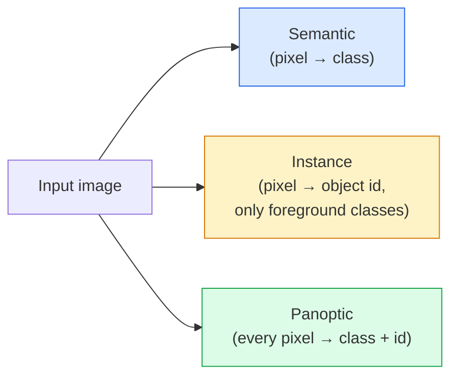
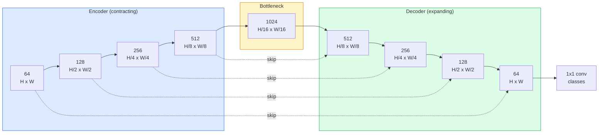

# بخش بندی معنوی  U-Net

> بخش بندی طبقه بندی در هر پیکسل است. U-Net آن را با جفت کردن یک کدگر downsampling با یک کدگر upsampling و اتصال های سیم کشی میان آنها انجام می دهد.

**Type:** Build
**Languages:** Python
**Prerequisites:** Phase 4 Lesson 03 (CNNs), Phase 4 Lesson 04 (Image Classification)
**Time:** ~75 minutes

## اهداف یادگیری

- تفاوت بین بخش بندی معنوی، مثال و پانوپتیک را تشخیص دهید و وظیفه مناسب را برای یک مشکل خاص انتخاب کنید
- یک شبکه ی U-Net را از ابتدا در PyTorch با بلوک های کدرها، یک گلو بطری، یک کدرها با پیچیدگی های انتقال شده و اتصال ها را رد کنید
- پیاده سازی پیکسل-به لحاظ انترپی متقابل، ضایعات Dice، و ضایعات ترکیبی که پیش فرض فعلی برای بخش پزشکی و صنعتی است
- متریک های IoU و Dice را در هر کلاس بخوانید و تشخیص دهید که آیا نمره بد از یادآوری اشیاء کوچک، دقت مرز یا عدم تعادل کلاس ناشی می شود

## مشکل

طبقه بندی یک برچسب را در هر تصویر تولید می کند. تشخیص چند جعبه را در هر تصویر تولید می کند. بخش بندی یک برچسب را در هر پیکسل تولید می کند. برای ورودی اندازه `H x W`، محصول یک تنسور شکل است`H x W`(معنی) یا`H x W x N_instances`این میلیون ها پیش بینی در هر تصویر است، نه یک.

ساختار بخش بندی به همین دلیل است که تقریباً هر محصول پیش بینی فشرده را تقویت می کند: تصویربرداری پزشکی (ماسک های تومور) ، رانندگی مستقل (راه، مسیر، موانع) ، ماهواره (پات ساختمان، مرزهای محصول) ، تجزیه اسناد (مناطق طرح بندی) ، رباتیک (منطقه های قابل لمس). هیچ یک از این وظایف را نمی توان با قرار دادن جعبه در اطراف شی حل کرد؛ آنها به شکل دقیق نیاز دارند.

مشکل معماری ساده است و برای حل آن آسان نیست: شما نیاز به شبکه برای دیدن زمینه جهانی یک تصویر (چه نوع صحنه ای است) و جزئیات پیکسل محلی (به طور دقیق کدام پیکسل جاده مقابل پیاده روی است) در یک زمان. یک CNN استاندارد برای بدست آوردن زمینه، فضای را فشرده می کند، که جزئیات را از بین می برد. U-Net طراحی بود که هر دو را داشت.

## مفهوم

### سیمنتیک در مقابل مثال در مقابل پانوپتیک



- **Semantic**میگه "این پیکسل جاده است، اون پیکسل ماشین است". دو ماشین در کنار هم به یک نقطه سقوط می کنند.
- **Instance**می گوید "این پیکسل ماشین شماره 3 است، این پیکسل ماشین شماره 5 است".
- **Panoptic**هر پیکسل یک برچسب کلاس، هر نمونه یک شناسه منحصر به فرد، چیزهای و چیزهای هر دو به بخش می شود.

این درس شامل معنای است. درس بعدی (Mask R-CNN) شامل مثال است.

### شکل U-Net



کدگر چهار برابر وضوح فضایی را به نصف کاهش می دهد و کانال ها را دو برابر می کند. کدگر معکوس می کند: چهار برابر وضوح فضایی را به دو برابر و نیمی از کانال ها را به نصف کاهش می دهد. اتصال های skip ترکیب ویژگی های کدگر را با ویژگی های کدگر در هر وضوح مطابقت می دهند. نقشه های نهایی 1x1 conv`64 -> num_classes`با قطعنامه کامل

چرا اتصال های skip ضروری است: دیکودر تا زمانی که سعی می کند پیش بینی های سطح پیکسل را انجام دهد، فقط نقشه های ویژگی های کوچک را دیده است. بدون skip ها نمی تواند لبه ها را به درستی شناسایی کند زیرا این اطلاعات در کدگر فشرده شده است. اتصال های skip به آن نقشه های ویژگی های رزولوشن بالا را می دهد که کدگر در راه پایین محاسبه می شود.

### نقل شده در مقابل نمونه بالا دو خطی

کدگر بايد ابعاد فضايي رو گسترش بده دو گزینه:

- **Transposed convolution**(`nn.ConvTranspose2d`)  نمونه بالا قابل یادگیری. پیش فرض U-Net تاریخی. می تواند آثار شطرنج را تولید کند اگر اندازه قدم و هسته به طور مساوی تقسیم نشود.
- **Bilinear upsample + 3x3 conv** نمونه بالا صاف و بعد از آن یک کنو. آثار کمتر، پارامترهای کمتر، حالا پیش فرض مدرن است.

هر دو در طبیعت ظاهر می شوند. برای اولین U-Net، بیلینیر امن تر است.

### انترپی متقابل در شبکه پیکسل

برای بخش بندی معنوی با کلاس های C، تولید مدل `(N, C, H, W)`هدفش اينه`(N, H, W)`با شناسه های کلاس عددی کامل. انترپی کراس با مورد طبقه بندی یکسان است، فقط در هر موقعیت فضایی اعمال می شود:

```
Loss = mean over (n, h, w) of -log( softmax(logits[n, :, h, w])[target[n, h, w]] )
```

`F.cross_entropy`در PyTorch این شکل رو به صورت بومی اداره می کنه

### بازي بازي و چرا به آن نياز داري

این کار اشتباه است وقتی یک کلاس بر قاب تسلط دارد (تصویر پزشکی: 99٪ پس زمینه، 1٪ تومور). شبکه می تواند با پیش بینی پس زمینه در همه جا 99٪ دقت داشته باشد و هنوز هم بی فایده باشد.

بازده بازده بازده بازده بازده بازده بازده بازده بازده بازده بازده بازده بازده بازده بازده بازده بازده بازده بازده بازده بازده بازده بازده بازده بازده بازده بازده بازده بازده بازده بازده بازده بازده بازده بازده بازده بازده بازده بازده بازده بازده بازده بازده بازده بازده بازده بازده بازده بازده بازده بازده بازده بازده بازده بازده بازده بازده بازده بازده بازده بازده بازده بازده بازده بازده بازده بازده بازده بازده بازده بازده بازده بازده بازده بازده بازده بازده بازده بازده بازده بازده بازده بازده بازده بازده بازده بازده بازده بازده بازده بازده بازده بازده بازده بازده بازده بازده بازده بازده بازده بازده بازده بازده بازده بازده بازده بازده بازده بازده بازده بازده بازده بازده بازده بازده بازده بازده بازده بازده بازده بازده بازده بازده بازده بازده بازده بازده بازده بازده بازده بازده بازده بازده بازده بازده بازده بازده بازده بازده بازده بازده بازده بازده بازده بازده بازده بازده بازده بازده بازده بازده بازده بازده بازده بازده بازده بازده بازده بازده بازده بازده بازده بازده بازده بازده بازده بازده بازده بازده بازده بازده بازده بازده بازده بازده بازده بازده بازده باز باز باز باز باز باز بازده بازده باز باز باز بازده باز باز باز باز باز باز باز باز باز باز باز باز باز باز باز باز باز باز باز باز باز باز باز باز باز باز باز باز باز باز باز باز باز باز باز باز باز باز باز باز باز باز باز باز باز باز باز باز باز باز باز باز باز باز باز باز باز باز باز باز باز باز باز باز باز باز باز باز باز باز باز باز باز باز باز باز باز باز باز باز باز باز باز باز باز باز باز باز باز باز باز باز باز باز باز باز باز باز باز باز باز باز باز باز باز باز باز باز باز باز باز باز باز باز باز باز باز باز باز باز باز باز باز باز باز باز باز باز باز باز باز باز باز باز باز باز باز باز باز

```
Dice(p, y) = 2 * sum(p * y) / (sum(p) + sum(y) + epsilon)
Dice_loss = 1 - Dice
```

کجا`p`نقشه احتمال sigmoid/softmax برای یک کلاس است و `y`این یک ماسک حقیقت پایه ی دوگانه است. خسارت تنها زمانی صفر است که تعادل کامل باشد. چون این نسبت مبتنی است، عدم تعادل کلاس غیرمستقیم است.

در عمل، از **combined loss**:

```
L = L_cross_entropy + lambda * L_dice       (lambda ~ 1)
```

این ترکیب پیش فرض تصویربرداری پزشکی است و در هر مجموعه داده بی تعادل کلاس سخت است.

### متریک ارزیابی

- **Pixel accuracy**%پیکسل ها درست پیش بینی شده اند ارزان قیمت داده های نامتوازن به همین دلیل که درست در طبقه بندی هستند شکسته شده است
- **IoU per class** تعادل بین یک اتحادیه برای ماسک هر کلاس؛ متوسط بین کلاس ها = mIoU.
- **Dice (F1 on pixels)** مشابه IoU`Dice = 2 * IoU / (1 + IoU)`.تصوير پزشکي به "ديس" ترجيح ميده، جامعه راننده به "آي يو" ترجيح ميده.
- **Boundary F1** اندازه گیری می کند که مرز های پیش بینی شده چقدر به مرز های واقعی زمین نزدیک هستند و حتی تغییرات کوچک را مجازات می کنند.

گزارش IoU به هر کلاس، نه فقط mIoU. متوسط IoU یک کلاس را در 15 درصد پنهان می کند در حالی که 9 کلاس دیگر در 85 درصد هستند.

### تعادل حل ورودی

کدگر U-Net به نصف رزولوشن چهار برابر کاهش می دهد، بنابراین ورودی باید به 16 تقسیم شود. تصاویر پزشکی اغلب 512x512 یا 1024x1024 هستند. محصولات رانندگی مستقل 2048x1024 هستند. هزینه حافظه U-Net با ۰.۱۰۴ برابر است.`H * W * C_max`، و در 1024x1024 با 1024 کانال گوشه بطری، گذر جلو قبلا از گیگابایت VRAM استفاده می کند.

دو راه حل استاندارد:
1. کاشی ورودی  فرآیند کاشی 256x256 با تعویض و خیاط.
2. گوشه بطری را با پیچ های گسترده ای جایگزین کنید که رزولوشن فضایی را بالاتر نگه می دارند اما میدان گیرنده را گسترش می دهند (خاندان DeepLab).

برای یک مدل اول، ورودی 256x256 با یک شبکه U-Net 64 کانال به راحتی با 8 جی بی VRAM متصل می شود.

```figure
segmentation-flood
```

## آن را بسازید

### مرحله اول: بلاک کدرها

دو کنو 3×3 با استاندارد دسته و ReLU. اولین کنو تعداد کانال را تغییر می دهد؛ دوم آن را نگه می دارد.

```python
import torch
import torch.nn as nn
import torch.nn.functional as F

class DoubleConv(nn.Module):
    def __init__(self, in_c, out_c):
        super().__init__()
        self.net = nn.Sequential(
            nn.Conv2d(in_c, out_c, kernel_size=3, padding=1, bias=False),
            nn.BatchNorm2d(out_c),
            nn.ReLU(inplace=True),
            nn.Conv2d(out_c, out_c, kernel_size=3, padding=1, bias=False),
            nn.BatchNorm2d(out_c),
            nn.ReLU(inplace=True),
        )

    def forward(self, x):
        return self.net(x)
```

این بلوک در کل دوباره استفاده می شود.`bias=False`چون بيتا بي ان با تعصب مقابله ميکنه

### مرحله دوم: بلوک های پایین و بالا

```python
class Down(nn.Module):
    def __init__(self, in_c, out_c):
        super().__init__()
        self.net = nn.Sequential(
            nn.MaxPool2d(2),
            DoubleConv(in_c, out_c),
        )

    def forward(self, x):
        return self.net(x)


class Up(nn.Module):
    def __init__(self, in_c, out_c):
        super().__init__()
        self.up = nn.Upsample(scale_factor=2, mode="bilinear", align_corners=False)
        self.conv = DoubleConv(in_c, out_c)

    def forward(self, x, skip):
        x = self.up(x)
        if x.shape[-2:] != skip.shape[-2:]:
            x = F.interpolate(x, size=skip.shape[-2:], mode="bilinear", align_corners=False)
        x = torch.cat([skip, x], dim=1)
        return self.conv(x)
```

بررسی شکل فقط در فضای (`shape[-2:]`) ورودی هایی را که ابعاد آن به 16 تقسیم نمی شوند، اداره می کند.`F.interpolate`مقایسه شکل کامل نیز باعث ایجاد تفاوت های شمار کانال می شود که باید یک خطا بلند باشد نه یک مداخله خاموش.

### مرحله سوم: شبکه ی U-Net

```python
class UNet(nn.Module):
    def __init__(self, in_channels=3, num_classes=2, base=64):
        super().__init__()
        self.inc = DoubleConv(in_channels, base)
        self.d1 = Down(base, base * 2)
        self.d2 = Down(base * 2, base * 4)
        self.d3 = Down(base * 4, base * 8)
        self.d4 = Down(base * 8, base * 16)
        self.u1 = Up(base * 16 + base * 8, base * 8)
        self.u2 = Up(base * 8 + base * 4, base * 4)
        self.u3 = Up(base * 4 + base * 2, base * 2)
        self.u4 = Up(base * 2 + base, base)
        self.outc = nn.Conv2d(base, num_classes, kernel_size=1)

    def forward(self, x):
        x1 = self.inc(x)
        x2 = self.d1(x1)
        x3 = self.d2(x2)
        x4 = self.d3(x3)
        x5 = self.d4(x4)
        x = self.u1(x5, x4)
        x = self.u2(x, x3)
        x = self.u3(x, x2)
        x = self.u4(x, x1)
        return self.outc(x)

net = UNet(in_channels=3, num_classes=2, base=32)
x = torch.randn(1, 3, 256, 256)
print(f"output: {net(x).shape}")
print(f"params: {sum(p.numel() for p in net.parameters()):,}")
```

شکل خروجی`(1, 2, 256, 256)` اندازه فضایی مشابه ورودی، `num_classes`کانال ها حدود ۷٫۷ میلیون پارامتر در`base=32`. .

### مرحله چهارم: خسارت

```python
def dice_loss(logits, targets, num_classes, eps=1e-6):
    probs = F.softmax(logits, dim=1)
    targets_one_hot = F.one_hot(targets, num_classes).permute(0, 3, 1, 2).float()
    dims = (0, 2, 3)
    intersection = (probs * targets_one_hot).sum(dim=dims)
    denom = probs.sum(dim=dims) + targets_one_hot.sum(dim=dims)
    dice = (2 * intersection + eps) / (denom + eps)
    return 1 - dice.mean()


def combined_loss(logits, targets, num_classes, lam=1.0):
    ce = F.cross_entropy(logits, targets)
    dc = dice_loss(logits, targets, num_classes)
    return ce + lam * dc, {"ce": ce.item(), "dice": dc.item()}
```

بازي ها به هر کلاس محاسبه می شوند و سپس به طور متوسط (بازي های بزرگ) محاسبه می شوند.`eps`مانع تقسیم صفر در کلاس های غائب از دسته می شود.

### مرحله 5: متریک IoU

```python
@torch.no_grad()
def iou_per_class(logits, targets, num_classes):
    preds = logits.argmax(dim=1)
    ious = torch.zeros(num_classes)
    for c in range(num_classes):
        pred_c = (preds == c)
        true_c = (targets == c)
        inter = (pred_c & true_c).sum().float()
        union = (pred_c | true_c).sum().float()
        ious[c] = (inter / union) if union > 0 else torch.tensor(float("nan"))
    return ious
```

یک ویکتور طول C را باز می کند. `nan`نمره های کلاس های غائب از دسته  در مقایسه با کلاس های محاسبه mIoU متوسط نیستند.

### مرحله 6: مجموعه داده های مصنوعی برای تأیید کامل

شکل ها را روی پس زمینه های رنگی تولید کنید تا شبکه باید شکل را یاد بگیرد نه رنگ پیکسل.

```python
import numpy as np
from torch.utils.data import Dataset, DataLoader

def synthetic_segmentation(num_samples=200, size=64, seed=0):
    rng = np.random.default_rng(seed)
    images = np.zeros((num_samples, size, size, 3), dtype=np.float32)
    masks = np.zeros((num_samples, size, size), dtype=np.int64)
    for i in range(num_samples):
        bg = rng.uniform(0, 1, (3,))
        images[i] = bg
        masks[i] = 0
        num_shapes = rng.integers(1, 4)
        for _ in range(num_shapes):
            cls = int(rng.integers(1, 3))
            color = rng.uniform(0, 1, (3,))
            cx, cy = rng.integers(10, size - 10, size=2)
            r = int(rng.integers(4, 12))
            yy, xx = np.meshgrid(np.arange(size), np.arange(size), indexing="ij")
            if cls == 1:
                mask = (xx - cx) ** 2 + (yy - cy) ** 2 < r ** 2
            else:
                mask = (np.abs(xx - cx) < r) & (np.abs(yy - cy) < r)
            images[i][mask] = color
            masks[i][mask] = cls
        images[i] += rng.normal(0, 0.02, images[i].shape)
        images[i] = np.clip(images[i], 0, 1)
    return images, masks


class SegDataset(Dataset):
    def __init__(self, images, masks):
        self.images = images
        self.masks = masks

    def __len__(self):
        return len(self.images)

    def __getitem__(self, i):
        img = torch.from_numpy(self.images[i]).permute(2, 0, 1).float()
        mask = torch.from_numpy(self.masks[i]).long()
        return img, mask
```

سه کلاس: پس زمینه (0) ، دایره ها (1) مربع ها (2) شبکه باید یاد بگیرد شکل را تشخیص دهد.

### مرحله 7: حلقه آموزش

```python
def train_one_epoch(model, loader, optimizer, device, num_classes):
    model.train()
    loss_sum, total = 0.0, 0
    iou_sum = torch.zeros(num_classes)
    for x, y in loader:
        x, y = x.to(device), y.to(device)
        logits = model(x)
        loss, _ = combined_loss(logits, y, num_classes)
        optimizer.zero_grad()
        loss.backward()
        optimizer.step()
        loss_sum += loss.item() * x.size(0)
        total += x.size(0)
        iou_sum += iou_per_class(logits, y, num_classes).nan_to_num(0)
    return loss_sum / total, iou_sum / len(loader)
```

این روش را برای 10 تا 30 دوره در مجموعه داده های مصنوعی اجرا کنید و ببینید mIoU برای کلاس های شکل به بالاتر از 0.9 برسد.`nan_to_num(0)`کلاس های غائب از یک دسته را صفر می داند؛ برای دقیق بودن IoU در هر کلاس، ماسک با حضور و استفاده `torch.nanmean`در زمان ارزیابی به جای متوسط در اینجا.

## ازش استفاده کن

برای تولید`segmentation_models_pytorch`("smp") هر معماری بخش بندی استاندارد را با هر گونه دید مشعل یا ستون فقرات timm پوشش می دهد. سه خط:

```python
import segmentation_models_pytorch as smp

model = smp.Unet(
    encoder_name="resnet34",
    encoder_weights="imagenet",
    in_channels=3,
    classes=3,
)
```

براي کار واقعي هم ارزش ميدونه:
- **DeepLabV3+**جایگزین نمونه گیری پایین مبتنی بر حداکثر استخر با کنو های گسترده شده است تا گلو بطن رزولوشن را حفظ کند. مرز های سریعتر در ماهواره و داده های رانندگی.
- **SegFormer**کدگر کنو به یک ترانسفارمر سلسله مراتبی عوض می کند؛ SOTA فعلی در بسیاری از معیارها.
- **Mask2Former**-**OneFormer**یکپارچه سازی بخش بندی معنوی، نمونه و پانوپتیک در یک معماری واحد.

همه سه تا هم جايگزين شده`smp`یا`transformers`با همان بارگذاری داده ها.

## -باده

این درس نتیجه می دهد:

- `outputs/prompt-segmentation-task-picker.md` یک پرامپت که بین بخش بندی معنوی، نمونه و پانوپتیک انتخاب می کند و معماری را برای یک کار خاص نام می دهد.
- `outputs/skill-segmentation-mask-inspector.md` یک مهارت که توزیع کلاس ها، آمار ماسک پیش بینی شده و کلاس هایی را که پیش بینی نشده یا مرزها مبهم است گزارش می دهد.

## تمرینات

1. **(Easy)**اجرا`bce_dice_loss`برای یک کار تقسیم بندی دوگانه (پیش زمینه در مقابل پس زمینه) ، بر روی مجموعه داده های دو طبقه مصنوعی بررسی کنید که از دست دادن ترکیبی سریعتر از BCE به تنهایی نزدیک می شود وقتی که پیش زمینه 5٪ پیکسل است.
2. **(Medium)**جایگزین کن`nn.Upsample + conv`با یک بلوک بالا`nn.ConvTranspose2d`به سمت بالا. هر دو را در مجموعه داده های مصنوعی تمرین کنید و mIoU را مقایسه کنید. مشاهده کنید که آثار شطرنج در نسخه کنو در نظر گرفته شده ظاهر می شوند.
3. **(Hard)**یک مجموعه داده های واقعی (Pets آکسفورد-IIIT، Citiescapes mini split، یا یک زیر مجموعه پزشکی) را بگیرید و U-Net را به دو نقطه IoU از `smp.Unet`گزارش به صورت کلاس IoU و مشخص کنید که کدام کلاس ها بیشترین سود را از اضافه کردن Dice به خسارت می بینند.

## اصطلاحات کلیدی

| Term | What people say | What it actually means |
|------|----------------|----------------------|
| Semantic segmentation | "Label every pixel" | Per-pixel classification into C classes; instances of the same class merge |
| Instance segmentation | "Label every object" | Separates distinct instances of the same class; foreground-only |
| Panoptic segmentation | "Semantic + instance" | Every pixel gets a class; every thing instance also gets a unique id |
| Skip connection | "U-Net bridge" | Concatenation of encoder features into matching-resolution decoder features; preserves high-frequency detail |
| Transposed conv | "Deconvolution" | Learnable upsampling; can produce checkerboard artifacts |
| Dice loss | "Overlap loss" | 1 - 2|A ∩ B| / (|A| + |B|); optimises mask overlap directly and is robust to class imbalance |
| mIoU | "Mean intersection over union" | Average IoU across classes; the community-standard metric for segmentation |
| Boundary F1 | "Boundary accuracy" | F1 score computed on boundary pixels only; matters for precision-critical tasks |

## خواندن بیشتر

- [U-Net: Convolutional Networks for Biomedical Image Segmentation (Ronneberger et al., 2015)](https://arxiv.org/abs/1505.04597) کاغذ اصلی؛ شکل هرکس که نسخه اش را می گیرد در صفحه 2 است
- [Fully Convolutional Networks (Long et al., 2015)](https://arxiv.org/abs/1411.4038) مقاله ای که برای اولین بار بخش بندی را یک مشکل کنویژن پایان به پایان تبدیل کرد
- [segmentation_models_pytorch](https://github.com/qubvel/segmentation_models.pytorch) مرجع برای بخش بندی تولید؛ هر معماری استاندارد به علاوه هر ضرر استاندارد
- [iafoss, Unet34 submission with TTA (Kaggle notebook)](https://www.kaggle.com/code/iafoss/unet34-submission-tta-0-699-new-public-lb) افزایش زمان تست برای یک شبکه U-Net در یک رقابت واقعی برای بخش بندی
