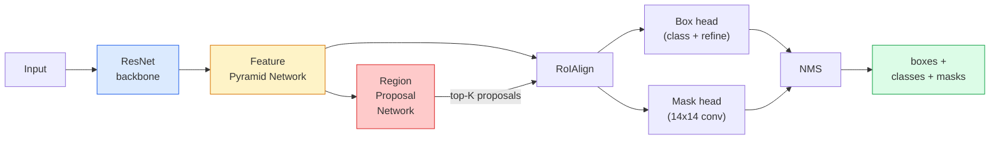

# بخش بندی نمونه  ماسک R-CNN

> به یک کشنده R-CNN سریع تر شاخه ماسک کوچک اضافه کنید و شما بخش بندی نمونه را دارید. بخش سخت این است که RoIAlign، و سخت تر از آن است که به نظر می رسد.

**Type:** Build + Learn
**Languages:** Python
**Prerequisites:** Phase 4 Lesson 06 (YOLO), Phase 4 Lesson 07 (U-Net)
**Time:** ~75 minutes

## اهداف یادگیری

- ردیابی معماری ماسک R-CNN از پایان تا پایان: ستون فقرات، FPN، RPN، RoIAlign، سر جعبه، سر ماسک
- از نو راه اندازی RoIAlign و توضیح دهید که چرا دیگر RoIPool استفاده نمی شود
- از مشعل استفاده کن`maskrcnn_resnet50_fpn_v2`مدل پیش از آموزش برای ماسک های نمونه سازی با کیفیت تولید و خواندن فرمت خروجی آن به درستی
- تنظیم دقیق ماسک R-CNN در یک مجموعه داده کوچک سفارشی با جایگزینی جعبه و سر ماسک و نگه داشتن ستون فقرات یخ زده

## مشکل

بخش بندی معنوی به شما یک ماسک در هر کلاس می دهد. بخش بندی نمونه به شما یک ماسک در هر شی می دهد، حتی اگر دو شی در یک کلاس مشترک باشند. شمارش افراد، ردیابی در سراسر فریم ها و اندازه گیری چیزها (صندوق مرزی هر طناب در یک دیوار، هر سلول در تصویر میکروسکوپ) همه نیاز به بخش بندی نمونه دارند.

ماسک R-CNN (He et al., 2017) این مسئله را با تغییر شکل بخش بندی نمونه به عنوان تشخیص-برابر-ماسک حل کرد. طراحی آنقدر تمیز بود که در پنج سال آینده تقریباً هر کاغذ بخش بندی نمونه یک نوع ماسک R-CNN بود و پیاده سازی torchvision هنوز هم پیش فرض تولید برای مجموعه داده های کوچک تا متوسط است.

مشکل سخت مهندسی نمونه گیری است: چگونه یک منطقه ویژگی اندازه ثابت را از یک جعبه پیشنهاد که گوشه های آن با مرز پیکسل ها سازگار نیست، برش دهید؟ این اشتباه در همه جا به یک دهم نقطه mAP هزینه می کند. RoIAlign پاسخ است.

## مفهوم

### معماری



پنج تا تا تا تا به درک برسيم:

1. **Backbone** ResNet-50 یا ResNet-101 آموزش دیده در ImageNet. تولید یک سلسله مراتب از نقشه های ویژگی در مراحل 4, 8, 16, 32.
2. **FPN (Feature Pyramid Network)** اتصال های بالا و پایین + جانبی که هر کانال سطح C را با ویژگی های غنی از معنوی فراهم می کند. جستجو های تشخیص FPN سطح مطابق با اندازه شی.
3. **RPN (Region Proposal Network)** یک سر کوچک مخزن که در هر موقعیت لنگر پیش بینی می کند "آیا یک شی در اینجا وجود دارد؟" و "چگونه جعبه را بهبود می دهم؟" تولید می کند ~ 1000 پیشنهاد در هر تصویر.
4. **RoIAlign** نمونه های یک پیچ دارای اندازه ثابت (به عنوان مثال 7×7) از هر جعبه در هر سطح FPN. نمونه گیری دو خطی، بدون کوانتاسیون.
5. **Heads** دو لایه سر جعبه که جعبه را اصلاح می کند و کلاس را انتخاب می کند، به علاوه یک سر کوچک مخزن که یک تولید می کند `28x28`ماسک دوگانه برای هر پیشنهاد

### چرا RoIAlign نه RoIPool

در این برنامه، RoIPool استفاده می شود که یک جعبه پیشنهاد را به یک شبکه تقسیم می کند، حداکثر ویژگی را در هر سلول می گیرد و تمام نقاط هماهنگی را به اعداد کامل گرد می کند. این گرد کردن نقشه ویژگی را از نقاط هماهنگی پیکسل ورودی تا پیکسل کامل نقشه ویژگی  کوچک در یک تصویر 224x224 تغییر می دهد.

```
RoIPool:
  box (34.7, 51.3, 98.2, 142.9)
  round -> (34, 51, 98, 142)
  split grid -> round each cell boundary
  misalignment accumulates at every step

RoIAlign:
  box (34.7, 51.3, 98.2, 142.9)
  sample at exact float coordinates using bilinear interpolation
  no rounding anywhere
```

RoIAlign ماسک AP را به صورت رایگان با 3 تا 4 امتیاز بر روی COCO افزایش می دهد. هر آشکارساز که به محل گیری اهمیت می دهد اکنون از آن استفاده می کند  YOLOv7 seg, RT-DETR, Mask2Former به طور یکسان.

### RPN در یک پاراگراف

در هر موقعیت نقشه ویژگی، جعبه های لنگر K را با اندازه و شکل های مختلف قرار دهید. یک نمره شیری برای هر لنگر و یک تعویض بازگشت را پیش بینی کنید تا لنگر را به یک جعبه مناسب تر تبدیل کنید. اون 1000 جعبه رو با نمره نگه داريد، NMS رو در سطح 0.7 به صورت IoU اعمال کنيد و بقيان رو به سر بگيريد RPN با مینی-لوست خودش آموزش داده شده است  همان ساختار از دست دادن YOLO از درس 6، فقط با دو کلاس (جسم / هیچ شی).

### سر ماسک

برای هر پیشنهاد (بعد از RoIAlign) سر ماسک یک FCN کوچک است: چهار کنو 3x3، یک کنو 2x، یک کنو 1x1 نهایی که تولید می کند `num_classes`کانال های خروجی در `28x28`این روش پیش بینی ماسک را از طبقه بندی جدا می کند.

ماسک 28×28 را به اندازه پیکسل اصلی پیشنهاد برای تولید ماسک دوگانه نهایی مقایسه کنید.

### خسارت ها

ماسک آر-CNN چهار خسارت را به هم اضافه کرده:

```
L = L_rpn_cls + L_rpn_box + L_box_cls + L_box_reg + L_mask
```

- `L_rpn_cls`،`L_rpn_box` موضوعیت + بازپسین جعبه برای پیشنهادات RPN.
- `L_box_cls` انترپی متقابل در کلاس های (C+1) (از جمله پس زمینه) در طبقه بندی کننده سر.
- `L_box_reg` L1 صاف در جعبه سر
- `L_mask` در هر پیکسل دوگانه ی کراس انترپی در تولید ماسک 28x28

هر ضرر وزن پیش فرض خود را دارد؛ اجرای مشعل بینی آنها را به عنوان استدلال سازنده نشان می دهد.

### فرمت تولید

`torchvision.models.detection.maskrcnn_resnet50_fpn_v2`یک لیست از دیکت ها را به صورت یک تصویر باز می آورد:

```
{
    "boxes":  (N, 4) in (x1, y1, x2, y2) pixel coordinates,
    "labels": (N,) class IDs, 0 = background so indices are 1-based,
    "scores": (N,) confidence scores,
    "masks":  (N, 1, H, W) float masks in [0, 1] — threshold at 0.5 for binary,
}
```

ماسک هنوز به وضوح کامل تصویر رسیده.

```figure
cv3-roialign-sampling
```

## آن را بسازید

### مرحله ی اول: از نو رویالاین

این یکی از اجزای ماسک R-CNN است که به عنوان کد از آن که به عنوان پروس درک می شود ساده تر است.

```python
import torch
import torch.nn.functional as F

def roi_align_single(feature, box, output_size=7, spatial_scale=1 / 16.0):
    """
    feature: (C, H, W) single-image feature map
    box: (x1, y1, x2, y2) in original image pixel coordinates
    output_size: side of the output grid (7 for box head, 14 for mask head)
    spatial_scale: reciprocal of the feature map stride
    """
    C, H, W = feature.shape
    x1, y1, x2, y2 = [c * spatial_scale - 0.5 for c in box]
    bin_w = (x2 - x1) / output_size
    bin_h = (y2 - y1) / output_size

    grid_y = torch.linspace(y1 + bin_h / 2, y2 - bin_h / 2, output_size)
    grid_x = torch.linspace(x1 + bin_w / 2, x2 - bin_w / 2, output_size)
    yy, xx = torch.meshgrid(grid_y, grid_x, indexing="ij")

    gx = 2 * (xx + 0.5) / W - 1
    gy = 2 * (yy + 0.5) / H - 1
    grid = torch.stack([gx, gy], dim=-1).unsqueeze(0)
    sampled = F.grid_sample(feature.unsqueeze(0), grid, mode="bilinear",
                            align_corners=False)
    return sampled.squeeze(0)
```

هر عدد در یک موقعیت نمونه دو خطی است بدون گرد کردن، بدون مقداری، بدون گرادینت های کاهش یافته

### مرحله دوم: با RoIAlign torchvision مقایسه کنید

```python
from torchvision.ops import roi_align

feature = torch.randn(1, 16, 50, 50)
boxes = torch.tensor([[0, 10, 20, 100, 90]], dtype=torch.float32)  # (batch_idx, x1, y1, x2, y2)

ours = roi_align_single(feature[0], boxes[0, 1:].tolist(), output_size=7, spatial_scale=1/4)
theirs = roi_align(feature, boxes, output_size=(7, 7), spatial_scale=1/4, sampling_ratio=1, aligned=True)[0]

print(f"shape ours:   {tuple(ours.shape)}")
print(f"shape theirs: {tuple(theirs.shape)}")
print(f"max|diff|:    {(ours - theirs).abs().max().item():.3e}")
```

با`sampling_ratio=1`و`aligned=True`، دوتا با هم مطابقت دارن`1e-5`. .

### مرحله سوم: بارگذاری ماسک R-CNN پیش از آموزش

```python
import torch
from torchvision.models.detection import maskrcnn_resnet50_fpn_v2, MaskRCNN_ResNet50_FPN_V2_Weights

model = maskrcnn_resnet50_fpn_v2(weights=MaskRCNN_ResNet50_FPN_V2_Weights.DEFAULT)
model.eval()
print(f"params: {sum(p.numel() for p in model.parameters()):,}")
print(f"classes (including background): {len(model.roi_heads.box_predictor.cls_score.out_features * [0])}")
```

پارامترهای 46M، کلاس 91 (COCO). کلاس اول (ID 0) پس زمینه است؛ همه چیز که مدل در واقع تشخیص می دهد از id 1 شروع می شود.

### مرحله چهارم: نتیجه گیری را اجرا کنید

```python
with torch.no_grad():
    x = torch.randn(3, 400, 600)
    predictions = model([x])
p = predictions[0]
print(f"boxes:  {tuple(p['boxes'].shape)}")
print(f"labels: {tuple(p['labels'].shape)}")
print(f"scores: {tuple(p['scores'].shape)}")
print(f"masks:  {tuple(p['masks'].shape)}")
```

تنسور ماسک شکل داره`(N, 1, H, W)`. حد دست کمي 0.5 براي گرفتن ماسک دوگانه در هر جسم:

```python
binary_masks = (p['masks'] > 0.5).squeeze(1)  # (N, H, W) boolean
```

### مرحله 5: سر ها را برای شمارش کلاس سفارشی عوض کنید

دستور کار معمولی تنظیم دقیق: از ستون فقرات، FPN و RPN استفاده مجدد کنید؛ دو سر طبقه بندی را جایگزین کنید.

```python
from torchvision.models.detection.faster_rcnn import FastRCNNPredictor
from torchvision.models.detection.mask_rcnn import MaskRCNNPredictor

def build_custom_maskrcnn(num_classes):
    model = maskrcnn_resnet50_fpn_v2(weights=MaskRCNN_ResNet50_FPN_V2_Weights.DEFAULT)
    in_features = model.roi_heads.box_predictor.cls_score.in_features
    model.roi_heads.box_predictor = FastRCNNPredictor(in_features, num_classes)
    in_features_mask = model.roi_heads.mask_predictor.conv5_mask.in_channels
    hidden_layer = 256
    model.roi_heads.mask_predictor = MaskRCNNPredictor(in_features_mask, hidden_layer, num_classes)
    return model

custom = build_custom_maskrcnn(num_classes=5)
print(f"custom cls_score.out_features: {custom.roi_heads.box_predictor.cls_score.out_features}")
```

`num_classes`باید کلاس پس زمینه را شامل کند، بنابراین مجموعه داده ای با 4 کلاس شی استفاده می کند `num_classes=5`. .

### مرحله ۶: چیزی را که نیازی به آموزش ندارد، منجمد کنید

در مجموعه داده های کوچک، ستون فقرات و FPN را منجمد کنید. تنها RPN اعتراض + بازگشت و دو سر یاد می گیرند.

```python
def freeze_backbone_and_fpn(model):
    # torchvision Mask R-CNN packs the FPN inside `model.backbone` (as
    # `model.backbone.fpn`), so iterating `model.backbone.parameters()` covers
    # both the ResNet feature layers and the FPN lateral/output convs.
    for p in model.backbone.parameters():
        p.requires_grad = False
    return model

custom = freeze_backbone_and_fpn(custom)
trainable = sum(p.numel() for p in custom.parameters() if p.requires_grad)
print(f"trainable after freeze: {trainable:,}")
```

در مجموعه داده های 500 تصویر این تفاوت بین تقلب و بیش از حد مناسب است.

## ازش استفاده کن

چرخه آموزشی کامل برای ماسک R-CNN در torchvision 40 خط است و بین وظایف  تبادل مجموعه داده ها و رفتن به طور معنی ای تغییر نمی کند.

```python
def train_step(model, images, targets, optimizer):
    model.train()
    loss_dict = model(images, targets)
    losses = sum(loss for loss in loss_dict.values())
    optimizer.zero_grad()
    losses.backward()
    optimizer.step()
    return {k: v.item() for k, v in loss_dict.items()}
```

.`targets`لیست باید دارای دیکت های هر تصویر باشد`boxes`،`labels`و`masks`(به عنوان`(num_instances, H, W)`مدل یک دیکت از چهار خسارت در طول آموزش و یک لیست از پیش بینی ها در طول ارزیابی را به دست می آورد.`model.training`. .

.`pycocotools`evaluator mAP@IoU=0.5:0.95 را برای جعبه ها و ماسک ها تولید می کند؛ شما به هر دو عدد نیاز دارید تا بدانید که آیا سر جعبه یا سر ماسک گوشه بطری است.

## -باده

این درس نتیجه می دهد:

- `outputs/prompt-instance-vs-semantic-router.md` یک پیام که سه سوال می پرسد و نمونه مقابل معنوی مقابل پانوپتیک و مدل دقیق را برای شروع انتخاب می کند.
- `outputs/skill-mask-rcnn-head-swapper.md` یک مهارت که 10 خط کد را برای تغییر سر در هر مدل تشخیص مشعل ایجاد می کند، با توجه به جدید `num_classes`. .

## تمرینات

1. **(Easy)**با هم روالينگ رو بررسي کن`torchvision.ops.roi_align`در 100 جعبه تصادفی. حداکثر تفاوت مطلق را گزارش کنید. همچنین RoIPool (رفتار قبل از 2017) را اجرا کنید و نشان دهید که با ~1-2 پیکسل نقشه ویژگی در جعبه های نزدیک مرز متفاوت است.
2. **(Medium)**- خوب -`maskrcnn_resnet50_fpn_v2`در یک مجموعه داده های سفارشی 50 تصویر (هر دو کلاس: بالون ها، ماهی ها، سوراخ های خیره کننده، لوگو ها) ، ستون فقرات را منجمد کنید، 20 دوره را تمرین کنید، ماسک AP@0.5 را گزارش کنید.
3. **(Hard)**سر ماسک ماسک R-CNN را با سر ماسک ای که در 56x56 به جای 28x28 پیش بینی می کند جایگزین کنید. mAP@IoU = 0.75 را قبل و بعد اندازه گیری کنید. توضیح دهید که چرا افزایش (یا کمبود یک) با تعادل انتظار حد دقیق / حافظه مطابقت دارد.

## اصطلاحات کلیدی

| Term | What people say | What it actually means |
|------|----------------|----------------------|
| Mask R-CNN | "Detection plus masks" | Faster R-CNN + a small FCN head that predicts a 28x28 mask per proposal per class |
| FPN | "Feature pyramid" | Top-down + lateral connections that give every stride level C channels of semantic-rich features |
| RPN | "Region proposer" | A small conv head that produces ~1000 object/no-object proposals per image |
| RoIAlign | "No-rounding crop" | Bilinearly samples a fixed-size feature grid from any float-coordinate box |
| RoIPool | "Pre-2017 crop" | Same purpose as RoIAlign but rounds box coordinates; obsolete |
| Mask AP | "Instance mAP" | Average precision computed with mask IoU instead of box IoU; the COCO instance segmentation metric |
| Binary mask head | "Per-class mask" | Predicts one binary mask per class for each proposal; only the predicted class's channel is kept |
| Background class | "Class 0" | The catch-all "no object" class; indices for real classes start at 1 |

## خواندن بیشتر

- [Mask R-CNN (He et al., 2017)](https://arxiv.org/abs/1703.06870) مقاله؛ بخش 3 در مورد RoIAlign خواندن انتقادی است
- [FPN: Feature Pyramid Networks (Lin et al., 2017)](https://arxiv.org/abs/1612.03144) کاغذ FPN؛ هر آشکارساز مدرن از آن استفاده می کند
- [torchvision Mask R-CNN tutorial](https://pytorch.org/tutorials/intermediate/torchvision_tutorial.html) مرجع برای حلقه تنظیم دقیق
- [Detectron2 model zoo](https://github.com/facebookresearch/detectron2/blob/main/MODEL_ZOO.md) پیاده سازی های تولید با وزنه های آموزش دیده برای تقریباً هر نوع تشخیص و بخش بندی
