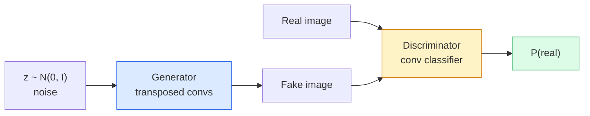
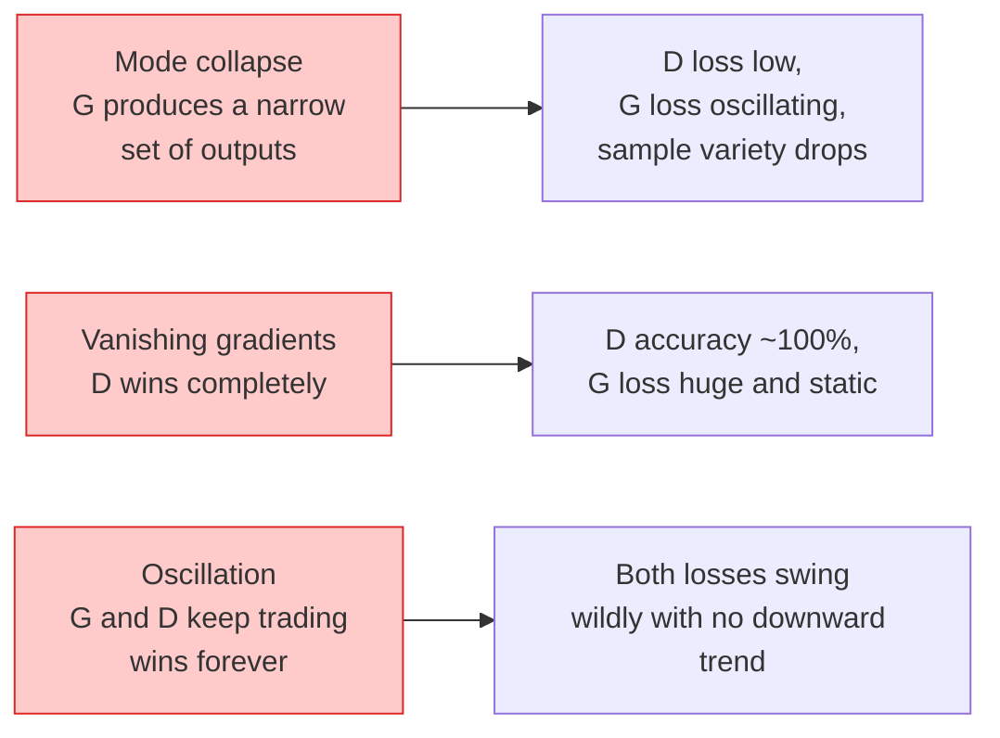

# نسل تصویر  GAN

> يک گان دو شبکه عصبي در يک بازي ثابت است. يک تراز ميکنه، يک انتقاد ميکنه. آنها بهتر با هم مي شوند تا اينکه ترفند ها منتقد رو فریب دهند.

**Type:** Build
**Languages:** Python
**Prerequisites:** Phase 4 Lesson 03 (CNNs), Phase 3 Lesson 06 (Optimizers), Phase 3 Lesson 07 (Regularization)
**Time:** ~75 minutes

## اهداف یادگیری

- بازی حداقل بین ژنراتور و تبعیضگر را توضیح دهید و چرا تعادل با p_model = p_data مطابقت دارد
- یک DCGAN را در PyTorch پیاده سازی کنید و آن را به تولید تصاویر مصنوعی 32x32 منسجم در کمتر از 60 خط
- آموزش GAN را با سه ترفند استاندارد: ضایع غیر پرکننده، استاندارد طیف، TTUR (قاعده دو بار بروزرسانی) استقرار دهید
- منحنیات آموزشی را بخوانید که کنورژن سالم را از سقوط حالت، نوسان و امتیازات تبعیض کننده کاملاً تشخیص می دهند

## مشکل

طبقه بندی به یک شبکه آموزش می دهد تا تصاویر را به برچسب ها نقشه برداری کند. نسل مشکل را معکوس می کند: نمونه ای از تصاویر جدید که به نظر می رسد از همان توزیع آمده اند. هیچ خروجی "صحاب" وجود ندارد که شما بتوانید با آن متفاوت باشید؛ تنها توزیع ای وجود دارد که می خواهید تقلید کنید.

عملکردهای معیاری از دست دادن (MSE، کراس انترپی) نمی توانند اندازه گیری کنند "آیا این نمونه از توزیع واقعی است". حداقل سازی خطای هر پیکسل باعث تولید متوسط های مبهم، نه نمونه های واقع بینانه می شود. پیشرفت این بود که از دست دادن یاد بگیرند: یک شبکه دوم را آموزش دهید که وظیفه آن تشخیص واقعی از جعلی است و از قضاوت خود برای فشار دادن ژنراتور استفاده کنید.

GANs (Goodfellow و همکاران، 2014) این چارچوب را تعریف کردند. در سال 2018 StyleGAN 1024x1024 چهره را تولید می کرد که از عکس ها متمایز می شوند. مدل های انتشار از آن زمان در مورد کیفیت و کنترل پذیری تخت را گرفته اند، اما هر ترفونی که انتشار را عملی می کند  انتخاب های عادی سازی، فضاهای پنهان، از دست دادن ویژگی  برای اولین بار در GAN ها درک شد.

## مفهوم

### دو شبکه



.**generator**G یک ویکتور شور را می گیرد`z`و یک تصویر را خارج می کند.**discriminator**D یک تصویر می گیرد و یک مقیاس را تولید می کند: احتمال اینکه تصویر واقعی باشد.

### بازی

"گ" مي خواد "د" اشتباه کنه. "د" مي خواد درست باشه.

```
min_G max_D  E_x[log D(x)] + E_z[log(1 - D(G(z)))]
```

راست تا چپ بخونید: D دقت واقعی را به حداکثر می رساند (`log D(real)`) و جعلی (`log (1 - D(fake))`G دقت D را در جعل ها به حداقل می رساند  می خواهد `D(G(z))`که به اون بالا بريم

گودفلو ثابت کرد که این حداقل یک تعادل جهانی دارد که`p_G = p_data`, D در همه جا 0.5 تولید می کند و انحراف Jensen-Shannon بین توزیع های تولید شده و واقعی صفر است. بخش سخت رسیدن به آنجا است.

### خسارت غیر تشباع

شکل بالا به لحاظ عددي نامثبيته`D(G(z))`برای هر جعلي نزدیک صفر است، پس`log(1 - D(G(z)))`در نظر گرفتن G، گرادینت های ناپدید شده را دارد.

```
L_D = -E_x[log D(x)] - E_z[log(1 - D(G(z)))]
L_G = -E_z[log D(G(z))]                          # non-saturating
```

حالا چه وقت`D(G(z))`هر قطار مدرن GAN با این نوع قطار می رود.

### قوانین معماری DCGAN

رادفورد، متز، چینتالا (2015) سال ها آزمایشات شکست خورده را به پنج قانون تقسیم کردند که آموزش GAN را پایدار می کند:

1. جمع کردن را با کنواس های قدم (هر دو شبکه) جایگزین کنید.
2. استفاده از استاندارد دسته در هر دو ژنراتور و متمایز کننده، به جز خروجی G و ورودی D.
3. لایه های کاملاً متصل شده را در معماری های عمیق تر حذف کنید.
4. G ReLU را در تمام لایه ها به جز خروجی استفاده می کند (tanh برای خروجی در [-1, 1]).
5. D از LeakyReLU (منفي_مهل = 0.2) در تمام لایه ها استفاده می کند.

هر GAN مدرن مبتنی بر کنو (StyleGAN، BigGAN، GigaGAN) هنوز هم از این قوانین شروع می کند و قطعات را یک به یک جایگزین می کند.

### حالت شکست و امضای آن ها



- **Mode collapse**: G یک تصویر را پیدا می کند که D را فریب می دهد و تنها آن را تولید می کند.
- **Discriminator wins**D خیلی قوی می شود، گرادینت های G ناپدید می شوند. درست: D کوچکتر، سرعت یادگیری D پایین تر، یا نرم کردن برچسب ها را روی برچسب های واقعی اعمال کنید.
- **Oscillation**: دو شبکه تجارت برنده بدون هیچ وقت نزدیک به تعادل.

### ارزیابی

گان ها هيچ حقيقتي در زمين ندارند، پس از کجا ميدوني که کار مي کنن؟

- **Sample inspection**فقط به 64 نمونه در پایان هر دوره نگاه کنید. غیر قابل مذاکره.
- **FID (Fréchet Inception Distance)** فاصله بین توزیع ویژگی های Inception-v3 مجموعه های واقعی و تولید شده. پایین تر بهتر است. استاندارد جامعه.
- **Inception Score** بزرگتر، شکننده تر؛ ترجیح می دهد FID.
- **Precision/Recall for generative models** کیفیت (درست بودن) و پوشش (بازگیره) را به طور جداگانه اندازه گیری می کند.

برای یک آزمایش کوچک از داده های مصنوعی، بررسی نمونه کافی است.

```figure
cv-gan-image
```

## آن را بسازید

### مرحله اول: ژنراتور

یک ژنراتور کوچک DCGAN که صدای 64 بعدی را می گیرد و یک تصویر 32x32 تولید می کند.

```python
import torch
import torch.nn as nn

class Generator(nn.Module):
    def __init__(self, z_dim=64, img_channels=3, feat=64):
        super().__init__()
        self.net = nn.Sequential(
            nn.ConvTranspose2d(z_dim, feat * 4, kernel_size=4, stride=1, padding=0, bias=False),
            nn.BatchNorm2d(feat * 4),
            nn.ReLU(inplace=True),
            nn.ConvTranspose2d(feat * 4, feat * 2, kernel_size=4, stride=2, padding=1, bias=False),
            nn.BatchNorm2d(feat * 2),
            nn.ReLU(inplace=True),
            nn.ConvTranspose2d(feat * 2, feat, kernel_size=4, stride=2, padding=1, bias=False),
            nn.BatchNorm2d(feat),
            nn.ReLU(inplace=True),
            nn.ConvTranspose2d(feat, img_channels, kernel_size=4, stride=2, padding=1, bias=False),
            nn.Tanh(),
        )

    def forward(self, z):
        return self.net(z.view(z.size(0), -1, 1, 1))
```

چهار تا از این ماشین ها، هر کدام با`kernel_size=4, stride=2, padding=1`پس آنها به طور تمیز اندازه فضایی را دو برابر می کنند. فعال سازی های خروجی در [-1, 1] از طریق tanh.

### مرحله دوم: تبعیض

آینه ی ژنراتور، لکی ریلو، کنوست های قدم به قدم، با یک منطق اسکالر به پایان می رسد.

```python
class Discriminator(nn.Module):
    def __init__(self, img_channels=3, feat=64):
        super().__init__()
        self.net = nn.Sequential(
            nn.Conv2d(img_channels, feat, kernel_size=4, stride=2, padding=1),
            nn.LeakyReLU(0.2, inplace=True),
            nn.Conv2d(feat, feat * 2, kernel_size=4, stride=2, padding=1, bias=False),
            nn.BatchNorm2d(feat * 2),
            nn.LeakyReLU(0.2, inplace=True),
            nn.Conv2d(feat * 2, feat * 4, kernel_size=4, stride=2, padding=1, bias=False),
            nn.BatchNorm2d(feat * 4),
            nn.LeakyReLU(0.2, inplace=True),
            nn.Conv2d(feat * 4, 1, kernel_size=4, stride=1, padding=0),
        )

    def forward(self, x):
        return self.net(x).view(-1)
```

آخرین کنو به کاهش یک`4x4`نقشه ویژگی ها`1x1`. محصول یک مقیاس در هر تصویر است. فقط در زمان محاسبه خسارت سیگمائید را اعمال کنید.

### مرحله سوم: مرحله آموزش

متناوب: یک بار D را به روز کنید، بعد یک بار G را به روز کنید، هر بار.

```python
import torch.nn.functional as F

def train_step(G, D, real, z, opt_g, opt_d, device):
    real = real.to(device)
    bs = real.size(0)

    # D step
    opt_d.zero_grad()
    d_real = D(real)
    d_fake = D(G(z).detach())
    loss_d = (F.binary_cross_entropy_with_logits(d_real, torch.ones_like(d_real))
              + F.binary_cross_entropy_with_logits(d_fake, torch.zeros_like(d_fake)))
    loss_d.backward()
    opt_d.step()

    # G step
    opt_g.zero_grad()
    d_fake = D(G(z))
    loss_g = F.binary_cross_entropy_with_logits(d_fake, torch.ones_like(d_fake))
    loss_g.backward()
    opt_g.step()

    return loss_d.item(), loss_g.item()
```

`G(z).detach()`در مرحله D مهم است: ما نمی خواهیم گرادیون ها در طول بروزرسانی به G جریان داشته باشند. فراموش کردن این یک خطا ابتدایی کلاسیک است.

### مرحله 4: چرخه کامل آموزش در شکل های مصنوعی

```python
from torch.utils.data import DataLoader, TensorDataset
import numpy as np

def synthetic_images(num=2000, size=32, seed=0):
    rng = np.random.default_rng(seed)
    imgs = np.zeros((num, 3, size, size), dtype=np.float32) - 1.0
    for i in range(num):
        r = rng.uniform(6, 12)
        cx, cy = rng.uniform(r, size - r, size=2)
        yy, xx = np.meshgrid(np.arange(size), np.arange(size), indexing="ij")
        mask = (xx - cx) ** 2 + (yy - cy) ** 2 < r ** 2
        color = rng.uniform(-0.5, 1.0, size=3)
        for c in range(3):
            imgs[i, c][mask] = color[c]
    return torch.from_numpy(imgs)

device = "cuda" if torch.cuda.is_available() else "cpu"
data = synthetic_images()
loader = DataLoader(TensorDataset(data), batch_size=64, shuffle=True)

G = Generator(z_dim=64, img_channels=3, feat=32).to(device)
D = Discriminator(img_channels=3, feat=32).to(device)
opt_g = torch.optim.Adam(G.parameters(), lr=2e-4, betas=(0.5, 0.999))
opt_d = torch.optim.Adam(D.parameters(), lr=2e-4, betas=(0.5, 0.999))

for epoch in range(10):
    for (batch,) in loader:
        z = torch.randn(batch.size(0), 64, device=device)
        ld, lg = train_step(G, D, batch, z, opt_g, opt_d, device)
    print(f"epoch {epoch}  D {ld:.3f}  G {lg:.3f}")
```

`Adam(lr=2e-4, betas=(0.5, 0.999))`اگر DCGAN default باشه  بیتا1 پایین باعث میشه زمان حرکت بازی مخالف خیلی زیاد ثابت بشه

### مرحله پنجم: نمونه گیری

```python
@torch.no_grad()
def sample(G, n=16, z_dim=64, device="cpu"):
    G.eval()
    z = torch.randn(n, z_dim, device=device)
    imgs = G(z)
    imgs = (imgs + 1) / 2
    return imgs.clamp(0, 1)
```

همیشه قبل از نمونه گیری به حالت ارزیابی تغییر دهید. برای DCGAN این مهم است زیرا آمار اجرا استاندارد دسته به جای آمار دسته استفاده می شود.

### مرحله 6: عادی سازی طیف

یک جایگزین برای BN در تبعیض کننده که شبکه را تضمین می کند 1-Lipschitz است.

```python
from torch.nn.utils import spectral_norm

def build_sn_discriminator(img_channels=3, feat=64):
    return nn.Sequential(
        spectral_norm(nn.Conv2d(img_channels, feat, 4, 2, 1)),
        nn.LeakyReLU(0.2, inplace=True),
        spectral_norm(nn.Conv2d(feat, feat * 2, 4, 2, 1)),
        nn.LeakyReLU(0.2, inplace=True),
        spectral_norm(nn.Conv2d(feat * 2, feat * 4, 4, 2, 1)),
        nn.LeakyReLU(0.2, inplace=True),
        spectral_norm(nn.Conv2d(feat * 4, 1, 4, 1, 0)),
    )
```

عوضش کن`Discriminator`برای`build_sn_discriminator()`و اغلب به ترفند TTUR نیاز ندارید. استاندارد طیف ساده ترین ارتقاء واحد است که می توانید اعمال کنید.

## ازش استفاده کن

برای تولید جدی، از وزنهای پیش از آموزش استفاده کنید یا به انتشار تغییر دهید. دو کتابخانه استاندارد:

- `torch_fidelity`حساب FID / IS در ژنراتور بدون نوشتن کد ارزیابی سفارشی.
- `pytorch-gan-zoo`(موروثی) و`StudioGAN`پیاده سازی های آزمایش شده در کشتی DCGAN، WGAN-GP، SN-GAN، StyleGAN و BigGAN.

در سال 2026، GAN ها هنوز بهترین انتخاب برای: تولید تصویر در زمان واقعی (تأخیر <10 ms) ، انتقال سبک، ترجمه تصویر به تصویر با کنترل دقیق (Pix2Pix، CycleGAN) هستند. انتشار بر روی فوتوریالیسم و تنظیم متن برنده می شود.

## -باده

این درس نتیجه می دهد:

- `outputs/prompt-gan-training-triage.md` یک پیام که یک توصیف منحنی تمرین را می خواند و حالت شکست (تنه سقوط حالت، D-win، نوسان) را به همراه یک اصلاح توصیه شده انتخاب می کند.
- `outputs/skill-dcgan-scaffold.md` يه مهارت که يه استقرار DCGAN رو از`z_dim`، هدف`image_size`و`num_channels`، از جمله حلقه آموزش و نمونه سازی

## تمرینات

1. **(Easy)**DCGAN را در بالای مجموعه داده های دایره مصنوعی آموزش دهید و در پایان هر دوره یک شبکه 16 نمونه را ذخیره کنید.
2. **(Medium)**با استفاده از یک استاندارد طیف، هر دو نسخه را کنار هم تمرین کنید. کدام یک سریعتر به هم نزدیک می شود؟ کدام یک تفاوت کمتری در سه دانه دارد؟
3. **(Hard)**پیاده سازی یک DCGAN مشروط: برچسب کلاس را به G و D وارد کنید (به صدا در G یک گرم را به صدا در G، یک کانال گنجانده کلاس را در D مختص کنید). مجموعه داده های مصنوعی " حلقه ها در مقابل مربع ها " را از درس 7 تمرین کنید و نشان دهید که تنظیم کلاس با استفاده از نمونه گیری با برچسب های خاص کار می کند.

## اصطلاحات کلیدی

| Term | What people say | What it actually means |
|------|----------------|----------------------|
| Generator (G) | "The draws-stuff net" | Maps noise to images; trained to fool the discriminator |
| Discriminator (D) | "The critic" | Binary classifier; trained to distinguish real from generated images |
| Minimax | "The game" | min over G, max over D of an adversarial loss; equilibrium is p_G = p_data |
| Non-saturating loss | "The numerically sane version" | G's loss is -log(D(G(z))) instead of log(1 - D(G(z))) to avoid vanishing gradients early in training |
| Mode collapse | "Generator makes one thing" | G produces only a small subset of the data distribution; fix with SN, minibatch discrimination, or larger batch |
| TTUR | "Two learning rates" | D learns faster than G, typically by a factor of 2-4; stabilises training |
| Spectral norm | "1-Lipschitz layer" | A weight-normalisation that bounds each layer's Lipschitz constant; stops D from becoming arbitrarily steep |
| FID | "Fréchet Inception Distance" | Distance between Inception-v3 feature distributions of real and generated sets; the standard evaluation metric |

## خواندن بیشتر

- [Generative Adversarial Networks (Goodfellow et al., 2014)](https://arxiv.org/abs/1406.2661)روزنامه ای که همه چیز رو شروع کرد
- [DCGAN (Radford, Metz, Chintala, 2015)](https://arxiv.org/abs/1511.06434) قوانین معماری که باعث می شود GAN ها قابل آموزش باشند
- [Spectral Normalization for GANs (Miyato et al., 2018)](https://arxiv.org/abs/1802.05957) تنها ترفند ثبات سازي مفید
- [StyleGAN3 (Karras et al., 2021)](https://arxiv.org/abs/2106.12423) سوتا گان؛ مانند آلبوم بزرگترین هیت هر ترفند از دهه گذشته
