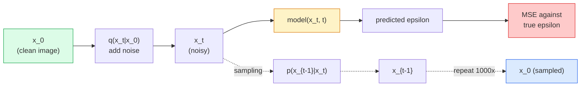

# تولید تصویر  مدل های انتشار

> یک مدل انتشار یاد می گیرد که چگونه به آن ها حمله کند. آن را آموزش دهید تا کمی از صدا را از یک تصویر سر و صدا حذف کند، این را هزار بار عقب تکرار کنید، و شما یک ژنراتور تصویر دارید.

**Type:** Build
**Languages:** Python
**Prerequisites:** Phase 4 Lesson 07 (U-Net), Phase 1 Lesson 06 (Probability), Phase 3 Lesson 06 (Optimizers)
**Time:** ~75 minutes

## اهداف یادگیری

- فرآیند صداهای جلو را بدست آورید `x_0 -> x_1 -> ... -> x_T`و توضیح بده چرا فرم بسته`q(x_t | x_0)`برای هر t
- پیاده سازی یک هدف آموزشی به سبک DDPM که شور اضافه شده را در هر مرحله کاهش می دهد و یک نمونه گیری که از صدا خالص به تصویر برمی گردد
- یک شبکه U-Net با شرایط زمانی بسازید (به اندازه کافی کوچک برای آموزش در CPU) که برای هر مرحله زمانی از صدا پیش بینی می کند
- تفاوت بین نمونه گیری DDPM و DDIM را توضیح دهید و زمانی که هر یک مناسب باشد (درسه 23 مربوط به تطابق جریان و جریان اصلاح شده در عمق است)

## مشکل

گان ها یک شات تولید می کنند: صدا وارد، تصویر خارج، یک گذر جلو. اونا سريع و سخت تر از آموزش هستن مدل های انتشار به صورت تکراری تولید می شوند: از صداهای خالص شروع می شوند، در مراحل کوچک نامگذاری می شوند، تصویر ظاهر می شود. آنها آهسته و آسان تر هستند. در پنج سال گذشته این ویژگی دوم برتری داشته است: هر تیم کوچک می تواند یک مدل انتشار را آموزش دهد و نمونه های معقول را بدست آورد؛ آموزش GAN یک مهارت است که در طول سال های شکست خورده یاد می گیرید.

فراتر از ثبات آموزش، ساختار تکراری انتشار چیزی است که همه چیز را که نسل تصویر مدرن انجام می دهد باز می کند: تنظیم متن، رنگ گذاری، ویرایش تصویر، فوق العاده وضوح، سبک قابل کنترل. هر مرحله از حلقه نمونه گیری مکانی برای تزریق محدودیت جدید است. این هوک به همین دلیل است که Stable Diffusion، Imagen، DALL-E 3، Midjourney، و هر مدل تصویر قابل کنترل که شما استفاده می کنید، همه مبتنی بر انتشار هستند.

این درس حداقل DDPM را ایجاد می کند: صدا در جلو، رد کردن به عقب، حلقه آموزشی. درس بعدی (تفرق پایدار) آن را به یک سیستم تولید با یک VAE، یک کدگر متن و راهنمایی بدون طبقه بندی می کند.

## مفهوم

### روند پیشروی

يه عکس بگير`x_0`. يه مقدار کوچيک از شور گاسي اضافه کن تا بدست بياي`x_1`يه مقدار كوچك بيشتر اضافه کن تا بدست بياي`x_2`. تا وقتي که قدم هاي T رو ادامه بدي`x_T`تقریباً از صداهای خالص گوس تشخیص داده نمیشه

```
q(x_t | x_{t-1}) = N(x_t; sqrt(1 - beta_t) * x_{t-1},  beta_t * I)
```

`beta_t`یک جدول متغیر کوچک است که معمولاً خطی از 0.0001 تا 0.02 در طول T=1000 مرحله است. هر مرحله سیگنال را کمی کاهش می دهد و صدا تازه را تزریق می کند.

### پرش بند

اضافه کردن صدا یک قدم در یک زمان یک زنجیره مارکوف است، اما ریاضیات خمیده می شود: شما می توانید نمونه `x_t`مستقیما از`x_0`در يک قدم

```
Define alpha_t = 1 - beta_t
Define alpha_bar_t = prod_{s=1..t} alpha_s

Then:
  q(x_t | x_0) = N(x_t; sqrt(alpha_bar_t) * x_0,  (1 - alpha_bar_t) * I)

Equivalently:
  x_t = sqrt(alpha_bar_t) * x_0 + sqrt(1 - alpha_bar_t) * epsilon
  where epsilon ~ N(0, I)
```

این معادله ی تک تک دلیل این است که انتشار عملی است. در طول تمرین شما یک عدد تصادفی را انتخاب می کنید`t`نمونه`x_t`مستقیما از`x_0`، و در یک مرحله قطار بدون محاكاة کل زنجیره مارکوف مورد نیاز است.

### فرآیند معکوس

روند جلو ثابت شده است.`p(x_{t-1} | x_t)`این چیزی است که شبکه عصبی می آموزد. مدل های انتشار پیش بینی نمی کنند.`x_{t-1}`به طور مستقیم، آنها صدا را پیش بینی می کنند`epsilon`در مرحله t اضافه شده و ریاضیات حاصل می شود`x_{t-1}`از اون



### از دست دادن آموزش

برای هر مرحله آموزش:

1. نمونه ای از تصویر واقعی`x_0`. .
2. نمونه ای از مرحله زمان`t`یکنواخت از [1, T]
3. صداي نمونه`epsilon ~ N(0, I)`. .
4. حساب کردن`x_t = sqrt(alpha_bar_t) * x_0 + sqrt(1 - alpha_bar_t) * epsilon`. .
5. پیش بینی`epsilon_theta(x_t, t)`با شبکه
6. حداقلش کن`|| epsilon - epsilon_theta(x_t, t) ||^2`. .

اين تمام است. شبکه عصبي مي آموزد که در هر مرحله ي زماني از صدا پيش بيني کند. از دست دادن MSE است. هيچ بازي مخالفي، هيچ سقوط، هيچ نوساني نيست.

### نمونه برداری (DDPM)

برای تولید: از شروع`x_T ~ N(0, I)`و قدم به قدم عقب قدم به قدم قدم قدم می روند.

```
for t = T, T-1, ..., 1:
    eps = model(x_t, t)
    x_{t-1} = (1 / sqrt(alpha_t)) * (x_t - (beta_t / sqrt(1 - alpha_bar_t)) * eps) + sqrt(beta_t) * z
    where z ~ N(0, I) if t > 1, else 0
return x_0
```

نکته این است که حتی اگر شرایط معکوس در شکل بسته به طور کلی شناخته نشده باشد، برای این فرآیند خاص گوسسی به جلو، این است. معادلات بد ظاهر همان چیزی است که قانون بایز به شما می دهد.

### چرا هزار قدم

برنامه های پیشروی صدا انتخاب می شود تا هر مرحله فقط صدا کافی را اضافه کند تا مرحله معکوس تقریبا گاوسیان باشد. گام های بسیار کمی و گام معکوس از گاوسیان دور است، شبکه نمی تواند آن را به خوبی مدل کند. گام های زیادی و نمونه گیری با کاهش سود گران می شود. T = 1000 با برنامه خطی پیش فرض DDPM است.

### DDIM: نمونه گیری 20 برابر سریعتر

آموزش یکسان است. نمونه گیری تغییر می کند. DDIM (Song et al., 2020) یک فرآیند معکوس تعیین کننده را تعریف می کند که بدون آموزش مجدد از مراحل زمانی عبور می کند. نمونه گیری در 50 مرحله با DDIM کیفیت DDPM تقریبا 1000 مرحله را می دهد. هر سیستم تولید از DDIM یا یک نوع حتی سریع تر (DPM-Solver ، اجداد اولر) استفاده می کند.

### تنظیم زمان

شبکه`epsilon_theta(x_t, t)`باید بداند که چه مرحله ای را مشخص می کند.`t`از طریق گنجانده شدن زمان سینوسوئیدل (هم ایده مانند کدگذاری موقعیت در ترانسفورماتورها) که به نقشه های ویژگی در هر سطح U-Net اضافه می شوند.

```
t_embedding = sinusoidal(t)
feature_map += MLP(t_embedding)
```

بدون تنظیم زمان شبکه باید از خود تصویر سطح سر و صدا را حدس بزند که کار می کند اما بسیار کم نمونه کار است.

```figure
cv-diffusion-image
```

## آن را بسازید

### مرحله ی اول: برنامه ی صدا

```python
import torch

def linear_beta_schedule(T=1000, beta_start=1e-4, beta_end=2e-2):
    return torch.linspace(beta_start, beta_end, T)


def precompute_schedule(betas):
    alphas = 1.0 - betas
    alphas_cumprod = torch.cumprod(alphas, dim=0)
    return {
        "betas": betas,
        "alphas": alphas,
        "alphas_cumprod": alphas_cumprod,
        "sqrt_alphas_cumprod": torch.sqrt(alphas_cumprod),
        "sqrt_one_minus_alphas_cumprod": torch.sqrt(1.0 - alphas_cumprod),
        "sqrt_recip_alphas": torch.sqrt(1.0 / alphas),
    }

schedule = precompute_schedule(linear_beta_schedule(T=1000))
```

یک بار پیش محاسبه کنید، در طول آموزش و نمونه گیری به ترتیب شاخص جمع آوری کنید.

### مرحله دوم: انتشار جلو (q_sample)

```python
def q_sample(x0, t, noise, schedule):
    sqrt_a = schedule["sqrt_alphas_cumprod"][t].view(-1, 1, 1, 1)
    sqrt_one_minus_a = schedule["sqrt_one_minus_alphas_cumprod"][t].view(-1, 1, 1, 1)
    return sqrt_a * x0 + sqrt_one_minus_a * noise
```

یک خط فرم بسته`t`یک دسته از مراحل زمان، یک برای هر تصویر در دسته.

### مرحله سوم: یک شبکه U-Net کوچک با شرایط زمانی

```python
import torch.nn as nn
import torch.nn.functional as F
import math

def timestep_embedding(t, dim=64):
    half = dim // 2
    freqs = torch.exp(-math.log(10000) * torch.arange(half, device=t.device) / half)
    args = t[:, None].float() * freqs[None]
    emb = torch.cat([args.sin(), args.cos()], dim=-1)
    return emb


class TinyUNet(nn.Module):
    def __init__(self, img_channels=3, base=32, t_dim=64):
        super().__init__()
        self.t_mlp = nn.Sequential(
            nn.Linear(t_dim, base * 4),
            nn.SiLU(),
            nn.Linear(base * 4, base * 4),
        )
        self.t_dim = t_dim
        self.enc1 = nn.Conv2d(img_channels, base, 3, padding=1)
        self.enc2 = nn.Conv2d(base, base * 2, 4, stride=2, padding=1)
        self.mid = nn.Conv2d(base * 2, base * 2, 3, padding=1)
        self.dec1 = nn.ConvTranspose2d(base * 2, base, 4, stride=2, padding=1)
        self.dec2 = nn.Conv2d(base * 2, img_channels, 3, padding=1)
        self.time_proj = nn.Linear(base * 4, base * 2)

    def forward(self, x, t):
        t_emb = timestep_embedding(t, self.t_dim)
        t_emb = self.t_mlp(t_emb)
        t_proj = self.time_proj(t_emb)[:, :, None, None]

        h1 = F.silu(self.enc1(x))
        h2 = F.silu(self.enc2(h1)) + t_proj
        h3 = F.silu(self.mid(h2))
        d1 = F.silu(self.dec1(h3))
        d2 = torch.cat([d1, h1], dim=1)
        return self.dec2(d2)
```

دو سطح U-Net با حالت زمان تزریق در گوشه بطری. مقیاس عمیق و عرض برای تصاویر واقعی.

### مرحله 4: حلقه آموزش

```python
def train_step(model, x0, schedule, optimizer, device, T=1000):
    model.train()
    x0 = x0.to(device)
    bs = x0.size(0)
    t = torch.randint(0, T, (bs,), device=device)
    noise = torch.randn_like(x0)
    x_t = q_sample(x0, t, noise, schedule)
    pred = model(x_t, t)
    loss = F.mse_loss(pred, noise)
    optimizer.zero_grad()
    loss.backward()
    optimizer.step()
    return loss.item()
```

اين کل دوره آموزش ـه، هيچ بازي گان، هيچ خسارت تخصصي، يک تماس با MSE

### مرحله 5: نمونه برداری (DDPM)

```python
@torch.no_grad()
def sample(model, schedule, shape, T=1000, device="cpu"):
    model.eval()
    x = torch.randn(shape, device=device)
    betas = schedule["betas"].to(device)
    sqrt_one_minus_a = schedule["sqrt_one_minus_alphas_cumprod"].to(device)
    sqrt_recip_alphas = schedule["sqrt_recip_alphas"].to(device)

    for t in reversed(range(T)):
        t_batch = torch.full((shape[0],), t, dtype=torch.long, device=device)
        eps = model(x, t_batch)
        coef = betas[t] / sqrt_one_minus_a[t]
        mean = sqrt_recip_alphas[t] * (x - coef * eps)
        if t > 0:
            x = mean + torch.sqrt(betas[t]) * torch.randn_like(x)
        else:
            x = mean
    return x
```

1000 پاس جلو برای تولید یک دسته از نمونه ها در کد واقعی شما این را با یک نمونه دهنده 50 مرحله DDIM عوض می کنید.

### مرحله 6: نمونه گیری DDIM (تثبیت، ~ 20 برابر سریعتر)

```python
@torch.no_grad()
def sample_ddim(model, schedule, shape, steps=50, T=1000, device="cpu", eta=0.0):
    model.eval()
    x = torch.randn(shape, device=device)
    alphas_cumprod = schedule["alphas_cumprod"].to(device)

    ts = torch.linspace(T - 1, 0, steps + 1).long()
    for i in range(steps):
        t = ts[i]
        t_prev = ts[i + 1]
        t_batch = torch.full((shape[0],), t, dtype=torch.long, device=device)
        eps = model(x, t_batch)
        a_t = alphas_cumprod[t]
        a_prev = alphas_cumprod[t_prev] if t_prev >= 0 else torch.tensor(1.0, device=device)
        x0_pred = (x - torch.sqrt(1 - a_t) * eps) / torch.sqrt(a_t)
        sigma = eta * torch.sqrt((1 - a_prev) / (1 - a_t) * (1 - a_t / a_prev))
        dir_xt = torch.sqrt(1 - a_prev - sigma ** 2) * eps
        noise = sigma * torch.randn_like(x) if eta > 0 else 0
        x = torch.sqrt(a_prev) * x0_pred + dir_xt + noise
    return x
```

`eta=0`کاملاً تعیین کننده است (درآمدی از همان صدا همیشه همان output را تولید می کند). `eta=1`بازیافت DDPM

## ازش استفاده کن

برای کارهای تولید، استفاده کنید`diffusers`:

```python
from diffusers import DDPMScheduler, UNet2DModel

unet = UNet2DModel(sample_size=32, in_channels=3, out_channels=3, layers_per_block=2)
scheduler = DDPMScheduler(num_train_timesteps=1000)
```

کتابخانه برنامه ریزی های آماده (DDPM، DDIM، DPM-Solver، Euler، Heun) ، U-Nets قابل تنظیم، خط لوله برای متن به تصویر و تصویر به تصویر و کمک کننده های تنظیم دقیق LoRA را ارسال می کند.

برای تحقیق`k-diffusion`(کاترين کراوسن) وفادارترين عمليات مرجعي و بهترين نمونه گیری رو داره

## -باده

این درس نتیجه می دهد:

- `outputs/prompt-diffusion-sampler-picker.md` یک پیامک که بر اساس هدف کیفیت، بودجه تاخیر و نوع شرایط DDPM / DDIM / DPM-Solver / Euler را انتخاب می کند.
- `outputs/skill-noise-schedule-designer.md` یک مهارت که یک برنامه بتا خطی، کوسین یا سیگمائید را با توجه به سطح T و هدف فساد، به علاوه نقشه های تشخیصی نسبت سیگنال به صدا در طول زمان تولید می کند.

## تمرینات

1. **(Easy)**روند پیش رو را تجسم کنید: یک تصویر و نقشه بگیرید `x_t`در`t in [0, 100, 250, 500, 750, 1000]`- اينو بررسي کن`x_1000`به نظر مياد صداي خالص گاوسي
2. **(Medium)**آموزش TinyUNet در مجموعه داده های دایره های مصنوعی برای 20 دوره و نمونه 16 دایره. مقایسه نمونه گیری DDPM (1000 مرحله) و DDIM (50 مرحله)  آیا آنها تصاویر مشابهی از همان دانه های سر و صدا تولید می کنند؟
3. **(Hard)**برنامه های شور و صدا را اجرا کنید (نیچول و دریوال، 2021):`alpha_bar_t = cos^2((t/T + s) / (1 + s) * pi / 2)`. همان مدل را با برنامه های خطی و کوسین تمرین کنید و نشان دهید که کوسین با تعداد پایین گام ها نمونه های بهتری می دهد.

## اصطلاحات کلیدی

| Term | What people say | What it actually means |
|------|----------------|----------------------|
| Forward process | "Add noise over time" | Fixed Markov chain that corrupts an image into Gaussian noise over T steps |
| Reverse process | "Denoise step by step" | Learned distribution that walks back from noise to image |
| Epsilon prediction | "Predict the noise" | The training target: `epsilon_theta(x_t, t)` predicts the noise added at step t |
| Beta schedule | "Noise amounts" | Sequence of T small variances that define how much noise enters per step |
| alpha_bar_t | "Cumulative retain factor" | Product of (1 - beta_s) up to time t; bigger t means less signal left |
| DDPM sampler | "Ancestral, stochastic" | Samples each x_{t-1} from its conditional Gaussian; 1000 steps |
| DDIM sampler | "Deterministic, fast" | Rewrites sampling as a deterministic ODE; 20-100 steps with similar quality |
| Time conditioning | "Tell the model which t" | Sinusoidal embedding of t injected into the U-Net so it knows the noise level |

## خواندن بیشتر

- [Denoising Diffusion Probabilistic Models (Ho et al., 2020)](https://arxiv.org/abs/2006.11239) مقاله ای که انتشار را عملی و شکست دهنده ی GAN ها در FID ساخت
- [Improved DDPM (Nichol & Dhariwal, 2021)](https://arxiv.org/abs/2102.09672) جدول cosine و v-parameterisation
- [DDIM (Song, Meng, Ermon, 2020)](https://arxiv.org/abs/2010.02502) نمونه گیری تعیین کننده ای که نتیجه گیری در زمان واقعی را ممکن می سازد
- [Elucidating the Design Space of Diffusion (Karras et al., 2022)](https://arxiv.org/abs/2206.00364) یک دیدگاه یکپارچه از هر انتخاب طراحی انتشار؛ بهترین مرجع فعلی
