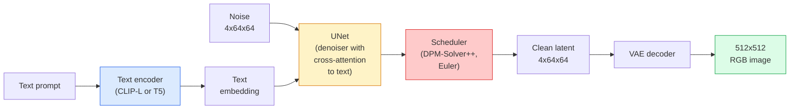

# انتشار ثابت  معماری و تنظیم دقیق

> Diffusion Stable یک DDPM است که در فضای پنهان یک VAE پیش از آموزش اجرا می شود، از طریق توجه متقابل بر متن مشروط است، با یک حل کننده ODE تعیین کننده سریع نمونه گیری می شود و با راهنمایی بدون طبقه بندی هدایت می شود.

**Type:** Learn + Use
**Languages:** Python
**Prerequisites:** Phase 4 Lesson 10 (Diffusion), Phase 7 Lesson 02 (Self-Attention)
**Time:** ~75 minutes

## اهداف یادگیری

- پنج قطعه خط لوله انتشار پایدار را ردیابی کنید: VAE، کدرس متن، U-Net، برنامه نویس، چک کننده ایمنی  و هر یک از آنها واقعا چه می کند
- انتشار غش شده و اینکه چرا آموزش در یک فضای غش شده 4x64x64 (به جای یک تصویر 3x512x512) محاسبه را بدون از دست دادن کیفیت 48x کاهش می دهد، توضیح دهید.
- استفاده کنید`diffusers`برای تولید تصاویر، اجرا تصویر به تصویر، رنگ گذاری و تولید کنترل شبکه
- تنظیم دقیق انتشار ثابت با LoRA در یک مجموعه داده کوچک سفارشی و بارگذاری آداپتور LoRA در نتیجه

## مشکل

آموزش یک DDPM مستقیماً بر روی تصاویر 512x512 RGB گران است. هر مرحله آموزش از طریق یک شبکه U-Props است که 3x512x512 = 786,432 ارزش ورودی را می بیند و نمونه گیری 50+ پیشروی را از طریق همان شبکه U-Props می گیرد. در سطح کیفیت Stable Diffusion 1.5 (بازار 2022) ، انتشار فضای پیکسل ها به حدود 256 ماه GPU و 10-30 ثانیه برای هر تصویر در یک GPU مصرف کننده نیاز دارد.

اون ترفند که باعث شد متن به تصویر با وزن باز عملی بشه**latent diffusion**(Rombach و همکاران، CVPR 2022). یک VAE را آموزش دهید که یک تصویر 3x512x512 را به یک تنسور پنهان 4x64x64 و پس از آن در این فضای پنهان پخش کنید. محاسبه کاهش می یابد.`(3*512*512)/(4*64*64) = 48x`نمونه گیری از ده ها ثانیه به کمتر از دو ثانیه روی همان GPU کاهش می یابد.

تقریباً هر مدل مدرن تولید تصویر  SDXL، SD3، FLUX، HunyuanDiT، Wan-Video  یک مدل انتشار پنهان با تغییرات در خودکار کدگذاری، نامبرد (U-Net یا DiT) و تنظیم متن است.

## مفهوم

### خط لوله



- **VAE** کدگر خودکار منجمد. کدگر تصویر را به صورت لغت (برای img2img و آموزش استفاده می شود) تبدیل می کند. کدگر لغت را به صورت تصویر تبدیل می کند.
- **Text encoder** کدگر متن CLIP (SD 1.x/2.x) ، CLIP-L + CLIP-G (SDXL) یا T5-XXL (SD3/FLUX). یک سری از توکن های گنجانده شده را تولید می کند.
- **U-Net** نشان دهنده. دارای لایه های توجه متقابل است که از لغز به متن در هر سطح رزولوشن اضافه می شود.
- **Scheduler** الگوریتم نمونه گیری (DDIM، Euler، DPM-Solver++). سیگما را انتخاب می کند، صداهای پیش بینی شده را به سمت پنهان می کند.
- **Safety checker** فیلتر NSFW / محتوای غیرقانونی در تصویر خروجی.

### راهنمایی بدون طبقه بندی کننده (CFG)

آموزش های ساده متن`epsilon_theta(x_t, t, c)`برای هر درخواست`c`. CFG شبكه ي مشابه را با`c`در زمان 10 درصد کاهش یافته است (به جای یک گنجاندن خالی) ، به یک مدل واحد که هر دو ضوضای مشروط و بی قید و شرط را پیش بینی می کند.

```
eps = eps_uncond + w * (eps_cond - eps_uncond)
```

`w`این مقیاس راهنمای است.`w=0`بدون شرطی است`w=1`کاملا مشروط است`w>1`در این حالت، تولیدات به سمت "مستقلتر در پرامپت" به هزینه تنوع حرکت می کنند.`w=7.5`. .

CFG دلیل این است که متن به تصویر در کیفیت تولید کار می کند. بدون آن، به سمت خروجی ضعیف است؛ با آن، به دنباله دار ها تسلط دارند.

### هندسه فضای لغز

4-چانل خامه ای VAE فقط یک تصویر فشرده نیست. این یک متنوعی است که در آن ریاضیات تقریبا به ویرایش های معنوی (هندس های سریع + مداخله هر دو در اینجا زندگی می کنند) مطابقت دارد و در آن U-Net انتشار آموزش دیده است تا کل بودجه مدل سازی خود را صرف کند. رمزگذاری یک 4x64x64 غشایی تصادفی یک تصویر تصادفی تولید نمی کند  آن زباله تولید می کند، زیرا فقط یک فرعی خاص از غشایی به تصاویر معتبر رمزگذاری می شود.

دو تا عواقب:

1. **Img2img**= رمزگذاری تصویر به لغز، اضافه کردن صدای جزئی، اجرا کردن نشان دهنده، رمزگذاری. ساختار تصویر زنده می ماند زیرا رمزگذاری تقریبا قابل برگشت است؛ محتوای بر اساس پرامپت تغییر می کند.
2. **Inpainting**= مشابه img2img اما نامگذاری کننده فقط مناطق پوشیده را به روز می کند؛ مناطق پوشیده نشده در رمزگذاری پنهان نگهداری می شوند.

### معماری U-Net

SD U-Net یک نسخه بزرگ از TinyUNet از درس 10 با سه اضافه شده است:

- **Transformer blocks**در هر قطعنامه فضایی، شامل توجه به خود + توجه به متن گنجانده شده است.
- **Time embedding**از طریق MLP در کد بندی سینوسایدی.
- **Skip connections**بین کدگر و کدگر در رزولوشن های مشابه.

پارامترهای کل در SD 1.5: ~ 860M. SDXL: ~ 2.6B. FLUX: ~ 12B. پرتاب در پارامتر ها عمدتا در لایه های توجه است.

### تنظیم دقیق LoRA

تنظیم کامل Stable Diffusion به 20+ GB VRAM نیاز دارد و 860M پارامتر را به روز می کند. LoRA (Low-Rank Adaptation) مدل پایه را منجمد می کند و ماتریس های کوچک تجزیه رتبه را به لایه های توجه تزریق می کند. یک آداپتور LoRA برای SD معمولاً 10-50 MB است ، در ۱۰ تا ۶۰ دقیقه بر روی یک GPU مصرف کننده واحد حرکت می کند و در زمان نتیجه گیری به عنوان یک تغییر کاهش می کند.

```
Original: W_q : (d_in, d_out)   frozen
LoRA:     W_q + alpha * (A @ B)   where A : (d_in, r), B : (r, d_out)

r is typically 4-32.
```

لورا به این ترتیب تقریباً هر آهنگ کمیونتی را توزیع می کند. CivitAI و Hugging Face میلیون ها نفر از آنها را میزبانی می کنند.

### برنامه ریزی هایی که می بینید

- **DDIM** تعیین کننده، ~50 مرحله، ساده
- **Euler ancestral** استوکاستیک، ۳۰ تا ۵۰ مرحله، نمونه های کمی خلاق تر
- **DPM-Solver++ 2M Karras** تعیین کننده، 20-30 مرحله، تولید پیش فرض
- **LCM / TCD / Turbo** مدل های سازگار و انواع تزریق شده؛ 1-4 مرحله با هزینه برخی از کیفیت.

تغییر برنامه ریزی ها یک تغییر یک خطی در `diffusers`و گاهی اوقات بدون آموزش مجدد مشکلات نمونه را حل می کند.

```figure
cv3-latent-compression
```

## آن را بسازید

این درس از`diffusers`قطعات شما نیاز به بازسازی (VAE، کدرس متن، U-Net، برنامه نویس) موضوعات درس های خود را دارند؛ در اینجا هدف روانی با API تولید است.

### مرحله اول: متن به تصویر

```python
import torch
from diffusers import StableDiffusionPipeline

pipe = StableDiffusionPipeline.from_pretrained(
    "runwayml/stable-diffusion-v1-5",
    torch_dtype=torch.float16,
).to("cuda")

image = pipe(
    prompt="a dog riding a skateboard in tokyo, studio ghibli style",
    guidance_scale=7.5,
    num_inference_steps=25,
    generator=torch.Generator("cuda").manual_seed(42),
).images[0]
image.save("dog.png")
```

`float16`به نصف VRAM بدون کاهش کیفیت قابل مشاهده. `num_inference_steps=25`با مطابقت پیش فرض DPM-Solver++ `num_inference_steps=50`با DDIM

### مرحله 2: تغییر برنامه ریزی

```python
from diffusers import DPMSolverMultistepScheduler, EulerAncestralDiscreteScheduler

pipe.scheduler = DPMSolverMultistepScheduler.from_config(pipe.scheduler.config)
pipe.scheduler = EulerAncestralDiscreteScheduler.from_config(pipe.scheduler.config)
```

حالت برنامه ریزی کننده از وزنهای U-Net جدا شده است. می توانید در DDPM تمرین کنید و با هر برنامه نویس نمونه بگیرید.

### مرحله سوم: تصویر به تصویر

```python
from diffusers import StableDiffusionImg2ImgPipeline
from PIL import Image

img2img = StableDiffusionImg2ImgPipeline.from_pretrained(
    "runwayml/stable-diffusion-v1-5",
    torch_dtype=torch.float16,
).to("cuda")

init_image = Image.open("dog.png").convert("RGB").resize((512, 512))
out = img2img(
    prompt="a dog riding a skateboard, oil painting",
    image=init_image,
    strength=0.6,
    guidance_scale=7.5,
).images[0]
```

`strength`مقدار شور قبل از حذف (0.0 = بدون تغییر، 1.0 = بازسازی کامل) 0.5-0.7 محدوده استاندارد برای انتقال سبک است.

### مرحله چهارم: رنگ گذاری

```python
from diffusers import StableDiffusionInpaintPipeline

inpaint = StableDiffusionInpaintPipeline.from_pretrained(
    "runwayml/stable-diffusion-inpainting",
    torch_dtype=torch.float16,
).to("cuda")

image = Image.open("dog.png").convert("RGB").resize((512, 512))
mask = Image.open("dog_mask.png").convert("L").resize((512, 512))

out = inpaint(
    prompt="a cat",
    image=image,
    mask_image=mask,
    guidance_scale=7.5,
).images[0]
```

پیکسل های سفید در ماسک منطقه ای هستند که باید بازسازی شوند. پیکسل های سیاه نگه داشته می شوند.

### مرحله 5: بارگذاری LoRA

```python
pipe.load_lora_weights(
    "artificialguybr/studioghibli-redmond-1-5v-studio-ghibli-lora-for-liberteredmond-sd-1-5",
    weight_name="StudioGhibliRedmond-15V-LiberteRedmond-StdGBRedmAF-StudioGhibli.safetensors",
)
pipe.fuse_lora(lora_scale=0.8)

image = pipe(prompt="a village square, StdGBRedmAF, Studio Ghibli").images[0]
```

عبارت پرتاب از کارت مدل (`StdGBRedmAF, Studio Ghibli`) سبک رو روشن ميکنه`lora_scale`کنترل قدرت: 0.0 = هیچ اثر و 1.0 = اثر کامل. `fuse_lora`آداپتور رو به وزن هاي جايگاهش براي سرعت ميخوره ولي مانع از تعديل ميشه`pipe.unfuse_lora()`قبل از بارگذاری یک آداپتور مختلف.

### مرحله 6: آموزش LoRA (نمونه)

آموزش واقعی LoRA زندگی می کنه`peft`یا`diffusers.training`. طرح:

```python
# Pseudocode
for step, batch in enumerate(dataloader):
    images, prompts = batch
    latents = vae.encode(images).latent_dist.sample() * 0.18215

    t = torch.randint(0, num_train_timesteps, (batch_size,))
    noise = torch.randn_like(latents)
    noisy_latents = scheduler.add_noise(latents, noise, t)

    text_emb = text_encoder(tokenizer(prompts))

    pred_noise = unet(noisy_latents, t, text_emb)  # LoRA weights injected here

    loss = F.mse_loss(pred_noise, noise)
    loss.backward()
    optimizer.step()
```

تنها ماتریس های LoRA gradient دریافت می کنند؛ U-Net پایه، VAE و کدرس متن منجمد شده است. با اندازه دسته 1 و کنترل gradient این به 8 GB VRAM می رسد.

## ازش استفاده کن

در تولید، تصمیمات شما در واقع:

- **Model family**: SD 1.5 برای موسیقی های کمیونتی منبع باز، SDXL برای وفاداری بالاتر، SD3 / FLUX برای حالت فن و الزامات مجوز سخت.
- **Scheduler**: DPM-Solver++ 2M Karras برای 20-30 مرحله، LCM-LoRA زمانی که تاخیر کمتر از 1s است.
- **Precision**.`float16`در شماره 4080/4090`bfloat16`در A100 و جدیدتر`int8`(به وسیله`bitsandbytes`یا`compel`) وقتی VRAM تنگ است.
- **Conditioning**: کار بر روی متن ساده؛ برای کنترل قوی تر، ControlNet (مقدور، عمق، حالت) را در بالای لوله پایه اضافه کنید.

برای نسل دسته بندی`AUTO1111`-`ComfyUI`ابزار جامعه هستند؛ برای APIs تولید،`diffusers`+ `accelerate`یا`optimum-nvidia`با تانسورRT

## -باده

این درس نتیجه می دهد:

- `outputs/prompt-sd-pipeline-planner.md` یک پرامپت که SD 1.5 / SDXL / SD3 / FLUX به علاوه برنامه ریزی کننده و دقت را با توجه به بودجه تاخیر، هدف وفاداری و محدودیت مجوز انتخاب می کند.
- `outputs/skill-lora-training-setup.md` یک مهارت که یک پیکربندی کامل آموزش LoRA را برای یک مجموعه داده سفارشی شامل عنوان، رتبه، اندازه دسته و نرخ یادگیری می نویسد.

## تمرینات

1. **(Easy)**با `guidance_scale`در`[1, 3, 5, 7.5, 10, 15]`. شرح دهید که چگونه تصویر تغییر می کند.
2. **(Medium)**هر عکس واقعي رو بردار، ازش بگير`StableDiffusionImg2ImgPipeline`در`strength`در`[0.2, 0.4, 0.6, 0.8, 1.0]`. کدام قدرت ترکیب را در حالی که سبک تغییر می کند حفظ می کند؟ چرا 1.0 واردات را کاملا نادیده می گیرد؟
3. **(Hard)**آموزش LoRA در 10-20 تصویر یک موضوع (حیوان خانگی، لوگو، یک شخصیت) و ایجاد صحنه های جدید با آن موضوع در آنها. گزارش رتبه LoRA و مراحل آموزش که بهترین حفظ هویت را بدون بیش از حد مناسب به تصاویر ورودی تولید کرد.

## اصطلاحات کلیدی

| Term | What people say | What it actually means |
|------|----------------|----------------------|
| Latent diffusion | "Diffuse in latents" | Run the entire DDPM in the VAE latent space (4x64x64) instead of pixel space (3x512x512); 48x compute saving |
| VAE scale factor | "0.18215" | Constant that rescales the VAE's raw latent to roughly unit variance; hardcoded in every SD pipeline |
| Classifier-free guidance | "CFG" | Mix conditional and unconditional noise predictions; the single most impactful inference knob |
| Scheduler | "Sampler" | The algorithm that turns noise + model predictions into a denoised latent trajectory |
| LoRA | "Low-rank adapter" | Small rank-decomposition matrices that fine-tune attention layers without touching base weights |
| Cross-attention | "Text-image attention" | Attention from latent tokens to text tokens; injects prompt information at every U-Net level |
| ControlNet | "Structure conditioning" | A separately-trained adapter that steers SD with an extra input (canny, depth, pose, segmentation) |
| DPM-Solver++ | "The default scheduler" | Second-order deterministic ODE solver; best quality at low step counts (20-30) in 2026 |

## خواندن بیشتر

- [High-Resolution Image Synthesis with Latent Diffusion (Rombach et al., 2022)](https://arxiv.org/abs/2112.10752) کاغذ انتشار پایدار؛ شامل هر تخلیه ای است که طراحی را توجیه می کند
- [Classifier-Free Diffusion Guidance (Ho & Salimans, 2022)](https://arxiv.org/abs/2207.12598) ورق CFG
- [LoRA: Low-Rank Adaptation of Large Language Models (Hu et al., 2021)](https://arxiv.org/abs/2106.09685) LoRA اول از NLP بود؛ تقریبا بدون تغییر به SD منتقل شد
- [diffusers documentation](https://huggingface.co/docs/diffusers) مرجع برای هر خط لوله SD / SDXL / SD3 / FLUX
