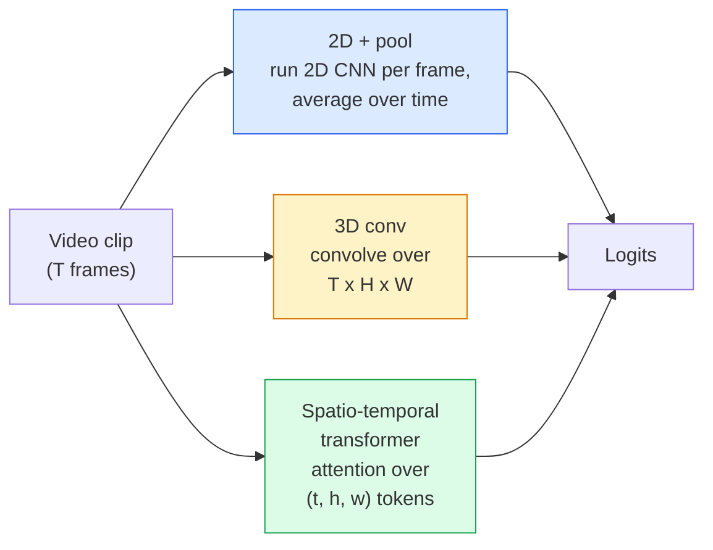

# ویدیو درک  مدل سازی موقتی

> یک ویدیو یک سری تصاویر به علاوه فیزیک است که آنها را به هم متصل می کند. هر مدل ویدیو یا به عنوان یک محور اضافی (3D conv) ، یک سری برای حضور (ترانسفارمر) یا یک ویژگی برای استخراج یک بار و جمع (2D + جمع) رفتار می کند.

**Type:** Learn + Build
**Languages:** Python
**Prerequisites:** Phase 4 Lesson 03 (CNNs), Phase 4 Lesson 04 (Image Classification)
**Time:** ~45 minutes

## اهداف یادگیری

- تفاوت بین سه روش اصلی مدل سازی ویدئو (2D+pool، 3D conv، space-temporal transformer) و پیش بینی هزینه و دقت آنها
- استفاده از نمونه گیری قاب، جمع آوری زمانی و طبقه بندی پایه 2D+pool در PyTorch
- توضیح دهید که چرا هسته های 3D "فخم" I3D از وزن های ImageNet به خوبی انتقال می دهند و یک conv (2+1) D به طور متفاوتی چه کار می کند
- مجموعه داده ها و معیارهای شناسایی عمل را بخوانید: Kinetics-400/600، UCF101, Something-Something V2; دقت بالای 1 در سطح کلیپ و ویدیو

## مشکل

یک ویدیو ۳۰ ثانیه با سرعت ۳۰ فاب/س، ۹۰۰ تصویر است. به طور نابغه، طبقه بندی ویدیو طبقه بندی تصویری است که ۹۰۰ بار اجرا می شود و سپس نوعی جمع بندی انجام می شود. این کار زمانی که عمل در تقریباً هر فریم (سport، آشپزی، ویدیو ورزش) قابل مشاهده است، و وقتی عمل توسط حرکت خود تعریف می شود، به شدت شکست می خورد: "کشی از چپ به راست فشار می دهد" به نظر می رسد مانند دو شی ثابت در هر فریم.

سوال اصلی برای هر معماری ویدیویی این است که: ساختار زمانی چه زمانی مدل سازی می شود و چگونه؟ پاسخ به همه چیز دیگر را هدایت می کند  هزینه های محاسبه، استراتژی پیش از تمرین، آیا می توانید وزنهای ImageNet را دوباره استفاده کنید، که کدام مجموعه داده ها مدل را آموزش می دهد.

این درس عمداً کوتاه تر از درس های تصویر جامد است. ماشین آلات اصلی تصویر در حال حاضر در محل است و درک ویدیو عمدتاً درباره داستان زمانی است: نمونه گیری، مدل سازی و جمع آوری.

## مفهوم

### سه خانواده معمار



### 2D + حوضچه

یک سی ان ان 2D (ResNet، EfficientNet، ViT) را بگیرید. آن را به طور مستقل در هر قاب نمونه ای اجرا کنید. متوسط (یا حداکثر مجموعه، یا توجه) هر قاب ورودی. ویکتور جمع شده را به یک طبقه بندی کننده ارسال کنید.

مزاياي:
- اميج نت پيش از آموزش به طور مستقیم انتقال ميده
- ساده ترين راه اجرا
- ارزان: فریم های T * هزینه نتیجه گیری یک تصویر.

معایب:
- نميتونم حرکات رو مدل کنم عمل = جمعيت ظاهر
- جمع بندی زمانی با ترتیب متفاوت است؛ "دروازه باز" و "دروازه بسته" به نظر یکسان می رسند.

چه زمانی باید استفاده شود: وظایف سنگین ظاهر، انتقال یادگیری در مجموعه داده های ویدیویی کوچک، خط های اولیه.

### پیچ و پیچ های 3D

هسته های 2D (H, W) را با هسته های 3D (T, H, W) جایگزین کنید. شبکه در فضا و زمان هم پیچیده می شود. خانواده اولیه: C3D، I3D، SlowFast.

ترفند I3D: یک مدل پیش از آموزش 2D ImageNet را بگیرید، هر هسته 2D را با کپی کردن آن در امتداد محور زمانی جدید "تولید" کنید. یک 3x3 2D conv تبدیل به 3x3x3 3D conv می شود. این به مدل 3D وزن های قوی پیش از آموزش به جای آموزش از ابتدا می دهد.

مزاياي:
- به طور مستقیم مدل حرکت
- تورم 3D آموزش انتقال رایگان را فراهم می کند.

معایب:
- T/8 FLOPs بیشتر از همتای 2D (برای هسته زمانی 3 بار 3 بار)
- هسته های موقتی کوچک هستند؛ حرکت در فاصله طولانی نیاز به یک رویکرد هرم یا دو جریان دارد.

زمانی که استفاده شود: تشخیص عمل در حالی که حرکت سیگنال است (چیزی-چیزی V2 ، کینتک با کلاس های حرکت سنگین).

### ترانسفورماتورهای فضایی-زمان

این ویدیو را به یک شبکه از پیچ های فضا-زمان نشان دهید و در همه آنها حضور داشته باشید. TimeSformer، ViViT، Video Swin، VideoMAE.

الگوهای توجه که اهمیت دارند:
- **Joint** یک توجه بزرگ روی (t، h، w)`T*H*W`؛ گران قیمت
- **Divided** دو توجه در هر بلوک: یک در زمان، یک در فضا. مقیاس خطی.
- **Factorised**توجه زمان با توجه فضا در بلوک ها متناوب است.

مزاياي:
- دقت SOTA در هر معیار اصلی.
- انتقال از ترانسفارمرهای تصویر (ViT) از طریق تورم پیچ.
- پشتیبانی از ویدیو های طولانی و با توجه به توجه کمی

معایب:
- گرسنه به حساب
- به انتخاب الگوی توجه دقیق یا بالون های زمان اجرا نیاز دارد.

چه زمانی باید استفاده شود: مجموعه داده های بزرگ، درک ویدیویی با وفاداری بالا، کارهای ویدیویی + متن چند مودالی.

### نمونه گیری قاب

یک کلیپ ۱۰ ثانیه با ۳۰ فاب/س، ۳۰۰ فریم است؛ تغذیه ۳۰۰ تا هر مدل، ضایع کننده است. استراتژی های استاندارد:

- **Uniform sampling** قاب های T را مساوی در کلپ انتخاب کنید.
- **Dense sampling**پنجره های تصادفی متصل به قاب T. برای کنو 3D رایج است زیرا حرکت نیاز به قاب های همسایه دارد.
- **Multi-clip** نمونه چندین پنجره از یک ویدیو، طبقه بندی هر یک، پیش بینی های متوسط در زمان آزمون.

T معمولا 8، 16، 32 یا 64 است. T بالاتر = سیگنال زمانی بیشتر در محاسبه بیشتر.

### ارزیابی

دو سطح:
- **Clip-level accuracy**مدل یک کلیپ T-frame می بیند، گزارش top-k.
- **Video-level accuracy** پیش بینی های متوسط سطح کلیپ در چندین کلیپ در هر ویدیو؛ بالاتر و پایدارتر.

همیشه هر دو را گزارش کنید. یک مدل که 78٪ کلیپ / 82٪ ویدیو را به میزان زیادی بر روی متوسط زمان آزمون متکی است؛ یک مدل که 80٪ / 81٪ را به هر کلیپ می رساند، قوی تر است.

### مجموعه داده هایی که با آنها ملاقات خواهید کرد

- **Kinetics-400 / 600 / 700** مجموعه داده های عمل عمومی. 400 هزار کلیپ؛ URL های یوتیوب (بسیاری از آنها اکنون مرده اند).
- **Something-Something V2** اقدامات تعریف شده توسط حرکت ("حرکت X از چپ به راست") نمی تواند با 2D +pool حل شود.
- **UCF-101**،**HMDB-51** بزرگتر، کوچکتر، هنوز گزارش شده است.
- **AVA** عمل *لوکالیزاسیون* در فضا و زمان؛ سخت تر از طبقه بندی.

```figure
v4-video-temporal
```

## آن را بسازید

### مرحله اول: نمونه گیری قاب

نمونه های یکنواخت و کثافت که روی یک لیست از فریم ها (یا یک تنسور ویدئویی) کار می کنند.

```python
import numpy as np

def sample_uniform(num_frames_total, T):
    if num_frames_total <= T:
        return list(range(num_frames_total)) + [num_frames_total - 1] * (T - num_frames_total)
    step = num_frames_total / T
    return [int(i * step) for i in range(T)]


def sample_dense(num_frames_total, T, rng=None):
    rng = rng or np.random.default_rng()
    if num_frames_total <= T:
        return list(range(num_frames_total)) + [num_frames_total - 1] * (T - num_frames_total)
    start = int(rng.integers(0, num_frames_total - T + 1))
    return list(range(start, start + T))
```

هر دو برگردن`T`شاخص هایی که برای برش کردن تنسور ویدیو استفاده می کنید.

### مرحله دوم: یک خط پایه 2D+pool

يه 2D ResNet-18 رو روي هر قاب اجرا کنين، ميزاني هاي متوسط، طبقه بندي

```python
import torch
import torch.nn as nn
from torchvision.models import resnet18, ResNet18_Weights

class FramePool(nn.Module):
    def __init__(self, num_classes=400, pretrained=True):
        super().__init__()
        weights = ResNet18_Weights.IMAGENET1K_V1 if pretrained else None
        backbone = resnet18(weights=weights)
        self.features = nn.Sequential(*(list(backbone.children())[:-1]))  # global avg pool kept
        self.head = nn.Linear(512, num_classes)

    def forward(self, x):
        # x: (N, T, 3, H, W)
        N, T = x.shape[:2]
        x = x.view(N * T, *x.shape[2:])
        feats = self.features(x).view(N, T, -1)
        pooled = feats.mean(dim=1)
        return self.head(pooled)

model = FramePool(num_classes=10)
x = torch.randn(2, 8, 3, 224, 224)
print(f"output: {model(x).shape}")
print(f"params: {sum(p.numel() for p in model.parameters()):,}")
```

11 میلیون پارامتر، ImageNet پیش از آموزش، هر فریم، متوسط، طبقه بندی می کند. این خط پایه اغلب در حدود 5-10 نقطه از مدل های 3D مناسب در کارهای سنگین ظاهر است.

### مرحله سوم: یک کنتور 3D انفجاری به سبک I3D

یک کنو 2D را به یک کنو 3D تبدیل کنید با تکرار وزنه ها در امتداد محور زمانی جدید.

```python
def inflate_2d_to_3d(conv2d, time_kernel=3):
    out_c, in_c, kh, kw = conv2d.weight.shape
    weight_3d = conv2d.weight.data.unsqueeze(2)  # (out, in, 1, kh, kw)
    weight_3d = weight_3d.repeat(1, 1, time_kernel, 1, 1) / time_kernel
    conv3d = nn.Conv3d(in_c, out_c, kernel_size=(time_kernel, kh, kw),
                        padding=(time_kernel // 2, conv2d.padding[0], conv2d.padding[1]),
                        stride=(1, conv2d.stride[0], conv2d.stride[1]),
                        bias=False)
    conv3d.weight.data = weight_3d
    return conv3d

conv2d = nn.Conv2d(3, 64, kernel_size=3, padding=1, bias=False)
conv3d = inflate_2d_to_3d(conv2d, time_kernel=3)
print(f"2D weight shape:  {tuple(conv2d.weight.shape)}")
print(f"3D weight shape:  {tuple(conv3d.weight.shape)}")
x = torch.randn(1, 3, 8, 56, 56)
print(f"3D output shape:  {tuple(conv3d(x).shape)}")
```

تقسیم توسط`time_kernel`اندازه های فعال سازی را تقریباً ثابت نگه می دارد  مهم برای شکستن آمار استاندارد دسته در اولین عبور.

### مرحله 4: فاکتور (2+1) D

یک کنو 3D را به یک کنو 2D (جایانی) و یک کنو 1D (زمان) تقسیم کنید. همان میدان گیرنده، پارامترهای کمتر، دقت بهتر در برخی معیارها.

```python
class Conv2Plus1D(nn.Module):
    def __init__(self, in_c, out_c, kernel_size=3):
        super().__init__()
        mid_c = (in_c * out_c * kernel_size * kernel_size * kernel_size) \
                // (in_c * kernel_size * kernel_size + out_c * kernel_size)
        self.spatial = nn.Conv3d(in_c, mid_c, kernel_size=(1, kernel_size, kernel_size),
                                 padding=(0, kernel_size // 2, kernel_size // 2), bias=False)
        self.bn = nn.BatchNorm3d(mid_c)
        self.act = nn.ReLU(inplace=True)
        self.temporal = nn.Conv3d(mid_c, out_c, kernel_size=(kernel_size, 1, 1),
                                  padding=(kernel_size // 2, 0, 0), bias=False)

    def forward(self, x):
        return self.temporal(self.act(self.bn(self.spatial(x))))

c = Conv2Plus1D(3, 64)
x = torch.randn(1, 3, 8, 56, 56)
print(f"(2+1)D output: {tuple(c(x).shape)}")
```

یک شبکه کامل R(2+1)D مانند یک ResNet-18 است و هر 3x3 conv توسط `Conv2Plus1D`. .

## ازش استفاده کن

دو کتابخانه شامل فیلم های تولید شده است:

- `torchvision.models.video` R(2+1)D، MViT، Swin3D با وزنهای قبل از آموزش Kinetics. همان API مانند مدل های تصویر.
- `pytorchvideo`(میتا)  مدل باغ وحش، بارگذاری داده برای Kinetics / SSv2 / AVA، تبدیل های استاندارد.

برای مدل های ویدیویی به زبان دید (تحت عنوان ویدیو، کیفیت ویدیو) استفاده کنید `transformers`(`VideoMAE`،`VideoLLaMA`،`InternVideo`)

## -باده

این درس نتیجه می دهد:

- `outputs/prompt-video-architecture-picker.md` یک پرامپت که بر اساس ظاهر به حرکت، اندازه مجموعه داده ها و بودجه محاسبه، ترانسفارمر 2D+pool / I3D / (2+1)D / را انتخاب می کند.
- `outputs/skill-frame-sampler-auditor.md` مهارت هایی که نمونه گیرنده یک لوله ویدئو را بررسی می کند و اشکال رایج را نشان می دهد: شاخص غیر یک، نمونه گیری نامساوی زمانی که `num_frames < T`، عدم حفظ شکل محصول و غیره

## تمرینات

1. **(Easy)**FLOPs (تقریباً) را برای FramePool با T=8 در مقابل ResNet 3D سبک I3D با T=8 محاسبه کنید. توجیه کنید که چرا 2D + pool 3-5 برابر ارزان تر است.
2. **(Medium)**یک مجموعه داده های ویدیویی مصنوعی تولید کنید: توپ های تصادفی در جهت های تصادفی حرکت می کنند، با جهت حرکت برچسب گذاری شده اند ("از چپ به راست"، "از راست به چپ"، "دیآگونال بالا"). FramePool را روی آن تمرین کنید. نشان دهید که آن به دقت تقریبا تصادفی دست می یابد، ثابت کردن ظاهر به تنهایی برای وظایف حرکت کافی نیست.
3. **(Hard)**ساخت یک R(2+1) D-18 با جایگزینی هر Conv2d در یک ResNet-18 با `Conv2Plus1D`. وزن اولين کنو از يک ResNet 18 که توسط ImageNet آموزش داده شده است را پرتاب کنید.

## اصطلاحات کلیدی

| Term | What people say | What it actually means |
|------|----------------|----------------------|
| 2D + pool | "Per-frame classifier" | Run a 2D CNN on every sampled frame, average-pool features across time, classify |
| 3D convolution | "Spatio-temporal kernel" | Kernel that convolves over (T, H, W); can model motion natively |
| Inflation | "Lift 2D weights to 3D" | Initialise 3D conv weights by repeating a 2D conv's weights along the new time axis, then divide by kernel_T to preserve activation scale |
| (2+1)D | "Factorised conv" | Split 3D into 2D spatial + 1D temporal; fewer parameters, extra non-linearity between |
| Divided attention | "Time then space" | Transformer block with two attentions per layer: one over tokens at the same frame, one over tokens at the same position |
| Clip | "T-frame window" | A sampled subsequence of T frames; the unit a video model consumes |
| Clip vs video accuracy | "Two eval settings" | Clip = one sample per video, video = average across multiple sampled clips |
| Kinetics | "The ImageNet of video" | 400-700 action classes, 300k+ YouTube clips, the standard video pretraining corpus |

## خواندن بیشتر

- [I3D: Quo Vadis, Action Recognition (Carreira & Zisserman, 2017)](https://arxiv.org/abs/1705.07750) تورم و مجموعه داده های کینتکس را معرفی می کند
- [R(2+1)D: A Closer Look at Spatiotemporal Convolutions (Tran et al., 2018)](https://arxiv.org/abs/1711.11248) کنفاکتور شده، هنوز هم یک خط پایه قوی است
- [TimeSformer: Is Space-Time Attention All You Need? (Bertasius et al., 2021)](https://arxiv.org/abs/2102.05095) اولین ترانسفورماتور ویدیویی قوی
- [VideoMAE (Tong et al., 2022)](https://arxiv.org/abs/2203.12602) پیشگیری از آموزش خودکار پوشیده برای ویدیو؛ دستور فعلی پیشگیری
