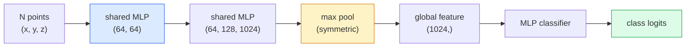

# 3D Vision  ابرهای نقطه ای و NeRFs

> در این زمینه، در حال حاضر، در حال بررسی این موضوع است که چگونه می توان به این موضوع پاسخ داد:

**Type:** Learn + Build
**Languages:** Python
**Prerequisites:** Phase 4 Lesson 03 (CNNs), Phase 1 Lesson 12 (Tensor Operations)
**Time:** ~45 minutes

## اهداف یادگیری

- تشخیص نمایش های 3D صریح (کود نقطه ای، میش، ووکسل) و ضمنی (ملک فاصله امضا شده، NeRF) و زمانی که هر یک از آنها استفاده می شود
- درک ترفند عملکرد متقابل پوائنت نت که باعث می شود یک شبکه عصبی تغییر نامتغیر در یک مجموعه نامرتبط از نقاط
- ردیابی یک گذرگاه پیشروی NeRF: ریزنگ شعاع، رندر حجم، کدگذاری موقعیت، تراکم MLP+ سر رنگ
- استفاده کنید`nerfstudio`یا`instant-ngp`برای بازسازی 3D پیش از آموزش از مجموعه ای کوچک از تصاویر پوزیشن شده

## مشکل

یک دوربین یک تصویر 2D تولید می کند. یک LIDAR مجموعه ای از نقاط 3D را بدون ترتیب تولید می کند. یک لوله ساختاری از حرکت یک ابر نادر از نقاط کلیدی 3D را تولید می کند. یک NeRF یک صحنه 3D کامل را از چند تصویر پوژ ساخته است. همه اینها "دید" هستند اما هیچ کدام از آنها به عنوان تنسور کثیف که CNN می خواهد شبیه نیستند.

بینایی سه بعدی مهم است زیرا تقریباً هر کار رباتیک با ارزش بالا در 3D اجرا می شود: گرفتاری، اجتناب از موانع، ناوبری، آکلوژن AR، ضبط محتوای سه بعدی. یک مهندس بینایی که فقط تصاویر دو بعدی را درک می کند از سریع ترین قسمت رشد میدان (محتویات AR / VR، رباتیک، استیک های رانندگی مستقل، بازسازی 3D مبتنی بر NeRF برای املاک و مستغلات یا ساخت و ساز) خارج می شود.

این دو نمایشگر به دلایل مختلف غالب هستند. ابرهای نقطه ای چیزی هستند که سنسورها به شما رایگان می دهند. نی آر ایف ها و جانشینان آنها (3D Gaussian splatting، SDF عصبی) چیزی هستند که شما وقتی از یک شبکه عصبی می خواهید تا یک صحنه را یاد بگیرید، دریافت می کنید.

## مفهوم

### ابرهای نقطه ای

یک ابر نقطه یک مجموعه غیر مرتب از نقاط N در R^3 است، هر کدام با ویژگی ها (رنگ، شدت، طبیعی) را انتخاب می کنند.

```
cloud = [
  (x1, y1, z1, r1, g1, b1),
  (x2, y2, z2, r2, g2, b2),
  ...
  (xN, yN, zN, rN, gN, bN),
]
```

بدون شبکه، بدون اتصال دو ویژگی این را برای شبکه های عصبی سخت می کند:

- **Permutation invariance** تولید نباید به ترتیب نقطه ای بستگی داشته باشد.
- **Variable N** یک مدل باید ابرهای اندازه های مختلف را اداره کند.

PointNet (Qi et al., 2017) هر دو را با یک ایده حل کرد: یک MLP مشترک را به هر نقطه اعمال کنید، سپس با یک تابع متقابل (مجموعه حداکثر) جمع کنید. نتیجه یک ویکتور اندازه ثابت است که به ترتیب بستگی ندارد.

```
f(P) = max_{p in P} MLP(p)
```

این کل هسته PointNet است. انواع عمیق تر (PointNet++, Point Transformer) نمونه گیری سلسله مراتبی و جمع آوری محلی را اضافه می کنند اما ترفند عملکرد همتقارن تغییر نمی کند.

### معماری PointNet



"MLP مشترک" به معنای MLP یکسان در هر نقطه به طور مستقل اجرا می شود. به عنوان یک کنو 1x1 بر روی ابعاد نقطه برای بهره وری اجرا می شود.

### میدان های نورانی اشعه (Neural Radiance Fields)

NeRFs (Mildenhall و همکاران، 2020) سوال "آیا می توانیم یک صحنه 3D را از N عکس ها بازسازی کنیم؟" را گرفته و با یک شبکه عصبی که صحنه است پاسخ دادند. نقشه های شبکه `(x, y, z, viewing_direction)`به`(density, colour)`ارائه یک منظره جدید یک حلقه اشعه پخش در این شبکه است.

```
NeRF MLP:  (x, y, z, theta, phi) -> (sigma, r, g, b)

To render a pixel (u, v) of a new view:
  1. Cast a ray from the camera through pixel (u, v)
  2. Sample points along the ray at distances t_1, t_2, ..., t_N
  3. Query the MLP at each point
  4. Composite the colours weighted by (1 - exp(-sigma * dt))
  5. The sum is the rendered pixel colour
```

یک از دست دادن پیکسل رندر شده را با پیکسل حقیقت زمین در عکس های آموزش مقایسه می کند. Backprop از طریق مرحله رندر کردن MLP را به روز می کند. هیچ حقیقت زمینی 3D، هیچ هندسه صریحی  صحنه در وزن MLP ذخیره می شود.

### کدگذاری موقعیت در NeRF

يه ملفي فانيلي روي`(x, y, z)`نمی تواند جزئیات فرکانس بالا را نشان دهد زیرا MLPs به سمت فرکانس های پایین به صورت طیف متمایز هستند. NeRF این را با کدگذاری هر هماهنگی به یک ویکتور ویژگی فوری قبل از MLP حل می کند:

```
gamma(p) = (sin(2^0 pi p), cos(2^0 pi p), sin(2^1 pi p), cos(2^1 pi p), ...)
```

این همان ترانسفورماتورهای ترانسفورماتور برای موقعیت ها استفاده می کنند و دوباره در شرایط زمان انتشار (درس 10) ظاهر می شود. بدون آن، NeRF ها مبهم به نظر می رسند.

### نمایش حجم

```
C(r) = sum_i T_i * (1 - exp(-sigma_i * delta_i)) * c_i

T_i  = exp(- sum_{j<i} sigma_j * delta_j)
delta_i = t_{i+1} - t_i
```

`T_i`انتقال  چقدر نور تا نقطه i زنده می ماند`(1 - exp(-sigma_i * delta_i))`در نقطه i.`c_i`رنگ است. پیکسل آخر، مجموع وزن در طول اشعه است.

### چه چیزی جایگزین NRF ها شد

NeRF های خالص در آموزش آهسته (ساعت ها) و در ارائه آهسته (دقیقه ها در هر تصویر) هستند.

- **Instant-NGP**(2022)  رمزگذاری شبکه هاش جایگزین ورودی موقعیت MLP می شود؛ قطار در ثانیه.
- **Mip-NeRF 360** صحنه های بدون مرز و ضد آلیزینگ را اداره می کند.
- **3D Gaussian Splatting**(2023)  به جای میدان حجم با میلیون ها گاسین 3D؛ قطار در دقیقه، در زمان واقعی.

تقریباً هر محصول واقعی NeRF در سال 2026 در واقع اسپلاتینگ 3D گاسین است. مدل ذهنی هنوز NeRF است.

### مجموعه داده ها و معیارها

- **ShapeNet** طبقه بندی و تقسیم بندی مدل های CAD 3D به عنوان ابرهای نقطه ای.
- **ScanNet** اسکن های واقعی در داخل خانه برای بخش بندی
- **KITTI** ابرهای نقطه LIDAR برای رانندگی خودکار
- **NeRF Synthetic**-**Blended MVS** مجموعه داده های تصویر برای ترکیب نمای
- **Mip-NeRF 360**مجموعه داده ها  صحنه های واقعی بدون محدودیت

```figure
nerf-rays
```

## آن را بسازید

### مرحله اول: طبقه بندی کننده PointNet

```python
import torch
import torch.nn as nn

class PointNet(nn.Module):
    def __init__(self, num_classes=10):
        super().__init__()
        self.mlp1 = nn.Sequential(
            nn.Conv1d(3, 64, 1),    nn.BatchNorm1d(64),   nn.ReLU(inplace=True),
            nn.Conv1d(64, 64, 1),   nn.BatchNorm1d(64),   nn.ReLU(inplace=True),
        )
        self.mlp2 = nn.Sequential(
            nn.Conv1d(64, 128, 1),  nn.BatchNorm1d(128),  nn.ReLU(inplace=True),
            nn.Conv1d(128, 1024, 1), nn.BatchNorm1d(1024), nn.ReLU(inplace=True),
        )
        self.head = nn.Sequential(
            nn.Linear(1024, 512),   nn.BatchNorm1d(512),  nn.ReLU(inplace=True),
            nn.Dropout(0.3),
            nn.Linear(512, 256),    nn.BatchNorm1d(256),  nn.ReLU(inplace=True),
            nn.Dropout(0.3),
            nn.Linear(256, num_classes),
        )

    def forward(self, x):
        # x: (N, 3, num_points) — transposed for Conv1d
        x = self.mlp1(x)
        x = self.mlp2(x)
        x = torch.max(x, dim=-1)[0]       # (N, 1024)
        return self.head(x)

pts = torch.randn(4, 3, 1024)
net = PointNet(num_classes=10)
print(f"output: {net(pts).shape}")
print(f"params: {sum(p.numel() for p in net.parameters()):,}")
```

حدود 1.6 ميليون پارامتر داره با هر ابر 1024 نقطه اجرا مي کنه

### مرحله دوم: کدگذاری موقعیت

```python
def positional_encoding(x, L=10):
    """
    x: (..., D) -> (..., D * 2 * L)
    """
    freqs = 2.0 ** torch.arange(L, dtype=x.dtype, device=x.device)
    args = x.unsqueeze(-1) * freqs * 3.141592653589793
    sinc = torch.cat([args.sin(), args.cos()], dim=-1)
    return sinc.reshape(*x.shape[:-1], -1)

x = torch.randn(5, 3)
y = positional_encoding(x, L=10)
print(f"input:  {x.shape}")
print(f"encoded: {y.shape}     # (5, 60)")
```

ضرب کردن با `2^l * pi`به طور تدریجی فرکانس های بالاتر را می دهد.

### مرحله سوم: کوچک NeRF MLP

```python
class TinyNeRF(nn.Module):
    def __init__(self, L_pos=10, L_dir=4, hidden=128):
        super().__init__()
        self.L_pos = L_pos
        self.L_dir = L_dir
        pos_dim = 3 * 2 * L_pos
        dir_dim = 3 * 2 * L_dir
        self.trunk = nn.Sequential(
            nn.Linear(pos_dim, hidden), nn.ReLU(inplace=True),
            nn.Linear(hidden, hidden),  nn.ReLU(inplace=True),
            nn.Linear(hidden, hidden),  nn.ReLU(inplace=True),
            nn.Linear(hidden, hidden),  nn.ReLU(inplace=True),
        )
        self.sigma = nn.Linear(hidden, 1)
        self.color = nn.Sequential(
            nn.Linear(hidden + dir_dim, hidden // 2), nn.ReLU(inplace=True),
            nn.Linear(hidden // 2, 3), nn.Sigmoid(),
        )

    def forward(self, x, d):
        x_enc = positional_encoding(x, self.L_pos)
        d_enc = positional_encoding(d, self.L_dir)
        h = self.trunk(x_enc)
        sigma = torch.relu(self.sigma(h)).squeeze(-1)
        rgb = self.color(torch.cat([h, d_enc], dim=-1))
        return sigma, rgb

nerf = TinyNeRF()
x = torch.randn(128, 3)
d = torch.randn(128, 3)
s, c = nerf(x, d)
print(f"sigma: {s.shape}   rgb: {c.shape}")
```

کوچک در مقایسه با NeRF اصلی (که دارای 2 MLP تکه از عمق 8) کافی برای نشان دادن معماری است.

### مرحله چهارم: ارائه حجم در امتداد اشعه

```python
def volumetric_render(sigma, rgb, t_vals):
    """
    sigma: (..., N_samples)
    rgb:   (..., N_samples, 3)
    t_vals: (N_samples,) distances along the ray
    """
    delta = torch.cat([t_vals[1:] - t_vals[:-1], torch.full_like(t_vals[:1], 1e10)])
    alpha = 1.0 - torch.exp(-sigma * delta)
    trans = torch.cumprod(torch.cat([torch.ones_like(alpha[..., :1]), 1.0 - alpha + 1e-10], dim=-1), dim=-1)[..., :-1]
    weights = alpha * trans
    rendered = (weights.unsqueeze(-1) * rgb).sum(dim=-2)
    depth = (weights * t_vals).sum(dim=-1)
    return rendered, depth, weights


N = 64
t_vals = torch.linspace(2.0, 6.0, N)
sigma = torch.rand(N) * 0.5
rgb = torch.rand(N, 3)
rendered, depth, weights = volumetric_render(sigma, rgb, t_vals)
print(f"rendered colour: {rendered.tolist()}")
print(f"depth:           {depth.item():.2f}")
```

يک شعاع، 64 نمونه، ترکیب به يک پکسل RGB و عمق

## ازش استفاده کن

برای کار واقعی:

- `nerfstudio`(Tancik et al.)  کتابخانه مرجع فعلی برای NeRF / Instant-NGP / Gaussian Splatting. خط فرمان به علاوه یک بیننده وب.
- `pytorch3d`(میتا)  رندر قابل تفاوتی، ابزار های نقطه ابر، عملیات میش.
- `open3d` پردازش ابر نقطه ای، ثبت، تصویربرداری.

برای استفاده، اسپلاتینگ 3D گاوسی به طور عمده جایگزین NeRF های خالص شده است زیرا 100 برابر سریعتر است. کیفیت بازسازی قابل مقایسه است.

## -باده

این درس نتیجه می دهد:

- `outputs/prompt-3d-task-router.md` یک پیامک که بر اساس داده های وظیفه و ورودی به نمایش 3D درست (کود نقطه، میش، ووکسل، NeRF، اسپلات گاس) هدایت می شود.
- `outputs/skill-point-cloud-loader.md` يه مهارت که يه پيترچ بنويسه`Dataset`برای فایل های .ply / .pcd / .xyz با استاندارد سازی، مرکز سازی و نمونه گیری نقطه ای صحیح.

## تمرینات

1. **(Easy)**نشان دهید که PointNet متغیر است: یک ابر را دو بار اجرا کنید، یک بار با نقاط مخلوط شده. نتیجه گیری ها تا صوتی نقطه شناور یکسان است.
2. **(Medium)**یک عملکرد تولید شعاعی کوچک را اجرا کنید که با توجه به ویژگی های داخلی دوربین و حالت، برای هر پیکسل یک تصویر H x W، ریشه و جهت شعاع تولید می کند.
3. **(Hard)**آموزش یک TinyNeRF بر روی مجموعه داده های مصنوعی نمایش داده شده یک مکعب رنگی (که از طریق نمایش قابل تفاوتی یا ردیاب شعاع ساده تولید می شود) گزارش از دست دادن نمایش در دوره های 1, 10 و 100.

## اصطلاحات کلیدی

| Term | What people say | What it actually means |
|------|----------------|----------------------|
| Point cloud | "3D points from LIDAR" | Unordered set of (x, y, z) + optional features per point |
| PointNet | "First neural net on point clouds" | Shared MLP per point + symmetric (max) pool; permutation-invariant by construction |
| NeRF | "MLP that is the scene" | Network mapping (x, y, z, dir) to (density, colour); rendered by ray casting |
| Positional encoding | "Fourier features" | Encode each coordinate into sin/cos at multiple frequencies to overcome MLP low-frequency bias |
| Volumetric rendering | "Ray integration" | Composite samples along a ray into a single pixel using transmittance and alpha |
| Instant-NGP | "Hash-grid NeRF" | Replaces NeRF's coordinate MLP with a multi-resolution hash grid; 100-1000x faster |
| 3D Gaussian splatting | "Millions of Gaussians" | Scene = collection of 3D Gaussians; renders in real time, trains in minutes |
| SDF | "Signed distance field" | Function returning signed distance to the nearest surface; another implicit representation |

## خواندن بیشتر

- [PointNet (Qi et al., 2017)](https://arxiv.org/abs/1612.00593) طبقه بندی کننده تغییر تغییر
- [NeRF (Mildenhall et al., 2020)](https://arxiv.org/abs/2003.08934) مقاله ای که بازسازی 3D از عکس ها را یک مشکل شبکه عصبی ساخت
- [Instant-NGP (Müller et al., 2022)](https://arxiv.org/abs/2201.05989) شبکه های هش، سرعت 1000 برابر
- [3D Gaussian Splatting (Kerbl et al., 2023)](https://arxiv.org/abs/2308.04079) معماری که جایگزین NRF در تولید شد
