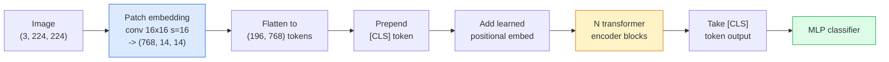

# ترانسفورماتورهای بینایی (ViT)

> تصویر رو به پشه ها برش بدين، هر پشه رو به عنوان يک کلمه نگاه کنيد، يک ترانسفورماتور استاندارد اجرا کنيد.

**Type:** Build
**Languages:** Python
**Prerequisites:** Phase 7 Lesson 02 (Self-Attention), Phase 4 Lesson 04 (Image Classification)
**Time:** ~45 minutes

## اهداف یادگیری

- پیاده سازی پیوند، یادگیری پیوند موقعیت، نماد کلاس و بلوک های کدگر ترانسفورماتور از ابتدا برای ساخت حداقل ViT
- توضیح دهید که چرا تصور می شد که ViT به داده های گسترده پیش از آموزش نیاز دارد تا زمانی که DeiT و MAE برعکس را ثابت کنند
- مقایسه ViT، Swin و ConvNeXt در سابقه معماری خود (هیچ، توجه پنجره محلی، ستون فقرات کنو)
- تنظیم دقیق یک ViT پیش از آموزش در یک مجموعه داده کوچک با استفاده از `timm`و دستورالعملی استاندارد لاینر-سوند / دقیق

## مشکل

برای یک دهه، کنولوشن مترادف با دید رایانه ای بود. سی ان ان ها دارای تعصب های قوی است که هیچ کس فکر نمی کرد می تواند جایگزین آنها شود. سپس دوسویتسکی و همکاران (2020) نشان داد که یک ترانسفورماتور ساده که به تکه های تصویر صاف شده اعمال می شود، بدون هیچ دستگاه کنولوشن، می تواند با بهترین سی ان ان ها در مقیاس مطابقت داشته باشد یا شکست دهد.

. گرفتگي "در مقیاس" بود . "وی" در "ایمیش نت-1ک" به "رست نت" شکست خورد ViT پیش از آموزش در ImageNet-21k یا JFT-300M سپس تنظیم شده در ImageNet-1k آن را شکست. نتیجه گیری این بود که ترانسفورماتورها سابقه های مفید ندارند اما می توانند از داده های کافی یاد بگیرند. مطالعات بعدی (DeiT، MAE، DINO) نشان داد که با دستورات آموزشی مناسب  افزایش قوی، خود نظارت قبل از آموزش، تزریق  VTs آموزش خوب در داده های کوچک نیز.

تا سال 2026، سی ان ان های خالص هنوز در دستگاه های کناری رقابتی هستند (ConvNeXt قوی ترین است) ، اما ترانسفورماتورها بر همه چیز دیگر تسلط دارند: بخش بندی (Mask2Former، SegFormer) ، تشخیص (DETR، RT-DETR) ، چندمودال (CLIP، SigLIP) ، ویدئو (VideoMAE، VJEPA). ساختار بلوک ViT یکی از آنها است.

## مفهوم

### خط لوله



هفت مرحله. پیچ ها -> توکن ها -> توجه -> طبقه بندی کننده. هر نوع (DeiT، Swin، ConvNeXt، MAE پیش تمرین) یک یا دو از هفت را تغییر می دهد و بقیه را تنها می گذارد.

### پیوند پیچ

اولین کنو، راز است. اندازه هسته 16، قدم 16، بنابراین یک تصویر 224x224 به یک شبکه 14x14 از پچ های 16x16 تبدیل می شود، هر کدام به یک گنجانده 768-dim پیش بینی می شود. این کنو یکتا هم پیچ و هم خطی پروژه می کند.

```
Input:  (3, 224, 224)
Conv (3 -> 768, k=16, s=16, no padding):
Output: (768, 14, 14)
Flatten spatial: (196, 768)
```

196 پچ = 196 توکن. ابعاد ویژگی هر توکن 768 (ViT-B) ، 1024 (ViT-L) یا 1280 (ViT-H) است.

### نماد کلاس

یک متری یاد گرفته شده به دنباله ای پیش روی داده شده:

```
tokens = [CLS; patch_1; patch_2; ...; patch_196]   shape (197, 768)
```

پس از N بلوک ترانسفورماتور، `[CLS]`output نمایش تصویر جهانی است. سر طبقه بندی فقط این یک ویکتور را می خواند.

### تعویض موقعیت

ترانسفورماتورها هيچ مفهومي از موقعيت فضايي ندارند.

```
tokens = tokens + learned_pos_embedding   (also shape (197, 768))
```

گنجانده شدن یک پارامتر مدل است؛ آموزش مبتنی بر گرادینت آن را به ساختار تصویر 2D تطبیق می کند. جایگزین های 2D سینوسوئید وجود دارد اما به ندرت در عمل استفاده می شود.

### بلاک کدگر ترانسفورماتور

استاندارد، خود توجه چند سر، MLP، اتصال های باقیمانده، پیش از لایه نورم

```
x = x + MSA(LN(x))
x = x + MLP(LN(x))

MLP is two-layer with GELU: Linear(d -> 4d) -> GELU -> Linear(4d -> d)
```

ViT-B/16 12 تا از این بلوک ها را با 12 سر توجه، با مجموع 86 میلیون پارامتر جمع می کند.

### چرا قبل از LN

ترانسفورماتورهای اولیه استفاده شده پس از LN (`x = LN(x + sublayer(x))`) و تلاش برای آموزش پس از 6-8 لایه بدون گرم شدن.`x = x + sublayer(LN(x))`) شبکه های عمیق تر را بدون گرمایش پایدار تر می کند.

### تعادل اندازه ی پیچ

- 16×16 پیچ -> 196 توکن، استاندارد.
- 32x32 پچ -> 49 توکن، سریعتر اما رزولوشن پایین تر
- 8×8 پیچ -> 784 توکن، دقیق تر اما O n^2) توجه هزینه مقیاس بد.

پیچ های بزرگتر = توکن های کمتر = سریعتر اما جزئیات فضایی کمتر. SwinV2 از پیچ های 4x4 در پنجره های سلسله مراتبی استفاده می کند.

### دستور کار DeiT برای آموزش ViT در ImageNet-1k

وی تی اصلی به JFT-300M نیاز داشت تا CNN ها را شکست دهد. DeiT (Touvron و همکاران، 2020) با چهار تغییر، وی تی بی را به 81.8% در رتبه اول در ImageNet-1k آموزش داد:

1. افزونه سنگین: افزونه تصادفی، مخلوط، کتی میکس، پاک کردن تصادفی.
2. عمق استوکاستیک (در طول تمرین کل بلوک ها را به طور تصادفی رها کنید).
3. افزایش مکرر (نشان مشابه 3 بار در هر دسته)
4. تزریق از یک معلم CNN (اختيار، دقت را بیشتر افزایش می دهد).

هر نسخه مدرن آموزش ViT از DeiT می آید.

### سوین vs کنوینکس

- **Swin**(Liu et al., 2021)  توجه مبتنی بر پنجره. هر بلوک در یک پنجره محلی حضور دارد؛ بلوک های متناوب پنجره را برای ترکیب اطلاعات در پنجره ها تغییر می دهند. در حالی که عامل توجه را حفظ می کند، یک محل مانند CNN را به عقب می آورد.
- **ConvNeXt**(Liu et al., 2022)  طراحی مجدد CNN که با انتخاب معماری سوین مطابقت دارد (convs عمیق، LayerNorm، GELU، گوشه بطری معکوس) نشان داد که شکاف "انتباه در مقابل پیچ" نیست بلکه "وصف آموزش مدرن + معماری".

در سال 2026، ConvNeXt-V2 و Swin-V2 هر دو در درجه تولید هستند؛ انتخاب صحیح بستگی به استیک نتیجه گیری شما (ConvNeXt برای لبه بهتر را جمع آوری می کند) و corpus پیش از تمرین دارد.

### آموزش قبل از آموزش

آتوکودر ماسک شده (He et al., 2022): 75 درصد پچ ها را به طور تصادفی ماسک کنید، کدگر را برای پردازش تنها 25 درصد قابل مشاهده آموزش دهید، یک کدگر کوچک را برای بازسازی پچ های ماسک شده از خروجی کدگر آموزش دهید. پس از پیش تمرین، کدگر را کنار بگذارید و کدگر را خوب تنظیم کنید.

MAE باعث می شود که ViT تنها در ImageNet-1k آموزش داده شود، به SOTA ضربه می زند و نسخه پیش فرض خود نظارت شده فعلی است.

```figure
batchnorm-inference
```

## آن را بسازید

### مرحله اول: پیوند پیچ

```python
import torch
import torch.nn as nn

class PatchEmbedding(nn.Module):
    def __init__(self, in_channels=3, patch_size=16, dim=192, image_size=64):
        super().__init__()
        assert image_size % patch_size == 0
        self.proj = nn.Conv2d(in_channels, dim, kernel_size=patch_size, stride=patch_size)
        num_patches = (image_size // patch_size) ** 2
        self.num_patches = num_patches

    def forward(self, x):
        x = self.proj(x)
        return x.flatten(2).transpose(1, 2)
```

یک کنو، یک فلت، یک ترانسپوز. این تمام مرحله از تصویر به توکن است.

### مرحله دوم: بلاک ترانسفورماتور

قبل از LN، خود توجه چند سر، MLP با GELU، اتصال های باقیمانده.

```python
class Block(nn.Module):
    def __init__(self, dim, num_heads, mlp_ratio=4, dropout=0.0):
        super().__init__()
        self.ln1 = nn.LayerNorm(dim)
        self.attn = nn.MultiheadAttention(dim, num_heads, dropout=dropout, batch_first=True)
        self.ln2 = nn.LayerNorm(dim)
        self.mlp = nn.Sequential(
            nn.Linear(dim, dim * mlp_ratio),
            nn.GELU(),
            nn.Dropout(dropout),
            nn.Linear(dim * mlp_ratio, dim),
            nn.Dropout(dropout),
        )

    def forward(self, x):
        a, _ = self.attn(self.ln1(x), self.ln1(x), self.ln1(x), need_weights=False)
        x = x + a
        x = x + self.mlp(self.ln2(x))
        return x
```

`nn.MultiheadAttention`در حال انجام تقسیم به سر، محصول نقطه در مقیاس و پروژکتور خروجی است.`batch_first=True`پس شکل ها`(N, seq, dim)`. .

### مرحله سوم: ویت

```python
class ViT(nn.Module):
    def __init__(self, image_size=64, patch_size=16, in_channels=3,
                 num_classes=10, dim=192, depth=6, num_heads=3, mlp_ratio=4):
        super().__init__()
        self.patch = PatchEmbedding(in_channels, patch_size, dim, image_size)
        num_patches = self.patch.num_patches
        self.cls_token = nn.Parameter(torch.zeros(1, 1, dim))
        self.pos_embed = nn.Parameter(torch.zeros(1, num_patches + 1, dim))
        self.blocks = nn.ModuleList([
            Block(dim, num_heads, mlp_ratio) for _ in range(depth)
        ])
        self.ln = nn.LayerNorm(dim)
        self.head = nn.Linear(dim, num_classes)
        nn.init.trunc_normal_(self.pos_embed, std=0.02)
        nn.init.trunc_normal_(self.cls_token, std=0.02)

    def forward(self, x):
        x = self.patch(x)
        cls = self.cls_token.expand(x.size(0), -1, -1)
        x = torch.cat([cls, x], dim=1)
        x = x + self.pos_embed
        for blk in self.blocks:
            x = blk(x)
        x = self.ln(x[:, 0])
        return self.head(x)

vit = ViT(image_size=64, patch_size=16, num_classes=10, dim=192, depth=6, num_heads=3)
x = torch.randn(2, 3, 64, 64)
print(f"output: {vit(x).shape}")
print(f"params: {sum(p.numel() for p in vit.parameters()):,}")
```

حدود 2.8M پارامتر  یک ViT کوچک قابل کنترل در CPU. ViT-B واقعی 86M است؛ همان تعریف کلاس با `dim=768, depth=12, num_heads=12`. .

### مرحله 4: بررسی عقل  نتیجه گیری از یک تصویر

```python
logits = vit(torch.randn(1, 3, 64, 64))
print(f"logits: {logits}")
print(f"probs:  {logits.softmax(-1)}")
```

بدون خطا اجرا بشه احتمالات جمع 1

## ازش استفاده کن

`timm`هر نوع وي تي رو با وزن هاي پيش از آموزش ImageNet ارسال ميکنه

```python
import timm

model = timm.create_model("vit_base_patch16_224", pretrained=True, num_classes=10)
```

`timm`این سیستم در سال 2026 پیش فرض تولید برای ترانسفورماتورهای بینایی است. پشتیبانی از ViT، DeiT، Swin، Swin-V2، ConvNeXt، ConvNeXt-V2، MaxViT، MViT، EfficientFormer و ده ها نفر دیگر تحت همان API.

برای کارهای چند مودیل (تصاویر + متن)`transformers`سفینهای CLIP، SigLIP، BLIP-2، LLaVA. کدر تصویر در همه آنها یک ویرانت ViT است.

## -باده

این درس نتیجه می دهد:

- `outputs/prompt-vit-vs-cnn-picker.md` یک پیام که بین یک ViT، یک ConvNeXt، یا یک Swin بر اساس اندازه مجموعه داده ها، محاسبه و نتیجه گیری استیک انتخاب می کند.
- `outputs/skill-vit-patch-and-pos-embed-inspector.md` یک مهارت که تایید می کند پیوند های پیچ و شکل های پیوند موقعیت در مدل با طول دنباله انتظار می رود، و رایج ترین اشکال پورت را شناسایی می کند.

## تمرینات

1. **(Easy)**شکل هر تنسور متوسط را برای عبور جلو از طریق ViT کوچک بالا چاپ کنید.`(N, 3, 64, 64)`-> پیچ ها`(N, 16, 192)`-> با CLS `(N, 17, 192)`-> ورودی طبقه بندی کننده`(N, 192)`-> محصول`(N, num_classes)`. .
2. **(Medium)**يه آدم پيش از آموزش خوبي رو تنظیم کن`timm`ViT-S/16 در مجموعه داده های مصنوعی CIFAR از درس 4. مقایسه با تنظیم دقیق ResNet-18 بر روی همان داده ها. گزارش زمان آموزش و دقت نهایی.
3. **(Hard)**اجرای تمرینات قبل از استفاده از MAE برای ViT کوچک: 75% تکه ها را ماسک کنید، کدگر را آموزش دهید + یک کدگر کوچک برای بازسازی تکه های پنهان. دقت خطی تکه ها را قبل و بعد از تمرین بر روی داده های مصنوعی ارزیابی کنید.

## اصطلاحات کلیدی

| Term | What people say | What it actually means |
|------|----------------|----------------------|
| Patch embedding | "The first conv" | A conv with kernel size = stride = patch size; turns the image into a grid of token embeddings |
| Class token | "[CLS]" | A learned vector prepended to the token sequence; its final output is the global image representation |
| Positional embedding | "Learned pos" | A learned vector added to every token so the transformer knows where each patch came from |
| Pre-LN | "LayerNorm before sublayer" | The stable transformer variant: `x + sublayer(LN(x))` instead of `LN(x + sublayer(x))` |
| Multi-head attention | "Parallel attention" | Standard transformer attention split into num_heads independent subspaces, concatenated afterwards |
| ViT-B/16 | "Base, patch 16" | The canonical size: dim=768, depth=12, heads=12, patch_size=16, image=224; ~86M params |
| DeiT | "Data-efficient ViT" | ViT trained on ImageNet-1k alone with strong augmentation; proved large pretraining datasets are not strictly required |
| MAE | "Masked autoencoder" | Self-supervised pretraining: mask 75% of patches, reconstruct; the dominant ViT pretraining recipe |

## خواندن بیشتر

- [An Image is Worth 16x16 Words (Dosovitskiy et al., 2020)](https://arxiv.org/abs/2010.11929) کاغذ ViT
- [DeiT: Data-efficient Image Transformers (Touvron et al., 2020)](https://arxiv.org/abs/2012.12877) چگونه تنها روی ImageNet-1k به ViT آموزش دهیم
- [Masked Autoencoders are Scalable Vision Learners (He et al., 2022)](https://arxiv.org/abs/2111.06377) آموزش قبل از آموزش
- [timm documentation](https://huggingface.co/docs/timm) مرجع برای هر ترانسفورماتور دید که در تولید استفاده می کنید
