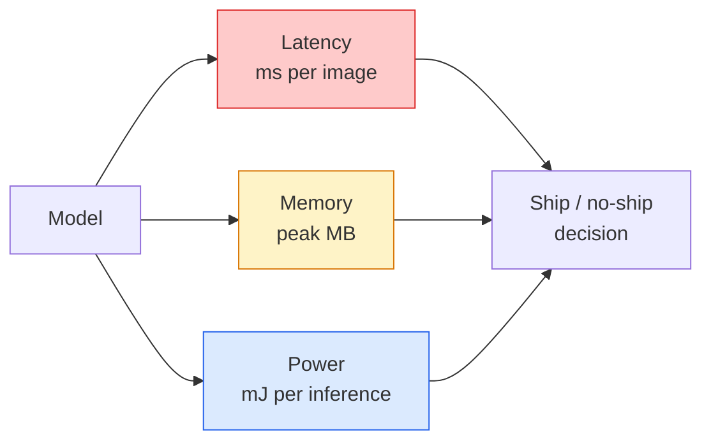

# دید زمان واقعی  انتشار کناری

> نتیجه گیری کناری این رشته است که یک مدل 90 دقیقه ای را در 30 fps در یک دستگاه با 2 GB RAM اجرا می کند. هر درصد نقطه دقت با میلی ثانیه تاخیر معامله می شود.

**Type:** Learn + Build
**Languages:** Python
**Prerequisites:** Phase 4 Lesson 04 (Image Classification), Phase 10 Lesson 11 (Quantization)
**Time:** ~75 minutes

## اهداف یادگیری

- طول تاخیر نتیجه گیری، حافظه اوج و تولید برای هر مدل PyTorch را اندازه گیری کنید و FLOPs / params / tradeoff تاخیر را بخوانید
- مدل بینایی را به INT8 با استفاده از کوانتاسیون پس از آموزش PyTorch کمی کنید و از دست دادن دقت < 1٪ را تأیید کنید
- صادرات به ONNX و مرتب کردن با ONNX Runtime یا TensorRT؛ نام سه شکست رایج صادرات و اصلاح آنها
- توضیح دهید که چه زمانی باید MobileNetV3، EfficientNet-Lite، ConvNeXt-Tiny یا MobileViT را برای محدودیت لبه انتخاب کنید

## مشکل

یک مدل بینایی در زمان آموزش یک هیولای نقطه شناور است. 100M پارامتر، 10 GFLOP در هر گذرگاه جلو، 2 GB VRAM. هیچ یک از این موارد در تلفن، واحد اطلاعات و سرگرمی خودرو، دوربین صنعتی یا یک هواپیما بدون سرنشین قرار نمی گیرد. ارسال یک سیستم بینایی به معنای قرار دادن پیش بینی های مشابه در بودجه ای که 100 برابر کوچکتر است.

سه دکمه بیشتر کار را انجام می دهند: انتخاب مدل (ارشیکتوری کوچکتر با همان دستور کار) ، مقدار (INT8 به جای FP32) ، و زمان اجرا نتیجه گیری (ONNX Runtime، TensorRT، Core ML، TFLite). درست کردن آنها تفاوت بین یک نمایش که در یک ایستگاه کار اجرا می شود و یک محصول که بر روی یک ماژول دوربین 30 دلاری ارسال می شود.

این درس ابتدا نظم اندازه گیری را تنظیم می کند (شما نمی توانید آنچه را که نمی توانید اندازه گیری کنید را بهینه سازی کنید) ، سپس سه دکمه را حرکت می دهد. هدف این نیست که هر زمان اجرا کناری را یاد بگیرید بلکه بدانید که چه اهرم هایی وجود دارد و چگونه برای تأیید هر یک از آنها آنچه را که فکر می کنید انجام می دهد.

## مفهوم

### سه بودجه



- **Latency**: p50، p95، p99 .در میانگین فقط p50 رفتار دم را که برای سیستم های زمان واقعی مهم است پنهان می کند.
- **Peak memory**: حداکثر چیزی که دستگاه می بیند، نه متوسط حالت ثابت، مهم است چون OOM ها در اهداف داخلی کشنده هستند.
- **Power / energy**: میلی جویل ها در هر نتیجه گیری در یک دستگاه با باتری. اغلب با استفاده از زمان CPU / GPU.

جدول (نمونه، تاخیر، حافظه، دقت) چیزی است که تصمیم گیری حاشیه از آن گرفته می شود. هر سلول بر روی دستگاه هدف اندازه گیری می شود، نه ایستگاه کار.

### نظم اندازه گیری

سه قانون که هر پروفایل کناره باید دنبال کند:

1. **Warm up**مدل با 5-10 حرکت پیش بینی شده قبل از اندازه گیری. حافظه ی سرد و جمع آوری JIT اعداد اول را غیر نماینده می کند.
2. **Synchronise**بار کاری GPU با `torch.cuda.synchronize()`بدون این شما در حال اندازه گیری فرستادن هسته هستید نه اجرای هسته.
3. **Fix input sizes**به وضوح تولید. لانتین در 224x224 لانتین در 512x512 نیست.

### FLOPs به عنوان یک نماینده

FLOPs (عملیات نقطه شناور بر اساس نتیجه گیری) یک پروکسی ارزان و مستقل از دستگاه برای تاخیر است. برای مقایسه معماری مفید است، گمراه کننده به عنوان ساعت دیواری مطلق. یک مدل با FLOPs 10٪ بیشتر می تواند دو برابر سریع تر در عمل باشد زیرا از عملیات سخت افزاری دوستانه استفاده می کند (عمق کنو به خوبی مرتب می کند، کنو بزرگ 7x7 نمی کند).

قانون: استفاده از FLOP برای جستجوی معماری، استفاده از تاخیر در دستگاه برای تصمیمات پیاده سازی.

### مقدار بندی در یک پاراگراف

وزن و فعال سازی FP32 را با INT8 جایگزین کنید. اندازه مدل 4x کاهش می یابد، عرض باند حافظه 4x کاهش می یابد، محاسبه 2-4x در سخت افزار دارای هسته های INT8 کاهش می یابد (هر SoC تلفن همراه مدرن، هر GPU NVIDIA با Tensor Cores).

انواع:

- **Dynamic** وزن کوانتیس به INT8، فعال سازی ها در FP محاسبه می شوند. آسان، سرعت کوچک.
- **Static (post-training)** وزن کوانتزی + محدوده فعال سازی کالیبر در یک مجموعه کالیبر کوچک. خیلی سریع تر از پویایی.
- **Quantisation-aware training (QAT)** شبیه سازی کوانتاسیون در طول آموزش به طوری که مدل در اطراف آن یاد بگیرد.

برای بینایی، کوانتاسیون ثابت پس از آموزش 95 درصد از مزایای را با 5 درصد تلاش می دهد.

### کشتن و نشت کردن

- **Pruning** وزن های غیر مهم (بناور مقیاس) یا کانال ها (ساخت شده) را حذف کنید. در مدل های بیش از حد پارامتر شده خوب کار می کند؛ در معماری های کمپیکت کمتر مفید است.
- **Distillation** آموزش یک دانش آموز کوچک برای تقلید از یک استاد بزرگ. اغلب بیشتر دقت از دست رفته را با کوچک کردن مدل بازیابی می کند. استاندارد برای مدل های کناری تولید.

### زمان اجرا نتیجه گیری

- **PyTorch eager** آهسته، برای استفاده نیست فقط برای توسعه استفاده می شود.
- **TorchScript** میراث.`torch.compile`و صادرات اونکس
- **ONNX Runtime**زمان اجرا خنثی CPU، CUDA، CoreML، TensorRT، OpenVINO همه داراي ONNX هستند.
- **TensorRT** کامپایلر NVIDIA. بهترین تاخیر در GPU های NVIDIA (کارگاه و Jetson). با ONNX Runtime یا مستقل ادغام می شود.
- **Core ML** زمان اجرا اپل برای iOS/macOS. نیازها `.mlmodel`یا`.mlpackage`. .
- **TFLite** زمان اجرا گوگل برای اندروید/ARM. نیازها `.tflite`. .
- **OpenVINO** زمان اجرا اینتل برای CPU/VPU. نیازها `.xml`+ `.bin`. .

در عمل: صادرات PyTorch -> ONNX -> انتخاب زمان اجرا برای هدف. ONNX زبان فرانسه است.

### انتخاب کننده معماری کناره

| Budget | Model | Why |
|--------|-------|-----|
| < 3M params | MobileNetV3-Small | Compiles everywhere, good baseline |
| 3-10M | EfficientNet-Lite-B0 | Best accuracy per param on TFLite |
| 10-20M | ConvNeXt-Tiny | Best accuracy-per-param, CPU-friendly |
| 20-30M | MobileViT-S or EfficientViT | Transformer with ImageNet accuracy |
| 30-80M | Swin-V2-Tiny | If stack supports window attention |

همه این ها را به INT8 مقادیر کنید مگر اینکه دلیل خاصی برای این کار نداشته باشید.

```figure
cnn-param-count
```

## آن را بسازید

### مرحله ی ۱: تاخیر را به درستی اندازه گیری کنید

```python
import time
import torch

def measure_latency(model, input_shape, device="cpu", warmup=10, iters=50):
    model = model.to(device).eval()
    x = torch.randn(input_shape, device=device)
    with torch.no_grad():
        for _ in range(warmup):
            model(x)
        if device == "cuda":
            torch.cuda.synchronize()
        times = []
        for _ in range(iters):
            if device == "cuda":
                torch.cuda.synchronize()
            t0 = time.perf_counter()
            model(x)
            if device == "cuda":
                torch.cuda.synchronize()
            times.append((time.perf_counter() - t0) * 1000)
    times.sort()
    return {
        "p50_ms": times[len(times) // 2],
        "p95_ms": times[int(len(times) * 0.95)],
        "p99_ms": times[int(len(times) * 0.99)],
        "mean_ms": sum(times) / len(times),
    }
```

گرم کردن، هم زمان کردن، استفاده کردن`time.perf_counter()`. گزارش درصد ها ، نه فقط متوسط

### مرحله دوم: شمارش پارامتر و FLOP

```python
def parameter_count(model):
    return sum(p.numel() for p in model.parameters())

def flops_estimate(model, input_shape):
    """
    Rough FLOP count for a conv/linear-only model. For production use `fvcore` or `ptflops`.
    """
    total = 0
    def conv_hook(m, inp, out):
        nonlocal total
        c_out, c_in, kh, kw = m.weight.shape
        h, w = out.shape[-2:]
        total += 2 * c_in * c_out * kh * kw * h * w
    def linear_hook(m, inp, out):
        nonlocal total
        total += 2 * m.in_features * m.out_features
    hooks = []
    for m in model.modules():
        if isinstance(m, torch.nn.Conv2d):
            hooks.append(m.register_forward_hook(conv_hook))
        elif isinstance(m, torch.nn.Linear):
            hooks.append(m.register_forward_hook(linear_hook))
    model.eval()
    with torch.no_grad():
        model(torch.randn(input_shape))
    for h in hooks:
        h.remove()
    return total
```

برای پروژه های واقعی استفاده کنید`fvcore.nn.FlopCountAnalysis`یا`ptflops`؛ آنها هر نوع ماژول را به درستی اداره می کنند.

### مرحله سوم: اندازه گیری ثابت پس از آموزش

```python
def quantise_ptq(model, calibration_loader, backend="x86"):
    import torch.ao.quantization as tq
    model = model.eval().cpu()
    model.qconfig = tq.get_default_qconfig(backend)
    tq.prepare(model, inplace=True)
    with torch.no_grad():
        for x, _ in calibration_loader:
            model(x)
    tq.convert(model, inplace=True)
    return model
```

سه مرحله: پیکربندی، آماده سازی (درآوردن ناظرین) ، کالیبراسیون با داده های واقعی، تبدیل (فوز + کوانتیس)`Conv -> BN -> ReLU`-> `ConvBnReLU`) که`torch.ao.quantization.fuse_modules`دستمال

### مرحله 4: صادرات به ONNX

```python
def export_onnx(model, sample_input, path="model.onnx"):
    model = model.eval()
    torch.onnx.export(
        model,
        sample_input,
        path,
        input_names=["input"],
        output_names=["output"],
        dynamic_axes={"input": {0: "batch"}, "output": {0: "batch"}},
        opset_version=17,
    )
    return path
```

`opset_version=17`این است که در سال 2026 به طور مطمئن شکست خورده است.`dynamic_axes`اجازه می دهد مدل ONNX را با اندازه دسته ای تعسفی اجرا کنید.

### مرحله 5: مقایسه و مقایسه رژیم ها

```python
import torch.nn as nn
from torchvision.models import mobilenet_v3_small

def compare_regimes():
    model = mobilenet_v3_small(weights=None, num_classes=10)
    params = parameter_count(model)
    flops = flops_estimate(model, (1, 3, 224, 224))
    lat_fp32 = measure_latency(model, (1, 3, 224, 224), device="cpu")
    print(f"FP32 MobileNetV3-Small: {params:,} params  {flops/1e9:.2f} GFLOPs  "
          f"p50={lat_fp32['p50_ms']:.2f}ms  p95={lat_fp32['p95_ms']:.2f}ms")
```

برای `resnet50`،`efficientnet_v2_s`و`convnext_tiny`و شما جدول مقایسه ای دارید که برای تصمیم گیری در مورد تعینات نیاز دارید.

## ازش استفاده کن

دسته های تولید در یکی از سه مسیر همگام می شوند:

- **Web / serverless**: PyTorch -> ONNX -> ONNX Runtime (برندگان CPU یا CUDA). ساده ترین، برای اکثر افراد کافی است.
- **NVIDIA edge (Jetson, GPU server)**: PyTorch -> ONNX -> TensorRT. بهترین تاخیر، بزرگترین تلاش مهندسی.
- **Mobile**: PyTorch -> ONNX -> Core ML (iOS) یا TFLite (Android). قبل از صادرات کمیت کنید.

برای اندازه گیری`torch-tb-profiler`،`nvprof`-`nsys`، و ابزارها در macOS به طور لایه به لایه شکستن داده می شود.`benchmark_app`(OpenVINO) و`trtexec`(تنسورRT) شماره های مستقل CLI را بده.

## -باده

این درس نتیجه می دهد:

- `outputs/prompt-edge-deployment-planner.md` یک پیام که ستون فقرات، استراتژی کوانتاسیون و زمان اجرا را به عنوان دستگاه هدف و SLA تاخیر انتخاب می کند.
- `outputs/skill-latency-profiler.md` یک مهارت که یک اسکریپت کامل بنچ مارک تاخیر با گرم شدن، همگام سازی، پرسنتیل ها و ردیابی حافظه را می نویسد.

## تمرینات

1. **(Easy)**اندازه گیری تاخیر p50 برای `resnet18`،`mobilenet_v3_small`،`efficientnet_v2_s`و`convnext_tiny`در 224x224 در CPU گزارش جدول و مشخص کنید که کدام معماری بهترین دقت در هر ثانیه را دارد.
2. **(Medium)**بعد از آموزش، مقدار گیری جامدی را به `mobilenet_v3_small`گزارش FP32 در مقابل INT8 از دست دادن تاخیر و دقت در زیر مجموعه CIFAR-10 یا مشابه.
3. **(Hard)**صادرات`convnext_tiny`به اونکس، ازش استفاده کن`onnxruntime`با`CPUExecutionProvider`و تاخیر را با خط پایه PyTorch مقایسه کنید. اولین لایه ای را شناسایی کنید که زمان اجرا ONNX سریعتر است و توضیح دهید چرا.

## اصطلاحات کلیدی

| Term | What people say | What it actually means |
|------|----------------|----------------------|
| Latency | "How fast" | Time from input to output; p50/p95/p99 percentiles, not mean |
| FLOPs | "Model size" | Floating-point ops per forward pass; rough proxy for compute cost |
| INT8 quantisation | "8-bit" | Replace FP32 weights/activations with 8-bit integers; ~4x smaller, 2-4x faster |
| PTQ | "Post-training quantisation" | Quantise a trained model without retraining; easy, usually enough |
| QAT | "Quantisation-aware training" | Simulate quantisation during training; best accuracy, requires labelled data |
| ONNX | "The neutral format" | Model exchange format supported by every mainstream inference runtime |
| TensorRT | "NVIDIA compiler" | Compiles ONNX into an optimised engine for NVIDIA GPUs |
| Distillation | "Teacher -> student" | Train a small model to mimic a big model's logits; recovers most lost accuracy |

## خواندن بیشتر

- [EfficientNet (Tan & Le, 2019)](https://arxiv.org/abs/1905.11946) مقیاس بندی ترکیب برای معماری های کارآمد
- [MobileNetV3 (Howard et al., 2019)](https://arxiv.org/abs/1905.02244) معماری تلفن همراه با h-swish و squeeze-excite
- [Accelerating Inference Up to 6x Faster in PyTorch with Torch-TensorRT (NVIDIA)](https://developer.nvidia.com/blog/accelerating-inference-up-to-6x-faster-in-pytorch-with-torch-tensorrt/) چگونه اعداد تولید در کاغذ را بدست آوریم
- [ONNX Runtime docs](https://onnxruntime.ai/docs/) اندازه گیری، بهینه سازی نمودار، انتخاب ارائه دهنده
