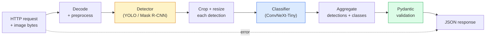

# ساخت خط لوله کامل دید  Capstone

> یک سیستم دید تولید یک زنجیره از مدل ها و قوانین است که با قراردادهای داده ها بسته شده است. قطعات در این مرحله هستند؛ سنگ پای آنها را از انتهای تا انتهای به هم متصل می کند.

**Type:** Build
**Languages:** Python
**Prerequisites:** Phase 4 Lessons 01-15
**Time:** ~120 minutes

## اهداف یادگیری

- طراحی یک خط تولید دید که اشیاء را تشخیص می دهد، آنها را طبقه بندی می کند و JSON ساختاری را  با هر مسیر شکست کنترل می کند
- یک آشکارساز (Mask R-CNN یا YOLO) ، یک طبقه بندی کننده (ConvNeXt-Tiny) و یک قرارداد داده (Pydantic) را به یک سرویس وصل کنید
- بر اساس معیار خط لوله از پایان به پایان و شناسایی اولین گوشه بطری (معمولا پیش پردازش، سپس آشکارساز)
- ارسال یک سرویس FastAPI حداقل که پذیرش بارگذاری تصویر، اجرای خط لوله و بازپرداخت با طبقه بندی

## مشکل

مدل های دید فردی مفید هستند؛ محصولات دید زنجیره ای از آنها هستند. یک حسابرسی قفسه خرده فروشی یک آشکارساز و یک طبقه بندی کننده محصول و یک لوله قیمت OCR است. رانندگی مستقل یک آشکارساز 2D و یک آشکارساز 3D و یک ردیاب و یک برنامه رئ کننده است. یک پیش نمایش پزشکی یک بخش و یک طبقه بندی کننده منطقه و یک UI کلینیکی است.

سیم کشی این زنجیره ها بخشی است که نمونه اولیه ML را از یک محصول جدا می کند. هر رابط بین مدل ها یک مکان جدید برای اشکال است. هر تغییر هماهنگی، هر عادی سازی، هر تغییر اندازه ماسک یک کاندیدای شکست خاموش است. یک خط لوله به اندازه ضعف ترین رابط آن قوی است.

این سنگ پایان حداقل خط لوله قابل اجرا را تنظیم می کند: تشخیص + طبقه بندی + خروجی ساختاری + یک لایه خدمت. همه چیز دیگر در فاز 4 در این اسکلت قرار می گیرد: ماسک R-CNN را برای YOLOv8 تغییر دهید، سر OCR را اضافه کنید، شاخه بخش بندی را اضافه کنید، ردیابی را اضافه کنید. معماری پایدار است؛ قطعات قابل وصل هستند.

## مفهوم

### خط لوله



هفت مرحله. دو مرحله مدل گران هستند؛ پنج مرحله دیگر جایی هستند که حشرات زندگی می کنند.

### قراردادهای داده با Pydantic

هر مرز مدل به یک شی تایپ شده تبدیل می شود. این باعث می شود شکست های خاموش به شکست های بلند تبدیل شود.

```
Detection(
    box: tuple[float, float, float, float],   # (x1, y1, x2, y2), absolute pixels
    score: float,                              # [0, 1]
    class_id: int,                             # from detector's label map
    mask: Optional[list[list[int]]],           # RLE-encoded if present
)

PipelineResult(
    image_id: str,
    detections: list[Detection],
    classifications: list[Classification],
    inference_ms: float,
)
```

وقتی یک دیتکتور جعبه ها را در`(cx, cy, w, h)`به جای`(x1, y1, x2, y2)`، تایید پيدانتيك در مرز شکست خورده و شما فوراً متوجه شديد بجاي ديگگگري کردن محصولي که به طور خاموشي مناطق خالي رو باز مي گرداند

### کجا تاخیر می رود

سه حقیقت در تقریباً هر خط خط دید وجود دارد:

1. **Preprocessing is often the biggest single block.**رمزگذاری JPEG، تبدیل فضاهای رنگی، تغییر اندازه  این ها به CPU متصل هستند و آسان به فراموشی هستند.
2. **The detector dominates GPU time.**70-90 درصد زمان گپيو در گذرگاه جلو کشف شده
3. **Postprocessing (NMS, RLE encode/decode) is cheap on GPU, expensive on CPU.**هميشه با هدف اصلي پروفايل داشته باش

دانستن توزیع این است که بهینه سازی را به یک لیست اولویت بندی می کند.

### حالت شکست

- **Empty detections** لیست خالی رو برگردون، سقوط نکن.
- **Out-of-bounds boxes** قبل از برش به اندازه تصویر متصل کنید.
- **Tiny crops** طبقه بندی را برای جعبه هایی که کوچکتر از حداقل ورودی طبقه بندی کننده هستند، رد کنید.
- **Corrupt upload** 400 پاسخ با کد خطای خاص، نه 500
- **Model load failure** در زمان شروع سرویس شکست می خورد، نه در اولین درخواست.

یک خط تولید هر یک از این موارد را بدون نوشتن عمومی اداره می کند `try/except`هر شکست کد و پاسخ داده می شود.

### دسته بندی

یک سرویس تولید به چندین مشتری خدمت می کند. تشخیص دسته بندی و طبقه بندی در میان درخواست ها تولیدات را چند برابر می کند. معامله: تاخیر اضافی از انتظار پر شدن یک دسته. تنظیم معمول: درخواست ها را تا 20ms جمع آوری کنید، دسته بندی کنید، پردازش کنید، پاسخ ها را توزیع کنید. `torchserve`و`triton`این کار را به صورت بومی انجام دهید؛ خدمات کوچک با بار قابل پیش بینی، میکروباتری خود را به کار می گیرند.

```figure
v4-vision-pipeline
```

## آن را بسازید

### مرحله ی اول: قراردادهای داده

```python
from pydantic import BaseModel, Field
from typing import List, Optional, Tuple

class Detection(BaseModel):
    box: Tuple[float, float, float, float]
    score: float = Field(ge=0, le=1)
    class_id: int = Field(ge=0)
    mask_rle: Optional[str] = None


class Classification(BaseModel):
    detection_index: int
    class_id: int
    class_name: str
    score: float = Field(ge=0, le=1)


class PipelineResult(BaseModel):
    image_id: str
    detections: List[Detection]
    classifications: List[Classification]
    inference_ms: float
```

پنج ثانیه کد یک ساعت از دیبگینگ در هر خط خط خط خط خط خط خط خط خط خط خط خط خط خط خط خط خط خط خط خط خط خط خط خط خط خط خط خط خط خط خط خط خط خط خط خط خط خط خط خط خط خط خط خط خط خط خط خط خط خط خط خط خط خط خط خط خط خط خط خط خط خط خط خط خط خط خط خط خط خط خط خط خط خط خط خط خط خط خط خط خط خط خط خط خط خط خط خط خط خط خط خط خط خط خط خط خط خط خط خط خط خط خط خط خط خط خط خط خط خط خط خط خط خط خط خط خط خط خط خط خط خط خط خط خط خط خط خط خط خط خط خط خط خط خط خط خط خط خط خط خط خط خط خط خط خط خط خط خط خط خط خط خط خط خط خط خط خط خط خط خط خط خط خط خط خط خط خط خط خط خط خط خط خط خط خط خط خط خط خط خط خط خط خط خط خط خط خط خط خط خط خط خط خط خط خط خط خط خط خط خط خط خط خط خط خط خط خط خط خط خط خط خط خط خط خط خط خط خط خط خط خط خط خط خط خط خط خط خط خط خط خط خط خط خط خط خط خط خط خط خط خط خط خط خط خط خط خط خط خط خط خط خط خط خط خط خط خط خط خط خط خط خط خط خط خط خط خط خط خط خط خط خط خط خط خط خط خط خط خط خط خط خط خط خط خط خط خط خط خط خط خط خط خط خط خط خط خط خط خط خط خط خط خط خط خط خط خط خط خط خط خط خط خط خط خط خط خط خط خط خط خط خط خط خط خط خط خط خط خط خط خط خط خط خط خط خط خط خط خط خط خط خط خط خط خط خط خط خط خط خط خط خط خط خط خط خط خط خط خط خط خط خط خط خط خط خط خط خط خط خط خط خط خط خط خط خط خط خط خط خط خط خط خط خط خط خط خط خط خط خط خط خط خط خط خط خط خط خط خط خط خط خط خط خط خط خط خط خط خط خط خط خط خط خط خط خط خط خط خط خط خط خط خط خط خط خط خط خط خط خط خط خط خط خط خط خط خط خط خط خط خط خط خط خط خط خط خط خط خط خط خط خط خط خط خط خط خط خط خط خط خط خط خط خط خط خط خط خط خط خط خط خط خط خط خط خط خط خط خط خط خط خط خط خط خط خط خط خط خط خط خط خط خط خط خط خط خط

### مرحله دوم: کلاس پایپ لاین حداقل

```python
import time
import numpy as np
import torch
from PIL import Image

class VisionPipeline:
    def __init__(self, detector, classifier, class_names,
                 device="cpu", min_crop=32):
        self.detector = detector.to(device).eval()
        self.classifier = classifier.to(device).eval()
        self.class_names = class_names
        self.device = device
        self.min_crop = min_crop

    def preprocess(self, image):
        """
        image: PIL.Image or np.ndarray (H, W, 3) uint8
        returns: CHW float tensor on device
        """
        if isinstance(image, Image.Image):
            image = np.asarray(image.convert("RGB"))
        tensor = torch.from_numpy(image).permute(2, 0, 1).float() / 255.0
        return tensor.to(self.device)

    @torch.no_grad()
    def detect(self, image_tensor):
        return self.detector([image_tensor])[0]

    @torch.no_grad()
    def classify(self, crops):
        if len(crops) == 0:
            return []
        batch = torch.stack(crops).to(self.device)
        logits = self.classifier(batch)
        probs = logits.softmax(-1)
        scores, cls = probs.max(-1)
        return list(zip(cls.tolist(), scores.tolist()))

    def run(self, image, image_id="anonymous"):
        t0 = time.perf_counter()
        tensor = self.preprocess(image)
        det = self.detect(tensor)

        crops = []
        detections = []
        valid_indices = []
        for i, (box, score, cls) in enumerate(zip(det["boxes"], det["scores"], det["labels"])):
            x1, y1, x2, y2 = [max(0, int(b)) for b in box.tolist()]
            x2 = min(x2, tensor.shape[-1])
            y2 = min(y2, tensor.shape[-2])
            detections.append(Detection(
                box=(x1, y1, x2, y2),
                score=float(score),
                class_id=int(cls),
            ))
            if (x2 - x1) < self.min_crop or (y2 - y1) < self.min_crop:
                continue
            crop = tensor[:, y1:y2, x1:x2]
            crop = torch.nn.functional.interpolate(
                crop.unsqueeze(0),
                size=(224, 224),
                mode="bilinear",
                align_corners=False,
            )[0]
            crops.append(crop)
            valid_indices.append(i)

        class_preds = self.classify(crops)

        classifications = []
        for valid_idx, (cls_id, cls_score) in zip(valid_indices, class_preds):
            classifications.append(Classification(
                detection_index=valid_idx,
                class_id=int(cls_id),
                class_name=self.class_names[cls_id],
                score=float(cls_score),
            ))

        return PipelineResult(
            image_id=image_id,
            detections=detections,
            classifications=classifications,
            inference_ms=(time.perf_counter() - t0) * 1000,
        )
```

هر رابطي که در آن وجود داره، تايپ شده و هر مسیر شکستي که در آن وجود داره، تصميم خاصي براي تصديق داره

### مرحله سوم: یک آشکارساز و یک طبقه بندی کننده را به کار ببرید

```python
from torchvision.models.detection import maskrcnn_resnet50_fpn_v2
from torchvision.models import convnext_tiny

# Use ImageNet-pretrained weights for a realistic pipeline without training
detector = maskrcnn_resnet50_fpn_v2(weights="DEFAULT")
classifier = convnext_tiny(weights="DEFAULT")
class_names = [f"imagenet_class_{i}" for i in range(1000)]

pipe = VisionPipeline(detector, classifier, class_names)

# Smoke test with a synthetic image
test_image = (np.random.rand(400, 600, 3) * 255).astype(np.uint8)
result = pipe.run(test_image, image_id="demo")
print(result.model_dump_json(indent=2)[:500])
```

### مرحله 4: خدمات FastAPI

```python
from fastapi import FastAPI, UploadFile, HTTPException
from io import BytesIO

app = FastAPI()
pipe = None  # initialised on startup

@app.on_event("startup")
def load():
    global pipe
    detector = maskrcnn_resnet50_fpn_v2(weights="DEFAULT").eval()
    classifier = convnext_tiny(weights="DEFAULT").eval()
    pipe = VisionPipeline(detector, classifier, class_names=[f"c{i}" for i in range(1000)])

@app.post("/detect")
async def detect_endpoint(file: UploadFile):
    if file.content_type not in {"image/jpeg", "image/png", "image/webp"}:
        raise HTTPException(status_code=400, detail="unsupported image type")
    data = await file.read()
    try:
        img = Image.open(BytesIO(data)).convert("RGB")
    except Exception:
        raise HTTPException(status_code=400, detail="cannot decode image")
    result = pipe.run(img, image_id=file.filename or "upload")
    return result.model_dump()
```

با هم فرار کن`uvicorn main:app --host 0.0.0.0 --port 8000`. با تست`curl -F 'file=@dog.jpg' http://localhost:8000/detect`. .

### مرحله 5: بنچ مارک خط لوله

```python
import time

def benchmark(pipe, num_runs=20, image_size=(400, 600)):
    img = (np.random.rand(*image_size, 3) * 255).astype(np.uint8)
    pipe.run(img)  # warm up

    stages = {"preprocess": [], "detect": [], "classify": [], "total": []}
    for _ in range(num_runs):
        t0 = time.perf_counter()
        tensor = pipe.preprocess(img)
        t1 = time.perf_counter()
        det = pipe.detect(tensor)
        t2 = time.perf_counter()
        crops = []
        for box in det["boxes"]:
            x1, y1, x2, y2 = [max(0, int(b)) for b in box.tolist()]
            x2 = min(x2, tensor.shape[-1])
            y2 = min(y2, tensor.shape[-2])
            if (x2 - x1) >= pipe.min_crop and (y2 - y1) >= pipe.min_crop:
                crop = tensor[:, y1:y2, x1:x2]
                crop = torch.nn.functional.interpolate(
                    crop.unsqueeze(0), size=(224, 224), mode="bilinear", align_corners=False
                )[0]
                crops.append(crop)
        pipe.classify(crops)
        t3 = time.perf_counter()
        stages["preprocess"].append((t1 - t0) * 1000)
        stages["detect"].append((t2 - t1) * 1000)
        stages["classify"].append((t3 - t2) * 1000)
        stages["total"].append((t3 - t0) * 1000)

    for stage, times in stages.items():
        times.sort()
        print(f"{stage:12s}  p50={times[len(times)//2]:7.1f} ms  p95={times[int(len(times)*0.95)]:7.1f} ms")
```

خروجی معمولی در CPU: پیش پردازش ~3 ms، تشخیص 300-500 ms، طبقه بندی 20-40 ms، کل 350-550 ms. در GPU، تشخیص 20-40 ms است و پیش پردازش + طبقه بندی شروع به اهمیت بیشتر در شرایط نسبی می کند.

## ازش استفاده کن

قالب های تولید به همان ساختار نزدیک می شوند، به علاوه:

- **Model versioning** همیشه نام مدل و وزن هاش را در پاسخ ثبت کنید.
- **Per-request trace IDs** هر مرحله ای برای هر درخواست را ضبط کنید تا بتوانید پاسخ های آهسته را با مراحل مرتبط کنید.
- **Fallback path** اگر طبقه بندی کننده زمان را از دست بدهد، تشخیص بدون طبقه بندی را به جای شکست دادن کل درخواست بازگردانید.
- **Safety filters** فیلترهای NSFW / PII پس از طبقه بندی، قبل از اینکه پاسخ از سرویس خارج شود، اجرا می شوند.
- **Batch endpoint** یک `/detect_batch`پذیرش یک لیست از URL های تصویر برای پردازش عمده.

برای تولید خدمت`torchserve`،`Triton Inference Server`و`BentoML`دسته بندی، نسخه سازی، سنجش ها و چک های بهداشتی را از جعبه خارج کنید.`FastAPI`به طور مستقیم برای نمونه های اولیه و محصولات کوچک مناسب است.

## -باده

این درس نتیجه می دهد:

- `outputs/prompt-vision-service-shape-reviewer.md` یک پیامک که کد یک سرویس دید را برای نقض شکل قرارداد/ پاسخ بررسی می کند و اولین خطا شکسته را نام می دهد.
- `outputs/skill-pipeline-budget-planner.md` یک مهارت که با توجه به تاخیر هدف و تولید، یک بودجه زمانی را برای هر مرحله خط لوله اختصاص می دهد و نشان می دهد که کدام مرحله اول بودجه خود را از دست خواهد داد.

## تمرینات

1. **(Easy)**لوله را بر روی 10 تصویر از هر مجموعه داده باز اجرا کنید. متوسط زمان هر مرحله و توزیع شمارش های تشخیص در هر تصویر را گزارش کنید.
2. **(Medium)**یک فیلدی از تولید ماسک را به  اضافه کنید`Detection`و آن را به عنوان RLE کدگذاری کنید. JSON را تحت 1MB نگه دارید حتی برای یک تصویر 10 شی.
3. **(Hard)**یک میکرو-باتچر را در مقابل طبقه بندی کننده اضافه کنید: محصولات را تا 10 ms جمع آوری کنید، همه آنها را در یک تماس GPU طبقه بندی کنید، نتایج را به هر درخواست بازگردانید. افزایش تولید را در 5 درخواست همزمان در ثانیه و تاخیر اضافه کنید.

## اصطلاحات کلیدی

| Term | What people say | What it actually means |
|------|----------------|----------------------|
| Pipeline | "The system" | An ordered chain of preprocessing, inference, and postprocessing steps with a typed interface between each pair |
| Data contract | "The schema" | Pydantic / dataclass definitions that every stage input and output conforms to; catches integration bugs at the boundary |
| Preprocessing | "Before the model" | Decoding, colour conversion, resizing, normalising; usually the biggest CPU time sink |
| Postprocessing | "After the model" | NMS, mask resize, threshold, RLE encode; cheap on GPU, expensive on CPU |
| Microbatcher | "Collect then forward" | Aggregator that waits a fixed window for multiple requests, runs a single batched forward pass |
| Trace ID | "Request id" | Per-request identifier logged at every stage so slow requests can be traced end-to-end |
| Failure code | "Named error" | Specific error code per failure class instead of generic 500; enables client retry logic |
| Health check | "Readiness probe" | Cheap endpoint that reports whether the service can answer; loadbalancers rely on this |

## خواندن بیشتر

- [Full Stack Deep Learning — Deploying Models](https://fullstackdeeplearning.com/course/2022/lecture-5-deployment/) دیدگاه کلی تولید ML
- [BentoML docs](https://docs.bentoml.com) ارائه چارچوب با دسته بندی، نسخه بندی و متریک
- [torchserve docs](https://pytorch.org/serve/) کتابخانه رسمی خدمت پایتورچ
- [NVIDIA Triton Inference Server](https://developer.nvidia.com/triton-inference-server) خدمت با تولید بالا با دسته بندی و پشتیبانی از چند مدل
