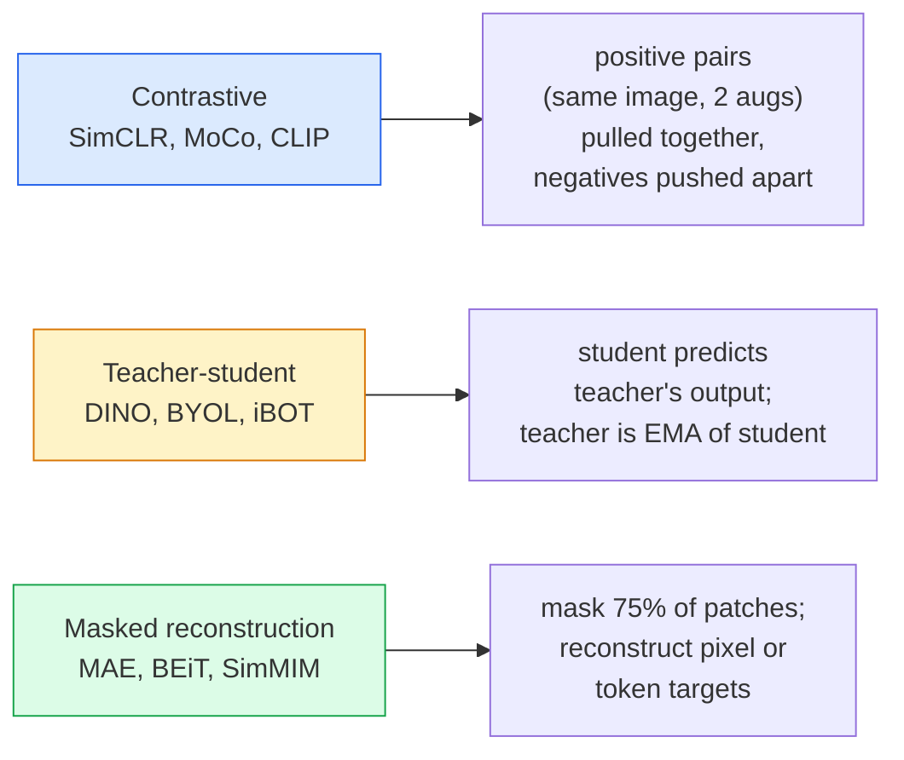

# خود نظارت بر دید  SimCLR، DINO، MAE

> برچسب ها گلو شکنی بینایی تحت نظارت هستند. آموزش های قبل از آموزش خود آنها را از بین می برد: ویژگی های بصری را از 100 میلیون تصویر بدون برچسب یاد بگیرید، به خوبی تنظیم کنید.

**Type:** Learn + Build
**Languages:** Python
**Prerequisites:** Phase 4 Lesson 04 (Image Classification), Phase 4 Lesson 14 (ViT)
**Time:** ~75 minutes

## اهداف یادگیری

- سه خانواده اصلی خود نظارت شده را ردیابی کنید  متناقض (SimCLR) ، معلم- دانش آموز (DINO) ، بازسازی ماسک (MAE)  و مشخص کنید که هر یک از آنها چه چیزی را بهینه می کند
- از ابتدا یک خسارت InfoNCE را اجرا کنید و توضیح دهید که چرا یک دسته از 512 کار می کند اما یک دسته از 32 شکست می خورد
- توضیح دهید که چرا نسبت 75 درصد پوشاندن MAE تعسفی نیست و چگونه از 15 درصد BERT برای متن متفاوت است
- استفاده از نقاط بازرسی DINOv2 یا MAE ImageNet برای بررسی خطی و بازیافت صفر شوت

## مشکل

ImageNet تحت نظارت 1.3 میلیون تصویر را با برچسب ها نشان داده است که هزینه آن حدود 10 میلیون دلار است. مجموعه داده های پزشکی و صنعتی کوچکتر و حتی گران تر برای برچسب گذاری است. هر تیم دید پرسید: آیا می توانیم از قبل از آموزش با داده های ارزان بدون برچسب استفاده کنیم؟

یادگیری خود نظارت شده پاسخ است. یک ViT مدرن خود نظارت شده که بر روی LAION یا JFT آموزش دیده است، زمانی که دقیق تر تنظیم شده است، به دقت ImageNet تحت نظارت رسیده است یا آن را از دست می دهد. همچنین بهتر به وظایف پایین تر (دراکشن، بخش بندی، عمق) نسبت به آموزش پیش از نظارت می رسد. DINOv2 (Meta، 2023) و MAE (Meta، 2022) معیارهای فعلی تولید برای ویژگی های دید قابل انتقال هستند.

تغییر مفهومی این است که وظیفه بهانه  کاری که مدل برای انجام آن آموزش دیده است  مجبور نیست وظیفه پایین باشد. مهم اينه که اين مدل مجبور به ياد گرفتن ویژگی هاي مفيد بشه رنگ تصاویر خاکستری را پیش بینی کنید، تصاویر را به صورت چرخش بزنید و از مدل بخواهید چرخش را طبقه بندی کند، پیچ های ماسک را بپوشید و آنها را بازسازی کنید  همه کار کرده اند. سه روش برای مقیاس یادگیری متناقض، تخمک گذاری معلم-معلم و بازسازی پوشیده است.

## مفهوم

### سه خانواده



### یادگیری متناقض (SimCLR)

یک تصویر را بگیرید، دو افزونه تصادفی را اعمال کنید، دو دیدگاه را بدست آورید. هر دو را از طریق یک کدر و یک سر پروژکتور تغذیه کنید. از دست دادن چیزی که می گوید "این دو پیوند باید نزدیک باشد" و "این پیوند باید از هر پیوند تصویر دیگر در دسته فاصله داشته باشد، به حداقل برسید. "

```
Loss for positive pair (z_i, z_j) among 2N views per batch:

   L_ij = -log( exp(sim(z_i, z_j) / tau) / sum_k in batch \ {i} exp(sim(z_i, z_k) / tau) )

sim = cosine similarity
tau = temperature (0.1 standard)
```

این ضرر InfoNCE است. این نیاز به بسیاری از منفی ها برای هر مثبت دارد، بنابراین اندازه دسته مهم است. SimCLR نیاز به 512-8192. MoCo یک ردیف حرکت از دسته های گذشته را برای جدا کردن تعداد منفی از اندازه دسته معرفی کرد.

### معلم- دانش آموز (DINO)

دو شبکه با معماری مشابه: دانش آموز و معلم. معلم یک متوسط متحرک نمایی (EMA) از وزنه های دانش آموز است. هر دو دیدگاه های افزوده را از تصویر می بینند. محصول دانش آموز به طور کامل با منفی های صریح معلم مطابقت دارد.

```
loss = CE( student_output(view_1),  teacher_output(view_2) )
     + CE( student_output(view_2),  teacher_output(view_1) )

teacher_weights = m * teacher_weights + (1 - m) * student_weights   (m ≈ 0.996)
```

چرا برای "پیش بینی ثابت" سقوط نمی کند: تولید معلم متمرکز است (به طور متوسط در هر ابعاد) و تیز شده است (به عنوان تقسیم با دمای کوچک). مرکز کردن مانع از تسلط یک ابعاد می شود؛ تیز کردن مانع از سقوط تولید به یکسره می شود.

DINO چیزی است که DINOv2 در 142 میلیون تصویر کوری شده مقیاس می کند. ویژگی های حاصل از آن SOTA فعلی برای بازیافت بصری صفر شاٹ و پیش بینی کثیف است.

### بازسازی پوشیده (MAE)

75٪ پیچ های ورودی ViT را ماسک کنید. تنها 25٪ قابل مشاهده را از طریق کدگر عبور دهید. یک کدگر کوچک از طریق پکیج های ماسک شده، پکسل های پیچ های ماسک شده را بازسازی می کند.

```
Encoder:  visible 25% of patches -> features
Decoder:  features + mask tokens at masked positions -> reconstructed pixels
Loss:     MSE between reconstructed and original pixels on masked patches only
```

انتخاب های اصلی طراحی که باعث می شود MAE کار کند:

- **75% mask ratio** بالا. این کدگر را مجبور می کند تا ویژگی های معنوی را یاد بگیرد؛ بازسازی 25٪ تقریبا معمولی خواهد بود (پیکسل های همسایه به حدی مرتبط هستند که یک CNN می تواند آن را پیچ کند).
- **Asymmetric encoder/decoder** کدگر بزرگ ViT فقط پیچ های قابل مشاهده را می بیند؛ یک کدگر کوچک (8 لایه، 512 ابعاد) بازسازی را اداره می کند. 3 برابر سریع تر از BEiT ساده است.
- **Pixel-space reconstruction target** ساده تر از هدف مشخص شده BEiT و بهتر در ViT کار می کند.

بعد از تمرین، کدگر را کنار بگذارید. کدگر، استخراج کننده ویژگی است.

### چرا 75 درصد و نه 15 درصد

BERT 15 درصد توکن ها رو پوشيده ميکنه MAE 75 درصد رو پوشيده ميکنه تفاوت در چگالي اطلاعات هست

- زبان طبیعی در هر توکن انتروپی بالایی دارد. پیش بینی 15٪ از توکن ها هنوز دشوار است زیرا هر موقعیت پوشیده دارای تکمیل های قابل قبول است.
- پیچ های تصویر دارای انترپی پایین هستند  یک محله ناشناس اغلب پکسل های پیچ ناشناس را تقریباً دقیقاً تعیین می کند. برای پیش بینی نیاز به درک معنوی دارد، شما باید به طور پرخیم ماسک بزنید.

75% به اندازه کافی بالا است که استخراج فضایی ساده نمی تواند این کار را حل کند؛ کدگر باید محتوای تصویر را نشان دهد.

### ارزیابی از سوی یک آزمایش خطی

پس از آموزش پیش از خود نظارت، ارزیابی استاندارد یک **linear probe**: کدگر را منجمد کنید، یک طبقه بندی کننده خطی را روی برچسب های ImageNet تمرین کنید.

- SimCLR ResNet-50: ~ 71٪ (2020)
- DINO ViT-S/16: ~77% (2021)
- MAE ViT-L/16: ~76% (2022)
- DINOv2 ViT-g/14: ~ 86٪ (2023)

یک ساند خطی یک اندازه گیری خالص از کیفیت ویژگی است؛ تنظیم دقیق معمولاً 2-5 نقطه اضافه می کند اما همچنین در اثر آموزش مجدد سر مخلوط می شود.

```figure
data-augmentation
```

## آن را بسازید

### مرحله ی ۱: خط لوله افزایشی دو منظره

```python
import torch
import torchvision.transforms as T

two_view_train = lambda: T.Compose([
    T.RandomResizedCrop(96, scale=(0.2, 1.0)),
    T.RandomHorizontalFlip(),
    T.ColorJitter(0.4, 0.4, 0.4, 0.1),
    T.RandomGrayscale(p=0.2),
    T.ToTensor(),
])


class TwoViewDataset(torch.utils.data.Dataset):
    def __init__(self, base):
        self.base = base
        self.aug = two_view_train()

    def __len__(self):
        return len(self.base)

    def __getitem__(self, i):
        img, _ = self.base[i]
        v1 = self.aug(img)
        v2 = self.aug(img)
        return v1, v2
```

هرکدوم__getitem__دو دیدگاه افزوده از همان تصویر را باز می آورد؛ برچسب ها لازم نیست.

### مرحله دوم: از دست دادن InfoNCE

```python
import torch.nn.functional as F

def info_nce(z1, z2, tau=0.1):
    """
    z1, z2: (N, D) L2-normalised embeddings of paired views
    """
    N, D = z1.shape
    z = torch.cat([z1, z2], dim=0)  # (2N, D)
    sim = z @ z.T / tau              # (2N, 2N)

    mask = torch.eye(2 * N, dtype=torch.bool, device=z.device)
    sim = sim.masked_fill(mask, float("-inf"))

    targets = torch.cat([torch.arange(N, 2 * N), torch.arange(0, N)]).to(z.device)
    return F.cross_entropy(sim, targets)
```

قبل از تماس، L2 ها را به حالت عادی کنید. `tau=0.1`این مقدار کم تر باعث می شود که خسارت در آن شدیدتر باشد و نیاز به منفی های بیشتری دارد.

### مرحله سوم: بررسی عقل InfoNCE

```python
z1 = F.normalize(torch.randn(16, 32), dim=-1)
z2 = z1.clone()
loss_same = info_nce(z1, z2, tau=0.1).item()
z2_random = F.normalize(torch.randn(16, 32), dim=-1)
loss_random = info_nce(z1, z2_random, tau=0.1).item()
print(f"InfoNCE with identical pairs:  {loss_same:.3f}")
print(f"InfoNCE with random pairs:     {loss_random:.3f}")
```

جفت های یکسان باید از دست دادن کم (برای یک دسته بزرگ و دمای سرد نزدیک به 0) را ارائه دهند. جفت های تصادفی باید log(2N-1) = ~log(31) = ~3.4 با یک دسته 16 جفت را ارائه دهند.

### مرحله 4: ماسک گذاری به سبک MAE

```python
def random_mask_indices(num_patches, mask_ratio=0.75, seed=0):
    g = torch.Generator().manual_seed(seed)
    n_keep = int(num_patches * (1 - mask_ratio))
    perm = torch.randperm(num_patches, generator=g)
    visible = perm[:n_keep]
    masked = perm[n_keep:]
    return visible.sort().values, masked.sort().values


num_patches = 196
visible, masked = random_mask_indices(num_patches, mask_ratio=0.75)
print(f"visible: {len(visible)} / {num_patches}")
print(f"masked:  {len(masked)} / {num_patches}")
```

ساده، سریع و تعیین کننده برای یک دانه داده شده. پیاده سازی های واقعی MAE این را دسته بندی می کنند و ماسک های هر نمونه را نگه می دارند.

## ازش استفاده کن

DINOv2 استاندارد تولید در سال 2026 است:

```python
import torch
from transformers import AutoImageProcessor, AutoModel

processor = AutoImageProcessor.from_pretrained("facebook/dinov2-base")
model = AutoModel.from_pretrained("facebook/dinov2-base")
model.eval()

# Per-image embeddings for zero-shot retrieval
with torch.no_grad():
    inputs = processor(images=[pil_image], return_tensors="pt")
    outputs = model(**inputs)
    embedding = outputs.last_hidden_state[:, 0]  # CLS token
```

این برنامه در حال حاضر به عنوان یک خط پشتی بازیافت تصویر مدرن، یک خط خط خط خط خط خط خط خط خط خط خط خط خط خط خط خط خط خط خط خط خط خط خط خط خط خط خط خط خط خط خط خط خط خط خط خط خط خط خط خط خط خط خط خط خط خط خط خط خط خط خط خط خط خط خط خط خط خط خط خط خط خط خط خط خط خط خط خط خط خط خط خط خط خط خط خط خط خط خط خط خط خط خط خط خط خط خط خط خط خط خط خط خط خط خط خط خط خط خط خط خط خط خط خط خط خط خط خط خط خط خط خط خط خط خط خط خط خط خط خط خط خط خط خط خط خط خط خط خط خط خط خط خط خط خط خط خط خط خط خط خط خط خط خط خط خط خط خط خط خط خط خط خط خط خط خط خط خط خط خط خط خط خط خط خط خط خط خط خط خط خط خط خط خط خط خط خط خط خط خط خط خط خط خط خط خط خط خط خط خط خط خط خط خط خط خط خط خط خط خط خط خط خط خط خط خط خط خط خط خط خط خط خط خط خط خط خط خط خط خط خط خط خط خط خط خط خط خط خط خط خط خط خط خط خط خط خط خط خط خط خط خط خط خط خط خط خط خط خط خط خط خط خط خط خط خط خط خط خط خط خط خط خط خط خط خط خط خط خط خط خط خط خط خط خط خط خط خط خط خط خط خط خط خط خط خط خط خط خط خط خط خط خط خط خط خط خط خط خط خط خط خط خط خط خط خط خط خط خط خط خط خط خط خط خط خط خط خط خط خط خط خط خط خط خط خط خط خط خط خط خط خط خط خط خط خط خط خط خط خط خط خط خط خط خط خط خط خط خط خط خط خط خط خط خط خط خط خط خط خط خط خط خط خط خط خط خط خط خط خط خط خط خط خط خط خط خط خط خط خط خط خط خط خط خط خط خط خط خط خط خط خط خط خط خط خط خط خط خط خط خط خط خط خط خط خط خط خط خط خط خط خط خط خط خط خط خط خط خط خط خط خط خط خط خط خط خط خط خط خط خط خط خط خط خط خط خط خط خط خط خط خط خط خط خط خط خط خط خط خط خط خط خط خط خط خط خط خط خط خط خط خط خط خط خط خط خط خط خط خط خط خط خط خط خط خط خط خط خط خط خط خط خط خط خط خط خط خط خط خط خط خط خط

برای ادغام متن تصویر، SigLIP یا OpenCLIP معادل است؛ برای تنظیمات دقیق سبک MAE، `timm`همه پستهاي بازرسي MAE رو به ارمغان ميذاره

## -باده

این درس نتیجه می دهد:

- `outputs/prompt-ssl-pretraining-picker.md` یک پرامپت که SimCLR / MAE / DINOv2 را به دلیل اندازه مجموعه داده ها، محاسبه و کار زیرکاه را انتخاب می کند.
- `outputs/skill-linear-probe-runner.md` یک مهارت که ارزیابی لاینری-سوند برای هر کدگر منجمد + مجموعه داده های برچسب شده را می نویسد.

## تمرینات

1. **(Easy)**بررسی کنید که وقتی دمای هر یک از اینفونو اینسئو برای هر یک از این ادغام ها کاهش می یابد و وقتی دمای هر یک از این ادغام ها را کاهش می دهد، افزایش می یابد.`tau in [0.05, 0.1, 0.2, 0.5]`مقابل خسارت
2. **(Medium)**یک بازنده مرکز سبک DINO را اجرا کنید. نشان دهید که بدون تمرکز، دانش آموز در عرض چند دوره به یک ویکتور ثابت سقوط می کند.
3. **(Hard)**آموزش MAE در CIFAR-100 با استفاده از TinyUNet از درس 10 به عنوان ستون فقرات. دقت صوتی خطی را در دوره های 10, 50 و 200 گزارش دهید. نشان دهید که یک صوتی خطی آموزش داده شده توسط MAE از یک صوتی خطی تحت نظارت از نو در همان زیر مجموعه 1000 تصویر غلبه می کند.

## اصطلاحات کلیدی

| Term | What people say | What it actually means |
|------|----------------|----------------------|
| Self-supervised | "Label-free" | A pretext task that produces useful representations from unlabelled data |
| Pretext task | "The fake task" | The objective used during SSL (reconstruct patches, match views); discarded after pretraining |
| Linear probe | "Frozen encoder + linear head" | Standard SSL evaluation: train only a linear classifier on top of frozen features |
| InfoNCE | "Contrastive loss" | softmax over cosine similarities; positive pair is the target class, all others are negatives |
| EMA teacher | "Moving-average teacher" | Teacher whose weights are an exponential moving average of the student's; used by BYOL, MoCo, DINO |
| Mask ratio | "% of patches hidden" | Fraction of patches masked during MAE; 75% for vision, 15% for text |
| Representation collapse | "Constant output" | SSL failure where the encoder outputs a constant vector for all inputs; prevented by centring, sharpening, or negatives |
| DINOv2 | "Production SSL backbone" | Meta's 2023 self-supervised ViT; strongest general-purpose image features in 2026 |

## خواندن بیشتر

- [SimCLR (Chen et al., 2020)](https://arxiv.org/abs/2002.05709) مرجع یادگیری متناقض
- [DINO (Caron et al., 2021)](https://arxiv.org/abs/2104.14294) معلم- دانش آموز با حرکت، تمرکز، تیز شدن
- [MAE (He et al., 2022)](https://arxiv.org/abs/2111.06377) تعویضات خودکار مخفي برای VIT
- [DINOv2 (Oquab et al., 2023)](https://arxiv.org/abs/2304.07193) مقیاس گذاری ViT خود نظارت به ویژگی های تولید
