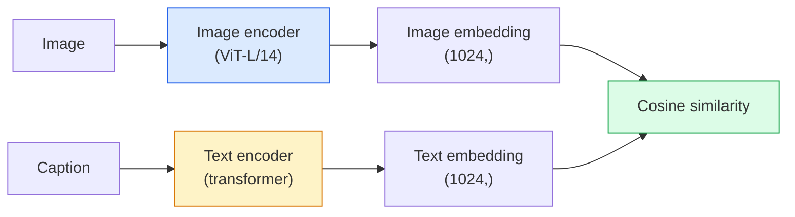

# چشم انداز لغت باز  CLIP

> یک کدگر تصویر و یک کدگر متن را با هم آموزش دهید تا جفت های تطابق (تصاویر، عنوان) در یک نقطه مشترک در یک فضای مشترک قرار بگیرند. این کل ترفند است.

**Type:** Build + Use
**Languages:** Python
**Prerequisites:** Phase 4 Lesson 14 (ViT), Phase 4 Lesson 17 (Self-Supervised)
**Time:** ~45 minutes

## اهداف یادگیری

- معماری دو برج CLIP و هدف آموزش متناقض را توضیح دهید
- استفاده از CLIP (یا SigLIP) پیش از آموزش برای طبقه بندی صفر شوت بدون آموزش خاص به وظیفه
- از ابتدا طبقه بندی صفر شوت را اجرا کنید: درخواست های کلاس کد، شبیه سازی کوسین محاسبه کنید، argmax را بگیرید
- مدل های دید CLIP، SigLIP، OpenCLIP و LLaVA/LLaMA را متمایز کنید  هر کدام برای سال 2026 چه هستند

## مشکل

دسته بندی کننده های سنتی لغات بسته هستند: یک مدل ImageNet با 1000 کلاس فقط می تواند 1000 برچسب را پیش بینی کند. هر دسته جدید نیاز به داده های برچسب شده و یک سر بازتدبیک دارد.

CLIP (Radford et al., OpenAI 2021) نشان داد که آموزش در 400M (تصاویر، عنوان) جفت از وب تولید می کند یک مدل که می تواند به هر مجموعه ای از دسته بندی ها در نتیجه گیری طبقه بندی شود، که به طور خالص در زبان طبیعی توصیف شده است. شما با نوشتن یک جمله به آن یک کلاس جدید می دهید.

این قابلیت  انتقال صفر شوت  به همین دلیل است که هر سیستم دید مدرن با یک نقطه بازرسی خانواده CLIP شروع می شود. تشخیص (Grounding DINO، OWL-ViT), بخش بندی (CLIPSeg، SAM), بازیافت، اعتدال محتوا، VLMs و تولید متن به تصویر همه بر روی ادغام های مشترک سبک CLIP ساخته شده است.

## مفهوم

### دو برج



هر دو کدگر با یک طرح خطی به همان ابعاد گنجانده شدن (512 برای CLIP-B/32 ، 1024 برای CLIP-L/14) پایان می یابند. L2-معمول سازی و شبیه سازی کوسین محاسبه کنید.

### هدف

با توجه به دسته ای از زوج های N (تصاویر، عنوان) ، یک ماتریس شباهت NxN بسازید. هر دو کدگر را تمرین کنید تا دیگاکال (دو زوج مطابقت) شباهت بالایی داشته باشد و دیگاکال های خارج از (غیر مطابقت) شباهت کمتری داشته باشند.

```
sim_matrix = image_embeddings @ text_embeddings.T / tau

loss_i2t = cross_entropy(sim_matrix,       targets=arange(N))
loss_t2i = cross_entropy(sim_matrix.T,     targets=arange(N))
loss = (loss_i2t + loss_t2i) / 2
```

هم تراز است چون هر دو تصویر به متن و متن به تصویر بازیافت باید کار کند. `tau`(در درجه حرارت) معمولا به عنوان یک پارامتر مقیاس، با ابتدایی به 0.07 یاد گرفته می شود.

### سيگلپ: خسارت بهتر

SigLIP (Zhai et al., 2023) نرمترین را با sigmoid در هر جفت جایگزین کرد:

```
loss = mean over pairs of log(1 + exp(-y_ij * sim_ij))
y_ij = +1 if matching, -1 otherwise
```

کاهش هر جفت استاندارد سازی سطح دسته ای را که CLIP نیاز دارد حذف می کند. SigLIP در اندازه های دسته کوچک بهتر و با داده های برابر مطابقت دارد یا CLIP را فراتر می برد.

### طبقه بندی صفر شات

با توجه به CLIP آموزش دیده:

1. برای هر کلاس، یک پیامک بنویسید: "یک عکس از یک کلاس".
2. تمام پیام های کلاس را با کدرس متن رمزگذاری کنید -> `T`شکل (C, d).
3. تصویر تست را رمزگذاری کنید -> `I`شکل (۱) ، (د)
4. شباهت = `I @ T.T`شکل (۱)
5. Argmax -> کلاس پیش بینی شده

مسائل مهندسی سریع. OpenAI 80 قالب سریع برای ImageNet منتشر کرد ("تصاویر یک {}"، "تصاویر مبهم یک {}"، "سکیش یک {}"، ...). متوسط ورودی همه قالب ها در هر کلاس برای دقت اضافی 1-3٪ top-1.

### در سال 2026 از مدل های سبک CLIP استفاده می شود

- **Zero-shot classification** استفاده مستقیم
- **Image retrieval** تمام تصاویر را یک بار کدگذاری کنید، سوال را در نتیجه گیری قرار دهید.
- **Text-conditioned detection** زمین زدن DINO، OWL-ViT یک برج متن CLIP را در اطراف یک آشکارساز بسته می کند.
- **Text-conditioned segmentation** CLIPSeg؛ SAM از ورودی های پیامک متن از طریق CLIP استفاده می کند.
- **VLMs** LLaVA، Qwen-VL، InternVL یک کدور بینایی CLIP- خانواده را به یک LLM متصل می کنند.
- **Text-to-image gen** انتشار ثابت، شرط DALL-E 3 در ورق بندی متن CLIP.

وقتی فضای ادغام مشترک دارید، هر کاری که در زبان + دید انجام می شود به یک محاسبات فاصله تبدیل می شود.

```figure
clip-contrastive
```

## آن را بسازید

### مرحله ی اول: یک مدل کوچک دو برج

CLIP واقعی ترانسفارمر ViT + است. برای این درس برج ها MLP های کوچک بر روی ویژگی های پیش از استخراج هستند بنابراین سیگنال آموزش در CPU قابل مشاهده است.

```python
import torch
import torch.nn as nn
import torch.nn.functional as F


class TwoTower(nn.Module):
    def __init__(self, img_in=128, txt_in=64, emb=64):
        super().__init__()
        self.image_proj = nn.Sequential(nn.Linear(img_in, 128), nn.ReLU(), nn.Linear(128, emb))
        self.text_proj = nn.Sequential(nn.Linear(txt_in, 128), nn.ReLU(), nn.Linear(128, emb))
        self.logit_scale = nn.Parameter(torch.ones([]) * 2.6592)  # ln(1/0.07)

    def forward(self, img_feats, txt_feats):
        i = F.normalize(self.image_proj(img_feats), dim=-1)
        t = F.normalize(self.text_proj(txt_feats), dim=-1)
        return i, t, self.logit_scale.exp()
```

دو پروژکتور، خروجی مشترک، درجه حرارت آموخته، شکل مشابه API واقعی CLIP

### مرحله دوم: از دست دادن متناقض

```python
def clip_loss(image_emb, text_emb, logit_scale):
    N = image_emb.size(0)
    sim = logit_scale * image_emb @ text_emb.T
    targets = torch.arange(N, device=sim.device)
    l_i = F.cross_entropy(sim, targets)
    l_t = F.cross_entropy(sim.T, targets)
    return (l_i + l_t) / 2
```

متقابل. مقیاس Logit_scale بالاتر = نرمترین نرم = مطمئن تر اما خطر عدم ثبات.

### مرحله 3: طبقه بندی کننده صفر شات

```python
@torch.no_grad()
def zero_shot_classify(model, image_feats, class_text_feats, class_names):
    """
    image_feats:      (N, img_in)
    class_text_feats: (C, txt_in)   one averaged embedding per class
    """
    i = F.normalize(model.image_proj(image_feats), dim=-1)
    t = F.normalize(model.text_proj(class_text_feats), dim=-1)
    sim = i @ t.T
    pred = sim.argmax(dim=-1)
    return [class_names[p] for p in pred.tolist()]
```

این روش دقیق صفر شوت است که با یک نقطه کنترل تولید CLIP استفاده می شود.

### مرحله چهارم: بررسی سلامت روان

```python
torch.manual_seed(0)
model = TwoTower()

img = torch.randn(8, 128)
txt = torch.randn(8, 64)
i, t, scale = model(img, txt)
loss = clip_loss(i, t, scale)
print(f"batch size: {i.size(0)}   loss: {loss.item():.3f}")
```

خسارت بايد نزديک باشه`log(N) = log(8) = 2.08`برای یک مدل تصادفی آغاز شده  هدف متقابل متقابل آنترپی زمانی که هنوز ساختار مورد مطالعه قرار نگرفته است.

## ازش استفاده کن

OpenCLIP به عنوان پیش فرض جامعه در سال 2026 است:

```python
import open_clip
import torch
from PIL import Image

model, _, preprocess = open_clip.create_model_and_transforms("ViT-B-32", pretrained="laion2b_s34b_b79k")
tokenizer = open_clip.get_tokenizer("ViT-B-32")

image = preprocess(Image.open("dog.jpg")).unsqueeze(0)
text = tokenizer(["a photo of a dog", "a photo of a cat", "a photo of a car"])

with torch.no_grad():
    image_features = model.encode_image(image)
    text_features = model.encode_text(text)
    image_features = image_features / image_features.norm(dim=-1, keepdim=True)
    text_features = text_features / text_features.norm(dim=-1, keepdim=True)
    probs = (100.0 * image_features @ text_features.T).softmax(dim=-1)

print(probs)
```

سیگلپ جدیدتر است، در مقیاس های کوچک بهتر آموزش می دهد و برای کارهای جدید ترجیح داده می شود: `google/siglip-base-patch16-224`. هر دو سفينه رو ببند

## -باده

این درس نتیجه می دهد:

- `outputs/prompt-zero-shot-class-picker.md` یک پیامک که قالب های کلاس را برای CLIP صفر شوت طراحی می کند با توجه به یک لیست کلاس ها و یک دامنه.
- `outputs/skill-image-text-retriever.md` یک مهارت که یک شاخص ادغام تصویر را با هر نقطه کنترل CLIP ایجاد می کند، از پرسش به متن و پرسش به تصویر پشتیبانی می کند.

## تمرینات

1. **(Easy)**از یک OpenCLIP ViT-B/32 پیش از آموزش استفاده کنید و با مجموعه 80 قالب فوری طبقه بندی صفر را در CIFAR-10 انجام دهید. دقت بالای 1 را گزارش کنید؛ باید حدود 85-90٪ باشد.
2. **(Medium)**مقایسه قالب واحد ("تصاویر یک {}") با ۸۰ قالب متوسط در همان کار CIFAR-10. شکاف را اندازه گیری کنید و توضیح دهید که چرا قالب ها کمک می کنند.
3. **(Hard)**ایجاد یک شاخص بازیافت تصویر صفر شوت: ۱۰۰۰ تصویر را با CLIP گنجانید، یک شاخص FAISS ایجاد کنید، یک سوال با یک توصیف زبان طبیعی ایجاد کنید. گزارش بازیافت یادآوری@۵ برای ۲۰ سوال بازیافت شده که به دست می نویسید.

## اصطلاحات کلیدی

| Term | What people say | What it actually means |
|------|----------------|----------------------|
| Two-tower | "Dual encoder" | Separate image and text encoders ending in a shared-dim projection head |
| Zero-shot | "No task-specific training" | Classify into classes described only by text at inference; no labels touched |
| Temperature / logit_scale | "tau" | Learned scalar that scales the similarity matrix before softmax |
| Prompt template | "A photo of a {}" | Natural-language wrapper around class names; averaging many templates boosts zero-shot accuracy |
| CLIP | "Image+text model" | The 2021 OpenAI model; vocabulary of the field in 2026 |
| SigLIP | "Sigmoid CLIP" | Swaps softmax for per-pair sigmoid; trains better at small batches |
| OpenCLIP | "Open reproduction" | Community-trained CLIP variants on LAION; production default for open-source pipelines |
| VLM | "Vision-language model" | A CLIP-family encoder plus an LLM, trained to answer questions about images |

## خواندن بیشتر

- [CLIP: Learning Transferable Visual Models from Natural Language Supervision (Radford et al., 2021)](https://arxiv.org/abs/2103.00020)
- [SigLIP: Sigmoid Loss for Language-Image Pre-Training (Zhai et al., 2023)](https://arxiv.org/abs/2303.15343)
- [OpenCLIP](https://github.com/mlfoundations/open_clip) پایگاه کد جامعه
- [Oquab et al. (2023). DINOv2: Learning Robust Visual Features without Supervision](https://arxiv.org/abs/2304.07193) کاغذ با معیار ویژگی در مقایسه با مدل های سبک CLIP و مدل های سبک MAE
