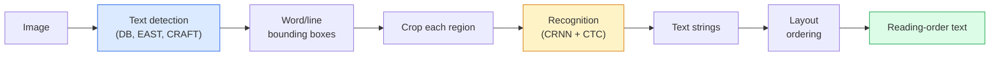

# درک OCR و اسناد

> OCR یک خط لوله سه مرحله ای است  شناسایی جعبه های متن، شناسایی شخصیت ها و سپس آنها را قرار دهید. هر سیستم OCR مدرن این مراحل را تنظیم مجدد یا ادغام می کند.

**Type:** Learn + Use
**Languages:** Python
**Prerequisites:** Phase 4 Lesson 06 (Detection), Phase 7 Lesson 02 (Self-Attention)
**Time:** ~45 minutes

## اهداف یادگیری

- ردیابی خط لوله OCR کلاسیک (دیتکت -> تشخیص -> طرح) و جایگزین های مدرن از انتهای تا انتهای (Donut، Qwen-VL-OCR)
- پیاده سازی CTC (تصفیه زمانی اتصال) برای آموزش OCR به ترتیب
- استفاده از PaddleOCR یا EasyOCR برای تجزیه و تحلیل اسناد تولید بدون آموزش
- تشخیص OCR، تجزیه و تحلیل طرح و درک اسناد  و انتخاب ابزار مناسب برای هر کار

## مشکل

تصاویر پر از متن در همه جا وجود دارد: رسید ها، فاکتورها، شناسه ها، کتاب های اسکن شده، فرم ها، صفحه سفید ها، نشانه ها، اسکرین شاټ ها. استخراج داده های ساختار یافته از آنها نه تنها شخصیت ها، بلکه "این کل مقدار" یکی از مهمترین مشکلات بینایی کاربردی است.

این زمینه به سه سطح مهارت تقسیم می شود:

1. **OCR proper**: پیکسل ها را به متن تبدیل کنید.
2. **Layout parsing**: تولید OCR گروه به مناطق (ناوی، بدن، جدول، سر)
3. **Document understanding**: از طرح خارج کردن زمینه های ساختاری ("فاکتور_کل = $42.50")

هر لایه رویکردهای کلاسیک و مدرن دارد و فاصله بین "من متن از یک تصویر می خواهم" و "من کل مقدار از این رسید را می خواهم" بزرگتر از آنچه اکثر تیم ها می دانند است.

## مفهوم

### خط لوله کلاسیک



- **Text detection**هر خط یا هر کلمه چهار قطبی را تولید می کند.
- **Recognition**هر منطقه را به ارتفاع ثابت می کند، یک CNN + BiLSTM + CTC را اجرا می کند تا یک دنباله شخصیت تولید کند.
- **Layout**ترتیب خواندن را بازسازی می کند (از بالا تا پایین، چپ تا راست برای لاتین؛ متفاوت برای عربی، ژاپنی).

### CTC در یک پاراگراف

تشخیص OCR یک ردیف طول متغیر را از یک نقشه ویژگی طول ثابت تولید می کند. CTC (Graves و همکاران، 2006) به شما اجازه می دهد این را بدون خط بندی سطح شخصیت آموزش دهید. مدل در هر مرحله زمانی توزیع (فصله + خالی) را تولید می کند. از دست دادن CTC بر روی تمام خط بندی ها که پس از ترکیب تکرار ها و حذف خالی به متن هدف کاهش می یابد، حاشیه می کند.

```
raw output: "h h h _ _ e e l l _ l l o _ _"
after merge repeats and remove blanks: "hello"
```

CTC دلیل کار CRNN در سال 2015 است و هنوز هم بیشتر مدل های تولید OCR را در سال 2026 آموزش می دهد.

### مدل های مدرن از انت به انت

- **Donut**(کیم و همکاران، 2022)  یک کدر ViT + یک کدر متن؛ یک تصویر را می خواند و مستقیما JSON را ارسال می کند. هیچ آشکارساز متن، هیچ ماژول طرح نیست.
- **TrOCR** VIT + ترانسفورماتور برای OCR سطح خط.
- **Qwen-VL-OCR / InternVL** مدل های کامل زبان بینایی برای وظایف OCR تنظیم شده؛ بهترین دقت در سال 2026 در اسناد پیچیده.
- **PaddleOCR** لوله DB + CRNN کلاسیک در یک بسته تولید بالغ؛ هنوز هم کار با منبع باز.

مدل های آخر به آخر نیاز به داده ها و محاسبه بیشتر دارند اما از جمع آوری خطای خطای چند مرحله ای اجتناب می کنند.

### تجزیه طرح

برای اسناد ساختاری، یک آشکارگر طرح (LayoutLMv3، DocLayNet) را اجرا کنید که هر منطقه را برچسب می دهد: عنوان، پاراگراف، شکل، جدول، نوتی زیر. ترتیب خواندن سپس "در طی مناطق به ترتیب طرح، کنکاتن" می شود.

برای فرم ها استفاده کنید **Key-Value extraction**مدل ها (دونا برای اسناد غنی از بصری، LayoutLMv3 برای اسکن ساده) آنها تصویر + متن شناسایی شده + موقعیت ها را می گیرند و زوج های کلیدی ساختاری را پیش بینی می کنند.

### متریک ارزیابی

- **Character Error Rate (CER)** فاصله لیونشتین / طول مرجع. پایین تر بهتر است. هدف تولید: < 2٪ در اسکن های تمیز.
- **Word Error Rate (WER)** در سطح کلمه هم همینطور
- **F1 on structured fields** برای وظایف کلیدی ارزش`{invoice_total: 42.50}`درست به نظر مياد
- **Edit distance on JSON** برای تجزیه و تحلیل اسناد از پایان به پایان؛ کاغذ Donut فاصله ویرایش درختان عادی را معرفی کرد.

```figure
cv3-ctc-collapse
```

## آن را بسازید

### مرحله اول: از دست دادن CTC + کدگر طمع

```python
import torch
import torch.nn as nn
import torch.nn.functional as F


def ctc_loss(log_probs, targets, input_lengths, target_lengths, blank=0):
    """
    log_probs:      (T, N, C) log-softmax over vocab including blank at index 0
    targets:        (N, S) int targets (no blanks)
    input_lengths:  (N,) per-sample time steps used
    target_lengths: (N,) per-sample target length
    """
    return F.ctc_loss(log_probs, targets, input_lengths, target_lengths,
                      blank=blank, reduction="mean", zero_infinity=True)


def greedy_ctc_decode(log_probs, blank=0):
    """
    log_probs: (T, N, C) log-softmax
    returns: list of index sequences (blanks removed, repeats merged)
    """
    preds = log_probs.argmax(dim=-1).transpose(0, 1).cpu().tolist()
    out = []
    for seq in preds:
        decoded = []
        prev = None
        for idx in seq:
            if idx != prev and idx != blank:
                decoded.append(idx)
            prev = idx
        out.append(decoded)
    return out
```

`F.ctc_loss`استفاده از اجرای کارآمد CuDNN در صورت وجود. کدگر طمع آمیز ساده تر از جستجوی شعاع و معمولا در حدود 1٪ CER از آن است.

### مرحله دوم: شناسه کوچک CRNN

حداقل CNN + BiLSTM برای OCR خط

```python
class TinyCRNN(nn.Module):
    def __init__(self, vocab_size=40, hidden=128, feat=32):
        super().__init__()
        self.cnn = nn.Sequential(
            nn.Conv2d(1, feat, 3, 1, 1), nn.BatchNorm2d(feat), nn.ReLU(inplace=True),
            nn.MaxPool2d(2),
            nn.Conv2d(feat, feat * 2, 3, 1, 1), nn.BatchNorm2d(feat * 2), nn.ReLU(inplace=True),
            nn.MaxPool2d(2),
            nn.Conv2d(feat * 2, feat * 4, 3, 1, 1), nn.BatchNorm2d(feat * 4), nn.ReLU(inplace=True),
            nn.MaxPool2d((2, 1)),
            nn.Conv2d(feat * 4, feat * 4, 3, 1, 1), nn.BatchNorm2d(feat * 4), nn.ReLU(inplace=True),
            nn.MaxPool2d((2, 1)),
        )
        self.rnn = nn.LSTM(feat * 4, hidden, bidirectional=True, batch_first=True)
        self.head = nn.Linear(hidden * 2, vocab_size)

    def forward(self, x):
        # x: (N, 1, H, W)
        f = self.cnn(x)                # (N, C, H', W')
        f = f.mean(dim=2).transpose(1, 2)  # (N, W', C)
        h, _ = self.rnn(f)
        return F.log_softmax(self.head(h).transpose(0, 1), dim=-1)  # (W', N, vocab)
```

ورودی ارتفاع ثابت ( CNN حداکثر ارتفاع را به 1 می رساند). عرض ابعاد زمانی برای CTC است.

### مرحله سوم: OCR مصنوعی

برای آزمایش دود از انتها تا انتها، رشته های انگشت سیاه به سفید تولید کنید.

```python
import numpy as np

def synthetic_line(text, height=32, char_width=16):
    W = char_width * len(text)
    img = np.ones((height, W), dtype=np.float32)
    for i, c in enumerate(text):
        x = i * char_width
        shade = 0.0 if c.isalnum() else 0.5
        img[6:height - 6, x + 2:x + char_width - 2] = shade
    return img


def build_batch(strings, vocab):
    H = 32
    W = 16 * max(len(s) for s in strings)
    imgs = np.ones((len(strings), 1, H, W), dtype=np.float32)
    target_lengths = []
    targets = []
    for i, s in enumerate(strings):
        imgs[i, 0, :, :16 * len(s)] = synthetic_line(s)
        ids = [vocab.index(c) for c in s]
        targets.extend(ids)
        target_lengths.append(len(ids))
    return torch.from_numpy(imgs), torch.tensor(targets), torch.tensor(target_lengths)


vocab = ["_"] + list("0123456789abcdefghijklmnopqrstuvwxyz")
imgs, targets, lengths = build_batch(["hello", "world"], vocab)
print(f"images: {imgs.shape}   targets: {targets.shape}   lengths: {lengths.tolist()}")
```

یک مجموعه داده واقعی OCR فونت ها، صدا، چرخش، پراکنده و رنگ را اضافه می کند. لوله بالای آن یکسان است.

### مرحله چهارم: طرح آموزش

```python
model = TinyCRNN(vocab_size=len(vocab))
opt = torch.optim.Adam(model.parameters(), lr=1e-3)

for step in range(200):
    strings = ["abc" + str(step % 10)] * 4 + ["xyz" + str((step + 1) % 10)] * 4
    imgs, targets, target_lens = build_batch(strings, vocab)
    log_probs = model(imgs)  # (W', 8, vocab)
    input_lens = torch.full((8,), log_probs.size(0), dtype=torch.long)
    loss = ctc_loss(log_probs, targets, input_lens, target_lens, blank=0)
    opt.zero_grad(); loss.backward(); opt.step()
```

از دست دادن باید از ~3 به ~0.2 در 200 مرحله روی این داده های مصنوعی معمولی کاهش یابد.

## ازش استفاده کن

سه مسیر تولید:

- **PaddleOCR** بالغ، سریع، چندزبان. استفاده از یک خط: `paddleocr.PaddleOCR(lang="en").ocr(image_path)`. .
- **EasyOCR** زبان بومی پایتون، چندزبانی، ستون فقرات PyTorch
- **Tesseract** کلاسیک؛ هنوز برای اسناد اسکن شده قدیمی مفید است وقتی مدل ها در تلاش هستند.

برای تجزیه و تحلیل کامل اسناد، از Donut یا VLM استفاده کنید:

```python
from transformers import DonutProcessor, VisionEncoderDecoderModel

processor = DonutProcessor.from_pretrained("naver-clova-ix/donut-base-finetuned-cord-v2")
model = VisionEncoderDecoderModel.from_pretrained("naver-clova-ix/donut-base-finetuned-cord-v2")
```

برای رسید ها، فاکتورها و فرم هایی که ساختار تکراری دارند، Donut را خوب تنظیم کنید. برای اسناد تعسفی یا OCR با استدلال، یک VLM مانند Qwen-VL-OCR پیش فرض فعلی است.

## -باده

این درس نتیجه می دهد:

- `outputs/prompt-ocr-stack-picker.md` یک پیامک که Tesseract / PaddleOCR / Donut / VLM-OCR را به عنوان نوع، زبان و ساختار سند انتخاب می کند.
- `outputs/skill-ctc-decoder.md` مهارتی که از ابتدا کدگرهای CTC طمع آمیز و جستجوگر را از ابتدا می نویسد، از جمله استاندارد کردن طول.

## تمرینات

1. **(Easy)**"تيني سي آر ان اين" رو به صورت تصادفي در 5 عدد از رشته هاي عددي براي 500 مرحله آموزش بده
2. **(Medium)**کدگذاری طمع آمیز را با جستجوی شعاع جایگزین کنید (beam_width=5). گزارش CER delta. در کدام ورودی جستجو شعاع برنده می شود؟
3. **(Hard)**از PaddleOCR در مجموعه ای از 20 رسید، قطعات خط استخراج، و محاسبه F1 با حقیقت زمین دست نشان داده شده برای زوج های {item_name, price} استفاده کنید.

## اصطلاحات کلیدی

| Term | What people say | What it actually means |
|------|----------------|----------------------|
| OCR | "Text from pixels" | Turning image regions into character sequences |
| CTC | "Alignment-free loss" | Loss that trains a sequence model without per-timestep labels; marginalises over alignments |
| CRNN | "Classic OCR model" | Conv feature extractor + BiLSTM + CTC; the 2015 baseline still used in production |
| Donut | "End-to-end OCR" | ViT encoder + text decoder; emits JSON directly from image |
| Layout parsing | "Find regions" | Detect and label Title/Table/Figure/Paragraph regions in a document |
| Reading order | "Text sequence" | Ordering of recognised regions into a sentence; trivial for Latin, non-trivial for mixed layouts |
| CER / WER | "Error rates" | Levenshtein distance / reference length at character or word granularity |
| VLM-OCR | "LLM that reads" | A vision-language model trained or prompted for OCR tasks; current SOTA on complex documents |

## خواندن بیشتر

- [CRNN (Shi et al., 2015)](https://arxiv.org/abs/1507.05717) معماری اصلی CNN+RNN+CTC
- [CTC (Graves et al., 2006)](https://www.cs.toronto.edu/~graves/icml_2006.pdf) کاغذ اصلی CTC؛ بسته بندی کثیف با ایده های الگوریتم
- [Donut (Kim et al., 2022)](https://arxiv.org/abs/2111.15664) تراسماتور درک اسناد بدون OCR
- [PaddleOCR](https://github.com/PaddlePaddle/PaddleOCR) سکه OCR تولید منبع باز
