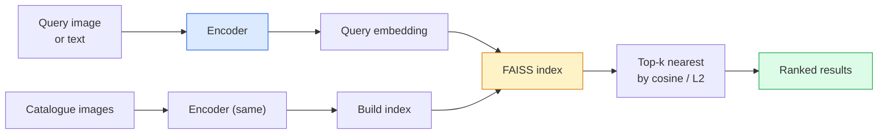

# بازیافت تصویر و یادگیری متریک

> یک سیستم بازیافت کاندیداها را با فاصله در فضای گنجانده رتبه بندی می کند. یادگیری متریک رشته شکل دادن به آن فضا است تا فاصله ها به معنای آنچه شما می خواهید باشد.

**Type:** Build
**Languages:** Python
**Prerequisites:** Phase 4 Lesson 14 (ViT), Phase 4 Lesson 18 (CLIP)
**Time:** ~45 minutes

## اهداف یادگیری

- از دست دادن یادگیری متریک سه قطعه، متقابل و مبتنی بر پروکسی توضیح دهید و یکی مناسب را برای مجموعه داده های داده ای انتخاب کنید
- به درستی استاندارد سازی L2 و شباهت کوسین را اجرا کنید و تفاوت بین بازیافت "همین ماده" و "همین کلاس" را بررسی کنید
- ایجاد یک شاخص FAISS، آن را با متن و با تصویر جستجو کنید و گزارش recall@K برای مجموعه سوالات بازده شده
- از DINOv2، CLIP و SigLIP به عنوان ستون فقرات استفاده کنید و بدانید که هر کدام برنده می شوند

## مشکل

بازیافت در همه جا در دید تولید وجود دارد: تشخیص تکراری، جستجوی عکس برعکس، جستجوی بصری ("پیدا کردن محصولات مشابه") ، شناسایی مجدد چهره، شناسایی مجدد شخص برای نظارت، مطابقت سطح نمونه برای تجارت الکترونیکی. سوال محصول همیشه یکسان است: "با توجه به این تصویر سوال، فهرست من را رتبه بندی کنید".

دو تصمیم طراحی کل سیستم را شکل می دهد. گنجانده شدن  چه مدل تولید کننده متری است. شاخص  چگونه نزدیکترین همسایه ها را در مقیاس پیدا کنیم. هر دو کالای در سال 2026 هستند (DINOv2 برای گنجانده شدن، FAISS برای شاخص) که بار را بالا می برد: بخش سخت تعریف *چه چیزی به عنوان مشابه برای برنامه شما محسوب می شود * سپس شکل دادن فضای گنجانده شدن به طوری که فاصله ها مطابقت داشته باشد.

این شکل دادن یادگیری متریک است. این یک رشته کوچک اما با نفوذ بالا است.

## مفهوم

### بازیافت در یک نگاه



### چهار خانواده از دست دادن

| Loss | Requires | Pros | Cons |
|------|----------|------|------|
| **Contrastive** | (anchor, positive) + negatives | Simple, works with any pair label | Slow to converge without many negatives |
| **Triplet** | (anchor, positive, negative) | Intuitive; direct margin control | Hard-triplet mining is expensive |
| **NT-Xent / InfoNCE** | Pairs + batch-mined negatives | Scales to large batches | Needs big batch or momentum queue |
| **Proxy-based (ProxyNCA)** | Class labels only | Fast, stable, no mining | Can overfit to proxies on small datasets |

برای اکثر موارد استفاده در تولید، با یک ستون فقرات پیش از آموزش شروع کنید و فقط اگر گنجانده های موجود در مجموعه آزمایش شما عملکرد کمتری داشته باشند، یک تنظیم دقیق یادگیری متریک اضافه کنید.

### خسارت سه برابر به طور رسمی

```
L = max(0, ||f(a) - f(p)||^2 - ||f(a) - f(n)||^2 + margin)
```

لنگر رو بکش`a`نزدیک به مثبت`p`، از منفی دورش کن`n`، با یک`margin`ساختار سه تصویر به هر ترتیب مشابهی عمومی می شود.

مسائل معدن: سه برابر آسان (`n`خيلي دور از اين`a`) سهم صفر از دست دادن؛ فقط سه تا سخت آموزش شبکه.`n`بیشتر از `p`اما در مرز) نسخه فیس نت 2016 است و هنوز بر آن تسلط دارد.

### شباهت کوسین در مقابل L2

دو متریک، دو کنوانسیون:

- **Cosine**: زاویه بین متری ها نیاز به ادغام های استاندارد L2 دارد.
- **L2**: فاصله یوکلیدی. روی ورودی های خام یا عادی عمل می کند، اما معمولا با L2 - عادی + L2 مربع همراه است.

برای اکثر شبکه های مدرن این دو برابر هستند: `||a - b||^2 = 2 - 2 cos(a, b)`چه وقت`||a|| = ||b|| = 1`.کنوانسیون را انتخاب کنید که با آموزش های شما مطابقت داشته باشد؛ مخلوط کردن آنها به طور خاموش معنی "مقبّل" را تغییر می دهد.

### یادآوری

متریک استاندارد بازیافت:

```
recall@K = fraction of queries where at least one correct match is in the top K results
```

گزارش recall@1, @5, @10 در کنار هم. یک recall@10 بالاتر از 0.95 با recall@1 پایین تر از 0.5 به این معنی است که فضای گنجانده سازی ساختار درست دارد اما رتبه بندی سر و صدا است  سعی کنید ترانه های دقیق طولانی تر یا مرحله رتبه بندی مجدد را انجام دهید.

برای تشخیص دوگانه، دقت@K مهم تر است زیرا هر مثبت نادرست یک اشتباه قابل مشاهده کاربر است. برای جستجوی بصری، یادآوری@K سیگنال محصول است.

### FAISS در یک پاراگراف

جستجوی شباهت هوش مصنوعی فیس بوک. کتابخانه عملا برای جستجوی نزدیکترین همسایه. سه گزینه شاخص:

- `IndexFlatIP`-`IndexFlatL2` نیروی خام، دقیق، هیچ آموزش ای نیست.
- `IndexIVFFlat` تقسیم به سلول های K، فقط چند سلول نزدیک را جستجو کنید.
- `IndexHNSW` مبتنی بر نمودار، سریع ترین برای بسیاری از سوالات، اندازه شاخص بزرگ.

برای 100 هزار متری که احتمالا می خواهید`IndexFlatIP`در مورد شباهت کوسین. برای 10 ميليون ميخواي`IndexIVFFlat`برای 100 میلیون+ همراه با اندازه گیری محصول (`IndexIVFPQ`)

### بازیافت در سطح نمونه در مقابل سطح دسته

دو مشکل کاملا متفاوت با همان نام:

- **Category-level** "دستگاه گربه های من را پیدا کنید". شباهت در شرایط کلاس؛ ورق های CLIP / DINOv2 در قفسه خوب کار می کنند.
- **Instance-level** "این محصول دقیق را در کاتالوگ من پیدا کنید". نیاز به تمایز دقیق بین اشیاء مشابه بصری از همان کلاس؛ گنجانده شدن های موجود در قفسه عملکرد پایین دارد؛ تنظیم دقیق با مسائل یادگیری متریک.

همیشه قبل از انتخاب مدل بپرسید که کدام یک را حل می کنید.

```figure
metric-embedding
```

## آن را بسازید

### مرحله ی اول: از دست دادن سه گانه

```python
import torch
import torch.nn.functional as F

def triplet_loss(anchor, positive, negative, margin=0.2):
    d_ap = F.pairwise_distance(anchor, positive, p=2)
    d_an = F.pairwise_distance(anchor, negative, p=2)
    return F.relu(d_ap - d_an + margin).mean()
```

يه خط، کار ميکنه روي L2 هاي استاندارد يا خام

### مرحله دوم: استخراج نیمه سخت

با توجه به دسته ای از گنجانده ها و برچسب ها، سخت ترین منفی نیمه سخت را برای هر لنگر پیدا کنید.

```python
def semi_hard_negatives(emb, labels, margin=0.2):
    dist = torch.cdist(emb, emb)
    same_class = labels[:, None] == labels[None, :]
    diff_class = ~same_class
    N = emb.size(0)

    positives = dist.clone()
    positives[~same_class] = float("-inf")
    positives.fill_diagonal_(float("-inf"))
    pos_idx = positives.argmax(dim=1)

    semi_hard = dist.clone()
    semi_hard[same_class] = float("inf")
    d_ap = dist[torch.arange(N), pos_idx].unsqueeze(1)
    semi_hard[dist <= d_ap] = float("inf")
    neg_idx = semi_hard.argmin(dim=1)

    fallback_mask = semi_hard[torch.arange(N), neg_idx] == float("inf")
    if fallback_mask.any():
        hardest = dist.clone()
        hardest[same_class] = float("inf")
        neg_idx = torch.where(fallback_mask, hardest.argmin(dim=1), neg_idx)
    return pos_idx, neg_idx
```

هر لنگر سخت ترین مثبت در کلاس و نیم سخت منفی را که بیشتر از مثبت است اما در مرز است.

### مرحله 3: یادآوری

```python
def recall_at_k(query_emb, gallery_emb, query_labels, gallery_labels, k=1):
    sim = query_emb @ gallery_emb.T
    _, top_k = sim.topk(k, dim=-1)
    matches = (gallery_labels[top_k] == query_labels[:, None]).any(dim=-1)
    return matches.float().mean().item()
```

top-k با محصول داخلی در L2 شامل شده های استاندارد برابر top-k با cosine است.

### مرحله چهارم: جمع کردن آن

```python
import torch
import torch.nn as nn
from torch.optim import Adam

class Encoder(nn.Module):
    def __init__(self, in_dim=128, emb_dim=64):
        super().__init__()
        self.net = nn.Sequential(
            nn.Linear(in_dim, 128), nn.ReLU(),
            nn.Linear(128, emb_dim),
        )

    def forward(self, x):
        return F.normalize(self.net(x), dim=-1)

torch.manual_seed(0)
num_classes = 6
protos = F.normalize(torch.randn(num_classes, 128), dim=-1)

def sample_batch(bs=32):
    labels = torch.randint(0, num_classes, (bs,))
    x = protos[labels] + 0.15 * torch.randn(bs, 128)
    return x, labels

enc = Encoder()
opt = Adam(enc.parameters(), lr=3e-3)

for step in range(200):
    x, y = sample_batch(32)
    emb = enc(x)
    pos_idx, neg_idx = semi_hard_negatives(emb, y)
    loss = triplet_loss(emb, emb[pos_idx], emb[neg_idx])
    opt.zero_grad(); loss.backward(); opt.step()
```

بعد از چند صد مرحله، خوشه های ادغام یک خوشه در هر کلاس را تشکیل می دهند.

## ازش استفاده کن

دسته های تولید در سال 2026:

- **DINOv2 + FAISS** بازیافت بصری عمومی.
- **CLIP + FAISS** وقتی که سوالات به صورت متن است.
- **Fine-tuned DINOv2 + FAISS** بازیافت در سطح نمونه، شناخت مجدد چهره، مد، تجارت الکترونیک.
- **Milvus / Weaviate / Qdrant** بسته بندی DB ویکتور در اطراف FAISS یا HNSW

برای بازیابی نمونه SOTA، دستور این است: DINOv2 ستون فقرات، اضافه کردن یک سر گنجانده، تنظیم دقیق با یک triplet یا InfoNCE از دست دادن در زوج های برچسب گذاری شده، شاخص در FAISS.

## -باده

این درس نتیجه می دهد:

- `outputs/prompt-retrieval-loss-picker.md` یک پیامک که برای یک مشکل بازیافت داده شده، تریپلتر / InfoNCE / ProxyNCA را انتخاب می کند.
- `outputs/skill-recall-at-k-runner.md` یک مهارت که یک هرنس ارزیابی تمیز برای recall@K با تقسیم قطار / وال / گالری و قرارداد داده مناسب را می نویسد.

## تمرینات

1. **(Easy)**نمونه اسباب بازی بالا را اجرا کنید. نقشه های گنجانده شده را با PCA قبل و بعد از تمرین انجام دهید تا ببینید شش خوشه شکل می گیرد.
2. **(Medium)**یک پیاده سازی از دست دادن ProxyNCA را اضافه کنید: یک "پراکسی" در هر کلاس آموخته شده، متناوبیت متناوب استاندارد در شباهت کوسین. سرعت تقارب در مقابل کاهش سه برابر در داده های اسباب بازی را مقایسه کنید.
3. **(Hard)**۱۰۰۰ تصویر تایید ImageNet را بگیرید، از طریق HuggingFace با DINOv2 به هم پیوند دهید، یک شاخص FAISS صاف بسازید و در برابر همان تصاویر که در نظر گرفته شده است (باید ۱.۰ باشد) و در برابر تقسیم بندی با برچسب های ImageNet به عنوان حقیقت اصلی گزارش کنید.

## اصطلاحات کلیدی

| Term | What people say | What it actually means |
|------|----------------|----------------------|
| Metric learning | "Shape the space" | Training an encoder so distances in its output space reflect a target similarity |
| Triplet loss | "Pull and push" | L = max(0, d(a, p) - d(a, n) + margin); the canonical metric-learning loss |
| Semi-hard mining | "Useful negatives" | Negatives further from the anchor than the positive but within margin; empirically the most informative |
| Proxy-based loss | "Class prototypes" | One learned proxy per class; cross-entropy over similarity-to-proxies; no pair mining |
| Recall@K | "Top-K hit rate" | Fraction of queries with at least one correct result in the top K |
| Instance retrieval | "Find this exact thing" | Fine-grained matching; off-the-shelf features usually underperform |
| FAISS | "The NN library" | Facebook's nearest-neighbour library; supports exact and approximate indexes |
| HNSW | "Graph index" | Hierarchical navigable small world; fast approximate NN with small memory overhead |

## خواندن بیشتر

- [FaceNet: A Unified Embedding for Face Recognition (Schroff et al., 2015)](https://arxiv.org/abs/1503.03832) ضایعات سه لایه / کاغذ های نیمه سخت استخراج
- [In Defense of the Triplet Loss for Person Re-Identification (Hermans et al., 2017)](https://arxiv.org/abs/1703.07737) راهنمای عملی برای تنظیم دقیق سه قطعه
- [FAISS documentation](https://github.com/facebookresearch/faiss/wiki) هر شاخص، هر معامله
- [SMoT: Metric Learning Taxonomy (Kim et al., 2021)](https://arxiv.org/abs/2010.06927) بررسی از خسارات مدرن و ارتباط آنها
