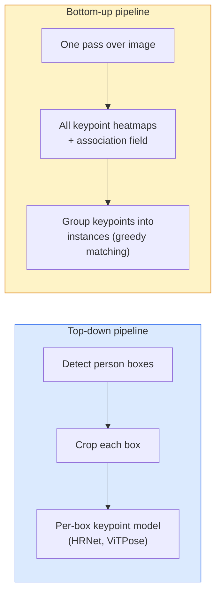

# تشخیص نقطه کلیدی و تخمین موقعیت

> يه حالت يه مجموعه از نقاط کلیدی ترتيب شده است يک کششگر نقطه کلیدی يک بازتابگر نقشه گرماست هر چيز ديگه اي حسابداري است

**Type:** Build
**Languages:** Python
**Prerequisites:** Phase 4 Lesson 06 (Detection), Phase 4 Lesson 07 (U-Net)
**Time:** ~45 minutes

## اهداف یادگیری

- تشخیص وضعیت بالا و پایین را تشخیص دهید و زمانی که هر یک از آنها استفاده می شود را بیان کنید
- نقشه های گرما بازگشت برای نقاط کلیدی K با هدف Gaussian-per-keypoint و استخراج نقاط هماهنگی کلید در نتیجه گیری
- فیلدهای ارتباط بخش (PAF) و نحوه ارتباط خطوط لوله پایین به بالا نقاط کلیدی به نمونه ها را توضیح دهید
- برای تخمین نقطه کلیدی تولید از MediaPipe Pose یا MMPose استفاده کنید و قالب خروجی آنها را درک کنید

## مشکل

وظایف کلیدی تحت نام های بسیاری پنهان می شوند: حالت انسانی (17 مفصل بدن) ، نشانه های چهره (68 یا 478 نقطه) ، دست (21 نقطه) ، حالت حیوانات، حالت اشیاء رباتیک، نشانه های آناتومی پزشکی. هر یک از آنها ساختار مشابهی را دارند: شناسایی نقاط متمایز K در یک شی و تولید نقاط هماهنگی (x، y) آنها.

تخمین اندازاً حرکت، برنامه های تناسب اندام، تجزیه و تحلیل ورزشی، کنترل حرکات، انیمیشن، آزمایش AR و گرفتاری رباتیک است. مورد 2D بالغ است؛ حالت 3D (تقدیر موقعیت های مشترک در نقاط نقاط جهان از یک دوربین) مرز تحقیقات فعلی است.

سوال مهندسی مقیاس است. یک تصویر یک نفر، یک شخص یک مشکل 20ms است. چند نفر در جمعیت با 30 fps یک مشکل متفاوت با معماری های مختلف است.

## مفهوم

### بالا به پایین مقابل پایین به بالا



- **Top-down** شناسایی مردم اول، سپس اجرای یک مدل کلید نقطه در هر محصول.
- **Bottom-up** یک گذرگاه پیش بینی همه نقاط کلیدی به علاوه یک زمینه ارتباط آنها را گروه بندی کنید. زمان ثابت بدون توجه به اندازه جمعیت.

بالا به پایین (HRNet، ViTPose) رهبر دقت است؛ پایین به بالا (OpenPose، HigherHRNet) رهبر تولید برای صحنه های پر جمعیت است.

### بازگشت نقشه گرما

بجاي عقب نشيني`(x, y)`به طور مستقیم، پیش بینی یک`H x W`نقشه گرما در هر نقطه کلید با یک نقطه گاسین در محل واقعی متمرکز شده است.

```
target[k, y, x] = exp(-((x - cx_k)^2 + (y - cy_k)^2) / (2 sigma^2))
```

در نتیجه گیری، argmax هر نقشه گرما محل کلید پیش بینی شده است.

چرا نقشه های گرما بهتر از بازگشت مستقیم کار می کنند: ساختار فضایی شبکه (نقشه ویژگی conv) به طور طبیعی با خروجی فضایی هماهنگ می شود. اهداف گوس نیز تنظیم می کنند  یک خطا کوچک محلی سازی ضرر کمی را به همراه می آورد، نه صفر.

### موقعیت مکانی زیر پیکسل

Argmax نقاط تمام را می دهد. برای دقت زیر پیکسل، با قرار دادن یک پارابولا به argmax و همسایه های آن، یا استفاده از آفسیت شناخته شده را بهبود دهید `(dx, dy) = 0.25 * (heatmap[y, x+1] - heatmap[y, x-1], ...)`جهت

### بخش زمینه های وابستگی (PAF)

راه حل OpenPose برای ارتباط پایین به بالا. برای هر جفت کلید متصل (به عنوان مثال شانه چپ به لمب چپ) ، یک میدان دو کانال را پیش بینی کنید که متجه واحد را که از یک به دیگری اشاره می کند، رمزگذاری می کند. برای ارتباط یک شانه با لمب آن، PAF را در امتداد خط اتصال زوج های کاندید را ادغام کنید. جفت با بالاترین تکاملی مطابقت دارد.

```
For each connection (limb):
  PAF channels: 2 (unit vector x, y)
  Line integral: sum over sample points of (PAF . line_direction)
  Higher integral = stronger match
```

خوشگل و در مقیاس به اندازه مردم بدون محصول هر فرد.

### نقاط کلیدی COCO

مجموعه داده های استاندارد بدن: 17 نقطه کلیدی در هر فرد، PCK ( درصد از نقاط کلیدی صحیح) و OKS (شبیه نقطه کلیدی شی) به عنوان متریک. OKS آنالوگ نقطه کلیدی IoU است و COCO mAP@OKS گزارش می دهد.

### 2D vs 3D

- **2D pose** هماهنگی تصویر؛ در کیفیت تولید حل شده (MediaPipe، HRNet، ViTPose).
- **3D pose** هماهنگی جهان / دوربین؛ تحقیقات هنوز فعال. رویکردهای مشترک:
  - پیش بینی های 2D را با یک MLP کوچک (VideoPose3D) به 3D بالا ببرید.
  - بازپسین مستقیم 3D از تصویر (PyMAF، MHFormer).
  - تنظیمات چند منظره (CMU Panoptic) برای حقیقت زمینی.

```figure
cv3-pose-heatmap
```

## آن را بسازید

### مرحله ی اول: هدف نقشه گرمای گاوسی

```python
import numpy as np
import torch

def gaussian_heatmap(size, cx, cy, sigma=2.0):
    yy, xx = np.meshgrid(np.arange(size), np.arange(size), indexing="ij")
    return np.exp(-((xx - cx) ** 2 + (yy - cy) ** 2) / (2 * sigma ** 2)).astype(np.float32)

hm = gaussian_heatmap(64, 32, 32, sigma=2.0)
print(f"peak: {hm.max():.3f} at ({hm.argmax() % 64}, {hm.argmax() // 64})")
```

نقشه های گرما در هر نقطه کلید که در امتداد محور کانال قرار گرفته اند، تنسور هدف را به طور کامل می دهند.

### مرحله دوم: سر کوچک کلید

مدل U-Net که کانال های نقشه گرما K را خارج می کند.

```python
import torch.nn as nn
import torch.nn.functional as F

class TinyKeypointNet(nn.Module):
    def __init__(self, num_keypoints=4, base=16):
        super().__init__()
        self.down1 = nn.Sequential(nn.Conv2d(3, base, 3, 2, 1), nn.ReLU(inplace=True))
        self.down2 = nn.Sequential(nn.Conv2d(base, base * 2, 3, 2, 1), nn.ReLU(inplace=True))
        self.mid = nn.Sequential(nn.Conv2d(base * 2, base * 2, 3, 1, 1), nn.ReLU(inplace=True))
        self.up1 = nn.ConvTranspose2d(base * 2, base, 2, 2)
        self.up2 = nn.ConvTranspose2d(base, num_keypoints, 2, 2)

    def forward(self, x):
        h1 = self.down1(x)
        h2 = self.down2(h1)
        h3 = self.mid(h2)
        u1 = self.up1(h3)
        return self.up2(u1)
```

ورودی`(N, 3, H, W)`، تولید`(N, K, H, W)`. خسارت در برابر هر پکسل MSE در برابر اهداف گاسسی

### مرحله 3: نتیجه گیری  استخراج نقاط هماهنگی کلید

```python
def heatmap_to_coords(heatmaps):
    """
    heatmaps: (N, K, H, W)
    returns:  (N, K, 2) float coordinates in image pixels
    """
    N, K, H, W = heatmaps.shape
    hm = heatmaps.reshape(N, K, -1)
    idx = hm.argmax(dim=-1)
    ys = (idx // W).float()
    xs = (idx % W).float()
    return torch.stack([xs, ys], dim=-1)

coords = heatmap_to_coords(torch.randn(2, 4, 32, 32))
print(f"coords: {coords.shape}")  # (2, 4, 2)
```

براي تصفيه ذيلي پکسل ها، در اطراف argmax بينگير کنيد

### مرحله 4: مجموعه داده های کلیدی مصنوعی

ساده: چهار نقطه را روی یک پارچه سفید بکشید و یاد بگیرید که آنها را پیش بینی کنید.

```python
def make_synthetic_sample(size=64):
    img = np.ones((3, size, size), dtype=np.float32)
    rng = np.random.default_rng()
    kps = rng.integers(8, size - 8, size=(4, 2))
    for cx, cy in kps:
        img[:, cy - 2:cy + 2, cx - 2:cx + 2] = 0.0
    hms = np.stack([gaussian_heatmap(size, cx, cy) for cx, cy in kps])
    return img, hms, kps
```

به اندازه ي کافي براي يه مدل کوچيک که در يک دقيقه ياد بگيره

### مرحله پنجم: آموزش

```python
model = TinyKeypointNet(num_keypoints=4)
opt = torch.optim.Adam(model.parameters(), lr=3e-3)

for step in range(200):
    batch = [make_synthetic_sample() for _ in range(16)]
    imgs = torch.from_numpy(np.stack([b[0] for b in batch]))
    hms = torch.from_numpy(np.stack([b[1] for b in batch]))
    pred = model(imgs)
    # Upsample pred to full resolution
    pred = F.interpolate(pred, size=hms.shape[-2:], mode="bilinear", align_corners=False)
    loss = F.mse_loss(pred, hms)
    opt.zero_grad(); loss.backward(); opt.step()
```

## ازش استفاده کن

- **MediaPipe Pose** تخمینگر پوزیشن تولید گوگل؛ زمان اجرا موبایل WebGL + را با تاخیر زیر 10ms ارسال می کند.
- **MMPose**(OpenMMLab)  پایگاه کد تحقیقاتی جامع؛ هر معماری SOTA با وزنه های پیش از آموزش.
- **YOLOv8-pose** سریعترین حالت چند نفره با یک پاس جلو
- **transformers HumanDPT / PoseAnything** رویکردهای جدیدتر زبان بینایی برای موضع لغات باز (هر شی، هر مجموعه کلید).

## -باده

این درس نتیجه می دهد:

- `outputs/prompt-pose-stack-picker.md` یک پرامپت که MediaPipe / YOLOv8-pose / HRNet / ViTPose را به دلیل تاخیر، اندازه جمعیت و نیاز 2D در مقابل 3D انتخاب می کند.
- `outputs/skill-heatmap-to-coords.md` یک مهارت که نقشه گرما-برای هماهنگی زیر پیکسل روتین استفاده شده توسط هر مدل پوز تولید را می نویسد.

## تمرینات

1. **(Easy)**مدل کوچک کلیدپوائنت را روی مجموعه داده های مصنوعی 4 نقطه آموزش دهید. گزارش متوسط خطای L2 بین کلیدپوائنت های پیش بینی شده و واقعی پس از 200 مرحله.
2. **(Medium)**افزودن زیر پیکسل: با توجه به موقعیت argmax، یک پارابولا 1D را در امتداد x و y از پیکسل های همسایه قرار دهید. افزایش دقت در مقابل عدد ارگماکس را گزارش کنید.
3. **(Hard)**مجموعه داده های مصنوعی دو نفر را بسازید که هر تصویر دو نمونه از الگوی 4 کلید را نشان می دهد. یک خط لوله پایین به بالا را با PAF ها تمرین کنید که پیش بینی می کند کدام کلید به کدام مثال تعلق دارد و OKS را ارزیابی کنید.

## اصطلاحات کلیدی

| Term | What people say | What it actually means |
|------|----------------|----------------------|
| Keypoint | "A landmark" | A specific ordered point on an object (joint, corner, feature) |
| Pose | "The skeleton" | An ordered set of keypoints belonging to one instance |
| Top-down | "Detect then pose" | Two-stage pipeline: person detector + per-crop keypoint model; highest accuracy |
| Bottom-up | "Pose first, group later" | Single-pass all-keypoint prediction + grouping; constant time in crowd size |
| Heatmap | "Gaussian target" | H x W tensor per keypoint with peak at the true location; the preferred regression target |
| PAF | "Part Affinity Field" | 2-channel unit vector field encoding limb directions; used to group keypoints into instances |
| OKS | "Keypoint IoU" | Object Keypoint Similarity; the COCO metric for pose |
| HRNet | "High-Resolution Net" | The dominant top-down keypoint architecture; preserves high-res features throughout |

## خواندن بیشتر

- [OpenPose (Cao et al., 2017)](https://arxiv.org/abs/1812.08008) پایین به بالا با PAFs؛ هنوز هم بهترین نوشتن از رویکرد
- [HRNet (Sun et al., 2019)](https://arxiv.org/abs/1902.09212) معماری مرجع بالا تا پایین
- [ViTPose (Xu et al., 2022)](https://arxiv.org/abs/2204.12484) ViT ساده به عنوان ستون فقرات پوز؛ SOTA فعلی در بسیاری از معیار
- [MediaPipe Pose](https://developers.google.com/mediapipe/solutions/vision/pose_landmarker) پوزه تولید در زمان واقعی؛ سریع ترین استیک در سال 2026
