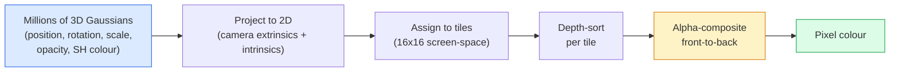

# 3D Gaussian Splating از ابتدا

> یک صحنه ابر میلیون ها گاسین 3D است. هر کدام دارای موقعیت، جهت، مقیاس، ناپاکی و رنگ است که بستگی به جهت مشاهده دارد. آنها را ریستری کنید، پشت پشت از طریق ریستری، انجام دهید.

**Type:** Build
**Languages:** Python
**Prerequisites:** Phase 4 Lesson 13 (3D Vision & NeRF), Phase 1 Lesson 12 (Tensor Operations), Phase 4 Lesson 10 (Diffusion basics optional)
**Time:** ~90 minutes

## اهداف یادگیری

- توضیح دهید که چرا 3D Gaussian Splatting جایگزین NeRF به عنوان پیش فرض تولید برای بازسازی 3D فوتوریالیستی در سال 2026 شد
- شش پارامتر هر گاسیان را بیان کنید (موقع، چهارپای چرخش، مقیاس، ناپاکی، رنگ هارمونیک توپ، ویژگی اختیاری) و تعداد شناور هر کدام را بیان کنید.
- از ابتدا یک اسپلاتینگ 2D گاسین را اجرا کنید با استفاده از `alpha`ترکیب، سپس نشان دهید که چگونه پرونده 3D به همان حلقه
- استفاده کنید`nerfstudio`،`gsplat`، یا`SuperSplat`برای بازسازی یک صحنه از 20-50 عکس و صادرات به `KHR_gaussian_splatting`غلتف یا OpenUSD 26.03 `UsdVolParticleField3DGaussianSplat`طرح

## مشکل

یک NeRF یک صحنه را به عنوان وزن یک MLP ذخیره می کند. هر پیکسل رند شده صدها سوال MLP در امتداد یک شعاع است. آموزش ساعت ها طول می کشد، رندری ثانیه ها طول می کشد و وزن ها نمی توانند ویرایش شوند.

3D Gaussian Splatting (Kerbl، Kopanas، Leimkühler، Drettakis، SIGGRAPH 2023) جایگزین همه اینها شد. صحنه ای مجموعه ای صریح از غوسیان های 3D است. رندرینگ یک رستری GPU با 100+ fps است. آموزش چند دقیقه طول می کشد. ویرایش مستقیم است: یک زیر مجموعه از گاسیان ها را ترجمه کنید و صندلی را جابجا کرده اید. تا سال 2026 گروه کرونوس یک تمدید glTF برای مکان های گاوسی را تأیید کرده است، OpenUSD 26.03 یک طرح اسپلات گاوسی را ارسال می کند، Zillow و Apartments.com املاک را با آنها انجام می دهند و اکثر مقالات تحقیقاتی جدید در مورد بازسازی 3D نسخه های اصلی ایده 3DGS هستند.

مدل ذهنی ساده است، ریاضیات به اندازه کافی قسمت های متحرک دارد که اکثر مقدمات با راستر کردن شروع می شوند و از پیش بینی ها و هارمونیک های کره ای عبور می کنند. این درس همه چیز را می سازد  یک نسخه 2D اول، سپس گسترش 3D.

## مفهوم

### آنچه که یک گاسین حمل می کند

یک گاوسیان 3D یک نقطه پارامتری در فضا با این ویژگی ها است:

```
position         mu         (3,)    centre in world coordinates
rotation         q          (4,)    unit quaternion encoding orientation
scale            s          (3,)    log-scales per axis (exponentiated at render time)
opacity          alpha      (1,)    post-sigmoid opacity [0, 1]
SH coefficients  c_lm       (3 * (L+1)^2,)   view-dependent colour
```

چرخش + مقیاس یک 3x3 همگرایی ایجاد کنید: `Sigma = R S S^T R^T`این شکل گاوسی در 3D است. آرمنکس های کره ای اجازه می دهند رنگ با تغییر جهت مشاهده  برجسته های مرموز، چشنگ ظریف، نور وابسته به دید  بدون ذخیره بافت های هر دید. با درجه SH 3 شما 16 معادل در هر کانال رنگ، 48 شناور در هر گاوسی برای رنگ تنها.

یک صحنه به طور معمول 1-5 میلیون گاسیان دارد. هر یک حدود 60 شناور (3 + 4 + 3 + 1 + 48 + مخلوط) را ذخیره می کند. این 240 MB برای یک صحنه پنج میلیون گاسیان است. بسیار کوچکتر از ابر نقطه معادل با بافت هر نقطه و یک حکم بزرگی کوچکتر از وزن MLP یک NeRF است که در وضوح بالا بازگردانده می شود.

### رستر کردن، نه حرکت شعاع



پنج مرحله، همه ی آن ها با گپيو سازگار هستند، بدون سوال MLP در هر پیکسل، یک RTX 3080 Ti تنها 6 میلیون اسپلات را با 147 fps ارائه می دهد.

### مرحله پروژکتور

گاسيان 3D در موقعیت جهان`mu`با همگوشی 3D `Sigma`پروژه ها به یک گاسین 2D در موقعیت صفحه نمایش`mu'`با همتای دو بعدی `Sigma'`:

```
mu' = project(mu)
Sigma' = J W Sigma W^T J^T          (2 x 2)

W = viewing transform (rotation + translation of camera)
J = Jacobian of the perspective projection at mu'
```

اثر پاى گاوسي 2D يک elipse است که محورها خودکاره هاي`Sigma'`هر پیکسل داخل این elipse سهم Gaussian را دریافت می کند، وزن شده توسط`exp(-0.5 * (p - mu')^T Sigma'^-1 (p - mu'))`. .

### قانون ترکیب آلفا

برای یک پیکسل، گاسیان هایی که آن را پوشش می دهند به صورت پیش رو (یا به طور معادل پیش رو به عقب با فرمول معکوس) مرتب می شوند. رنگ با همان معادله مانند هر راسترایسر نیمه شفاف از دهه 1980 ترکیب شده است:

```
C_pixel = sum_i alpha_i * T_i * c_i

T_i = prod_{j < i} (1 - alpha_j)       transmittance up to i
alpha_i = opacity_i * exp(-0.5 * d^T Sigma'^-1 d)   local contribution
c_i = eval_SH(SH_i, view_direction)    view-dependent colour
```

اینم**the same equation as NeRF's volumetric render**این هویت است که چرا کیفیت ارائه شده مطابقت دارد NeRF  هر دو یکسانی را در یک معادله میدان تابش می کنند.

### چرا این قابل تفاوتی است

هر مرحله از پروژکتور، تایل اختصاص، آلفا ترکیب، ارزیابی SH قابل تشخیص است در رابطه با پارامترهای گوسسی. با توجه به یک تصویر حقیقت زمین، محاسبه بازگردانده پیکسل از دست دادن، پسپروپ از طریق rasteriser، به روز رسانی همه `(mu, q, s, alpha, c_lm)`با نزديکيت گرادينت، با 30 هزار تکرار گوسي ها موقعيت، ترازو و رنگ درست خود را پيدا مي کنند

### فشرده سازی و برش

مجموعه ای ثابت از گاسیان نمی تواند یک صحنه پیچیده را پوشش دهد. آموزش شامل دو مکانیسم سازگاری است:

- **Clone**یک گاسین در موقعیت فعلی اش زمانی که شدت گرادینتش بالا است اما مقیاسش کوچک است  بازسازی نیاز به جزئیات بیشتری دارد.
- **Split**یک گاسین بزرگ در دو گاسین کوچک تر در زمانی که گرادینت آن بالا است  یک گاسین بزرگ بیش از حد صاف است تا به منطقه مناسب شود.
- **Prune**گاسیان که ناپاکیش زیر یک حد پایین می آید، آنها کمک نمی کنند.

فشرده سازی هر تکرار N را اجرا می کند. یک صحنه معمولا از ~ 100k Gaussians اولیه (به عنوان دانه از نقاط SfM) تا 1-5M در پایان آموزش رشد می کند.

### هارمونیک های کروی در یک پاراگراف

رنگ وابسته به دید یک تابع است `c(direction)`در کليد واحد. هارمونيك هاي کره اي اساس فوريه كليد هستند. در درجه`L`و تو می خوای`(L+1)^2`درجه 0 = یک معادل = رنگ ثابت. درجه 3 = 16 معادل = کافی برای گرفتن سایه لامبرتیان، انعکاس رنگی و سبک است. مقالات SD Gaussian Splatting درجه 3 را به طور پیش فرض استفاده می کنند.

### دسته تولید 2026

```
1. Capture         smartphone / DJI drone / handheld scanner
2. SfM / MVS       COLMAP or GLOMAP derives camera poses + sparse points
3. Train 3DGS      nerfstudio / gsplat / inria official / PostShot (~10-30 min on RTX 4090)
4. Edit            SuperSplat / SplatForge (clean floaters, segment)
5. Export          .ply -> glTF KHR_gaussian_splatting or .usd (OpenUSD 26.03)
6. View            Cesium / Unreal / Babylon.js / Three.js / Vision Pro
```

### 4D و انواع تولید

- **4D Gaussian Splatting** گاسیان ها تابع های زمان هستند؛ برای ویدیو حجم (سوپرمن 2026, "هلیکوپتر" A$AP Rocky) استفاده می شود.
- **Generative splats** مدل های متن به صفحه (مربر توسط آزمایشگاه های جهانی) که صحنه های کامل را توهم می دهند.
- **3D Gaussian Unscented Transform** ویرانه NVIDIA NuRec برای شبیه سازی رانندگی خودکار.

```figure
cv3-gaussian-splat
```

## آن را بسازید

### مرحله اول: یک گاوسی 2D

اول ما یک راسترایز 2D بسازیم. صورت 3D بعد از پروژکتور به آن کاهش می یابد.

```python
import torch
import torch.nn as nn
import torch.nn.functional as F


def eval_2d_gaussian(means, covs, points):
    """
    means:  (G, 2)      centres
    covs:   (G, 2, 2)   covariance matrices
    points: (H, W, 2)   pixel coordinates
    returns: (G, H, W)  density at every pixel for every Gaussian
    """
    G = means.size(0)
    H, W, _ = points.shape
    flat = points.view(-1, 2)
    inv = torch.linalg.inv(covs)
    diff = flat[None, :, :] - means[:, None, :]
    d = torch.einsum("gpi,gij,gpj->gp", diff, inv, diff)
    density = torch.exp(-0.5 * d)
    return density.view(G, H, W)
```

`einsum`شکل مربع را می کند`diff^T Sigma^-1 diff`برای هر جفت (گوسین، پیکسل)

### مرحله 2: 2D اسپلاتینگ راسترایزر

گرده در دو بعدی بی معنی است، بنابراین ما از یک مقیاس هر گاس برای ترتیب استفاده می کنیم.

```python
def rasterise_2d(means, covs, colours, opacities, depths, image_size):
    """
    means:     (G, 2)
    covs:      (G, 2, 2)
    colours:   (G, 3)
    opacities: (G,)     in [0, 1]
    depths:    (G,)     per-Gaussian scalar used for ordering
    image_size: (H, W)
    returns:   (H, W, 3) rendered image
    """
    H, W = image_size
    yy, xx = torch.meshgrid(
        torch.arange(H, dtype=torch.float32, device=means.device),
        torch.arange(W, dtype=torch.float32, device=means.device),
        indexing="ij",
    )
    points = torch.stack([xx, yy], dim=-1)

    densities = eval_2d_gaussian(means, covs, points)
    alphas = opacities[:, None, None] * densities
    alphas = alphas.clamp(0.0, 0.99)

    order = torch.argsort(depths)
    alphas = alphas[order]
    colours_sorted = colours[order]

    T = torch.ones(H, W, device=means.device)
    out = torch.zeros(H, W, 3, device=means.device)
    for i in range(means.size(0)):
        a = alphas[i]
        out += (T * a)[..., None] * colours_sorted[i][None, None, :]
        T = T * (1.0 - a)
    return out
```

نه سریع  یک پیاده سازی واقعی از هسته های CUDA مبتنی بر کاشی استفاده می کند  اما دقیقا ریاضیات صحیح و کاملا قابل تفاوت است.

### مرحله سوم: یک صحنه اسپلات 2D قابل آموزش

```python
class Splats2D(nn.Module):
    def __init__(self, num_splats=128, image_size=64, seed=0):
        super().__init__()
        g = torch.Generator().manual_seed(seed)
        H, W = image_size, image_size
        self.means = nn.Parameter(torch.rand(num_splats, 2, generator=g) * torch.tensor([W, H]))
        self.log_scale = nn.Parameter(torch.ones(num_splats, 2) * math.log(2.0))
        self.rot = nn.Parameter(torch.zeros(num_splats))  # single angle in 2D
        self.colour_logits = nn.Parameter(torch.randn(num_splats, 3, generator=g) * 0.5)
        self.opacity_logit = nn.Parameter(torch.zeros(num_splats))
        self.depth = nn.Parameter(torch.rand(num_splats, generator=g))

    def covs(self):
        s = torch.exp(self.log_scale)
        c, si = torch.cos(self.rot), torch.sin(self.rot)
        R = torch.stack([
            torch.stack([c, -si], dim=-1),
            torch.stack([si, c], dim=-1),
        ], dim=-2)
        S = torch.diag_embed(s ** 2)
        return R @ S @ R.transpose(-1, -2)

    def forward(self, image_size):
        covs = self.covs()
        colours = torch.sigmoid(self.colour_logits)
        opacities = torch.sigmoid(self.opacity_logit)
        return rasterise_2d(self.means, covs, colours, opacities, self.depth, image_size)
```

`log_scale`،`opacity_logit`و`colour_logits`این الگوی استاندارد برای هر اجرای 3DGS است.

### مرحله 4: گاسین های 2D را به تصویر هدف قرار دهید

```python
import math
import numpy as np

def make_target(size=64):
    yy, xx = np.meshgrid(np.arange(size), np.arange(size), indexing="ij")
    img = np.zeros((size, size, 3), dtype=np.float32)
    # Red circle
    mask = (xx - 20) ** 2 + (yy - 20) ** 2 < 10 ** 2
    img[mask] = [1.0, 0.2, 0.2]
    # Blue square
    mask = (np.abs(xx - 45) < 8) & (np.abs(yy - 40) < 8)
    img[mask] = [0.2, 0.3, 1.0]
    return torch.from_numpy(img)


target = make_target(64)
model = Splats2D(num_splats=64, image_size=64)
opt = torch.optim.Adam(model.parameters(), lr=0.05)

for step in range(200):
    pred = model((64, 64))
    loss = F.mse_loss(pred, target)
    opt.zero_grad(); loss.backward(); opt.step()
    if step % 40 == 0:
        print(f"step {step:3d}  mse {loss.item():.4f}")
```

در طول 200 مرحله 64 گاسین به دو شکل قرار می گیرند. این ایده ی کلی است.

### مرحله 5: از 2D به 3D

افزونه 3D همچنان به اندازه ي قبل ادامه ميده

1. چرخش پر گاسین یک کواترنیون به جای یک زاویه است.
2. همتاشي`R S S^T R^T`با`R`از کوترون ساخته شده و`S = diag(exp(log_scale))`. .
3. پیش بینی`(mu, Sigma) -> (mu', Sigma')`استفاده از خارج از دوربین و Jacobian از پروژکتور چشم انداز در `mu`. .
4. رنگ تبدیل به یک گسترش توپ-هارمونیک می شود؛ آن را در جهت مشاهده ارزیابی کنید.
5. درجه عمق از فضای دوربین واقعی z به جای یک مقیاس آموخته شده است.

هر اجرای تولید (`gsplat`،`inria/gaussian-splatting`،`nerfstudio`) دقیقاً این کار را در GPU با هسته های CUDA مبتنی بر کاشی انجام می دهد.

### مرحله 6: ارزیابی هارمونیک های کروانی

اساس SH تا درجه 3 16 اصطلاح در هر کانال دارد.

```python
def eval_sh_degree_3(sh_coeffs, dirs):
    """
    sh_coeffs: (..., 16, 3)   last dim is RGB channels
    dirs:      (..., 3)       unit vectors
    returns:   (..., 3)
    """
    C0 = 0.282094791773878
    C1 = 0.488602511902920
    C2 = [1.092548430592079, 1.092548430592079,
          0.315391565252520, 1.092548430592079,
          0.546274215296039]
    x, y, z = dirs[..., 0], dirs[..., 1], dirs[..., 2]
    x2, y2, z2 = x * x, y * y, z * z
    xy, yz, xz = x * y, y * z, x * z

    result = C0 * sh_coeffs[..., 0, :]
    result = result - C1 * y[..., None] * sh_coeffs[..., 1, :]
    result = result + C1 * z[..., None] * sh_coeffs[..., 2, :]
    result = result - C1 * x[..., None] * sh_coeffs[..., 3, :]

    result = result + C2[0] * xy[..., None] * sh_coeffs[..., 4, :]
    result = result + C2[1] * yz[..., None] * sh_coeffs[..., 5, :]
    result = result + C2[2] * (2.0 * z2 - x2 - y2)[..., None] * sh_coeffs[..., 6, :]
    result = result + C2[3] * xz[..., None] * sh_coeffs[..., 7, :]
    result = result + C2[4] * (x2 - y2)[..., None] * sh_coeffs[..., 8, :]

    # degree 3 terms omitted here for brevity; full 16-coefficient version in the code file
    return result
```

آموخته شد`sh_coeffs`در زمان رند کردن با جهت مشاهده فعلی ارزیابی می کنید و یک RGB 3 ویکتور را دریافت می کنید.

## ازش استفاده کن

برای کار واقعی 3DGS، استفاده کنید `gsplat`(میتا) یا`nerfstudio`:

```bash
pip install nerfstudio gsplat
ns-download-data example
ns-train splatfacto --data path/to/data
```

`splatfacto`اين مربي 3DGS استوديوي اعصاب است. براي يک صحنه معمول، 10 تا 30 دقيقه با RTX 4090 طول مي کشد.

گزینه های صادراتی که در سال 2026 مهم هستند:

- `.ply` ابر گاوسی خام (پرده قابل حمل، بزرگترین فایل).
- `.splat` قالب اندازه گیری شده PlayCanvas / SuperSplat.
- glTF `KHR_gaussian_splatting` استاندارد کرونوس، قابل حمل در بین بینندگان (فبروری 2026 RC).
- OpenUSD `UsdVolParticleField3DGaussianSplat` در USD، برای خطوط لوله NVIDIA Omniverse و Vision Pro.

برای صحنه های 4D / پویا، `4DGS`و`Deformable-3DGS`در این زمینه، دستگاه های مختلف را با روش های مختلف و شفافیت های مختلف گسترش می دهند.

## -باده

این درس نتیجه می دهد:

- `outputs/prompt-3dgs-capture-planner.md` یک پیامک که برنامه ریزی یک جلسه ضبط (عدد عکس ها، مسیر دوربین، نور) برای یک نوع صحنه خاص.
- `outputs/skill-3dgs-export-router.md` مهارت هایی که فرمت صادراتی مناسب را انتخاب می کنند (`.ply`-`.splat`/ glTF / USD) در نظر گرفتن بیننده یا موتور پایین تر.

## تمرینات

1. **(Easy)**آموزش دو بعدی رو روی یه تصویر مصنوعی دیگه اجرا کن`num_splats`در`[16, 64, 256]`و نقشه MSE در مقابل مرحله برای هر یک. نقطه کاهش بازده را مشخص کنید.
2. **(Medium)**رنگ های RGB را برای هر گاوسی که از یک "زاویه دید" مقیاس دار از طریق یک هماهنگی درجه 2 وابسته هستند، پشتیبانی کنید. روی یک جفت تصاویر هدف تمرین کنید و بررسی کنید که مدل هر دو را بازسازی می کند.
3. **(Hard)**کلون`nerfstudio`و قطار`splatfacto`در صورت گرفتن 20 عکس از هر صحنه ای که دارید (منظور، گیاه، چهره، اتاق) صادر کنید به glTF `KHR_gaussian_splatting`و آن را در یک بیننده باز کنید (Three.js `GaussianSplats3D`گزارش زمان آموزش، تعداد گاسيان و fps انجام شده

## اصطلاحات کلیدی

| Term | What people say | What it actually means |
|------|----------------|----------------------|
| 3DGS | "Gaussian splats" | Explicit scene representation as millions of 3D Gaussians with per-Gaussian position, rotation, scale, opacity, SH colour |
| Covariance | "Shape of the Gaussian" | `Sigma = R S S^T R^T`; orientation and anisotropic scale of one Gaussian |
| Alpha compositing | "Back-to-front blend" | Same equation as NeRF's volumetric render, now over an explicit sparse set |
| Densification | "Clone and split" | Adaptive addition of new Gaussians where reconstruction is under-fit |
| Pruning | "Delete low-opacity" | Remove Gaussians that have collapsed to near-zero opacity during training |
| Spherical harmonics | "View-dependent colour" | Fourier basis on the sphere; stores colour as a function of viewing direction |
| Splatfacto | "nerfstudio's 3DGS" | The easiest path to training 3DGS in 2026 |
| `KHR_gaussian_splatting` | "glTF standard" | Khronos 2026 extension that makes 3DGS portable across viewers and engines |

## خواندن بیشتر

- [3D Gaussian Splatting for Real-Time Radiance Field Rendering (Kerbl et al., SIGGRAPH 2023)](https://repo-sam.inria.fr/fungraph/3d-gaussian-splatting/) کاغذ اصلی
- [gsplat (Meta/nerfstudio)](https://github.com/nerfstudio-project/gsplat) ریسترایزر CUDA با کیفیت تولید
- [nerfstudio Splatfacto](https://docs.nerf.studio/nerfology/methods/splat.html) دستور کار آموزش مرجع
- [Khronos KHR_gaussian_splatting extension](https://github.com/KhronosGroup/glTF/blob/main/extensions/2.0/Khronos/KHR_gaussian_splatting/README.md) فرمت قابل حمل 2026
- [OpenUSD 26.03 release notes](https://openusd.org/release/) `UsdVolParticleField3DGaussianSplat`طرح
- [THE FUTURE 3D State of Gaussian Splatting 2026](https://www.thefuture3d.com/blog-0/2026/4/4/state-of-gaussian-splatting-2026) بررسی صنعت
