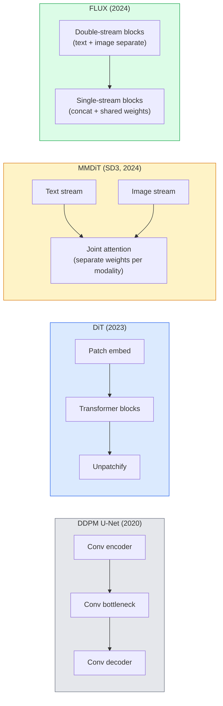

# ترانسفورماتورهای انتشار و جریان اصلاح شده

> شبکه ی U-Net راز انتشار نیست. آن را با یک ترانسفورماتور جایگزین کنید، برنامه ی صدا را با جریان مستقیم عوض کنید، و ناگهان شما SD3، FLUX و هر مدل 2026 از متن به تصویر دارید.

**Type:** Learn + Build
**Languages:** Python
**Prerequisites:** Phase 4 Lesson 10 (Diffusion DDPM), Phase 4 Lesson 14 (ViT), Phase 7 Lesson 02 (Self-Attention)
**Time:** ~75 minutes

## اهداف یادگیری

- روند تکامل U-Net DDPM (درسی 10) را به Diffusion Transformer (DiT) ، MMDiT (SD3) و Single+Double-stream DiT (FLUX) ردیابی کنید
- جریان اصلاح شده را توضیح دهید: چرا یک مسیر مستقیم بین صدا و داده ها اجازه می دهد مدل ها در 20 مرحله به جای 1000 نمونه بگیرند
- پیاده سازی یک بلوک کوچک DiT و یک حلقه آموزش جریان اصلاح شده، هر دو تحت 100 خط
- انواع مدل ها را (SD3، FLUX.1-dev، FLUX.1-schnell، Z-Image، Qwen-Image) با معماری، تعداد پارامترها و مجوزها تشخیص دهید

## مشکل

درس 10 یک DDPM با یک U-Net denoiser ساخته است. این دستور 2020-2023: U-Net + برنامه بتا + کاهش پیش بینی صدا را تحت سلطه قرار داد. این تولید Stable Diffusion 1.5 و 2.1 و DALL-E 2 را تولید کرد.

هر مدل 2026 پیشرفته از متن به تصویر از آن گذشته است. Stable Diffusion 3, FLUX, SD4, Z-Image, Qwen-Image, Hunyuan-Image  هیچ کدام از یک U-Net استفاده نمی کنند. آنها از Diffusion Transformers (DiT) استفاده می کنند. SD3 و FLUX همچنین برنامه نویسی DDPM را برای جریان اصلاح شده تغییر می دهند، که مسیر از نویز به داده ها را مستقیم می کند و نتیجه گیری 1-4 مرحله ای با ثبات یا تغییرات لوله شده را امکان پذیر می کند.

تغییر اهمیت دارد زیرا این دلیل است که تولید تصویر مبتنی بر انتشار قابل کنترل، سریع دقیق (برادرانگ متن حل شده SD3/SD4) و تولید سریع شد. درک جریان اصلاح شده + DiT درک استک تصویر تولید 2026 است.

## مفهوم

### از U-Net به ترانسفورم



- **DiT**(Peebles & Xie، 2023)  جایگزین U-Net با یک ترانسفورماتور مانند ViT در پیچ های پنهان.
- **MMDiT**(SD3 ، Esser و همکاران ، 2024)  دو جریان با وزن های جداگانه برای نشانه های متن و تصویر که توجه مشترک را به اشتراک می گذارند.
- **FLUX**(برابرگاه های جنگل سیاه، 2024)  اول N بلوک های دوگانه جریان مانند SD3، بلوک های بعدی همبستگی و وزن های مشترک (سیگانه جریان) برای بهره وری در عمق بالاتر.
- **Z-Image**(2025)  یک DiT موثر در یک جریان در پارامتر 6B که چالش "بزرگ در هر هزینه".

### جریان اصلاح شده در یک پاراگراف

DDPM فرآیند پیشروی را به عنوان یک SDE شور و صدا تعریف می کند که در آن `x_t`برعکس آموخته شده یک SDE دوم است که با 1000 گام کوچک حل می شود.

جریان اصلاح شده تعریف می کند**straight-line**تعادل بین داده های پاک و صداهای پاک:

```
x_t = (1 - t) * x_0 + t * epsilon,     t in [0, 1]
```

شبکه ای را آموزش بده تا سرعت را پیش بینی کند`v_theta(x_t, t) = epsilon - x_0` جهت جلو در طول مسیر خط مستقیم از داده های پاک تا صدا (`dx_t/dt`در طول نمونه گیری، شما این سرعت را به عقب برای قدم زدن از صدا به سمت داده ها ادغام می کنید. ODE حاصل شده بسیار نزدیک به یک خط مستقیم است، بنابراین برای نمونه گیری مراحل ادغام کمتری مورد نیاز است.

SD3 اينو ميگه**Rectified Flow Matching**. FLUX، Z-Image و اکثر مدل های 2026 از همان هدف استفاده می کنند. نتیجه گیری معمول: 20-30 مرحله ایلر (تحریک) در مقابل 50 مرحله DDIM در رژیم DDPM قدیمی.

### تنظیمات AdaLN

شرایط DTs در زمان و کلاس/متن از طریق **adaptive layer norm**: پیش بینی`scale`و`shift`خیلی پاک تر از مدل سازی سبک FiLM در U-Nets و پیش فرض در هر DiT مدرن است.

```
cond -> MLP -> (scale, shift, gate)
norm(x) * (1 + scale) + shift, then residual add * gate
```

### کدرهای متن در SD3 و FLUX

- **SD3**استفاده از سه کدرس متن: دو مدل CLIP + T5-XXL. گنجانده شده و به جریان تصویر به عنوان شرایط متن داده می شود.
- **FLUX**یک CLIP-L + T5-XXL را استفاده می کند.
- **Qwen-Image / Z-Image**انواع استفاده از خود در خود کدرس متن هماهنگ با LLM پایه خود را.

کدرس متن بخش بزرگی از دلیل است که SD3/FLUX به نسبت پیام های درخواست بسیار بهتر از SD1.5 است.

### دستورالعمل بدون طبقه بندی هنوز در نظر گرفته شده است

جریان اصلاح شده نمونه را تغییر می دهد نه حالت. راهنمایی بدون طبقه بندی (تکست قطره ای با احتمال 10٪ در طول آموزش، پیش بینی های مشروط و بی قید و شرط را در نتیجه مخلوط کنید) به طور یکسان با جریان اصلاح شده کار می کند. اکثر مدل های 2026 از مقیاس راهنمایی 3.5-5  پایین تر از 7.5 SD1.5 استفاده می کنند زیرا مدل های جریان اصلاح شده به طور پیش فرض به طور دقیق تر از دستورات پیروی می کنند.

### همبستگی، توربو، شنل، LCM

چهار نام برای یک ایده: یک مدل آهسته چند مرحله ای را به یک مدل چند مرحله ای سریع تبدیل کنید.

- **LCM (Latent Consistency Model)** آموزش دانش آموزي که پيش بيني پايان ميکنه `x_0`از هر وسيله`x_t`در يک قدم
- **SDXL Turbo / FLUX schnell** مدل های 1-4 مرحله ای که با تزریق ضد انتشار آموزش دیده اند.
- **SD Turbo** مدل های هماهنگی سبک OpenAI که به انتشار غش شده سازگار شده اند.

تولید هر مدل جدید هر دو نقطه کنترل "کوالتی کامل" و یک نوع "توربو / سریع" را ارائه می دهد. شنل ("سرع" در آلمان، کنوانسیون آزمایشگاه های جنگل سیاه) در 1-4 مرحله اجرا می شود و در خطوط لوله در زمان واقعی قرار می گیرد.

### مدل منظره در سال 2026

| Model | Size | Architecture | License |
|-------|------|--------------|---------|
| Stable Diffusion 3 Medium | 2B | MMDiT | SAI Community |
| Stable Diffusion 3.5 Large | 8B | MMDiT | SAI Community |
| FLUX.1-dev | 12B | Double + Single Stream DiT | non-commercial |
| FLUX.1-schnell | 12B | same, distilled | Apache 2.0 |
| FLUX.2 | — | iterated FLUX.1 | mixed |
| Z-Image | 6B | S3-DiT (Scalable Single-Stream) | permissive |
| Qwen-Image | ~20B | DiT + Qwen text tower | Apache 2.0 |
| Hunyuan-Image-3.0 | ~80B | DiT | research |
| SD4 Turbo | 3B | DiT + distillation | SAI Commercial |

FLUX.1-schnell پیش فرض منبع باز 2026 است. Z-Image رهبر کارایی است. FLUX.2 و SD4 نکات کیفیت فعلی هستند.

### چرا این تغییر مرحله مهمه

DDPM + U-Net کار کرد. DiT + جریان اصلاح شده کار می کند **better, faster, and scales more cleanly**. انتقال موازی با آن از RNNs به ترانسفورماتورها در NLP است: هر دو معماری مشکل مشابه را حل کردند، اما ترانسفورماتورها مقیاس پذیر شدند و اکنون تسلط دارند. هر مقاله ای در سال 2026 در مورد تصویر، ویدیو یا نسل 3D از یک داینوایزر به شکل DiT و معمولا یک هدف جریان اصلاح شده استفاده می کند. U-Net DDPM اکنون عمدتا آموزشی است (درس 10).

```figure
cv3-rectified-flow
```

## آن را بسازید

### مرحله ی اول: یک بلاک DiT با AdaLN

```python
import torch
import torch.nn as nn


class AdaLNZero(nn.Module):
    """
    Adaptive LayerNorm with a gate. Predicts (scale, shift, gate) from the conditioning.
    Init such that the whole block starts as identity ("zero init").
    """

    def __init__(self, dim, cond_dim):
        super().__init__()
        self.norm = nn.LayerNorm(dim, elementwise_affine=False)
        self.mlp = nn.Linear(cond_dim, dim * 3)
        nn.init.zeros_(self.mlp.weight)
        nn.init.zeros_(self.mlp.bias)

    def forward(self, x, cond):
        scale, shift, gate = self.mlp(cond).chunk(3, dim=-1)
        h = self.norm(x) * (1 + scale.unsqueeze(1)) + shift.unsqueeze(1)
        return h, gate.unsqueeze(1)


class DiTBlock(nn.Module):
    def __init__(self, dim=192, heads=3, mlp_ratio=4, cond_dim=192):
        super().__init__()
        self.adaln1 = AdaLNZero(dim, cond_dim)
        self.attn = nn.MultiheadAttention(dim, heads, batch_first=True)
        self.adaln2 = AdaLNZero(dim, cond_dim)
        self.mlp = nn.Sequential(
            nn.Linear(dim, dim * mlp_ratio),
            nn.GELU(),
            nn.Linear(dim * mlp_ratio, dim),
        )

    def forward(self, x, cond):
        h, gate1 = self.adaln1(x, cond)
        a, _ = self.attn(h, h, h, need_weights=False)
        x = x + gate1 * a
        h, gate2 = self.adaln2(x, cond)
        x = x + gate2 * self.mlp(h)
        return x
```

`AdaLNZero`آموزش به عنوان یک نقشه هویت شروع می شود زیرا وزن MLP آن به صفر آغاز می شود. آموزش مانع از هویت را دور می کند؛ این به طور چشمگیری مدل های انتشار ترانسفورماتور عمیق را ثبات می دهد.

### مرحله دوم: یک مقدار کوچک

```python
def timestep_embedding(t, dim):
    import math
    half = dim // 2
    freqs = torch.exp(-math.log(10000) * torch.arange(half, device=t.device) / half)
    args = t[:, None].float() * freqs[None]
    return torch.cat([args.sin(), args.cos()], dim=-1)


class TinyDiT(nn.Module):
    def __init__(self, image_size=16, patch_size=2, in_channels=3, dim=96, depth=4, heads=3):
        super().__init__()
        self.patch_size = patch_size
        self.num_patches = (image_size // patch_size) ** 2
        self.patch = nn.Conv2d(in_channels, dim, kernel_size=patch_size, stride=patch_size)
        self.pos = nn.Parameter(torch.zeros(1, self.num_patches, dim))
        self.time_mlp = nn.Sequential(
            nn.Linear(dim, dim * 2),
            nn.SiLU(),
            nn.Linear(dim * 2, dim),
        )
        self.blocks = nn.ModuleList([DiTBlock(dim, heads, cond_dim=dim) for _ in range(depth)])
        self.norm_out = nn.LayerNorm(dim, elementwise_affine=False)
        self.head = nn.Linear(dim, patch_size * patch_size * in_channels)

    def forward(self, x, t):
        n = x.size(0)
        x = self.patch(x)
        x = x.flatten(2).transpose(1, 2) + self.pos
        t_emb = self.time_mlp(timestep_embedding(t, self.pos.size(-1)))
        for blk in self.blocks:
            x = blk(x, t_emb)
        x = self.norm_out(x)
        x = self.head(x)
        return self._unpatchify(x, n)

    def _unpatchify(self, x, n):
        p = self.patch_size
        h = w = int(self.num_patches ** 0.5)
        x = x.view(n, h, w, p, p, -1).permute(0, 5, 1, 3, 2, 4).reshape(n, -1, h * p, w * p)
        return x
```

### مرحله سوم: آموزش جریان اصلاح شده

```python
import torch.nn.functional as F

def rectified_flow_train_step(model, x0, optimizer, device):
    model.train()
    x0 = x0.to(device)
    n = x0.size(0)
    t = torch.rand(n, device=device)
    epsilon = torch.randn_like(x0)
    x_t = (1 - t[:, None, None, None]) * x0 + t[:, None, None, None] * epsilon

    target_velocity = epsilon - x0
    pred_velocity = model(x_t, t)

    loss = F.mse_loss(pred_velocity, target_velocity)
    optimizer.zero_grad()
    loss.backward()
    optimizer.step()
    return loss.item()
```

مقایسه با از دست دادن پیش بینی صدا در DDPM (درسی ۱۰): ساختار مشابه، هدف متفاوت.`epsilon`، ما پیش بینی می کنیم**velocity** `epsilon - x_0`، که از داده ها به صدا در طول قطب قطبی مستقیم اشاره می کند.

### مرحله 4: نمونه گیری یولر

جریان اصلاح شده یک ODE است. روش ایلر ساده ترین و برای یک مدل جریان اصلاح شده آموزش دیده، تقریباً به اندازه حل کننده های درجه بالاتر در 20+ مرحله دقیق است.

```python
@torch.no_grad()
def rectified_flow_sample(model, shape, steps=20, device="cpu"):
    model.eval()
    x = torch.randn(shape, device=device)
    dt = 1.0 / steps
    t = torch.ones(shape[0], device=device)
    for _ in range(steps):
        v = model(x, t)
        x = x - dt * v
        t = t - dt
    return x
```

در یک مدل آموزش دیده این نمونه ها قابل مقایسه با 1000 مرحله DDPM تولید می شود.

### مرحله 5: آزمایش دود از پایان تا پایان

```python
import numpy as np

def synthetic_blobs(num=200, size=16, seed=0):
    rng = np.random.default_rng(seed)
    out = np.zeros((num, 3, size, size), dtype=np.float32)
    yy, xx = np.meshgrid(np.arange(size), np.arange(size), indexing="ij")
    for i in range(num):
        cx, cy = rng.uniform(4, size - 4, size=2)
        r = rng.uniform(2, 4)
        mask = (xx - cx) ** 2 + (yy - cy) ** 2 < r ** 2
        colour = rng.uniform(-1, 1, size=3)
        for c in range(3):
            out[i, c][mask] = colour[c]
    return torch.from_numpy(out)
```

قطار یک`TinyDiT`بعد از 500 مرحله، نمونه های نمونه شده باید شبیه لکه های رنگ خفیف باشند.

## ازش استفاده کن

برای تولید تصویر واقعی با FLUX / SD3 / Z-Image، `diffusers`هر یک از این کشتی ها با یک API متحد:

```python
from diffusers import FluxPipeline, StableDiffusion3Pipeline
import torch

pipe = FluxPipeline.from_pretrained(
    "black-forest-labs/FLUX.1-schnell",
    torch_dtype=torch.bfloat16,
).to("cuda")

out = pipe(
    prompt="a golden retriever surfing a tsunami, hyperrealistic, studio lighting",
    guidance_scale=0.0,           # schnell was trained without CFG
    num_inference_steps=4,
    max_sequence_length=256,
).images[0]
out.save("surf.png")
```

سه خط`FLUX.1-schnell`در چهار مرحله.`black-forest-labs/FLUX.1-dev`برای کیفیت بالاتر در 20-30 مرحله با CFG.

برای SD3:

```python
pipe = StableDiffusion3Pipeline.from_pretrained(
    "stabilityai/stable-diffusion-3.5-large",
    torch_dtype=torch.bfloat16,
).to("cuda")
out = pipe(prompt, guidance_scale=3.5, num_inference_steps=28).images[0]
```

## -باده

این درس نتیجه می دهد:

- `outputs/prompt-dit-model-picker.md` انتخاب بین SD3، FLUX.1-dev، FLUX.1-schnell، Z-Image، SD4 Turbo با توجه به محدودیت های کیفیت، تاخیر و مجوز.
- `outputs/skill-rectified-flow-trainer.md` یک حلقه آموزشی کامل برای جریان اصلاح شده با نمونه گیری AdaLN DiT و Euler را می نویسد.

## تمرینات

1. **(Easy)**مدل TinyDiT را در بالای مجموعه داده های بلوب مصنوعی برای 500 مرحله تمرین کنید. نمونه های تولید شده با 10، 20 و 50 مرحله ی یولر را مقایسه کنید.
2. **(Medium)**اضافه کردن شرایط متن با ترکیب یک کلاس آموخته شده به وقت گنجانده (10 نقطه "کلاس" با رنگ) نمونه با کلاس 0, 5 و 9 و بررسی رنگ مطابقت.
3. **(Hard)**فاصله Fréchet (FID proxy) بین نمونه های تولید شده از جریان اصلاح شده و نسخه های DDPM از شبکه های اندازه مشابه که بر اساس داده های مشابه آموزش داده شده اند را برای تعداد مراحل یکسان محاسبه کنید. گزارش که سریعتر به هم می پیوندد.

## اصطلاحات کلیدی

| Term | What people say | What it actually means |
|------|----------------|----------------------|
| DiT | "Diffusion transformer" | Transformer that replaces the U-Net as the diffusion denoiser; operates on patchified latents |
| AdaLN | "Adaptive layer norm" | Timestep/text conditioning via learned scale, shift, gate applied after LayerNorm; standard in every modern DiT |
| MMDiT | "Multi-modal DiT (SD3)" | Separate weight streams for text and image tokens that share a joint self-attention |
| Single-stream / double-stream | "FLUX trick" | First N blocks double-stream (separate weights per modality), later blocks single-stream (concat + shared weights) for efficiency |
| Rectified flow | "Straight-line noise-to-data" | Linear interpolation between data and noise; network predicts velocity; fewer ODE steps needed at inference |
| Velocity target | "epsilon - x_0" | The regression target in rectified flow; points from clean data to noise |
| CFG guidance | "classifier-free guidance" | Mix conditional and unconditional predictions; still used in rectified-flow models |
| Schnell / turbo / LCM | "1-4 step distillation" | Small-step variants distilled from full-quality models; production real-time |

## خواندن بیشتر

- [Scalable Diffusion Models with Transformers (Peebles & Xie, 2023)](https://arxiv.org/abs/2212.09748) کاغذ دی تی
- [Scaling Rectified Flow Transformers (Esser et al., SD3 paper)](https://arxiv.org/abs/2403.03206) MMDiT و جریان اصلاح شده در مقیاس
- [FLUX.1 model card and technical report (Black Forest Labs)](https://huggingface.co/black-forest-labs/FLUX.1-dev) دوگانه + جزئیات یک جریان
- [Z-Image: Efficient Image Generation Foundation Model (2025)](https://arxiv.org/html/2511.22699v1) DiT یک جریان در 6B
- [Elucidating the Design Space of Diffusion (Karras et al., 2022)](https://arxiv.org/abs/2206.00364) مرجع برای هر معامله طراحی انتشار
- [Latent Consistency Models (Luo et al., 2023)](https://arxiv.org/abs/2310.04378) چگونه LCM- LoRA به شما نتیجه گیری چهار مرحله ای می دهد
