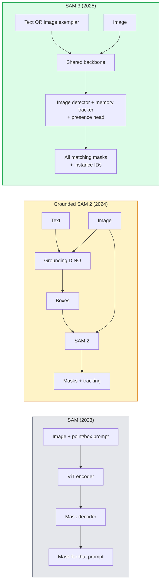

# SAM 3 و بخش بندی لغات باز

> به مدل يه پيغام متن و يک تصويري بده و براي هر شيوه ي مشابه ماسک بگير

**Type:** Use + Build
**Languages:** Python
**Prerequisites:** Phase 4 Lesson 07 (U-Net), Phase 4 Lesson 08 (Mask R-CNN), Phase 4 Lesson 18 (CLIP)
**Time:** ~60 minutes

## اهداف یادگیری

- تفاوت بین SAM (تنها پیام های بصری) ، SAM / SAM 2 (دیتکتور + SAM) و SAM 3 ( پیام های متن بومی از طریق بخش بندی مفهوم فوری)
- معماری SAM 3 را توضیح دهید: ستون فقرات مشترک + آشکارساز تصویر + ردیاب ویدیویی مبتنی بر حافظه + سر حضور + طراحی آشکارساز- ردیاب غیر متصل
- استفاده از آغوش دادن صورت`transformers`یکپارچه سازی SAM 3 برای تشخیص، بخش بندی و ردیابی ویدئویی با پیام
- انتخاب بین SAM 3، SAM 2، YOLO-World و SAM-MI بر اساس تاخیر، پیچیدگی مفهوم و هدف انتشار

## مشکل

SAM 2023 یک مدل فقط برای نمایش بصری بود: شما روی یک نقطه کلیک می کنید یا یک جعبه را می کشید و ماسک را باز می گرداند. برای "به من تمام نارنجی های این عکس را بدهید" شما نیاز به یک آشکارساز (DINO گراونینگ) برای تولید جعبه ها، سپس SAM برای تقسیم هر یک از آنها داشت. SAM گراونینگ این را به یک لوله تبدیل کرد، اما این یک کاسکاد دو مدل منجمد با تجمع اجتناب ناپذیر خطایی بود.

SAM 3 (Meta, Nov 2025, ICLR 2026) ، کاسکاد را فروپاشی داد. این یک عبارت اسم کوتاه یا نمونه ای از تصویر را به عنوان پرامپت پذیرفته و تمام ماسک ها و شناسه های مثال را در یک گذرگاه پیش رو به ارمغان می آورد.**Promptable Concept Segmentation (PCS)**در ترکیب با بروزرسانی Object Multiplex مارس 2026 (SAM 3.1) ، این نمونه های متعدد از همان مفهوم را از طریق ویدیو به طور موثر ردیابی می کند.

این درس در مورد تغییر ساختاری است که این نشان می دهد. Seg 2D، تشخیص و زمین سازی تصویر متن به یک مدل ادغام شده است. سوال تولید دیگر "چه لوله ای را با هم زنجیره می کنم" نیست بلکه "چه مدل قابل اجرا از آخر به آخر مورد استفاده من را اداره می کند".

## مفهوم

### سه نسل



### بخش بندی مفاهیم سریع

یک "مفهوم فوری" یک عبارت اسم کوتاه است (`"yellow school bus"`،`"striped red umbrella"`،`"hand holding a mug"`مدل ماسک های بخش بندی را برای هر نمونه ای از تصویر که با مفهوم مطابقت دارد، به همراه یک شناسه نمونه منحصر به فرد برای هر مسابقه باز می کند.

این از SAM بصری کلاسیک به سه راه متفاوت است:

1. هیچ درخواست در هر مثال مورد نیاز نیست  یک پیام پیام تمام مطابقت ها را باز می کند.
2. لغت باز مفهوم می تواند هر چیزی باشد که در زبان طبیعی قابل توصیف باشد.
3. چند بار به جای یک ماسک در هر پرامپرت باز می گردد.

### قطعات اصلی معماری

- **Shared backbone** یک ViT واحد تصویر را پردازش می کند. هم سر آشکارساز و هم ردیاب مبتنی بر حافظه از آن می خوانند.
- **Presence head** پیش بینی می کند که آیا مفهوم در تصویر وجود دارد یا خیر. "آیا این اینجاست؟" را از " کجاست؟" جدا می کند.
- **Decoupled detector-tracker** تشخیص سطح تصویر و ردیابی سطح ویدیو دارای سر های جداگانه هستند تا مداخله نکنند.
- **Memory bank** ویژگی های هر نمونه را در سراسر فریم ها برای ردیابی ویدیویی ذخیره می کند (مکانسم SAM 2 استفاده شده است).

### آموزش در مقیاس

SAM 3 رو آموزش داده بود**4 million unique concepts**این موتور داده ای است که با استفاده از هوش مصنوعی + بررسی انسانی به طور تکراری یادداشت و اصلاح می کند.**SA-CO benchmark**سام 3 75 تا 80 درصد عملکرد انسانی را در SA-CO و دو برابر سیستم های موجود در PCS تصویر + ویدیو به دست می آورد.

### SAM 3.1 چندگانه اشیاء

تازه ترین ماه مارس 2026: **Object Multiplex**این سیستم مکانیسم حافظه مشترک را برای ردیابی مشترک بسیاری از نمونه های یک مفهوم به یکباره معرفی می کند. پیش از این ردیابی N نمونه ها به معنای N بانک های حافظه جداگانه است. چندگانه آن را به یک حافظه مشترک با سوالات هر نمونه فرو می برد. نتیجه: ردیابی چند شی بسیار سریع تر بدون قربانی کردن دقت.

### جایی که SAM زمینی هنوز در سال 2026 مهم است

- وقتی که نیاز به یک آشکارساز لغات باز خاص دارید (DINO-X، فلورنس-۲)
- وقتی مجوز SAM 3 (در HF نگه داشته شده) یک مسدود کننده است.
- وقتی که به کنترل بیشتری در حد حد سنج نیاز دارید تا SAM 3 نشان می دهد.
- برای تحقیق / کار های حذف بر روی قطعه آشکارساز.

لوله های ماژولار هنوز هم جای دارند. برای اکثر کارهای تولید SAM 3 ساده ترین پاسخ است.

### یولو-ورلد در مقابل سام 3

- **YOLO-World** فقط آشکارساز لغت باز (بدون ماسک) . زمان واقعی. بهترین زمانی که به جعبه ها در fps بالا نیاز دارید.
- **SAM 3** بخش بندی کامل + ردیابی. تولید آهسته اما غنی تر.

تقسیم تولید: YOLO-World برای خطوط لوله فقط برای تشخیص سریع (روبات های ناوبری، داشبورد های سریع) ، SAM 3 برای هر چیزی که نیاز به ماسک یا ردیابی دارد.

### بهره وری SAM-MI

SAM-MI (2025-2026) حل شکاف دیکودر SAM را حل می کند. ایده های کلیدی:

- **Sparse point prompting** به جای پیام های کثیف، از چند نقطه خوب انتخاب شده استفاده می کند؛ تماس های دیکودر را تا 96 درصد کاهش می دهد.
- **Shallow mask aggregation** پیش بینی های ماسک را به یک ماسک تیز تر ترکیب می کند.
- **Decoupled mask injection** decoder ویژگی های ماسک پیش از محاسبه را به جای اجرا مجدد دریافت می کند.

نتیجه: ~ 1.6x سرعت نسبت به Grounded-SAM در معیار های آزاد لغت.

### فرمت تولید برای سه مدل

همه ساختار عمومی مشابه را باز می کنند (صندوق ها + برچسب ها + امتیازات + ماسک ها + شناسه ها) ، که مفید است  لوله شما به پایین نه باید شاخه ای در مورد مدل اجرا شود.

```figure
cv3-open-vocab
```

## آن را بسازید

### مرحله ی اول: ساخت سریع

یک دستیار بسازید که یک جمله کاربر را به یک لیست از دستورات مفهوم SAM 3 تبدیل کند. این مرز جایی است که "آنچه کاربر تایپ کرده" با "آنچه مدل مصرف می کند" ملاقات می کند.

```python
def split_concepts(sentence):
    """
    Heuristic splitter for multi-concept prompts.
    Returns list of short noun phrases.
    """
    for sep in [",", ";", "and", "or", "&"]:
        if sep in sentence:
            parts = [p.strip() for p in sentence.replace("and ", ",").split(",")]
            return [p for p in parts if p]
    return [sentence.strip()]

print(split_concepts("cats, dogs and balloons"))
```

SAM 3 یک مفهوم را در هر گذرگاه پیش رو پذیرفته است؛ برای سوالات چند مفهوم، آنها را حلقه یا دسته بندی کنید.

### مرحله دوم: کمک کنندگان پس از پردازش

. محصولات خام سام 3 رو به يه ليست پاک از کشف ها تبديل کن که با قرارداد خط لوله مرحله 4 درس 16 ما مطابقت داره

```python
from dataclasses import dataclass
from typing import List

@dataclass
class ConceptDetection:
    concept: str
    instance_id: int
    box: tuple          # (x1, y1, x2, y2)
    score: float
    mask_rle: str       # run-length encoded


def rle_encode(binary_mask):
    flat = binary_mask.flatten().astype("uint8")
    runs = []
    prev, count = flat[0], 0
    for v in flat:
        if v == prev:
            count += 1
        else:
            runs.append((int(prev), count))
            prev, count = v, 1
    runs.append((int(prev), count))
    return ";".join(f"{v}x{c}" for v, c in runs)
```

RLE حتی برای بسیاری از ماسک های با وضوح بالا، بارهای مفید پاسخ را کوچک نگه می دارد. این فرمت در SAM 2، SAM 3، SAM 2 کار می کند.

### مرحله 3: یک رابط تقسیم بندی یکپارچه و با لغت باز

هر نوع پسدیدی که دارید (SAM 3، SAM 2، YOLO-World + SAM 2) را پشت یک روش بسته کنید. کد پایین شما زمانی که پسدید تغییر نمی کند تغییر نمی کند.

```python
from abc import ABC, abstractmethod
import numpy as np

class OpenVocabSeg(ABC):
    @abstractmethod
    def detect(self, image: np.ndarray, concept: str) -> List[ConceptDetection]:
        ...


class StubOpenVocabSeg(OpenVocabSeg):
    """
    Deterministic stub used for pipeline testing when real models are not loaded.
    """
    def detect(self, image, concept):
        h, w = image.shape[:2]
        return [
            ConceptDetection(
                concept=concept,
                instance_id=0,
                box=(w * 0.2, h * 0.3, w * 0.5, h * 0.8),
                score=0.89,
                mask_rle="0x100;1x50;0x200",
            ),
            ConceptDetection(
                concept=concept,
                instance_id=1,
                box=(w * 0.55, h * 0.25, w * 0.85, h * 0.75),
                score=0.74,
                mask_rle="0x80;1x40;0x220",
            ),
        ]
```

واقعاً`SAM3OpenVocabSeg`فرعی کلاس می شود بسته `transformers.Sam3Model`و`Sam3Processor`. .

### مرحله 4: استفاده از SAM 3 در صورت آغوش (مرجع)

برای مدل واقعی،`transformers`ادغام:

```python
from transformers import Sam3Processor, Sam3Model
import torch

processor = Sam3Processor.from_pretrained("facebook/sam3")
model = Sam3Model.from_pretrained("facebook/sam3").eval()

inputs = processor(images=pil_image, return_tensors="pt")
inputs = processor.set_text_prompt(inputs, "yellow school bus")

with torch.no_grad():
    outputs = model(**inputs)

masks = processor.post_process_masks(
    outputs.masks, inputs.original_sizes, inputs.reshaped_input_sizes
)
boxes = outputs.boxes
scores = outputs.scores
```

يه پيغام، همه ي بازي ها در يک تماس برگشت

### مرحله 5: اندازه گیری آنچه که SAM 2 به شما رایگان داده است

یک معیار صادقانه: چه اتفاقی می افتد وقتی شما SAM 2 را با SAM 3 در یک لوله واقعی جایگزین کنید؟

- تاخیر: SAM 3 یک گذر جلو را ذخیره می کند (هیچ آشکارساز جداگانه ای) اما خود مدل سنگین تر است؛ معمولاً خنثی خالص یا سرعت کمی.
- دقت: SAM 3 در مفاهیم نادر یا ترکیب ("شمشیر قرمز پشته شده") بسیار بهتر است. مشابه در مفاهیم یک کلمه مشترک است.
- انعطاف پذیری: SAM 2 با زمین به شما اجازه می دهد تا آشکارا را عوض کنید (DINO-X، فلورنس-2، DINO 1.5)؛ SAM 3 یک سنگینی است.

نتیجه گیری: SAM 3 پیش فرض برای 2026 Seg لغت باز است. SAM 2 هنوز هم پاسخ درست است وقتی به انعطاف پذیری آشکارگر یا شرایط مجوز مختلف نیاز دارید.

## ازش استفاده کن

الگوهای انتشار تولید:

- **Real-time annotation** SAM 3 + ویژگی برچسب به عنوان متن CVAT. نوتاژگران نام برچسب را انتخاب می کنند؛ SAM 3 هر نمونه مطابقت را پیش از برچسب می کند. بررسی و اصلاح کنید.
- **Video analytics** SAM 3.1 Object Multiplex برای ردیابی چند چیز؛ فریم های تغذیه به ردیاب مبتنی بر حافظه.
- **Robotics**SAM 3 برای دستکاری با لغت باز ("فنجان قرمز را بالا ببرید"); به عنوان یک برنامه ریزی اولیه اجرا می شود.
- **Medical imaging** SAM 3 با مفاهیم پزشکی سازگار شده است. نیاز به درخواست دسترسی در HF دارد.

Ultralytics SAM 3 را در بسته های پایتون خود بسته بندی می کند:

```python
from ultralytics import SAM

model = SAM("sam3.pt")
results = model(image_path, prompts="yellow school bus")
```

همون رابط يولو و سام 2

## -باده

این درس نتیجه می دهد:

- `outputs/prompt-open-vocab-stack-picker.md` یک پیام که بر اساس تاخیر، پیچیدگی مفهوم و مجوز SAM 3 / SAM 2 / YOLO-World / SAM-MI را انتخاب می کند.
- `outputs/skill-concept-prompt-designer.md` یک مهارت که بیانات کاربر را به پیام های مفهوم SAM 3 خوب شکل داده است (شکستن، عدم تشبیهه، عقب نشینی).

## تمرینات

1. **(Easy)**SAM 3 را در 10 تصویر با پیام های مفهومی که انتخاب می کنید اجرا کنید. با SAM 2 + Grounding DINO 1.5 در همان تصاویر مقایسه کنید. گزارش کنید که کدام مفهوم هر مدل از دست رفته است.
2. **(Medium)**یک UI "کلیک برای شامل / کلیک برای حذف" را در بالای SAM 3 ایجاد کنید: یک پیام پیامک نمونه های کاندید را بازمی گرداند؛ کلیک های کاربر نگه می دارد که کدام یک مثبت هستند. مجموعه مفهوم نهایی را به عنوان JSON صادر کنید.
3. **(Hard)**SAM 3 را بر روی یک مجموعه مفهومی سفارشی (به عنوان مثال 5 نوع قطعات الکترونیکی) با 20 تصویر با برچسب هر یک تنظیم کنید. با SAM 3 صفر عکس در همان مجموعه آزمایش مقایسه کنید؛ بهبود IoU ماسک را اندازه گیری کنید.

## اصطلاحات کلیدی

| Term | What people say | What it actually means |
|------|----------------|----------------------|
| Open-vocabulary segmentation | "Segment by text" | Produce masks for objects described in natural language, not a fixed label set |
| PCS | "Promptable Concept Segmentation" | SAM 3's core task — given a noun-phrase or image exemplar, segment all matching instances |
| Concept prompt | "The text input" | Short noun phrase or image exemplar; not a full sentence |
| Presence head | "Is it here?" | SAM 3 module that decides whether the concept exists in the image before localisation |
| SA-CO | "SAM 3 benchmark" | 270K-concept open-vocabulary segmentation benchmark; 50x larger than prior open-vocab benchmarks |
| Object Multiplex | "SAM 3.1 update" | Shared-memory multi-object tracking; fast joint tracking of many instances |
| Grounded SAM 2 | "Modular pipeline" | Detector + SAM 2 cascade; still relevant when detector swap matters |
| SAM-MI | "Efficient SAM variant" | Mask Injection for 1.6x speedup over Grounded-SAM |

## خواندن بیشتر

- [SAM 3: Segment Anything with Concepts (arXiv 2511.16719)](https://arxiv.org/abs/2511.16719)
- [SAM 3.1 Object Multiplex (Meta AI, March 2026)](https://ai.meta.com/blog/segment-anything-model-3/)
- [SAM 3 model page on Hugging Face](https://huggingface.co/facebook/sam3)
- [Grounded SAM 2 tutorial (PyImageSearch)](https://pyimagesearch.com/2026/01/19/grounded-sam-2-from-open-set-detection-to-segmentation-and-tracking/)
- [Ultralytics SAM 3 docs](https://docs.ultralytics.com/models/sam-3/)
- [SAM3-I: Instruction-aware SAM (arXiv 2512.04585)](https://arxiv.org/abs/2512.04585)
