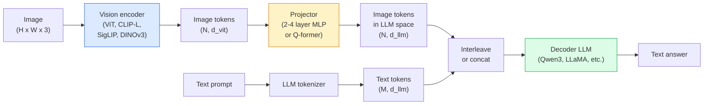

# مدل های زبان بینایی  الگوی ViT-MLP-LLM

> یک کدگر بینایی یک تصویر را به توکن ها تبدیل می کند. یک پروژکتور MLP آن توکن ها را در فضای گنجانده LLM نقشه می کشد. یک مدل زبان بقیه را انجام می دهد. این الگوی  ViT-MLP-LLM  هر تولید VLM در سال 2026 است.

**Type:** Learn + Use
**Languages:** Python
**Prerequisites:** Phase 4 Lesson 14 (ViT), Phase 4 Lesson 18 (CLIP), Phase 7 Lesson 02 (Self-Attention)
**Time:** ~75 minutes

## اهداف یادگیری

- معماری ViT-MLP-LLM را بیان کنید و توضیح دهید که هر یک از سه جزء چه نقش ای دارند
- مقایسه Qwen3-VL، InternVL3.5، LLaVA-Next و GLM-4.6V در شمارش پارامتر، طول زمینه و عملکرد معیار
- توضیح دهید DeepStack: چرا ویژگی های ViT چند سطح موازی زبان بینایی را بهتر از یک ویژگی لایه آخر سخت می کنند
- هالوسیژن VLM را با نرخ خطا متقابل (CMER) در تولید اندازه گیری کنید و بر روی سیگنال عمل کنید

## مشکل

CLIP (فاز 4 درس 18) به شما فضای ادغام مشترک برای تصاویر و متن می دهد که برای طبقه بندی صفر شوت و بازیافت کافی است. این نمی تواند به "چقدر ماشین های قرمز در این تصویر هستند؟" پاسخ دهد زیرا CLIP متن تولید نمی کند  فقط شباهت را نمره می دهد.

مدل های زبان دید (VLM)  Qwen3-VL, InternVL3.5, LLaVA-Next, GLM-4.6V  یک کدگر تصویر خانواده CLIP را به یک مدل زبان کامل تبدیل می کند. مدل یک تصویر به همراه یک سوال را می بیند و پاسخ را تولید می کند. در سال 2026 VLM های منبع باز در زمینه معیار های چند مدل (MMMU، MMBench، DocVQA، ChartQA، MathVista، OSWorld) رقابت یا شکست می دهند.

سه قطعه (ViT، پروژکتور، LLM) استاندارد است. تفاوت بین مدل ها در مورد ViT، کدام پروژکتور، کدام LLM، داده های آموزش و دستورالعملی است. هنگامی که شما الگوی را درک می کنید، تعویض هر قطعه مکانیکی است.

## مفهوم

### معماری ViT-MLP-LLM



1. **Vision encoder** یک ViT پیش از آموزش (CLIP-L/14, SigLIP, DINOv3 یا یک نوع دقیق) تولید می کند.
2. **Projector** یک ماژول کوچک (2-4 لایه MLP، یا Q-former) که نشان های بینایی را به ابعاد گنجانده شدن LLM نقشه می زند. این جایی است که بیشتر تنظیمات دقیق اتفاق می افتد.
3. **LLM** یک مدل زبان فقط برای کادر (Qwen3, Llama, Mistral, GLM, InternLM) ، نشان های بینایی + متن را در ترتیب می خواند و متن تولید می کند.

در اصل، هر سه قطعه قابل آموزش هستند. در عمل، کدر بینایی و LLM عمدتاً منجمد می مانند در حالی که پروژکتور چند میلیارد پارامتر سیگنال را به ارزان تر می کند.

### "پایز"

پروژکتور ونیلا تنها آخرین لایه ViT را استفاده می کند. نمونه های DeepStack (Qwen3-VL) از عمق های متعدد ViT برخوردار هستند و آنها را دسته بندی می کنند. لایه های عمیق تر سیمانیک سطح بالا را حمل می کنند؛ لایه های کم عمق اطلاعات فضایی و بافتی را حمل می کنند. تغذیه هر دو به LLM شکاف بین "چه چیزی تصویر حاوی است" (سمانیک) و "چه جایی دقیقا" (زمین فضایی) را می پوشاند.

### سه مرحله آموزش

VLM های مدرن به مراحل مختلف آموزش می دهند:

1. **Alignment** یخ زد ViT و LLM. فقط پروژکتور را در جفتان تصویر-تکلیف آموزش می دهد. پروژکتور را به نقشه برداری فضای بینایی به فضای زبان آموزش می دهد.
2. **Pre-training** همه چیز را از یخ زدایی کنید. آموزش بر روی داده های تصویر و متن در مقیاس بزرگ (500 میلیون زوج) ، دانش بصری مدل را ایجاد می کند.
3. **Instruction tuning** تنظیم دقیق در سه مورد (تصاویر، سوال، پاسخ) آموزش می دهد. رفتار مکالمه و فرمت های کار. این چیزی است که باعث می شود یک "LM آگاه از دید" به یک دستیار قابل استفاده شود.

بیشتر تنظیمات خوب LoRA مرحله 3 را با مجموعه داده های کوچک برچسب گذاری می کنند.

### مقایسه خانواده مدل ( اوایل سال 2026)

| Model | Params | Vision encoder | LLM | Context | Strengths |
|-------|--------|----------------|-----|---------|-----------|
| Qwen3-VL-235B-A22B (MoE) | 235B (22B active) | custom ViT + DeepStack | Qwen3 | 256K | General SOTA, GUI agent |
| Qwen3-VL-30B-A3B (MoE) | 30B (3B active) | custom ViT + DeepStack | Qwen3 | 256K | Smaller MoE alternative |
| Qwen3-VL-8B (dense) | 8B | custom ViT | Qwen3 | 128K | Production dense default |
| InternVL3.5-38B | 38B | InternViT-6B | Qwen3 + GPT-OSS | 128K | Strong MMBench / MMVet |
| InternVL3.5-241B-A28B | 241B (28B active) | InternViT-6B | Qwen3 | 128K | Competitive with GPT-4o |
| LLaVA-Next 72B | 72B | SigLIP | Llama-3 | 32K | Open, easy to fine-tune |
| GLM-4.6V | ~70B | custom | GLM | 64K | Open-source, strong OCR |
| MiniCPM-V-2.6 | 8B | SigLIP | MiniCPM | 32K | Edge-friendly |

### عوامل بصری

Qwen3-VL-235B به بالاترین عملکرد جهانی در OSWorld رسید  یک معیار برای **visual agents**این مدل یک صفحه نمایش را می بیند، UI را درک می کند و اقدامات (کلیک، تایپ، اسکرول) را ارسال می کند. همراه با ابزارها، این حلقه را در وظایف معمول دسکتاپ می کند. این چیزی است که اکثر 2026 "AI PC" دمو تحت هود اجرا می کند.

### قابلیت های عامل + انواع RoPE

و ام اس باید بدونند**when**Qwen3-VL از T-RoPE (توابع چرخش موقتی) به **text-based time alignment** توکن های متن مهر زمانی صریح با فریم های ویدیویی متقابل. مدل می بیند "`<timestamp 00:32>`"در چارچوب، سریع" و می تواند در مورد روابط زمانی استدلال کند.

### مشکل تعادل

۱۲ درصد از جفت های تصویر و متن در مجموعه داده های جستجو شده حاوی توضیحات نیست که به طور کامل در تصویر پایه گذاری شده است. یک VLM آموزش دیده در این حالت به طور خاموش یاد می گیرد تا هالوسینت ها را ایجاد کند  اشیاء را درست کنید، اعداد را اشتباه بخوانید، روابط را اختراع کنید. در تولید این حالت شکست غالب است.

اسکای ورک.ای معرفی کرد**Cross-Modal Error Rate (CMER)**برای ردیابی:

```
CMER = fraction of outputs where the text confidence is high but the image-text similarity (via a CLIP-family checker) is low
```

CMER بالا به این معنی است که مدل با اطمینان چیزهایی را می گوید که بر اساس تصویر نیست. نظارت بر CMER و درمان آن به عنوان یک KPI تولید میزان توهم را در انتشار خود تا 35٪ کاهش می دهد. ترفند "تثبیت مدل" نیست بلکه "راه تولیدات CMER بالا به بررسی انسانی است".

### تنظیم دقیق با LoRA / QLoRA

تنظیم کامل یک VLM 70B برای اکثر تیم ها در دسترس نیست. LoRA (در رتبه 16-64) در لایه های توجه + پروژکتور، یا QLoRA با وزن پایه 4 بیت، مناسب به یک A100 / H100 است. هزینه: 5,000-50,000 نمونه، $100-$5000 تو حساب، 2-10 ساعت آموزش

### منطق فضایی هنوز ضعیف است

VLM های فعلی 50-60% در معیار های منطق فضایی (از بالا به پایین، چپ به راست، شمارش، فاصله) امتیاز می دهند. اگر مورد استفاده شما بستگی به "چه شی روی چه چیزی است" دارد، به شدت تایید کنید  عملکرد VLM عمومی کمتر از انسانی است. گزینه های بهتر از VLM برای وظایف فضایی خالص: یک تخمین دهنده کلید / پوز تخصصی، یک مدل عمق، یا یک مدل تشخیص با هندسه جعبه پس از پردازش.

```figure
v4-vlm-projector
```

## آن را بسازید

### مرحله اول: پروژکتور

بخشي که اغلب تمرین ميکني 2-4 لایه MLP با GELU

```python
import torch
import torch.nn as nn


class Projector(nn.Module):
    def __init__(self, vit_dim=768, llm_dim=4096, hidden=4096):
        super().__init__()
        self.net = nn.Sequential(
            nn.Linear(vit_dim, hidden),
            nn.GELU(),
            nn.Linear(hidden, llm_dim),
        )

    def forward(self, x):
        return self.net(x)
```

ورودی یک`(N_patches, d_vit)`تنسور نماديه.`(N_patches, d_llm)`. ماجراجراجراجراجراجراجراجراجراجراجراجراجراجراجراجراجراجراجراجراجراجراجراجراجراجراجراجراجراجراجراجرا

### مرحله دوم: جمع آوری ViT-MLP-LLM از انتهای تا انتهای

اسکلت از گذرگاه جلو برای حداقل VLM`transformers`این طرح مفهومی است.

```python
class MinimalVLM(nn.Module):
    def __init__(self, vit, projector, llm, image_token_id):
        super().__init__()
        self.vit = vit
        self.projector = projector
        self.llm = llm
        self.image_token_id = image_token_id  # placeholder token in text prompt

    def forward(self, image, input_ids, attention_mask):
        # 1. vision features
        vision_tokens = self.vit(image)                     # (B, N_patches, d_vit)
        vision_embeds = self.projector(vision_tokens)       # (B, N_patches, d_llm)

        # 2. text embeddings
        text_embeds = self.llm.get_input_embeddings()(input_ids)  # (B, M, d_llm)

        # 3. replace image placeholder tokens with vision embeds
        merged = self._merge(text_embeds, vision_embeds, input_ids)

        # 4. run LLM
        return self.llm(inputs_embeds=merged, attention_mask=attention_mask)

    def _merge(self, text_embeds, vision_embeds, input_ids):
        out = text_embeds.clone()
        expected = vision_embeds.size(1)
        for b in range(input_ids.size(0)):
            positions = (input_ids[b] == self.image_token_id).nonzero(as_tuple=True)[0]
            if len(positions) != expected:
                raise ValueError(
                    f"batch item {b} has {len(positions)} image tokens but vision_embeds has {expected} patches."
                    " Every sample in the batch must be pre-padded to the same number of image placeholder tokens.")
            out[b, positions] = vision_embeds[b]
        return out
```

.`<image>`توکن جای گیرنده در متن با تصاویر واقعی جایگزین می شود  استفاده از الگوی LLaVA، Qwen-VL و InternVL.

### مرحله 3: محاسبه CMER

يه چک زمان اجرا سبک وزن

```python
import torch.nn.functional as F


def cross_modal_error_rate(image_emb, text_emb, text_confidence, sim_threshold=0.25, conf_threshold=0.8):
    """
    image_emb, text_emb: embeddings of image and generated text (normalised internally)
    text_confidence:     mean per-token probability in [0, 1]
    Returns:             fraction of high-confidence outputs with low image-text alignment
    """
    image_emb = F.normalize(image_emb, dim=-1)
    text_emb = F.normalize(text_emb, dim=-1)
    sim = (image_emb * text_emb).sum(dim=-1)        # cosine similarity
    high_conf_low_sim = (text_confidence > conf_threshold) & (sim < sim_threshold)
    return high_conf_low_sim.float().mean().item()
```

CMER را به عنوان KPI تولید در نظر بگیرید. آن را به هر نقطه پایان، به هر نوع پرامپ، به هر مشتری نظارت کنید. افزایش CMER نشان می دهد که مدل شروع به توهم در برخی از توزیع ورودی می کند.

### مرحله 4: طبقه بندی کننده VLM اسباب بازی (در حال اجرا)

قطار هاي پروژکتور رو نشان بده "فروش هاي وي تي" جوري وارد ميشه، يه رمز کوچولو به سبک LLM پيش بيني يه کلاس ميکنه

```python
class ToyVLM(nn.Module):
    def __init__(self, vit_dim=32, llm_dim=64, num_classes=5):
        super().__init__()
        self.projector = Projector(vit_dim, llm_dim, hidden=64)
        self.head = nn.Linear(llm_dim, num_classes)

    def forward(self, vision_tokens):
        projected = self.projector(vision_tokens)
        pooled = projected.mean(dim=1)
        return self.head(pooled)
```

می توان این را در جفت های مصنوعی (صف، کلاس) در کمتر از 200 مرحله  کافی برای نشان دادن عملکرد الگوی پروژکتور قرار داد.

## ازش استفاده کن

سه راه تولید تیم ها VLM ها را در سال 2026 استفاده می کنند:

- **Hosted API** OpenAI Vision، Anthropic Claude Vision، Google Gemini Vision. صفر زیربنایی، خطر فروشنده.
- **Open-source self-host** Qwen3-VL یا InternVL3.5 از طریق `transformers`و`vllm`کنترل کامل، تلاش بالا در جلو
- **Fine-tune on domain** بار Qwen2.5-VL-7B یا LLaVA-1.6-7B، LoRA در 5k-50k نمونه سفارشی، خدمت با `vllm`یا`TGI`. .

```python
from transformers import AutoProcessor, AutoModelForVision2Seq
import torch
from PIL import Image

model_id = "Qwen/Qwen3-VL-8B-Instruct"
processor = AutoProcessor.from_pretrained(model_id)
model = AutoModelForVision2Seq.from_pretrained(model_id, torch_dtype=torch.bfloat16, device_map="auto")

messages = [{
    "role": "user",
    "content": [
        {"type": "image", "image": Image.open("plot.png")},
        {"type": "text", "text": "What does this chart show?"},
    ],
}]
inputs = processor.apply_chat_template(messages, add_generation_prompt=True, tokenize=True, return_dict=True, return_tensors="pt").to("cuda")
generated = model.generate(**inputs, max_new_tokens=256)
answer = processor.decode(generated[0][inputs["input_ids"].shape[1]:], skip_special_tokens=True)
```

`apply_chat_template`پنهان ميکنه`<image>`توکن های جای گیرنده؛ مدل ادغام را در داخل انجام می دهد.

## -باده

این درس نتیجه می دهد:

- `outputs/prompt-vlm-selector.md` Qwen3-VL / InternVL3.5 / LLaVA-Next / API را با توجه به دقت، تاخیر، طول زمینه و بودجه انتخاب می کند.
- `outputs/skill-cmer-monitor.md` کد را برای ابزار یک نقطه انتهای VLM تولید با نرخ خطا متقابل مودا، داشبورد های هر نقطه انتهای و آستانه های هشدار دهنده صادر می کند.

## تمرینات

1. **(Easy)**سه پیامک ("این چیست؟"، "تعداد اشیاء"، "تصاویر صحنه") را از طریق هر VLM باز در پنج تصویر اجرا کنید. هر پاسخ را به عنوان درست / تا حدی درست / توهم به دست نشان دهید. نرخ CMER مانند گذر اول را محاسبه کنید.
2. **(Medium)**Qwen2.5-VL-3B یا LLaVA-1.6-7B را با LoRA (در رتبه 16) در 500 تصویر از یک دامنه هدف با عنوان مقایسه کنید. دقت صفر عکس در مقابل دقیق MMBench.
3. **(Hard)**کدگر تصویر VLM را به جای SigLIP / CLIP پیش فرض DINOv3 جایگزین کنید. فقط پروژکتور را (LLM یخ زده + DINOv3 یخ زده) دوباره آموزش دهید. اندازه گیری کنید که آیا وظایف پیش بینی کثافت (حساب، استدلال فضایی) بهبود می یابند.

## اصطلاحات کلیدی

| Term | What people say | What it actually means |
|------|----------------|----------------------|
| ViT-MLP-LLM | "The VLM pattern" | Vision encoder + projector + language model; every 2026 VLM |
| Projector | "The bridge" | 2-4 layer MLP (or Q-former) that maps vision tokens into LLM embedding space |
| DeepStack | "Qwen3-VL feature trick" | Multi-level ViT features stacked rather than last-layer only |
| Image token | "<image> placeholder" | Special token in the text stream replaced by projected vision embeddings |
| CMER | "Hallucination KPI" | Cross-Modal Error Rate; high when text confidence is high but image-text similarity is low |
| Visual agent | "VLM that clicks" | VLM operating GUIs (OSWorld, mobile, web) with tool calls |
| Q-former | "Fixed-count token bridge" | BLIP-2 style projector producing a fixed number of visual query tokens |
| Alignment / pre-training / instruction tuning | "Three stages" | Standard VLM training pipeline |

## خواندن بیشتر

- [Qwen3-VL Technical Report (arXiv 2511.21631)](https://arxiv.org/abs/2511.21631)
- [InternVL3.5 Advancing Open-Source Multimodal Models (arXiv 2508.18265)](https://arxiv.org/html/2508.18265v1)
- [LLaVA-Next series](https://llava-vl.github.io/blog/2024-05-10-llava-next-stronger-llms/)
- [BentoML: Best Open-Source VLMs 2026](https://www.bentoml.com/blog/multimodal-ai-a-guide-to-open-source-vision-language-models)
- [MMMU: Multi-discipline Multimodal Understanding benchmark](https://mmmu-benchmark.github.io/)
- [VLMs in manufacturing (Robotics Tomorrow, March 2026)](https://www.roboticstomorrow.com/story/2026/03/when-machines-learn-to-see-like-experts-the-rise-of-vision-language-models-in-manufacturing/26335/)
