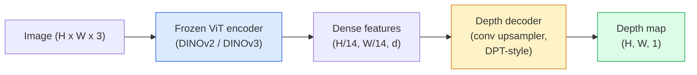

# عمق یک قطبی و تخمین هندسه

> نقشه عمق یک تصویر یک کانال است که هر پیکسل فاصله ای از دوربین دارد. پیش بینی آن از یک فریم RGB بدون استریو یا LiDAR غیرممکن بود. در سال 2026 یک کدگر ViT منجمد و یک سر سبک در حدود چند درصد حقیقت زمین قرار می گیرد.

**Type:** Build + Use
**Languages:** Python
**Prerequisites:** Phase 4 Lesson 14 (ViT), Phase 4 Lesson 17 (Self-Supervised Vision), Phase 4 Lesson 07 (U-Net)
**Time:** ~60 minutes

## اهداف یادگیری

- فاصله و حالت مربوط به عمق نسبت و متریک را که هر مدل تولید (MiDaS، Marigold، Depth Anything V3، ZoeDepth) حل می کند، تشخیص دهید
- با استفاده از عمق هر چیزی V3 (DINOv2 ستون فقرات) برای پیش بینی عمق برای تصاویر تعسفی بدون کالیبریشن
- توضیح دهید که چرا عمق یک قطب از یک تصویر (نشان های چشم انداز، گرادینت بافت، سابقه های آموخته) و آنچه که نمی تواند بازیافت کند (سکیل مطلق، هندسه پوشیده)
- ارتقاء تشخیص 2D به نقاط 3D با استفاده از نقشه عمق و ویژگی های دوربین سوراخ

## مشکل

عمق محور گمشده در بینشی دو بعدی کامپیوتر است. با توجه به RGB، شما می دانید که چیزها در سطح تصویر کجا ظاهر می شوند؛ شما نمی دانید چقدر دور هستند. سنسورهای عمق (استریو تراژ، LiDAR، زمان پرواز) این مسئله را مستقیماً حل می کنند اما گران و شکننده و محدوده محدودی هستند.

تخمین عمق یک قطبی  پیش بینی عمق از یک قاب RGB  برای تولید خروجی مبهم و غیر قابل اعتماد استفاده می شود. تا سال 2026 کدرهای بزرگ پیش از آموزش این را تغییر دادند: Depth Anything V3 از یک ستون فقرات DINOv2 منجمد استفاده می کند و نقشه های عمق را تولید می کند که در سراسر دامنه های داخلی، بیرونی، پزشکی و ماهواره ای عمومی می شوند. مارگولد عمق را به عنوان یک مشکل انتشار مشروط تغییر شکل می دهد. زويديپث فاصله هاي متريک واقعي را بازپس ميکنه

عمق همچنین پل بین تشخیص 2D و درک 3D است: پیکسل های یک جعبه کشف شده را با عمق ضرب کنید و شما اشیاء 2D را به یک ابر نقطه 3D بالا می برید. این هسته هر سیستم محصور AR، هر لوله جلوگیری از موانع و هر ربات "پاک را بالا ببرید".

## مفهوم

### عمق نسبت به متریک

- **Relative depth** سفارش داده شده `z`"پیکسل A نزدیک تر از پیکسل B است، اما نسبت فاصله ها به متر نهفته نیست".
- **Metric depth** فاصله مطلق در متر از دوربین. نیاز به مدل برای یادگیری رابطه آماری بین نشانه های تصویر و فاصله واقعی است.

MiDaS و Depth Anything V3 عمق نسبی تولید می کنند. Marigold عمق نسبی تولید می کند. ZoeDepth، UniDepth و Metric3D عمق متریکی تولید می کنند. مدل های متریکی نسبت به ویژگی های داخلی دوربین حساس هستند؛ مدل های نسبی نیستند.

### الگوی کدگذاری و کدگذاری



Deep Anything V3 کدگر را منجمد می کند و تنها کدگر سبک DPT را آموزش می دهد. کدگر ویژگی های غنی را فراهم می کند؛ کدگر آنها را به رزولوشن تصویر بازمی گرداند و عمق را کاهش می دهد.

### چرا یک تصویر عمق را به وجود می آورد

یک تصویر ۲ بعدی حاوی بسیاری از نشانه های یک منظره ای است که با عمق ارتباط دارند:

- **Perspective** خطوط موازی در 3D در 2D به هم می رسند.
- **Texture gradient** سطوح دور دارای بافت کوچکتر و چگالی تر هستند.
- **Occlusion order** اجسام نزدیک تر اجسام دورتر را از خود دور می کنند.
- **Size constancy** اشیاء شناخته شده (ماشین ها، انسان ها) مقیاس نزدیک را می دهند.
- **Atmospheric perspective** اجسام دور در صحنه های بیرونی، ابری تر و آبی تر به نظر می رسند.

یک ViT که با استفاده از میلیاردها تصویر آموزش دیده است این نشانه ها را درون خود می گیرد. با داده های کافی و یک ستون فقرات قوی، عمق یک قطبی بدون هیچ نظارت 3D صریح، به دقت قابل توجهی می رسد.

### عمق یک منظره چه کاری نمیتونه بکنه

- **Absolute metric scale**بدون وجود ذاتی یا یک شی شناخته شده در صحنه. شبکه می تواند پیش بینی کند "کاپ دو برابر از قاشق فاصله دارد" بدون دانستن اینکه آیا جام 1 متر یا 10 متر فاصله دارد.
- **Occluded geometry**پشت صندلی ناآگاه است و نمی توان به طور قابل اعتماد نتیجه گیری کرد.
- **Truly untextured / reflective surfaces**آینه ها، شیشه، دیوارهای یکسره. شبکه عمق قابل قبول اما اشتباه را گزارش می دهد.

### عمق هرچیز V3 در 2026

- وانیل DINOv2 ViT-L/14 به عنوان کدگر (مبرد)
- دیکوتر DPT
- آموزش داده شده در روی جفت عکس های نمایش داده شده از منابع مختلف (هیچ نظارت عمق صریحی فراتر از ثبات فوتومیتری لازم نیست).
- هندسه ي منطقي مطابق با فضا از **an arbitrary number of visual inputs, with or without known camera poses**. .
- SOTA در عمق یک منظره، هندسه هر منظره، نمایش بصری، تخمین وضع دوربین.

این مدل افتادن برای زمانی که به عمق نیاز دارید در سال 2026 است.

### مارگولد  انتشار برای عمق

مارگولد (Ke et al., CVPR 2024) تخمین عمق را به عنوان انتشار مشروط تصویر به تصویر تغییر شکل می دهد. شرایط: RGB. هدف: نقشه عمق. از یک شبکه U-Net Stable Diffusion 2 پیش از آموزش به عنوان ستون فقرات استفاده می کند. نقشه عمق محصول در مرزهای شی بسیار تیز است. تجارت: نتیجه گیری کند تر از مدل های پیشروی (10-50 مرحله انکار).

### ویژگی های داخلی و دوربین سوراخ

برای بلند کردن یک پیکسل`(u, v)`با عمق`d`به نقطه 3D`(X, Y, Z)`در هماهنگی دوربین:

```
fx, fy, cx, cy = camera intrinsics
X = (u - cx) * d / fx
Y = (v - cy) * d / fy
Z = d
```

درونی از متاداتا EXIF، یک الگوی کالیبریشن یا یک تخمین دهنده داخلی یکپارچه (Perspective Fields، UniDepth) می آید. بدون درونی، شما هنوز هم می توانید یک ابر نقطه ای را با فرض یک 60-70 درجه FOV و اصول با وضوح متوسط  برای تصویربرداری استفاده کنید، نه برای اندازه گیری.

### ارزیابی

دو متریک استاندارد:

- **AbsRel**(خطای نسبی مطلق): `mean(|d_pred - d_gt| / d_gt)`. پایین تر بهتره . 0.05 - 0.1 برای مدل های تولید
- **delta < 1.25**(درست بودن حد): کسری از پیکسل ها که `max(d_pred/d_gt, d_gt/d_pred) < 1.25`. بالاتر بهتره . 0.9+ براي سوتا

برای عمق نسبی (Depth Anything V3، MiDaS) ، ارزیابی از نسخه های غیر متغیر مقیاس و تغییر هر دو متریک استفاده می کند.

```figure
depth-sweep
```

## آن را بسازید

### مرحله ی اول: اندازه گیری عمق

```python
import torch

def abs_rel_error(pred, target, mask=None):
    if mask is not None:
        pred = pred[mask]
        target = target[mask]
    return (torch.abs(pred - target) / target.clamp(min=1e-6)).mean().item()


def delta_accuracy(pred, target, threshold=1.25, mask=None):
    if mask is not None:
        pred = pred[mask]
        target = target[mask]
    ratio = torch.maximum(pred / target.clamp(min=1e-6), target / pred.clamp(min=1e-6))
    return (ratio < threshold).float().mean().item()
```

همیشه قبل از ارزیابی پیکسل های عمق غیرفعال (صفر، NaN، اشباع) را مسک کنید.

### مرحله دوم: هماهنگی مقیاس و تغییر

برای مدل های عمق نسبی، پیش بینی را با حقیقت پایه قبل از محاسبه متریک ها هماهنگ کنید.`a * pred + b = target`:

```python
def align_scale_shift(pred, target, mask=None):
    if mask is not None:
        p = pred[mask]
        t = target[mask]
    else:
        p = pred.flatten()
        t = target.flatten()
    A = torch.stack([p, torch.ones_like(p)], dim=1)
    coeffs, *_ = torch.linalg.lstsq(A, t.unsqueeze(-1))
    a, b = coeffs[:2, 0]
    return a * pred + b
```

فرار کن`align_scale_shift`قبل از`abs_rel_error`در هنگام ارزیابی MiDaS / عمق هر چیزی.

### مرحله سوم: عمق را به ابر نقطه ای بالا ببرید

```python
import numpy as np

def depth_to_point_cloud(depth, intrinsics):
    H, W = depth.shape
    fx, fy, cx, cy = intrinsics
    v, u = np.meshgrid(np.arange(H), np.arange(W), indexing="ij")
    z = depth
    x = (u - cx) * z / fx
    y = (v - cy) * z / fy
    return np.stack([x, y, z], axis=-1)


depth = np.random.uniform(0.5, 4.0, (240, 320))
intr = (320.0, 320.0, 160.0, 120.0)
pc = depth_to_point_cloud(depth, intr)
print(f"point cloud shape: {pc.shape}  (H, W, 3)")
```

هر برنامه ي 3D بالا رفته يه تابع داره.`.ply`و در MeshLab یا CloudCompare باز شود.

### مرحله 4: آزمایش دود با صحنه عمق مصنوعی

```python
def synthetic_depth(size=96):
    yy, xx = np.meshgrid(np.arange(size), np.arange(size), indexing="ij")
    # Floor: linear gradient from near (top) to far (bottom)
    depth = 1.0 + (yy / size) * 4.0
    # Box in the middle: closer
    mask = (np.abs(xx - size / 2) < size / 6) & (np.abs(yy - size * 0.6) < size / 6)
    depth[mask] = 2.0
    return depth.astype(np.float32)


gt = torch.from_numpy(synthetic_depth(96))
pred = gt + 0.3 * torch.randn_like(gt)  # simulated prediction
aligned = align_scale_shift(pred, gt)
print(f"before align  absRel = {abs_rel_error(pred, gt):.3f}")
print(f"after align   absRel = {abs_rel_error(aligned, gt):.3f}")
```

### مرحله 5: عمق هرچیزی استفاده V2 (رجعت)

```python
import numpy as np
from transformers import pipeline
from PIL import Image

pipe = pipeline(task="depth-estimation", model="depth-anything/Depth-Anything-V2-Large-hf")

image = Image.open("street.jpg").convert("RGB")
out = pipe(image)
depth_np = np.array(out["depth"])
```

سه خط`out["depth"]`در این خط لوله، چیزی در عمق 3 (نومبر 2025) بار نمی کشد. آن خود را ارسال می کند `depth_anything_3`بسته: `DepthAnything3.from_pretrained("depth-anything/DA3MONO-LARGE")`مدل یک شکل نسبت به یک شکل را بارگذاری می کند و`model.inference(images).depth`یک `[N, H, W]`مجموعه عمق

## ازش استفاده کن

- **Depth Anything V3**(Meta AI / ByteDance، 2024-2026)  پیش فرض برای عمق نسبی. سریع ترین مدل VIT-پیچ بزرگ در تولید.
- **Marigold**(ETH، 2024)  بالاترین کیفیت بصری، نتیجه گیری کند.
- **UniDepth**(ETH، 2024)  عمق متریکی با تخمین درونی دوربین.
- **ZoeDepth**(Intel، 2023)  عمق متریکی؛ قدیمی تر، هنوز قابل اعتماد است.
- **MiDaS v3.1** میراث اما پایدار؛ پایه خوبی برای مقایسه.

الگوی ادغام معمولی:

1. قاب RGB داره میره
2. مدل عمق نقشه عمق را تولید می کند.
3. ديتکتور جعبه اي رو مياره
4. مرکزهای جعبه را از طریق عمق به 3D بالا ببرید؛ اگر در دسترس باشد با ابر نقطه ای ترکیب شوید.
5. زیر جریان: آکلوژن AR، برنامه ریزی مسیر، تخمین اندازه اشیاء، جایگزینی استریو.

برای استفاده در زمان واقعی، Depth Anything V2 Small (INT8 کوانتز) در GPU مصرف کننده در 518x518 ~ 30 fps را می کشد.

## -باده

این درس نتیجه می دهد:

- `outputs/prompt-depth-model-picker.md` انتخاب بین Depth Anything V3، Marigold، UniDepth، MiDaS به دلیل تاخیر، نیاز متریک به نسبت، و نوع صحنه.
- `outputs/skill-depth-to-pointcloud.md` یک مهارت که از نقشه های عمق با مدیریت و صادرات راستین در جهت استفاده از ابر نقطه ای ایجاد می کند.`.ply`. .

## تمرینات

1. **(Easy)**عمق هر چیزی V2 را در هر 10 تصویر میز خود اجرا کنید. عمق را به عنوان PNG های خاکستری ذخیره کنید و بررسی کنید. یک شی را شناسایی کنید که عمق پیش بینی شده آن اشتباه است و توضیح دهید که چرا سیگنال های یک منظره شکست خورده است.
2. **(Medium)**با توجه به RGB + عمق از عمق هرچیز V2، به یک ابر نقطه ای بالا ببرید و با `open3d`دو صحنه (در داخل / بیرون) را مقایسه کنید و توجه کنید که کدام یک قابل باور تر است.
3. **(Hard)**پنج جفت تصویر را بگیرید که تنها با موقعیت یک شیء شناخته شده متفاوت هستند (به عنوان مثال بطری 30 سانتی متر نزدیک تر حرکت کرد). برای پیش بینی عمق متریکی در هر دو استفاده کنید. دلتای فاصله پیش بینی شده در مقابل 30 سانتی متر واقعی را گزارش کنید.

## اصطلاحات کلیدی

| Term | What people say | What it actually means |
|------|----------------|----------------------|
| Monocular depth | "Single-image depth" | Depth estimation from one RGB frame, no stereo or LiDAR |
| Relative depth | "Ordered depth" | Ordered z-values without real-world units |
| Metric depth | "Absolute distance" | Depth in metres; requires calibration or a model trained with metric supervision |
| AbsRel | "Absolute relative error" | Mean of |d_pred - d_gt| / d_gt; standard depth metric |
| Delta accuracy | "delta < 1.25" | Fraction of pixels with prediction within 25% of ground truth |
| Pinhole camera | "fx, fy, cx, cy" | The camera model used to lift (u, v, d) to (X, Y, Z) |
| DPT | "Dense Prediction Transformer" | The conv-based decoder used on top of frozen ViT encoders for depth |
| DINOv2 backbone | "The reason it works" | Self-supervised features that generalise across domains without depth labels |

## خواندن بیشتر

- [Depth Anything V3 paper page](https://depth-anything.github.io/) عمق یک منظره SOTA با کدگر DINOv2
- [Marigold (Ke et al., CVPR 2024)](https://marigoldmonodepth.github.io/) تخمین عمق مبتنی بر انتشار
- [UniDepth (Piccinelli et al., 2024)](https://arxiv.org/abs/2403.18913) عمق متریکی با ویژگی های ذاتی
- [MiDaS v3.1 (Intel ISL)](https://github.com/isl-org/MiDaS) خط پایه عمق نسبی کانونیک
- [DINOv3 blog post (Meta)](https://ai.meta.com/blog/dinov3-self-supervised-vision-model/) خانواده کدرها که دقت عمق را افزایش می دهد
