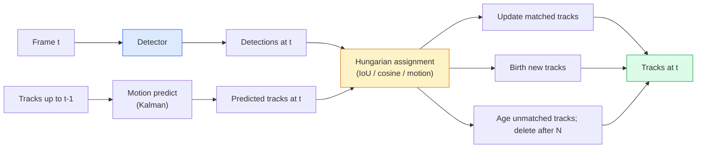

# ردیابی چند جسم و حافظه ویدیویی

> ردیابی تشخیص و ارتباط است. هر قاب را شناسایی کنید. ردیابی های این قاب را با ردیابی های آخرین قاب با شناسایی مقایسه کنید.

**Type:** Build
**Languages:** Python
**Prerequisites:** Phase 4 Lesson 06 (YOLO Detection), Phase 4 Lesson 08 (Mask R-CNN), Phase 4 Lesson 24 (SAM 3)
**Time:** ~60 minutes

## اهداف یادگیری

- ردیابی توسط تشخیص را از ردیابی مبتنی بر جستجو جدا کنید و نام خانواده های الگوریتم (SORT، DeepSORT، ByteTrack، BoT-SORT، ردیابی حافظه SAM 2، SAM 3.1 Object Multiplex) را نام دهید.
- اجرای IoU + وظیفه مجارستانی از ابتدا برای ردیابی با تشخیص کلاسیک
- بانک حافظه SAM 2 را توضیح دهید و چرا آن را بهتر از ارتباط مبتنی بر IoU کنترل می کند
- سه متریک ردیابی را بخوانید (MOTA، IDF1، HOTA) و انتخاب کنید که کدام یک برای یک مورد استفاده خاص مهم است

## مشکل

یک آشکارساز به شما می گوید که اشیاء در یک قاب کجا هستند. یک ردیاب به شما می گوید که تشخیص در قاب چیست.`t`همان شی با یک کشف در فریم است`t-1`بدون اين، نمي توني تعداد اجسامي که خط رو عبور ميکنن بشماري، يا از قبل از بازي از يك توپ پيروى کني، يا بدوني "ماشين شماره 4 8 ثانيه در راه بوده".

ردیابی برای هر محصولی که به ویدئو روی می دهد ضروری است: تجزیه و تحلیل ورزشی، نظارت، رانندگی خودکار، تجزیه و تحلیل ویدئو پزشکی، نظارت بر حیات وحش، شمارش کلمات. بلوک های اصلی ساختمانی به اشتراک گذاشته شده اند: یک آشکارساز هر فریم، یک مدل حرکت (فلتر Kalman یا چیزی غنی تر) ، یک مرحله ارتباط (الگواریسم مجارستانی در IoU / cosine / ویژگی های آموخته) و یک چرخه زندگی مسیر (ولاد، بروزرسانی، مرگ).

سال 2026 دو الگوی جدید به وجود آورد:**SAM 2 memory-based tracking**(تکلیف از ویژگی ها به جای ارتباط با مدل حرکت) و**SAM 3.1 Object Multiplex**این درس ابتدا راه را با راه های کلاسیک و سپس راه های مبتنی بر حافظه انجام می دهد.

## مفهوم

### ردیابی با شناسایی



هر ردیابی که در سال 2026 با آن ها روبرو می شوید، یک تغییر در این حلقه است. تفاوت ها:

- **SORT**(2016): فیلتر Kalman + IoU مجارستانی. ساده، سریع، بدون مدل ظاهر.
- **DeepSORT**(2017): SORT + یک ویژگی ظاهر مبتنی بر CNN در هر مسیر (شامل سازی ReID).
- **ByteTrack**(2021): تشخیص کم اعتماد به نفس را به عنوان مرحله دوم مرتبط می کند؛ هیچ ویژگی ظاهر مورد نیاز نیست اما عملکرد برتر در MOT17 است.
- **BoT-SORT**(2022): بایت + تعویض حرکت دوربین + ReID.
- **StrongSORT / OC-SORT** نسل های بایت تراک با حرکات و ظاهر بهتر

### فیلتر کلمن در یک پاراگراف

فیلتر کالمن حالت هر مسیر رو حفظ ميکنه`(x, y, w, h, dx, dy, dw, dh)`با یک همتای. در هر قاب،**predict**حالت با استفاده از یک مدل سرعت ثابت، پس از آن **update**این به روزرسانی بیشتر به تشخیص اعتماد می کند وقتی عدم اطمینان پیش بینی بالا است. این مسیرهای صاف و توانایی ادامه مسیر را از طریق یک محصور کوتاه (1-5 فریم) می دهد.

هر ردیاب کلاسیک از فیلتر کالمن در مرحله پیش بینی حرکت استفاده می کند.

### الگوریتم مجارستانی

به عنوان یک`M x N`ماترکس هزینه (راه های x تشخیص) ، یافتن یک به یک اختصاص که به حداقل رساندن هزینه های کل. هزینه معمولا `1 - IoU(track_bbox, detection_bbox)`یا شباهت منفی کوسین از ویژگی های ظاهر. زمان اجرا O(((M+N) ^3) است؛ برای M، N تا ~ 1000 این به اندازه کافی سریع است در پایتون از طریق `scipy.optimize.linear_sum_assignment`. .

### ایده اصلی بایت تراک

ردیاب های استاندارد تشخیص های کم اعتماد به نفس را (< 0.5) از بین می برند.**second-stage candidates**: پس از مطابقت مسیرها به تشخیص های با اطمینان بالا، مسیرهای بی نظیر سعی می کنند با تشخیص های با اعتماد به نفس پایین با یک حد کمی کمتر IoU مطابقت داشته باشند.

### ردیابی مبتنی بر حافظه SAM 2

SAM 2 با نگه داشتن یک **memory bank**در هر فریم، حافظه با ویژگی های فریم جدید به هم متصل می شود و decoder یک ماسک برای همان مثال در فریم جدید تولید می کند.

هيچ فيلتر "کالمان" و هيچ وظيفه مجري وجود نداره اين ارتباط در عمل توجه خاطره اي نقش داره

مزاياي:
- قابلیت مغلق سازی های بزرگ (هدايت حافظه هویت نمونه را در بسیاری از چادر ها حمل می کند).
- لغات باز در ترکیب با پیام های متن SAM 3
- بدون مدل حرکتی جداگانه کار می کنه

معایب:
- آهسته تر از بايت تراک براي تعقب چندتايي
- بانک حافظه رشد می کند، پنجره زمینه را محدود می کند.

### SAM 3.1 چندگانه اشیاء

ردیابی SAM 2 / SAM 3 قبلی یک بانک حافظه جداگانه را در هر نمونه نگه می دارد. برای 50 شی، 50 بانک حافظه. Object Multiplex (مارس 2026) آنها را به یک حافظه مشترک با **per-instance query tokens**. مقیاس هزینه ها در تعداد موارد زیر خطی است.

چندگونی، پیش فرض جدید برای ردیابی جمعیت در سال 2026 است: جمعیت کنسرت، کارگران انبار، تقاطع ترافیک.

### سه متریک که باید بدانید

- **MOTA (Multi-Object Tracking Accuracy)** 1 - (FN + FP + ID سوئیچ) / GT. وزن شده توسط نوع خطا؛ یک متریک واحد که تشخیص و اختلالات ارتباط را ترکیب می کند.
- **IDF1 (ID F1)** متوسط هماهنگ دقت و بازپس گرفتن ID. به طور خاص بر این تمرکز می کند که هر مسیر حقیقت زمینی چگونه به طور دقیق ID خود را در طول زمان حفظ می کند. بهتر از MOTA برای وظایف حساس به سوئیچ ID.
- **HOTA (Higher Order Tracking Accuracy)** به دقت تشخیص (DetA) و دقت ارتباط (AssA) تجزیه می شود. استاندارد جامعه از سال 2020؛ جامع ترین است.

برای نظارت (چه کسی است که): IDF1 چیزی است که شما گزارش می دهید. برای تحلیل ورزشی (پاس حساب): HOTA. برای مقایسه عمومی دانشگاهی: HOTA.

```figure
cv3-track-assoc
```

## آن را بسازید

### مرحله ی اول: ماتریس هزینه مبتنی بر IoU

```python
import numpy as np


def bbox_iou(a, b):
    """
    a, b: (N, 4) arrays of [x1, y1, x2, y2].
    Returns (N_a, N_b) IoU matrix.
    """
    ax1, ay1, ax2, ay2 = a[:, 0], a[:, 1], a[:, 2], a[:, 3]
    bx1, by1, bx2, by2 = b[:, 0], b[:, 1], b[:, 2], b[:, 3]
    inter_x1 = np.maximum(ax1[:, None], bx1[None, :])
    inter_y1 = np.maximum(ay1[:, None], by1[None, :])
    inter_x2 = np.minimum(ax2[:, None], bx2[None, :])
    inter_y2 = np.minimum(ay2[:, None], by2[None, :])
    inter = np.clip(inter_x2 - inter_x1, 0, None) * np.clip(inter_y2 - inter_y1, 0, None)
    area_a = (ax2 - ax1) * (ay2 - ay1)
    area_b = (bx2 - bx1) * (by2 - by1)
    union = area_a[:, None] + area_b[None, :] - inter
    return inter / np.clip(union, 1e-8, None)
```

### مرحله دوم: ردیاب سبک SORT حداقل

ثابت سرعت ثابت Kalman حذف برای کوتاه بودن  ما در اینجا یک ارتباط IoU ساده استفاده می کنیم؛ در تولید پیش بینی Kalman ضروری است.`sort`بسته های پایتون نسخه کامل را ارائه می دهند.

```python
from scipy.optimize import linear_sum_assignment


class Track:
    def __init__(self, tid, bbox, frame):
        self.id = tid
        self.bbox = bbox
        self.last_frame = frame
        self.hits = 1

    def update(self, bbox, frame):
        self.bbox = bbox
        self.last_frame = frame
        self.hits += 1


class SimpleTracker:
    def __init__(self, iou_threshold=0.3, max_age=5):
        self.tracks = []
        self.next_id = 1
        self.iou_threshold = iou_threshold
        self.max_age = max_age

    def step(self, detections, frame):
        if not self.tracks:
            for d in detections:
                self.tracks.append(Track(self.next_id, d, frame))
                self.next_id += 1
            return [(t.id, t.bbox) for t in self.tracks]

        track_boxes = np.array([t.bbox for t in self.tracks])
        det_boxes = np.array(detections) if len(detections) else np.empty((0, 4))

        iou = bbox_iou(track_boxes, det_boxes) if len(det_boxes) else np.zeros((len(track_boxes), 0))
        cost = 1 - iou
        cost[iou < self.iou_threshold] = 1e6

        matched_track = set()
        matched_det = set()
        if cost.size > 0:
            row, col = linear_sum_assignment(cost)
            for r, c in zip(row, col):
                if cost[r, c] < 1.0:
                    self.tracks[r].update(det_boxes[c], frame)
                    matched_track.add(r); matched_det.add(c)

        for i, d in enumerate(det_boxes):
            if i not in matched_det:
                self.tracks.append(Track(self.next_id, d, frame))
                self.next_id += 1

        self.tracks = [t for t in self.tracks if frame - t.last_frame <= self.max_age]
        return [(t.id, t.bbox) for t in self.tracks]
```

60 خط. از هر قاب بازيابي ميکنه، از هر قاب پيچيده بازي ميکنه. سيستم هاي واقعي پيش بيني "کالمان" رو اضافه ميکنه، بازيابي مرحله دوم بايت تراک و ویژگی هاي ظاهر

### مرحله سوم: آزمایش مسیر مصنوعی

```python
def synthetic_frames(num_frames=20, num_objects=3, H=240, W=320, seed=0):
    rng = np.random.default_rng(seed)
    starts = rng.uniform(20, 200, size=(num_objects, 2))
    velocities = rng.uniform(-5, 5, size=(num_objects, 2))
    frames = []
    for f in range(num_frames):
        dets = []
        for i in range(num_objects):
            cx, cy = starts[i] + f * velocities[i]
            dets.append([cx - 10, cy - 10, cx + 10, cy + 10])
        frames.append(dets)
    return frames


tracker = SimpleTracker()
for f, dets in enumerate(synthetic_frames()):
    tracks = tracker.step(dets, f)
```

سه تا اجسام که در خط مستقيم حرکت ميکنن بايد شناسه هاي خود را در تمام 20 قاب نگه دارند.

### مرحله 4: متریک سوئیچ شناسایی

```python
def count_id_switches(tracks_per_frame, gt_per_frame):
    """
    tracks_per_frame:  list of list of (track_id, bbox)
    gt_per_frame:      list of list of (gt_id, bbox)
    Returns number of ID switches.
    """
    prev_assignment = {}
    switches = 0
    for tracks, gts in zip(tracks_per_frame, gt_per_frame):
        if not tracks or not gts:
            continue
        t_boxes = np.array([b for _, b in tracks])
        g_boxes = np.array([b for _, b in gts])
        iou = bbox_iou(g_boxes, t_boxes)
        for g_idx, (gt_id, _) in enumerate(gts):
            j = iou[g_idx].argmax()
            if iou[g_idx, j] > 0.5:
                t_id = tracks[j][0]
                if gt_id in prev_assignment and prev_assignment[gt_id] != t_id:
                    switches += 1
                prev_assignment[gt_id] = t_id
    return switches
```

این یک متریک ساده IDF1 در کنار است: شمارش اینکه چند بار یک شی واقعی زمین ID مسیر پیش بینی شده خود را تغییر می دهد. ابزار واقعی MOTA / IDF1 / HOTA در `py-motmetrics`و`TrackEval`. .

## ازش استفاده کن

ردیاب های تولید در سال 2026:

- `ultralytics` YOLOv8 + بایت تراک / بوت سورت ساخته شده`results = model.track(source, tracker="bytetrack.yaml")`. به طور پیش فرض
- `supervision`(روبو فلو)  بسته بندی های بایت تراک و ابزار یادداشت
- SAM 2 / SAM 3.1  ردیابی مبتنی بر حافظه از طریق `processor.track()`. .
- دسته سفارشی: آشکارساز (YOLOv8 / RT-DETR) + `sort-tracker`-`OC-SORT`-`StrongSORT`. .

انتخاب:

- پیاده ها / ماشین ها / جعبه ها با 30+ fps: **ByteTrack with ultralytics**. .
- نمونه های زیادی از یک کلاس در جمعیت:**SAM 3.1 Object Multiplex**. .
- مغشوش های سنگین با ظاهر قابل شناسایی: **DeepSORT / StrongSORT**(ميزه هاي ReID)
- ورزش / تعاملات پیچیده: **BoT-SORT**یا ردیاب های آموخته (MOTRv3).

## -باده

این درس نتیجه می دهد:

- `outputs/prompt-tracker-picker.md` انتخاب SORT / ByteTrack / BoT-SORT / SAM 2 / SAM 3.1 نوع صحنه، الگوهای محصور و بودجه تاخیر داده شده است.
- `outputs/skill-mot-evaluator.md` یک هارن ارزیابی کامل برای MOTA / IDF1 / HOTA را در برابر مسیرهای حقیقت زمینی می نویسد.

## تمرینات

1. **(Easy)**ردیاب مصنوعی را با 3، 10 و 30 شی انجام دهید. تعداد سوئیچ ID را در هر مورد گزارش کنید. شناسایی کنید که در کجا ارتباط ساده فقط IoU شکست می خورد.
2. **(Medium)**اضافه کردن یک سرعت ثابت پیش بینی Kalman قدم قبل از ارتباط. نشان دهید که کوتاه (2-3 فریم) مغشیر دیگر باعث می شود سوئیچ های ID.
3. **(Hard)**یکپارچه سازی ردیاب مبتنی بر حافظه SAM 2 (به وسیله `transformers`هم SimpleTracker و هم SAM 2 را در یک کلیپ ۳۰ ثانیه از جمعیت اجرا کنید و تعداد سوئیچ های شناسایی را مقایسه کنید و به صورت دستی شناسه های واقعی را برای 5 نفر برجسته برچسب بزنید.

## اصطلاحات کلیدی

| Term | What people say | What it actually means |
|------|----------------|----------------------|
| Tracking-by-detection | "Detect then associate" | Per-frame detector + Hungarian assignment on IoU / appearance |
| Kalman filter | "Motion predict" | Linear dynamics + covariance for smooth track predictions and occlusion handling |
| Hungarian algorithm | "Optimal assignment" | Solves the minimum-cost bipartite matching problem; `scipy.optimize.linear_sum_assignment` |
| ByteTrack | "Low-confidence second pass" | Re-match unmatched tracks to low-confidence detections to recover short occlusions |
| DeepSORT | "SORT + appearance" | Adds a ReID feature for cross-frame matching; better for ID preservation |
| Memory bank | "SAM 2 trick" | Per-instance spatio-temporal features stored across frames; cross-attention replaces explicit association |
| Object Multiplex | "SAM 3.1 shared memory" | Single shared memory with per-instance queries for fast many-object tracking |
| HOTA | "Modern tracking metric" | Decomposes into detection and association accuracy; community standard |

## خواندن بیشتر

- [SORT (Bewley et al., 2016)](https://arxiv.org/abs/1602.00763) حداقل کاغذ ردیابی با تشخیص
- [DeepSORT (Wojke et al., 2017)](https://arxiv.org/abs/1703.07402) ویژگی ظاهر را اضافه می کند
- [ByteTrack (Zhang et al., 2022)](https://arxiv.org/abs/2110.06864) اعتماد به نفس کم
- [BoT-SORT (Aharon et al., 2022)](https://arxiv.org/abs/2206.14651) تعویض حرکت دوربین
- [HOTA (Luiten et al., 2020)](https://arxiv.org/abs/2009.07736) متریک ردیابی تجزیه شده
- [SAM 2 video segmentation (Meta, 2024)](https://ai.meta.com/sam2/) ردیابی مبتنی بر حافظه
- [SAM 3.1 Object Multiplex (Meta, March 2026)](https://ai.meta.com/blog/segment-anything-model-3/)
