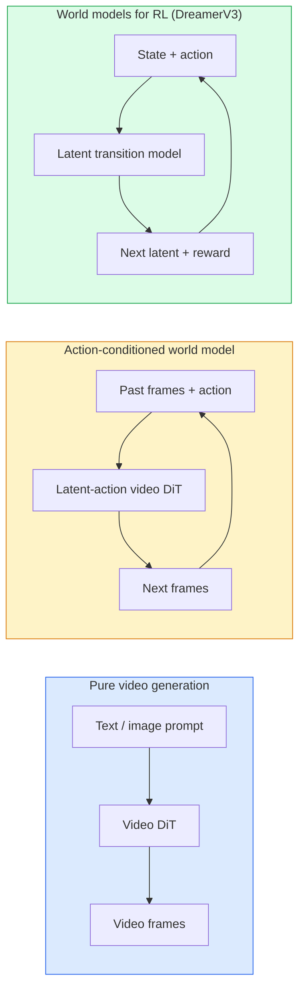

# مدل های جهان و پخش ویدئو

> یک مدل ویدئویی که ثانیه های بعدی صحنه را پیش بینی می کند یک شبیه ساز جهانی است. شرایط آن پیش بینی در مورد اقدامات و شما یک موتور بازی آموخته دارید.

**Type:** Learn + Build
**Languages:** Python
**Prerequisites:** Phase 4 Lesson 10 (Diffusion), Phase 4 Lesson 12 (Video Understanding), Phase 4 Lesson 23 (DiT + Rectified Flow)
**Time:** ~75 minutes

## اهداف یادگیری

- تفاوت بین یک مدل تولید ویدیویی خالص (Sora 2) و یک مدل جهانی با شرایط عمل (Genie 3, DreamerV3) را توضیح دهید
- یک ویدیو را توصیف کنید: DiT: پیچ های فضایی-زمان، کدگذاری موقعیت 3D، توجه مشترک در توکن های (T، H، W)
- ردیابی چگونگی اتصال یک مدل جهانی به رباتیک: برنامه های VLM → مدل ویدیویی شبیه سازی می شود → پویایی معکوس اقدامات را منتشر می کند
- انتخاب بین Sora 2، Genie 3، Runway GWM-1 Worlds، Wan-Video و HunyuanVideo برای یک مورد استفاده خاص (ویڈیو خلاق، سیم کارت تعاملی، سنتز رانندگی خودکار)

## مشکل

تولید ویدیو و مدل سازی جهانی در سال 2026 به هم پیوسته است. یک مدل که می تواند یک دقیقه ویدیویی منسجم تولید کند، به نوعی یاد گرفته که جهان چگونه حرکت می کند: پایداری اشیاء، جاذبه، علت، سبک. اگر این پیش بینی را در مورد اقدامات (در سمت چپ قدم بزنید، درب را باز کنید) شرط بندی کنید، مدل ویدیویی یک شبیه ساز قابل یادگیری می شود که می تواند جایگزین موتور بازی، شبیه ساز رانندگی یا محیط رباتیک شود.

شرطها مشخصه جنتی ۳ محیط های قابل بازی را از یک تصویر ایجاد می کند. راه فرود GWM-1 Worlds صحنه های بی نهایت قابل کشف را ترکیب می کند. Sora 2 ویدیوهای یک دقیقه ای با صداهای هماهنگ و فیزیک مدل سازی تولید می کند. NVIDIA Cosmos-Drive، Wayve Gaia-2 و Tesla DrivingWorld برای اطلاعات آموزش خودروهای مستقل ویدیوی رانندگی واقعی تولید می کنند. مدل جهانی به آرامی در حال گرفتن سیم به واقعیت برای رباتیک است.

این درس درس "تصاویر بزرگ" برای مرحله 4 است. این آموزش تولید تصاویر، درک ویدیو و استدلال عوامل را به الگوی معماری که تحقیقات غالب در حال حرکت است، متصل می کند.

## مفهوم

### سه خانواده مدل سازی جهانی



- **Sora 2**این تولید ویدیویی خالص است که به دستورات وابسته است. هیچ رابط کاری وجود ندارد. نمی توانید آن را در وسط اجرا هدایت کنید.
- **Genie 3**،**GWM-1 Worlds**،**Mirage / Magica**مدل های جهانی با شرایط عمل هستند. اقدامات پنهان را از ویدئو مشاهده شده وارد کنید، سپس پیش بینی های فریم آینده را در مورد اقدامات تنظیم کنید. تعاملی  شما کلید ها را فشار می دهید یا دوربین را حرکت می دهید و صحنه پاسخ می دهد.
- **DreamerV3**و خانواده مدل جهانی کلاسیک RL در یک فضای پنهان با شرایط عملی صریح، آموزش داده شده بر روی سیگنال پاداش. کمتر بصری؛ مفیدتر برای نمونه موثر RL.

### معماری ویدیویی

```
Video latent:          (C, T, H, W)
Patchify (spatial):    grid of P_h x P_w patches per frame
Patchify (temporal):   group P_t frames into a temporal patch
Resulting tokens:      (T / P_t) * (H / P_h) * (W / P_w) tokens
```

کدگذاری موقعیت 3D: یک ادغام چرخش یا آموخته شده در هر هماهنگی (t، h، w) است. توجه می تواند:

- **Full joint** تمام توکن ها به تمام توکن ها توجه می کنند. O ((N ^ 2) با توکن های N. ممنوع برای فیلم های طولانی.
- **Divided** توجه متناوب زمانی (موقع فضایی یکسان، در طول زمان: `(H*W) * T^2`) و توجه فضایی (هم زمان، در سراسر فضا: `T * (H*W)^2`) توسط TimeSformer و بیشتر DiTs ویدیویی استفاده می شود.
- **Window** پنجره های محلی در (t, h, w). توسط Video Swin استفاده می شود.

هر مدل انتشار ویدئویی 2026 از یکی از این سه الگوی به علاوه تنظیمات AdaLN (درسی 23) و جریان اصلاح شده استفاده می کند.

### شرایطی در مورد اقدامات: مدل های عمل غش

جن به دانش آموخته**latent action**در هر فریم با پیش بینی متمایزانه عمل بین یک جفت فریم های متوالی. کدگر مدل سپس بر روی عمل پنهان نتیجه گیری شده  نه بر روی کلید های کلیپتوپری آشکار شرایط است. در نتیجه، کاربر می تواند یک عمل پنهان (یا نمونه ای از یک قبلی تازه) را مشخص کند و مدل فریم بعدی را مطابق با آن عمل تولید می کند.

Sora کاملاً از رابط کارایی خارج می شود. decoder آن نشان دهنده های زمان فضایی بعدی را از نشان های زمان فضایی گذشته پیش بینی می کند. شرایط فوری آغاز را تعیین می کند؛ هیچ چیز آن را در نسل وسط هدایت نمی کند.

### اعتبار فیزیکی

انتشار سال 2026 سورا 2 به طور صریح اعلام شده**physical plausibility**وزن، تعادل، ماندگاری اشیاء، علت و نتیجه. توسط تیم از طریق نمرات قابل قبولیت دست سنجیده شده اندازه گیری شده است؛ مدل به طور قابل مشاهده در مورد اشیاء سقوط شده، برخورد شخصیت ها و شکست های هدف (یک پرش گم شده) در مقابل Sora 1 بهبود می یابد.

احتمال پذیری همچنان حالت شکست غالب است. فیلم های 2024-2025 از افرادی که اسپاگتی می خورند یا از عینک می نوشند، عدم وجود نمایش اشیاء مداوم مدل را نشان داد. مدل های 2026 (Sora 2, Runway Gen-5, HunyuanVideo) این موارد را کاهش می دهند اما از بین نمی برند.

### مدل های جهانی رانندگی مستقل

مدل های دنیای رانندگی صحنه های جاده ای واقع بین را بر اساس مسیرها، جعبه های مرزی یا نقشه های ناوبری تولید می کنند.

- **Cosmos-Drive-Dreams**(NVIDIA)  تولید دقیقه ای از ویدیو رانندگی برای آموزش RL.
- **Gaia-2**(Wayve)  ترکیب صحنه های مشروط مسیر برای ارزیابی سیاست.
- **DrivingWorld**(تسلا)  هوا و زمان روز و شرایط ترافیک را شبیه سازی می کند.
- **Vista**(بایت دانس)  ترکیب صحنه رانندگی واکنش پذیر.

آنها جایگزین جمع آوری داده های واقعی گران قیمت برای موارد گوشه ای هستند  پیاده روی در شب، تقاطع های یخ زده، انواع غیر معمول خودرو  که در غیر این صورت به میلیون ها مایل رانندگی نیاز دارند.

### ستک رباتیک: VLM + مدل ویدئویی + دینامیک معکوس

حلقه روباتيك سه جزء ظهور مي کند:

1. **VLM**هدف را تجزیه می کند ("کاپ قرمز را انتخاب کنید") ، یک دنباله عمل سطح بالا را برنامه ریزی می کند.
2. **Video generation model**شبیه سازی می کند که انجام هر عمل به نظر می رسد  مشاهدات N فریم پیش بینی می کند.
3. **Inverse dynamics model**از دستورات حرکتی بتونی که این مشاهدات را به وجود می آورد، استخراج می کند.

این جایگزین شکل دادن پاداش و RL سنگین نمونه است. مدل جهان تخیل را انجام می دهد؛ دینامیک معکوس حلقه را در حرکت می کند. Genie Envisioner یک نمونه است؛ بسیاری از گروه های تحقیقاتی در حال تجمع در این ساختار هستند.

### ارزیابی

- **Visual quality** FVD (Fréchet Video Distance) ، مطالعات کاربر
- **Prompt alignment** امتیاز کلیپس در هر فریم، ارزیابی به سبک VQA.
- **Physical plausibility** با دست در یک مجموعه معیار (مقایسه داخلی سورا ۲، VBench) ارزیابی شده است.
- **Controllability**(برای مدل های دنیای تعاملی)  عمل → پیوستگی مشاهده؛ آیا می توانید به حالت قبلی برگردید؟

### مدل منظره در سال 2026

| Model | Use | Parameters | Output | License |
|-------|-----|------------|--------|---------|
| Sora 2 | text-to-video, audio | — | 1-min 1080p + audio | API only |
| Runway Gen-5 | text/image-to-video | — | 10s clips | API |
| Runway GWM-1 Worlds | interactive world | — | infinite 3D rollout | API |
| Genie 3 | interactive world from image | 11B+ | playable frames | research preview |
| Wan-Video 2.1 | open text-to-video | 14B | high-quality clips | non-commercial |
| HunyuanVideo | open text-to-video | 13B | 10s clips | permissive |
| Cosmos / Cosmos-Drive | autonomous driving sim | 7-14B | driving scenes | NVIDIA open |
| Magica / Mirage 2 | AI-native game engine | — | modifiable worlds | product |

```figure
v4-world-rollout
```

## آن را بسازید

### مرحله 1: 3D برای ویدیو پیچ

```python
import torch
import torch.nn as nn


class VideoPatch3D(nn.Module):
    def __init__(self, in_channels=4, dim=64, patch_t=2, patch_h=2, patch_w=2):
        super().__init__()
        self.proj = nn.Conv3d(
            in_channels, dim,
            kernel_size=(patch_t, patch_h, patch_w),
            stride=(patch_t, patch_h, patch_w),
        )
        self.patch_t = patch_t
        self.patch_h = patch_h
        self.patch_w = patch_w

    def forward(self, x):
        # x: (N, C, T, H, W)
        x = self.proj(x)
        n, c, t, h, w = x.shape
        tokens = x.reshape(n, c, t * h * w).transpose(1, 2)
        return tokens, (t, h, w)
```

یک مخزن سه بعدی با قدم برابر هسته به عنوان یک پیچنده فضایی-زمان عمل می کند.`(T, H, W) -> (T/2, H/2, W/2)`شبکه از توکن ها

### مرحله 2: کدگذاری موقعیت چرخش 3D

نصب های موقعیت چرخش (RoPE) به طور جداگانه در طول `t`،`h`،`w`محور:

```python
def rope_3d(tokens, t_dim, h_dim, w_dim, grid):
    """
    tokens: (N, T*H*W, D)
    grid: (T, H, W) sizes
    t_dim + h_dim + w_dim == D
    """
    T, H, W = grid
    n, seq, d = tokens.shape
    if t_dim + h_dim + w_dim != d:
        raise ValueError(f"t_dim+h_dim+w_dim ({t_dim}+{h_dim}+{w_dim}) must equal D={d}")
    assert seq == T * H * W
    t_idx = torch.arange(T, device=tokens.device).repeat_interleave(H * W)
    h_idx = torch.arange(H, device=tokens.device).repeat_interleave(W).repeat(T)
    w_idx = torch.arange(W, device=tokens.device).repeat(T * H)
    # Simplified: just scale channels by frequencies. Real RoPE rotates pairs.
    freqs_t = torch.exp(-torch.log(torch.tensor(10000.0)) * torch.arange(t_dim // 2, device=tokens.device) / (t_dim // 2))
    freqs_h = torch.exp(-torch.log(torch.tensor(10000.0)) * torch.arange(h_dim // 2, device=tokens.device) / (h_dim // 2))
    freqs_w = torch.exp(-torch.log(torch.tensor(10000.0)) * torch.arange(w_dim // 2, device=tokens.device) / (w_dim // 2))
    emb_t = torch.cat([torch.sin(t_idx[:, None] * freqs_t), torch.cos(t_idx[:, None] * freqs_t)], dim=-1)
    emb_h = torch.cat([torch.sin(h_idx[:, None] * freqs_h), torch.cos(h_idx[:, None] * freqs_h)], dim=-1)
    emb_w = torch.cat([torch.sin(w_idx[:, None] * freqs_w), torch.cos(w_idx[:, None] * freqs_w)], dim=-1)
    return tokens + torch.cat([emb_t, emb_h, emb_w], dim=-1)
```

شکل افزودنی ساده شده. RoPE واقعی کانال های جفت شده را در فرکانس ها چرخش می کند؛ اطلاعات موقعیت یکسان است.

### مرحله سوم: قطع توجه

```python
class DividedAttentionBlock(nn.Module):
    def __init__(self, dim=64, heads=2):
        super().__init__()
        self.time_attn = nn.MultiheadAttention(dim, heads, batch_first=True)
        self.space_attn = nn.MultiheadAttention(dim, heads, batch_first=True)
        self.ln1 = nn.LayerNorm(dim)
        self.ln2 = nn.LayerNorm(dim)
        self.ln3 = nn.LayerNorm(dim)
        self.mlp = nn.Sequential(nn.Linear(dim, 4 * dim), nn.GELU(), nn.Linear(4 * dim, dim))

    def forward(self, x, grid):
        T, H, W = grid
        n, seq, d = x.shape
        # time attention: same (h, w), across t
        xt = x.view(n, T, H * W, d).permute(0, 2, 1, 3).reshape(n * H * W, T, d)
        a, _ = self.time_attn(self.ln1(xt), self.ln1(xt), self.ln1(xt), need_weights=False)
        xt = (xt + a).reshape(n, H * W, T, d).permute(0, 2, 1, 3).reshape(n, seq, d)
        # space attention: same t, across (h, w)
        xs = xt.view(n, T, H * W, d).reshape(n * T, H * W, d)
        a, _ = self.space_attn(self.ln2(xs), self.ln2(xs), self.ln2(xs), need_weights=False)
        xs = (xs + a).reshape(n, T, H * W, d).reshape(n, seq, d)
        xs = xs + self.mlp(self.ln3(xs))
        return xs
```

توجه زمان در هر موقعیت فضایی در طول زمان، توجه فضایی در هر فریم در طول موقعیت ها. دو عملیات O  T ^ 2 + (HW) ^ 2) به جای یک O  THW) ^ 2). این هسته TimeSformer و هر ویدئو مدرن DiT است.

### مرحله 4: یک ویدیو کوچک را بنویسید

```python
class TinyVideoDiT(nn.Module):
    def __init__(self, in_channels=4, dim=64, depth=2, heads=2):
        super().__init__()
        self.patch = VideoPatch3D(in_channels=in_channels, dim=dim, patch_t=2, patch_h=2, patch_w=2)
        self.blocks = nn.ModuleList([DividedAttentionBlock(dim, heads) for _ in range(depth)])
        self.out = nn.Linear(dim, in_channels * 2 * 2 * 2)

    def forward(self, x):
        tokens, grid = self.patch(x)
        for blk in self.blocks:
            tokens = blk(tokens, grid)
        return self.out(tokens), grid
```

یک ژنراتور ویدیویی کار نمی کند، یک دمو ساختاری است که هر قطعه را درست شکل می دهد.

### مرحله 5: شکل ها را بررسی کنید

```python
vid = torch.randn(1, 4, 8, 16, 16)  # (N, C, T, H, W)
model = TinyVideoDiT()
out, grid = model(vid)
print(f"input  {tuple(vid.shape)}")
print(f"tokens grid {grid}")
print(f"output {tuple(out.shape)}")
```

انتظار داشته باش`grid = (4, 8, 8)`و`out = (1, 256, 32)`پس از پیچ کردن، سر سپس به پیچ های فضایی-زمان به صورت مشخصی، آماده برای بازپوش کردن به یک ویدیو است.

## ازش استفاده کن

الگوهای دسترسی تولید برای سال 2026:

- **Sora 2 API**(OpenAI)  متن به ویدیو، آدی همگام. قیمت های پریمیوم.
- **Runway Gen-5 / GWM-1**(در حال اجرا)  تصویر به ویدئو، دنیای تعاملی.
- **Wan-Video 2.1 / HunyuanVideo** منبع باز خود میزبان
- **Cosmos / Cosmos-Drive**(NVIDIA)  شبیه سازی رانندگی با وزن های باز.
- **Genie 3** پیش نمایش تحقیقات، درخواست دسترسی

برای ساخت یک مدل نمایش جهانی تعاملی: با وان ویدئو برای کیفیت شروع کنید، لایه ای را روی یک آداپتور عمل غش برای تعامل قرار دهید. برای شبیه سازی رانندگی مستقل: کاسموس درایو مرجع باز 2026 است.

برای ربات ها، این دسته در طبیعت:

1. هدف زبان -> VLM (Qwen3-VL) -> برنامه سطح بالا.
2. نقشه -> مدل ویدیویی عمل پنهان -> انتشار تصور شده.
3. راه اندازی -> مدل دینامیک معکوس -> اقدامات سطح پایین.
4. اقدامات اجرا شده -> مشاهده به مرحله 1 بازگردانده شد

## -باده

این درس نتیجه می دهد:

- `outputs/prompt-video-model-picker.md` انتخاب بین Sora 2 / رنوا / وان / HunyuanVideo / Cosmos با توجه به وظیفه، مجوز و تاخیر.
- `outputs/skill-physical-plausibility-checks.md` یک مهارت که کنترل های خودکار (باقی اشیاء، جاذبه، دوام) را برای اجرا در هر ویدیو تولید شده قبل از ارسال تعریف می کند.

## تمرینات

1. **(Easy)**تعداد توکن برای یک ویدیو ۳۶۰p ۵ ثانیه را در پیچ t=۲، پیچ h=8، پیچ w=8 محاسبه کنید. دلیل حافظه برای توجه در این اندازه.
2. **(Medium)**یک بلاک توجه تقسیم شده را در بالا برای یک بلاک توجه مشترک کامل تغییر دهید و شکل و تعداد پارامتر را اندازه گیری کنید. توضیح دهید که چرا توجه تقسیم شده برای مدل های ویدیویی واقعی ضروری است.
3. **(Hard)**یک مدل ویدیویی کمترین عمل پنهان بسازید: مجموعه داده ای از (frame_t، action_t، frame_{t+1}) سه برابر (هر بازی 2D ساده ای) را بگیرید، یک ویدیو کوچک DiT را که بر روی گنجانده های عمل مشروط است، تمرین کنید و نشان دهید که اقدامات مختلف فریم های بعدی را متفاوت تولید می کند.

## اصطلاحات کلیدی

| Term | What people say | What it actually means |
|------|----------------|----------------------|
| World model | "Learned simulator" | A model that predicts future observations given state and action |
| Video DiT | "Spacetime transformer" | Diffusion transformer with 3D patchification and divided attention |
| Latent action | "Inferred control" | Discrete or continuous action latent inferred from frame pairs; used to condition next-frame generation |
| Divided attention | "Time then space" | Two attention operations per block — across time then across space — to keep O(N^2) manageable |
| Object permanence | "Things stay real" | Scene property that video models must learn; classic failure mode on food, glassware |
| FVD | "Fréchet Video Distance" | Video equivalent of FID; primary visual quality metric |
| Inverse dynamics model | "Observations to actions" | Given (state, next state), output the action that connects them; closes robotics loop |
| Cosmos-Drive | "NVIDIA driving sim" | Open-weights autonomous-driving world model for RL and evaluation |

## خواندن بیشتر

- [Sora technical report (OpenAI)](https://openai.com/index/video-generation-models-as-world-simulators/)
- [Genie: Generative Interactive Environments (Bruce et al., 2024)](https://arxiv.org/abs/2402.15391) مدل های دنیای عمل غش
- [TimeSformer (Bertasius et al., 2021)](https://arxiv.org/abs/2102.05095) توجه به ترانسفرترهای ویدئویی
- [DreamerV3 (Hafner et al., 2023)](https://arxiv.org/abs/2301.04104) مدل های جهانی برای RL
- [Cosmos-Drive-Dreams (NVIDIA, 2025)](https://research.nvidia.com/labs/toronto-ai/cosmos-drive-dreams/) مدل جهانی رانندگی
- [Top 10 Video Generation Models 2026 (DataCamp)](https://www.datacamp.com/blog/top-video-generation-models)
- [From Video Generation to World Model — survey repo](https://github.com/ziqihuangg/Awesome-From-Video-Generation-to-World-Model/)
