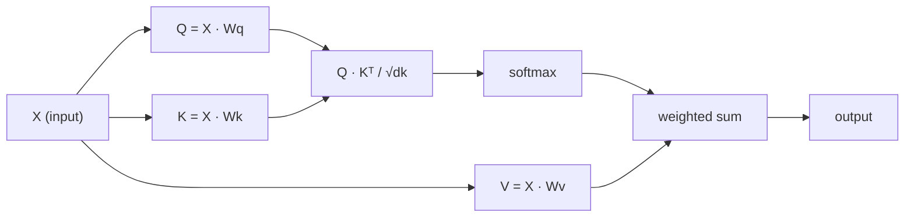

# مراقب بودن از ابتدا

> توجه یک جدول جستجو است که در آن هر کلمه می پرسد "چه کسی برای من مهم است؟" - و پاسخ را می آموزد.

**Type:** Build
**Languages:** Python
**Prerequisites:** Phase 3 (Deep Learning Core), Phase 5 Lesson 10 (Sequence-to-Sequence)
**Time:** ~90 minutes

## اهداف یادگیری

- پیاده سازی خود توجه محصول نقطه در مقیاس از ابتدا با استفاده از فقط NumPy، از جمله پیش بینی های جستجو/کليد/قيمة و مبلغ وزن شده نرمmax
- یک لایه توجه چند سر بسازید که سر را تقسیم کند، توجه موازی را محاسبه کند و نتایج را به هم متصل کند
- ردیابی چگونگی جذب رابطه های نشانه ها در ماتریس توجه و توضیح اینکه چرا مقیاس بندی توسط sqrt(d_k) مانع اش از شتاب نرمmax می شود
- استفاده از ماسک علت برای تبدیل توجه دو جهت به توجه خودکشی (طریقه دیکودر)

## مشکل

RNN ها یک توکن را به یک زمان ترتیب می دهند. تا زمانی که به توکن 50 برسید، اطلاعات از توکن 1 از طریق 50 مرحله فشرده سازی فشرده شده است. وابستگی های دور دراز به یک حالت پنهان اندازه ثابت - یک گلوپ جوی که هیچ مقدار گات LSTM به طور کامل حل نمی شود.

مقاله توجه به Bahdanau در سال 2014 نشان داد که راه حل این مسئله چیست: اجازه دهید کدهایر به هر موقعیت کدر نگاه کند و تصمیم بگیرد که کدام یک برای مرحله فعلی مهم است. اما هنوز هم به یک RNN متصل شده است. مقاله "اهتمام تنها چیزی است که شما نیاز دارید" در سال 2017 یک سوال شدیدتر مطرح کرد: اگر توجه مکانیسم * تنها* باشد چه می شود؟ هیچ تکرار. هیچ پیچیدگی. فقط توجه.

توجه به خود به هر موقعیت در یک ردیف اجازه می دهد تا در یک مرحله موازی به هر موقعیت دیگر توجه کند. این چیزی است که باعث می شود ترانسفورماتورها سریع، مقیاس پذیر و غالب باشند.

## مفهوم

### مقایسه جستجوی پایگاه داده

توجه را به عنوان یک جستجوی نرم پایگاه داده تصور کنید:

```
Traditional database:
  Query: "capital of France"  -->  exact match  -->  "Paris"

Attention:
  Query: "capital of France"  -->  similarity to ALL keys  -->  weighted blend of ALL values
```

هر نماد سه متری تولید می کند:
- **Query (Q)**"من دنبال چي ميگردم؟"
- **Key (K)**"من چه چيزي رو در خود دارم؟"
- **Value (V)**: "اگر انتخاب شود چه اطلاعاتی را ارائه می دهم؟"

مقدار نقطه ای بین یک سوال و تمام کلید ها نمره توجه را تولید می کند. نمره بالا به معنای "این کلید با سوال من مطابقت دارد". این نمره ها ارزش ها را وزن می کنند. محصول یک مجموع وزن شده از ارزش ها است.

### Q، K، V محاسبه

هر تمجید رمز در سه ماتریس وزن آموخته شده قرار می گیرد:

```
Input embeddings (sequence of n tokens, each d-dimensional):

  X = [x1, x2, x3, ..., xn]       shape: (n, d)

Three weight matrices:

  Wq  shape: (d, dk)
  Wk  shape: (d, dk)
  Wv  shape: (d, dv)

Projections:

  Q = X @ Wq    shape: (n, dk)      each token's query
  K = X @ Wk    shape: (n, dk)      each token's key
  V = X @ Wv    shape: (n, dv)      each token's value
```

به نظر من، به عنوان یک نشانه:

```
             Wq
  x_i ------[*]------> q_i    "What am I looking for?"
       |
       |     Wk
       +----[*]------> k_i    "What do I contain?"
       |
       |     Wv
       +----[*]------> v_i    "What do I offer?"
```

### ماتریکس توجه

وقتی Q، K، V برای همه توکن ها داشته باشید، نمره توجه یک ماتریس را تشکیل می دهد:

```
Scores = Q @ K^T    shape: (n, n)

              k1    k2    k3    k4    k5
        +-----+-----+-----+-----+-----+
   q1   | 2.1 | 0.3 | 0.1 | 0.8 | 0.2 |   <- how much q1 attends to each key
        +-----+-----+-----+-----+-----+
   q2   | 0.4 | 1.9 | 0.7 | 0.1 | 0.3 |
        +-----+-----+-----+-----+-----+
   q3   | 0.2 | 0.6 | 2.3 | 0.5 | 0.1 |
        +-----+-----+-----+-----+-----+
   q4   | 0.9 | 0.1 | 0.4 | 1.7 | 0.6 |
        +-----+-----+-----+-----+-----+
   q5   | 0.1 | 0.3 | 0.2 | 0.5 | 2.0 |
        +-----+-----+-----+-----+-----+

Each row: one token's attention over the entire sequence
```

یک سوال را در یک زمان ببینید کلید ها را پاک کنید: هر ردیف هر نشانه را نمره می دهد، softmax نمره ها را به وزن تبدیل می کند و متری زمینه ترکیبی از ارزش های وزن شده است.

```figure
attention-matrix
```

### چرا مقیاس؟

محصولات نقطه ای با ابعاد dk رشد می کنند. اگر dk = 64، محصولات نقطه ای می توانند در محدوده ده ها باشند، و نرمmax را به مناطقی که گرادینت ها ناپدید می شوند فشار می دهند.

```
Scaled scores = (Q @ K^T) / sqrt(dk)
```

این مقدار را در محدوده ای نگه می دارد که نرم ماکس gradients مفید را تولید می کند.

### نرم ماکس نمره ها رو به وزن مي کنه

Softmax نمرات خام را به توزیع احتمال در هر ردیف تبدیل می کند:

```
Raw scores for q1:   [2.1, 0.3, 0.1, 0.8, 0.2]
                            |
                         softmax
                            |
Attention weights:   [0.52, 0.09, 0.07, 0.14, 0.08]   (sums to ~1.0)
```

حالا هر رمز دارای مجموعه ای از وزنهایی است که می گوید چقدر باید به هر رمز دیگری توجه کند.

### مجموع ارزش های با وزن

تولید نهایی برای هر توکن، مجموعه وزن شده از تمام متریزهای ارزش است:

```
output_i = sum( attention_weight[i][j] * v_j  for all j )

For token 1:
  output_1 = 0.52 * v1 + 0.09 * v2 + 0.07 * v3 + 0.14 * v4 + 0.08 * v5
```

### خط لوله کامل



فرمول در یک خط:

```
Attention(Q, K, V) = softmax( Q @ K^T / sqrt(dk) ) @ V
```

```figure
softmax-attention-scaling
```

## آن را بسازید

### مرحله ی اول: Softmax از ابتدا

نرم ماکس Logits خام را به احتمالات تبدیل می کند.

```python
import numpy as np

def softmax(x):
    shifted = x - np.max(x, axis=-1, keepdims=True)
    exp_x = np.exp(shifted)
    return exp_x / np.sum(exp_x, axis=-1, keepdims=True)

logits = np.array([2.0, 1.0, 0.1])
print(f"logits:  {logits}")
print(f"softmax: {softmax(logits)}")
print(f"sum:     {softmax(logits).sum():.4f}")
```

### مرحله دوم: توجه به نقطه محصول

تابع هسته ای، ماتریس Q، K، V را می گیرد و خروجی توجه و ماتریس وزن را باز می گرداند.

```python
def scaled_dot_product_attention(Q, K, V):
    dk = Q.shape[-1]
    scores = Q @ K.T / np.sqrt(dk)
    weights = softmax(scores)
    output = weights @ V
    return output, weights
```

### مرحله سوم: کلاس توجه به خود با پیش بینی های آموخته

یک ماژول خود توجه کامل با Wq، Wk، Wv ماتریس وزن با شروع با مقیاس شبیه Xavier.

```python
class SelfAttention:
    def __init__(self, d_model, dk, dv, seed=42):
        rng = np.random.default_rng(seed)
        scale = np.sqrt(2.0 / (d_model + dk))
        self.Wq = rng.normal(0, scale, (d_model, dk))
        self.Wk = rng.normal(0, scale, (d_model, dk))
        scale_v = np.sqrt(2.0 / (d_model + dv))
        self.Wv = rng.normal(0, scale_v, (d_model, dv))
        self.dk = dk

    def forward(self, X):
        Q = X @ self.Wq
        K = X @ self.Wk
        V = X @ self.Wv
        output, weights = scaled_dot_product_attention(Q, K, V)
        return output, weights
```

### مرحله چهارم: آن را بر روی یک جمله اجرا کنید

برای جمله ی جعلی یك نقش بسازید و توجه را به وزن ها نگاه کنید.

```python
sentence = ["The", "cat", "sat", "on", "the", "mat"]
n_tokens = len(sentence)
d_model = 8
dk = 4
dv = 4

rng = np.random.default_rng(42)
X = rng.normal(0, 1, (n_tokens, d_model))

attn = SelfAttention(d_model, dk, dv, seed=42)
output, weights = attn.forward(X)

print("Attention weights (each row: where that token looks):\n")
print(f"{'':>6}", end="")
for token in sentence:
    print(f"{token:>6}", end="")
print()

for i, token in enumerate(sentence):
    print(f"{token:>6}", end="")
    for j in range(n_tokens):
        w = weights[i][j]
        print(f"{w:6.3f}", end="")
    print()
```

### مرحله 5: توجه را با نقشه گرمای ASCII تصور کنید

وزن توجه رو به شخصیت ها نقشه بزن تا به سرعت به نظر برسونه

```python
def ascii_heatmap(weights, tokens, chars=" ░▒▓█"):
    n = len(tokens)
    print(f"\n{'':>6}", end="")
    for t in tokens:
        print(f"{t:>6}", end="")
    print()

    for i in range(n):
        print(f"{tokens[i]:>6}", end="")
        for j in range(n):
            level = int(weights[i][j] * (len(chars) - 1) / weights.max())
            level = min(level, len(chars) - 1)
            print(f"{'  ' + chars[level] + '   '}", end="")
        print()

ascii_heatmap(weights, sentence)
```

## ازش استفاده کن

"پایتورچ"`nn.MultiheadAttention`دقیقاً همون کاری که ما ساختیم رو انجام میده، به علاوه جداسازی چند سر و پروژکتور خروجی:

```python
import torch
import torch.nn as nn

d_model = 8
n_heads = 2
seq_len = 6

mha = nn.MultiheadAttention(embed_dim=d_model, num_heads=n_heads, batch_first=True)

X_torch = torch.randn(1, seq_len, d_model)

output, attn_weights = mha(X_torch, X_torch, X_torch)

print(f"Input shape:            {X_torch.shape}")
print(f"Output shape:           {output.shape}")
print(f"Attention weight shape: {attn_weights.shape}")
print(f"\nAttn weights (averaged over heads):")
print(attn_weights[0].detach().numpy().round(3))
```

تفاوت کلیدی: توجه چند سر چندین عملکرد توجه را به طور موازی اجرا می کند، هر کدام با طرح های Q، K، V خود از اندازه dk = d_model / n_heads، سپس نتایج را به هم متصل می کند. این به مدل اجازه می دهد تا به انواع مختلف رابطه همزمان توجه کند.

## -باده

این درس نتیجه می دهد:
- `outputs/prompt-attention-explainer.md`- یک درخواست برای توضیح توجه از طریق مقایسه جستجوی پایگاه داده

## تمرینات

1. تغییرش`scaled_dot_product_attention`برای پذیرش یک ماتریس ماسک اختیاری که موقعیت های خاصی را قبل از softmax به بی نهایت منفی تنظیم می کند (این نحوه عملکرد ماسک علت/دکودر است)
2. از نو به بعد توجه چند سر را اجرا کنید: Q، K، V را به دو قسمت تقسیم کنید`n_heads`قطعات، توجه به هر یک از آنها را اجرا کنید، به هم متصل شوید و از طریق ماتریکس وزن نهایی Wo
3. دو جمله متفاوت از طول مشابه را بگیرید، آنها را از طریق مثال خود توجه کنید، و الگوهای توجه آنها را مقایسه کنید. چه تغییراتی؟ چه چیزی یکسان باقی می ماند؟

## اصطلاحات کلیدی

| Term | What people say | What it actually means |
|------|----------------|----------------------|
| Query (Q) | "The question vector" | A learned projection of the input that represents what information this token is looking for |
| Key (K) | "The label vector" | A learned projection that represents what information this token contains, matched against queries |
| Value (V) | "The content vector" | A learned projection carrying the actual information that gets aggregated based on attention scores |
| Scaled dot-product attention | "The attention formula" | softmax(QK^T / sqrt(dk)) @ V - scaling prevents softmax saturation in high dimensions |
| Self-attention | "The token looks at itself and others" | Attention where Q, K, V all come from the same sequence, letting every position attend to every other position |
| Attention weights | "How much focus" | A probability distribution over positions, produced by softmax over scaled dot products |
| Multi-head attention | "Parallel attention" | Running multiple attention functions with different projections, then concatenating results for richer representations |

## خواندن بیشتر

- [Attention Is All You Need (Vaswani et al., 2017)](https://arxiv.org/abs/1706.03762)- کاغذ اصلی ترانسفورماتور
- [The Illustrated Transformer (Jay Alammar)](https://jalammar.github.io/illustrated-transformer/)- بهترین راه رفتن بصری از کل معماری
- [The Annotated Transformer (Harvard NLP)](https://nlp.seas.harvard.edu/annotated-transformer/)- پیاده سازی خط به خط PyTorch با توضیحات
