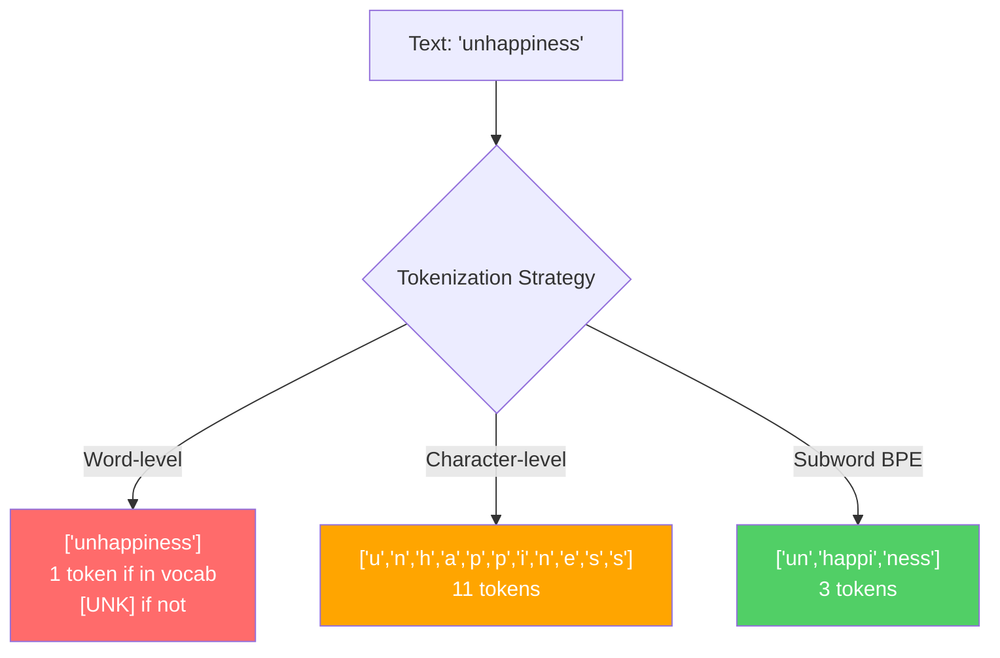
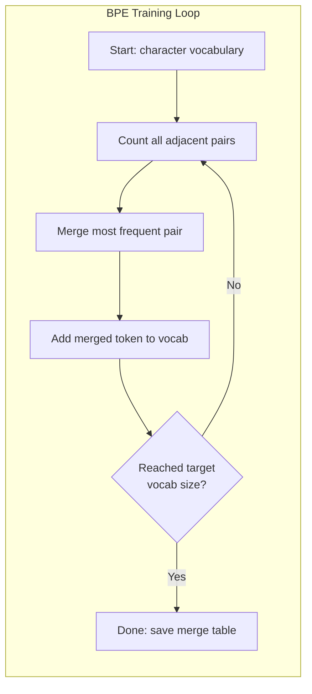
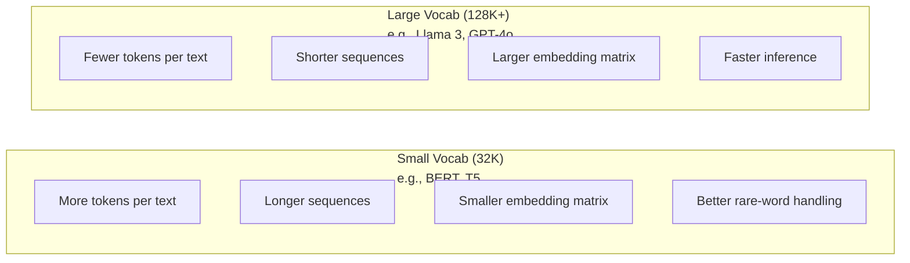

# توکن: BPE، WordPiece، SentencePiece

> مدرک تحصیلی شما انگلیسی نمی خواند، بلکه اعداد تمام را می خواند. نشان دهنده تصمیم می گیرد که آیا این اعداد معنی دارند یا از دست می دهند.

**Type:** Build
**Languages:** Python
**Prerequisites:** Phase 05 (NLP Foundations)
**Time:** ~90 minutes

## اهداف یادگیری

- پیاده سازی الگوریتم های توکن سازی BPE، WordPiece و Unigram از ابتدا و مقایسه استراتژی های ادغام آنها
- توضیح دهید که چگونه اندازه لغت بر کارایی مدل تاثیر می گذارد: خیلی کوچک باعث ایجاد دنباله های طولانی می شود، خیلی بزرگ از زباله ها شامل پارامترهای
- تجزیه و تحلیل آثار توکن سازی در میان زبان ها و کد، شناسایی جایی که توکن های خاص شکسته می شوند
- از کتابخانه های تکهکن و جملات برای تکه بندی متن استفاده کنید و شناسه های تکه حاصل را بررسی کنید

## مشکل

مدرک تحصیلی شما انگلیسی نمیخواد، هیچ زبان نمیخواد، اعداد میخواد.

فاصله بین "سلام، جهان!" و [15496, 11, 995, 0] نشان دهنده است. هر کلمه، هر فضای، هر علامت علامت علامت باید قبل از اینکه یک مدل بتواند آن را پردازش کند به یک عدد کامل تبدیل شود. این تبدیل خنثی نیست. این فرضیه ها را به مدل می کند که بعداً نمی تواند رد شود.

اينو اشتباه بگير و مدل تو ظرفیت رمزنگاري کلمات معمول با توکن هاي چندگانه رو از دست ميده " متاسفانه " به جای یک به چهار توکن تبدیل می شود پنجره سيستم 128K شما براي متن با کلمات چند حرفي 75 درصد کاهش پيدا کرد درست درست کنید و همان پنجره زمینه دو برابر معنی دارد. تفاوت بین این مدل با کد خوب کار می کند و این مدل با پایتون خفه می شود اغلب به نحوه آموزش توکنایزر بستگی دارد.

هر تماس API شما به GPT-4 یا کلاود به هر توکن قیمت گذاری می شود. هر توکن مدل شما تولید می کند هزینه های محاسباتی است. هرچه توکن های کمتری برای نمایش یک محصول مورد نیاز باشند، نتیجه گیری از پایان به پایان سریع تر می شود. توکن سازی پردازش پیش از انجام نیست. معماری است.

## مفهوم

### سه روش که شکست خورد (و یکی که برنده شد)

سه روش واضح برای تبدیل متن به اعداد وجود دارد. دو از آنها در مقیاس کار نمی کنند.

**Word-level tokenization**"قطه نشسته" می شود ["The"، "cat", "sat"]. ساده است. اما چه می شود از "tokenization"؟ یا "GPT-4o"؟ یا یک کلمه ترکیب آلمانی مانند "Geschwindigkeitsbegrenzung"؟ سطح کلمه نیاز به یک ذخایر عظیم لغت برای پوشش هر کلمه در هر زبان. یک کلمه را از دست بدهید و شما می توانید ترسید`[UNK]`توکن -- روش مدل برای گفتن "من هیچ ایده ای ندارم که این چیست". تنها انگلیسی بیش از یک میلیون کلمه دارد. کد، URL، نماد علمی و 100 زبان دیگر را اضافه کنید و به یک ذخیرہ لغات بی نهایت نیاز دارید.

**Character-level tokenization**به سمت دیگر می رود. "سلام" می شود ["h", "e", "l", "l", "o"". لغت کوچک است (چندصد حرف). هیچ نشانه ناشناخته ای وجود ندارد. اما دنباله ها بسیار طولانی می شوند. جمله ای که 10 نشانه در سطح کلمه می باشد، تبدیل به 50 نشانه در سطح حرف می شود. مدل باید یاد بگیرد که "t", "h", "e" به همراه "the" یعنی -- ظرفیت توجه را بر روی چیزی که انسان در سن سه سالگی یاد می گیرد می سوزاند.

**Subword tokenization**کلمات معمول کامل باقی می مانند: "the" یک نشانه است. کلمات نادر به قطعات معنی دار تجزیه می شوند: "بدبخت" تبدیل به ["un"، "happy"، "ness" می شود. لغت قابل مدیریت باقی می ماند (30K تا 128K توکن). دنباله ها کوتاه می مانند. توکن های ناشناخته اساسا ناپدید می شوند زیرا هر کلمه می تواند از قطعات زیر کلمه ساخته شود.

هر مدرک جدید از توکنز فرعی استفاده می کند. GPT-2، GPT-4، BERT، Llama 3، Claude - همه آنها. سوال این است که کدام الگوریتم.



### BPE: کدگذاری بایت های جفت

BPE یک الگوریتم فشرده سازی طمع آمیز است که برای توکن سازی طراحی شده است. ایده آن به اندازه کافی ساده است تا روی یک کارت شاخص قرار گیرد.

با حرف های فردی شروع کنید. هر جفت در کنار هم در کورپوس آموزش شمارش کنید. جفت رایج ترین را به یک رمز جدید ادغام کنید. تا زمانی که به اندازه ذخایر لغات هدف خود برسید تکرار کنید.

```figure
tokenizer-bpe
```

این BPE روی یک کورپوس کوچک با کلمات " پایین تر " ، " پایین ترین " و " جدیدترین " اجرا می شود:

```
Corpus (with word frequencies):
  "lower"  x5
  "lowest" x2
  "newest" x6

Step 0 -- Start with characters:
  l o w e r       (x5)
  l o w e s t     (x2)
  n e w e s t     (x6)

Step 1 -- Count adjacent pairs:
  (e,s): 8    (s,t): 8    (l,o): 7    (o,w): 7
  (w,e): 13   (e,r): 5    (n,e): 6    ...

Step 2 -- Merge most frequent pair (w,e) -> "we":
  l o we r        (x5)
  l o we s t      (x2)
  n e we s t      (x6)

Step 3 -- Recount and merge (e,s) -> "es":
  l o we r        (x5)
  l o we s t      (x2)    <- 'es' only forms from 'e'+'s', not 'we'+'s'
  n e we s t      (x6)    <- wait, the 'e' before 'we' and 's' after 'we'

Actually tracking this precisely:
  After "we" merge, remaining pairs:
  (l,o): 7   (o,we): 7   (we,r): 5   (we,s): 8
  (s,t): 8   (n,e): 6    (e,we): 6

Step 3 -- Merge (we,s) -> "wes" or (s,t) -> "st" (tied at 8, pick first):
  Merge (we,s) -> "wes":
  l o we r        (x5)
  l o wes t       (x2)
  n e wes t       (x6)

Step 4 -- Merge (wes,t) -> "west":
  l o we r        (x5)
  l o west        (x2)
  n e west        (x6)

...continue until target vocab size reached.
```

جدول ادغام نشان دهنده است. برای کدگذاری متن جدید، ادغام ها را در ترتیب آموخته شده اعمال کنید. کورپوس آموزشی تعیین می کند که کدام ادغام وجود دارد و این انتخاب به طور دائمی آنچه را که مدل می بیند شکل می دهد.



### BPE باط (GPT-2، GPT-3, GPT-4)

BPE استاندارد بر روی کاراکترهای یونیکوید عمل می کند. BPE سطح بایت بر روی بایت های خام (0-255) عمل می کند. این به شما یک لغت پایه دقیقا 256 می دهد، هر زبان یا کد را اداره می کند و هرگز یک توکن ناشناخته تولید نمی کند.

GPT-2 این رویکرد را معرفی کرد. لغت پایه هر بائتی ممکن را پوشش می دهد. BPE بر روی آن ترکیب می شود. کتابخانه Tiktoken OpenAI با این اندازه های لغت BPE را پیاده سازی می کند:

- GPT-2: 50257 توکن
- GPT-3.5/GPT-4: ~100،256 توکن (تخفیق cl100k_base)
- GPT-4o: 200،019 توکن (o200k_base encoding)

### ورد پیس (BERT)

WordPiece شبیه به BPE است اما انتخاب ها متفاوت ترکیب می شوند. به جای فرکانس خام، احتمال داده های آموزش را به حداکثر می رساند:

```
BPE merge criterion:      count(A, B)
WordPiece merge criterion: count(AB) / (count(A) * count(B))
```

BPE می پرسد: "چه جفت اغلب ظاهر می شود؟" WordPiece می پرسد: "چه جفت بیشتر از آنچه شما به طور تصادفی انتظار می کنید با هم ظاهر می شود؟" این تفاوت ظریف باعث ایجاد ذخایر لغاتی متفاوت می شود. WordPiece در جایی که اتفاق همدیگر شگفت انگیز است، نه فقط مکرر است، از هم ترکیب می کند.

WordPiece همچنین از یک پیشگویی "##" برای زیرکلمات ادامه استفاده می کند:

```
"unhappiness" -> ["un", "##happi", "##ness"]
"embedding"   -> ["em", "##bed", "##ding"]
```

پیشگویی "##" به شما می گوید این قطعه یک توکن قبلی را ادامه می دهد. BERT از WordPiece با یک ذخایر 30،522 توکن استفاده می کند. هر نوع BERT - DistilBERT، توکن رابرتا در واقع BPE است، اما BERT خود WordPiece است.

### جمله (لاما، T5)

SentencePiece ورودی را به عنوان یک جریان خام از شخصیت های یونیکوڈ، از جمله فضای سفید، در نظر می گیرد. هیچ مرحله ای از قبل از توکن سازی نیست. هیچ قاعده خاصی برای زبان در مورد مرز کلمات وجود ندارد. این باعث می شود که آن را به طور واقعی زبان ناپسند کند - این در زبان های چینی، ژاپنی، تایلندی و دیگر زبان هایی که فضای کلمات را جدا نمی کند کار می کند.

SentencePiece از دو الگوریتم پشتیبانی می کند:
- **BPE mode**: منطق ادغام مشابه BPE استاندارد، برای دنباله های کرکته خام اعمال می شود
- **Unigram mode**: با یک لغت بزرگ شروع می شود و به طور تکراری نشانه هایی را که حداقل بر احتمال کلی تاثیر می گذارد حذف می کند. برعکس BPE - به جای ادغام، برش.

Llama 2 از SentencePiece BPE با 32000 توکن استفاده می کند. T5 از SentencePiece Unigram با 32000 توکن استفاده می کند. توجه: Llama 3 به یک توکن باط مبتنی بر بایت با 128,256 توکن تغییر کرد.

### حجم لغات

این یک تصمیم مهندسی واقعی با پیامدهای قابل اندازه گیری است.



برای یک لغت 128K با 4،096 ابعاد گنجانده شده، ماتریس گنجانده شده تنها 128,000 x 4,096 = 524 میلیون پارامتر است. برای یک لغت 32K، 131 میلیون پارامتر است. این یک تفاوت پارامتر 400M از انتخاب توکنایزر است.

اما لغات بزرگتر متن را به شدت فشرده می کند. همان پاراگراف انگلیسی که 100 توکن با لغت 32K را می گیرد ممکن است 70 توکن با لغت 128K را بگیرد. این بدان معنی است که 30 درصد کمتر از عبور های پیش رو در طول تولید. برای یک مدل که میلیون ها درخواست را انجام می دهد، این کاهش مستقیم هزینه های محاسباتی است.

روند واضح است: حجم ذخایر لغات در حال رشد است. GPT-2 استفاده 50.257 GPT-4 استفاده ~ 100K. Llama 3 استفاده 128K. GPT-4o استفاده 200K.

| Model | Vocab Size | Tokenizer Type | Avg Tokens per English Word |
|-------|-----------|----------------|---------------------------|
| BERT | 30,522 | WordPiece | ~1.4 |
| GPT-2 | 50,257 | Byte-level BPE | ~1.3 |
| Llama 2 | 32,000 | SentencePiece BPE | ~1.4 |
| GPT-4 | ~100,256 | Byte-level BPE | ~1.2 |
| Llama 3 | 128,256 | Byte-level BPE (tiktoken) | ~1.1 |
| GPT-4o | 200,019 | Byte-level BPE | ~1.0 |

### مالیات چند زبانی

توکن های آموزش دیده به طور عمده به زبان انگلیسی برای زبان های دیگر وحشیانه هستند. متن کره ای در توکن GPT-2 به طور متوسط 2-3 توکن در هر کلمه است. چینی می تواند بدتر باشد. این بدان معنی است که یک کاربر کره ای به طور موثر دارای پنجره زمینه ای است که نیمی از اندازه یک کاربر انگلیسی است - پرداخت همان قیمت برای تراکم اطلاعات کمتر.

به همین دلیل است که Llama 3 ذخایر لغات خود را از 32K به 128K چهار برابر کرد. توکن های بیشتر اختصاص داده شده به اسکریپت های غیر انگلیسی به معنای فشرده سازی عادلانه تر بین زبان ها است.

```figure
tokenizer-tradeoff
```

## آن را بسازید

### مرحله اول: نشان دهنده سطح شخصیت

از پایه شروع کنید. یک توکنایزر سطح کاراکتر هر کاراکتر را به نقطه کد یونیکودی خود نقشه می زند. نیازی به آموزش نیست. هیچ توکن ناشناخته ای نیست. فقط نقشه برداری مستقیم.

```python
class CharTokenizer:
    def encode(self, text):
        return [ord(c) for c in text]

    def decode(self, tokens):
        return "".join(chr(t) for t in tokens)
```

هر کاراکتر نماد خودشه. این خط پایه ای است که ما در آن بهبود می یابیم.

### مرحله دوم: BPE Tokenizer از ابتدا

پیاده سازی واقعی. ما در بائتهای خام (مانند GPT-2) تمرین می کنیم، جفت ها را شمارش می کنیم، مکررترین ها را ترکیب می کنیم و هر ترکیب را به ترتیب ثبت می کنیم. جدول ترکیب توکنایزر است.

```python
from collections import Counter

class BPETokenizer:
    def __init__(self):
        self.merges = {}
        self.vocab = {}

    def _get_pairs(self, tokens):
        pairs = Counter()
        for i in range(len(tokens) - 1):
            pairs[(tokens[i], tokens[i + 1])] += 1
        return pairs

    def _merge_pair(self, tokens, pair, new_token):
        merged = []
        i = 0
        while i < len(tokens):
            if i < len(tokens) - 1 and tokens[i] == pair[0] and tokens[i + 1] == pair[1]:
                merged.append(new_token)
                i += 2
            else:
                merged.append(tokens[i])
                i += 1
        return merged

    def train(self, text, num_merges):
        tokens = list(text.encode("utf-8"))
        self.vocab = {i: bytes([i]) for i in range(256)}

        for i in range(num_merges):
            pairs = self._get_pairs(tokens)
            if not pairs:
                break
            best_pair = max(pairs, key=pairs.get)
            new_token = 256 + i
            tokens = self._merge_pair(tokens, best_pair, new_token)
            self.merges[best_pair] = new_token
            self.vocab[new_token] = self.vocab[best_pair[0]] + self.vocab[best_pair[1]]

        return self

    def encode(self, text):
        tokens = list(text.encode("utf-8"))
        for pair, new_token in self.merges.items():
            tokens = self._merge_pair(tokens, pair, new_token)
        return tokens

    def decode(self, tokens):
        byte_sequence = b"".join(self.vocab[t] for t in tokens)
        return byte_sequence.decode("utf-8", errors="replace")
```

حلقه آموزش هسته BPE است: تعداد جفت ها، ترکیب برنده، تکرار. هر ترکیب باعث کاهش کل تعداد توکن می شود. پس از `num_merges`در حال حاضر، در حال حاضر، تعداد کلمات از 256 (بایت های پایه) به 256 + num_merges افزایش می یابد.

کدگذاری در مورد ادغام ها در ترتیب دقیق که یاد گرفته شده است، اعمال می شود. این مهم است. اگر ادغام 1 ایجاد "th" و ادغام 5 ایجاد "the" کند، کدگذاری باید اول ادغام 1 را اعمال کند تا "the" می تواند از "th" + "e" در ادغام 5 تشکیل شود.

رمزگذاری برعکس است: هر رمز شناسه در لغات جستجو کنید، بائتهای را همبندید، رمزگذاری کنید به UTF-8.

### مرحله سوم: کدگذاری و رمزگذاری سفر دور

```python
corpus = (
    "The cat sat on the mat. The cat ate the rat. "
    "The dog sat on the log. The dog ate the frog. "
    "Natural language processing is the study of how computers "
    "understand and generate human language. "
    "Tokenization is the first step in any NLP pipeline."
)

tokenizer = BPETokenizer()
tokenizer.train(corpus, num_merges=40)

test_sentences = [
    "The cat sat on the mat.",
    "Natural language processing",
    "tokenization pipeline",
    "unhappiness",
]

for sentence in test_sentences:
    encoded = tokenizer.encode(sentence)
    decoded = tokenizer.decode(encoded)
    raw_bytes = len(sentence.encode("utf-8"))
    ratio = len(encoded) / raw_bytes
    print(f"'{sentence}'")
    print(f"  Tokens: {len(encoded)} (from {raw_bytes} bytes) -- ratio: {ratio:.2f}")
    print(f"  Roundtrip: {'PASS' if decoded == sentence else 'FAIL'}")
```

نسبت فشرده سازی به شما میگه که توکنایزر چقدر موثر است. نسبت 0.50 به این معنی است که توکنایزر متن را به نصف تعداد توکن های خام فشرده کرده است. پایین تر بهتره در آموزش، نسبت خوب خواهد بود. در متن خارج از توزیع مانند "بدبختی" (که در corpus ظاهر نمی شود) ، نسبت بدتر خواهد بود - توکنایزر به کدگذاری سطح شخصیت برای الگوهای ندیده می شود.

### مرحله 4: مقایسه با tiktoken

```python
import tiktoken

enc = tiktoken.get_encoding("cl100k_base")

texts = [
    "The cat sat on the mat.",
    "unhappiness",
    "Hello, world!",
    "def fibonacci(n): return n if n < 2 else fibonacci(n-1) + fibonacci(n-2)",
    "Geschwindigkeitsbegrenzung",
]

for text in texts:
    our_tokens = tokenizer.encode(text)
    tiktoken_tokens = enc.encode(text)
    tiktoken_pieces = [enc.decode([t]) for t in tiktoken_tokens]
    print(f"'{text}'")
    print(f"  Our BPE:   {len(our_tokens)} tokens")
    print(f"  tiktoken:  {len(tiktoken_tokens)} tokens -> {tiktoken_pieces}")
```

tiktoken دقیقاً همان الگوریتم را استفاده می کند اما بر روی صدها گیگابایت متن با ۱۰۰ هزار ادغام آموزش داده شده است. الگوریتم یکسان است. تفاوت داده های آموزش و تعداد ادغام است. توکنایزر شما که بر روی پاراگراف با ۴۰ ادغام آموزش داده شده است نمی تواند با ۱۰۰ هزار ادغام tiktoken در یک کورپوس عظیم رقابت کند. اما مکانیسم یکسان است.

### مرحله 5: تحلیل لغات

```python
def analyze_vocabulary(tokenizer, test_texts):
    total_tokens = 0
    total_chars = 0
    token_usage = Counter()

    for text in test_texts:
        encoded = tokenizer.encode(text)
        total_tokens += len(encoded)
        total_chars += len(text)
        for t in encoded:
            token_usage[t] += 1

    print(f"Vocabulary size: {len(tokenizer.vocab)}")
    print(f"Total tokens across all texts: {total_tokens}")
    print(f"Total characters: {total_chars}")
    print(f"Avg tokens per character: {total_tokens / total_chars:.2f}")

    print(f"\nMost used tokens:")
    for token_id, count in token_usage.most_common(10):
        token_bytes = tokenizer.vocab[token_id]
        display = token_bytes.decode("utf-8", errors="replace")
        print(f"  Token {token_id:4d}: '{display}' (used {count} times)")

    unused = [t for t in tokenizer.vocab if t not in token_usage]
    print(f"\nUnused tokens: {len(unused)} out of {len(tokenizer.vocab)}")
```

این توزیع Zipf را در لغات شما نشان می دهد. چند توکن برتری دارند (فضا، "the"، "e"). اکثر توکن ها به ندرت استفاده می شوند. توکن های تولید برای این توزیع بهینه سازی می شوند - الگوهای رایج ID توکن های کوتاه را دریافت می کنند، الگوهای نادر نمایش های طولانی تری را دریافت می کنند.

## ازش استفاده کن

خربت BPE کار ميکنه حالا ببينينين ابزار توليدي چطوره

### تیتوکین (OpenAI)

```python
import tiktoken

enc = tiktoken.get_encoding("cl100k_base")

text = "Tokenizers convert text to integers"
tokens = enc.encode(text)
print(f"Tokens: {tokens}")
print(f"Pieces: {[enc.decode([t]) for t in tokens]}")
print(f"Roundtrip: {enc.decode(tokens)}")
```

tiktoken با Rust با پیتون با هم نوشته شده است. این میلیون ها توکن در ثانیه رمزگذاری می کند. همان الگوریتم BPE، پیاده سازی قدرت صنعتی.

### تعاشق کننده های چهره

```python
from tokenizers import Tokenizer
from tokenizers.models import BPE
from tokenizers.trainers import BpeTrainer
from tokenizers.pre_tokenizers import ByteLevel

tokenizer = Tokenizer(BPE())
tokenizer.pre_tokenizer = ByteLevel()

trainer = BpeTrainer(vocab_size=1000, special_tokens=["<pad>", "<eos>", "<unk>"])
tokenizer.train(["corpus.txt"], trainer)

output = tokenizer.encode("The cat sat on the mat.")
print(f"Tokens: {output.tokens}")
print(f"IDs: {output.ids}")
```

کتابخانه رمزنگاري کننده های Hugging Face هم Rust تحت هود است. این BPE را در مقیاس گئگا باایت در ثانیه آموزش می دهد. این چیزی است که شما هنگام آموزش مدل خود استفاده می کنید.

### بارگذاری توکنز لاما

```python
from transformers import AutoTokenizer

tokenizer = AutoTokenizer.from_pretrained("meta-llama/Llama-3.1-8B")

text = "Tokenizers are the unsung heroes of LLMs"
tokens = tokenizer.encode(text)
print(f"Token IDs: {tokens}")
print(f"Tokens: {tokenizer.convert_ids_to_tokens(tokens)}")
print(f"Vocab size: {tokenizer.vocab_size}")

multilingual = ["Hello world", "Hola mundo", "Bonjour le monde"]
for text in multilingual:
    ids = tokenizer.encode(text)
    print(f"'{text}' -> {len(ids)} tokens")
```

لغت 128K Llama 3 متن غیر انگلیسی را به طور قابل توجهی بهتر از لغت 50K GPT-2 فشرده می کند. شما می توانید این را خودتان تأیید کنید - یک جمله را در چندین زبان کدگذاری کنید و نمادها را بشمارید.

## -باده

این درس به ما کمک می کند`outputs/prompt-tokenizer-analyzer.md`-- یک پیامک قابل استفاده مجدد که کارایی توکن سازی را برای هر ترکیب متن و مدل تجزیه و تحلیل می کند. آن را به یک نمونه متن تغذیه کنید و به شما می گوید که توکنر مدل بهترین کار را انجام می دهد.

## تمرینات

1. تغییر نشان دهنده BPE برای چاپ لغت در هر مرحله ادغام. ببینید چگونه "t" + "h" به "th" تبدیل می شود، سپس "th" + "e" به "the" تبدیل می شود. ردیابی نحوه جمع آوری کلمات رایج انگلیسی قطعه به قطعه.

2. اضافه کردن توکن های ویژه (`<pad>`،`<eos>`،`<unk>`) به توکنایزر BPE. به آنها شناسه های 0, 1, 2 اختصاص دهید و تمام توکن های دیگر را به طور مربوطه تغییر دهید. مرحله پیش از توکن سازی را اجرا کنید که قبل از اجرای BPE در فضای سفید تقسیم می شود.

3. از معیار ادغام WordPiece استفاده کنید (نسب احتمال به جای فرکانس). هر دو BPE و WordPiece را با تعداد یکسانی ادغام در یک کورپوس آموزش دهید. ذخایر لغاتی که حاصل می شود را مقایسه کنید - کدام یک از آنها زیرکلمه های معنی دارتر از نظر زبان تولید می کند؟

4. یک معیار کارایی توکن های چند زبانی بسازید. 10 جمله را به زبان انگلیسی، اسپانیایی، چینی، کره ای و عربی بگیرید. هر یک را با یک توکن (cl100k_base) توکن کنید و متوسط توکن ها را در هر کاراکتر اندازه گیری کنید. " مالیات چند زبانی " را برای هر زبان تعیین کنید.

5. توکن های BPE خود را روی یک کورپوس بزرگتر آموزش دهید (یک مقاله ویکی پدیا را دانلود کنید). تعداد ادغام ها را تنظیم کنید تا نسبت فشرده سازی را در حدود 10٪ از تیتوکن در همان متن بدست آورید. این شما را مجبور می کند رابطه بین اندازه کورپوس، تعداد ادغام و کیفیت فشرده سازی را درک کنید.

## اصطلاحات کلیدی

| Term | What people say | What it actually means |
|------|----------------|----------------------|
| Token | "A word" | A unit in the model's vocabulary -- could be a character, subword, word, or multi-word chunk |
| BPE | "Some compression thing" | Byte Pair Encoding -- iteratively merge the most frequent adjacent pair of tokens until the target vocabulary size is reached |
| WordPiece | "BERT's tokenizer" | Like BPE but merges maximize the likelihood ratio count(AB)/(count(A)*count(B)) instead of raw frequency |
| SentencePiece | "A tokenizer library" | A language-agnostic tokenizer that operates on raw Unicode without pre-tokenization, supporting BPE and Unigram algorithms |
| Vocabulary size | "How many words it knows" | The total number of unique tokens: GPT-2 has 50,257, BERT has 30,522, Llama 3 has 128,256 |
| Fertility | "Not a tokenizer term" | Average number of tokens per word -- measures tokenizer efficiency across languages (1.0 is perfect, 3.0 means the model works three times harder) |
| Byte-level BPE | "GPT's tokenizer" | BPE operating on raw bytes (0-255) instead of Unicode characters, guaranteeing no unknown tokens for any input |
| Merge table | "The tokenizer file" | Ordered list of pair merges learned during training -- this IS the tokenizer, and order matters |
| Pre-tokenization | "Splitting on spaces" | Rules applied before subword tokenization: whitespace splitting, digit separation, punctuation handling |
| Compression ratio | "How efficient the tokenizer is" | Tokens produced divided by input bytes -- lower means better compression and faster inference |

## خواندن بیشتر

- [Sennrich et al., 2016 -- "Neural Machine Translation of Rare Words with Subword Units"](https://arxiv.org/abs/1508.07909)-- مقاله ای که BPE را برای NLP معرفی کرد، و الگوریتم فشرده سازی سال 1994 را به پایه ی توکن سازی مدرن تبدیل کرد.
- [Kudo & Richardson, 2018 -- "SentencePiece: A simple and language independent subword tokenizer"](https://arxiv.org/abs/1808.06226)-- نشانه گذاری زبان-آگنوستیک که مدل های چند زبانی را عملی کرد
- [OpenAI tiktoken repository](https://github.com/openai/tiktoken)-- تولید BPE پیاده سازی در Rust با پیتون پابند، استفاده شده توسط GPT-3.5/4/4o
- [Hugging Face Tokenizers documentation](https://huggingface.co/docs/tokenizers)-- آموزش توکنایزر در سطح تولید با عملکرد Rust
