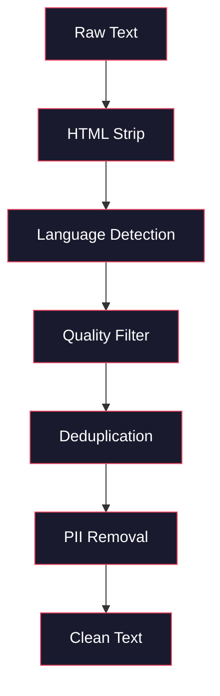
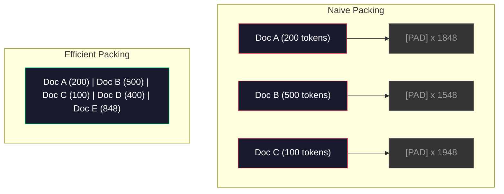

# خط های داده برای آموزش پیش از آموزش

> مدل یک آینه است. هر گونه داده ای که به آن داده می شود را منعکس می کند. آن را به زباله می دهد، زباله را با روان بودن کامل منعکس می کند.

**Type:** Build
**Languages:** Python
**Prerequisites:** Phase 10, Lessons 01-02 (Tokenizers, Building a Tokenizer)
**Time:** ~90 minutes

## اهداف یادگیری

- یک خط خط جریان داده بسازید که توکن ها، قطعات، مخلوط ها و دسته بندی های ترابایت متن را بدون بارگذاری همه آن را به حافظه
- پیاده سازی فیلترهای کیفیت داده (دوبلیکیشن، تشخیص زبان، فیلتر محتوا) که در خط های اصلی پیش از آموزش استفاده می شود
- ایجاد یک سری تمرینات با طول ثابت با ماسک های توجه مناسب و کنترل مرزهای اسناد
- تولید خط لوله پروفایل برای اطمینان از سرعت آموزش GPU

## مشکل

تو توکنيزر داري و حالا به داده ها نياز داري

نه مجموعه داده ها، نه فایل CSV، ترابایت متن، تمیز شده، تخفیف شده، فیلتر شده برای کیفیت، توکن شده به دنباله های طول ثابت، و به اندازه کافی سریع به دسته های تصادفی ارائه شده که 8GPU شما هرگز منتظر دسته بعدی نیست.

اکثر مردم فکر می کنند که آموزش یک LLM در مورد معماری مدل است. این مورد نیست. Llama 3 از 15.6 تریلیون توکن استفاده کرد. GPT-3 از 300 میلیارد توکن استفاده کرد. DeepSeek-V2 از 8.1 تریلیون استفاده کرد. معماری در هر سه تقریبا یکسان است: بلوک های ترانسفورماتور با توجه و لایه های پیشرو. تفاوت در کیفیت خروجی به طور گسترده از داده ها می آید.

مقاله "چينچيلا" از "دپميند" اين موضوع رو درست ميکنه برای یک بودجه محاسباتی مشخص، نسبت مطلوب پارامترهای مدل به توکن های آموزش وجود دارد. چینچیلا نشان داد که اکثر مدل ها در سال 2022 به شدت زیرآموز بودند -- آنها پارامترهای زیادی برای مقدار داده هایی که می دیدند داشتند. یک مدل پارامتر 70B که بر روی 1.4 تریلیون توکن آموزش دیده است (چینچیلا-افزونی) عملکرد مدل 280B که بر روی 300 میلیارد توکن آموزش دیده است (گفیر) را از دست داد.

خط داده شما تعیین می کند که آیا مدل شما زبان را یاد می گیرد یا صدا را.

## مفهوم

### از کجا آمده است

هر مدل بزرگ زبان بر اساس مخلوط منابع آموزش داده شده است. ترکیب دقیق آن برای اکثر آزمایشگاه ها یک راز محرمانه است، اما ما به اندازه کافی برای درک دسته بندی ها می دانیم.

| Source | Size | Quality | Used By |
|--------|------|---------|---------|
| Common Crawl | ~250 TB raw | Low (needs heavy filtering) | GPT-3, Llama, most open models |
| Wikipedia | ~20 GB | High | Every major LLM |
| GitHub code | ~1 TB+ | Medium (lots of duplicates, dead code) | StarCoder, CodeLlama, DeepSeek-Coder |
| Books (BookCorpus, Pile) | ~100 GB | High | GPT-2, GPT-3, early models |
| Academic papers (arXiv, S2ORC) | ~100 GB | High for STEM | Llama, Galactica |
| StackOverflow, Reddit | ~100 GB | Medium | Llama, Falcon |
| Curated web (C4, RefinedWeb) | ~5 TB | Medium-High (pre-filtered) | T5, Falcon |

Llama 3 ترکیب داده های خود را افشا کرد: حدود 50٪ داده های وب، 25٪ کد، 13٪ کتاب ها و مقالات علمی، 8٪ داده های ریاضی و 4٪ داده های وب چندزبانی. مجموع 15.6 تریلیون توکن از منابع بیش از 5 TB از متن خام بود.

نسبت هم به اندازه ی کل اهمیت دارد. اطلاعات وب زیاد و مدل تبدیل به یک طوطی ریدت می شود. کد کمی و نمی تواند برنامه ریزی کند. ریاضیات کمی و نمی تواند استدلال کند. درست کردن این ترکیب یکی از سخت ترین بخش های آموزش یک LLM است، و هیچ فرمولی وجود ندارد - نیاز به آزمایش و ارزیابی دارد.

### پاکسازی داده ها

داده های خام وب کثیف است. یک کثافت معمول Crawl شامل:

- برچسب های HTML و جاوا اسکریپت
- سر و پای های کتل، پا، مینیو های ناوبری
- صفحات تکراری (در صورت دقیق و نزدیک به تکراری)
- اسپم تولید شده توسط ماشین
- اطلاعات شناسایی شخصی (PII)
- متن با کیفیت پایین (نویس کلمات کلیدی، اسپم سئو)
- محتوای غیرمتن که به عنوان متن کدگذاری شده است

تمیز کردن این گزینه اختیاری نیست. این تفاوت بین یک مدل است که پاراگراف های منسجم تولید می کند و یکی که برچسب های HTML را با لیست های محصول مخلوط می کند.



هر مرحله یک دسته از صدا را از بین می برد:

**HTML stripping:**تمام مارکاپ ها رو حذف کن فقط محتوای متن قابل مشاهده رو نگه دار`trafilatura`یا`readability`محتوای مقاله را در حالی که از ناوبری، تبلیغات و صفحه کتلر حذف می کنید، استخراج کنید.

**Language detection:**از مدل شناسایی زبان fastText (lid.176.bin) برای طبقه بندی هر سند استفاده کنید. به زبان های هدف خود فیلتر کنید. یک سند به عنوان انگلیسی با اطمینان کمتر از 0.8 احتمالاً انگلیسی تمیز نیست.

**Quality filtering:**اینجا جایی است که جالب می شود. RefinedWeb (مجموعه داده های پشت فالکن) یک فیلتر مبتنی بر پیچیدگی را استفاده می کند: یک مدل زبان کوچک را در ویکی پدیا آموزش دهید، سپس هر سند را امتیاز دهید. پیچیدگی بالا به این معنی است که سند متفاوت از ویکی پدیا است - احتمالاً اسپام، لیست کلمات کلیدی یا محتوای تولید شده توسط ماشین. اسناد با پیچیدگی بالاتر از یک حد حذف می شوند.

**Deduplication:**ساده ترین مرحله تمیز کردن. Common Crawl شامل تعداد زیادی از صفحات تکراری است - اعلامیه های حقوقی، اطلاعیه های کوکی، شرایط خدمات. آموزش در مورد تکراری ها می تواند باعث شود که مدل متن های خاصی را به یاد بگیرد و دوباره به زبان بیاورد.

**PII removal:**نام ها، آدرس های ایمیل، شماره تلفن، شماره های امنیت اجتماعی، شناسایی مبتنی بر Regex برای PII ساختاری، مدل های NER برای نام در زمینه.

### تخفیف با MinHash

تخفیف دقیق آسان است: هر سند را هاش کنید، دوگونی ها را حذف کنید. اما دوگونی های نزدیک مشکل اصلی هستند. دو نسخه از یک مقاله خبری با تبلیغات کمی متفاوت در اطراف آن دوگونی های نزدیک هستند. محتوای 95٪ یکسان است، اما باایت به باایت متفاوت هستند.

MinHash + Hashing حساس به محل (LSH) این مسئله را به طور موثر حل می کند.


ایده:

1. **Shingling:**هر سند را به مجموعه ای از n-گرام تبدیل کنید (به عنوان مثال، 5 گرم از کلمات یا شخصیت ها). "شنگال قهوه ای سریع" با 3 کلمه به {"شنگال قهوه ای سریع"، "شنگال قهوه ای سریع"} تبدیل می شود.

2. **MinHash:**برای هر مجموعه شینگل سند، مقادیر هاش k را محاسبه کنید. هر ارزش هاش حداقل هاش در تمام شینگلز تحت یک تابع هاش متفاوت است. این یک "توقيع" اندازه گیری شده ایجاد می کند که به شباهت جکارد بین هر دو سند نزدیک می شود.

3. **LSH:**اسناد را به سطل هایی بر اساس باند های امضای MinHash خود گروه کنید. اسناد در همان سطل دوگانه های کاندید هستند. این از مقایسه هر جفت جلوگیری می کند - شما فقط کاندیداها را مقایسه می کنید.

4. **Verify:**برای هر جفت کاندید، شباهت دقیق جکارد را محاسبه کنید. یک کپی را حذف کنید اگر شباهت از حد (معمولا 0.8) فراتر رود.

تیم Llama گزارش داد که حدود 38 درصد از داده های وب خود را از طریق تخفیف حذف کرده اند. این تعداد کوچک نیست. بیش از یک سوم از Crawl مشترک محتوای تکراری یا تقریباً تکراری است.

### بسته بندی ترتیب

مدل شما انتظار دنباله های ورودی با طول ثابت دارد. اسناد شما طول متغیر دارند. بعضی از آنها 50 توکن هستند. بعضی از آنها 50 هزار توکن هستند.

رویکرد ساده: هر سند را به حداکثر طول دنباله ای پوشانید. این هزینه های محاسباتی زیادی را در توکن های پوشان که هیچ کاری برای یادگیری انجام نمی دهند، می دهد.

رویکرد بهتر: بسته بندی چندین سند به یک ردیف واحد، که توسط توکن های پایان ردیف جدا می شوند. یک ردیف 2048 توکن ممکن است شامل سه سند کوتاه با توکن های [EOS] بین آنها باشد.



ماسک توجه باید به درستی تنظیم شود. توکن های مستند A نباید در یک ردیف بسته شده به توکن های مستند B توجه کنند. این نیازمند ماسک توجه قطبی بلوک است.

اسناد طولانی در مرز های ردیف کوتاه یا به قطعات تقسیم می شوند. نقطه تقسیم مهم است: تقسیم در وسط جمله مجبور می کند مدل افکار نامکمل را ببیند. برخی خطوط لوله ای تقسیم را به مرز های پاراگراف یا جمله در صورت امکان هماهنگ می کنند.

### قانون مقیاس بندی چینچیلا

برای بودجه محاسباتی ثابت C (به صورت FLOP اندازه گیری شده) ، اندازه ی مطلوب مدل N و اندازه ی مجموعه داده ها D عبارتند از:

```
N_opt ~ C^0.5
D_opt ~ C^0.5
```

در عمل، این بدان معنی است که شما باید اندازه مدل و اندازه مجموعه داده ها را تقریباً یکسان اندازه گیری کنید. یک مدل با 10 برابر پارامترهای بیشتر به حدود 10 برابر توکن های آموزش بیشتری برای رسیدن به همان ضرر نیاز دارد.

| Model | Parameters | Training Tokens | Chinchilla-Optimal? |
|-------|-----------|----------------|-------------------|
| GPT-3 | 175B | 300B | No (undertrained 3-4x) |
| Chinchilla | 70B | 1.4T | Yes (by design) |
| Llama 2 | 70B | 2T | Overtrained (intentionally) |
| Llama 3 | 70B | 15T | Heavily overtrained |

Llama 3 عمداً قانون چینچیلا را نقض می کند. میتا دریافت که آموزش بیش از حد در داده های بیشتر - بسیار فراتر از نسبت بهینه محاسبه - مدل های بهتری برای نتیجه گیری تولید می کند. هزینه های اضافی آموزش یک بار پرداخت می شود، اما مدل کوچکتر برای همیشه ارزان تر است. این گاهی اوقات به عنوان رویکرد مقیاس بندی "تغییر بهینه" نامیده می شود و از سال 2024 به استاندارد صنعت تبدیل شده است.

```figure
l5-data-pipeline
```

## آن را بسازید

### مرحله ی اول: پاکسازی متن

HTML را حذف کنید، فضای سفید را عادی کنید، محتوای غیر متنی را حذف کنید. ما از یک متن دامنه عمومی (پروژۀ گوتنبرگ) به عنوان کورپوس کوچک خود استفاده خواهیم کرد.

```python
import re

def clean_text(text):
    text = re.sub(r"<[^>]+>", "", text)
    text = re.sub(r"http\S+", "", text)
    text = re.sub(r"[^\x20-\x7E\n]", "", text)
    text = re.sub(r"\n{3,}", "\n\n", text)
    text = re.sub(r" {2,}", " ", text)
    return text.strip()

def quality_filter(text, min_words=50, max_ratio_caps=0.3, max_ratio_special=0.1):
    words = text.split()
    if len(words) < min_words:
        return False
    caps_ratio = sum(1 for w in words if w.isupper()) / len(words)
    if caps_ratio > max_ratio_caps:
        return False
    special_chars = sum(1 for c in text if not c.isalnum() and not c.isspace())
    if special_chars / max(len(text), 1) > max_ratio_special:
        return False
    return True
```

فیلتر کیفیت اسپام سئو (ALL CAPS) ، صداهای تولید شده توسط ماشین (نسب خاص خاص بالا) و صفحات استوب (تنها کوتاه) را ضبط می کند. این سه چک به تنهایی مقدار شگفت انگیزی زباله را از خزیدن وب حذف می کند.

### مرحله 2: تخفیف MinHash

من هاش رو از نو اجرا کن، نیازی به کتابخانه های خارجی نیست فقط`hashlib`. .

```python
import hashlib
from collections import defaultdict

def get_shingles(text, k=5):
    words = text.lower().split()
    if len(words) < k:
        return set()
    return {" ".join(words[i:i+k]) for i in range(len(words) - k + 1)}

def minhash_signature(shingles, num_hashes=128):
    signature = []
    for i in range(num_hashes):
        min_hash = float("inf")
        for shingle in shingles:
            h = int(hashlib.sha256(f"{i}:{shingle}".encode()).hexdigest(), 16)
            min_hash = min(min_hash, h)
        signature.append(min_hash)
    return signature

def lsh_buckets(signature, bands=16):
    rows_per_band = len(signature) // bands
    buckets = []
    for b in range(bands):
        start = b * rows_per_band
        band_data = tuple(signature[start:start + rows_per_band])
        bucket_hash = hashlib.md5(str(band_data).encode()).hexdigest()
        buckets.append((b, bucket_hash))
    return buckets

def deduplicate(documents, threshold=0.8, num_hashes=128, bands=16):
    signatures = []
    shingle_sets = []
    for doc in documents:
        shingles = get_shingles(doc)
        shingle_sets.append(shingles)
        signatures.append(minhash_signature(shingles, num_hashes))

    bucket_map = defaultdict(list)
    for doc_idx, sig in enumerate(signatures):
        for band_id, bucket_hash in lsh_buckets(sig, bands):
            bucket_map[(band_id, bucket_hash)].append(doc_idx)

    duplicate_pairs = set()
    for bucket_docs in bucket_map.values():
        if len(bucket_docs) < 2:
            continue
        for i in range(len(bucket_docs)):
            for j in range(i + 1, len(bucket_docs)):
                duplicate_pairs.add((bucket_docs[i], bucket_docs[j]))

    removed = set()
    for i, j in duplicate_pairs:
        if i in removed or j in removed:
            continue
        s1, s2 = shingle_sets[i], shingle_sets[j]
        if not s1 or not s2:
            continue
        jaccard = len(s1 & s2) / len(s1 | s2)
        if jaccard >= threshold:
            removed.add(j)

    return [doc for idx, doc in enumerate(documents) if idx not in removed], len(removed)
```

.`num_hashes=128`و`bands=16`پارامترهای کنترل کردن تراکنش دقیق-بازگیره. hashes بیشتر تخمین های مشابهی دقیق تر را ارائه می دهند. باند های بیشتر بازگیره را افزایش می دهند (بازگیره های بیشتری را می گیرند) با هزینه مثبت های غلط بیشتر. این ارزش ها برای متن وب معمولی خوب کار می کنند.

### مرحله سوم: نشانه ها و بسته بندی ردیف ها

متن پاک و پاک را بکشید، آن را به شکل توکن تبدیل کنید و برای آموزش آن را به دنباله های ثابت در یک اندازه جمع کنید.

```python
def tokenize_corpus(documents, tokenizer):
    all_tokens = []
    for doc in documents:
        tokens = tokenizer.encode(doc)
        all_tokens.extend(tokens)
        all_tokens.append(tokenizer.eos_id)
    return all_tokens

def pack_sequences(token_ids, seq_length, pad_id=0):
    sequences = []
    attention_masks = []
    for i in range(0, len(token_ids), seq_length):
        seq = token_ids[i:i + seq_length]
        mask = [1] * len(seq)
        if len(seq) < seq_length:
            pad_count = seq_length - len(seq)
            seq = seq + [pad_id] * pad_count
            mask = mask + [0] * pad_count
        sequences.append(seq)
        attention_masks.append(mask)
    return sequences, attention_masks
```

### مرحله 4: DataLoader برای آموزش

دسته بندی تصادفی از دنباله های بسته شده را تولید کنید این چیزی است که چرخه آموزشی مصرف می کند.

```python
import random

class PreTrainingDataLoader:
    def __init__(self, sequences, attention_masks, batch_size, shuffle=True):
        self.sequences = sequences
        self.attention_masks = attention_masks
        self.batch_size = batch_size
        self.shuffle = shuffle

    def __len__(self):
        return (len(self.sequences) + self.batch_size - 1) // self.batch_size

    def __iter__(self):
        indices = list(range(len(self.sequences)))
        if self.shuffle:
            random.shuffle(indices)
        for start in range(0, len(indices), self.batch_size):
            batch_idx = indices[start:start + self.batch_size]
            batch_seqs = [self.sequences[i] for i in batch_idx]
            batch_masks = [self.attention_masks[i] for i in batch_idx]
            yield batch_seqs, batch_masks
```

### مرحله 5: آمار مجموعه داده ها

تعداد مهم را محاسبه کنید: مجموع توکن ها، توکن های منحصر به فرد، نسبت فشرده سازی، توزیع طول سند.

```python
from collections import Counter

def compute_statistics(documents, token_ids, sequences, tokenizer_vocab_size):
    total_chars = sum(len(d) for d in documents)
    total_tokens = len(token_ids)
    unique_tokens = len(set(token_ids))
    compression_ratio = total_chars / total_tokens

    doc_lengths = [len(d.split()) for d in documents]
    avg_doc_length = sum(doc_lengths) / max(len(doc_lengths), 1)
    max_doc_length = max(doc_lengths) if doc_lengths else 0
    min_doc_length = min(doc_lengths) if doc_lengths else 0

    token_counts = Counter(token_ids)
    top_tokens = token_counts.most_common(10)

    non_pad_tokens = sum(sum(1 for t in seq if t != 0) for seq in sequences)
    total_positions = sum(len(seq) for seq in sequences)
    utilization = non_pad_tokens / max(total_positions, 1)

    stats = {
        "total_documents": len(documents),
        "total_characters": total_chars,
        "total_tokens": total_tokens,
        "unique_tokens": unique_tokens,
        "vocab_utilization": unique_tokens / tokenizer_vocab_size,
        "compression_ratio": compression_ratio,
        "avg_doc_length_words": avg_doc_length,
        "max_doc_length_words": max_doc_length,
        "min_doc_length_words": min_doc_length,
        "num_sequences": len(sequences),
        "sequence_utilization": utilization,
        "top_10_tokens": top_tokens,
    }
    return stats
```

نسبت فشرده سازی به شما می گوید که توکنایزر در این کورپوس چقدر کارآمد است. متن انگلیسی معمولاً به حدود 3-4 حرف در هر توکن فشرده می شود. اگر شما 1.5 حرف در هر توکن را ببینید، توکنایزر شما به شدت به شدت تقسیم می شود. اگر شما 8+ را ببینید، آن را به ادغام های بسیار خاص دامنه آموخته است.

استفاده از دنباله به شما می گوید که مقدار دنباله های بسته بندی شده شما داده های واقعی در مقابل پوشاندن است. زیر 90 درصد به این معنی است که بسته بندی شما ناکارآمد است - شما در حال هدر دادن محاسبات در توکن های پوشاندن هستید.

## ازش استفاده کن

### مقایسه با مجموعه داده های HuggingFace

همون کارپوس رو از کتابخانه مجموعه داده های HuggingFace بارگذاری کن و سرعت خط لوله رو مقایسه کن

```python
from datasets import load_dataset
from transformers import AutoTokenizer

ds = load_dataset("wikitext", "wikitext-2-raw-v1", split="train")
tokenizer = AutoTokenizer.from_pretrained("meta-llama/Meta-Llama-3-8B")

import time

start = time.time()
tokenized = ds.map(
    lambda x: tokenizer(x["text"], truncation=True, max_length=2048),
    batched=True,
    num_proc=4,
)
hf_time = time.time() - start
total_tokens = sum(len(t) for t in tokenized["input_ids"])
print(f"HuggingFace: {total_tokens:,} tokens in {hf_time:.2f}s ({total_tokens/hf_time:,.0f} tokens/sec)")
```

لوله HuggingFace از توکن های Rust تحت هود و پردازش موازی در 4 هسته استفاده می کند. لوله های خالص پایتون شما 10 تا 50 برابر کندتر خواهند بود. این شکاف دلیل استفاده از تیم های تولید از توکن های مرتب شده است. الگوریتم یکسان است. زبان پیاده سازی تفاوت است.

## -باده

این درس یک دستور کار برای تأیید و اشکال زدایی کیفیت داده ها در خطوط آموزشی LLM را فراهم می کند.`outputs/prompt-data-quality-checker.md`. .

## تمرینات

1. **Easy:**از طریق یک تجزیه و تحلیل ساده (تعداد شخصیت) ، تشخیص زبان را به خط لوله تمیز کردن اضافه کنید. فقط اسناد انگلیسی را فیلتر کنید و اندازه گیری کنید که چه تعداد سند حذف می شود.
2. **Medium:**از طریق استفاده از هاش های SHA-256 در کنار هاش های نزدیک به MinHash، تخفیف دقیق را اجرا کنید. تعداد کپی های گرفته شده توسط هر روش را در یک کورپوس وب اسکریپت مقایسه کنید.
3. **Hard:**فیلتر کیفیت مبتنی بر پیچیدگی بسازید. یک مدل زبان کوچک بیگرام را در متن ویکی پدیا آموزش دهید، هر سند را با پیچیدگی امتیاز دهید و پایین ترین 20٪ را حذف کنید. کیفیت محصول مدل را هنگام آموزش در داده های فیلتر شده و بدون فیلتر مقایسه کنید.

## اصطلاحات کلیدی

| Term | What people say | What it actually means |
|------|----------------|----------------------|
| Common Crawl | "The internet" | A non-profit that crawls the web monthly -- ~250TB raw, the starting point for most LLM training data |
| MinHash | "Some hashing trick" | A technique to estimate Jaccard similarity between sets using fixed-size signatures -- enables near-duplicate detection at scale |
| LSH | "Locality-Sensitive Hashing" | A method to group similar items into the same bucket -- reduces pairwise comparisons from O(n^2) to near-linear |
| Sequence packing | "Concatenating documents" | Fitting multiple documents into fixed-length sequences with proper attention masks -- eliminates padding waste |
| Chinchilla scaling | "Train on more data" | For a fixed compute budget, optimal performance requires scaling model size and training tokens roughly equally |
| Fertility | "Tokens per word" | Average number of tokens per word -- 1.3 for English in GPT-4, higher for non-Latin scripts |
| Data mixing | "Choosing training data" | The ratio of code vs text vs math vs multilingual data -- no formula, requires experimentation |
| Perplexity filter | "Quality scoring" | Use a small language model to score documents -- high perplexity means the text is unlike clean reference data |
| Deduplication | "Removing copies" | Eliminating exact and near-duplicate documents -- typically removes 30-40% of raw web data |
| Attention mask | "Which tokens to look at" | A binary mask that prevents attention across document boundaries in packed sequences |

## خواندن بیشتر

- [Hoffmann et al., 2022 -- Training Compute-Optimal Large Language Models (Chinchilla)](https://arxiv.org/abs/2203.15556)-- مقاله ای که نحوه ی تفکر ما در مورد مقیاس داده ها را تغییر داد
- [Penedo et al., 2023 -- The RefinedWeb Dataset for Falcon LLM](https://arxiv.org/abs/2306.01116)-- چطوري براي فلتر کردن Common Crawl به کیفیت بالا
- [Touvron et al., 2023 -- Llama 2: Open Foundation and Fine-Tuned Chat Models](https://arxiv.org/abs/2307.09288)-- اطلاعات خط لوله برای Llama 2
- [Lee et al., 2022 -- Deduplicating Training Data Makes Language Models Better](https://arxiv.org/abs/2107.06499)-- چرا تخفیف مهم تر از آنچه فکر می کنید است
- [Broder, 1997 -- On the Resemblance and Containment of Documents](https://ieeexplore.ieee.org/document/666900)-- کاغذ اصلی مین هاش
- [Meta, 2024 -- Llama 3 Technical Report](https://arxiv.org/abs/2407.21783)-- 15.6T توکن ها، نسبت مخلوط داده ها، لوله فیلتر
