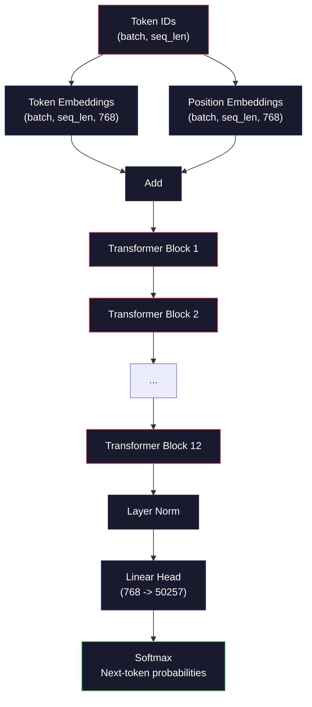
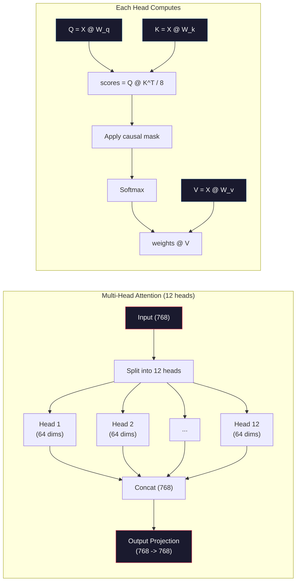
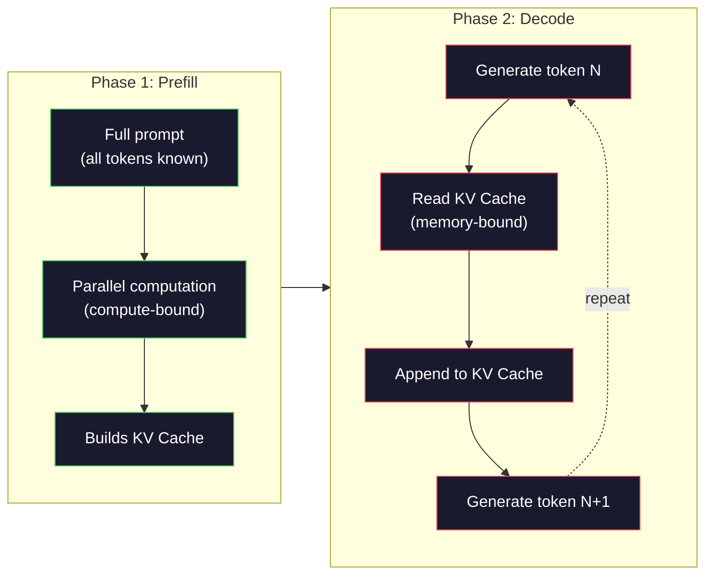

# پیش از آموزش یک GPT کوچک (124M پارامتر)

> GPT-2 Small 124 میلیون پارامتر دارد. این 12 لایه ترانسفورماتور، 12 سر توجه و 768 بعدی است. شما می توانید آن را از ابتدا در یک GPU واحد در چند ساعت آموزش دهید. اکثر مردم هرگز این کار را نمی کنند. آنها از نقاط بازرسی پیش از آموزش استفاده می کنند. اما اگر شما خودتان یک را آموزش ندهید، شما واقعا نمی دانید که در داخل مدل که محصولات را بر روی آن می سازید چه اتفاقی می افتد.

**Type:** Build
**Languages:** Python (with numpy)
**Prerequisites:** Phase 10, Lessons 01-03 (Tokenizers, Building a Tokenizer, Data Pipelines)
**Time:** ~120 minutes

## اهداف یادگیری

- پیاده سازی معماری کامل GPT-2 (124M پارامتر) از ابتدا: گنجانده شدن توکن ها، گنجانده شدن موقعیت ها، بلوک های ترانسفورماتور و سر مدل زبان
- تمرین یک مدل GPT در یک متن با استفاده از پیش بینی توکن بعدی با از دست دادن آنترپی متقاطع
- پیاده سازی تولید متن خودکشی با نمونه گیری دمای و فیلتر کردن top-k/top-p
- منحنیات از دست دادن آموزش را نظارت کنید و تأیید کنید که مدل الگوهای منسجم زبان را یاد می گیرد

## مشکل

شما می دانید که یک ترانسفورماتور چیست. شما نمودارها را خوانده اید. شما می توانید "انتباه تنها چیزی است که شما نیاز دارید" را بخوانید و جعبه هایی را که برچسب "انتباه چند سر" را روی یک صفحه سفید نشان می دهید.

هیچ چیز از این بدان معنی نیست که شما می دانید وقتی یک مدل متن تولید می کند چه اتفاقی می افتد.

در GPT-2 Small (با وزن متصل) 124,438,272 پارامتر وجود دارد. هر یک از آنها با اجرا یک حلقه آموزش تنظیم شد: عبور جلو، از دست دادن محاسبه، عبور عقب، وزنهای تازه. دوازده بلوک ترانسفورماتور 12 تا سر توجه در هر بلوک یک فضای 768 بعدی يک لغت از 50257 توکن هر بار که مدل یک توکن تولید کند، تمام 124 میلیون پارامتر در یک زنجیره ضرب ماتریکس واحد شرکت می کنند که یک ردیف از شناسه های توکن را می گیرد و توزیع احتمال را در توکن بعدی تولید می کند.

اگر شما هرگز این را خودتان ساخته اید، شما با یک جعبه سیاه کار می کنید. شما می توانید از API استفاده کنید. شما می توانید تنظیمات را خوب کنید. اما وقتی چیزی اشتباه می شود - وقتی مدل توهم می کند، وقتی خود را تکرار می کند، وقتی از پیروی از دستورالعمل ها انکار می کند - شما هیچ مدل ذهنی برای *چرا* ندارید.

این درس GPT-2 را از نو ساخت. نه در PyTorch. در numpy. هر ضرب ماتریک قابل مشاهده است. هر گرادینت توسط کد شما محاسبه می شود. شما دقیقا خواهید دید که چگونه 124 میلیون عدد برای پیش بینی کلمه بعدی سازش می کنند.

## مفهوم

### معماری GPT

GPT یک مدل زبان autoregressive است. "autoregressive" به معنای تولید یک توکن در یک زمان است، هر یک از آنها بر روی تمام توکن های قبلی مشروط است. معماری یک دسته از بلوک های دیکودر ترانسفورماتور است.

این گراف کامل محاسبه از شناسه های توکن تا احتمال های توکن بعدی است:

1. نماد شناسه ها وارد می شوند. شکل: (بچ_سائز، seq_len).
2. جستجوی سمبول. هر شناسه نقشه به یک ویکتور 768 بعدی. شکل: (بچ_size, seq_len, 768).
3. هر موقعیت (0,1,2, ...) نقشه به یک ویکتور 768 بعدی. شکل مشابه.
4. اضافه کردن رمزگذاری + موقعیت گذاری
5. از 12 بلوک ترانسفورماتور عبور کن
6. طبقه آخر نرمال شدن
7. طرح خطی به اندازه لغت. شکل: (بچ_size، seq_len، vocab_size).
8. نرم تا احتمالات رو بدست بيار

این کل مدل است. هیچ پیچ و جوی و تکرار نیست. فقط گنجانده شدن، توجه، شبکه های بازتاب و استاندارد های لایه 12 بار جمع شده است.



### بلوک ترانسفورماتور

هر یک از 12 بلوک از الگوی مشابه پیروی می کند. معماری قبل از استاندارد (GPT-2 از قبل از استاندارد استفاده می کند، نه پس از استاندارد مانند ترانسفورماتور اصلی):

1. لایه نورم
2. توجه به خود چند سر
3. اتصال باقیمانده (به ورودی باز اضافه کنید)
4. لایه نورم
5. شبکه ارسال اطلاعات (MLP)
6. اتصال باقیمانده (به ورودی باز اضافه کنید)

اتصال های باقیمانده حیاتی هستند. بدون آنها، گرادینت ها در زمان رسیدن به بلوک 1 در طول گسترش عقب ناپدید می شوند. با آنها، گرادینت ها می توانند مستقیما از ضایع به هر لایه از طریق مسیر "پریدن" جریان یابند. به همین دلیل می توانید بلوک های 12، 32 یا حتی 96 را جمع کنید (GPT-4 به طور شایعه ای از 120 استفاده می کند).

### توجه: مکانیسم اصلی

توجه به خود اجازه می دهد که هر نشانه به هر نشانه قبلی نگاه کند و تصمیم بگیرد که چقدر به هر یک توجه کند.

برای هر موقعیت رمزنگاری، سه متری را از ورودی محاسبه کنید:
- **Query (Q)**"من دنبال چي ميگردم؟"
- **Key (K)**"من چه چيزي رو در خود دارم؟"
- **Value (V)**: "چه اطلاعاتي دارم؟"

```
Q = input @ W_q    (768 -> 768)
K = input @ W_k    (768 -> 768)
V = input @ W_v    (768 -> 768)

attention_scores = Q @ K^T / sqrt(d_k)
attention_scores = mask(attention_scores)   # causal mask: -inf for future positions
attention_weights = softmax(attention_scores)
output = attention_weights @ V
```

ماسک علت گرایی باعث می شود که GPT خودکشی کند. موقعیت 5 می تواند به موقعیت های 0-5 توجه کند اما نه 6, 7, 8 و غیره. این مانع از "خداطوری" مدل از طریق نگاه کردن به توکن های آینده در طول آموزش می شود.

**Multi-head attention**در این بخش، فضای 768 بعدی را به 12 سر با هر یک از 64 ابعاد تقسیم می کند. هر سر الگوی توجه متفاوتی را یاد می گیرد. یک سر ممکن است روابط نحوی را ردیابی کند (اتفاق موضوع و فعل). یکی دیگر ممکن است شباهت معنوی را ردیابی کند (سینونیم ها). یکی دیگر ممکن است نزدیکی موقعیت را ردیابی کند (کلمات نزدیک). نتایج از هر 12 سر به هم متصل شده و به 768 ابعاد بازتاب داده می شود.



تقسیم با sqrt(d_k) -- sqrt(64) = 8 -- مقیاس است. بدون آن، محصولات نقطه برای متریهای ابعاد بالا بزرگ می شوند، و نرمترین را به مناطقی که گرادیانت تقریبا صفر است، فشار می دهند. این یکی از بینش های کلیدی در مقاله اصلی "اهتمام تنها چیزی است که شما نیاز دارید" بود.

### KV Cache: چرا نتیجه گیری سریع است

در طول آموزش، شما تمام تکه را به یک بار پردازش می کنید. در طول نتیجه گیری، شما یک توکن را در یک زمان تولید می کنید. بدون بهینه سازی، تولید توکن N نیاز به محاسبه مجدد توجه برای تمام توکن های قبلی N-1 دارد. این O(N^2) برای هر توکن تولید شده است، یا O(N^3) کل برای یک تکه طول N.

KV Cache اينو حل ميکنه بعد از محاسبه K و V برای هر توکن، آنها را ذخیره کنید. وقتی توکن N+1 تولید می کنید، فقط باید Q را برای توکن جدید محاسبه کنید و K و V را از تمام توکن های قبلی جستجو کنید. این هزینه هر توکن را از O(N) به O(1) برای محاسبه K و V کاهش می دهد. محاسبه امتیاز توجه هنوز O(N) است زیرا شما به تمام موقعیت های قبلی توجه می کنید، اما از ضربات ماتریس اضافی در ورودی جلوگیری می کنید.

برای GPT-2 با 12 لایه و 12 سر، کیش KV 2 (K + V) x 12 لایه x 12 سر x 64 dims = 18,432 ارزش در هر توکن ذخیره می کند. برای یک ردیابی 1024 توکن، که حدود 75MB در FP32 است. برای Llama 3 405B با 128 لایه، کیش KV برای یک ردیابی می تواند بیش از 10GB باشد. به همین دلیل است که نتیجه گیری زمینه طولانی به حافظه محدود است.

### پیش پر کردن در مقابل رمزگذاری: دو مرحله از فرض

وقتی به یک مدرک لیسانس می فرستید، نتیجه گیری در دو مرحله متفاوت اتفاق می افتد.

**Prefill**تمام توکن ها شناخته شده اند، بنابراین مدل می تواند توجه را برای تمام موقعیت ها به طور همزمان محاسبه کند. این مرحله محدود به محاسبه است - GPU ضربات ماتریکس را با تولید کامل انجام می دهد. برای یک توکن 1000 در A100، پیش پر کردن حدود 20-50ms است.

**Decode**توکن ها را یک به یک تولید می کند. هر توکن جدید به تمام توکن های قبلی بستگی داره. این مرحله مربوط به حافظه است - گلو شکنی خواندن وزن مدل و KV از حافظه GPU است، نه خود ریاضی ماتریکس. هسته های محاسباتی GPU بیشتر بیکار می نشینند و منتظر خواندن حافظه هستند. برای GPT-2، هر مرحله رمزگذاری تقریباً زمان مشابهی را می گیرد، صرف نظر از اینکه مامل ها چه تعداد FLOP نیاز دارند، زیرا عرض باند حافظه محدودیت است.

این تفاوت برای سیستم های تولید مهم است. مقیاس های تولید را با محاسبه GPU (FLOPS بیشتر = prefill سریعتر) پر کنید. مقیاس های تولید را با عرض باند حافظه (memory bandwidth) (memory bandwidth = faster decode) پر کنید. به همین دلیل H100 NVIDIA بر بهبود عرض باند حافظه نسبت به A100 تمرکز کرد - به طور مستقیم تولید توکن را تسریع می کند.



### چرخه آموزش

آموزش یک LLM پیش بینی بعدی است. به عنوان توکن [0, 1, 2, ..., N-1]، توکن های پیش بینی [1, 2, 3, ..., N] را ارائه دهید. عملکرد از دست دادن بین توزیع احتمال پیش بینی شده مدل و توکن بعدی واقعی است.

يک مرحله آموزش:

1. **Forward pass**: دسته را در تمام 12 بلوک اجرا کنید. برای هر موقعیت، امتیازات (نمای های قبل از نرم) را بدست آورید.
2. **Compute loss**: انترپی متقاطع بین logits و توکن های هدف (دخل با یک موقعیت تغییر یافته است).
3. **Backward pass**: gradients برای تمام پارامترهای 124M با استفاده از backpropagation محاسبه کنید.
4. **Optimizer step**GPT-2 از آدم استفاده ميکنه تا سرعت گرم شدن و زوال کوسينو رو به دست بياره

برنامه ی سرعت یادگیری مهم تر از آنچه ممکن است انتظار داشته باشید است. GPT-2 از 0 تا نرخ یادگیری اوج در طول ۲۰۰۰ مرحله اول گرم می شود، سپس به دنبال منحنی کوسین تجزیه می شود. شروع با نرخ یادگیری بالا باعث انحراف مدل می شود. حفظ نرخ بالا ثابت باعث نوسان در آموزش های بعدی می شود. الگوی گرم شدن پس از تجزیه توسط هر LLM بزرگ استفاده می شود.

### GPT-2 کوچک: اعداد

| Component | Shape | Parameters |
|-----------|-------|------------|
| Token embeddings | (50257, 768) | 38,597,376 |
| Position embeddings | (1024, 768) | 786,432 |
| Per-block attention (W_q, W_k, W_v, W_out) | 4 x (768, 768) | 2,359,296 |
| Per-block FFN (up + down) | (768, 3072) + (3072, 768) | 4,718,592 |
| Per-block LayerNorms (2x) | 2 x 768 x 2 | 3,072 |
| Final LayerNorm | 768 x 2 | 1,536 |
| **Total per block** | | **7,080,960** |
| **Total (12 blocks)** | | **85,054,464 + 39,383,808 = 124,438,272** |

پروژکتور خروجی (سر Logits) وزنهایی را با ماتریس گنجانیدن توکن به اشتراک می گذارد. این به عنوان وزن پیوند نامیده می شود - این تعداد پارامتر را با 38M کاهش می دهد و عملکرد را بهبود می بخشد زیرا مدل را مجبور می کند از همان فضای نمایش برای ورودی و خروجی استفاده کند.

## آن را بسازید

### مرحله اول: قرار دادن لایه

گنجانده شدن توکن هر یک از 50257 توکن احتمالی را به یک ویکتور 768 بعدی نقشه می زند. گنجانده شدن موقعیت اطلاعات مربوط به جایی که هر توکن در ردیف قرار دارد را اضافه می کند. دو مورد به طور مجموع جمع می شوند.

```python
import numpy as np

class Embedding:
    def __init__(self, vocab_size, embed_dim, max_seq_len):
        self.token_embed = np.random.randn(vocab_size, embed_dim) * 0.02
        self.pos_embed = np.random.randn(max_seq_len, embed_dim) * 0.02

    def forward(self, token_ids):
        seq_len = token_ids.shape[-1]
        tok_emb = self.token_embed[token_ids]
        pos_emb = self.pos_embed[:seq_len]
        return tok_emb + pos_emb
```

انحراف استاندارد 0.02 برای ابتدایی از کاغذ GPT-2 است. بیش از حد بزرگ و گذر اولیه پیش تولید می کند ارزش های شدید است که بی ثبات آموزش. بیش از حد کوچک و خروجی اولیه تقریبا یکسان برای همه ورودی است، به طوری که سیگنال های گرادینت اولیه بی فایده است.

### مرحله دوم: خودبهرشی با ماسک علت

توجه یک سر اول. ماسک علتي موقعیت های آینده را قبل از نرمترین حد به بی نهایت منفی می اندازد، اطمینان حاصل می کند که هر موقعیت فقط می تواند به خود و موقعیت های قبلی توجه کند.

```python
def attention(Q, K, V, mask=None):
    d_k = Q.shape[-1]
    scores = Q @ K.transpose(0, -1, -2 if Q.ndim == 4 else 1) / np.sqrt(d_k)
    if mask is not None:
        scores = scores + mask
    weights = np.exp(scores - scores.max(axis=-1, keepdims=True))
    weights = weights / weights.sum(axis=-1, keepdims=True)
    return weights @ V
```

پیاده سازی softmax حداکثر را قبل از نمادگذاری از دست می دهد. بدون این، exp(large_number) به بی نهایت جریان می یابد. این یک ترفند ثبات عددی است که تولید را تغییر نمی دهد زیرا softmax(x - c) = softmax(x) برای هر ثابت c.

### مرحله سوم: توجه چند سر

ورودی 768 بعدی را به 12 سر با هر 64 ابعاد تقسیم کنید. هر سر توجه را به طور مستقل محاسبه می کند. نتایج را به 768 ابعاد بازگردانید.

```python
class MultiHeadAttention:
    def __init__(self, embed_dim, num_heads):
        self.num_heads = num_heads
        self.head_dim = embed_dim // num_heads
        self.W_q = np.random.randn(embed_dim, embed_dim) * 0.02
        self.W_k = np.random.randn(embed_dim, embed_dim) * 0.02
        self.W_v = np.random.randn(embed_dim, embed_dim) * 0.02
        self.W_out = np.random.randn(embed_dim, embed_dim) * 0.02

    def forward(self, x, mask=None):
        batch, seq_len, d = x.shape
        Q = (x @ self.W_q).reshape(batch, seq_len, self.num_heads, self.head_dim).transpose(0, 2, 1, 3)
        K = (x @ self.W_k).reshape(batch, seq_len, self.num_heads, self.head_dim).transpose(0, 2, 1, 3)
        V = (x @ self.W_v).reshape(batch, seq_len, self.num_heads, self.head_dim).transpose(0, 2, 1, 3)

        scores = Q @ K.transpose(0, 1, 3, 2) / np.sqrt(self.head_dim)
        if mask is not None:
            scores = scores + mask
        weights = np.exp(scores - scores.max(axis=-1, keepdims=True))
        weights = weights / weights.sum(axis=-1, keepdims=True)
        attn_out = weights @ V

        attn_out = attn_out.transpose(0, 2, 1, 3).reshape(batch, seq_len, d)
        return attn_out @ self.W_out
```

رقص تغییر شکل-تضحیک-تضحیک بیشتر بخش گیج کننده ی توجه چند سر است. این اتفاق می افتد: تنسور (بچ، seq_len، 768) تبدیل به (بچ، seq_len، 12, 64) می شود، سپس (بچ، 12, seq_len، 64). حالا هر یک از 12 سر دارای ماتریک خود (seq_len، 64) برای هدایت توجه است. پس از توجه، ما روند را معکوس می کنیم: (بچ، 12، seq_len، 64) می شود (بچ، seq_len، 12, 64) می شود (بچ، seq_len، 768).

### مرحله چهارم: بلاک ترانسفورماتور

یک بلوک کامل ترانسفورماتور: LayerNorm، توجه چند سر با باقی مانده، LayerNorm، feedforward با باقی مانده.

```python
class LayerNorm:
    def __init__(self, dim, eps=1e-5):
        self.gamma = np.ones(dim)
        self.beta = np.zeros(dim)
        self.eps = eps

    def forward(self, x):
        mean = x.mean(axis=-1, keepdims=True)
        var = x.var(axis=-1, keepdims=True)
        return self.gamma * (x - mean) / np.sqrt(var + self.eps) + self.beta


class FeedForward:
    def __init__(self, embed_dim, ff_dim):
        self.W1 = np.random.randn(embed_dim, ff_dim) * 0.02
        self.b1 = np.zeros(ff_dim)
        self.W2 = np.random.randn(ff_dim, embed_dim) * 0.02
        self.b2 = np.zeros(embed_dim)

    def forward(self, x):
        h = x @ self.W1 + self.b1
        h = np.maximum(0, h)  # GELU approximation: ReLU for simplicity
        return h @ self.W2 + self.b2


class TransformerBlock:
    def __init__(self, embed_dim, num_heads, ff_dim):
        self.ln1 = LayerNorm(embed_dim)
        self.attn = MultiHeadAttention(embed_dim, num_heads)
        self.ln2 = LayerNorm(embed_dim)
        self.ffn = FeedForward(embed_dim, ff_dim)

    def forward(self, x, mask=None):
        x = x + self.attn.forward(self.ln1.forward(x), mask)
        x = x + self.ffn.forward(self.ln2.forward(x))
        return x
```

شبکه پیشرسانی ورودی 768 را به 3.072 ابعاد (4x) گسترش می دهد، یک غیر خطی را اعمال می کند، سپس به 768 باز می گردد. این الگوی انقباض و گسترش به مدل نمایش داخلی "بسیاری" برای کار در هر موقعیت می دهد. GPT-2 از فعال سازی GELU استفاده می کند، اما ما برای سادگی اینجا از ReLU استفاده می کنیم - تفاوت برای درک معماری جزئی است.

### مرحله 5: مدل کامل GPT

12 بلوک ترانسفورماتور را جمع کنید. لایه ی گنجانده شده را در جلو و پروژکتور خروجی را در پشت اضافه کنید.

```python
class MiniGPT:
    def __init__(self, vocab_size=50257, embed_dim=768, num_heads=12,
                 num_layers=12, max_seq_len=1024, ff_dim=3072):
        self.embedding = Embedding(vocab_size, embed_dim, max_seq_len)
        self.blocks = [
            TransformerBlock(embed_dim, num_heads, ff_dim)
            for _ in range(num_layers)
        ]
        self.ln_f = LayerNorm(embed_dim)
        self.vocab_size = vocab_size
        self.embed_dim = embed_dim

    def forward(self, token_ids):
        seq_len = token_ids.shape[-1]
        mask = np.triu(np.full((seq_len, seq_len), -1e9), k=1)

        x = self.embedding.forward(token_ids)
        for block in self.blocks:
            x = block.forward(x, mask)
        x = self.ln_f.forward(x)

        logits = x @ self.embedding.token_embed.T
        return logits

    def count_parameters(self):
        total = 0
        total += self.embedding.token_embed.size
        total += self.embedding.pos_embed.size
        for block in self.blocks:
            total += block.attn.W_q.size + block.attn.W_k.size
            total += block.attn.W_v.size + block.attn.W_out.size
            total += block.ffn.W1.size + block.ffn.b1.size
            total += block.ffn.W2.size + block.ffn.b2.size
            total += block.ln1.gamma.size + block.ln1.beta.size
            total += block.ln2.gamma.size + block.ln2.beta.size
        total += self.ln_f.gamma.size + self.ln_f.beta.size
        return total
```

توجه به وزن بسته شدن:`logits = x @ self.embedding.token_embed.T`. پروژکتور خروجی از ماتریس گنجانده شدن توکن (ترانسپوس) استفاده مجدد می کند. این فقط یک ترفند ذخیره سازی پارامتر نیست. این بدان معنی است که مدل برای درک توکن ها (توابع) و پیش بینی آنها (خروجی) از همان فضای ویکتور استفاده می کند.

### مرحله ۶: چرخه آموزش

برای یک تمرین واقعی در پارامتر 124M، شما نیاز به یک GPU و PyTorch دارید. این حلقه آموزشی مکانیک یک مدل کوچک را نشان می دهد که در حالت نمپی خالص اجرا می شود. ما از یک مدل کوچک (4 لایه، 4 سر، 128 dims) برای انجام آن استفاده می کنیم.

```python
def cross_entropy_loss(logits, targets):
    batch, seq_len, vocab_size = logits.shape
    logits_flat = logits.reshape(-1, vocab_size)
    targets_flat = targets.reshape(-1)

    max_logits = logits_flat.max(axis=-1, keepdims=True)
    log_softmax = logits_flat - max_logits - np.log(
        np.exp(logits_flat - max_logits).sum(axis=-1, keepdims=True)
    )

    loss = -log_softmax[np.arange(len(targets_flat)), targets_flat].mean()
    return loss


def train_mini_gpt(text, vocab_size=256, embed_dim=128, num_heads=4,
                   num_layers=4, seq_len=64, num_steps=200, lr=3e-4):
    tokens = np.array(list(text.encode("utf-8")[:2048]))
    model = MiniGPT(
        vocab_size=vocab_size, embed_dim=embed_dim, num_heads=num_heads,
        num_layers=num_layers, max_seq_len=seq_len, ff_dim=embed_dim * 4
    )

    print(f"Model parameters: {model.count_parameters():,}")
    print(f"Training tokens: {len(tokens):,}")
    print(f"Config: {num_layers} layers, {num_heads} heads, {embed_dim} dims")
    print()

    for step in range(num_steps):
        start_idx = np.random.randint(0, max(1, len(tokens) - seq_len - 1))
        batch_tokens = tokens[start_idx:start_idx + seq_len + 1]

        input_ids = batch_tokens[:-1].reshape(1, -1)
        target_ids = batch_tokens[1:].reshape(1, -1)

        logits = model.forward(input_ids)
        loss = cross_entropy_loss(logits, target_ids)

        if step % 20 == 0:
            print(f"Step {step:4d} | Loss: {loss:.4f}")

    return model
```

این خسارت در نزدیکی ln(vocab_size) شروع می شود - برای یک لغت باط سطح 256-توکن، یعنی ln(256) = 5.55. یک مدل تصادفی احتمال برابر را به هر توکن اختصاص می دهد. به عنوان آموزش پیشرفت می کند، خسارت کاهش می یابد زیرا مدل یاد می گیرد تا الگوهای رایج را پیش بینی کند: "th" پس از "t"، فضا پس از یک دوره و غیره.

در تولید، شما از بهینه سازی آدم با تراکم گرادینت، گرم شدن سرعت یادگیری و برش گرادینت استفاده می کنید. حلقه پیشرفت-خسارت-بازدید-تازهکاری یکسان است. بهینه سازی پیچیده تر است.

### مرحله هفتم: تولید متن

نسل از مدل آموزش دیده برای پیش بینی یک توکن در یک زمان استفاده می کند. هر پیش بینی از توزیع خروجی نمونه گیری می شود (یا به طمع به عنوان argmax گرفته می شود).

```python
def generate(model, prompt_tokens, max_new_tokens=100, temperature=0.8):
    tokens = list(prompt_tokens)
    seq_len = model.embedding.pos_embed.shape[0]

    for _ in range(max_new_tokens):
        context = np.array(tokens[-seq_len:]).reshape(1, -1)
        logits = model.forward(context)
        next_logits = logits[0, -1, :]

        next_logits = next_logits / temperature
        probs = np.exp(next_logits - next_logits.max())
        probs = probs / probs.sum()

        next_token = np.random.choice(len(probs), p=probs)
        tokens.append(next_token)

    return tokens
```

دمای 1.0 توزیع خام را استفاده می کند. دمای 0.5 آن را تیز می کند (مطمئن تر - مدل انتخاب های برتر خود را بیشتر انتخاب می کند). دمای 1.5 آن را صاف می کند (مطمئن تر - توکن های احتمال کم شانس بیشتری دارند). دمای 0.0 رمزگذاری طمع است (همیشه بالاترین توکن احتمال را انتخاب کنید).

.`tokens[-seq_len:]`پنجره ضروری است زیرا مدل دارای حداکثر طول زمینه است (1024 برای GPT-2). هنگامی که شما آن را فراتر می روید، باید قدیمی ترین توکن ها را رها کنید. این "تنها زمینه" است که همه در مورد آن صحبت می کنند.

```figure
sampling-decoder
```

## ازش استفاده کن

### آموزش کامل و نمایش نسل

```python
corpus = """The transformer architecture has revolutionized natural language processing.
Attention mechanisms allow the model to focus on relevant parts of the input.
Self-attention computes relationships between all pairs of positions in a sequence.
Multi-head attention splits the representation into multiple subspaces.
Each attention head can learn different types of relationships.
The feedforward network provides nonlinear transformations at each position.
Residual connections enable gradient flow through deep networks.
Layer normalization stabilizes training by normalizing activations.
Position embeddings give the model information about token ordering.
The causal mask ensures autoregressive generation during training.
Pre-training on large text corpora teaches the model general language understanding.
Fine-tuning adapts the pre-trained model to specific downstream tasks."""

model = train_mini_gpt(corpus, num_steps=200)

prompt = list("The transformer".encode("utf-8"))
output_tokens = generate(model, prompt, max_new_tokens=100, temperature=0.8)
generated_text = bytes(output_tokens).decode("utf-8", errors="replace")
print(f"\nGenerated: {generated_text}")
```

در یک کورپوس کوچک با یک مدل کوچک، متن تولید شده در بهترین حالت نیمه منسجم خواهد بود. این دستگاه از متن آموزش برخی الگوهای بائته را یاد می گیرد اما نمی تواند روش GPT-2 را با 40GB داده های آموزش و معماری پارامتر کامل 124M عمومی کند. نکته کیفیت محصول نیست. نکته این است که شما می توانید هر مرحله را ردیابی کنید: جستجوی داخلی، محاسبه توجه، تحول پیشروی، پروژکتور منطق، نرم ماکس و نمونه گیری. هر عمليات رو مي تونيم ببينيم

## -باده

این درس به ما کمک می کند`outputs/prompt-gpt-architecture-analyzer.md`-- یک پیامک که انتخاب معماری را در هر مدل سبک GPT تجزیه و تحلیل می کند. یک کارت مدل یا گزارش فنی را به آن می دهد و پارامتر های اختصاصی، طراحی توجه و تصمیمات مقیاس بندی را تجزیه می کند.

## تمرینات

1. مدل را تغییر دهید تا به جای 12/12 از 24 لایه و 16 سر استفاده شود. پارامترها را بشمارید. چگونه دو برابر کردن عمق با دو برابر کردن عرض (بعضیات ادغام) مقایسه می شود؟

2. عملکرد فعال سازی GELU (GELU(x) = x * 0.5 * (1 + erf(x / sqrt(2)))) را پیاده سازی کنید و ReLU را در شبکه feedforward جایگزین کنید. تمرین برای 500 مرحله با هر فعال سازی انجام دهید و از دست دادن نهایی را مقایسه کنید.

3. یک حافظه پیشگیری KV را به تابع تولید اضافه کنید. تنسورهای K و V را برای هر لایه پس از اولین عبور به جلو ذخیره کنید و برای توکن های بعدی از آنها استفاده کنید. سرعت را اندازه گیری کنید: 200 توکن با و بدون حافظه پیشگیری ایجاد کنید و زمان ساعت دیواری را مقایسه کنید.

4. نمونه گیری top-k را اجرا کنید (تنها از نمرات k با احتمال بالا) و نمونه گیری top-p را اجرا کنید (نمایش هسته ای: کوچکترین مجموعه از نمرات را که احتمال تجمعی آن از p بیشتر است، در نظر بگیرید). کیفیت خروجی را در دمای 0.8 با top-k=50 در مقایسه با top-p=0.95 مقایسه کنید.

5. یک نقشه کشی منحنی از دست دادن آموزش بسازید. مدل را برای 1000 مرحله و نقشه از دست دادن در مقابل مرحله آموزش دهید. سه مرحله را شناسایی کنید: کاهش اولیه سریع (تعلّم بائتهای مشترک) ، مرحله متوسط آهسته تر (تعلّم بائتهای الگوی) و سطح بالا (تضمین بر روی کورپوس کوچک). شکل این منحنی یکسان است که آیا شما در حال آموزش یک مدل 128 بعدی یا GPT-4 هستید.

## اصطلاحات کلیدی

| Term | What people say | What it actually means |
|------|----------------|----------------------|
| Autoregressive | "It generates one word at a time" | Each output token is conditioned on all previous tokens -- the model predicts P(token_n \| token_0, ..., token_{n-1}) |
| Causal mask | "It can't see the future" | An upper-triangular matrix of -infinity values that prevents attention to future positions during training |
| Multi-head attention | "Multiple attention patterns" | Splitting Q, K, V into parallel heads (e.g., 12 heads of 64 dims each for GPT-2) so each head can learn different relationship types |
| KV Cache | "Caching for speed" | Storing computed Key and Value tensors from previous tokens to avoid redundant computation during autoregressive generation |
| Prefill | "Processing the prompt" | The first inference phase where all prompt tokens are processed in parallel -- compute-bound on GPU FLOPS |
| Decode | "Generating tokens" | The second inference phase where tokens are generated one at a time -- memory-bound on GPU bandwidth |
| Weight tying | "Sharing embeddings" | Using the same matrix for input token embeddings and the output projection head -- saves 38M params in GPT-2 |
| Residual connection | "Skip connection" | Adding the input directly to the output of a sublayer (x + sublayer(x)) -- enables gradient flow in deep networks |
| Layer normalization | "Normalizing activations" | Normalizing across the feature dimension to mean 0 and variance 1, with learnable scale and bias parameters |
| Cross-entropy loss | "How wrong the predictions are" | -log(probability assigned to the correct next token), averaged over all positions -- the standard LLM training objective |

## خواندن بیشتر

- [Radford et al., 2019 -- "Language Models are Unsupervised Multitask Learners" (GPT-2)](https://cdn.openai.com/better-language-models/language_models_are_unsupervised_multitask_learners.pdf)-- کاغذ GPT-2 که خانواده پارامتر 124M تا 1.5B را معرفی کرد
- [Vaswani et al., 2017 -- "Attention Is All You Need"](https://arxiv.org/abs/1706.03762)-- کاغذ اصلی ترانسفورماتور با توجه به نقطه محصول و توجه چند سر
- [Llama 3 Technical Report](https://arxiv.org/abs/2407.21783)-- چطور ميتا معماری GPT را به پارامترهای 405B با GPU های 16K مقیاس زد
- [Pope et al., 2022 -- "Efficiently Scaling Transformer Inference"](https://arxiv.org/abs/2211.05102)-- مقاله اي که پيش از پر کردن و رمزگشایی و تجزیه و تحلیل کش KV را رسمي ميکنه
