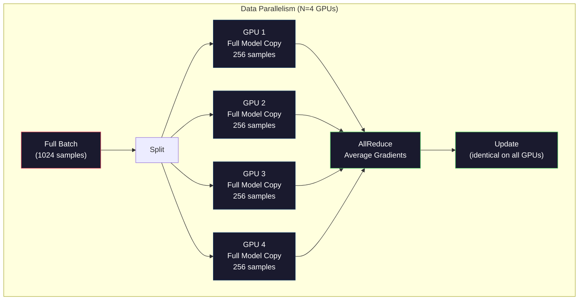
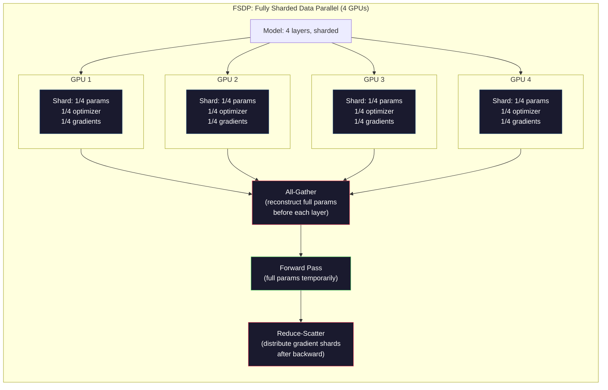
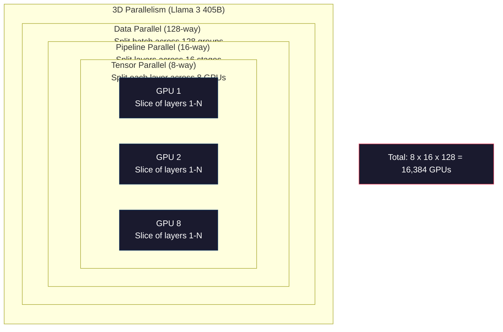

# مقیاس بندی: آموزش توزیع شده، FSDP، DeepSpeed

> مدل 124M شما با یک GPU آموزش دیده است. حالا 7 میلیارد پارامتر را امتحان کنید. مدل به حافظه نمی رسد. داده ها هفته ها در یک دستگاه طول می کشد. آموزش توزیع شده در مقیاس اختیاری نیست. این تنها راه پیش است.

**Type:** Build
**Languages:** Python
**Prerequisites:** Phase 10, Lesson 04 (Pre-Training a Mini GPT)
**Time:** ~120 minutes

## اهداف یادگیری

- سه نوع موازی (داده، تنسور، خط لوله) و زمانی که هر کدام بر اساس مدل و اندازه کلستر ضروری است توضیح دهید.
- پیاده سازی آموزش موازی داده با استفاده از PyTorch DDP با همگام سازی گرادینت در چندین GPU
- بودجه حافظه را برای اندازه یک مدل داده شده (وزن + حالت بهینه سازی + گرادیانت + فعال سازی) محاسبه کنید تا حداقل سخت افزار را تعیین کنید
- پیکربندی مراحل FSDP یا DeepSpeed ZeRO برای تقسیم حالت مدل در GPU ها و مدل های مناسب که از حافظه GPU واحد فراتر می رود

## مشکل

یک مدل پارامتر 7B در FP16 فقط برای وزن ها به 14GB نیاز دارد. آدم بهینه سازی دو نسخه اضافی از هر پارامتر (تقدیر لحظه اول و دوم) را ذخیره می کند. این 28GB دیگر است. گرادیانت ها در طول گسترش عقب 14GB بیشتر را اضافه می کنند. شما قبل از یک فعال سازی تنها 56GB را ذخیره می کنید.

NVIDIA A100 دارای حافظه 80 گیگابایت است.

56 گابایت از 80 گابایت مصرف شده. که 24 گابایت برای فعال سازی باقی می ماند - ارزش های میانگین محاسبه شده در طول عبور جلو که باید برای گسترش عقب زنده نگه داشته شود. برای یک 2048 توکن تسلسل با یک مدل 4096 بعدی، فعال سازی یک لایه حدود 64 گابایت استفاده می کند. با 32 لایه، شما نیاز به 2 گابایت در هر نمونه. یک اندازه دسته 8 نیاز به 16 گابایت. شما 24 گابایت دارید. یک اندازه دسته 12 انفجار می کند.

در حال حاضر به پارامترهای 70B سعی کنید. وزن تنها: 140GB در FP16. نمی تواند در یک GPU قرار گیرد. شما حداقل به 2 A100 (2 x 80GB = 160GB) برای نگه داشتن وزن نیاز دارید. حالت های بهینه سازی و گرادینت ها را اضافه کنید و شما نیاز به بسیار بیشتر دارید: حداقل 3+ GPU و واقع بین 8-16 بسته به استراتژی شاردینگ.

Llama 3 405B با 16،384 GPU NVIDIA H100 آموزش داده شد.$100 million in compute. DeepSeek V3 trained a comparable model for roughly $5.6 میلیون با داشتن مهارت در مورد معماری (مکس کارشناسان به معنای فقط یک بخش از پارامترها فعال در هر توکن) و بهره وری آموزش.

این درس چهار استراتژی را پوشش می دهد که آموزش در مقیاس بزرگ را ممکن می کند: موازی داده، موازی تنسور، موازی لوله و موازی داده های کاملاً پاره شده. شما هر یک را در پایتون خالص شبیه سازی خواهید کرد تا مکانیک را قبل از لمس کردن یک چارچوب آموزش توزیع شده درک کنید.

## مفهوم

### چرا توزیع لازم است

این ریاضیات حافظه برای مدل های واقعی است. هر عدد محاسبه می شود، نه تخمین زده می شود.

| Model | Params | Weights (FP16) | Adam States | Gradients (FP16) | Total (no activations) |
|-------|--------|----------------|-------------|------------------|----------------------|
| GPT-2 Small | 124M | 248 MB | 992 MB | 248 MB | 1.5 GB |
| Llama 3 8B | 8B | 16 GB | 64 GB | 16 GB | 96 GB |
| Llama 3 70B | 70B | 140 GB | 560 GB | 140 GB | 840 GB |
| Llama 3 405B | 405B | 810 GB | 3,240 GB | 810 GB | 4,860 GB |

ستون "ادام ایالت ها" قاتل است. ادم یک میانگین اجرا (m) و یک ویرانس اجرا (v) را برای هر پارامتر ذخیره می کند، هر دو در FP32. برای یک مدل 70B، که 70B x 4 بایت x 2 = 560GB است. بهینه سازی کننده به تنهایی به هفت A100 نیاز دارد.

یک H100 واحد دارای 80GB است. Llama 3 405B حداقل 61 H100 برای نگه داشتن وزن، بهینه سازی و گرادینت ها نیاز دارد. فعال سازی ها را اضافه کنید و تعداد بیشتر می شود. Meta از 16,384 GPU استفاده کرد نه چون می خواستند - زیرا مجبور بودند.

### موازی داده ها

ساده ترین استراتژی توزیع شده. کل مدل را به N GPUs کپی کنید. هر دسته آموزش را به N بخش برابر تقسیم کنید. هر GPU یک گذرگاه پیش و عقب را در قسمت داده خود اجرا می کند. پس از گذرگاه عقب، gradients را در تمام GPUs متوسط کنید. هر GPU نسخه ی خود را از وزنه ها با همان gradients متوسط به روز می کند، همه کپی ها را در هم وقت نگه می دارد.

**The good:**مقیاس بندی خطی. N GPUs پردازش N برابر بیشتر داده ها در هر مرحله. ارتباطات محدود به gradient متوسط است که با محاسبه همپوش می شود.

**The bad:**هر GPU یک کپی کامل از مدل، حالت بهینه سازی و گرادینت را نگه می دارد. برای یک مدل 70B، هر GPU به 840GB نیاز دارد. موازی داده هیچ کاری برای کاهش حافظه هر GPU انجام نمی دهد. این تنها زمان آموزش را کاهش می دهد.

**The math:**اندازه دسته موثر = per_gpu_batch_size x N. برای N=64 GPU با هر دسته GPU از 16، دسته موثر 1,024 است. Llama 3 استفاده از یک اندازه دسته موثر از 16 میلیون توکن در هر مرحله.



### موازی تنسور

لایه های فردی را در GPU ها تقسیم کنید. ضرب ماتریکس واحد بین GPU ها تقسیم می شود، هر بخش محاسباتی نتیجه را.

به یک ماتریس وزن شکل (8192, 8192) در یک لایه پیشرسانی فکر کنید. با موازی تنسور چهارراه، هر GPU یک شارت (8192, 2048) را نگه می دارد. هر GPU ورودی را با شارت خود ضرب می کند و نتیجه جزئی تولید می کند. نتایج جزئی به همراه (به وسیله کاهش همه یا جمع آوری همه) برای تولید کامل تولید می شوند.

**The good:**حافظه در هر GPU برای وزن مدل را کاهش می دهد. یک مدل 70B که به 8 GPU تقسیم شده است به این معنی است که هر GPU دارای وزن به ارزش 8.75B است.

**The bad:**این امر به خوبی با NVLink (900 GB / s بین GPU ها در همان گره) کار می کند اما به طور ضعیف در میان گره های متصل با InfiniBand (400 Gb / s ، حدود 50 GB / s). موازی تنسور تقریبا همیشه به یک گره (8 GPU) محدود است.

**Real usage:**میگاترون-LM پیشگام موازی تنزوری بود. Llama 3 405B از موازی تنزوری 8 راه در هر گره استفاده می کند.

### موازی خط لوله

GPU 2 لایه ها را اجرا می کند. GPU 3 لایه ها را 17-24 اجرا می کند. GPU 4 لایه ها را 25-32 اجرا می کند. داده ها از طریق لوله جریان می یابد: GPU 1 لایه های خود را محاسبه می کند و فعال سازی ها را به GPU 2 ارسال می کند. GPU 2 لایه های خود را محاسبه می کند و به GPU 3 ارسال می کند.

**The good:**ارتباطات حداقل بین GPU ها -- فقط فعال سازی در مرزهای لایه، که در مقایسه با گرادینت ها یا وزنه ها کوچک هستند. بین گره ها کار می کند زیرا نیاز به عرض باند کم است.

**The bad:**حباب لوله. هنگامی که GPU 4 در حال محاسبه عبور جلو در مایکرو-بچ 1 ، GPU 1 ، 2 و 3 بیکار هستند (آن ها قبلاً بخش خود را ارسال کرده اند). در طول عبور عقب، الگوی معکوس می شود. با لوله سازی ساده، استفاده از GPU فقط 1/N برای مراحل لوله N است.

**GPipe and PipeDream**مشکل فقرات را با تقسیم دسته به دسته های کوچک حل کنید. GPU 1 در دسته های کوچک 2 به محض اینکه انتقال دسته های کوچک را به پایان رساند، شروع می کند. این محاسبه در مراحل خط لوله ها هموار می شود. با دسته های کوچک M و مرحله های N، بخش فقرات به (N-1) / M کاهش می یابد. از M=16 دسته های کوچک با مرحله N=4 استفاده کنید و فشان 3/16 = 18.75% زمان بیکار است.

### FSDP: داده های کاملاً پاره شده در موازی

FSDP مقیاس پذیری موازی داده ها را با بهره وری حافظه شارد ترکیب می کند. به جای هر GPU که یک کپی کامل از مدل را نگه دارد، هر GPU تنها 1/N پارامترها، گرادیانت ها و حالت بهینه سازی را نگه می دارد.

قبل از اینکه لایه ای به جلو عبور کند، FSDP یک **all-gather**برای جمع آوری پارامترهای کامل از تمام GPU ها به حافظه هر GPU. پس از عبور به جلو، هر GPU پارامترهای غیر محلی را رد می کند. در طول عقب، کل جمع دوباره برای بازسازی پارامترهای برای محاسبه گرادینت اجرا می شود. پس از عبور به عقب، یک **reduce-scatter**تقسیم بخش های گرادینت به طوری که هر GPU تنها 1/N از گرادینت ها را ذخیره می کند.

**The math for a 70B model on 8 GPUs:**

| Component | Without FSDP | With FSDP |
|-----------|-------------|-----------|
| Weights (FP16) | 140 GB per GPU | 17.5 GB per GPU |
| Adam States (FP32) | 560 GB per GPU | 70 GB per GPU |
| Gradients (FP16) | 140 GB per GPU | 17.5 GB per GPU |
| **Total** | **840 GB per GPU** | **105 GB per GPU** |

بدون FSDP، نمی توانید یک مدل 70B را در یک GPU 80GB واحد قرار دهید. با FSDP در 8 GPU، هر GPU از 105GB استفاده می کند - صبر کنید، که هنوز هم مناسب نیست. شما حداقل 16 GPU را برای رسیدن به زیر 80GB در هر GPU نیاز دارید، یا شما FSDP را با چکپینت فعال سازی ترکیب می کنید (از نو محاسبه فعال سازی در زمان عقب به جای ذخیره آنها).

هزینه ارتباطات بالاتر از موازی داده های وانیلی است زیرا قبل از هر لایه همه چیز جمع می شود. اما صرفه جویی حافظه باعث می شود تمرینات غیرممکن پیش از این امکان پذیر باشد.



### ژرو با سرعت عمیق

ZeRO (Zero Redundancy Optimizer) DeepSpeed از نظر مفهومی مشابه FSDP است اما به طور مستقل توسط مایکروسافت توسعه یافته است. این سه مرحله را تعریف می کند که هر کدام به صورت تهاجمی تر تقسیم می شوند:

| Stage | Shards | Memory Savings | Communication |
|-------|--------|---------------|---------------|
| ZeRO-1 | Optimizer states only | ~4x reduction | Same as data parallel |
| ZeRO-2 | + Gradients | ~8x reduction | Slightly more |
| ZeRO-3 | + Parameters | ~Nx reduction (N GPUs) | All-gather per layer |

ZeRO-3 معادل FSDP است. نامگذاری متفاوت است، مکانیسم یکسان است. PyTorch FSDP را به عنوان یک پیاده سازی بومی اضافه کرد پس از اینکه DeepSpeed مفهوم را اثبات کرد.

دیپ اسپید همچنین ZeRO-Offload (حالات بهینه سازی تخلیه به RAM CPU که ارزان تر و بزرگتر است) و ZeRO-Infinity (خلیه به SSD NVMe) را معرفی کرد. این سرعت محاسبه برای ظرفیت حافظه - عملیات تخلیه کندتر است اما حافظه GPU را آزاد می کند.

### آموزش دقیق مخلوط

آموزش مدرن از فرمت های چند نقطه شناور همزمان استفاده می کند:

- **Forward pass**FP16 یا BF16 (16-bit). نیمی از حافظه FP32. ماتمول ها در هسته تنسور دو برابر سریع تر اجرا می شوند.
- **Master weights**: FP32 (32-بایت). توسط بهینه ساز برای دقت عددی در هنگام بروزرسانی وزن نگهداری می شود.
- **Loss scaling**: ضرب خسارت را با ثابت بزرگ قبل از عبور به عقب برای جلوگیری از فرج FP16 از جریان پایین به صفر.

BF16 (Brain Float 16) دارای همان محدوده نمایان مانند FP32 (8 بیت نمایان) اما دقت کاهش یافته (7 بیت مانتیسا در مقابل FP32's 23). به ندرت نیاز به مقیاس خسارت دارد زیرا می تواند همان محدوده ارزش ها را نشان دهد. FP16 دارای 5 بیت نمایان و 10 بیت مانتیسا است - می تواند ارزش های ذخیر را نشان دهد اما در شدت های شدید جریان / جریان پایین می رود.

TPU های گوگل از BF16 به طور بومی استفاده می کنند. A100 و H100 NVIDIA از FP16 و BF16 پشتیبانی می کنند. صنعت تا حد زیادی به BF16 منتقل شده است زیرا سردرد های کاهش میزان از دست دادن را از بین می برد.

**Memory comparison for a 7B model:**

| Precision | Weights | Optimizer | Gradients | Total |
|-----------|---------|-----------|-----------|-------|
| FP32 everywhere | 28 GB | 56 GB | 28 GB | 112 GB |
| Mixed (BF16 + FP32 master) | 14 GB | 56 GB | 14 GB | 84 GB |

دقت مخلوط در این مدل 28 گیگابایت را ذخیره می کند. حالت بهینه سازی در FP32 باقی می ماند بدون توجه به این که بیشتر حافظه در اینجا می رود.

### میگاترون-LM و موازی 3D

آموزش واقعی در مقیاس بزرگ، سه موازی را ترکیب می کند:

- **Data parallelism**در گروه های گره (سکیلت حجم)
- **Tensor parallelism**در یک گره (پراکنده لایه ها در 8 GPU)
- **Pipeline parallelism**در سراسر گره ها (گروه های لایه ای تقسیم شده در دستگاه ها)

لاما 3 405B در 16384 H100:
- موازی 8 راه تنسور در هر گره (8 GPU در هر گره)
- موازی 16 مسیر لوله در سراسر گره ها (16 مرحله لوله)
- موازی ۱۲۸ جهت داده ها در طول ابعاد باقی مانده (16,384 / 8 / 16 = 128)

این تجزیه 3D (8 x 16 x 128 = 16,384) این است که چگونه شما به هزاران GPU مقیاس می کنید. هر GPU یک شیش داده متفاوت (مواز داده) را می بیند، یک قطعه از هر لایه را نگه می دارد (مواز تنسور) و مجموعه ای متفاوت از لایه ها (مواز پایپول) را محاسبه می کند.

DeepSeek V3 رویکرد متفاوتی را اتخاذ کرد. معماری Mix of Experts آنها تنها 37B از 671B پارامتر را برای هر توکن فعال می کند. این بدان معنی است که هر GPU فقط نیاز به محاسبه (و ذخیره فعال سازی برای) پارامترهای فعال دارد. آنها در 2.048 H800 GPU آموزش داده اند - کمتر از یک/8 تعداد GPU Meta - برای$5.6M vs Meta's estimated $100 ميليون



```figure
paged-kv-cache
```

## آن را بسازید

### مرحله ی ۱: شبیه سازی موازی داده ها

دسته ای را به GPU های شبیه سازی شده تقسیم کنید. هر GPU یک گذر جلو را در شارت خود محاسبه می کند. "گرادینت ها" را میانگین کنید (ما آنها را به عنوان ارزش های از دست دادن شبیه سازی می کنیم).

```python
import numpy as np

def simulate_data_parallelism(data, num_gpus, model_fn):
    batch_size = len(data)
    shard_size = batch_size // num_gpus
    remainder = batch_size % num_gpus

    gpu_losses = []
    gpu_gradients = []

    offset = 0
    for gpu_id in range(num_gpus):
        extra = 1 if gpu_id < remainder else 0
        shard = data[offset:offset + shard_size + extra]
        offset += shard_size + extra

        loss, grad = model_fn(shard)
        gpu_losses.append(loss)
        gpu_gradients.append(grad)

    avg_loss = np.mean(gpu_losses)
    avg_gradient = np.mean(gpu_gradients, axis=0)

    return avg_loss, avg_gradient
```

عملیات تمام کاهش (درجات متوسط) تنها ارتباطات در موازی داده است. در عمل، این از کتابخانه NCCL در GPU های NVIDIA استفاده می کند که حلقه را کاهش می دهد: هر GPU 1/N از گرادینت های خود را به همسایه خود ارسال می کند، 1/N را از همسایه دیگر دریافت می کند و پس از مراحل N-1 هر GPU متوسط کامل دارد. حجم ارتباطات کل: 2 x gradient_size x (N-1)/N، نزدیک به 2x اندازه gradient برای N بزرگ

### مرحله دوم: شبیه سازی موازی تنسور

ماتریک وزن را در GPU ها تقسیم کنید. هر GPU ضرب ماتریک جزئی را محاسبه می کند. نتایج را ترکیب کنید.

```python
def simulate_tensor_parallelism(input_data, weight_matrix, num_gpus):
    d_in, d_out = weight_matrix.shape
    assert d_out % num_gpus == 0, f"d_out {d_out} not divisible by num_gpus {num_gpus}"
    shard_size = d_out // num_gpus

    partial_results = []
    for gpu_id in range(num_gpus):
        start = gpu_id * shard_size
        end = start + shard_size
        weight_shard = weight_matrix[:, start:end]

        partial = input_data @ weight_shard
        partial_results.append(partial)

    full_output = np.concatenate(partial_results, axis=-1)

    direct_output = input_data @ weight_matrix
    error = np.abs(full_output - direct_output).max()

    return full_output, error
```

خطای آن باید دقیقا صفر باشد (یا یک اپسایلون ماشین). موازی گرایی از نظر ریاضی دقیق است - نتیجه ای را به دست می آورد که با محاسبه کامل ماتمول در یک GPU یکسان است. تقسیم در طول ابعاد خروجی است، بنابراین هر GPU یک قطعه مختلف ستون را تولید می کند و یک زنجیره کامل نتیجه را بازسازی می کند.

برای لایه های خطی متوازی ستون (تفرقه ابعاد خروجی) ، شما همبستگی می کنید. برای لایه های متوازی ردیف (تفرقه ابعاد ورودی) ، شما جمع می کنید. در یک ترانسفورماتور FFN، خطی اول (متوسع) از لایه های متوازی ستون و خطی دوم (عقد) استفاده می کند. این از کاهش تمام بین دو لایه جلوگیری می کند.

### مرحله سوم: شبیه سازی موازی لوله

لایه های یک مدل را در GPU های مجازی تقسیم کنید. مشکل فقرات را نشان دهید که مراحل اولیه در حالی که مراحل بعدی محاسبه می شوند، بیکار می مانند.

```python
def simulate_pipeline_parallelism(num_layers, num_stages, num_microbatches):
    layers_per_stage = num_layers // num_stages

    timeline = {}
    clock = 0

    for mb in range(num_microbatches):
        for stage in range(num_stages):
            start_time = max(
                timeline.get((stage, mb - 1, "fwd"), (0, 0))[1] if mb > 0 else 0,
                timeline.get((stage - 1, mb, "fwd"), (0, 0))[1] if stage > 0 else 0,
            )
            end_time = start_time + layers_per_stage
            timeline[(stage, mb, "fwd")] = (start_time, end_time)

    last_fwd_end = max(v[1] for v in timeline.values())

    for mb in range(num_microbatches - 1, -1, -1):
        for stage in range(num_stages - 1, -1, -1):
            deps = [last_fwd_end]
            if mb < num_microbatches - 1 and (stage, mb + 1, "bwd") in timeline:
                deps.append(timeline[(stage, mb + 1, "bwd")][1])
            if stage < num_stages - 1 and (stage + 1, mb, "bwd") in timeline:
                deps.append(timeline[(stage + 1, mb, "bwd")][1])
            start_time = max(deps)
            end_time = start_time + layers_per_stage
            timeline[(stage, mb, "bwd")] = (start_time, end_time)

    total_time = max(v[1] for v in timeline.values())
    compute_time = num_microbatches * num_stages * layers_per_stage * 2
    bubble_fraction = 1.0 - compute_time / (total_time * num_stages)

    return timeline, total_time, bubble_fraction
```

با 4 مرحله و 1 دسته کوچک، بخش فقرات 75 درصد است -- سه تا از چهار GPU در هر زمان بیکار است. با 16 دسته کوچک، آن را به حدود 19 درصد کاهش می دهد. هزینه حذف فقرات حافظه است: شما باید فعال سازی برای تمام دسته های کوچک در پرواز را همزمان ذخیره کنید.

### مرحله چهارم: محاسبات حافظه

اندازه ی حافظه دقیق برای آموزش هر مدل را محاسبه کنید.

```python
def memory_calculator(
    params_billions,
    precision_bytes=2,
    optimizer="adam",
    num_gpus=1,
    sharding="none",
    sequence_length=2048,
    batch_size_per_gpu=1,
    hidden_dim=None,
    num_layers=None,
):
    params = params_billions * 1e9

    weight_memory = params * precision_bytes

    if optimizer == "adam":
        optimizer_memory = params * 4 * 2
    elif optimizer == "sgd":
        optimizer_memory = params * 4
    else:
        optimizer_memory = 0

    gradient_memory = params * precision_bytes

    total_no_activation = weight_memory + optimizer_memory + gradient_memory

    if hidden_dim and num_layers:
        activation_per_layer = (
            sequence_length * batch_size_per_gpu * hidden_dim * precision_bytes * 4
        )
        activation_memory = activation_per_layer * num_layers
    else:
        activation_memory = params * precision_bytes * 0.5

    if sharding == "fsdp" or sharding == "zero3":
        weight_memory /= num_gpus
        optimizer_memory /= num_gpus
        gradient_memory /= num_gpus
    elif sharding == "zero2":
        optimizer_memory /= num_gpus
        gradient_memory /= num_gpus
    elif sharding == "zero1":
        optimizer_memory /= num_gpus

    per_gpu_total = weight_memory + optimizer_memory + gradient_memory + activation_memory

    return {
        "params_billions": params_billions,
        "weights_gb": weight_memory / 1e9,
        "optimizer_gb": optimizer_memory / 1e9,
        "gradients_gb": gradient_memory / 1e9,
        "activations_gb": activation_memory / 1e9,
        "per_gpu_total_gb": per_gpu_total / 1e9,
        "total_across_gpus_gb": per_gpu_total * num_gpus / 1e9,
        "fits_on_80gb": per_gpu_total / 1e9 <= 80,
        "num_gpus": num_gpus,
        "sharding": sharding,
    }
```

این ماشین حساب به سوال هر مهندس ML پاسخ می دهد: "چقدر GPU نیاز دارم؟" اندازه مدل را به آن بدهید و ببینید که آیا متناسب است. استراتژی شیردینگ را تا زمانی تنظیم کنید که کل هر GPU زیر 80GB کاهش یابد.

### مرحله 5: شبیه سازی دقیق مخلوط

مقایسه استفاده از حافظه بین FP32، FP16 و آموزش دقیق مخلوط.

```python
def mixed_precision_comparison(params_billions):
    params = params_billions * 1e9

    fp32_weights = params * 4
    fp32_optimizer = params * 4 * 2
    fp32_gradients = params * 4
    fp32_total = fp32_weights + fp32_optimizer + fp32_gradients

    fp16_weights = params * 2
    fp16_master = params * 4
    fp16_optimizer = params * 4 * 2
    fp16_gradients = params * 2
    fp16_total = fp16_weights + fp16_master + fp16_optimizer + fp16_gradients

    mixed_weights = params * 2
    mixed_optimizer = params * 4 * 2
    mixed_gradients = params * 2
    mixed_total = mixed_weights + mixed_optimizer + mixed_gradients

    return {
        "fp32_total_gb": fp32_total / 1e9,
        "fp16_with_master_gb": fp16_total / 1e9,
        "mixed_bf16_gb": mixed_total / 1e9,
        "savings_vs_fp32": 1 - mixed_total / fp32_total,
    }
```

بزرگترین شگفتی برای اکثر مردم: دقت مخلوط حافظه را به نصف کاهش نمی دهد. حالت بهینه سازی (m و v آدم) بدون توجه به دقت در FP32 باقی می ماند. برای مدل 7B، FP32 آموزش 112GB را استفاده می کند. دقت مخلوط 84GB را استفاده می کند. این کاهش 25٪ است، نه 50٪. بهینه سازی غالب است.

## ازش استفاده کن

### تمام شبیه سازی ها را اجرا کنید

```python
def run_all_demos():
    print("=" * 70)
    print("DATA PARALLELISM SIMULATION")
    print("=" * 70)

    np.random.seed(42)
    data = np.random.randn(64, 32)
    weight = np.random.randn(32, 16)

    def model_fn(batch):
        output = batch @ weight
        loss = np.mean(output ** 2)
        grad = 2 * batch.T @ (batch @ weight) / len(batch)
        return loss, grad

    for n_gpus in [1, 2, 4, 8]:
        loss, grad = simulate_data_parallelism(data, n_gpus, model_fn)
        print(f"  {n_gpus} GPUs: loss={loss:.4f}, grad_norm={np.linalg.norm(grad):.4f}")

    print()
    print("=" * 70)
    print("TENSOR PARALLELISM SIMULATION")
    print("=" * 70)

    x = np.random.randn(4, 8192)
    W = np.random.randn(8192, 8192)

    for n_gpus in [1, 2, 4, 8]:
        output, error = simulate_tensor_parallelism(x, W, n_gpus)
        print(f"  {n_gpus} GPUs: output_shape={output.shape}, max_error={error:.2e}")

    print()
    print("=" * 70)
    print("PIPELINE PARALLELISM SIMULATION")
    print("=" * 70)

    for n_mb in [1, 4, 8, 16, 32]:
        _, total_t, bubble = simulate_pipeline_parallelism(32, 4, n_mb)
        print(f"  {n_mb:2d} micro-batches: total_time={total_t:4d}, bubble={bubble:.1%}")

    print()
    print("=" * 70)
    print("MEMORY CALCULATOR")
    print("=" * 70)

    configs = [
        (7, "none", 1),
        (7, "fsdp", 8),
        (70, "none", 1),
        (70, "fsdp", 8),
        (70, "fsdp", 16),
        (405, "fsdp", 64),
        (405, "fsdp", 128),
    ]

    print(f"  {'Model':>8} {'Sharding':>8} {'GPUs':>5} {'Per-GPU':>10} {'Fits 80GB':>10}")
    print("  " + "-" * 50)
    for params, shard, gpus in configs:
        result = memory_calculator(params, num_gpus=gpus, sharding=shard)
        fits = "Yes" if result["fits_on_80gb"] else "No"
        print(f"  {params:>6}B {shard:>8} {gpus:>5} {result['per_gpu_total_gb']:>8.1f}GB {fits:>10}")

    print()
    print("=" * 70)
    print("MIXED PRECISION COMPARISON")
    print("=" * 70)

    for params_b in [7, 13, 70, 405]:
        result = mixed_precision_comparison(params_b)
        print(f"  {params_b}B: FP32={result['fp32_total_gb']:.0f}GB, "
              f"Mixed BF16={result['mixed_bf16_gb']:.0f}GB, "
              f"Savings={result['savings_vs_fp32']:.0%}")
```

## -باده

این درس به ما کمک می کند`outputs/prompt-distributed-training-planner.md`-- یک پیامک که یک اندازه مدل و سخت افزار موجود را می گیرد، سپس یک برنامه آموزشی توزیع شده کامل را تولید می کند: استراتژی موازی، بودجه حافظه، هزینه های ارتباطی و تولید انتظار می رود.

## تمرینات

1. محاسبه کننده حافظه را تغییر دهید تا چک پوائنٹنگ فعال سازی را شامل کند. با چک پوائنٹنگ، فقط فعال سازی ها را در هر لایه K-th ذخیره کنید (معمولا K = 1 ، به این معنی که همه را دوباره محاسبه کنید). تراز حافظه-حساب حافظه را نشان دهید: چک پوائنٹنگ چقدر حافظه ذخیره می کند و آموزش را چقدر کند می کند (حدود 33٪ بیشتر محاسبه برای چک پوائنٹنگ کامل) ؟

2. شبیه سازی موازی لوله را گسترش دهید تا برنامه 1F1B (یک پیش و یک عقب) که توسط PipeDream استفاده می شود را اجرا کنید. بخش فقرات را با برنامه ساده برای 4 مرحله و 8 دسته کوچک مقایسه کنید. برنامه 1F1B باید حافظه اوج کمتری داشته باشد زیرا شروع به عقب زودتر می گذرد.

3. یک شبیه ساز تراکم گرادینت را پیاده سازی کنید. به جای کاهش همه بعد از هر دسته کوچک، تراکم گرادینت ها را به صورت محلی برای مراحل K، سپس کاهش همه. نشان دهید که چگونه این ارتباط را با K اوقات کاهش می دهد اما تراکم های نهایی یکسان (و بنابراین آموزش یکسان) را تولید می کند.

4. ساخت یک تخمین هزینه. با توجه به اندازه مدل، تعداد توکن هدف، نوع GPU (A100 در $2/hr, H100 at $3.50/ساعت) و استراتژی موازی، تخمین هزینه کل آموزش در دلار.$100M, DeepSeek V3 cost ~$۵.۶ میلی متر

5. زرو-آفلود را به ماشین حساب حافظه اضافه کنید. فرض کنید RAM CPU 512GB در هر گره و NVMe 2TB است. نشان دهید که چگونه آفلود بهینه سازی حالت به CPU اجازه می دهد مدل 70B را به جای 16 GPU برای آموزش در هزینه 30-50% گام های بهینه سازی کند تر.

## اصطلاحات کلیدی

| Term | What people say | What it actually means |
|------|----------------|----------------------|
| Data parallelism | "Copy the model to every GPU" | Each GPU processes a different data shard; gradients are averaged via all-reduce after each step |
| Tensor parallelism | "Split a layer across GPUs" | Partition weight matrices so each GPU computes part of the matmul; requires fast NVLink interconnect |
| Pipeline parallelism | "Split layers across GPUs" | Each GPU runs a different group of layers; data flows through the pipeline with micro-batches to reduce bubbles |
| FSDP | "Shard everything" | Fully Sharded Data Parallel -- each GPU holds 1/N of weights, gradients, and optimizer states; all-gather before compute |
| ZeRO | "DeepSpeed's version of FSDP" | Zero Redundancy Optimizer with 3 stages: shard optimizer (Stage 1), + gradients (Stage 2), + parameters (Stage 3) |
| All-reduce | "Average across GPUs" | Collective operation where every GPU ends with the sum (or average) of all GPUs' inputs -- typically implemented as ring all-reduce |
| All-gather | "Collect from all GPUs" | Collective operation where every GPU ends with the concatenation of all GPUs' data -- used in FSDP to reconstruct full parameters |
| Reduce-scatter | "Sum and distribute" | Collective operation that reduces (sums) data and scatters different chunks to different GPUs -- used in FSDP for gradient sharding |
| Mixed precision | "Train in half precision" | Use FP16/BF16 for forward/backward and FP32 for optimizer states -- saves ~25% memory, not 50%, because the optimizer dominates |
| Pipeline bubble | "Idle time in the pipeline" | Fraction of time GPUs sit idle waiting for data from the previous stage -- reduced by using more micro-batches |

## خواندن بیشتر

- [Rajbhandari et al., 2020 -- "ZeRO: Memory Optimizations Toward Training Trillion Parameter Models"](https://arxiv.org/abs/1910.02054)-- مقاله ژرو با سرعت عمیق که سه مرحله ی پاره شدن را تعریف کرد
- [Shoeybi et al., 2020 -- "Megatron-LM: Training Multi-Billion Parameter Language Models Using Model Parallelism"](https://arxiv.org/abs/1909.08053)-- موازی تنسور NVIDIA برای ترانسفورماتورها
- [Narayanan et al., 2021 -- "Efficient Large-Scale Language Model Training on GPU Clusters Using Megatron-LM"](https://arxiv.org/abs/2104.04473)-- موازی 3D که داده ها، تنسور و خط لوله را ترکیب می کند
- [Zhao et al., 2023 -- "PyTorch FSDP: Experiences on Scaling Fully Sharded Data Parallel"](https://arxiv.org/abs/2304.11277)-- پیاده سازی FSDP بومی PyTorch
- [Llama 3 Technical Report](https://arxiv.org/abs/2407.21783)-- 16,384 گپيو آموزش با جزئیات موازی 3D
- [DeepSeek-V3 Technical Report](https://arxiv.org/abs/2412.19437)-- چگونه معماری MoE هزینه آموزش را با یک امر بزرگ کاهش می دهد
