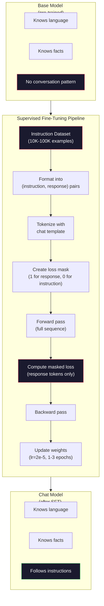

# تنظیم دستورالعمل (SFT)

> یک مدل پایه، توکن بعدی را پیش بینی می کند. این همه است. این دستورالعمل ها را دنبال نمی کند، به سوالات پاسخ نمی دهد، یا درخواست های مضر را رد نمی کند. SFT پل بین یک پیش بینی کننده توکن و یک دستیار مفید است. هر مدل ای که تا به حال با آن ها صحبت کرده اید - کلود، GPT، Llama Chat - از این مرحله عبور کرده است.

**Type:** Build
**Languages:** Python (with numpy)
**Prerequisites:** Phase 10, Lesson 04 (Pre-Training a Mini GPT)
**Time:** ~90 minutes

## اهداف یادگیری

- پیاده سازی تنظیم دقیق تحت نظارت (SFT) که یک مدل زبان پایه را به یک دستیار دنبال کننده دستورالعمل تبدیل می کند
- قالب بندی داده های آموزش با استفاده از قالب های چت با نقش سیستم، کاربر و دستیار و از دست دادن ماسک در توکن های غیر دستیار
- توضیح دهید که چرا SFT ضروری است: مدل های پایه متن را ادامه می دهند و نه پاسخ به سوالات
- ارزیابی کیفیت SFT با مقایسه پاسخ های مدل پایه و مدل های دقیق در یک مجموعه دستورالعمل طولانی

## مشکل

شما یک مدل را در درس 04 آموزش داده اید. می تواند نشانه بعدی را با یک دنباله پیش بینی کند. آن را "ارشیکتوری ترانسفارمر" تغذیه کنید و ممکن است با "تعمیر زبان طبیعی را انقلابی کرده است" ادامه دهد. این برای یک پیش بینی کننده نشانه بعدی تاثیرگذار است.

حالا اینو امتحان کنید: به آن غذا بدهید " پایتخت فرانسه چیست؟" یک مدل پایه به "پاریس" پاسخ نمی دهد. این الگوی را ادامه می دهد. ممکن است " پایتخت آلمان چیست؟ پایتخت اسپانیا چیست؟" چون از اسناد که شامل لیست سوالات است، آموخته بود. یا ممکن است "این یک سوال است که بسیاری از مردم می پرسند" به دلیل این است که یک ادامه قابل قبول بعدی نشانه. مدل هیچ مفهوم "جواب" را ندارد. فقط میدونست ادامه داره

این شکاف بین GPT-3 (نموذج پایه، منتشر شده در ژوئن 2020) و ChatGPT (تضبط دستورالعمل، منتشر شده در نوامبر 2022) است. معماری مشابه. همان پیش از آموزش. تفاوت ۲۰۰۰ تا ۱۰۰۰۰ جفت با دقت طراحی شده (تضرب، پاسخ) است که به مدل یاد می دهد که الگوی مکالمه را دنبال کند.

آلباکا استنفورد ثابت کرد که به میلیون ها نمونه نیاز ندارید. در مارس 2023، آنها Llama 7B را به اندازه 52,000 جفت دستورالعمل-جواب تولید شده توسط GPT-3.5 تنظیم کردند. کل هزینه: $600. The result was a chatbot that could follow instructions, answer questions, and hold conversations. Not as good as ChatGPT, but shockingly close for $600 و چند ساعت آموزش

Llama 2 Chat Meta برای مرحله اولیه SFT خود تنها از 27000 مثال با کیفیت بالا استفاده کرد. بینش اصلی: کیفیت بیشتر از مقدار اهمیت دارد. 27000 مثال نوشته شده توسط نوتاژران ماهر از 1 میلیون مثال سر و صدا از اینترنت خارج شده است.

## مفهوم

### آنچه که SFT واقعا انجام می دهد

تنظیم دقیق تحت نظارت، چرخه آموزشی مشابهی را از قبل از آموزش ادامه می دهد -- عبور جلو، از دست دادن محاسبه، عبور عقب، وزنهای تازه -- اما با نوع متفاوتی از داده ها. به جای متن خام، شما روی مکالمه های ساختار یافته آموزش می دهید:

```json
{
  "system": "You are a helpful assistant.",
  "user": "What is the capital of France?",
  "assistant": "The capital of France is Paris."
}
```

این مدل قبلاً می داند که پاریس پایتخت فرانسه است. این را در طی آموزش های قبل از این در ویکیپیدیا، کتاب های درسی و صفحات وب آموخته است. SFT به مدل حقایق جدید یاد نمی دهد. این مدل را یک رفتار جدید یاد می دهد: وقتی یک سوال را می بینید، پاسخ را تولید کنید. وقتی دستورالعمل را می بینید، تکمیل را تولید کنید. وقتی درخواست مضر را می بینید، رد را تولید کنید.

به این شکل فکر کنید. پیش از آموزش دانش مدل را می دهد. SFT شیوه های مدل را می دهد.

### فرمت های داده

سه فرمت صنعت را تحت کنترل قرار می دهند. هر یک از آنها اطلاعات مشابه را کدگذاری می کند -- چه کسی چه چیزی را گفت -- با مرزهای مختلف.

**Alpaca Format**(ستانفورد، مارس 2023):

```json
{
  "instruction": "Summarize the following article in 3 sentences.",
  "input": "The European Central Bank raised interest rates...",
  "output": "The ECB increased rates by 25 basis points..."
}
```

ساده و به طور گسترده ای استفاده می شود.`input`فیلدی اختیاری است -- بسیاری از دستورالعمل ها به زمینه اضافی نیاز ندارند. استنفورد ۵۲ هزار مثال را در این فرمت منتشر کرد، که توسط GPT-3.5 برای ۶۰۰ دلار تولید شده است. این حرکت تنظیم دستورالعمل های منبع باز را آغاز کرد.

**ShareGPT Format**(جامعه، 2023):

```json
{
  "conversations": [
    {"from": "system", "value": "You are a helpful assistant."},
    {"from": "human", "value": "What causes tides?"},
    {"from": "gpt", "value": "Tides are caused by the gravitational pull of the Moon..."},
    {"from": "human", "value": "How often do they occur?"},
    {"from": "gpt", "value": "Most coastal areas experience two high tides and two low tides per day..."}
  ]
}
```

ویکونا از 70,000 مکالمه ShareGPT که از نسخه های ChatGPT مشترک استفاده شده است، آموزش دیده است.

**ChatML Format**(OpenAI، مورد استفاده بسیاری از مدل های منبع باز است):

```
<|im_start|>system
You are a helpful assistant.<|im_end|>
<|im_start|>user
What is the capital of France?<|im_end|>
<|im_start|>assistant
The capital of France is Paris.<|im_end|>
```

از توکن های ویژه استفاده می کند (`<|im_start|>`،`<|im_end|>`این توکن ها در هنگام تنظیم دقیق به لغات توکنر اضافه می شوند. Qwen، Yi و بسیاری از مدل های دیگر از ChatML استفاده می کنند.

هر سه فرمت یک کار را انجام می دهند: به مدل می گویند "این دستورالعمل است، این پاسخ است، این الگوی را یاد بگیرید".

### چرا کار می کند

این مدل از قبل از آموزش زبان را می داند. این نمونه ها را از میلیاردها سوال و سپس پاسخ، دستورالعمل و سپس مکالمه بین مردم دیده است. الگوهای قبلا در وزن ها کدگذاری شده است.

SFT این توانایی پنهان را متمرکز می کند. به جای اینکه مدل نیاز به فهمیدن از زمینه داشته باشد که آیا باید به یک سوال پاسخ دهد یا یک سند ادامه دهد، SFT به طور صریح بر روی الگوی مکالمه آموزش می دهد. پس از چند هزار مثال، مدل یاد می گیرد: هنگامی که شما نشانگر نقش دستیار را می بینید، پاسخ مفید را تولید کنید.

به همین دلیل 27000 مثال کافی است. شما به آن زبان انگلیسی مدل آموزش نمی دهید. شما به آن حقایق در مورد جهان نمی دهید. شما به آن یک رفتار ساده می آموزید: به دستورالعمل ها پاسخ دهید. دانش قبلاً وجود داشت.

### از دست دادن پنهان

این مهم ترین جزئیات فنی در SFT است و اکثر آموزش ها از آن غافل می شوند.

در طول آموزش پیش از انجام، شما از دست دادن هر توکن را محاسبه می کنید. مدل یاد می گیرد که هر توکن بعدی را در ردیف پیش بینی کند. در طول SFT، شما فقط از دست دادن توکن های * پاسخ* را محاسبه می کنید. توکن های دستورالعمل برای زمینه وجود دارد، اما مدل برای "پیش بینی" آنها به اشتباه مجازات نمی شود.

چرا؟ چون شما نمی خواهید مدل یاد بگیرد تا دستورالعمل ها را تولید کند. شما می خواهید که یاد بگیرد که به دستورالعمل ها پاسخ دهد. اگر شما از دست دادن در توکن های دستورالعمل محاسبه کنید، شما مدل را برای پیش بینی " پایتخت فرانسه چیست؟" آموزش می دهید. انگار این همان کسی است که سوال را می پرسد. این سیگنال گرادینت را ضایع می کند و می تواند مدل را در مورد نقش آن سردرگمی کند.

در عمل، شما یک ماسک از دست دادن ایجاد می کنید: 1 برای توکن های پاسخ، 0 برای توکن های دستورالعمل. از دست دادن هر توکن با این ماسک قبل از متوسط ضرب کنید.

```
Tokens:    [SYS] You are helpful [USER] What is the capital? [ASST] Paris is the capital [EOS]
Loss mask:   0    0    0     0      0     0   0  0     0       1     1    1   1     1      1
```

فقط توکن ها بعد از`[ASST]`مدل مکالمه کامل را در طول عبور جلو می بیند (برای تولید پاسخ صحیح به دستورالعمل نیاز دارد) اما فقط وزن خود را بر اساس چگونگی پیش بینی پاسخ به روز می کند.

### هائپر پارامترهای آموزش

SFT از پارامترهای فوق العاده متفاوتی نسبت به قبل از آموزش استفاده می کند. شما از ابتدا آموزش نمی دهید. شما یک مدل را تنظیم می کنید که قبلاً کار می کند.

| Parameter | Pre-Training (Llama 2 7B) | SFT (Llama 2 Chat) |
|-----------|---------------------------|---------------------|
| Learning rate | 3e-4 (peak) | 2e-5 |
| Epochs | 1 (single pass over data) | 2 |
| Batch size | 4M tokens | 64 examples |
| Warmup steps | 2,000 | 0-100 |
| Weight decay | 0.1 | 0.0-0.1 |
| Data size | 2T tokens | 27,000 examples |

نرخ یادگیری برای SFT 15 برابر کمتر است. این بسیار مهم است. نرخ یادگیری بالا در طول تنظیم دقیق دانش پیش از آموزش را نابود می کند. مدل آنچه یاد گرفته است را " فراموش می کند " و به مجموعه داده های کوچک تنظیم دقیق اضافه می کند. این فراموشی فاجعه بار است.

دو دوره به این معنی است که مدل هر مثال آموزش را دو بار می بیند. بیش از سه دوره در مجموعه داده های کوچک منجر به حفظ می شود - مدل شروع به تولید مثال های آموزش به معنای واقعی کلمه به جای عمومی سازی می کند.

### فراموشی فاجعه بار

تنظیم دقیق می تواند قابلیت های عمومی را نابود کند. آموزش بیش از حد طولانی بر روی داده های پیروی از دستورالعمل و مدل توانایی خود را برای نوشتن کد، انجام ریاضیات، یا تولید متن خلاق می کند. آن را به شکل خاص داده های آموزش بسیار خوب و وحشتناک در همه چیز دیگر می شود.

سه روش کاهش:

1. **Low learning rate.**1- 5 تا 5- 5 - 5 - 5 - به روز رسانی های کوچکتر به معنای تخریب ویژگی های پیش از آموزش کمتر است.

2. **Short training.**1-3 دوره، قبل از اينکه مدل از حد بالا بياد متوقف شو

3. **Mix in pre-training data.**Llama 2 Chat درصد کمی (2-5%) از داده های خام پیش از آموزش را به مجموعه داده های SFT مخلوط کرد. این "به یاد می آورد" مدل قابلیت های عمومی خود را در حالی که رفتار جدید پیروی از دستورالعمل را یاد می گیرد.

### اعداد واقعی

تنظیم دقیق یک مدل 7B بر روی 10 هزار جفت آموزش با کیفیت بالا تقریباً یک ساعت را در یک گرافیک NVIDIA A100 80GB صرف می کند.

- ۱۰ هزار نمونه x ۵۱۲ توکن متوسط = ۵.۱۲ میلیون توکن
- 2 دوره = کل 1024 میلیون توکن
- A100 تولید برای تنظیم دقیق مدل 7B: ~ 3000 توکن/دقیقه
- 10.24M / 3,000 = ~ 3,400 ثانیه = ~ 57 دقیقه

برای GPT کوچک ما (۴ لایه، 128 ديم) ، آموزش تقریباً فوری است. نکته درک مکانیک است، نه مقیاس.



```figure
loss-masking
```

## آن را بسازید

### مرحله ی اول: مجموعه داده های دستورالعمل

یک مجموعه داده های دستورات مصنوعی ایجاد کنید. در تولید، شرکت هایی مانند Scale AI و Anthropic برای نوشتن این اطلاعات از نوتاژرهای انسانی استفاده می کنند. ما آنها را به صورت برنامه ای برای نشان دادن فرمت ایجاد می کنیم.

```python
import numpy as np

INSTRUCTION_DATA = [
    {
        "instruction": "What is the capital of France?",
        "response": "The capital of France is Paris."
    },
    {
        "instruction": "Explain gravity in one sentence.",
        "response": "Gravity is the force that attracts objects with mass toward each other."
    },
    {
        "instruction": "Write a haiku about the ocean.",
        "response": "Waves crash on the shore, salt and foam beneath the sun, endless blue expanse."
    },
    {
        "instruction": "What is 15 multiplied by 7?",
        "response": "15 multiplied by 7 is 105."
    },
    {
        "instruction": "Name three programming languages.",
        "response": "Three programming languages are Python, Rust, and TypeScript."
    },
    {
        "instruction": "Summarize photosynthesis.",
        "response": "Photosynthesis converts sunlight, water, and carbon dioxide into glucose and oxygen."
    },
    {
        "instruction": "What year did World War II end?",
        "response": "World War II ended in 1945."
    },
    {
        "instruction": "Define machine learning.",
        "response": "Machine learning is a field where algorithms learn patterns from data to make predictions."
    },
]
```

هشت مثال کوچک است. استنفورد آلباکا ۵۲۰۰۰ استفاده کرد. اما مکانیک یکسان است، چه ۸ یا ۵۲۰۰۰: توکن سازی، ماسک، تلفات حساب فقط در پاسخ ها.

### مرحله دوم: با قالب چت نشان دادن

جفت های دستور-جواب را به دنباله های رمزنگاری شده با نشانگرهای نقش ویژه تبدیل کنید. نشانگرها به مدل می گویند که دستور کجا پایان می یابد و پاسخ کجا شروع می شود.

```python
SPECIAL_TOKENS = {
    "INST_START": 253,
    "INST_END": 254,
    "RESP_START": 255,
}


def tokenize_instruction_pair(instruction, response, vocab_size=256):
    inst_tokens = list(instruction.encode("utf-8"))
    resp_tokens = list(response.encode("utf-8"))

    inst_tokens = [min(t, vocab_size - 4) for t in inst_tokens]
    resp_tokens = [min(t, vocab_size - 4) for t in resp_tokens]

    tokens = (
        [SPECIAL_TOKENS["INST_START"]]
        + inst_tokens
        + [SPECIAL_TOKENS["INST_END"]]
        + [SPECIAL_TOKENS["RESP_START"]]
        + resp_tokens
    )

    return tokens


def create_loss_mask(tokens):
    mask = np.zeros(len(tokens), dtype=np.float32)
    in_response = False

    for i, token in enumerate(tokens):
        if token == SPECIAL_TOKENS["RESP_START"]:
            in_response = True
            continue
        if in_response:
            mask[i] = 1.0

    return mask
```

ماسک خسارت همه صفر ها برای نشانه های دستورالعمل و همه برای نشانه های پاسخ است.`RESP_START`خود توکن یک ماسک از 0 می گیرد چون یک محدودی است، نه بخشی از محتوای پاسخ.

### مرحله سوم: از دست دادن کرس-انترپی پنهان

اينترپي متقاطع معياري، ولي با ماسک خسارت ضرب مي شود.

```python
def masked_cross_entropy_loss(logits, targets, loss_mask):
    batch, seq_len, vocab_size = logits.shape
    logits_flat = logits.reshape(-1, vocab_size)
    targets_flat = targets.reshape(-1)
    mask_flat = loss_mask.reshape(-1)

    max_logits = logits_flat.max(axis=-1, keepdims=True)
    log_softmax = logits_flat - max_logits - np.log(
        np.exp(logits_flat - max_logits).sum(axis=-1, keepdims=True)
    )

    per_token_loss = -log_softmax[np.arange(len(targets_flat)), targets_flat]

    masked_loss = per_token_loss * mask_flat
    num_response_tokens = mask_flat.sum()
    if num_response_tokens == 0:
        return 0.0
    loss = masked_loss.sum() / num_response_tokens

    return loss
```

نامزدی اینه`num_response_tokens`نه`seq_len`اگر به طول کل ردیف تقسیم کنید، دستورالعمل های طولانی تر سیگنال گرادینت را کاهش می دهند. تقسیم با تعداد توکن پاسخ تضمین وزن برابر هر توکن پاسخ بدون توجه به طول دستورالعمل می کند.

### مرحله 4: حلقه آموزش SFT

از MiniGPT از درس 04 استفاده کنید. حلقه آموزش تقریبا شبیه به قبل از آموزش است، اما با فرمت دستورالعمل و از دست دادن پنهان.

```python
import sys
import os
sys.path.insert(0, os.path.join(os.path.dirname(__file__), "..", "..", "04-pre-training-mini-gpt", "code"))
from main import MiniGPT, LayerNorm, FeedForward, MultiHeadAttention, TransformerBlock, Embedding


def sft_train(model, dataset, num_epochs=2, lr=2e-5, seq_len=64):
    formatted_data = []
    for example in dataset:
        tokens = tokenize_instruction_pair(example["instruction"], example["response"])
        mask = create_loss_mask(tokens)
        formatted_data.append((tokens, mask))

    print(f"SFT Training: {len(formatted_data)} examples, {num_epochs} epochs, lr={lr}")
    print(f"Total tokens: {sum(len(t) for t, _ in formatted_data):,}")
    print()

    losses = []

    for epoch in range(num_epochs):
        epoch_loss = 0.0
        num_batches = 0

        indices = np.random.permutation(len(formatted_data))

        for idx in indices:
            tokens, mask = formatted_data[idx]

            if len(tokens) < 3:
                continue
            if len(tokens) > seq_len:
                tokens = tokens[:seq_len]
                mask = mask[:seq_len]

            input_ids = np.array(tokens[:-1]).reshape(1, -1)
            target_ids = np.array(tokens[1:]).reshape(1, -1)
            loss_mask = np.array(mask[1:]).reshape(1, -1)

            logits = model.forward(input_ids)
            loss = masked_cross_entropy_loss(logits, target_ids, loss_mask)

            batch_size, s_len, v_size = logits.shape
            probs = np.exp(logits - logits.max(axis=-1, keepdims=True))
            probs = probs / probs.sum(axis=-1, keepdims=True)
            dlogits = probs.copy()
            dlogits[np.arange(batch_size)[:, None], np.arange(s_len), target_ids] -= 1.0

            mask_expanded = loss_mask[:, :, np.newaxis]
            num_resp = loss_mask.sum()
            if num_resp > 0:
                dlogits = dlogits * mask_expanded / num_resp

            for block in model.blocks:
                block.ffn.W1 -= lr * np.random.randn(*block.ffn.W1.shape) * 0.01
                block.ffn.W2 -= lr * np.random.randn(*block.ffn.W2.shape) * 0.01
                block.ffn.b1 -= lr * np.random.randn(*block.ffn.b1.shape) * 0.01
                block.ffn.b2 -= lr * np.random.randn(*block.ffn.b2.shape) * 0.01

            epoch_loss += loss
            num_batches += 1
            losses.append(loss)

        avg_loss = epoch_loss / max(num_batches, 1)
        print(f"Epoch {epoch + 1}/{num_epochs} | Avg Loss: {avg_loss:.4f}")

    return model, losses
```

سرعت یادگیری 2e-5 است، که با Llama 2 Chat مطابقت دارد. این را با 3e-4 که در پیش از آموزش استفاده می شود مقایسه کنید - 15 برابر کوچکتر. گرادینت پنهان شده است: توکن های دستورالعمل گرادینت صفر را تولید می کنند. فقط توکن های پاسخ وزن را فشار می دهند.

### مرحله 5: مقایسه مدل پایه و مدل SFT

کل نکته ی SFT تغییر رفتاری است. بیایید آن را با بررسی چگونگی پاسخ مدل به ورودی های فرمت شده با دستورالعمل در مقابل ادامه متن خام اندازه گیری کنیم.

```python
def generate_response(model, prompt_tokens, max_new_tokens=50, temperature=0.8):
    tokens = list(prompt_tokens)
    seq_len = model.embedding.pos_embed.shape[0]

    for _ in range(max_new_tokens):
        context = np.array(tokens[-seq_len:]).reshape(1, -1)
        logits = model.forward(context)
        next_logits = logits[0, -1, :]

        next_logits = next_logits / max(temperature, 1e-8)
        probs = np.exp(next_logits - next_logits.max())
        probs = probs / probs.sum()
        probs = np.clip(probs, 1e-10, 1.0)
        probs = probs / probs.sum()

        next_token = np.random.choice(len(probs), p=probs)
        tokens.append(int(next_token))

    return tokens


def evaluate_instruction_following(model, instructions):
    print("Evaluating instruction following:")
    print("-" * 50)

    for instruction in instructions:
        tokens = (
            [SPECIAL_TOKENS["INST_START"]]
            + [min(t, 252) for t in list(instruction.encode("utf-8"))]
            + [SPECIAL_TOKENS["INST_END"]]
            + [SPECIAL_TOKENS["RESP_START"]]
        )

        output = generate_response(model, tokens, max_new_tokens=30, temperature=0.6)
        response_start = len(tokens)
        response_tokens = output[response_start:]
        response_bytes = bytes([t for t in response_tokens if t < 128])
        response_text = response_bytes.decode("utf-8", errors="replace")

        print(f"  Q: {instruction}")
        print(f"  A: {response_text[:80]}")
        print()
```

در یک مدل کوچک با 8 مثال، پاسخ ها معنی دار نخواهند بود. انتظار می رود. مهم ترین چیز ساختار است: مدل یاد می گیرد که بعد از نشانگر پاسخ، در عوض تولید دستورالعمل های بیشتر، تولید کند.

### قدم ۶: فراموشی فاجعه بار را اندازه گیری کنید

توانایی پیش بینی توکن بعدی مدل را قبل و بعد از SFT مقایسه کنید. اگر SFT قابلیت های عمومی را آسیب برساند، از دست دادن متن خام افزایش خواهد یافت.

```python
def measure_forgetting(model, test_text, seq_len=64):
    tokens = np.array(list(test_text.encode("utf-8")[:512]))

    total_loss = 0.0
    num_windows = 0

    for start in range(0, len(tokens) - seq_len - 1, seq_len):
        input_ids = tokens[start:start + seq_len].reshape(1, -1)
        target_ids = tokens[start + 1:start + seq_len + 1].reshape(1, -1)

        logits = model.forward(input_ids)

        batch, s_len, vocab_size = logits.shape
        logits_flat = logits.reshape(-1, vocab_size)
        targets_flat = target_ids.reshape(-1)

        max_logits = logits_flat.max(axis=-1, keepdims=True)
        log_softmax = logits_flat - max_logits - np.log(
            np.exp(logits_flat - max_logits).sum(axis=-1, keepdims=True)
        )

        loss = -log_softmax[np.arange(len(targets_flat)), targets_flat].mean()
        total_loss += loss
        num_windows += 1

    return total_loss / max(num_windows, 1)
```

در تنظیم دقیق واقعی، شما این متریک را در طول آموزش ردیابی می کنید. اگر از دست دادن متن خام بیش از 10 تا 15 درصد افزایش یابد، SFT شما بیش از حد تهاجمی است. نرخ یادگیری را کاهش دهید یا تعداد دوره ها را کاهش دهید.

## ازش استفاده کن

### نمایش کامل خط لوله SFT

```python
if __name__ == "__main__":
    np.random.seed(42)

    test_text = """The transformer architecture processes sequences through self-attention.
Each layer applies multi-head attention followed by a feedforward network.
Residual connections and layer normalization stabilize deep networks.
The model learns to predict the next token given all previous tokens."""

    print("=" * 70)
    print("INSTRUCTION TUNING (SFT) DEMO")
    print("=" * 70)
    print()

    model = MiniGPT(
        vocab_size=256, embed_dim=128, num_heads=4,
        num_layers=4, max_seq_len=128, ff_dim=512
    )
    print(f"Model: {model.count_parameters():,} parameters")
    print(f"Config: 4 layers, 4 heads, 128 dims (mini GPT from Lesson 04)")
    print()

    print("PRE-SFT: Measuring base model loss on raw text")
    base_loss = measure_forgetting(model, test_text)
    print(f"  Base model loss: {base_loss:.4f}")
    print()

    print("=" * 70)
    print("SFT TRAINING")
    print("=" * 70)

    model, losses = sft_train(
        model, INSTRUCTION_DATA, num_epochs=3, lr=2e-5, seq_len=128
    )

    print()
    print("POST-SFT: Measuring fine-tuned model loss on raw text")
    sft_loss = measure_forgetting(model, test_text)
    print(f"  SFT model loss: {sft_loss:.4f}")
    print(f"  Change: {((sft_loss - base_loss) / base_loss * 100):+.1f}%")
    if abs(sft_loss - base_loss) / base_loss < 0.15:
        print("  Minimal forgetting (< 15% change)")
    else:
        print("  Significant forgetting detected")
    print()

    print("=" * 70)
    print("INSTRUCTION FOLLOWING EVALUATION")
    print("=" * 70)
    print()

    test_instructions = [
        "What is the capital of France?",
        "Name a programming language.",
        "Define gravity.",
    ]
    evaluate_instruction_following(model, test_instructions)

    print("=" * 70)
    print("DATA FORMAT EXAMPLES")
    print("=" * 70)
    print()

    for i, example in enumerate(INSTRUCTION_DATA[:3]):
        tokens = tokenize_instruction_pair(example["instruction"], example["response"])
        mask = create_loss_mask(tokens)
        resp_count = int(mask.sum())
        total_count = len(tokens)
        print(f"  Example {i + 1}: {total_count} tokens, {resp_count} response tokens ({resp_count/total_count:.0%} of sequence)")
        print(f"    Instruction: {example['instruction']}")
        print(f"    Response: {example['response']}")
        print()

    print("=" * 70)
    print("TRAINING LOSS CURVE")
    print("=" * 70)
    print()

    if losses:
        window = max(1, len(losses) // 5)
        for i in range(0, len(losses), window):
            chunk = losses[i:i + window]
            avg = sum(chunk) / len(chunk)
            print(f"  Steps {i:3d}-{i + len(chunk) - 1:3d}: avg loss = {avg:.4f}")
```

## -باده

این درس به ما کمک می کند`outputs/prompt-sft-data-curator.md`-- یک پرامپت که به شما کمک می کند مجموعه داده های دستورالعمل را برای SFT طراحی و تهیه کنید. با توجه به قابلیت هدف (پیدا کردن کد، ریاضیات، مکالمه) ، یک برنامه جمع آوری داده با مشخصات فرمت، معیارهای کیفیت و الزامات تنوع تولید می کند.

## تمرینات

1. پشتیبانی سریع سیستم اضافه کنید. تغییر کنید `tokenize_instruction_pair`برای پذیرش یک پیام سیستم و آماده کردن آن قبل از آموزش. 5 مثال با دستورات سیستم مختلف ایجاد کنید ("شما یک شاعر هستید"، "شما یک معلم ریاضی هستید") و بررسی کنید که مدل در طول آموزش دستورات سیستم مختلف را می بیند.

2. ترکیب داده ها را پیاده سازی کنید. یک تابع ایجاد کنید که مجموعه داده های SFT و یک کورپوس متن خام را بگیرد، سپس دسته های آموزشی را تولید کند که در آن 5٪ از نمونه ها متن خام (بدون ماسک) و 95٪ زوج های دستورالعمل (مسک) هستند. 3 دوره اجرا کنید و متریک فراموشی را با آموزش SFT خالص مقایسه کنید.

3. برای هر جفت دستورالعمل-جواب، محاسبه کنید: (ا) طول پاسخ در توکن ها، (ب) نسبت دستورالعمل-جواب، (ج) تنوع لغت (توکن های منحصر به فرد / توکن های کل). نمونه هایی را که طول پاسخ < 10 توکن یا تنوع < 0.3 است فیلتر کنید. نشان دهید که فیلتر کردن چگونه بر از دست دادن نهایی تأثیر می گذارد.

4. پیاده سازی آموزش مکالمه چند نوبت. گسترش توکن سازی برای مدیریت مکالمه سه نوبت (کاربری-مساعد-کاربری-مساعد-کاربری). ماسک از دست دادن باید سه نوبت دستیار را پوشش دهد. با چاپ خط خط خط خط ماسک توکن برای یک مثال، بررسی کنید که ماسک درست است.

5. مقایسه نرخ یادگیری. تمرین یک مدل سه بار با lr=1e-4, lr=2e-5, و lr=1e-6. منحنیات ضرر را نقشه بزنید. 1e-4 اجرا باید کاهش اولیه سریع اما کاهش نهایی بالاتر را نشان دهد (overfitting). 1e-6 اجرا باید به سختی حرکت کند. 2e-5 اجرا باید نقطه شیرین باشد.

## اصطلاحات کلیدی

| Term | What people say | What it actually means |
|------|----------------|----------------------|
| SFT | "Fine-tuning on conversations" | Supervised Fine-Tuning: continuing training on (instruction, response) pairs with loss computed only on response tokens |
| Instruction tuning | "Teaching the model to follow instructions" | Training on explicit instruction-response pairs so the base model learns the conversation pattern, not new knowledge |
| Loss masking | "Ignoring the prompt" | Setting loss to zero for instruction tokens so gradients only flow from response token predictions |
| ChatML | "Chat Markup Language" | A token format using `<\|im_start\|>` and `<\|im_end\|>` delimiters to mark speaker roles in conversation data |
| Alpaca format | "Stanford's format" | A JSON format with instruction/input/output fields, used for 52K GPT-3.5-generated examples that cost $600 |
| Catastrophic forgetting | "The model gets dumber" | Fine-tuning destroys pre-trained capabilities because gradient updates overwrite general knowledge with task-specific patterns |
| Weight tying | "Shared embeddings" | Using the same matrix for input token embeddings and output prediction head, saving parameters and improving coherence |
| Chat template | "How you format the prompt" | The specific token sequence (role markers, delimiters) that structures a conversation for the model |

## خواندن بیشتر

- [Ouyang et al., 2022 -- "Training language models to follow instructions with human feedback" (InstructGPT)](https://arxiv.org/abs/2203.02155)-- مقاله ای که تنظیمات دستورالعمل + RLHF را در OpenAI معرفی کرد
- [Taori et al., 2023 -- "Stanford Alpaca: An Instruction-following LLaMA Model"](https://github.com/tatsu-lab/stanford_alpaca)-- نمونه هاي 52 هزار دستور براي 600 دلار، ثابت ميکنه که SFT در مجموعه هاي داده هاي كوچك كار ميکنه
- [Touvron et al., 2023 -- "Llama 2: Open Foundation and Fine-Tuned Chat Models"](https://arxiv.org/abs/2307.09288)-- خط لوله SFT + RLHF Meta با نمونه های با کیفیت بالا 27K
- [Chiang et al., 2023 -- "Vicuna: An Open-Source Chatbot Impressing GPT-4"](https://lmsys.org/blog/2023-03-30-vicuna/)-- آموزش در مورد 70K ShareGPT مکالمه
- [Zhou et al., 2023 -- "LIMA: Less Is More for Alignment"](https://arxiv.org/abs/2305.11206)-- اثبات اینکه 1000 نمونه با دقت انتخاب شده می توانند با SFT در مجموعه داده های بسیار بزرگتر مطابقت داشته باشند
