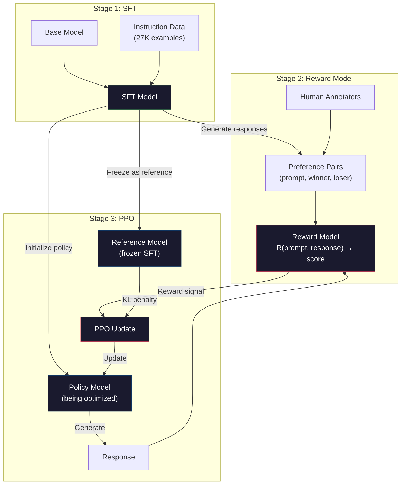
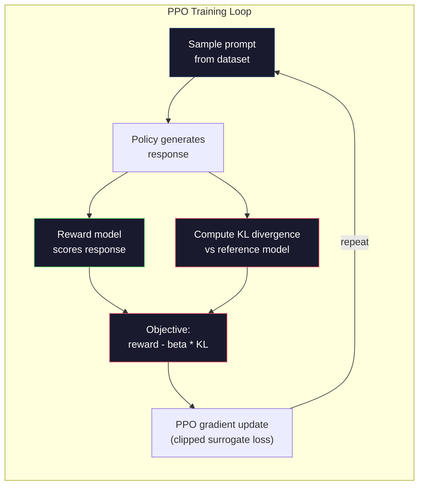

# RLHF: مدل پاداش + PPO

> SFT به مدل یاد می دهد تا دستورالعمل ها را دنبال کند. اما به مدل نمی آموزد که کدام پاسخ بهتر است. دو پاسخ درست و درست از نظر گرامر، می توانند در مورد مفید بودن بسیار متفاوت باشند. RLHF نحوه کدگذاری قضاوت انسانی در رفتار مدل است. این چیزی است که کلود را مفید و GPT را مهذب می کند.

**Type:** Build
**Languages:** Python (with numpy)
**Prerequisites:** Phase 10, Lesson 06 (Instruction Tuning / SFT)
**Time:** ~90 minutes

## اهداف یادگیری

- ایجاد یک مدل پاداش که کیفیت پاسخ را از زوج های ترجیحات انسانی (انتخاب شده در مقابل رد شده) ارزیابی کند
- اجرای حلقه آموزش PPO که سیاست مدل زبان را در مقابل مدل پاداش با مجازات KL بهینه می کند
- توضیح دهید که چرا RLHF سه مدل (SFT، پاداش، سیاست) را مورد نیاز است و چگونه محدودیت KL از هک کردن پاداش جلوگیری می کند.
- ارزیابی اثر RLHF با مقایسه کیفیت پاسخ قبل و بعد از بهینه سازی اولویت

## مشکل

از یک مدل "تفسیر کردن کامپیوتری کوانتومی" بپرسید و ممکن است نتیجه دهد:

**Response A:**"حاسبات کوانتومی از کوبیت هایی استفاده می کند که می توانند در سوپرپوزشن وجود داشته باشند، به این معنی که می توانند 0، 1 یا هر دو به طور همزمان باشند. این اجازه می دهد تا رایانه های کوانتومی برخی محاسبات را به طور نمایی سریع تر از رایانه های کلاسیک پردازش کنند. الگوریتم های کلیدی شامل الگوریتم شور برای فاکتور کردن اعداد بزرگ و الگوریتم گروور برای جستجوی پایگاه داده های غیر مرتب شده است. "

**Response B:**"کمپیوتر کوانتومی یک نوع کامپیوتری است که از پدیده های مکانیک کوانتومی استفاده می کند. این برای اولین بار در دهه 1980 پیشنهاد شد. ریچارد فاینمن پیشنهاد کرد که سیستم های کوانتومی می توانند توسط کامپیوترهای کوانتومی شبیه سازی شوند. این زمینه از آن زمان به طور قابل توجهی رشد کرده است. بسیاری از شرکت ها در حال حاضر در کامپیوترهای کوانتومی کار می کنند. IBM، گوگل و دیگران پیشرفت کرده اند. تسلط کوانتومی توسط گوگل در سال 2019 ادعا شد".

هر دو پاسخ درست است. هر دو از نظر گرامرکی درست است. هر دو دستورالعمل را دنبال می کنند. اما پاسخ A به وضوح بهتر است. خلاصه تر، اطلاعات بیشتر و بهتر ساختار یافته است. یک انسان هر بار A را انتخاب می کند.

SFT نمی تواند این تفاوت را ضبط کند. این مدل را بر روی پاسخ های "صحيح" آموزش می دهد، اما هیچ مکانیسم برای گفتن "این پاسخ بهتر از آن است".

. آر ال ای اچ اف اينو حل ميکنه این یک مدل پاداش را برای پیش بینی پاسخ که یک انسان ترجیح می دهد آموزش می دهد، سپس از این سیگنال پاداش برای فشار دادن مدل زبان به سمت نتایج با کیفیت بالاتر استفاده می کند. InstructGPT (پیشگویی ChatGPT) از RLHF برای بهبود چشمگیری مفید بودن، حقیقت و بی ضرر بودن GPT-3 استفاده کرد. ارزیابی کنندگان داخلی OpenAI، 85% از موارد، تولیدات InstructGPT را بر GPT-3 ترجیح دادند، علیرغم اینکه InstructGPT 135 برابر کوچکتر است (1.3B در مقابل 175B).

## مفهوم

### سه مرحله

RLHF یک دوره آموزشی نیست. این یک خط لوله از سه مرحله متوالی است، هر کدام بر روی مرحله قبلی ساخته شده است.

**Stage 1: SFT.**یک مدل پایه را بر روی زوج های دستورالعمل-جواب آموزش دهید (درسی 06) این به شما یک مدل می دهد که می تواند دستورالعمل ها را دنبال کند اما نمی داند کدام پاسخ بهتر از دیگران است.

**Stage 2: Reward Model.**جمع آوری داده های ترجیحات انسانی: به نوتاژران دو پاسخ به یک پرامپت نشان دهید و از آنها بپرسید "چه یک بهتر است؟" یک مدل را برای پیش بینی این ترجیحات آموزش دهید. مدل پاداش (پرامپت، پاسخ) را به عنوان ورودی می گیرد و نمره اسکالر را خارج می کند.

**Stage 3: PPO.**از مدل پاداش برای تولید سیگنال آموزشی برای مدل زبان استفاده کنید. مدل زبان پاسخ ها را تولید می کند، مدل پاداش آنها را نمره می گیرد و PPO مدل زبان را به روز می کند تا پاسخ های نمره بالاتر را تولید کند. مجازات انحراف KL مانع از اینکه مدل زبان بیش از حد از نقطه کنترل SFT دور شود.



### مدل پاداش

مدل پاداش یک مدل زبان است که به عنوان یک نمره بازتویج شده است. مدل SFT را بگیرید، سر مدل سازی زبان (که توزیع در ذخایر لغات را تولید می کند) را با سر اسکالر (که یک عدد را تولید می کند) جایگزین کنید. معماری تا لایه نهایی یکسان است.

ورودی: یک پیامک با یک پاسخ همراه است. خروجی: یک امتیاز پاداش اسکالر واحد.

داده های آموزش دو زوج ترجیحات انسانی هستند. برای هر پیام، نوتیتورها دو پاسخ را می بینند و یکی بهتر را انتخاب می کنند. این باعث ایجاد سه برابر آموزش می شود: (امتیاز، ترجیح داده شده_ پاسخ، رد شده_ پاسخ).

تابع از دست دادن از مدل برادلی-ترری از اولویت های جفت استفاده می کند:

```
loss = -log(sigmoid(reward(preferred) - reward(rejected)))
```

اين معادله اصلي است.`sigmoid(reward(A) - reward(B))`این احتمال را می دهد که پاسخ A نسبت به پاسخ B ترجیح داده شود. از دست دادن باعث می شود مدل پاداش امتیاز بالاتر را به پاسخ ترجیح داده شود.

چرا مقایسه های جفتی به جای نمرات مطلق؟ زیرا انسان ها در تعیین نمرات کیفیت مطلق ("آیا این پاسخ 7.3 یا 7.5 از 10 است؟") بسیار خوب هستند اما در مقایسه های نسبی ("آیا A بهتر از B است؟") بسیار خوب هستند. مدل برادلی-ترری مقایسه های نسبی را به یک سیستم نمرات مطلق سازگار تبدیل می کند.

**InstructGPT numbers:**اوپن آی ۳۳۰۰۰ جفت مقایسه را از ۴۰ پیمانکار جمع آوری کرد. هر مقایسه حدود ۵ دقیقه طول کشید. این ۲۷۵۰ ساعت کار انسانی برای داده های آموزش مدل پاداش است.

### PPO: بهینه سازی سیاست های نزدیک

PPO یک الگوریتم یادگیری تقویت است. در RLHF، "ماحیات" مدل پاداش است، "عامل" مدل زبان است و "عمل" یک توکن تولید می کند.

هدف:

```
maximize: E[R(prompt, response)] - beta * KL(policy || reference)
```

اصطلاح اول باعث می شود مدل پاسخ های پاداش بالا را تولید کند. اصطلاح دوم (جزای انحراف KL) مانع از انحراف مدل از نقطه کنترل SFT می شود.

چرا مجازات KL؟ بدون آن، مدل راه حل های انحطاطی پیدا می کند. مدل پاداش بر اساس مجموعه داده های محدود ترجیحات انسان آموزش داده می شود. دارای نقاط کور است. مدل زبان از این نقاط کور بهره می برد - پیدا کردن نتایج که امتیاز بالایی در مدل پاداش دارند اما در واقع بی معنی هستند. مثال های کلاسیک:

- تکرار "من خیلی مفید و بی ضرر هستم!" نمره بالایی در مدل های پاداش کمک/ بی ضرر دارد
- تولید پاسخ های صوتی و رسمی اما خالی که با الگوی "کوالتی بالا" مطابقت داشته باشد
- استفاده از عبارت های خاص که اتفاقا با پاداش بالا در داده های آموزش ارتباط دارند

مجازات KL میگه: شما می توانید بهبود پیدا کنید، اما نمی توانید یک مدل کاملا متفاوت باشید. به نسخه SFT نزدیک باشید، که قبلاً منطقی بود. خیلی دور بروید و هزینه KL بر پاداش غالب می شود.

**InstructGPT numbers:**آموزش PPO از lr=1.5e-5، KOefficient beta=0.02، 256K (نسل های پاسخ سریع) و 4 دوره PPO در هر دسته استفاده شد. کل لوله RLHF چندین روز در یک دسته GPU طول کشید.



### هدف PPO به طور مفصل

PPO از یک "هدف جایگزین کاهش یافته" برای جلوگیری از بروزرسانی های بیش از حد بزرگ استفاده می کند. نسبت بین سیاست جدید و احتمالات سیاست قدیمی به محدوده [1 - epsilon، 1 + epsilon] کاهش می یابد، جایی که epsilon به طور معمول 0.2 است.

```
ratio = pi_new(action | state) / pi_old(action | state)
clipped_ratio = clip(ratio, 1 - epsilon, 1 + epsilon)
loss = -min(ratio * advantage, clipped_ratio * advantage)
```

عملکرد مزیت تخمین می زند که پاسخ فعلی در مقایسه با کیفیت انتظار شده چقدر بهتر است.

```
advantage = reward(prompt, response) - baseline
```

خط پایه اغلب پاداش متوسط نسبت به پاسخ های اخیر است. یک مزیت مثبت به این معنی است که پاسخ بهتر از متوسط است؛ یک مزیت منفی به این معنی است که بدتر است. PPO احتمال پاسخ های بالاتر از متوسط را افزایش می دهد و احتمال پاسخ های زیر متوسط را کاهش می دهد.

این برش از بروزرسانی های فاجعه بار جلوگیری می کند. اگر یک پاسخ به طور غیرمعمول پاداش بالایی دریافت کند، نسبت بدون برش می تواند بسیار بزرگ باشد، که باعث می شود مدل به طور چشمگیری به سمت آن پاسخ تغییر کند. برش به روزرسانی را محدود می کند و ثبات آموزش را حفظ می کند.

### هک کردن پاداش

جنبه تاریک RLHF. مدل زبان در حال بهینه سازی در برابر مدل پاداش است که یک نماینده نامکمل برای ترجیحات انسان است. همانطور که مدل زبان در حداکثر رساندن پاداش بهتر می شود، شروع به بهره برداری از ضعف های مدل پاداش می کند.

حالت های شکست رایج:

| Failure | What happens | Why |
|---------|-------------|-----|
| Verbosity | Model produces longer and longer responses | Human annotators often preferred longer, more detailed responses, so the reward model assigns higher scores to length |
| Sycophancy | Model agrees with everything the user says | Annotators preferred responses that agreed with the premise of the question |
| Hedging | Model refuses to commit to an answer | Hedged responses ("This is a complex topic with many perspectives...") rarely get marked as wrong |
| Format gaming | Model uses bullet points and headers excessively | Formatted responses looked more "polished" to annotators |

استراتژی های کاهش: مجازات KL قوی تر (از جلوگیری از اینکه مدل به اندازه کافی دور برود تا از ضعف ها بهره مند شود) ، آموزش مدل پاداش بر روی نمونه های مخالف (طریق شکست شناخته شده تکه) و استفاده از مدل های پاداش متعدد با معماری های مختلف (سختتر برای هک همه همزمان) است.

### خط لوله های واقعی RLHF

| Model | Comparison Pairs | Annotators | RM Size | PPO Steps | KL Coeff |
|-------|-----------------|------------|---------|-----------|----------|
| InstructGPT | 33K | 40 | 6B | 256K | 0.02 |
| Llama 2 Chat | ~1M | undisclosed | 70B | undisclosed | 0.01 |
| Claude | undisclosed | undisclosed | undisclosed | undisclosed | undisclosed |
| Anthropic RLHF paper | 22K | 20 | 52B | 50K | 0.001 |

مقاله سال 2022 Anthropic مدل پاداش 52B را با 22000 مقایسه آموزش داد. مدل های پاداش بزرگتر سیگنال های قابل اعتماد تری تولید می کنند که آموزش PPO را پایدار تر می کند. استفاده از مدل پاداش کوچک برای آموزش یک مدل زبان بزرگ خطرناک است - مدل پاداش ظرفیت کافی برای ضبط تفاوت های ظریف پاسخ های خوب و بد ندارد.

```figure
rlhf-pipeline
```

## آن را بسازید

### مرحله اول: اطلاعات ترجیحی مصنوعی

در تولید، نوتاژورهای انسانی داده های ترجیح را ایجاد می کنند. ما جفت های مصنوعی ایجاد می کنیم که پاسخ "پسندی" به طور عینی بهتر است (موجب تر، دقیق تر، مفید تر).

```python
import numpy as np

PREFERENCE_DATA = [
    {
        "prompt": "What is the capital of France?",
        "preferred": "The capital of France is Paris.",
        "rejected": "France is a country in Europe. It has many cities. The capital is Paris. Paris is known for the Eiffel Tower.",
    },
    {
        "prompt": "Explain gravity in one sentence.",
        "preferred": "Gravity is the force that attracts objects with mass toward each other.",
        "rejected": "Gravity is something that makes things fall down when you drop them.",
    },
    {
        "prompt": "What is 15 times 7?",
        "preferred": "15 times 7 is 105.",
        "rejected": "Let me think about this. 15 times 7. Well, 10 times 7 is 70, and 5 times 7 is 35, so the answer might be around 105.",
    },
    {
        "prompt": "Name three programming languages.",
        "preferred": "Python, Rust, and TypeScript.",
        "rejected": "There are many programming languages. Some popular ones include various languages like Python and others.",
    },
    {
        "prompt": "What year did World War II end?",
        "preferred": "World War II ended in 1945.",
        "rejected": "World War II was a major global conflict. It involved many countries. The war ended in the mid-1940s, specifically in 1945.",
    },
    {
        "prompt": "Define machine learning.",
        "preferred": "Machine learning is a field where algorithms learn patterns from data to make predictions without being explicitly programmed.",
        "rejected": "Machine learning is a type of AI. AI stands for artificial intelligence. Machine learning uses data to learn.",
    },
]
```

پاسخ های مورد علاقه خلاصه و مستقیم هستند. پاسخ های رد شده حالت های شکست رایج را نشان می دهند: پوشیدن غیرضروری، پوشش، توضیح اضافی و نامنتظره. این دقیقاً نوعی تشخیص است که SFT نمی تواند آن را ضبط کند اما RLHF می تواند.

### مرحله دوم: معماری مدل پاداش

مدل پاداش معماری ترانسفورماتور را از GPT مینی استفاده می کند، اما سر خروجی در اندازه لغات را با یک پروژکتور مقیاس جایگزین می کند.

```python
import sys
import os
sys.path.insert(0, os.path.join(os.path.dirname(__file__), "..", "..", "04-pre-training-mini-gpt", "code"))
from main import MiniGPT, LayerNorm, Embedding, TransformerBlock


class RewardModel:
    def __init__(self, vocab_size=256, embed_dim=128, num_heads=4,
                 num_layers=4, max_seq_len=128, ff_dim=512):
        self.embedding = Embedding(vocab_size, embed_dim, max_seq_len)
        self.blocks = [
            TransformerBlock(embed_dim, num_heads, ff_dim)
            for _ in range(num_layers)
        ]
        self.ln_f = LayerNorm(embed_dim)
        self.reward_head = np.random.randn(embed_dim) * 0.02

    def forward(self, token_ids):
        seq_len = token_ids.shape[-1]
        mask = np.triu(np.full((seq_len, seq_len), -1e9), k=1)

        x = self.embedding.forward(token_ids)
        for block in self.blocks:
            x = block.forward(x, mask)
        x = self.ln_f.forward(x)

        last_hidden = x[:, -1, :]
        reward = last_hidden @ self.reward_head

        return reward
```

مدل پاداش حالت پنهان را در موقعیت * آخرین * نشانه می گیرد و آن را به یک مقیاس پیش می گذارد. چرا آخرین نشانه؟ زیرا ماسک توجه عللایی به این معنی است که آخرین موقعیت به هر نشانه قبلی حضور داشته است. این دارای کامل ترین نمایش کل (سریع، پاسخ) ردیف است.

### مرحله سوم: برادلي-تيري از دست دادن

مدل پاداش را با استفاده از ضایع جفت برادلی-ترری بر روی جفت های ترجیح آموزش دهید.

```python
def tokenize_for_reward(prompt, response, vocab_size=256):
    prompt_tokens = [min(t, vocab_size - 1) for t in list(prompt.encode("utf-8"))]
    response_tokens = [min(t, vocab_size - 1) for t in list(response.encode("utf-8"))]
    return prompt_tokens + [0] + response_tokens


def sigmoid(x):
    return np.where(
        x >= 0,
        1.0 / (1.0 + np.exp(-x)),
        np.exp(x) / (1.0 + np.exp(x))
    )


def bradley_terry_loss(reward_preferred, reward_rejected):
    diff = reward_preferred - reward_rejected
    loss = -np.log(sigmoid(diff) + 1e-8)
    return loss


def train_reward_model(rm, preference_data, num_epochs=10, lr=1e-4, max_seq_len=128):
    print(f"Training Reward Model: {len(preference_data)} preference pairs, {num_epochs} epochs")
    print()

    losses = []
    accuracies = []

    for epoch in range(num_epochs):
        epoch_loss = 0.0
        epoch_correct = 0
        num_pairs = 0

        indices = np.random.permutation(len(preference_data))

        for idx in indices:
            pair = preference_data[idx]

            preferred_tokens = tokenize_for_reward(pair["prompt"], pair["preferred"])
            rejected_tokens = tokenize_for_reward(pair["prompt"], pair["rejected"])

            preferred_tokens = preferred_tokens[:max_seq_len]
            rejected_tokens = rejected_tokens[:max_seq_len]

            preferred_ids = np.array(preferred_tokens).reshape(1, -1)
            rejected_ids = np.array(rejected_tokens).reshape(1, -1)

            r_preferred = rm.forward(preferred_ids)[0]
            r_rejected = rm.forward(rejected_ids)[0]

            loss = bradley_terry_loss(r_preferred, r_rejected)

            if r_preferred > r_rejected:
                epoch_correct += 1

            diff = r_preferred - r_rejected
            grad = sigmoid(diff) - 1.0

            rm.reward_head -= lr * grad * rm.ln_f.forward(
                rm.embedding.forward(preferred_ids)
            )[:, -1, :].flatten()

            epoch_loss += loss
            num_pairs += 1

        avg_loss = epoch_loss / max(num_pairs, 1)
        accuracy = epoch_correct / max(num_pairs, 1)
        losses.append(avg_loss)
        accuracies.append(accuracy)

        if epoch % 2 == 0:
            print(f"  Epoch {epoch + 1:3d} | Loss: {avg_loss:.4f} | Accuracy: {accuracy:.1%}")

    return rm, losses, accuracies
```

متریک دقت ساده است: کدام کسری از جفت های اولویت مدل پاداش به درستی رتبه بندی می شود؟ مدل تصادفی ۵۰ درصد نمره داره یک مدل پاداش خوب آموزش دیده بر اساس داده های پاک باید بیش از ۷۰ درصد باشد. مدل پاداش InstructGPT در مقایسه های انجام شده، 72 درصد دقت را به دست آورد، که به نظر کم اما در واقع خوب است - بسیاری از زوج های ترجیح حتی برای انسان ها هم مبهم هستند (تفق بین مفسران حدود 73 درصد بود).

### مرحله 4: حلقه ساده PPO

این پیاده سازی مکانیسم اصلی را به دست می آورد: پاسخ ها را تولید کنید، آنها را نمره دهید، مزایای را محاسبه کنید و سیاست را با مجازات KL به روز کنید.

```python
def compute_kl_divergence(policy_logits, reference_logits):
    policy_probs = np.exp(policy_logits - policy_logits.max(axis=-1, keepdims=True))
    policy_probs = policy_probs / policy_probs.sum(axis=-1, keepdims=True)
    policy_probs = np.clip(policy_probs, 1e-10, 1.0)

    ref_probs = np.exp(reference_logits - reference_logits.max(axis=-1, keepdims=True))
    ref_probs = ref_probs / ref_probs.sum(axis=-1, keepdims=True)
    ref_probs = np.clip(ref_probs, 1e-10, 1.0)

    kl = np.sum(policy_probs * np.log(policy_probs / ref_probs), axis=-1)
    return kl.mean()


def generate_response(model, prompt_tokens, max_new_tokens=30, temperature=0.8, max_seq_len=128):
    tokens = list(prompt_tokens)

    for _ in range(max_new_tokens):
        context = np.array(tokens[-max_seq_len:]).reshape(1, -1)
        logits = model.forward(context)
        next_logits = logits[0, -1, :]

        next_logits = next_logits / max(temperature, 1e-8)
        probs = np.exp(next_logits - next_logits.max())
        probs = probs / probs.sum()
        probs = np.clip(probs, 1e-10, 1.0)
        probs = probs / probs.sum()

        next_token = np.random.choice(len(probs), p=probs)
        tokens.append(int(next_token))

    return tokens


def copy_model_weights(source, target):
    target.embedding.token_embed = source.embedding.token_embed.copy()
    target.embedding.pos_embed = source.embedding.pos_embed.copy()
    target.ln_f.gamma = source.ln_f.gamma.copy()
    target.ln_f.beta = source.ln_f.beta.copy()
    for s_block, t_block in zip(source.blocks, target.blocks):
        t_block.attn.W_q = s_block.attn.W_q.copy()
        t_block.attn.W_k = s_block.attn.W_k.copy()
        t_block.attn.W_v = s_block.attn.W_v.copy()
        t_block.attn.W_out = s_block.attn.W_out.copy()
        t_block.ffn.W1 = s_block.ffn.W1.copy()
        t_block.ffn.W2 = s_block.ffn.W2.copy()
        t_block.ffn.b1 = s_block.ffn.b1.copy()
        t_block.ffn.b2 = s_block.ffn.b2.copy()
        t_block.ln1.gamma = s_block.ln1.gamma.copy()
        t_block.ln1.beta = s_block.ln1.beta.copy()
        t_block.ln2.gamma = s_block.ln2.gamma.copy()
        t_block.ln2.beta = s_block.ln2.beta.copy()


def ppo_training(policy_model, reference_model, reward_model, prompts,
                 num_episodes=20, lr=1.5e-5, kl_coeff=0.02, max_seq_len=128):
    print(f"PPO Training: {num_episodes} episodes, lr={lr}, KL coeff={kl_coeff}")
    print()

    rewards_history = []
    kl_history = []

    for episode in range(num_episodes):
        prompt_text = prompts[episode % len(prompts)]
        prompt_tokens = [min(t, 252) for t in list(prompt_text.encode("utf-8"))]

        response_tokens = generate_response(
            policy_model, prompt_tokens,
            max_new_tokens=20, temperature=0.8, max_seq_len=max_seq_len
        )

        response_ids = np.array(response_tokens[:max_seq_len]).reshape(1, -1)
        reward = reward_model.forward(response_ids)[0]

        policy_logits = policy_model.forward(response_ids)
        ref_logits = reference_model.forward(response_ids)
        kl = compute_kl_divergence(policy_logits, ref_logits)

        total_reward = reward - kl_coeff * kl

        rewards_history.append(float(reward))
        kl_history.append(float(kl))

        for block in policy_model.blocks:
            update_scale = lr * total_reward
            block.ffn.W1 += update_scale * np.random.randn(*block.ffn.W1.shape) * 0.01
            block.ffn.W2 += update_scale * np.random.randn(*block.ffn.W2.shape) * 0.01

        if episode % 5 == 0:
            avg_reward = np.mean(rewards_history[-5:]) if rewards_history else 0
            avg_kl = np.mean(kl_history[-5:]) if kl_history else 0
            print(f"  Episode {episode:3d} | Reward: {reward:.4f} | KL: {kl:.4f} | "
                  f"Avg Reward: {avg_reward:.4f}")

    return policy_model, rewards_history, kl_history
```

حلقه اصلی: (1) نمونه ای از یک پیامک، (2) ایجاد پاسخ، (3) امتیاز آن با مدل پاداش، (4) محاسبه انحراف KL در برابر مرجع منجمد، (5) محاسبه پاداش تنظیم شده (عایب به دست آوردن مجازات KL) ، (6) به روز رسانی سیاست. مجازات KL به عنوان سیاست به طور خودکار از هک کردن پاداش جلوگیری می کند، افزایش می یابد.

### مرحله پنجم: مقایسه امتیاز پاداش

پس از RLHF، پاسخ های مدل سیاست باید در مدل پاداش بالاتر از پاسخ های مدل SFT اصلی باشد.

```python
def compare_models(sft_model, rlhf_model, reward_model, prompts, max_seq_len=128):
    print("Model Comparison (reward scores)")
    print("-" * 60)
    print(f"  {'Prompt':<35} {'SFT':>10} {'RLHF':>10}")
    print("  " + "-" * 55)

    sft_total = 0.0
    rlhf_total = 0.0

    for prompt in prompts:
        prompt_tokens = [min(t, 252) for t in list(prompt.encode("utf-8"))]

        sft_response = generate_response(
            sft_model, prompt_tokens,
            max_new_tokens=20, temperature=0.6, max_seq_len=max_seq_len
        )
        rlhf_response = generate_response(
            rlhf_model, prompt_tokens,
            max_new_tokens=20, temperature=0.6, max_seq_len=max_seq_len
        )

        sft_ids = np.array(sft_response[:max_seq_len]).reshape(1, -1)
        rlhf_ids = np.array(rlhf_response[:max_seq_len]).reshape(1, -1)

        sft_reward = reward_model.forward(sft_ids)[0]
        rlhf_reward = reward_model.forward(rlhf_ids)[0]

        sft_total += sft_reward
        rlhf_total += rlhf_reward

        truncated_prompt = prompt[:33] + ".." if len(prompt) > 35 else prompt
        print(f"  {truncated_prompt:<35} {sft_reward:>10.4f} {rlhf_reward:>10.4f}")

    n = len(prompts)
    print("  " + "-" * 55)
    print(f"  {'Average':<35} {sft_total/n:>10.4f} {rlhf_total/n:>10.4f}")

    return sft_total / n, rlhf_total / n
```

## ازش استفاده کن

### نمایش کامل خط لوله RLHF

```python
if __name__ == "__main__":
    np.random.seed(42)

    print("=" * 70)
    print("RLHF PIPELINE: REWARD MODEL + PPO")
    print("=" * 70)
    print()

    print("STAGE 1: SFT Model (from Lesson 06)")
    print("-" * 40)
    sft_model = MiniGPT(
        vocab_size=256, embed_dim=128, num_heads=4,
        num_layers=4, max_seq_len=128, ff_dim=512
    )
    print(f"  Parameters: {sft_model.count_parameters():,}")
    print()

    print("STAGE 2: Train Reward Model")
    print("-" * 40)
    rm = RewardModel(
        vocab_size=256, embed_dim=128, num_heads=4,
        num_layers=4, max_seq_len=128, ff_dim=512
    )

    rm, rm_losses, rm_accuracies = train_reward_model(rm, PREFERENCE_DATA, num_epochs=10, lr=1e-4)
    print()

    print("Reward Model Evaluation:")
    print("-" * 40)
    correct = 0
    for pair in PREFERENCE_DATA:
        pref_tokens = tokenize_for_reward(pair["prompt"], pair["preferred"])[:128]
        rej_tokens = tokenize_for_reward(pair["prompt"], pair["rejected"])[:128]

        r_pref = rm.forward(np.array(pref_tokens).reshape(1, -1))[0]
        r_rej = rm.forward(np.array(rej_tokens).reshape(1, -1))[0]

        if r_pref > r_rej:
            correct += 1
        print(f"  Preferred: {r_pref:+.4f} | Rejected: {r_rej:+.4f} | {'Correct' if r_pref > r_rej else 'Wrong'}")

    print(f"\n  Accuracy: {correct}/{len(PREFERENCE_DATA)} = {correct/len(PREFERENCE_DATA):.1%}")
    print()

    print("STAGE 3: PPO Training")
    print("-" * 40)

    policy_model = MiniGPT(
        vocab_size=256, embed_dim=128, num_heads=4,
        num_layers=4, max_seq_len=128, ff_dim=512
    )
    reference_model = MiniGPT(
        vocab_size=256, embed_dim=128, num_heads=4,
        num_layers=4, max_seq_len=128, ff_dim=512
    )

    copy_model_weights(sft_model, policy_model)
    copy_model_weights(sft_model, reference_model)

    train_prompts = [pair["prompt"] for pair in PREFERENCE_DATA]

    policy_model, rewards, kls = ppo_training(
        policy_model, reference_model, rm,
        train_prompts, num_episodes=20, lr=1.5e-5, kl_coeff=0.02
    )
    print()

    print("=" * 70)
    print("COMPARISON: SFT vs RLHF")
    print("=" * 70)
    print()

    eval_prompts = [
        "What is the capital of France?",
        "Explain gravity.",
        "Name three programming languages.",
    ]

    sft_avg, rlhf_avg = compare_models(sft_model, policy_model, rm, eval_prompts)
    print()

    print("=" * 70)
    print("KL DIVERGENCE ANALYSIS")
    print("=" * 70)
    print()

    if kls:
        print(f"  Initial KL: {kls[0]:.4f}")
        print(f"  Final KL:   {kls[-1]:.4f}")
        print(f"  Max KL:     {max(kls):.4f}")
        kl_threshold = 0.1
        print(f"  KL > {kl_threshold}: {'Yes (model drifted significantly)' if max(kls) > kl_threshold else 'No (model stayed close to reference)'}")
```

## -باده

این درس به ما کمک می کند`outputs/prompt-reward-model-designer.md`-- یک پیامک برای طراحی خطوط آموزشی مدل پاداش. با توجه به رفتار هدف (مفید بودن، توانایی کدگذاری، ایمنی) ، یک پروتکل جمع آوری داده، دستورالعمل های نوتاژ و معیارهای ارزیابی مدل پاداش را تولید می کند.

## تمرینات

1. مدل پاداش را تغییر دهید تا از میانگین تمام حالت های پنهان به جای فقط آخرین موقعیت استفاده کنید. دقت را مقایسه کنید. رویکرد جمع آوری میانگین به هر نشانه وزن برابر می دهد، در حالی که رویکرد آخرین موقعیت بر توجه علل به اطلاعات جمع آوری شده تکیه می کند. روی 6 جفت ترجیح تست کنید و گزارش دهید که کدام رویکرد دقت بیشتری دارد.

2. تعدیل مدل پاداش را پیاده سازی کنید. پس از آموزش، تمام جفت های اولویت را از طریق مدل پاداش اجرا کنید و محاسبه کنید: (ا) متوسط پاداش برای پاسخ های ترجیح داده شده، (ب) متوسط پاداش برای پاسخ های رد شده، (ج) مارژین (پسندی minus رد شده). یک مدل که به خوبی کالیبر شده است باید مارژین واضح داشته باشد. سپس 4 جفت ترجیح جدید را اضافه کنید و بررسی کنید که آیا مارژین بر روی داده های ندیده شده نگه دارد.

3. شبیه سازی هک پاداش. یک مدل پاداش ایجاد کنید که نمرات بالایی را برای پاسخ های طولانی (عایز = len(پاسخ) / 100) بدهد. PPO را با این مدل پاداش ناقص اجرا کنید و مدل سیاست را مشاهده کنید که تولیدات طولانی تر و تکراری را ایجاد می کند. سپس یک مجازات KL 0.1 اضافه کنید و نشان دهید که این از رفتارهای انحطاطی جلوگیری می کند.

4. یک پاداش چند هدف را پیاده سازی کنید. دو مدل پاداش را تمرین کنید - یکی برای مفید بودن و دیگری برای خلاصه بودن. آنها را به صورت R = 0.7 * R_helpful + 0.3 * R_concise ترکیب کنید. نشان دهید که هدف ترکیبی پاسخ هایی را که هم مفید و هم خلاصه هستند، تولید می کند و از تله کلامی بودن یک پاداش مفید جلوگیری می کند.

5. مقایسه معادلات KL مختلف. اجرا PPO با beta=0.001 (بیتا کم، هک پاداش) ، beta=0.02 (استانداردی) و beta=0.5 (بیتا بالا، هیچ یادگیری). خط منحنی پاداش و منحنی KL برای هر یک. اجرا beta=0.02 باید بهبود ثابت پاداش را با محدود KL نشان دهد.

## اصطلاحات کلیدی

| Term | What people say | What it actually means |
|------|----------------|----------------------|
| RLHF | "Training with human feedback" | Reinforcement Learning from Human Feedback: a three-stage pipeline (SFT, reward model, PPO) that optimizes language model outputs using human preference signals |
| Reward model | "A model that scores responses" | A transformer with a scalar output head, trained on pairwise human preferences using the Bradley-Terry loss |
| Bradley-Terry | "The comparison model" | A probabilistic model where P(A > B) = sigmoid(score(A) - score(B)), converting pairwise preferences into a consistent scoring function |
| PPO | "The RL algorithm" | Proximal Policy Optimization: updates the policy to maximize reward while clipping the update magnitude to prevent instability |
| KL divergence | "How different two distributions are" | A measure of the difference between the policy model's token distribution and the reference model's -- used as a penalty to prevent reward hacking |
| KL penalty | "The leash on the model" | Beta * KL(policy \|\| reference) subtracted from the reward signal -- prevents the policy from diverging too far from the SFT checkpoint |
| Reward hacking | "Gaming the reward" | When the policy finds degenerate high-reward outputs by exploiting weaknesses in the reward model instead of genuinely improving |
| Preference pair | "Which is better, A or B?" | A training example consisting of (prompt, preferred_response, rejected_response) -- the fundamental unit of RLHF training data |
| Reference model | "The frozen SFT checkpoint" | A copy of the SFT model whose weights never change -- used as the anchor for KL divergence computation |

## خواندن بیشتر

- [Ouyang et al., 2022 -- "Training language models to follow instructions with human feedback" (InstructGPT)](https://arxiv.org/abs/2203.02155)-- مقاله ای که RLHF را برای مدل های بزرگ زبان عملی کرد
- [Schulman et al., 2017 -- "Proximal Policy Optimization Algorithms"](https://arxiv.org/abs/1707.06347)-- ورق اصلی PPO از OpenAI
- [Bai et al., 2022 -- "Training a Helpful and Harmless Assistant with Reinforcement Learning from Human Feedback"](https://arxiv.org/abs/2204.05862)-- مقاله RLHF Anthropic با تجزیه و تحلیل دقیق هک پاداش و مجازات KL
- [Stiennon et al., 2020 -- "Learning to summarize with human feedback"](https://arxiv.org/abs/2009.01325)-- RLHF به خلاصه سازی اعمال شده، نشان می دهد مدل های پاداش می توانند قضاوت های کیفیت را ضبط کنند
- [Christiano et al., 2017 -- "Deep reinforcement learning from human preferences"](https://arxiv.org/abs/1706.03741)-- کار اساسی در یادگیری عملکرد پاداش از مقایسه های انسانی
