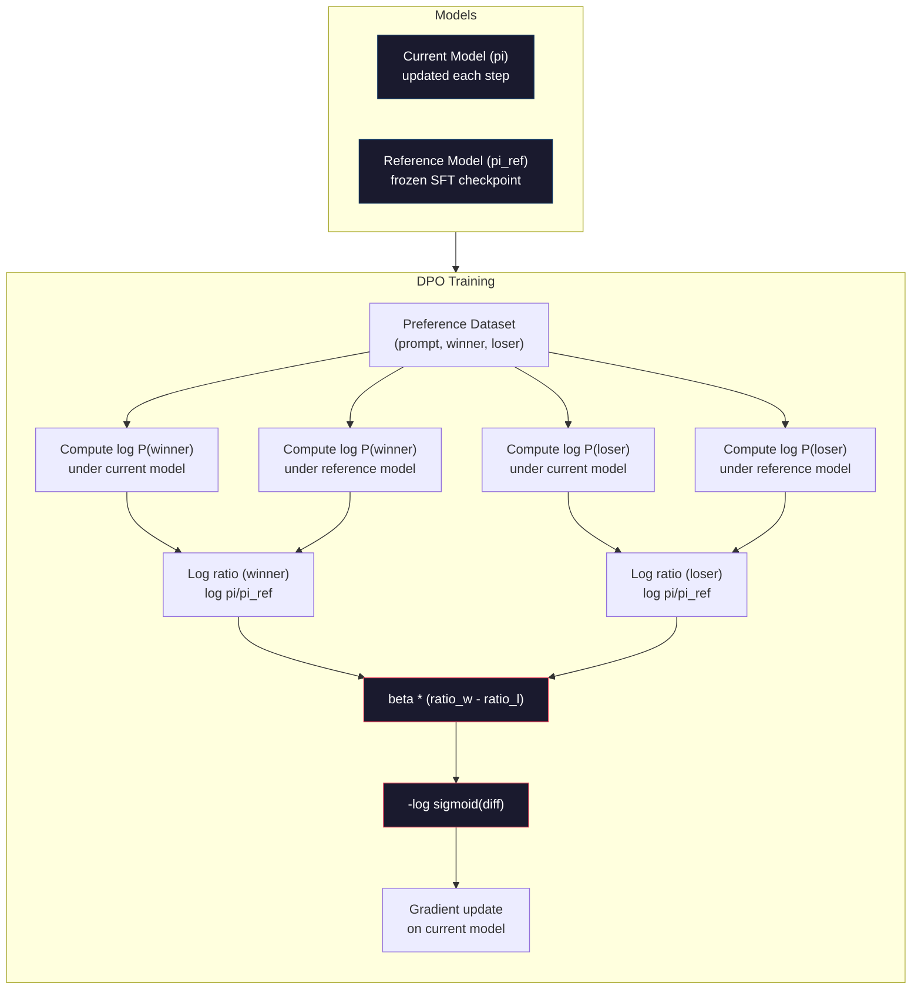

# DPO: بهینه سازی مستقیم ترجیح

> RLHF کار می کند. همچنین نیاز به آموزش سه مدل (SFT، مدل پاداش، سیاست) ، مدیریت عدم ثبات PPO و تنظیم مجازات KL دارد. DPO می پرسد: اگر می توانید از همه اینها بگذرانید؟ DPO مستقیماً مدل زبان را در زوج های اولویت بهینه می کند. هیچ مدل پاداش. هیچ PPO. یک حلقه آموزشی. نتایج مشابه.

**Type:** Build
**Languages:** Python (with numpy)
**Prerequisites:** Phase 10, Lesson 07 (RLHF)
**Time:** ~90 minutes

## اهداف یادگیری

- پیاده سازی آموزش DPO که مستقیماً یک مدل زبان را در زوج های اولویت بدون یک مدل پاداش جداگانه بهینه کند
- تابع خسارت DPO را اخذ کنید و توضیح دهید که چگونه ضمنی طور یک مدل پاداش را از طریق احتمالات ثبت سیاست نشان می دهد
- مقایسه DPO با RLHF از نظر ثبات آموزش، هزینه محاسبه و تعداد مدل های مورد نیاز
- تنظیم پارامتر بتا برای کنترل اینکه تا چه حد سیاست آموزش دیده از مدل مرجع متفاوت است

## مشکل

شما در درس ۷ یک خط لوله RLHF ساخته اید. سه مرحله. سه مدل. مدل SFT، مدل پاداش و مدل سیاست بهینه شده با PPO. تنها مدل پاداش نیازمند هزاران جفت ترجیح انسانی و یک حلقه آموزشی جداگانه است. PPO نیاز به تنظیم دقیق ضریب KL، نرخ یادگیری، نسبت کلپ و تعداد دوره ها دارد.

در عمل، آموزش PPO نامشخص است. تغییرات کوچک هیپر پارامتر باعث انحراف آموزش می شود. مدل پاداش یک نماینده نامکمل برای ترجیحات انسان است و سیاست راه هایی برای بهره برداری از نقاط ضعف آن را پیدا می کند. مجازات KL کمک می کند اما نیاز به تنظیم خود دارد - بیش از حد پایین و شما هک پاداش می گیرید، بیش از حد بالا و مدل به سختی یاد می گیرد.

این پیچیدگی دلیل آن است که اکثر مدل های منبع باز برای سال ها پس از انتشار InstructGPT با RLHF مبارزه کردند. خط لوله سه مرحله شکننده است. هر مرحله دارای حالت شکست خود است و اشتباهات ترکیب شده است.

در ماه مه سال 2023، رافائل رافائیلوف، آرچیت شرما و همکارانش در استنفورد "آپتیماسیون ترجیحات مستقیم: مدل زبان شما به طور مخفیانه یک مدل پاداش است" را منتشر کردند. عملکرد پاداش مطلوب از لحاظ ریاضی توسط احتمالات رمزنگاری زبان تعیین می شود. شما می توانید مدل پاداش را کاملاً رد کنید و مدل زبان را مستقیماً در زوج های اولویت بهینه کنید.

DPO RLHF را به یک مرحله یادگیری تحت نظارت کاهش می دهد. یک مدل. یک عملکرد از دست دادن. یک حلقه آموزشی. هیچ یادگیری تقویت کننده ای. Zephyr-7B، یکی از اولین مدل هایی که از DPO در مقیاس استفاده می کند، مدل های آموزش دیده را با RLHF کامل در چندین معیار تطابق یا شکست داد. Meta از DPO به عنوان بخشی از لوله خط خط خط خط خط خط خط خط خط Llama 3 استفاده کرد. Anthropic در تحقیقات خط خط خط خط خط خط خود از روش های سبک DPO استفاده کرده است.

## مفهوم

### بینش کلیدی

RLHF این هدف را بهینه می کند:

```
maximize: E[R(x, y)] - beta * KL(pi || pi_ref)
```

در این مورد R مدل پاداش، pi مدل سیاست، pi_ref مدل مرجع و beta معادل KL است.

مقاله DPO نشان داد که این هدف یک راه حل بهینه در فرم بسته دارد. برای هر عملکرد پاداش R، سیاست بهینه این است:

```
pi*(y | x) = pi_ref(y | x) * exp(R(x, y) / beta) / Z(x)
```

جایی که Z(x) ثابت عادی سازی است. تنظیم مجدد:

```
R(x, y) = beta * log(pi*(y | x) / pi_ref(y | x)) + beta * log Z(x)
```

این پیشرفت است. پاداش به طور کامل از نظر احتمالات مدل سیاست و احتمالات مدل مرجع بیان می شود. شما نیازی به آموزش یک مدل پاداش جداگانه ندارید. پاداش * ضمنی * در نسبت احتمال است.

جایگزین این به مدل برادی-ترری ترجیح:

```
P(y_w > y_l | x) = sigmoid(R(x, y_w) - R(x, y_l))
                  = sigmoid(beta * (log pi(y_w|x)/pi_ref(y_w|x) - log pi(y_l|x)/pi_ref(y_l|x)))
```

اصطلاحات Z(x) لغو می شوند زیرا هر دو پاسخ بر روی یک پرامپت x شرط بندی می شوند. آنچه باقی مانده فقط تابع احتمالات ثبت نام مدل سیاست و احتمالات ثبت نام مدل مرجع در پاسخ های ترجیح داده شده و رد شده است.

### از دست دادن DPO

```
L_DPO = -log(sigmoid(beta * (log pi(y_w|x)/pi_ref(y_w|x) - log pi(y_l|x)/pi_ref(y_l|x))))
```

بذاريم هر کدوم رو باز کنيم

- **y_w**= پاسخ ترجیح داده شده (منتخب)
- **y_l**= پاسخ رد شده (خسارت)
- **x**= سریع
- **pi**= مدل فعلی (در حال آموزش)
- **pi_ref**= مدل مرجع (مراقب SFT منجمد)
- **beta**= پارامتر دمای کنترل انحراف از مرجع (معمولاً 0.1 تا 0.5)

نسبت`log pi(y|x) / pi_ref(y|x)`نسبت احتمال ثبت است. هنگامی که این نسبت مثبت است، مدل فعلی احتمال بیشتری نسبت به پاسخ y نسبت به مرجع می دهد. هنگامی که منفی است، مدل فعلی احتمال کمتری را می دهد.

از دست دادن DPO باعث می شود که مدل نسبت احتمال ثبت اطلاعات برای پاسخ های مورد علاقه را افزایش دهد و برای پاسخ های رد شده کاهش دهد. پارامتر بتا کنترل می کند که مدل چقدر می تواند از مرجع منحرف شود - بتا کوچک به معنای منحرفات بزرگ مجاز است، بتا بزرگ مدل را به مرجع نزدیک نگه می دارد.



### چرا DPO ساده تر است

| Aspect | RLHF (PPO) | DPO |
|--------|-----------|-----|
| Models to train | 3 (SFT + reward + policy) | 1 (policy only) |
| Training loops | 3 (SFT, RM training, PPO) | 2 (SFT, DPO) |
| Hyperparameters | lr, KL coeff, clip ratio, RM lr, epochs x3 | lr, beta, epochs |
| Reward model | Required (separate training) | Implicit in model probabilities |
| RL algorithm | PPO (complex, unstable) | Supervised learning (stable) |
| GPU memory | 3-4 models in memory during PPO | 2 models (current + reference) |
| Training stability | Sensitive to hyperparameters | Robust, similar to SFT |

DPO به دو مدل در حافظه در طول آموزش نیاز دارد - مدل فعلی و مرجع منجمد. RLHF به سه یا چهار مورد نیاز دارد: سیاست، مرجع، مدل پاداش و به طور اختیاری یک خط پایه عملکرد ارزش. برای یک مدل 70B، هر نسخه 140GB در FP16 است. پس انداز حافظه از حذف مدل پاداش قابل توجهی است.

### وقتی که DPO از RLHF بر میگیره

**Small datasets.**با ۵۰۰۰ تا ۲۰۰۰۰ جفت اولویت، DPO اغلب با RLHF مطابقت دارد یا از آن فراتر می رود. مدل پاداش در RLHF به داده های کافی برای عمومی سازی نیاز دارد - با داده های محدود، بیش از حد می گذرد و سیگنال های پاداش غیرقابل اعتماد تولید می کند. DPO این مشکل را با عدم نیاز به یک مدل پاداش به طور کامل دور می برد.

**Limited compute.**DPO حدود یک سوم محاسبه RLHF کامل (یک حلقه آموزشی به جای سه) را نیاز دارد. برای تیم هایی که دارای کلستر های بزرگ GPU نیستند، این گزینه عملی است.

**Rapid iteration.**می خواهید 10 مجموعه داده های مختلف را امتحان کنید تا ببینید کدام مدل بهترین است؟ DPO اجازه می دهد تا هر آزمایش را در ساعت ها اجرا کنید. RLHF نیاز به آموزش مجدد مدل پاداش برای هر مجموعه داده دارد.

### وقتی RLHF از DPO بر میگیره

**Large-scale training.**در مقیاس GPT-4 یا کلاود، مدل پاداش جداگانه RLHF می تواند سیگنال های ترجیحات ظریف تر را ضبط کند. مدل پاداش به عنوان یک عملکرد از دست دادن آموخته شده عمل می کند که با معیارهای کیفیت پیچیده سازگار است.

**Complex reward signals.**وقتی "بهتر" شامل ابعاد متعدد (مفید بودن، بی ضرر بودن، صداقت) است، یک مدل پاداش می تواند این معامله چند هدف را یاد بگیرد. DPO هر جفت اولویت را به عنوان یک سیگنال دوگانه - یکی بهتر است، دیگری بدتر است - بدون اینکه مدل سازی چرا را انجام دهد.

**Iterative alignment.**خطوط لوله RLHF می توانند با سیاست فعلی پاسخ های جدیدی را تولید کنند، از انسان ها بخواهند آنها را ارزیابی کنند و مدل پاداش را در یک حلقه آنلاین آموزش دهند. DPO بر روی مجموعه داده های ثابت از زوج های اولویت کار می کند. هوش مصنوعی آئینی (رفتار آنترپیک) از این ویژگی تکراری RLHF به طور گسترده ای استفاده می کند.

### فراتر از DPO: KTO، ORPO، SimPO

DPO الهام بخش یک خانواده از روش های ساده سازمانی شد.

**KTO (Kahneman-Tversky Optimization, 2024):**تو حتی به جفت ها هم احتیاجی نداری KTO با بازخورد غیرمرتبط کار می کند -- فقط هر پاسخ را به عنوان "خوب" یا "بد" برچسب بزنید بدون اینکه آن را با یک جایگزین مقایسه کنید. این به طور چشمگیری جمع آوری داده ها را ساده می کند. به جای اینکه به نوتیتورها دو پاسخ نشان دهید و از آنها بپرسید "چه یک بهتر است؟" شما یک پاسخ را نشان می دهید و می پرسید "آیا این خوب است؟" تابع از دست دادن از نظریه چشم انداز استفاده می شود: پاسخ های بد بیشتر مجازات می شوند تا پاسخ های خوب پاداش داده می شوند.

**ORPO (Odds Ratio Preference Optimization, 2024):**SFT و تعادل را در یک مرحله آموزشی ترکیب می کند. به جای انجام SFT ابتدا سپس DPO، ORPO از دست دادن SFT را برای شامل کردن یک سیگنال ترجیح تغییر می دهد. این از دست دادن دو اصطلاح دارد: یک از دست دادن پیش بینی استاندارد توکن بعدی در پاسخ های ترجیح داده شده، به علاوه یک اصطلاح نسبت احتمالاتی که شکاف بین احتمالات پاسخ ترجیح داده شده و رد شده را افزایش می دهد. یک حلقه آموزشی به جای دو.

**SimPO (Simple Preference Optimization, 2024):**این مدل مرجع را به طور کامل حذف می کند. به جای محاسبه نسبت احتمال ثبت نام با یک مرجع منجمد، SimPO از احتمال ثبت نام متوسط پاسخ (معمولی با طول) به عنوان پاداش ضمنی استفاده می کند. این حافظه را ذخیره می کند (هیچ مدل مرجع مورد نیاز نیست) و آموزش را ساده می کند. نرمال سازی طول از این که مدل از پاسخ کوتاه تر حمایت کند جلوگیری می کند.

| Method | Year | Models in Memory | Needs Pairs? | Needs Reference? | Training Loops |
|--------|------|-----------------|-------------|-----------------|----------------|
| RLHF | 2022 | 3-4 | Yes (for RM) | Yes | 3 |
| DPO | 2023 | 2 | Yes | Yes | 2 |
| KTO | 2024 | 2 | No (unpaired) | Yes | 2 |
| ORPO | 2024 | 1 | Yes | No | 1 |
| SimPO | 2024 | 1 | Yes | No | 1 |

روند واضح است: هر روش یک قطعه پیچیده تر را حذف می کند. RLHF نیاز به یک مدل پاداش و PPO دارد. DPO هر دو را حذف می کند. KTO داده های جفت را حذف می کند. ORPO مرحله جداگانه SFT را حذف می کند. SimPO مدل مرجع را حذف می کند. مالیات بر تعادل - هزینه محاسبه و پیچیدگی از یک مدل پایه به یک مدل تعادل - همچنان کاهش می یابد.

### تعینات واقعی DPO

**Zephyr-7B (HuggingFace, October 2023):**Mistral 7B پایه، SFT در UltraChat (200K نمونه) ، سپس DPO در UltraFeedback (60K زوج های ترجیح). امتیاز 6.47 در MT-Bench - بالاترین مدل 7B در آن زمان. برای مقایسه، Llama 2 Chat 70B امتیاز 6.86، به این معنی Zephyr در داخل 6% از یک مدل 10x اندازه خود را با استفاده از تنها DPO خط بندی.

**Llama 3 (Meta, April 2024):**استفاده از DPO پس از مراحل اولیه RLHF. ترکیبی نشان می دهد که DPO و RLHF می توانند مکمل باشند - RLHF برای خط بندی گسترده، DPO برای اصلاح هدفمند.

**Neural Magic / nm-chat (2024):**DPO را به چندین مدل منبع باز اعمال کرد و به طور مداوم بهبود 5 تا 15٪ در معیار های مرزی تعاونی نسبت به خط های پایه تنها SFT را نشان داد.

```figure
dpo-loss
```

## آن را بسازید

### مرحله اول: مجموعه داده های ترجیح

همان فرمت RLHF -- (سرعان، ترجیح داده، رد شده) سه برابر. DPO این داده ها را مستقیما بدون یک مدل پاداش میانگین مصرف می کند.

```python
import numpy as np
import sys
import os
sys.path.insert(0, os.path.join(os.path.dirname(__file__), "..", "..", "04-pre-training-mini-gpt", "code"))
from main import MiniGPT, LayerNorm, Embedding, TransformerBlock

PREFERENCE_DATA = [
    {
        "prompt": "What is the capital of France?",
        "preferred": "The capital of France is Paris.",
        "rejected": "France is a country in Europe. It has many cities. The capital is Paris. Paris is known for the Eiffel Tower.",
    },
    {
        "prompt": "Explain gravity in one sentence.",
        "preferred": "Gravity is the force that attracts objects with mass toward each other.",
        "rejected": "Gravity is something that makes things fall down when you drop them.",
    },
    {
        "prompt": "What is 15 times 7?",
        "preferred": "15 times 7 is 105.",
        "rejected": "Let me think about this. 15 times 7. Well, 10 times 7 is 70, and 5 times 7 is 35, so the answer might be around 105.",
    },
    {
        "prompt": "Name three programming languages.",
        "preferred": "Python, Rust, and TypeScript.",
        "rejected": "There are many programming languages. Some popular ones include various languages like Python and others.",
    },
    {
        "prompt": "What year did World War II end?",
        "preferred": "World War II ended in 1945.",
        "rejected": "World War II was a major global conflict. It involved many countries. The war ended in the mid-1940s, specifically in 1945.",
    },
    {
        "prompt": "Define machine learning.",
        "preferred": "Machine learning is a field where algorithms learn patterns from data to make predictions without being explicitly programmed.",
        "rejected": "Machine learning is a type of AI. AI stands for artificial intelligence. Machine learning uses data to learn.",
    },
]
```

### مرحله دوم: احتمال ثبت ردیابی

از دست دادن DPO نیاز به محاسبه کل احتمال ثبت یک پاسخ داده شده است. این بدان معنی است که مدل را در یک دنباله کامل (سریع + پاسخ) اجرا کنید و احتمال ثبت هر توکن پاسخ را جمع کنید.

```python
def tokenize_sequence(text, vocab_size=256):
    return [min(t, vocab_size - 1) for t in list(text.encode("utf-8"))]


def compute_sequence_log_prob(model, prompt_tokens, response_tokens, max_seq_len=128):
    full_sequence = prompt_tokens + response_tokens
    if len(full_sequence) > max_seq_len:
        full_sequence = full_sequence[:max_seq_len]

    if len(full_sequence) < 2:
        return 0.0

    input_ids = np.array(full_sequence[:-1]).reshape(1, -1)
    target_ids = np.array(full_sequence[1:])

    logits = model.forward(input_ids)
    logits = logits[0]

    max_logits = logits.max(axis=-1, keepdims=True)
    log_probs = logits - max_logits - np.log(
        np.exp(logits - max_logits).sum(axis=-1, keepdims=True)
    )

    prompt_len = len(prompt_tokens)
    response_start = max(0, prompt_len - 1)
    response_end = len(target_ids)

    if response_start >= response_end:
        return 0.0

    response_log_probs = log_probs[response_start:response_end, :]
    response_targets = target_ids[response_start:response_end]

    total_log_prob = 0.0
    for i, target in enumerate(response_targets):
        total_log_prob += response_log_probs[i, target]

    return total_log_prob
```

این تابع کار اسب DPO است. برای هر جفت اولویت، چهار بار اجرا می شود: مدل بر روی پاسخ ترجیح، مدل بر روی پاسخ رد، مرجع بر روی پاسخ ترجیح، مرجع بر روی پاسخ رد. این 4 پاس پیش در هر مثال آموزش در مقابل نسل RLHF + امتیاز پاداش + تخمین ارزش + PPO به روز رسانی است. ساده تر، سریع تر، پایدارتر.

### مرحله سوم: از دست دادن DPO

هسته کاغذ در کد، یک تابع، یک ضرر، هیچ مدل پاداش

```python
def sigmoid(x):
    return np.where(
        x >= 0,
        1.0 / (1.0 + np.exp(-x)),
        np.exp(x) / (1.0 + np.exp(x))
    )


def dpo_loss(policy_logprob_preferred, policy_logprob_rejected,
             ref_logprob_preferred, ref_logprob_rejected, beta=0.1):
    preferred_ratio = policy_logprob_preferred - ref_logprob_preferred
    rejected_ratio = policy_logprob_rejected - ref_logprob_rejected

    logit = beta * (preferred_ratio - rejected_ratio)

    loss = -np.log(sigmoid(logit) + 1e-8)

    preferred_reward = beta * preferred_ratio
    rejected_reward = beta * rejected_ratio

    return loss, {
        "preferred_ratio": float(preferred_ratio),
        "rejected_ratio": float(rejected_ratio),
        "logit": float(logit),
        "implicit_preferred_reward": float(preferred_reward),
        "implicit_rejected_reward": float(rejected_reward),
        "reward_margin": float(preferred_reward - rejected_reward),
    }
```

.`preferred_ratio`و`rejected_ratio`نسبت های احتمال ثبت از مشتق DPO است. هنگامی که مدل فعلی احتمال بیشتری به پاسخ مورد علاقه (در رابطه با مرجع) و احتمال کمتری به پاسخ رد شده را اختصاص می دهد، منطق مثبت است و از دست دادن کم است. سیگنال آموزش مدل را دقیقا در این جهت فشار می دهد.

.`implicit_preferred_reward`و`implicit_rejected_reward`این پاداش هایی است که از دست دادن DPO ضمنی طور به شما می دهد. شما می توانید آنها را برای بررسی اینکه آموزش در حال کار است استخراج کنید - مارژین بین پاداش های ترجیح داده شده و رد شده باید نسبت به آموزش افزایش یابد.

### مرحله چهارم: چرخه آموزش DPO

يه حلقه آموزش استاندارد تحت نظارت، بدون PPO، بدون مدل پاداش، فقط گذرگاه ها و بروز رساني هاي گرادينت

```python
def copy_model_weights(source, target):
    target.embedding.token_embed = source.embedding.token_embed.copy()
    target.embedding.pos_embed = source.embedding.pos_embed.copy()
    target.ln_f.gamma = source.ln_f.gamma.copy()
    target.ln_f.beta = source.ln_f.beta.copy()
    for s_block, t_block in zip(source.blocks, target.blocks):
        t_block.attn.W_q = s_block.attn.W_q.copy()
        t_block.attn.W_k = s_block.attn.W_k.copy()
        t_block.attn.W_v = s_block.attn.W_v.copy()
        t_block.attn.W_out = s_block.attn.W_out.copy()
        t_block.ffn.W1 = s_block.ffn.W1.copy()
        t_block.ffn.W2 = s_block.ffn.W2.copy()
        t_block.ffn.b1 = s_block.ffn.b1.copy()
        t_block.ffn.b2 = s_block.ffn.b2.copy()
        t_block.ln1.gamma = s_block.ln1.gamma.copy()
        t_block.ln1.beta = s_block.ln1.beta.copy()
        t_block.ln2.gamma = s_block.ln2.gamma.copy()
        t_block.ln2.beta = s_block.ln2.beta.copy()


def dpo_train(policy_model, reference_model, preference_data,
              num_epochs=5, lr=5e-6, beta=0.1, max_seq_len=128):
    print(f"DPO Training: {len(preference_data)} pairs, {num_epochs} epochs, "
          f"lr={lr}, beta={beta}")
    print()

    losses = []
    margins = []

    for epoch in range(num_epochs):
        epoch_loss = 0.0
        epoch_margin = 0.0
        num_examples = 0

        indices = np.random.permutation(len(preference_data))

        for idx in indices:
            pair = preference_data[idx]

            prompt_tokens = tokenize_sequence(pair["prompt"])
            preferred_tokens = tokenize_sequence(pair["preferred"])
            rejected_tokens = tokenize_sequence(pair["rejected"])

            pi_logprob_w = compute_sequence_log_prob(
                policy_model, prompt_tokens, preferred_tokens, max_seq_len
            )
            pi_logprob_l = compute_sequence_log_prob(
                policy_model, prompt_tokens, rejected_tokens, max_seq_len
            )
            ref_logprob_w = compute_sequence_log_prob(
                reference_model, prompt_tokens, preferred_tokens, max_seq_len
            )
            ref_logprob_l = compute_sequence_log_prob(
                reference_model, prompt_tokens, rejected_tokens, max_seq_len
            )

            loss, metrics = dpo_loss(
                pi_logprob_w, pi_logprob_l,
                ref_logprob_w, ref_logprob_l, beta
            )

            update_direction = 1.0 if metrics["logit"] < 0 else -0.1
            for block in policy_model.blocks:
                block.ffn.W1 += lr * update_direction * np.random.randn(*block.ffn.W1.shape) * 0.01
                block.ffn.W2 += lr * update_direction * np.random.randn(*block.ffn.W2.shape) * 0.01

            epoch_loss += loss
            epoch_margin += metrics["reward_margin"]
            num_examples += 1
            losses.append(float(loss))
            margins.append(metrics["reward_margin"])

        avg_loss = epoch_loss / max(num_examples, 1)
        avg_margin = epoch_margin / max(num_examples, 1)

        print(f"  Epoch {epoch + 1}/{num_epochs} | Loss: {avg_loss:.4f} | "
              f"Avg Margin: {avg_margin:.4f}")

    return policy_model, losses, margins
```

حلقه آموزش در مقایسه با RLHF بسیار ساده است. برای هر جفت اولویت: چهار احتمال ثبت را محاسبه کنید (دو مدل، دو پاسخ) ، آنها را به از دست دادن DPO وصل کنید، گرادیانت را محاسبه کنید، سیاست را به روز کنید. هیچ مرحله تولید نیست. هیچ نتیجه گیری مدل پاداش نیست. هیچ تخمین سود. هیچ برش.

### مرحله 5: مقایسه DPO با RLHF

اندازه گیری مارژین های ضمنی پاداش و تغییرات احتمال ثبت را برای مقایسه DPO با مدل RLHF از درس 07 اندازه گیری کنید.

```python
def evaluate_preference_accuracy(model, reference_model, preference_data, beta=0.1, max_seq_len=128):
    correct = 0
    total = 0

    for pair in preference_data:
        prompt_tokens = tokenize_sequence(pair["prompt"])
        preferred_tokens = tokenize_sequence(pair["preferred"])
        rejected_tokens = tokenize_sequence(pair["rejected"])

        pi_w = compute_sequence_log_prob(model, prompt_tokens, preferred_tokens, max_seq_len)
        pi_l = compute_sequence_log_prob(model, prompt_tokens, rejected_tokens, max_seq_len)
        ref_w = compute_sequence_log_prob(reference_model, prompt_tokens, preferred_tokens, max_seq_len)
        ref_l = compute_sequence_log_prob(reference_model, prompt_tokens, rejected_tokens, max_seq_len)

        preferred_reward = beta * (pi_w - ref_w)
        rejected_reward = beta * (pi_l - ref_l)

        if preferred_reward > rejected_reward:
            correct += 1
        total += 1

    return correct / max(total, 1)


def analyze_implicit_rewards(model, reference_model, preference_data, beta=0.1, max_seq_len=128):
    print("Implicit Reward Analysis:")
    print("-" * 65)
    print(f"  {'Prompt':<30} {'Pref Reward':>12} {'Rej Reward':>12} {'Margin':>10}")
    print("  " + "-" * 60)

    for pair in preference_data:
        prompt_tokens = tokenize_sequence(pair["prompt"])
        preferred_tokens = tokenize_sequence(pair["preferred"])
        rejected_tokens = tokenize_sequence(pair["rejected"])

        pi_w = compute_sequence_log_prob(model, prompt_tokens, preferred_tokens, max_seq_len)
        pi_l = compute_sequence_log_prob(model, prompt_tokens, rejected_tokens, max_seq_len)
        ref_w = compute_sequence_log_prob(reference_model, prompt_tokens, preferred_tokens, max_seq_len)
        ref_l = compute_sequence_log_prob(reference_model, prompt_tokens, rejected_tokens, max_seq_len)

        pref_reward = beta * (pi_w - ref_w)
        rej_reward = beta * (pi_l - ref_l)
        margin = pref_reward - rej_reward

        truncated = pair["prompt"][:28] + ".." if len(pair["prompt"]) > 30 else pair["prompt"]
        print(f"  {truncated:<30} {pref_reward:>12.4f} {rej_reward:>12.4f} {margin:>10.4f}")

    print()
```

### مرحله 6: تجزیه و تحلیل حساسیت بتا

پارامتر بتا معادل DPO از معادل KL در RLHF است. این کنترل می کند که مدل چقدر می تواند از مرجع منحرف شود. این آزمایش اثر آن را نشان می دهد.

```python
def beta_sensitivity_analysis(sft_model, preference_data, betas, max_seq_len=128):
    print("Beta Sensitivity Analysis")
    print("-" * 60)
    print(f"  {'Beta':>8} {'Final Loss':>12} {'Final Margin':>14} {'Accuracy':>10}")
    print("  " + "-" * 55)

    results = []

    for beta in betas:
        policy = MiniGPT(
            vocab_size=256, embed_dim=128, num_heads=4,
            num_layers=4, max_seq_len=max_seq_len, ff_dim=512
        )
        reference = MiniGPT(
            vocab_size=256, embed_dim=128, num_heads=4,
            num_layers=4, max_seq_len=max_seq_len, ff_dim=512
        )
        copy_model_weights(sft_model, policy)
        copy_model_weights(sft_model, reference)

        policy, losses, margins_list = dpo_train(
            policy, reference, preference_data,
            num_epochs=3, lr=5e-6, beta=beta, max_seq_len=max_seq_len
        )

        accuracy = evaluate_preference_accuracy(
            policy, reference, preference_data, beta, max_seq_len
        )

        final_loss = losses[-1] if losses else 0
        final_margin = margins_list[-1] if margins_list else 0

        print(f"  {beta:>8.3f} {final_loss:>12.4f} {final_margin:>14.4f} {accuracy:>10.1%}")
        results.append({
            "beta": beta,
            "final_loss": final_loss,
            "final_margin": final_margin,
            "accuracy": accuracy,
        })

        print()

    return results
```

بتا کوچک (0.01) اجازه می دهد مدل به طور آزادانه از مرجع منحرف شود - یادگیری سریع اما خطر حل های انحطاط. بتا بزرگ (1.0) مدل را نزدیک به مرجع نگه می دارد - یادگیری پایدار اما کند. نقطه شیرین برای اکثر برنامه ها 0.1 تا 0.3 است.

## ازش استفاده کن

### نمایش کامل خط لوله

```python
if __name__ == "__main__":
    np.random.seed(42)

    print("=" * 70)
    print("DPO: DIRECT PREFERENCE OPTIMIZATION")
    print("=" * 70)
    print()

    print("STEP 1: Initialize SFT Model (from Lesson 06)")
    print("-" * 50)
    sft_model = MiniGPT(
        vocab_size=256, embed_dim=128, num_heads=4,
        num_layers=4, max_seq_len=128, ff_dim=512
    )
    print(f"  Parameters: {sft_model.count_parameters():,}")
    print()

    print("STEP 2: DPO Training")
    print("-" * 50)

    policy_model = MiniGPT(
        vocab_size=256, embed_dim=128, num_heads=4,
        num_layers=4, max_seq_len=128, ff_dim=512
    )
    reference_model = MiniGPT(
        vocab_size=256, embed_dim=128, num_heads=4,
        num_layers=4, max_seq_len=128, ff_dim=512
    )
    copy_model_weights(sft_model, policy_model)
    copy_model_weights(sft_model, reference_model)

    policy_model, losses, margins = dpo_train(
        policy_model, reference_model, PREFERENCE_DATA,
        num_epochs=5, lr=5e-6, beta=0.1
    )
    print()

    print("=" * 70)
    print("STEP 3: Evaluate")
    print("=" * 70)
    print()

    pre_accuracy = evaluate_preference_accuracy(
        sft_model, reference_model, PREFERENCE_DATA, beta=0.1
    )
    post_accuracy = evaluate_preference_accuracy(
        policy_model, reference_model, PREFERENCE_DATA, beta=0.1
    )

    print(f"  Preference accuracy (pre-DPO):  {pre_accuracy:.1%}")
    print(f"  Preference accuracy (post-DPO): {post_accuracy:.1%}")
    print()

    analyze_implicit_rewards(policy_model, reference_model, PREFERENCE_DATA, beta=0.1)

    print("=" * 70)
    print("STEP 4: Training Dynamics")
    print("=" * 70)
    print()

    if losses:
        print("  Loss curve:")
        window = max(1, len(losses) // 5)
        for i in range(0, len(losses), window):
            chunk = losses[i:i + window]
            avg = sum(chunk) / len(chunk)
            print(f"    Steps {i:3d}-{i + len(chunk) - 1:3d}: loss = {avg:.4f}")
        print()

    if margins:
        print("  Reward margin curve:")
        window = max(1, len(margins) // 5)
        for i in range(0, len(margins), window):
            chunk = margins[i:i + window]
            avg = sum(chunk) / len(chunk)
            print(f"    Steps {i:3d}-{i + len(chunk) - 1:3d}: margin = {avg:.4f}")
        print()

    print("=" * 70)
    print("STEP 5: Beta Sensitivity")
    print("=" * 70)
    print()

    beta_results = beta_sensitivity_analysis(
        sft_model, PREFERENCE_DATA, betas=[0.01, 0.1, 0.3, 1.0]
    )

    print("=" * 70)
    print("DPO vs RLHF COMPARISON")
    print("=" * 70)
    print()
    print("  DPO advantages:")
    print("    - 1 training loop (vs 3 for RLHF)")
    print("    - 2 models in memory (vs 3-4 for RLHF)")
    print("    - Supervised learning (vs RL, more stable)")
    print("    - No reward model to train or maintain")
    print()
    print("  RLHF advantages:")
    print("    - Separate reward model captures complex preferences")
    print("    - Online learning: generate, rate, retrain")
    print("    - Better for multi-objective alignment")
    print("    - Proven at largest scales (GPT-4, Claude)")
    print()
    print("  Practical guidance:")
    print("    - Start with DPO. It's simpler and often sufficient.")
    print("    - Switch to RLHF if DPO plateaus on your eval metrics.")
    print("    - Many production systems use both: RLHF first, DPO to refine.")
```

## -باده

این درس به ما کمک می کند`outputs/prompt-alignment-method-selector.md`-- یک پیامک که به شما کمک می کند روش هماهنگی مناسب (SFT، RLHF، DPO، KTO، ORPO، SimPO) را برای مورد استفاده خود انتخاب کنید. با توجه به دسترسی به داده ها، بودجه محاسبه و اهداف هماهنگی، آن یک روش و برنامه آموزشی را توصیه می کند.

## تمرینات

1. KTO را پیاده سازی کنید. KTO به جفت ها نیاز ندارد - فقط هر پاسخ را به عنوان "خوب" یا "بد" برچسب بزنید.`-log(sigmoid(beta * log_ratio))`و براي پاسخ بد`-log(1 - sigmoid(beta * log_ratio))`با ضرب ضریب رد به ضرر (معمولا 1.5x) در کاهش پاسخ بد. بر اساس داده های مشابه (تعامل با "خوب" و رد به عنوان "بد" به طور مستقل) تمرین کنید و دقت را با DPO مقایسه کنید.

2. DPO استاندارد شده با طول را پیاده سازی کنید. به جای احتمالات اولیه روزنامه، به تعداد توکن های پاسخ تقسیم کنید: `normalized_logprob = total_logprob / num_tokens`این مانع از اینکه مدل از پاسخ های کوتاه تر (که دارای کل لاگ-پروب بالاتر هستند) استفاده کند. مارژین پاداش ضمنی را با و بدون نرمال سازی مقایسه کنید.

3. ایجاد یک ضرر ترکیبی به سبک ORPO. اضافه کردن یک ضرر پیش بینی استاندارد next-token در پاسخ ترجیح داده شده به DPO از دست دادن: `L = L_sft(preferred) + alpha * L_dpo`. ارزش های آلفا 0.1، 0.5 و 1.0 را امتحان کنید. ضایعات ترکیبی باید یک مدل ایجاد کنند که هر دو از دستورالعمل ها پیروی می کنند (از اصطلاح SFT) و پاسخ های بهتری را ترجیح می دهند (از اصطلاح DPO) ، از بین بردن نیاز به مرحله جداگانه SFT.

4. DPO تکراری را اجرا کنید. DPO را برای 3 دوره اجرا کنید، سپس پاسخ های جدید را از مدل آموزش دیده تولید کنید، آنها را با پاسخ های اصلی ترجیح داده شده به عنوان زوج های جدید ترجیح، و دوباره DPO را اجرا کنید. دو دور از این فرآیند "خود بازی" انجام دهید. دقت ترجیحات را پس از دور 1 و دور 2 مقایسه کنید تا ببینید آیا اصلاح تکراری کمک می کند.

5. مقایسه DPO با مدل های مرجع مختلف. به جای استفاده از نقطه بازرسی SFT به عنوان مرجع، سعی کنید: (ا) مدل پایه (پیش از SFT) ، (ب) نقطه بازرسی از دوره 1 DPO، (ج) متوسط متحرک نمایی مدل سیاست را مقایسه کنید. گزارش دهید که کدام مرجع بیشترین دقت ترجیح و پایدارترین منحنی آموزش را تولید می کند.

## اصطلاحات کلیدی

| Term | What people say | What it actually means |
|------|----------------|----------------------|
| DPO | "RLHF without RL" | Direct Preference Optimization: a supervised learning algorithm that optimizes the language model directly on preference pairs, bypassing the reward model and PPO |
| Implicit reward | "The reward is in the model" | The reward function is determined by the log-probability ratio between the policy and reference models -- no separate reward model needed |
| Beta (DPO) | "The temperature" | Controls how far the policy can deviate from the reference model -- small beta allows large deviations, large beta keeps the model close |
| Log-probability ratio | "How much the model changed" | log pi(y\|x) - log pi_ref(y\|x) -- positive means the current model assigns higher probability than the reference |
| Reference model | "The frozen checkpoint" | A copy of the SFT model whose weights never change -- serves as the anchor for computing probability ratios |
| KTO | "DPO without pairs" | Kahneman-Tversky Optimization: works with unpaired "good" or "bad" labels instead of requiring preference pairs |
| ORPO | "One-step alignment" | Odds Ratio Preference Optimization: combines SFT and alignment into a single training loop by adding a preference term to the SFT loss |
| SimPO | "No reference needed" | Simple Preference Optimization: eliminates the reference model by using length-normalized average log-probability as the implicit reward |
| Alignment tax | "The cost of making models safe" | The additional compute, data, and complexity required to go from a base model to an aligned model -- DPO reduces this significantly |

## خواندن بیشتر

- [Rafailov et al., 2023 -- "Direct Preference Optimization: Your Language Model is Secretly a Reward Model"](https://arxiv.org/abs/2305.18290)-- مقاله DPO که تعدیل را از RLHF به یادگیری تحت نظارت ساده کرد
- [Tunstall et al., 2023 -- "Zephyr: Direct Distillation of LM Alignment"](https://arxiv.org/abs/2310.16944)-- زفير-7 بي، نشان دهنده DPO در UltraFeedback مطابقت RLHF در مقايسه ها
- [Ethayarajh et al., 2024 -- "KTO: Model Alignment as Prospect Theoretic Optimization"](https://arxiv.org/abs/2402.01306)-- از بین بردن نیاز به اولویت های جفت
- [Hong et al., 2024 -- "ORPO: Monolithic Preference Optimization without Reference Model"](https://arxiv.org/abs/2403.07691)-- ترکیب SFT و تعادل در یک مرحله
- [Meng et al., 2024 -- "SimPO: Simple Preference Optimization with a Reference-Free Reward"](https://arxiv.org/abs/2405.14734)-- حذف کامل مدل مرجع
- [Llama 3 Technical Report](https://arxiv.org/abs/2407.21783)-- خط خط خط خط خط خط خط خط خط خط خط خط خط خط خط خط خط خط خط خط خط خط خط خط خط خط خط خط خط خط خط خط خط خط خط خط خط خط خط خط خط خط خط خط خط خط خط خط خط خط خط خط خط خط خط خط خط خط خط خط خط خط خط خط خط خط خط خط خط خط خط خط خط خط خط خط خط خط خط خط خط خط خط خط خط خط خط خط خط خط خط خط خط خط خط خط خط خط خط خط خط خط خط خط خط خط خط خط خط خط خط خط خط خط خط خط خط خط خط خط خط خط خط خط خط خط خط خط خط خط خط خط خط خط خط خط خط خط خط خط خط خط خط خط خط خط خط خط خط خط خط خط خط خط خط خط خط خط خط خط خط خط خط خط خط خط خط خط خط خط خط خط خط خط خط خط خط خط خط خط خط خط خط خط خط خط خط خط خط خط خط خط خط خط خط خط خط خط خط خط خط خط خط خط خط خط خط خط خط خط خط خط خط خط خط خط خط خط خط خط خط خط خط خط خط خط خط خط خط خط خط خط خط خط خط خط خط خط خط خط خط خط خط خط خط خط خط خط خط خط خط خط خط خط خط خط خط خط خط خط خط خط خط خط خط خط خط خط خط خط خط خط خط خط خط خط خط خط خط خط خط خط خط خط خط خط خط خط خط خط خط خط خط خط خط خط خط خط خط خط خط خط خط خط خط خط خط خط خط خط خط خط خط خط خط خط خط خط خط خط خط خط خط خط خط خط خط خط خط خط خط خط خط خط خط خط خط خط خط خط خط خط خط خط خط خط خط خط خط خط خط خط خط خط خط خط خط خط خط خط خط خط خط خط خط خط خط خط خط خط خط خط خط خط خط خط خط خط خط خط خط خط خط خط خط خط خط خط خط خط خط خط خط خط خط خط خط خط خط خط خط خط خط خط خط خط خط خط خط خط خط خط خط خط خط خط خط خط خط خط خط خط خط خط خط خط خط خط خط خط خط خط خط خط خط خط خط خط خط خط خط خط خط خط خط خط خط خط خط خط خط خط خط خط خط خط خط خط خط خط خط خط خط خط خط خط خط خط خط خط خط خط خط خط خط خط خط خط خط خط خط خط خط خط خط خط خط خط خط خط خط خط خط خط خط خط خط خط خط خط خط خط خط خط خط خط خط خط خط
