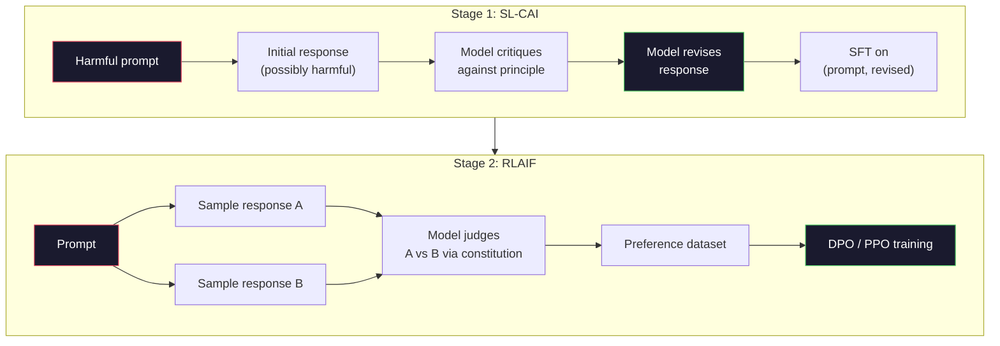
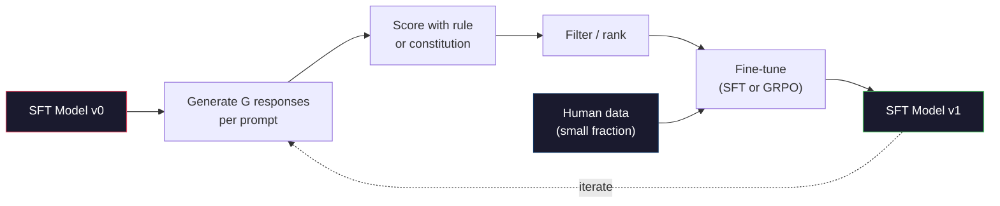

# هوش مصنوعی آئینی و بهبود خود

> . رليف به انسان ها نياز داره که در حال خبر بودن باشن هوش مصنوعی قانون اساسی بیشتر آنها را با خود مدل جایگزین می کند. یک لیست از اصول را بنویسید، از مدل بخواهید که نتایج خود را در برابر این اصول انتقاد کند و از انتقادات استفاده کنید. DeepSeek-R1 این را در سال 2025 بیشتر کرد: اجازه دهید مدل میلیون ها ردیابی استدلال را تولید کند، آنها را با یک قانون طبقه بندی کند و GRPO را بر اساس نتیجه اجرا کند. بیشتر "کار های تعاونی" در مدل مرز 2026 خود تعاونی مدل است. اين درس هر دو حلقه رو ميسازه

**Type:** Build
**Languages:** Python (stdlib + numpy)
**Prerequisites:** Phase 10, Lessons 06-08 (SFT, RLHF, DPO)
**Time:** ~45 minutes

## اهداف یادگیری

- پیاده سازی حلقه دو مرحله ای AI آئینی: خود منتقد و خود بررسی، سپس آموزش ترجیح در زوج های تجدید نظر
- هدف GRPO را (تویزیم سیاست های مربوط به گروه DeepSeek-R1) اخذ کنید و آن را با خط پایه عملکرد ارزش PPO مقایسه کنید
- ایجاد ردیف های استدلال قابل تأیید با پاداش نتایج مبتنی بر قوانین و امتیاز آنها بدون یک مدل پاداش جداگانه
- تصمیم بگیرید که چه زمانی بهبود خود از داده های ترجیحات انسانی برتری می یابد و چه زمانی به حالت جستجوی

## مشکل

شما در درس 07 RLHF و در درس 08 DPO را ساخته اید. هر دو به همان ورودی گران قیمت بستگی دارند: زوج های اولویت انسانی. لوله زمانی InstructGPT Anthropic تقریباً 33000 مقایسه را استفاده کرد. Llama 2 Chat بیش از 1.5 میلیون استفاده کرد. کلاود 3 بیشتر استفاده کرد. این داده ها کند، گران قیمت و متعصب به هر چیزی است که نوتاژران در روز ارزیابی باور داشتند.

مقاله AI قانون اساسی 2022 یک سوال ساده پرسید. اگر مدل خود برچسب های ترجیح را تولید کند؟ یک لیست از اصول نوشته شده را به آن بدهید - "قانون اساسی" - و از آن بخواهید پاسخ های خود را انتقاد کند. انتقاد ها به سیگنال آموزش تبدیل می شوند.

در سال 2024، DeepSeek این ایده را بیشتر برد. آنها نشان دادند که برای هر کاری که نتیجه قابل تأیید باشد ( ریاضیات با یک پاسخ شناخته شده، کد که یا آزمون ها را عبور می کند یا شکست می دهد، بازی که یا برنده می شود یا از دست می دهد) ، می توانید منتقد را کاملاً رد کنید. راه حل های کاندیداتی را تولید کنید. هرکدوم رو با یک قانون تعیین کننده رتبه بندی کن يه الگوریتم گريدينتي براي پاداش ها اجرا کن DeepSeek-R1 به این روش آموزش داده شده است و تقریباً بدون داده های ترجیحات انسانی و عملکرد استدلال کلاس o1 مطابقت دارد.

این دو حلقه - هوش مصنوعی آئینی برای رفتار ذهنی و RL مبتنی بر قوانین برای رفتار قابل تأیید - دستورات اصلی هماهنگی سال 2026 هستند. بودجه ترجیحات انسانی که قبلا به RLHF می رفت، اکنون برای یک گام بسیار کوچکتر پرداخت می کند: انتخاب قانون اساسی و انتخاب قوانین پاداش.

## مفهوم

### حلقه ی AI قانون اساسی

بای و همکاران (2022) این خط لوله را در دو مرحله ساخت.

**Stage 1: Supervised Learning from AI Feedback (SL-CAI).**با یک مدل SFT که مفید است اما ممکن است مضر باشد شروع کنید. آن را با درخواست های بالقوه مضر به سرعت انجام دهید. برای هر پاسخ، از * همان مدل * بخواهید تا پاسخ خود را در برابر یک اصل اساسی انتقاد کند، سپس بررسی کنید. تنظیم دقیق در پاسخ های تجدید نظر شده. مجموعه داده ها (از سریع، تجدید نظر_ پاسخ) جفت است.

**Stage 2: Reinforcement Learning from AI Feedback (RLAIF).**نمونه جوانه های پاسخ. از مدل بپرسید که کدام یک بهتر از قانون اساسی پیروی می کند. ترجیحات جفت یک مدل پاداش را آموزش می دهد. سپس PPO یا DPO را در مدل با استفاده از این پاداش اجرا کنید. تفاوت اصلی از RLHF: ترجیحات از مدل آمده است، نه از انسان.



قانون اساسی این است که نفوذ می کند. اصل Anthropic 16 اصل را داشت (بعد گسترش یافته). یک اصل مانند "لطفا پاسخ را انتخاب کنید که به احتمال کم برای هر کسی از زمینه های فرهنگی مختلف قابل اعتراض است". شما برای هر مرحله، گاهی تصادفی، گاهی بر اساس دسته بندی فوری، اصل را انتخاب می کنید.

### آنچه قانون اساسی واقعاً انجام می دهد

قانون اساسی قرارداد تعادل را از * داده ها * به * متن منتقل می کند. تغییر رفتار تحت RLHF به معنای تغییر نام هزاران جفت است. تغییر رفتار تحت CAI به معنای ویرایش پاراگراف است. این پیروزی عملی اصلی است.

. هزینه ای داره خود قضاوت مدل فقط به اندازه کالیبرش اولش خوبه اگر مدل SFT نقاط کور داشته باشد -- به عنوان مثال، نمی تواند عبارت های دستکاری را تشخیص دهد -- مرحله انتقاد این نقاط کور را به ارث می برد. CAI حلقه تعدیل را فشرده می کند اما نمی تواند سیگنال را فراتر از سقف مدل پایه تقویت کند. به همین دلیل است که هر لوله تولید CAI هنوز از برخی از داده های ترجیح انسانی استفاده می کند، معمولا 5-10٪ حجم RLHF خالص.

### GRPO: بهینه سازی سیاست های مربوط به گروه

DeepSeek GRPO را در مقاله DeepSeekMath (2024) معرفی کرد و از آن به عنوان ستون فقرات DeepSeek-R1 (2025) استفاده کرد. GRPO یک نوع PPO است که عملکرد ارزش را حذف می کند.

به یادآوریم که هدف PPO (از درس 07):

```
L_PPO = E[min(r(theta) * A, clip(r(theta), 1-eps, 1+eps) * A)]
```

کجا`A`این مزیت است که معمولا با استفاده از شبکه ارزش آموخته با GAE تخمین زده می شود.`V(s)`شبکه ارزش یک مدل دوم با اندازه سیاست است. حافظه را دو برابر می کند و یک حلقه آموزشی خود را ایجاد می کند.

GRPO تابع ارزش را خارج می کند. برای هر پرامپت، یک گروه از پاسخ های G را نمونه می کند (معمولا G = 16 یا 64). پاداش برای هر پاسخ محاسبه می شود، سپس در داخل گروه عادی می شود:

```
A_i = (r_i - mean(r_1, ..., r_G)) / std(r_1, ..., r_G)
```

این امتیاز امتیاز z در مقایسه با برادران و خواهران پاسخ است. هیچ تابع ارزش وجود ندارد. گروه به عنوان خط پایه خود عمل می کند.

```
L_GRPO = E[min(r(theta) * A_group, clip(r(theta), 1-eps, 1+eps) * A_group)] - beta * KL(pi || pi_ref)
```

مجازات KL علیه مدل مرجع هنوز هم وجود دارد، همان طور که PPO. نسبت کلپ هنوز هم وجود دارد. آنچه که رفته است، انتقاد جداگانه است.

### چرا GRPO برای استدلال مهم است

برای وظایف استدلال پاداش اغلب نادرست و دوگانه است: پاسخ نهایی درست یا غلط است. یک تابع ارزش آموزش داده شده بر روی پاداش های دوگانه کمیاب یک ضایعه است -- نمی تواند تخمین های میانگین مفید را یاد بگیرد زیرا تقریباً هر حالت به همان بازگشت انتظار می رود تا مرحله نهایی. نرمال سازی گروه GRPO یک سیگنال نسبی فوری به شما می دهد: در میان 16 تلاش برای یک مشکل ریاضی، کدام تلاش ها بالاتر از متوسط برای این مشکل بودند؟

این شکل دقیق سیگنال هایی است که از پاداش های مبتنی بر قوانین دریافت می کنید:

- **Math**: یک چکگر sympy یا نمادگر تصمیم می گیرد که آیا پاسخ نهایی مطابقت دارد.
- **Code**: یک مجموعه آزمایش تصمیم می گیرد که موفق یا ناکام شود.
- **Formatting**: یک regex تصمیم می گیرد که آیا پاسخ در برچسب XML مورد نیاز است.
- **Multi-step proofs**: یک دستیار اثبات (لین، کوک) اعتبار را تعیین می کند.

DeepSeek-R1-Zero با فقط دو پاداش آموزش دیده بود: دقت در معیار های ریاضی و رعایت فرمت (جواب در داخل `<answer>`هیچ تفضيل انساني. هیچ مدل انتقادي. "حالی که در مقاله DeepSeek توصیف شده است" -- مدل که به طور پاییزی یاد می گیرد که چگونه خود را بررسی و عقب نشینی کند -- تنها با پاداش های کمی از قوانین از GRPO ظاهر شد.

### مدل های پاداش فرآیند در مقابل مدل های پاداش نتیجه

شما هنوز هم یک انتخاب طراحی دارید: پاسخ نهایی را پاداش دهید (نمای نتیجه پاداش، ORM) یا هر مرحله متوسط را پاداش دهید (نمای پاداش فرآیند، PRM).

| Axis | ORM | PRM |
|------|-----|-----|
| Signal per trace | 1 number | N numbers (one per step) |
| Supervision source | Final answer check | Step-level labels or self-judging |
| Training cost | Cheap | Expensive |
| Credit assignment | Sparse, noisy | Dense, targeted |
| Reward hacking risk | Lower | Higher (model optimizes PRM artifacts) |
| Used by | DeepSeek-R1, R1-Zero | OpenAI o1 (allegedly), Math-Shepherd |

توافق در سال 2024-2025 این بود که ORM ها به علاوه GRPO مقیاس بهتر از PRM ها است. PRM ها نمونه کارآمد تر از هر توکن هستند اما به داده های پرتابی گران قیمت نیاز دارند و تمایل دارند به رفتارهای کوتاه (نویسیدن گام هایی که به نظر می رسد به خوبی برای PRM اما پیشروی اثبات نمی کنند) سقوط کنند. برای اکثر تیم ها، ORM + GRPO اولین چیزی است که باید امتحان کند.

### بهبود خود: افزون کننده بازخورد

هنگامی که الگوی دو حلقه (تقدیر/تحالی و RL مربوط به گروه با پاداش قاعده) را دارید، می توانید آنها را زنجیره کنید.

1. با مدل SFT شروع کن
2. تولید پاسخ های بسیاری از کاندیداها در هر درخواست.
3. آنها را با پاداش مبتنی بر قوانین (برای وظایف قابل تأیید) یا یک منتقد قانون اساسی (برای وظایف ذهنی) امتیاز دهید.
4. کاندیداهای برتر را به عنوان داده های جدید SFT یا به عنوان زوج های ترجیحی نگه دارید.
5. .حرفي خوب .به مرحله دوم با مدل بهبود یافته بريم

DeepSeek این را "تنظیم دقیق نمونه گیری رد" نامید وقتی بعد از R1-Zero استفاده می شود. Anthropic نسخه قبلی این "تنقلب آئینی AI" را نامید. الگوی این است: هر تکرار سیگنال را که در حال حاضر در مدل است تقویت می کند. این سیگنال جدید را اضافه نمی کند. اگر مدل نمی تواند مشکل کلاس X را به طور کامل حل کند، هیچ مقدار خود بهبود ایجاد نمی کند.

خطر سقوط حالت است. داده های خود تولید شده همیشه توزیع باریک تر از آموزش است. پس از ۳ تا ۵ دور از خودآزاد، مدل ها معمولا تنوع در وظایف خلاق را از دست می دهند، بیش از حد اعتماد به نفس می شوند و ویژگی "صوت هوش مصنوعی" (عبارات تکراری، ساختار فرمول) را نشان می دهند. خطوط تولید داده های تولید شده توسط خود را با بخش کوچکی از داده های تازه انسانی ترکیب می کنند تا توزیع صادقانه بماند.



### چه زمانی باید از چه چیزی استفاده کنیم

- **Pure CAI**: رفتارهای ذهنی (نمک، ایمنی، سبک انکار) شما یک قانون اساسی مشخص دارید. شما نتایج قابل تأیید را ندارید.
- **GRPO + ORM**: وظایف قابل تأیید ( ریاضی، کد، استخراج ساختار یافته) شما می توانید دقت را با هزینه ارزان بررسی کنید. پاداش نادر و دوگانه است.
- **DPO on self-generated pairs**: هیبرید. از قانون استفاده کنید تا جفت های ترجیحی را تولید کنید، سپس با DPO (درس 08) به جای PPO / GRPO تمرین کنید.
- **Full RLHF**: هنوز هم مناسب است وقتی که شما نیاز به تعادل های چند هدف دارید که نه یک قانون و نه یک قانون اساسی کوتاه می تواند بیان کند.

بیشتر خطوط لوله مرزی 2026 هر چهار را اجرا می کنند. CAI برای لایه های ایمنی. GRPO برای گذرنامه پس از آموزش استدلال. DPO برای پالش ترجیح. RLHF کوچک برای رفتارهای باقیمانده که مقاومت در برابر روش های دیگر است.

```figure
self-critique-loop
```

## آن را بسازید

این کد سه چیز را در پایتون خالص + numpy اجرا می کند. یک حلقه آلفوکریتی AI اساسی. یک چکگر پاداش مبتنی بر قوانین برای ریاضی ساده. یک مربی GRPO حداقل که بر روی یک مدل کوچک زبان از درس 04.

### مرحله ی اول: قانون اساسی

در تولید هر خط غنی تر و با دسته بندی دسته بندی شده است. برای درس، آن را کوتاه نگه دارید.

```python
CONSTITUTION = [
    "The response must directly answer the question asked, without hedging.",
    "The response must not include unnecessary filler or padding.",
    "If the question has a single numeric answer, state the number plainly.",
    "The response must not refuse a reasonable, benign request.",
]
```

### مرحله دوم: خود منتقد و اصلاح

در یک سیستم واقعی، خود مدل انتقاد می کند. در درس ما یک منتقد را با یک Rubric دست نوشته شبیه سازی می کنیم تا لوله بدون تماس LLM اجرا شود.

```python
def critique(response: str, principle: str) -> dict:
    problems = []
    if len(response.split()) > 40 and "plainly" in principle:
        problems.append("answer buried in extra prose")
    if response.strip().lower().startswith(("i can't", "i cannot", "as an ai")):
        problems.append("unwarranted refusal")
    if response.count(",") > 4:
        problems.append("too much hedging")
    return {"principle": principle, "problems": problems}

def revise(response: str, critique_result: dict) -> str:
    if "answer buried" in " ".join(critique_result["problems"]):
        return response.split(".")[-2].strip() + "."
    if "unwarranted refusal" in " ".join(critique_result["problems"]):
        return "Here is the answer: " + response.split(":")[-1].strip()
    return response
```

تابع اصلاح یک جایگزین است. با یک LLM واقعی این یک درخواست دوم خواهد بود: "به توجه به انتقاد، پاسخ را دوباره بنویسید".

### مرحله سوم: پاداش های مبتنی بر قواعد

برای وظایف قابل تأیید، منتقد را به طور کامل جایگزین کنید. این چکگر پاسخ های ریاضی را رتبه بندی می کند.

```python
import re

def reward_math(prompt: str, response: str) -> float:
    try:
        expected = eval(prompt.replace("What is ", "").replace("?", "").strip())
    except Exception:
        return 0.0
    numbers = re.findall(r"-?\d+", response)
    if not numbers:
        return 0.0
    return 1.0 if int(numbers[-1]) == expected else 0.0

def reward_format(response: str) -> float:
    return 1.0 if re.search(r"<answer>.*</answer>", response) else 0.0
```

دو قانون تعیین کننده، هیچ اطلاعات آموزشی، هیچ برچسب انسانی، پاداش ترکیبی`reward_math + 0.1 * reward_format`، مجازات فرمت گمشده بدون خنک کردن درستگي

### مرحله چهارم: مزایای مربوط به گروه

با توجه به لیست پاداش ها برای یک گروه پاسخ به همان پرسشنامه، نمره z را محاسبه کنید:

```python
import numpy as np

def group_relative_advantage(rewards: list[float]) -> np.ndarray:
    r = np.array(rewards, dtype=float)
    if r.std() < 1e-8:
        return np.zeros_like(r)
    return (r - r.mean()) / (r.std() + 1e-8)
```

اگر هر نمونه در گروه پاداش مشابهی داشته باشد، مزیت صفر است و هیچ سیگنال گرادینت جریان ندارد. این یک ویژگی است. به شما می گوید که درخواست یا به صورت معمولی حل شده است یا برای سیاست فعلی غیرممکن است، و مرحله باید از آن عبور کند.

### مرحله 5: بروز رسانی GRPO

یک مرحله، گرادینت نمادین. در تولید این یک گذر آتوگراد مشعل خواهد بود. در اینجا ما قوانین به روز رسانی را مستقیماً نشان می دهیم.

```python
def grpo_step(policy_logprobs: np.ndarray, ref_logprobs: np.ndarray,
              advantages: np.ndarray, beta: float = 0.01, clip_eps: float = 0.2) -> dict:
    ratios = np.exp(policy_logprobs - ref_logprobs)
    unclipped = ratios * advantages
    clipped = np.clip(ratios, 1 - clip_eps, 1 + clip_eps) * advantages
    policy_loss = -np.minimum(unclipped, clipped).mean()
    kl = (ref_logprobs - policy_logprobs).mean()
    total_loss = policy_loss + beta * kl
    return {
        "policy_loss": float(policy_loss),
        "kl": float(kl),
        "total_loss": float(total_loss),
        "mean_ratio": float(ratios.mean()),
    }
```

این جایگزین کوتاه شده PPO با یک تغییر است: مزایای از گروه مربوط به امتیاز z آمده است، نه از یک تابع ارزش. هیچ V(s) برای آموزش. هیچ GAE. گروه خط پایه است.

### مرحله ۶: دور بهبود خود

قطعات را با هم ببندید. یک گروه را نمونه بگیرید، هر پاسخ را با قانون امتیاز دهید، مزایای را محاسبه کنید، شاخص هایی را که می خواهید به یک بهینه کننده واقعی ارسال کنید گزارش دهید.

```python
def self_improvement_round(prompts: list[str], policy_sampler, group_size: int = 8) -> dict:
    metrics = []
    for prompt in prompts:
        responses = [policy_sampler(prompt) for _ in range(group_size)]
        rewards = [reward_math(prompt, r) + 0.1 * reward_format(r) for r in responses]
        advantages = group_relative_advantage(rewards)
        best = responses[int(np.argmax(rewards))]
        metrics.append({
            "prompt": prompt,
            "mean_reward": float(np.mean(rewards)),
            "best_reward": float(np.max(rewards)),
            "std_reward": float(np.std(rewards)),
            "best_response": best,
            "advantages": advantages.tolist(),
        })
    return {"per_prompt": metrics,
            "overall_mean": float(np.mean([m["mean_reward"] for m in metrics]))}
```

## ازش استفاده کن

دویدن`code/main.py`حلقه CAI مجموعه ای کوچک از جفت های (ابتدائی، تجدید نظر) را تولید می کند که می توانید آنها را به خوبی تنظیم کنید. حلقه GRPO آمار پاداش هر پرامپت را برای مشکلات ریاضی تولید می کند که نشان می دهد چگونه مزایای مربوط به گروه به یک نمونه گیر ضعیف بدون یک تابع ارزش یا برچسب های انسانی بهبود می بخشد.

تعداد ها نکته نیستند. در یک مسابقه واقعی با یک مدل آموزش دیده، متوسط پاداش باید از طریق دورها بالا برود، reward std باید مثبت بماند (اگر به صفر سقوط کند، سیاست در حالت سقوط کرده و شما باید متوقف شوید) و KL به سمت مرجع باید به آرامی رشد کند. این سه منحنی - متوسط پاداش بالا، std پایدار، KL محدود - بررسی سلامت تولید برای یک لوله GRPO یا CAI است.

## -باده

این درس به ما کمک می کند`outputs/skill-self-improvement-auditor.md`. به آن یک خط تولید خود بهبود پیشنهاد شده را ارائه می دهد و دروازه های غیر قابل مذاکره را اجرا می کند: یک قانون پاداش که واقعا قابل تأیید است، بودجه KL در برابر مرجع، یک طبقه تنوع و یک کوتا داده های انسانی.

## تمرینات

1. انتقادات دست نوشته شده را در مرحله 2 با یک تماس LLM جایگزین کنید. از هر مدل چت محلی استفاده کنید. اندازه گیری کنید که چقدر انتقاد و بررسی در واقع پاسخ را بهبود می بخشد در مقابل آن را بدون تغییر رها کنید.

2. یک اصل اساسی سوم در مورد واقعیت را اضافه کنید. از پیام هایی که نیاز به ادعاهای واقعی (سراماز، تاریخ) دارند استفاده کنید و اندازه گیری کنید که چه تعداد اصلاحات اشتباهات واقعی را حذف کرده و یا جدید را معرفی می کنند.

3. DPO را روی جفت های اولویت تولید شده توسط مرحله CAI اجرا کنید. 20 درخواست را بگیرید، هر یک دو پاسخ را تولید کنید، از منتقد بخواهید که هر جفت برنده را انتخاب کند، سپس از درس 08 از دست دادن DPO اجرا کنید.

4. به هدف GRPO اضافه کردن تنظیمات انترپی.`-alpha * entropy(policy)`با alpha=0.01 نمونه گیری متنوع را تشویق می کند. اندازه گیری کنید که آیا آن را تاخیر در حالت سقوط در 5 دور از خود بهبود.

5. برای یک مشکل ریاضی دو مرحله ای، یک امتیاز دهنده پاداش فرآیند بسازید. با توجه به "چه چیزی (3+4) *5؟"، مدل باید مرحله متوسط 3+4=7 را نشان دهد. مرحله متوسط را از پاسخ نهایی جدا کنید و GRPO با وزن PRM را با GRPO با وزن ORM خالص در طول 10 دور مقایسه کنید.

## اصطلاحات کلیدی

| Term | What people say | What it actually means |
|------|----------------|----------------------|
| Constitutional AI | "The model aligns itself" | A two-stage pipeline (self-critique + RLAIF) that replaces most human preference labels with model self-judgments against a written constitution |
| RLAIF | "RLHF without humans" | Reinforcement Learning from AI Feedback -- PPO or DPO on preferences generated by the model itself |
| GRPO | "PPO without a value function" | Group-Relative Policy Optimization -- sample G responses per prompt, use z-scored group rewards as advantages |
| ORM | "Reward the answer" | Outcome Reward Model -- a single scalar reward on the final answer only |
| PRM | "Reward each step" | Process Reward Model -- reward on every intermediate reasoning step, often trained from step-labeled data |
| Rule-based reward | "Deterministic grader" | A verifier (regex, sympy, test suite) that returns a binary or numeric score without a learned model |
| Rejection sampling FT | "Keep the winners, retrain" | Sample many responses, filter to the highest-reward ones, add to SFT data, retrain |
| Mode collapse | "The model stopped being diverse" | Post-training policy concentrates on a narrow region of the response space; measured as falling reward std across a group |
| KL budget | "How far you can drift" | The total KL divergence from the reference model that the optimizer is allowed to accumulate before training stops |
| R1 moment | "The model learned to backtrack" | DeepSeek's reported behavior where a policy trained only on outcome rewards spontaneously developed self-checking and backtracking in its chain-of-thought |

## خواندن بیشتر

- [Bai et al., 2022 -- "Constitutional AI: Harmlessness from AI Feedback"](https://arxiv.org/abs/2212.08073)-- ورق CAI اصلی Anthropic با خط لوله SL-CAI + RLAIF دو مرحله ای
- [Shao et al., 2024 -- "DeepSeekMath: Pushing the Limits of Mathematical Reasoning in Open Language Models"](https://arxiv.org/abs/2402.03300)-- معرفی GRPO
- [DeepSeek-AI, 2025 -- "DeepSeek-R1: Incentivizing Reasoning Capability in LLMs via Reinforcement Learning"](https://arxiv.org/abs/2501.12948)-- پاداش های R1 و R1-Zero، GRPO + قانون در مقیاس
- [Lightman et al., 2023 -- "Let's Verify Step by Step"](https://arxiv.org/abs/2305.20050)-- PRM800K OpenAI و پرونده مدل های پاداش فرآیند
- [Wang et al., 2024 -- "Math-Shepherd: Verify and Reinforce LLMs Step-by-step without Human Annotations"](https://arxiv.org/abs/2312.08935)-- PRM خودکار با برچسب گذاری از طریق راه اندازی مونت کارلو
- [Huang et al., 2024 -- "Large Language Models Cannot Self-Correct Reasoning Yet"](https://arxiv.org/abs/2310.01798)-- متضادِ تردید در مورد بهبود خود بدون پایه خارجی
