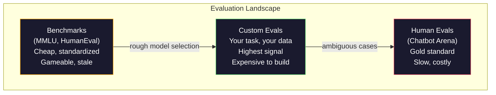
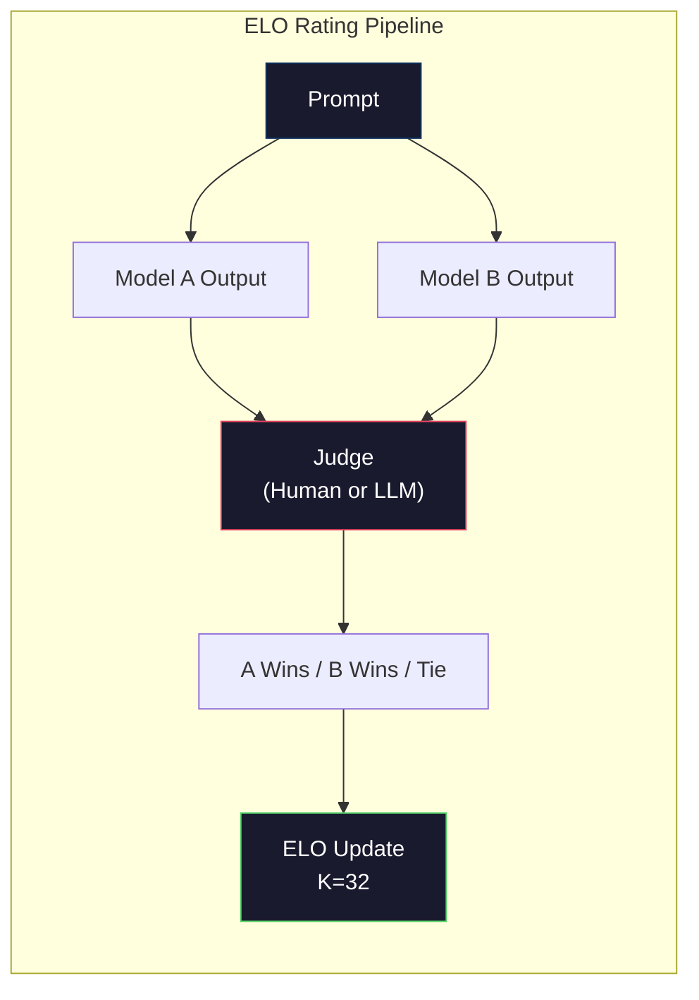

# ارزیابی: معیار، Evals، LM Harness

> قانون گودارت: وقتی یک اندازه گیری تبدیل به یک هدف می شود، آن را متوقف می کند به یک اندازه گیری خوب. هر مرز آزمایشگاه بازی های معیار. امتیاز MMLU افزایش می یابد در حالی که مدل ها هنوز نمی توانند به طور قابل اعتماد تعداد R در "سطرابی". تنها ارزیابی که مهم است ارزیابی شما است - در وظیفه شما، با داده های شما.

**Type:** Build
**Languages:** Python
**Prerequisites:** Phase 10, Lessons 01-05 (LLMs from Scratch)
**Time:** ~90 minutes

## اهداف یادگیری

- یک آستانه ارزیابی سفارشی بسازید که با یک مدل زبان، معیار های چند انتخاب و باز را اجرا کند
- توضیح دهید که چرا معیار های استاندارد (MMLU، HumanEval) پر شده و نمایانگرهای مرزی را تشخیص نمی دهند.
- ارزیابی های خاص وظیفه را با معیارهای مناسب اجرا کنید: مطابقت دقیق، F1، BLEU و امتیاز LLM به عنوان قاضی
- یک مجموعه ارزیابی سفارشی طراحی کنید که به صورت استفاده خاص شما هدف قرار داده شود و نه تنها بر روی لیست های عمومی تکیه کند

## مشکل

در سال 2020 ، MMLU با 15908 سوال در 57 موضوع منتشر شد. در طی سه سال ، مدل های مرزی آن را پر کردند. GPT-4 86.4٪ امتیاز داشت. کلاود 3 Opus 86.8٪ امتیاز داشت. Llama 3 405B 88.6٪ امتیاز داشت. جدول رتبه بندی به یک محدوده 3 نقطه فشرده شد که تفاوت ها در آن ها صدای آماری است ، نه شکاف های واقعی توانایی.

در همین حال، این مدل ها در انجام کارهایی که یک کودک ده ساله بدون فکر انجام می دهد، شکست می خورند. کلاود 3.5 سونت، با نمره 88.7 درصد در MMLU، در ابتدا نمی توانست حرف های "سطراوبی" را بشمارد -- یک کار که نیاز به دانش جهانی صفر و استدلال صفر دارد، فقط تکرار سطح شخصیت. HumanEval با 164 مشکل تولید کد رو آزمایش می کنه مدل ها 90 درصد و بالاتر از آن را در حالی که هنوز تولید کد که سقوط در کنار موارد هر توسعه دهنده جوان می تواند گرفتن.

شکاف بین عملکرد معیار و قابلیت اطمینان در دنیای واقعی، مشکل اصلی ارزیابی LLM است. شاخص های معیار به شما می گویند که یک مدل در مورد معیار عملکرد چگونه است. آنها تقریباً چیزی درباره اینکه چگونه این مدل در کار خاص شما، با داده های خاص شما، در حالت های شکست خاص شما، انجام می دهد، به شما نمی گویند. اگر شما یک ربات پشتیبانی مشتری را ایجاد می کنید، MMLU بی ربط است. اگر شما یک دستیار کد را ایجاد می کنید، HumanEval فقط تولید سطح عملکرد را پوشش می دهد -- چیزی در مورد دیبگ کردن، بازنویسی یا توضیح کد در میان فایل ها نمی گوید.

شما به ارزیابی های سفارشی نیاز دارید. نه به این دلیل که معیارها بی فایده هستند - برای انتخاب مدل های خشن مفید هستند - بلکه به این دلیل که ارزیابی نهایی باید دقیقاً با شرایط انتشار شما مطابقت داشته باشد.

## مفهوم

### منظره ایوال

سه دسته از ارزیابی وجود دارد، هر کدام با هزینه و کیفیت سیگنال متفاوت است.

**Benchmarks**این مجموعه های تست استاندارد هستند. MMLU، HumanEval، SWE-bench، MATH، ARC، HellaSwag. شما یک مدل را با معیار مقایسه کنید و نمره بگیرید. مزیت: همه از همان آزمون استفاده می کنند، بنابراین می توانید مدل ها را مقایسه کنید. معایب: مدل ها و داده های آموزش به طور فزاینده ای این معیار را آلوده می کنند. آزمایشگاه ها بر روی داده هایی که شامل سوالات معیار هستند آموزش می دهند. نمره ها افزایش می یابد. توانایی ممکن است نباشد.

**Custom evals**این مجموعه تست هایی است که برای مورد استفاده خاص خود ایجاد می کنید. شما ورودی ها، خروجی های انتظار می رود و عملکرد امتیاز را تعریف می کنید. خلاصه کننده سند قانونی بر روی اسناد قانونی ارزیابی می شود. ژنراتور SQL بر روی طرح پایگاه داده شما ارزیابی می شود. این موارد برای ایجاد گران هستند اما تنها ارزیابی ای هستند که عملکرد تولید را پیش بینی می کند.

**Human evals**استفاده از نوتاژرهای پرداخت شده برای قضاوت از نتایج مدل بر اساس معیارهای مانند مفید بودن، درستگی، روانی و ایمنی. استاندارد طلا برای وظایف باز که نمره خودکار شکست می خورد. چت بات آرنا بیش از 2 میلیون رای ترجیح انسانی را در بیش از 100 مدل جمع آوری کرده است.$0.10-$هر دو ساعت در هر حکم) و سرعت (ساعت تا روز)



### چرا معیارها شکسته می شوند

سه مکانیسم باعث می شود نمرات معیار نشان دهنده توانایی واقعی را متوقف کند.

**Data contamination.**شرکت های آموزشی اینترنت را کوری می کنند. سوالات معیار آنلاین زنده است. مدل ها پاسخ را در طول آموزش می بینند. این در معنای سنتی فریب نیست - آزمایشگاه ها عمداً داده های معیار را شامل نمی کنند. اما کوری در مقیاس وب تقریباً غیرممکن است که حذف شود.

**Teaching to the test.**آزمایشگاه ها ترکیبی از آموزش را برای عملکرد معیار بهینه می کنند. اگر 5٪ از ترکیب آموزش گزینه های چندگانه به سبک MMLU باشد، مدل فرمت و توزیع پاسخ را یاد می گیرد. MMLU گزینه های چندگانه چهارگانه است. مدل ها می آموزند که توزیع پاسخ تقریباً یکسانی در سراسر A / B / C / D است، که حتی زمانی که مدل پاسخ را نمی داند، کمک می کند.

**Saturation.**وقتی هر مدل مرزی 85 تا 90 درصد در یک معیار معیار را کسب می کند، معیار معیار تبعیض را متوقف می کند. 10 تا 15 درصد سوال های باقی مانده ممکن است مبهم، نامگذاری اشتباه یا نیاز به دانش دامنه نامطمئن باشد. بهبود از 87 تا 89 درصد در MMLU ممکن است به این معنی باشد که مدل دو سوال نامطمئن دیگر را به یاد آورد، نه اینکه باهوش تر شد.

### گیج کننده: بررسی سریع سلامت

پیچیدگی اندازه گیری می کند که یک مدل با یک سری از توکن ها چقدر شگفت زده است. به طور رسمی، این احتمال منفی منفی متوسط است:

```
PPL = exp(-1/N * sum(log P(token_i | context)))
```

یک پیچیدگی 10 به این معنی است که مدل به طور متوسط، به عنوان نامشخص به طور یکسان در میان 10 گزینه در هر موقعیت توکن انتخاب می شود. پایین تر بهتر است. GPT-2 به یک پیچیدگی ~30 در ویکی متک 103 می رسد. GPT-3 به ~20 می رسد. Llama 3 8B به ~7 می رسد.

در این مورد، یک مدل می تواند با پیش بینی الگوهای رایج و در حالی که در الگوهای نادر اما مهم وحشتناک است، کم پیچیدگی داشته باشد. همچنین هیچ چیز در مورد پیروی از دستورالعمل، استدلال یا دقت واقعیت نمی گوید. از آن به عنوان یک بررسی عقلانی استفاده کنید، نه یک حکم نهایی.

### مدرک لیسانس به عنوان قاضی

با استفاده از یک مدل قوی برای ارزیابی عملکرد یک مدل ضعیف تر ایده ساده است: از GPT-4o یا کلود سونت بخواهید تا پاسخ را در مقیاس 1-5 برای دقت، مفید بودن و ایمنی ارزیابی کنند. این هزینه حدود 0.01 دلار در هر قضاوت با GPT-4o-مینی است و به طرز شگفت انگیزی با قضاوت های انسانی ارتباط دارد - حدود 80٪ موافقت در اکثر وظایف.

یک پیامک نامطمئن ("این پاسخ را شرح دهید") نمره های سر و صدا را تولید می کند. یک پیامک منظم با یک عنوان ("نمره 5 اگر پاسخ به طور فکری درست است و یک منبع را ذکر می کند، 4 اگر درست است اما منبع نیست، 3 اگر تا حدودی درست است ... ") نمره های سازگار و قابل تکرار را تولید می کند.

حالت شکست: مدل های قاضی تعصب موقعیت را نشان می دهند (به نسبت به اولین پاسخ در مقایسه های جفتی ترجیح می دهند) ، تعصب کلامی (به نسبت به پاسخ های طولانی تر ترجیح می دهند) و خود ترجیح (GPT-4 نرخ GPT-4 از تولیدات کلاود معادل بالاتر است). کاهش: ترتیب تصادفی، عادی سازی برای طول، استفاده از قاضی متفاوت از مدل مورد ارزیابی است.

### امتیازات ELO از مقایسه های زوج

روش Chatbot Arena. دو پاسخ به یک درخواست از مدل های مختلف را نشان دهید. یک انسان (یا قاضی LLM) بهترین را انتخاب می کند. از هزاران این مقایسه، رتبه ELO را برای هر مدل محاسبه کنید - همان سیستم مورد استفاده در شطرنج.

مزایای ELO: رتبه بندی نسبی قابل اعتماد تر از امتیاز مطلق است، با روابط با زیبایی برخورد می کند و با مقایسه های کمتری نسبت به امتیاز هر محصول مستقل به هم می پیوندد. از اوایل سال 2026، رتبه های Chatbot Arena نشان می دهد GPT-4o، Claude 3.5 Sonnet و Gemini 1.5 Pro در 20 امتیاز ELO از یکدیگر در بالای صفحه هستند.



### چارچوب های برابر

**lm-evaluation-harness**(EleutherAI): چارچوب ارزیابی استاندارد منبع باز. از 200+ معیار پشتیبانی می کند. هر مدل Hugging Face را با یک فرمان علیه MMLU، HellaSwag، ARC و غیره اجرا کنید. توسط Open LLM Leaderboard استفاده می شود.

**RAGAS**: چارچوب ارزیابی به ویژه برای خطوط لوله RAG. اندازه گیری وفاداری (آیا پاسخ با زمینه بازیافت شده مطابقت دارد؟) ، ارتباط (آیا زمینه بازیافت شده با سوال مرتبط است؟) و جواب درست.

**promptfoo**: ارزیابی مبتنی بر پیکربندی برای مهندسی سریع. موارد تست را در YAML تعریف کنید، با مدل های متعدد اجرا کنید، گزارش عبور / شکست را دریافت کنید. برای درخواست های تست بازپسین مفید است - اطمینان حاصل کنید که یک تغییر سریع موارد تست موجود را شکسته نمی کند.

### ساخت مساوات سفارشی

تنها ارزیابی که برای تولید مهمه

1. **Define the task.**"پاسخ به سوالات" خیلی مبهم است. "به دلیل ایمیل شکایت مشتری، نام محصول، دسته بندی مسئله و احساسات را استخراج کنید" یک کار است که می توانید ارزیابی کنید.

2. **Create test cases.**حداقل 50 برای یک نمونه اولیه eval، 200+ برای تولید. هر مورد آزمایش یک جفت (داخل، انتظار می رود_خروجی) است. شامل موارد کناری: ورودی خالی، ورودی مخالف، ورودی مبهم، ورودی در زبان های دیگر.

3. **Define scoring.**تطابق دقیق برای تولیدات ساختاری. BLEU / ROUGE برای شباهت متن. LLM به عنوان قاضی برای کیفیت باز. F1 برای وظایف استخراج. ترکیبی از چندین متریک با وزنه.

4. **Automate.**هر ارزیابی با یک فرمان اجرا می شود. هیچ گام دستی نیست. نتایج را در فرمت ذخیره کنید که امکان مقایسه با زمان را فراهم می کند.

5. **Track over time.**نمره ای از ارزیابی بدون معنی در جداسازی. شما نیاز به خط روند. آیا نمره پس از آخرین تغییر فوری بهبود یافته است؟ آیا پس از تغییر مدل ها عقب نشینی کرد؟ نسخه ارزیابی خود را در کنار پیام های خود را.

| Eval Type | Cost per judgment | Agreement with humans | Best for |
|-----------|------------------|----------------------|----------|
| Exact match | ~$0 | 100% (when applicable) | Structured output, classification |
| BLEU/ROUGE | ~$0 | ~60% | Translation, summarization |
| LLM-as-judge | ~$0.01 | ~80% | Open-ended generation |
| Human eval | $0.10-$2.00 | N/A (is the ground truth) | Ambiguous, high-stakes tasks |

```figure
perplexity-loss
```

## آن را بسازید

### مرحله ی اول: حداقل چارچوب برابر

جزییات اصلی را تعریف کنید. یک مورد ارزیابی دارای ورودی، یک خروجی انتظار می رود و یک متاداتا اختیاری است. یک امتیاز دهنده پیش بینی و مرجع را می گیرد و امتیاز بین 0 و 1 را باز می گرداند.

```python
import json
from collections import Counter

class EvalCase:
    def __init__(self, input_text, expected, metadata=None):
        self.input_text = input_text
        self.expected = expected
        self.metadata = metadata or {}

class EvalSuite:
    def __init__(self, name, cases, scorers):
        self.name = name
        self.cases = cases
        self.scorers = scorers

    def run(self, model_fn):
        results = []
        for case in self.cases:
            prediction = model_fn(case.input_text)
            scores = {}
            for scorer_name, scorer_fn in self.scorers.items():
                scores[scorer_name] = scorer_fn(prediction, case.expected)
            results.append({
                "input": case.input_text,
                "expected": case.expected,
                "prediction": prediction,
                "scores": scores,
            })
        return results
```

### مرحله دوم: سنجش عملکردها

درست درست درست درست درست درست درست درست درست درست درست درست درست درست درست درست درست درست درست درست درست درست درست درست درست درست درست درست درست درست درست درست درست درست درست درست درست درست درست درست درست درست درست درست درست درست درست درست درست درست درست درست درست درست درست درست درست درست درست درست درست درست درست درست درست درست درست درست درست درست درست درست درست درست درست درست درست درست درست درست درست درست درست درست درست درست درست درست درست درست درست درست درست درست درست درست درست درست درست درست درست درست درست درست درست درست درست درست درست درست درست درست درست درست درست درست درست درست درست درست درست درست درست درست درست درست درست درست درست درست درست درست درست درست

```python
def exact_match(prediction, expected):
    return 1.0 if prediction.strip().lower() == expected.strip().lower() else 0.0

def token_f1(prediction, expected):
    pred_tokens = set(prediction.lower().split())
    exp_tokens = set(expected.lower().split())
    if not pred_tokens or not exp_tokens:
        return 0.0
    common = pred_tokens & exp_tokens
    precision = len(common) / len(pred_tokens)
    recall = len(common) / len(exp_tokens)
    if precision + recall == 0:
        return 0.0
    return 2 * (precision * recall) / (precision + recall)

def llm_judge_simulated(prediction, expected):
    pred_words = set(prediction.lower().split())
    exp_words = set(expected.lower().split())
    if not exp_words:
        return 0.0
    overlap = len(pred_words & exp_words) / len(exp_words)
    length_penalty = min(1.0, len(prediction) / max(len(expected), 1))
    return round(overlap * 0.7 + length_penalty * 0.3, 3)
```

### مرحله سوم: سیستم رتبه بندی ELO

مقایسه های جفت با بروزرسانی های ELO را اجرا کنید. این دقیقاً سیستم Chatbot Arena برای رتبه بندی مدل ها استفاده می کند.

```python
class ELOTracker:
    def __init__(self, k=32, initial_rating=1500):
        self.ratings = {}
        self.k = k
        self.initial_rating = initial_rating
        self.history = []

    def _ensure_player(self, name):
        if name not in self.ratings:
            self.ratings[name] = self.initial_rating

    def expected_score(self, rating_a, rating_b):
        return 1 / (1 + 10 ** ((rating_b - rating_a) / 400))

    def record_match(self, player_a, player_b, outcome):
        self._ensure_player(player_a)
        self._ensure_player(player_b)

        ea = self.expected_score(self.ratings[player_a], self.ratings[player_b])
        eb = 1 - ea

        if outcome == "a":
            sa, sb = 1.0, 0.0
        elif outcome == "b":
            sa, sb = 0.0, 1.0
        else:
            sa, sb = 0.5, 0.5

        self.ratings[player_a] += self.k * (sa - ea)
        self.ratings[player_b] += self.k * (sb - eb)

        self.history.append({
            "a": player_a, "b": player_b,
            "outcome": outcome,
            "rating_a": round(self.ratings[player_a], 1),
            "rating_b": round(self.ratings[player_b], 1),
        })

    def leaderboard(self):
        return sorted(self.ratings.items(), key=lambda x: -x[1])
```

### مرحله چهارم: محاسبه پیچیدگی

در واقع این ها را از منطق مدل می گرفتیم. در اینجا ما با توزیع احتمال شبیه سازی می کنیم.

```python
import numpy as np

def perplexity(log_probs):
    if not log_probs:
        return float("inf")
    avg_neg_log_prob = -np.mean(log_probs)
    return float(np.exp(avg_neg_log_prob))

def token_log_probs_simulated(text, model_quality=0.8):
    np.random.seed(hash(text) % 2**31)
    tokens = text.split()
    log_probs = []
    for i, token in enumerate(tokens):
        base_prob = model_quality
        if len(token) > 8:
            base_prob *= 0.6
        if i == 0:
            base_prob *= 0.7
        prob = np.clip(base_prob + np.random.normal(0, 0.1), 0.01, 0.99)
        log_probs.append(float(np.log(prob)))
    return log_probs
```

### مرحله پنجم: نتایج جمع آوری شده

آمار خلاصه ای را در یک دوره ارزیابی محاسبه کنید: متوسط، میانگین، نرخ عبور در یک حد و تجزیه های هر متریک.

```python
def summarize_results(results, threshold=0.8):
    all_scores = {}
    for r in results:
        for metric, score in r["scores"].items():
            all_scores.setdefault(metric, []).append(score)

    summary = {}
    for metric, scores in all_scores.items():
        arr = np.array(scores)
        summary[metric] = {
            "mean": round(float(np.mean(arr)), 3),
            "median": round(float(np.median(arr)), 3),
            "std": round(float(np.std(arr)), 3),
            "min": round(float(np.min(arr)), 3),
            "max": round(float(np.max(arr)), 3),
            "pass_rate": round(float(np.mean(arr >= threshold)), 3),
            "n": len(scores),
        }
    return summary

def print_summary(summary, suite_name="Eval"):
    print(f"\n{'=' * 60}")
    print(f"  {suite_name} Summary")
    print(f"{'=' * 60}")
    for metric, stats in summary.items():
        print(f"\n  {metric}:")
        print(f"    Mean:      {stats['mean']:.3f}")
        print(f"    Median:    {stats['median']:.3f}")
        print(f"    Std:       {stats['std']:.3f}")
        print(f"    Range:     [{stats['min']:.3f}, {stats['max']:.3f}]")
        print(f"    Pass rate: {stats['pass_rate']:.1%} (threshold >= 0.8)")
        print(f"    N:         {stats['n']}")
```

### مرحله ۶: کامل خط لوله را اجرا کنید

همه چیز را به هم متصل کنید. یک کار را تعریف کنید، موارد آزمایشی ایجاد کنید، دو مدل را شبیه سازی کنید، ارزیابی ها را اجرا کنید، ELO را از مقایسه های جفتی محاسبه کنید و جدول رتبه را چاپ کنید.

```python
def demo_model_good(prompt):
    responses = {
        "What is the capital of France?": "Paris",
        "What is 2 + 2?": "4",
        "Who wrote Hamlet?": "William Shakespeare",
        "What language is PyTorch written in?": "Python and C++",
        "What is the boiling point of water?": "100 degrees Celsius",
    }
    return responses.get(prompt, "I don't know")

def demo_model_bad(prompt):
    responses = {
        "What is the capital of France?": "Paris is the capital city of France",
        "What is 2 + 2?": "The answer is four",
        "Who wrote Hamlet?": "Shakespeare",
        "What language is PyTorch written in?": "Python",
        "What is the boiling point of water?": "212 Fahrenheit",
    }
    return responses.get(prompt, "Unknown")

cases = [
    EvalCase("What is the capital of France?", "Paris"),
    EvalCase("What is 2 + 2?", "4"),
    EvalCase("Who wrote Hamlet?", "William Shakespeare"),
    EvalCase("What language is PyTorch written in?", "Python and C++"),
    EvalCase("What is the boiling point of water?", "100 degrees Celsius"),
]

suite = EvalSuite(
    name="General Knowledge",
    cases=cases,
    scorers={
        "exact_match": exact_match,
        "token_f1": token_f1,
        "llm_judge": llm_judge_simulated,
    },
)

results_good = suite.run(demo_model_good)
results_bad = suite.run(demo_model_bad)

print_summary(summarize_results(results_good), "Model A (concise)")
print_summary(summarize_results(results_bad), "Model B (verbose)")
```

مدل "خوب" پاسخ های دقیق را می دهد. مدل "بد" پارافرز های کلامی را می دهد. مطابقت دقیق مدل کلامی را به شدت مجازات می کند. توکن F1 و LLM به عنوان قاضی بیشتر می بخشند. این نشان می دهد که چرا انتخاب متریک مهم است: همان مدل به نظر می رسد عالی یا وحشتناک است بسته به نحوه امتیاز آن.

### مرحله 7: تورنمنت ELO

مقایسه های جفت بین مدل ها را در چند دور اجرا کنید.

```python
elo = ELOTracker(k=32)

for case in cases:
    pred_a = demo_model_good(case.input_text)
    pred_b = demo_model_bad(case.input_text)

    score_a = token_f1(pred_a, case.expected)
    score_b = token_f1(pred_b, case.expected)

    if score_a > score_b:
        outcome = "a"
    elif score_b > score_a:
        outcome = "b"
    else:
        outcome = "tie"

    elo.record_match("model_a_concise", "model_b_verbose", outcome)

print("\nELO Leaderboard:")
for name, rating in elo.leaderboard():
    print(f"  {name}: {rating:.0f}")
```

### مرحله ۸: مقایسه گیج کننده

پیچیدگی را در "نمادها" سطوح مختلف کیفیت مقایسه کنید.

```python
test_text = "The quick brown fox jumps over the lazy dog in the garden"

for quality, label in [(0.9, "Strong model"), (0.7, "Medium model"), (0.4, "Weak model")]:
    log_probs = token_log_probs_simulated(test_text, model_quality=quality)
    ppl = perplexity(log_probs)
    print(f"  {label} (quality={quality}): perplexity = {ppl:.2f}")
```

## ازش استفاده کن

### استفاده از ابزار ارزیابی (EleutherAI)

ابزار استاندارد برای اجرای معیارها در هر مدل

```python
# pip install lm-eval
# Command line:
# lm_eval --model hf --model_args pretrained=meta-llama/Llama-3.1-8B --tasks mmlu --batch_size 8

# Python API:
# import lm_eval
# results = lm_eval.simple_evaluate(
#     model="hf",
#     model_args="pretrained=meta-llama/Llama-3.1-8B",
#     tasks=["mmlu", "hellaswag", "arc_easy"],
#     batch_size=8,
# )
# print(results["results"])
```

### فوریfoo

ارزیابی مبتنی بر پیکربندی برای مهندسی سریع. تست ها را در YAML تعریف کنید و با چندین ارائه دهنده اجرا کنید.

```yaml
# promptfoo.yaml
providers:
  - openai:gpt-4o-mini
  - anthropic:claude-3-haiku

prompts:
  - "Answer in one word: {{question}}"

tests:
  - vars:
      question: "What is the capital of France?"
    assert:
      - type: contains
        value: "Paris"
  - vars:
      question: "What is 2 + 2?"
    assert:
      - type: equals
        value: "4"
```

### RAGAS برای ارزیابی RAG

```python
# pip install ragas
# from ragas import evaluate
# from ragas.metrics import faithfulness, answer_relevancy, context_precision
#
# result = evaluate(
#     dataset,
#     metrics=[faithfulness, answer_relevancy, context_precision],
# )
# print(result)
```

RAGAS اندازه گیری می کند که ارزیابی های عمومی چه چیزی را از دست می دهند: آیا پاسخ مدل در زمینه بازیافت شده است، نه فقط اینکه آیا پاسخ "در انتزاع درست" است.

## -باده

این درس به ما کمک می کند`outputs/prompt-eval-designer.md`-- یک پیامک قابل استفاده مجدد که مجموعه های ارزیابی سفارشی را برای هر کار طراحی می کند. یک توصیف کار را به آن بدهید و این موارد آزمایش، عملکرد نمره گذاری و توصیه ی حد عبور / شکست را تولید می کند.

همچنین تولید می کند`outputs/skill-llm-evaluation.md`-- چارچوب تصمیم گیری برای انتخاب استراتژی ارزیابی مناسب بر اساس نوع کار، بودجه و الزامات تاخیر.

## تمرینات

1. یک امتیاز دهنده "تبایستگی" را اضافه کنید که 5 بار واردات مشابه را از طریق مدل اجرا می کند و اندازه گیری می کند که چقدر اغلب تولیدات مطابقت دارند. پاسخ های نامتناسبی در ورودی های تعیین کننده نشان دهنده پیام های شکننده یا تنظیمات دمای بالا است.

2. ردیاب ELO را برای پشتیبانی از چندین عملکرد قاضی (مثل دقیق، F1، LLM- به عنوان قاضی) گسترش دهید و وزن آنها را مقایسه کنید. مقایسه کنید که چگونه جدول رتبه بندی تغییر می کند وقتی وزن دقیق را به شدت با F1 مقایسه می کنید.

3. مجموعه ای از ارزیابی را برای یک کار خاص بسازید: طبقه بندی ایمیل به 5 دسته. 100 مورد آزمایش با نمونه های متنوعی از جمله موارد کناری ایجاد کنید (میل هایی که ممکن است به دسته های متعدد تعلق داشته باشند، ایمیل های خالی، ایمیل های در زبان های دیگر). اندازه گیری عملکرد "مودله" مختلف (مستند به قوانین، تطابق کلمات کلیدی، محاکمه LLM)

4. پیاده سازی تشخیص آلودگی: با توجه به مجموعه ای از سوالات ارزیابی و یک کورپوس آموزش، بررسی کنید که چه درصد از سوالات ارزیابی (یا پارافرز های نزدیک) در داده های آموزش ظاهر می شوند. این روش محققان اعتبار معیار را بررسی می کنند.

5. یک ابزار "مودل تفاوت" بسازید. با توجه به نتایج ارزیابی از دو نسخه مدل، برجسته کنید که کدام موارد آزمایش خاص بهبود یافته، کدام بازنگری کرده و کدام یکسان باقی مانده است. این معادل ارزیابی یک کد تفاوت است - ضروری برای درک اینکه آیا تغییر کمک کرده یا آسیب می رساند.

## اصطلاحات کلیدی

| Term | What people say | What it actually means |
|------|----------------|----------------------|
| MMLU | "The benchmark" | Massive Multitask Language Understanding -- 15,908 multiple choice questions across 57 subjects, saturated above 88% by 2025 |
| HumanEval | "Code eval" | 164 Python function-completion problems from OpenAI, tests only isolated function generation |
| SWE-bench | "Real coding eval" | 2,294 GitHub issues from 12 Python repos, measures end-to-end bug fixing including test generation |
| Perplexity | "How confused the model is" | exp(-avg(log P(token_i given context))) -- lower means the model assigns higher probability to the actual tokens |
| ELO rating | "Chess ranking for models" | A relative skill rating computed from pairwise win/loss records, used by Chatbot Arena to rank 100+ models |
| LLM-as-judge | "Using AI to grade AI" | A strong model scores a weaker model's outputs against a rubric, ~80% agreement with human judges at ~$0.01/judgment |
| Data contamination | "The model saw the test" | Training data includes benchmark questions, inflating scores without improving real capability |
| Eval suite | "A bunch of tests" | A versioned collection of (input, expected_output, scorer) triples that measure a specific capability |
| Pass rate | "What percentage it gets right" | Fraction of eval cases scoring above a threshold -- more actionable than mean score because it measures reliability |
| Chatbot Arena | "Model ranking website" | LMSYS platform with 2M+ human preference votes, producing the most trusted LLM leaderboard via ELO ratings |

## خواندن بیشتر

- [Hendrycks et al., 2021 -- "Measuring Massive Multitask Language Understanding"](https://arxiv.org/abs/2009.03300)-- مقاله MMLU، هنوز هم بیشترین مقادیر مورد استفاده در LLM با وجود پرتو بودن آن
- [Chen et al., 2021 -- "Evaluating Large Language Models Trained on Code"](https://arxiv.org/abs/2107.03374)-- مقاله HumanEval از OpenAI، روش ارزیابی تولید کد را ایجاد کرد
- [Zheng et al., 2023 -- "Judging LLM-as-a-Judge"](https://arxiv.org/abs/2306.05685)-- تجزیه و تحلیل سیستماتیک استفاده از LLM برای ارزیابی LLM، از جمله یافته های تعصب موقعیت و تعصب کلامی
- [Arena (formerly LMSYS Chatbot Arena)](https://arena.ai/leaderboard)-- پلتفرم مقایسه مدل های جمع آوری شده با رای 2 میلیون +، معتبر ترین رتبه بندی LLM در دنیای واقعی
