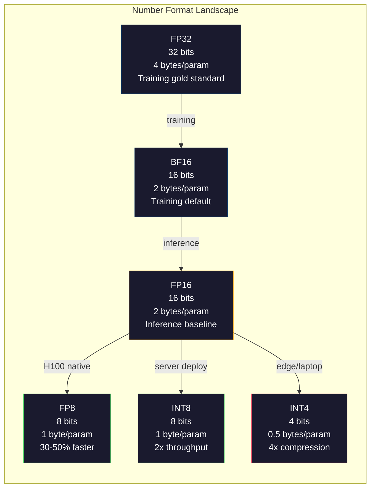
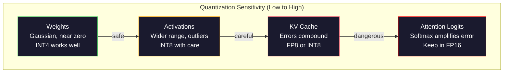
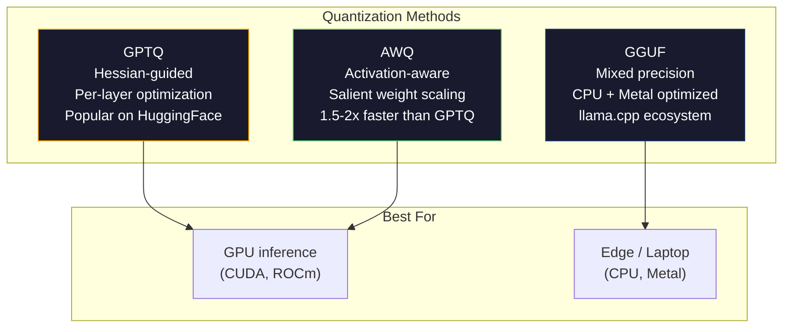

# اندازه گیری: سازگاری مدل ها

> مدل 70B در FP16 به 140GB نیاز دارد. دو A100 فقط برای وزن. مقدار به FP8: یک GPU 80GB. INT4: یک مک بوک.

**Type:** Build
**Languages:** Python (with numpy)
**Prerequisites:** Phase 10, Lessons 01-10 (LLMs from Scratch)
**Time:** ~120 minutes

## اهداف یادگیری

- پیاده سازی کوانتاسیون همتایی و غیر همتایی از FP16 تا INT8 و INT4 از جمله مقیاس بندی در هر تنسر و در هر کانال
- محاسبه ذخیره حافظه از کوانتاسیون و تعیین اینکه کدام دقت متناسب با VRAM GPU داده شده است
- تفاوت بین کوانتاسیون پس از آموزش (PTQ) و آموزش آگاه از کوانتاسیون (QAT) را توضیح دهید
- استفاده از GPTQ یا AWQ برای تعیین مقدار یک مدل واقعی و اندازه گیری تعادل دقت و حافظه بر اساس یک معیار

## مشکل

Llama 3 70B دارای 70 میلیارد پارامتر است. هر پارامتر یک شماره 16 بت شناور است. این 140 میلیارد بایت است. 140 گیگابایت. یک A100 تنها 80 گیگابایت VRAM دارد. شما حتی نمی توانید وزن ها را بارگذاری کنید، چه بسا نتیجه گیری را در یک GPU اجرا کنید. شما به دو A100 با 2 دلار / ساعت هر یک نیاز دارید فقط برای خدمت یک مدل.

اما 16 بیت در هر پارامتر ضایع کننده است. اکثر وزن ها در یک شبکه عصبی نزدیک به صفر است. دامنه پویا FP16 (از 0.000000059 تا 65.504) تقریباً کاملاً غیرفعال است. اگر توزیع واقعی وزن ها را در Llama 3 70B اندازه گیری کنید، 95 درصد از آنها بین -0.1 و +0.1 قرار می گیرند. شما 16 بیت را برای نشان دادن ارزش هایی که می توانند در 4 قرار بگیرند می سوزید.

کوانتزیزاسیون جایگزین اعداد با دقت بالا با اعداد با دقت پایین تر می شود. FP16 تا FP8 حافظه را به نصف کاهش می دهد. FP16 تا INT4 آن را به یک چهارم کاهش می دهد. این مدل 140GB به 35GB می شود. آن را در یک GPU مصرف کننده واحد قرار می دهد. فشار به کوانتزیزاسیون 2 بیت (عدی، زیان آور، اما برای برخی از وظایف قابل استفاده) و همان مدل در یک لپ تاپ 16GB اجرا می شود.

هزینه دقت است. هر قطعه ای که حذف می کنید اطلاعات را نابود می کند. سوال این است که چقدر دقت را از دست می دهید و کجا. یک مدل INT4 به خوبی اندازه گیری شده 95 تا 99٪ از کیفیت اصلی را در اکثر معیار ها حفظ می کند. یک مقدار ساده به INT4 می تواند مدل را کاملاً نابود کند. تفاوت تکنیک است.

کمیونٹی کوانتزاسیون Llama 3 تا INT4 با GPTQ نشان می دهد حدود 1-2 نقطه پیچیدگی از دست رفته در ویکی متک است. Mistral FP8 نقاط چک Mixtral 8x22B را با صفر از دست دادن کیفیت قابل اندازه گیری در MMLU منتشر کرد. قالب GGUF llama.cpp را تقویت می کند و مدل های 70B را در مک بوک های دارای تراشه های M اجرا می کند. کوانتزاسیون یک هک نیست. این مسیر استاندارد برای هر مدل بزرگتر از 7B است.

## مفهوم

### فرمت های اعداد: هر قطعه چه کاری انجام می دهد

هر عدد نقطه شناور سه بخش دارد: علامت، نماد و مانتیسا (که به معنای آن نیز گفته می شود). علامت یک بیت است. نماد تعیین می کند که دامنه (چه مقدار بزرگ یا کوچک عدد می تواند باشد) است. مانتیسا تعیین دقیق (چه تعداد نقاط دهمی را می توانید بدست آورید).

```
FP32:  [1 sign] [8 exponent] [23 mantissa]  = 32 bits
FP16:  [1 sign] [5 exponent] [10 mantissa]  = 16 bits
BF16:  [1 sign] [8 exponent] [7  mantissa]  = 16 bits
FP8:   [1 sign] [4 exponent] [3  mantissa]  = 8  bits (E4M3)
FP8:   [1 sign] [5 exponent] [2  mantissa]  = 8  bits (E5M2)
INT8:  [1 sign] [7 value]                   = 8  bits (uniform steps)
INT4:  [1 sign] [3 value]                   = 4  bits (16 levels total)
```

**FP32**23 بیت مانتیسا به شما حدود 7 عدد دسمال دقت می دهد. محدوده: حدود 1.2 x 10^-38 تا 3.4 x 10^38. آموزش به طور انحصاری در FP32 اتفاق می افتد. هنوز هم برای تجمع (مجموعات در طول ضرب ماتریکس) درست است.

**FP16**این کار برای وزن (که نزدیک به صفر جمع می شود) خوب است اما برای فعال سازی ها و گرادیانتیها خطرناک است که در طول تمرین می تواند افزایش یابد. آموزش FP16 نیاز به مقیاس خسارت برای جلوگیری از جریان پایین دارد.

**BF16**(دماغ شناور 16) نماد 8 بت را از FP32 نگه می دارد اما مانتیسا را به 7 بت کاهش می دهد. با فپ32 هم فرق داره، دقیق تر از فپ16 گوگل آن را به طور خاص برای یادگیری عمیق طراحی کرده است. حس: محدوده مهم تر از دقت برای شبکه های عصبی است. یک گرادینت 10^-20 که در FP16 به صفر جریان می یابد در BF16 زنده می ماند. وزن 0.07342 که به 0.0734 در BF16 دور می شود به اندازه کافی نزدیک است. هر تمرین مدرن از BF16 یا ترکیبی از BF16/FP32 استفاده می کند.

**FP8**E4M3 (4 معترض، 3 mantissa) برای وزن و فعال سازی در طول نتیجه گیری استفاده می شود. E5M2 (5 معترض، 2 mantissa) برای گرادینت ها در طول آموزش استفاده می شود که در آن محدوده بیش از دقت اهمیت دارد. FP8 نتیجه گیری در GPU های H100 به سرعت 30-50% نسبت به FP16 با از دست دادن کیفیت نادیده گرفته می شود.

**INT8**این یک فرمت عدد کامل است. هیچ معترض، هیچ مانتیسا. فقط 256 مقدار با فاصله مساوی از -128 تا 127. شما نیاز به یک فاکتور مقیاس برای نقشه برداری از وزنهای نقطه شناور به این محدوده. مزیت: ریاضیات عدد کامل سریعتر و انرژی بیشتری از نقطه شناور است. ضرب ماتریک INT8 در A100 در 624 TOPS در مقابل 312 TFLOPS برای FP16 اجرا می شود.

**INT4**در این مورد، این روش به طور کامل به اندازه ی اندازه گیری و اندازه گیری وزن بستگی دارد. روش های پیشرفته INT4 (GPTQ، AWQ) ۹۵٪ از کیفیت مدل اصلی را حفظ می کنند.



### چگونه کوانتاسیون کار می کند

عملیات هسته ای ساده است. یک تنسور از ارزش های نقطه شناور را بگیرید، یک فاکتور مقیاس پیدا کنید، ضرب کنید، به نزدیک ترین عدد کامل گرد کنید و اعداد کامل و فاکتور مقیاس را ذخیره کنید.

**Quantize:**
```
scale = max(abs(tensor)) / max_int_value
quantized = round(tensor / scale)
```

**Dequantize:**
```
reconstructed = quantized * scale
```

برای INT8 با محدوده متقابل (-127 تا 127):
```
scale = max(abs(tensor)) / 127
quantized = clamp(round(tensor / scale), -128, 127)
```

خطا خطا گرد کردن است. هر مقدار می تواند حداکثر از `scale / 2`. کل خطای یک لایه بستگی به اینکه چند تا وزن دارید و اینکه مدل چقدر نسبت به اختلال در این وزن ها حساس است.

**Per-tensor vs per-channel quantization.**پر تنسر از یک فاکتور مقیاس برای کل ماتریس وزن استفاده می کند. ساده اما ضایع کننده: اگر یک ستون دارای ارزش های بزرگ و دیگری دارای ارزش های کوچک باشد، ارزش های کوچک بیشتر دقت خود را از دست می دهند. در هر کانال از یک فاکتور مقیاس در هر کانال خروجی (در هر ردیف یا ستون ماتریس وزن) استفاده می شود. هزینه های بیشتر (شما عوامل مقیاس N را به جای 1) ذخیره می کنید اما کیفیت بسیار بهتری دارد. هر روش کوانتاسیون تولید از هر کانال یا گرانولیت دقیق تر استفاده می کند.

**Asymmetric quantization**اضافه کردن یک تعویض صفر نقطه: `quantized = round(tensor / scale) + zero_point`این توزیع را اداره می کند که در صفر متمرکز نیست. به عنوان مثال فعال سازی ReLU همیشه منفی نیست. کوانتاسیون همتایی نیمی از محدوده عدد کامل را در مقادیر منفی که هرگز ظاهر نمی شوند، از بین می برد. کوانتاسیون غیر همتایی محدوده واقعی [min، max] را به محدوده عدد کامل نقشه می زند.

### سلسله مراتب حساسیت

همه چیز در یک مدل به طور یکسان به اندازه کافی به اندازه کافی قابل تحمل نیست.

**Weights (most robust).**وزن مدل در طول تمرین به آرامی تغییر می کند و به طور تقریباً توزیع گاسسی که در نزدیکی صفر متمرکز است را دنبال می کند. آنها به خوبی کوانتزی می کنند. وزن INT8 با مقیاس هر کانال نتایج تقریبا بی ضرر را به دست می آورد. INT4 نیازمند روش های پیچیده تری است اما کار می کند.

**Activations (moderate sensitivity).**فعال سازی ها ارزش های میانگین هستند که در طول نتیجه گیری از طریق شبکه جریان می یابد. آنها محدوده دینامیکی گسترده تر از وزن دارند و دارای معادلات هستند. یک سر توجه تنها ممکن است مقدار فعال سازی 100 برابر بزرگتر از متوسط را تولید کند. این نرخ های خارق العاده برای کیفیت مدل بسیار مهم هستند. به شکل ساده ای، مقدارشان را اندازه گیری می کنیم و اطلاعات را نابود می کنیم. راه حل ها: کانال های غیر عادی را با دقت بالاتر نگه دارید (LLM.int8() ، از مقیاس های فعال سازی در هر توکن یا در هر کانال استفاده کنید.

**KV cache (high sensitivity).**حافظه حافظه کلید ارزش توجه را برای تمام توکن های قبلی ذخیره می کند. در طول طول های طولانی زمینه، حافظه KV بر حافظه تسلط دارد. برای مدل 70B در زمینه 32K، حافظه حافظه KV تنها 40GB در FP16 است. به اندازه گیری حافظه KV به FP8 یا INT8 حافظه زیادی را ذخیره می کند اما هرگونه ترکیب خطا در تمام محاسبات توجه آینده. تاثیر کیفیت با طول دنباله مقیاس می شود.

**Attention logits (most sensitive).**نرمترین در توجه به تغییرات کوچک در ورودی های خود بسیار حساس است. یک خطای کوانتاسیون 0.01 در یک منطق قبل از نرمترین می تواند توزیع توجه را به طور معنی ای تغییر دهد. اکثر طرح های کوانتاسیون محاسبه توجه را با دقت بالاتر (FP16 یا BF16) نگه می دارند حتی زمانی که همه چیز دیگر کوانتاسیون شده است.



### PTQ در مقابل QAT

**Post-Training Quantization (PTQ)**در این مدل، PTQ ساده اغلب به شدت شکست می خورد زیرا اشتباهات گردآوری جمع می شوند. روش های پیشرفته PTQ (GPTQ، AWQ) از داده های کالیبریشن برای حداقل رساندن اشتباهات کوانتزیشن استفاده می کنند.

**Quantization-Aware Training (QAT)**عملیات کوانتزیزاسیون جعلی را در گذرگاه پیش در طول آموزش وارد می کند. مدل یاد می گیرد که وزن های خود را در جایی قرار دهد که اشتباهات گرد کردن کوچک باشد. گرادینت ها با استفاده از تخمین دهنده مستقیم (STE) از طریق کوانتاییزاسیون جعلی جریان می دهند: فرض کنید عملیات گرد کردن دارای گرادینت 1 است. QAT مدل های INT4 و INT2 را بهتر از PTQ تولید می کند اما نیاز به یک دوره آموزشی کامل دارد. گوگل از QAT برای ارائه خدمات موثر دوقلوها استفاده کرد. متا براي چند هدف تعيين للاما از QAT استفاده کرد

| Aspect | PTQ | QAT |
|--------|-----|-----|
| Cost | Minutes to hours | Full training run |
| Quality at INT8 | Excellent (< 0.1% loss) | Excellent |
| Quality at INT4 | Good with GPTQ/AWQ (1-3% loss) | Better (< 1% loss) |
| Quality at INT2 | Poor | Usable for some tasks |
| Calibration data | 128-1024 examples | Full training dataset |
| When to use | Deployment, iteration | Maximum quality at low bit-width |

### GPTQ، AWQ، GGUF

**GPTQ (GPT Quantization)**روش PTQ یکبار است. این مقدار وزن یک لایه در یک زمان را اندازه گیری می کند، با استفاده از یک مجموعه داده های کالیبریشن کوچک (128 مثال معمولی است) برای اندازه گیری Hessian (معلومات دومین ترتیب در مورد اینکه محصول چقدر نسبت به هر وزن حساس است). وزن هایی که هسیان می گوید مهم هستند با دقت بیشتری اندازه گیری می شوند. GPTQ اولین روش برای عملی کردن کوانتاسیون INT4 برای LLM بود. TheBlooke on Hugging Face GPTQ را با انتشار نسخه های کوانتزی صدها مدل محبوب کرد.

**AWQ (Activation-Aware Weight Quantization)**توجه می کند که یک بخش کوچک از وزنه ها (حدود 1%) به دلیل ضرب شدن با ارزش های بزرگ فعال سازی، نامتناسبی مهم هستند. AWQ این وزنهای برجسته را با استفاده از داده های کالیبریشن شناسایی و قبل از کوانتاسیون آنها را مقیاس می دهد (پس فعال سازی های مربوطه را کاهش می دهد). این وزن های مهم را در محدوده ای نگه می دارد که مقدار گذاری INT4 دقیق باشد. AWQ معمولا با کیفیت GPTQ مطابقت دارد یا کمی از آن بالاتر است در حالی که برای استفاده 1.5-2 برابر سریع تر است.

**GGUF (GPT-Generated Unified Format)**فرمت فایل مورد استفاده توسط llama.cpp و اکوسیستم آن است. این از کوانتاسیون مخلوط پشتیبانی می کند: لایه های مختلف عرض بیت های مختلف دارند. لایه های اول و آخر (سر داخل و سر خارج) معمولاً با دقت بالاتر نگهداری می شوند. لایه های متوسط INT4 یا INT3 را دریافت می کنند. فایل های GGUF مستقل هستند: وزن، توکن، متادتا همه در یک فایل. این فرمت برای نتیجه گیری CPU و Apple Silicon طراحی شده است، جایی که بارگذاری کل مدل به حافظه و اجرای ضربات ماتریس در CPU یا Metal GPU مسیر استاندارد است. Q4_K_M محبوب ترین نوع کوانتاسیون GGUF است که کیفیت و اندازه را متعادل می کند.



### اندازه گیری کیفیت

از کجا مي دونيد که مدل کوانتيزت هنوز خوبه؟

**Perplexity.**متریک رایج ترین. پایین تر بهتر است. پیچیدگی محاسبه در یک مجموعه داده های نگهداری شده (ویکیتیکس 2 استاندارد است) برای هر دو مدل اصلی و کوانتزیزه شده. دلتا به شما می گوید که مقدار اطلاعات کوانتزیزاسیون نابود شده است. قواعد انگشت: دلتا < 0.5 عالی است، 0.5-1.0 خوب است، 1.0-2.0 برای اکثر وظایف قابل قبول است، > 2.0 به این معنی است که چیزی اشتباه شده است.

**Task-specific benchmarks.**مدل کوانتزی شده را در MMLU، HumanEval، GSM8K یا مجموعه ارزیابی سفارشی خود اجرا کنید. با اصلی مقایسه کنید. کوانتزیزاسیون بر توانایی های مختلف به طور نامساوی تأثیر می گذارد. وظایف ریاضی و کد نسبت به دانش عمومی نسبت به از دست دادن دقت حساس تر هستند.

**Output comparison.**در این زمینه، پاسخ های هر دو مدل را بر اساس همان پیام ها تولید کنید و مقایسه کنید. LLM به عنوان قاضی (درسی 10) در اینجا خوب کار می کند. نرخ پیروزی را محاسبه کنید: مدل کوانتزیز شده با چه کسری از پیام ها مطابقت دارد یا از اصلی بر می آید؟

**Latency and throughput.**کوانتزیزاسیون برای ساخت مدل ها سریعتر و ارزان تر وجود دارد. توکن ها را در ثانیه اندازه گیری کنید، زمان برای اولین توکن و استفاده از حافظه. یک مدل کوانتزی که کند تر از اصلی است بدتر از بی فایده است.

| Model | Format | Size | Perplexity (WikiText-2) | MMLU | Tokens/sec (A100) |
|-------|--------|------|------------------------|------|-------------------|
| Llama 3 70B | FP16 | 140GB | 3.12 | 79.5% | 38 |
| Llama 3 70B | FP8 | 70GB | 3.14 | 79.3% | 55 |
| Llama 3 70B | GPTQ INT4 | 35GB | 4.32 | 77.8% | 72 |
| Llama 3 70B | AWQ INT4 | 35GB | 4.18 | 78.1% | 75 |
| Llama 3 70B | GGUF Q4_K_M | 40GB | 4.25 | 77.9% | 28 (CPU) |

الگوی: FP8 تقریبا رایگان است. INT4 هزینه 1-2 امتیاز MMLU اما دو برابر تولید و حافظه را به ربع می رساند. معامله تقریبا برای هر انتشار ارزش دارد.

### اعداد واقعی

FP16 تا FP8 در H100: 30-50% سرعت گیری نتیجه گیری، < 0.1% از دست دادن کیفیت. این مقدار بندی بدون مغز است. هر انتشار H100 باید از آن استفاده کند.

FP16 به INT8 (LLM.int8()): 2x کاهش حافظه، < 0.5% از دست دادن کیفیت. رویکرد دقیق مخلوط ویژگی های خارق العاده را در FP16 حفظ می کند در حالی که همه چیز دیگر را به INT8 مقادیر می کند.

FP16 تا INT4 (GPTQ / AWQ): کاهش حافظه 4x، از دست دادن کیفیت 1-3% بسته به مدل و روش. امکان پذیر است مدل های 70B در یک GPU 48GB واحد.

FP16 تا INT4 (GGUF Q4_K_M): کاهش حافظه 3.5x، 1-2% از دست دادن کیفیت. بهینه سازی برای نتیجه گیری CPU. یک مدل 70B در Q4_K_M حدود 40GB است و در M3 Max با 64GB با 10-15 توکن / ثانیه اجرا می شود.

FP16 تا INT2: 8x کاهش حافظه، 5-15% از دست دادن کیفیت. فقط برای وظایف محدودی باریک که می توانید تخریب را تحمل کنید قابل اجرا است. مرز تحقیقات، آماده تولید برای استفاده عمومی نیست.

```figure
quantization
```

## آن را بسازید

### مرحله اول: نمایشگرهای شکل شماره

نمایش سطح بیت هر فرمت را بسازید تا دقیقا ببینید چه علامت، نماد و مانتیسا انجام می دهند.

```python
import numpy as np


def float_to_fp32_bits(value):
    bits = np.float32(value).view(np.uint32)
    sign = (bits >> 31) & 1
    exponent = (bits >> 23) & 0xFF
    mantissa = bits & 0x7FFFFF
    return {"sign": int(sign), "exponent": int(exponent), "mantissa": int(mantissa),
            "exponent_bits": format(int(exponent), '08b'),
            "mantissa_bits": format(int(mantissa), '023b'),
            "value": float(value),
            "actual_exponent": int(exponent) - 127}


def float_to_fp16_bits(value):
    fp16 = np.float16(value)
    bits = fp16.view(np.uint16)
    sign = (bits >> 15) & 1
    exponent = (bits >> 10) & 0x1F
    mantissa = bits & 0x3FF
    return {"sign": int(sign), "exponent": int(exponent), "mantissa": int(mantissa),
            "exponent_bits": format(int(exponent), '05b'),
            "mantissa_bits": format(int(mantissa), '010b'),
            "value": float(fp16),
            "actual_exponent": int(exponent) - 15}


def float_to_bf16_bits(value):
    fp32_bits = np.float32(value).view(np.uint32)
    bf16_bits = (fp32_bits >> 16).astype(np.uint16)
    sign = (bf16_bits >> 15) & 1
    exponent = (bf16_bits >> 7) & 0xFF
    mantissa = bf16_bits & 0x7F
    reconstructed = np.uint32(bf16_bits.astype(np.uint32) << 16).view(np.float32)
    return {"sign": int(sign), "exponent": int(exponent), "mantissa": int(mantissa),
            "exponent_bits": format(int(exponent), '08b'),
            "mantissa_bits": format(int(mantissa), '07b'),
            "value": float(reconstructed),
            "actual_exponent": int(exponent) - 127}


def simulate_fp8_e4m3(value):
    sign = 1 if value < 0 else 0
    abs_val = abs(value)
    max_val = 448.0
    abs_val = min(abs_val, max_val)
    if abs_val == 0:
        return {"sign": sign, "exponent": 0, "mantissa": 0, "value": 0.0,
                "exponent_bits": "0000", "mantissa_bits": "000"}
    exp = int(np.floor(np.log2(abs_val)))
    exp = max(-6, min(8, exp))
    mantissa_val = abs_val / (2.0 ** exp) - 1.0
    mantissa_quant = round(mantissa_val * 8) / 8
    mantissa_quant = max(0, min(0.875, mantissa_quant))
    reconstructed = (1.0 + mantissa_quant) * (2.0 ** exp)
    if sign:
        reconstructed = -reconstructed
    mantissa_int = int(round(mantissa_quant * 8))
    return {"sign": sign, "exponent": exp + 7, "mantissa": mantissa_int,
            "exponent_bits": format(exp + 7, '04b'),
            "mantissa_bits": format(mantissa_int, '03b'),
            "value": float(reconstructed),
            "actual_exponent": exp}


def display_format_comparison(value):
    fp32 = float_to_fp32_bits(value)
    fp16 = float_to_fp16_bits(value)
    bf16 = float_to_bf16_bits(value)
    fp8 = simulate_fp8_e4m3(value)

    print(f"\n  Value: {value}")
    print(f"  {'Format':<8} {'Stored Value':>14} {'Error':>12} {'Sign':>5} {'Exp Bits':>10} {'Man Bits':>25}")
    print(f"  {'-'*76}")
    print(f"  {'FP32':<8} {fp32['value']:>14.6f} {abs(fp32['value'] - value):>12.8f} {fp32['sign']:>5} {fp32['exponent_bits']:>10} {fp32['mantissa_bits']:>25}")
    print(f"  {'FP16':<8} {fp16['value']:>14.6f} {abs(fp16['value'] - value):>12.8f} {fp16['sign']:>5} {fp16['exponent_bits']:>10} {fp16['mantissa_bits']:>25}")
    print(f"  {'BF16':<8} {bf16['value']:>14.6f} {abs(bf16['value'] - value):>12.8f} {bf16['sign']:>5} {bf16['exponent_bits']:>10} {bf16['mantissa_bits']:>25}")
    print(f"  {'FP8e4m3':<8} {fp8['value']:>14.6f} {abs(fp8['value'] - value):>12.8f} {fp8['sign']:>5} {fp8['exponent_bits']:>10} {fp8['mantissa_bits']:>25}")
```

### مرحله دوم: کوانتزیزاسیون همتایی (به هر تنسور و به هر کانال)

عملیات کوانتيزيشن اساسی. پر تنسر از يک مقیاس براي کل ماتريس استفاده مي کند. پر کانال از يک مقیاس در هر ردیف يا ستون استفاده مي کند.

```python
def quantize_symmetric(tensor, num_bits=8):
    qmin = -(2 ** (num_bits - 1))
    qmax = 2 ** (num_bits - 1) - 1
    abs_max = np.max(np.abs(tensor))
    if abs_max == 0:
        return np.zeros_like(tensor, dtype=np.int32), 1.0
    scale = abs_max / qmax
    quantized = np.clip(np.round(tensor / scale), qmin, qmax).astype(np.int32)
    return quantized, float(scale)


def dequantize_symmetric(quantized, scale):
    return quantized.astype(np.float64) * scale


def quantize_per_channel(tensor, num_bits=8, axis=0):
    qmin = -(2 ** (num_bits - 1))
    qmax = 2 ** (num_bits - 1) - 1

    if axis == 0:
        abs_max = np.max(np.abs(tensor), axis=1, keepdims=True)
    else:
        abs_max = np.max(np.abs(tensor), axis=0, keepdims=True)

    abs_max = np.where(abs_max == 0, 1.0, abs_max)
    scales = abs_max / qmax
    quantized = np.clip(np.round(tensor / scales), qmin, qmax).astype(np.int32)
    return quantized, scales.squeeze()


def dequantize_per_channel(quantized, scales, axis=0):
    if axis == 0:
        return quantized.astype(np.float64) * scales.reshape(-1, 1)
    else:
        return quantized.astype(np.float64) * scales.reshape(1, -1)


def quantize_asymmetric(tensor, num_bits=8):
    qmin = 0
    qmax = 2 ** num_bits - 1
    t_min = np.min(tensor)
    t_max = np.max(tensor)
    if t_max == t_min:
        return np.zeros_like(tensor, dtype=np.int32), 1.0, 0
    scale = (t_max - t_min) / (qmax - qmin)
    zero_point = int(np.round(qmin - t_min / scale))
    zero_point = max(qmin, min(qmax, zero_point))
    quantized = np.clip(np.round(tensor / scale + zero_point), qmin, qmax).astype(np.int32)
    return quantized, float(scale), int(zero_point)


def dequantize_asymmetric(quantized, scale, zero_point):
    return (quantized.astype(np.float64) - zero_point) * scale
```

### مرحله سوم: اندازه گیری کیفیت

اندازه گیری مقدار اطلاعات که کوانتيزيشن نابود می کند. اشتباه مربع، نسبت سیگنال به صدا و شباهت کوسین بین تنسورهای اصلی و بازسازی شده.

```python
def quantization_error(original, reconstructed):
    diff = original - reconstructed
    mse = float(np.mean(diff ** 2))
    rmse = float(np.sqrt(mse))
    max_error = float(np.max(np.abs(diff)))
    signal_power = float(np.mean(original ** 2))
    snr_db = 10 * np.log10(signal_power / max(mse, 1e-20))

    orig_flat = original.flatten()
    recon_flat = reconstructed.flatten()
    norm_orig = np.linalg.norm(orig_flat)
    norm_recon = np.linalg.norm(recon_flat)
    if norm_orig == 0 or norm_recon == 0:
        cosine_sim = 0.0
    else:
        cosine_sim = float(np.dot(orig_flat, recon_flat) / (norm_orig * norm_recon))

    return {"mse": mse, "rmse": rmse, "max_error": max_error,
            "snr_db": float(snr_db), "cosine_similarity": cosine_sim}


def compare_quantization_methods(tensor, num_bits=8):
    q_pt, s_pt = quantize_symmetric(tensor, num_bits)
    recon_pt = dequantize_symmetric(q_pt, s_pt)
    err_pt = quantization_error(tensor, recon_pt)

    q_pc, s_pc = quantize_per_channel(tensor, num_bits, axis=0)
    recon_pc = dequantize_per_channel(q_pc, s_pc, axis=0)
    err_pc = quantization_error(tensor, recon_pc)

    q_asym, s_asym, zp = quantize_asymmetric(tensor, num_bits)
    recon_asym = dequantize_asymmetric(q_asym, s_asym, zp)
    err_asym = quantization_error(tensor, recon_asym)

    print(f"\n  Quantization Comparison ({num_bits}-bit, tensor shape {tensor.shape}):")
    print(f"  {'Method':<20} {'MSE':>12} {'SNR (dB)':>10} {'Cosine Sim':>12} {'Max Error':>12}")
    print(f"  {'-'*68}")
    print(f"  {'Per-tensor sym':<20} {err_pt['mse']:>12.8f} {err_pt['snr_db']:>10.2f} {err_pt['cosine_similarity']:>12.8f} {err_pt['max_error']:>12.8f}")
    print(f"  {'Per-channel sym':<20} {err_pc['mse']:>12.8f} {err_pc['snr_db']:>10.2f} {err_pc['cosine_similarity']:>12.8f} {err_pc['max_error']:>12.8f}")
    print(f"  {'Asymmetric':<20} {err_asym['mse']:>12.8f} {err_asym['snr_db']:>10.2f} {err_asym['cosine_similarity']:>12.8f} {err_asym['max_error']:>12.8f}")

    return {"per_tensor": err_pt, "per_channel": err_pc, "asymmetric": err_asym}
```

### مرحله چهارم: اندازه گیری

همان تنسور را در عرض بیت های مختلف (2، 3، 4، 8، 16) مقدار دهید و کیفیت را در هر سطح اندازه گیری کنید. این دقیقاً نشان می دهد که چاله کیفیت کجاست.

```python
def bit_width_sweep(tensor):
    print(f"\n  Bit-Width Sweep (tensor shape {tensor.shape}):")
    print(f"  {'Bits':>6} {'Levels':>8} {'MSE':>14} {'SNR (dB)':>10} {'Cosine Sim':>12} {'Compression':>12}")
    print(f"  {'-'*64}")

    results = []
    for bits in [2, 3, 4, 8, 16]:
        q, s = quantize_per_channel(tensor, bits, axis=0)
        recon = dequantize_per_channel(q, s, axis=0)
        err = quantization_error(tensor, recon)
        levels = 2 ** bits
        compression = 32.0 / bits

        print(f"  {bits:>6} {levels:>8} {err['mse']:>14.8f} {err['snr_db']:>10.2f} {err['cosine_similarity']:>12.8f} {compression:>11.1f}x")
        results.append({"bits": bits, "levels": levels, "error": err, "compression": compression})

    return results
```

### مرحله پنجم: آزمایش حساسیت

شبیه سازی کوانتاسیون قطعات مختلف یک ترانسفورماتور و اندازه گیری کدام قطعات حساس تر هستند. این نشان دهنده سلسله مراتب حساسیت: وزن < فعال سازی < KV cache < توجه.

```python
def simulate_transformer_layer(input_data, weights, kv_scale=1.0):
    hidden = input_data @ weights["qkv"]
    seq_len = hidden.shape[1]
    d_model = weights["qkv"].shape[1] // 3
    q, k, v = hidden[:, :, :d_model], hidden[:, :, d_model:2*d_model], hidden[:, :, 2*d_model:]

    attn_scores = (q @ k.transpose(0, 2, 1)) / np.sqrt(d_model) * kv_scale
    attn_max = np.max(attn_scores, axis=-1, keepdims=True)
    attn_exp = np.exp(attn_scores - attn_max)
    attn_weights = attn_exp / np.sum(attn_exp, axis=-1, keepdims=True)

    attn_output = attn_weights @ v
    output = attn_output @ weights["out"]
    return output, {"q": q, "k": k, "v": v, "attn_scores": attn_scores,
                    "attn_weights": attn_weights, "attn_output": attn_output}


def sensitivity_experiment(batch_size=2, seq_len=16, d_model=64, num_bits=8):
    np.random.seed(42)
    input_data = np.random.randn(batch_size, seq_len, d_model) * 0.1

    weights = {
        "qkv": np.random.randn(d_model, 3 * d_model) * (2.0 / d_model) ** 0.5,
        "out": np.random.randn(d_model, d_model) * (2.0 / d_model) ** 0.5,
    }

    baseline_output, baseline_internals = simulate_transformer_layer(input_data, weights)

    experiments = {}

    q_qkv, s_qkv = quantize_per_channel(weights["qkv"], num_bits, axis=0)
    q_out, s_out = quantize_per_channel(weights["out"], num_bits, axis=0)
    quantized_weights = {
        "qkv": dequantize_per_channel(q_qkv, s_qkv, axis=0),
        "out": dequantize_per_channel(q_out, s_out, axis=0),
    }
    weight_quant_output, _ = simulate_transformer_layer(input_data, quantized_weights)
    experiments["Weights only"] = quantization_error(baseline_output, weight_quant_output)

    _, fresh_internals = simulate_transformer_layer(input_data, weights)
    q_act, s_act = quantize_per_channel(
        fresh_internals["attn_output"].reshape(-1, d_model), num_bits, axis=0
    )
    quant_attn_out = dequantize_per_channel(q_act, s_act, axis=0).reshape(batch_size, seq_len, d_model)
    act_quant_output = quant_attn_out @ weights["out"]
    experiments["Activations only"] = quantization_error(baseline_output, act_quant_output)

    q_k, s_k = quantize_per_channel(fresh_internals["k"].reshape(-1, d_model), num_bits, axis=0)
    q_v, s_v = quantize_per_channel(fresh_internals["v"].reshape(-1, d_model), num_bits, axis=0)
    quant_k = dequantize_per_channel(q_k, s_k, axis=0).reshape(batch_size, seq_len, d_model)
    quant_v = dequantize_per_channel(q_v, s_v, axis=0).reshape(batch_size, seq_len, d_model)
    attn_scores_kv = (fresh_internals["q"] @ quant_k.transpose(0, 2, 1)) / np.sqrt(d_model)
    attn_max_kv = np.max(attn_scores_kv, axis=-1, keepdims=True)
    attn_exp_kv = np.exp(attn_scores_kv - attn_max_kv)
    attn_weights_kv = attn_exp_kv / np.sum(attn_exp_kv, axis=-1, keepdims=True)
    kv_quant_output = (attn_weights_kv @ quant_v) @ weights["out"]
    experiments["KV cache only"] = quantization_error(baseline_output, kv_quant_output)

    noise_scale = np.std(fresh_internals["attn_scores"]) * 0.05
    noisy_scores = fresh_internals["attn_scores"] + np.random.randn(*fresh_internals["attn_scores"].shape) * noise_scale
    noisy_max = np.max(noisy_scores, axis=-1, keepdims=True)
    noisy_exp = np.exp(noisy_scores - noisy_max)
    noisy_weights = noisy_exp / np.sum(noisy_exp, axis=-1, keepdims=True)
    attn_quant_output = (noisy_weights @ fresh_internals["v"]) @ weights["out"]
    experiments["Attention logits (5% noise)"] = quantization_error(baseline_output, attn_quant_output)

    print(f"\n  Sensitivity Experiment ({num_bits}-bit quantization):")
    print(f"  {'Component':<30} {'MSE':>14} {'SNR (dB)':>10} {'Cosine Sim':>12}")
    print(f"  {'-'*68}")
    for name, err in sorted(experiments.items(), key=lambda x: x[1]["mse"]):
        print(f"  {name:<30} {err['mse']:>14.8f} {err['snr_db']:>10.2f} {err['cosine_similarity']:>12.8f}")

    return experiments
```

### مرحله 6: شبیه سازی GPTQ

GPTQ یک ستون را به یک زمان کمی می کند و با استفاده از Hessian برای تصمیم گیری در مورد چگونگی توزیع خطای گردآوری است. این یک نسخه ساده است که ایده اصلی را به دست می آورد: از داده های کالیبریشن برای اندازه گیری اهمیت وزن استفاده کنید، سپس وزن های کمتر مهم را به طور پرکوه تر کمی کنید.

```python
def simulated_gptq(weight_matrix, calibration_inputs, num_bits=4):
    n_in, n_out = weight_matrix.shape
    qmin = -(2 ** (num_bits - 1))
    qmax = 2 ** (num_bits - 1) - 1

    H = np.zeros((n_in, n_in))
    for x in calibration_inputs:
        x = x.reshape(-1, 1) if x.ndim == 1 else x
        for row in range(x.shape[0]):
            xi = x[row].reshape(-1, 1)
            H += xi @ xi.T
    H /= len(calibration_inputs)
    H += np.eye(n_in) * 1e-4

    weight_importance = np.diag(H)

    quantized = np.zeros_like(weight_matrix, dtype=np.int32)
    scales = np.zeros(n_out)
    errors = np.zeros(n_out)

    W = weight_matrix.copy()

    for col in range(n_out):
        w_col = W[:, col]
        abs_max = np.max(np.abs(w_col))
        if abs_max == 0:
            scales[col] = 1.0
            continue
        scale = abs_max / qmax
        scales[col] = scale

        q_col = np.clip(np.round(w_col / scale), qmin, qmax).astype(np.int32)
        quantized[:, col] = q_col

        quant_error = w_col - q_col * scale
        errors[col] = np.sqrt(np.mean(quant_error ** 2))

        if col < n_out - 1:
            importance_weights = weight_importance / (np.max(weight_importance) + 1e-10)
            for next_col in range(col + 1, min(col + 4, n_out)):
                compensation = quant_error * importance_weights * 0.1
                W[:, next_col] += compensation

    return quantized, scales, {"column_errors": errors,
                               "mean_error": float(np.mean(errors)),
                               "max_error": float(np.max(errors))}


def dequantize_gptq(quantized, scales):
    result = np.zeros_like(quantized, dtype=np.float64)
    for col in range(quantized.shape[1]):
        result[:, col] = quantized[:, col] * scales[col]
    return result
```

### مرحله 7: شبیه سازی AWQ

AWQ وزن های برجسته (آن هایی که با فعال سازی های بزرگ چند برابر می شوند) را شناسایی می کند و با مقیاس گذاری قبل از کوانتایی کردن از آنها محافظت می کند.

```python
def simulated_awq(weight_matrix, calibration_inputs, num_bits=4, salient_fraction=0.01):
    n_in, n_out = weight_matrix.shape
    qmin = -(2 ** (num_bits - 1))
    qmax = 2 ** (num_bits - 1) - 1

    activation_magnitudes = np.zeros(n_in)
    for x in calibration_inputs:
        if x.ndim == 1:
            activation_magnitudes += np.abs(x)
        else:
            activation_magnitudes += np.mean(np.abs(x), axis=0)
    activation_magnitudes /= len(calibration_inputs)

    n_salient = max(1, int(n_in * salient_fraction))
    salient_indices = np.argsort(activation_magnitudes)[-n_salient:]

    scale_factors = np.ones(n_in)
    for idx in salient_indices:
        col_max = np.max(np.abs(weight_matrix[idx, :]))
        if col_max > 0:
            scale_factors[idx] = min(4.0, 1.0 / (col_max + 1e-8) * np.mean(np.abs(weight_matrix)))

    scaled_weights = weight_matrix * scale_factors.reshape(-1, 1)

    quantized, scales = quantize_per_channel(scaled_weights, num_bits, axis=0)
    dequantized = dequantize_per_channel(quantized, scales, axis=0)

    result = dequantized / scale_factors.reshape(-1, 1)

    err = quantization_error(weight_matrix, result)

    return result, {"salient_indices": salient_indices,
                    "scale_factors": scale_factors[salient_indices],
                    "error": err,
                    "n_salient": n_salient}
```

### مرحله 8: خط لوله کامل

همه چيز رو با هم ببنديد. مقايسه ي کوانتيزيشن ساده، هر کانال، GPTQ و AWQ رو در همان ماتريز وزن

```python
def full_quantization_comparison(d_in=256, d_out=512, num_bits=4, n_calibration=32):
    np.random.seed(42)

    weight = np.random.randn(d_in, d_out) * 0.02
    outlier_rows = np.random.choice(d_in, size=5, replace=False)
    weight[outlier_rows] *= 10

    calibration = [np.random.randn(8, d_in) * 0.1 for _ in range(n_calibration)]

    q_naive, s_naive = quantize_symmetric(weight, num_bits)
    recon_naive = dequantize_symmetric(q_naive, s_naive)
    err_naive = quantization_error(weight, recon_naive)

    q_pc, s_pc = quantize_per_channel(weight, num_bits, axis=0)
    recon_pc = dequantize_per_channel(q_pc, s_pc, axis=0)
    err_pc = quantization_error(weight, recon_pc)

    q_gptq, s_gptq, gptq_info = simulated_gptq(weight, calibration, num_bits)
    recon_gptq = dequantize_gptq(q_gptq, s_gptq)
    err_gptq = quantization_error(weight, recon_gptq)

    recon_awq, awq_info = simulated_awq(weight, calibration, num_bits)
    err_awq = awq_info["error"]

    print(f"\n  Full Quantization Comparison ({num_bits}-bit, {d_in}x{d_out} matrix)")
    print(f"  Matrix has {len(outlier_rows)} outlier rows (10x scale)")
    print()
    print(f"  {'Method':<20} {'MSE':>14} {'SNR (dB)':>10} {'Cosine Sim':>12}")
    print(f"  {'-'*58}")
    print(f"  {'Naive per-tensor':<20} {err_naive['mse']:>14.8f} {err_naive['snr_db']:>10.2f} {err_naive['cosine_similarity']:>12.8f}")
    print(f"  {'Per-channel':<20} {err_pc['mse']:>14.8f} {err_pc['snr_db']:>10.2f} {err_pc['cosine_similarity']:>12.8f}")
    print(f"  {'Simulated GPTQ':<20} {err_gptq['mse']:>14.8f} {err_gptq['snr_db']:>10.2f} {err_gptq['cosine_similarity']:>12.8f}")
    print(f"  {'Simulated AWQ':<20} {err_awq['mse']:>14.8f} {err_awq['snr_db']:>10.2f} {err_awq['cosine_similarity']:>12.8f}")

    test_input = np.random.randn(4, d_in) * 0.1
    baseline = test_input @ weight
    output_naive = test_input @ recon_naive
    output_pc = test_input @ recon_pc
    output_gptq = test_input @ recon_gptq
    output_awq = test_input @ recon_awq

    print(f"\n  End-to-End Output Error (matmul with test input):")
    print(f"  {'Method':<20} {'Output MSE':>14} {'Output Cosine':>14}")
    print(f"  {'-'*50}")
    for name, output in [("Naive", output_naive), ("Per-channel", output_pc),
                          ("GPTQ", output_gptq), ("AWQ", output_awq)]:
        out_err = quantization_error(baseline, output)
        print(f"  {name:<20} {out_err['mse']:>14.8f} {out_err['cosine_similarity']:>14.8f}")

    return {"naive": err_naive, "per_channel": err_pc, "gptq": err_gptq, "awq": err_awq}


def memory_calculator(num_params_billions, bits_per_param):
    bytes_per_param = bits_per_param / 8
    total_bytes = num_params_billions * 1e9 * bytes_per_param
    total_gb = total_bytes / (1024 ** 3)
    return total_gb


def print_memory_table():
    print("\n  Memory Requirements by Model and Precision:")
    print(f"  {'Model':<15} {'FP32':>8} {'FP16':>8} {'FP8':>8} {'INT8':>8} {'INT4':>8} {'INT2':>8}")
    print(f"  {'-'*64}")
    for name, params in [("7B", 7), ("13B", 13), ("34B", 34), ("70B", 70), ("405B", 405)]:
        fp32 = memory_calculator(params, 32)
        fp16 = memory_calculator(params, 16)
        fp8 = memory_calculator(params, 8)
        int8 = memory_calculator(params, 8)
        int4 = memory_calculator(params, 4)
        int2 = memory_calculator(params, 2)
        print(f"  {name:<15} {fp32:>7.1f}G {fp16:>7.1f}G {fp8:>7.1f}G {int8:>7.1f}G {int4:>7.1f}G {int2:>7.1f}G")


if __name__ == "__main__":
    np.random.seed(42)

    print("=" * 70)
    print("QUANTIZATION: MAKING MODELS FIT")
    print("=" * 70)

    print("\nSTEP 1: Number Format Comparison")
    print("-" * 50)
    for val in [0.1, 3.14159, -0.00073, 42.5, 0.0000012]:
        display_format_comparison(val)

    print("\n\nSTEP 2: Memory Requirements")
    print("-" * 50)
    print_memory_table()

    print("\n\nSTEP 3: Quantization Methods Comparison")
    print("-" * 50)
    weight_matrix = np.random.randn(128, 256) * 0.02
    weight_matrix[0] *= 15
    weight_matrix[42] *= 8
    compare_quantization_methods(weight_matrix, num_bits=8)
    compare_quantization_methods(weight_matrix, num_bits=4)

    print("\n\nSTEP 4: Bit-Width Sweep")
    print("-" * 50)
    sweep_tensor = np.random.randn(64, 128) * 0.05
    bit_width_sweep(sweep_tensor)

    print("\n\nSTEP 5: Sensitivity Experiment")
    print("-" * 50)
    print("\n  INT8:")
    sensitivity_experiment(num_bits=8)
    print("\n  INT4:")
    sensitivity_experiment(num_bits=4)

    print("\n\nSTEP 6: GPTQ vs AWQ vs Naive (INT4)")
    print("-" * 50)
    full_quantization_comparison(d_in=256, d_out=512, num_bits=4)

    print("\n\nSTEP 7: Distribution Analysis")
    print("-" * 50)
    np.random.seed(0)
    simulated_weights = np.random.randn(1000) * 0.02
    abs_vals = np.abs(simulated_weights)
    pct_in_range = np.mean(abs_vals < 0.1) * 100
    print(f"\n  Simulated weight distribution (1000 params, std=0.02):")
    print(f"  Weights in [-0.1, 0.1]: {pct_in_range:.1f}%")
    print(f"  Weights in [-0.05, 0.05]: {np.mean(abs_vals < 0.05) * 100:.1f}%")
    print(f"  Weights in [-0.01, 0.01]: {np.mean(abs_vals < 0.01) * 100:.1f}%")
    print(f"  Max absolute value: {np.max(abs_vals):.6f}")
    print(f"  Mean absolute value: {np.mean(abs_vals):.6f}")

    histogram = np.histogram(simulated_weights, bins=20)
    print(f"\n  Weight histogram:")
    max_count = max(histogram[0])
    for i in range(len(histogram[0])):
        bar_len = int(histogram[0][i] / max_count * 40)
        lo = histogram[1][i]
        hi = histogram[1][i + 1]
        print(f"  [{lo:>7.4f}, {hi:>7.4f}] {'#' * bar_len} ({histogram[0][i]})")

    print("\n\n" + "=" * 70)
    print("DONE")
    print("=" * 70)
```

## ازش استفاده کن

### کوانتزی با GPTQModel

```python
# pip install gptqmodel
# from gptqmodel import GPTQConfig, GPTQModel
#
# model_id = "meta-llama/Llama-3.1-8B"
# quant_config = GPTQConfig(bits=4, group_size=128)
#
# model = GPTQModel.load(model_id, quant_config)
# model.quantize(calibration_texts[:128], batch_size=1)
# model.save("llama-8b-gptq-int4")
```

### کوانتزی کردن به AWQ با LLM کمپرسور

```python
# pip install llmcompressor
# from transformers import AutoModelForCausalLM, AutoTokenizer
# from llmcompressor import oneshot
# from llmcompressor.modifiers.quantization import QuantizationModifier
# from llmcompressor.modifiers.transform.awq import AWQModifier
#
# model_id = "meta-llama/Llama-3.1-8B"
# model = AutoModelForCausalLM.from_pretrained(model_id)
# tokenizer = AutoTokenizer.from_pretrained(model_id)
#
# recipe = [
#     AWQModifier(duo_scaling="both"),
#     QuantizationModifier(ignore=["lm_head"], scheme="W4A16_ASYM", targets=["Linear"]),
# ]
# oneshot(
#     model=model,
#     dataset="perfectblend",
#     splits="train[:512]",
#     recipe=recipe,
#     max_seq_length=512,
#     num_calibration_samples=256,
# )
# model.save_pretrained("llama-8b-awq-int4", save_compressed=True)
# tokenizer.save_pretrained("llama-8b-awq-int4")
```

AutoGPTQ و AutoAWQ، ابزار اصلی این دو روش، بایگانی شده است. GPTQModel و LLM Compressor جانشین های حفظ شده هستند.

### تبدیل به GGUF

```bash
# git clone https://github.com/ggml-org/llama.cpp
# cmake -S llama.cpp -B llama.cpp/build && cmake --build llama.cpp/build --config Release
# pip install -r llama.cpp/requirements.txt
# hf download meta-llama/Llama-3.1-8B --local-dir Llama-3.1-8B
# python llama.cpp/convert_hf_to_gguf.py Llama-3.1-8B --outtype f16 --outfile llama-8b-f16.gguf
# llama.cpp/build/bin/llama-quantize llama-8b-f16.gguf llama-8b-q4km.gguf Q4_K_M
# llama.cpp/build/bin/llama-server -m llama-8b-q4km.gguf -c 4096 -ngl 99
```

کنورتر هیچ خروجی K-quant (`--outtype`قبول مي کنه`f32`،`f16`،`bf16`،`q8_0`،`tq1_0`،`tq2_0`، یا`auto`، پس`llama-quantize`فایل Q4_K_M را تولید می کند.

### ارائه مدل های کوانتزی

```python
# pip install vllm
# vllm serve llama-8b-awq-int4 --max-model-len 8192
```

vLLM به طور بومی از مدل های AWQ و GPTQ پشتیبانی می کند و روش کوانتاسیون را از پیکربندی نقطه بازرسی می خواند، بنابراین نه `--quantization`این برنامه در هنگام ضرب ماتریکس، دکوانتاسیون را اداره می کند و از توجه صفحه ای برای کیش KV استفاده می کند. برای FP8 در H100، اضافه کنید `--quantization fp8_per_tensor`برای اندازه گیری وزن یک نقطه بازرسی ۱۶ بایت در زمان بارگذاری.

## -باده

این درس به ما کمک می کند`outputs/skill-quantization.md`، یک چارچوب تصمیم گیری برای انتخاب استراتژی کوانتاسیون مناسب. با توجه به اندازه مدل، سخت افزار هدف و الزامات کیفیت، به شما می گوید که کدام قالب، روش و مراحل اعتبارگذاری را باید استفاده کنید. شامل محاسبه بودجه حافظه، توصیه های دقیق در هر جزء و دستورات پیاده سازی برای vLLM، llama.cpp و TensorRT-LLM است.

## تمرینات

1. استفاده از مقیاس های گروه در یک کانال. به جای یک مقیاس در هر کانال، از یک مقیاس در هر گروه از 128 وزن در یک کانال استفاده کنید. این چیزی است که GPTQ و AWQ واقعا استفاده می کنند. اندازه های گروه 32، 64، 128 و 256 را در یک ماتریس وزن مقایسه کنید. گروه های کوچکتر کیفیت بهتری اما هزینه ذخیره سازی بیشتر برای عوامل مقیاس را می دهند.

2. یک کوانتیزر دقیق مخلوط بسازید. لایه های اول و آخرین یک شبکه چند لایه را در INT8 کوانتیزه کنید در حالی که لایه های متوسط را در INT4 کوانتیزه کنید. کیفیت خروجی پایان به پایان را با کیفیت یکپارچه INT4 و یکپارچه INT8 مقایسه کنید. صرفه جویی حافظه را در مقایسه با تمام-INT8 اندازه گیری کنید.

3. پیاده سازی تخمین دهنده مستقیم (STE) برای آموزش آگاه از کوانتزیشن. اعمال کوانتزیز/کوانتزیز ساختگی را در گذرگاه پیشروی یک شبکه دو لایه ساده آموزش دیده در یک کار بازپسین اعمال کنید. از دست دادن نهایی بین یک مدل آموزش دیده به طور معمول (پس PTQ به INT4) در مقابل یک مدل آموزش دیده با QAT از ابتدا مقایسه کنید.

4. یک کوانتیزر آگاه با حالت خارق العاده را با الهام از LLM.int8 (در حال حاضر) ایجاد کنید. کانال هایی را که شدت فعال سازی بیش از 6 برابر متوسط است شناسایی کنید. این کانال ها را در FP16 نگه دارید و همه چیز دیگر را به INT8 کوانتیزه کنید. از مرحله 5 با محدوده های مختلف خارج از حد (3x، 6x، 10x) کیفیت پایان به پایان در لایه ترانسفورمتر را اندازه گیری کنید.

5. پیاده سازی یک داشبورد کیفیت کوانتزی. با توجه به ماتریکس وزن، محاسبه و نمایش: هیستogram توزیع وزن، توزیع خطای کوانتزی، عوامل مقیاس هر کانال، بدترین کانال های کوانتزی (اعلی ترین خطای بازسازی) و شباهت کوسین بین خروجی های اصلی و کوانتزی در 100 ورودی تصادفی. شناسایی کنید که کدام کانال ها باید با دقت بالاتر نگهداری شوند.

## اصطلاحات کلیدی

| Term | What people say | What it actually means |
|------|----------------|----------------------|
| FP16 | "Half precision" | 16-bit float with 5 exponent bits and 10 mantissa bits, max value 65,504, standard inference format |
| BF16 | "Brain float" | 16-bit float with 8 exponent bits (same range as FP32) and 7 mantissa bits, designed by Google for training |
| FP8 | "Eight-bit float" | Two variants: E4M3 (inference, more precision) and E5M2 (training, more range), native on H100 |
| INT8 | "Eight-bit integer" | 256 uniformly spaced values from -128 to 127, needs a scale factor to map from floats |
| INT4 | "Four-bit integer" | 16 levels total, requires sophisticated methods (GPTQ, AWQ) to maintain quality |
| Per-channel quantization | "One scale per row" | Uses a separate scale factor for each output channel instead of one for the whole tensor, dramatically reduces error |
| GPTQ | "The Hessian method" | Post-training quantization using second-order information to minimize output error, one layer at a time |
| AWQ | "Activation-aware" | Scales salient weights (those multiplied by large activations) before quantization to protect them |
| GGUF | "The llama.cpp format" | Self-contained model file with mixed-precision layers, optimized for CPU and Apple Silicon inference |
| PTQ | "Quantize after training" | Convert a trained model's weights to lower precision without retraining, fast but limited at extreme compression |
| QAT | "Quantize during training" | Insert fake quantization into the forward pass so the model learns to tolerate rounding, better at INT4/INT2 |
| Calibration data | "The 128 examples" | A small dataset run through the model to compute activation statistics for setting scale factors |
| Scale factor | "The multiplier" | Converts between floating-point range and integer range: `float_val = int_val * scale` |
| Perplexity delta | "How much worse" | Difference in perplexity between original and quantized model, < 0.5 is excellent, > 2.0 is a problem |

## خواندن بیشتر

- [Frantar et al., 2022 -- "GPTQ: Accurate Post-Training Quantization for Generative Pre-trained Transformers"](https://arxiv.org/abs/2210.17323)-- مقاله ای که کوانتاسیون INT4 را برای LLM ها با استفاده از گرد کردن وزن هدایت شده توسط Hessian عملی کرد
- [Lin et al., 2023 -- "AWQ: Activation-aware Weight Quantization for LLM Compression and Acceleration"](https://arxiv.org/abs/2306.00978)-- حفاظت از وزن های برجسته با مقیاس گذاری قبل از کوانتایی، مطابقت یا شکست GPTQ
- [Dettmers et al., 2022 -- "LLM.int8(): 8-bit Matrix Multiplication for Transformers at Scale"](https://arxiv.org/abs/2208.07339)-- INT8 با دقت مخلوط که ویژگی های عجیب را در FP16 حفظ می کند، نتیجه گیری INT8 را بدون از دست دادن کیفیت امکان می دهد
- [Xiao et al., 2023 -- "SmoothQuant: Accurate and Efficient Post-Training Quantization for Large Language Models"](https://arxiv.org/abs/2211.10438)-- مهاجرت مشکل کوانتاسیون از فعال سازی به وزنه برای انتشار W8A8
- [Micikevicius et al., 2022 -- "FP8 Formats for Deep Learning"](https://arxiv.org/abs/2209.05433)-- مقاله NVIDIA/ARM/Intel که فرمت های E4M3 و E5M2 را در حال حاضر در H100 بومی می سازد
