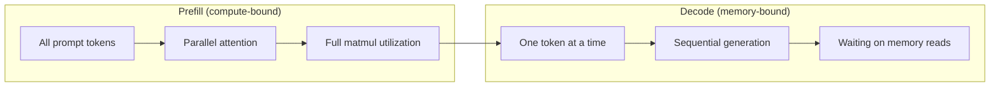
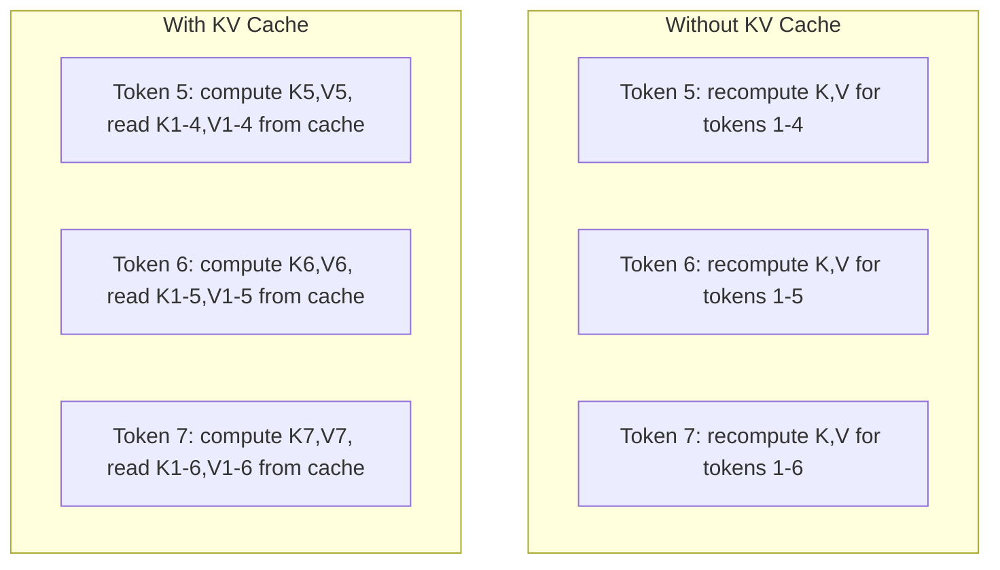
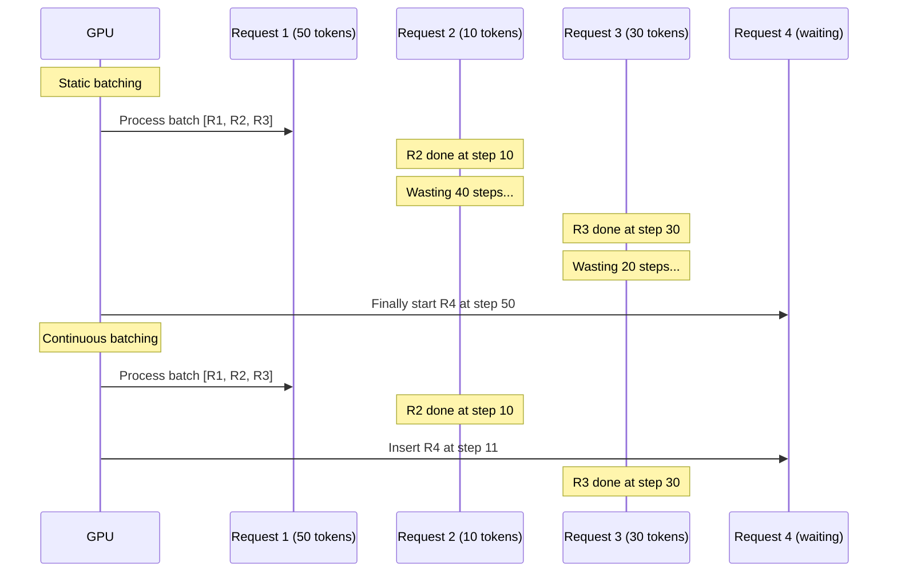
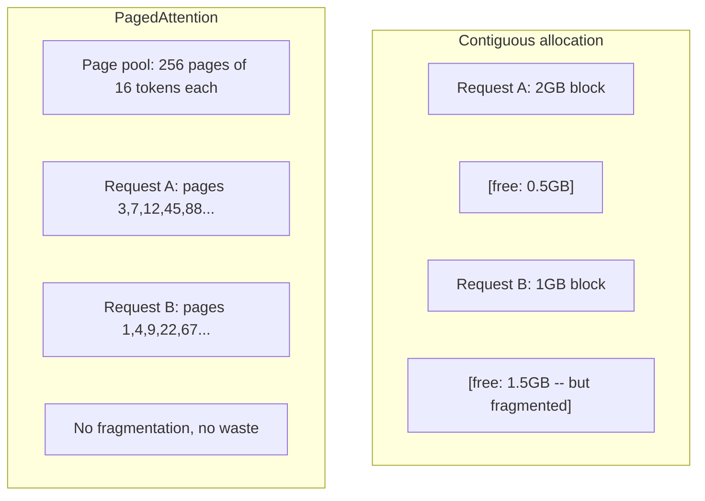
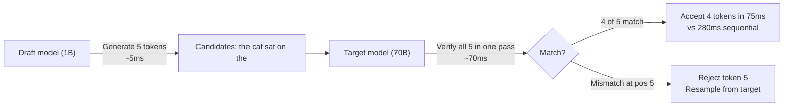

# بهینه سازی انفرنس

> دو مرحله نتیجه گیری LLM را تعریف می کنند. پیش از تکمیل، پرامپت شما را به طور موازی پردازش می کند - محاسباتی محدود. رمزگذاری توکن ها را یک به یک زمان تولید می کند - حافظه محدود. هر بهینه سازی یکی یا هر دو را هدف قرار می دهد.

**Type:** Build
**Languages:** Python
**Prerequisites:** Phase 10, Lessons 01-08 (Transformer architecture, attention)
**Time:** ~120 minutes

## اهداف یادگیری

- پیاده سازی KV-cache برای حذف محاسبات اضافی در زمان تولید توکن های خودرویگریسی
- مراحل پیش از پر کردن و رمزگذاری نتیجه گیری LLM را توضیح دهید و اینکه چرا هر کدام گلو های مختلف دارند (بند حساب و حافظه)
- پیاده سازی کنسل های دسته بندی مداوم و PagedAttention برای حداکثر استفاده از GPU در زیر درخواست های همزمان
- مقایسه تکنیک های بهینه سازی نتیجه گیری (KV-cache، رمزگذاری حدس، توجه فلاش) و تراکنش های تولید/خاموشی آنها

## مشکل

شما Llama 3 70B را در GPU های 4xA100 استفاده می کنید. یک کاربر تنها 50 توکن در ثانیه دریافت می کند. احساس سریع می کند. سپس 100 کاربر همزمان به نقطه پایان می رسند. تولید به 3 توکن در ثانیه در کاربر کاهش می یابد. هزینه GPU شما 25،000 دلار در ماه به سرعت تر از نوع انسان پاسخ می دهد.

خود مدل بین یک کاربر و ۱۰۰ کاربر تغییر نمی کند. وزن هم، معماری هم، ریاضی هم چیزی که تغییر می کنه اینه که چطور برنامه ریزی می کنی نتیجه گیری ساده، ۹۰ درصد از اطلاعات موجود GPU را از دست می دهد. یک کاربر که منتظر توکن 47 است، کل یک قسمت را باز نگه دارد در حالی که حافظ حافظه GPU بین دوتا خاموش می ماند. در همین حال، یک کاربر جدید که 2,000 توکن دارد می تواند این زمان را با محاسبات مفید پر کند.

این یک مشکل مقیاس بندی نیست. این یک مشکل برنامه ریزی است. تکنیک های این درس - KV کیش، دسته بندی مداوم، PagedAttention، کدگذاری حدس زده، پیشگویی کیش - چیزی هستند که یک$25k/month inference bill from a $5 هزار دلار در ماه به همان ترافیک خدمت می کند.

vLLM که Llama 3 70B را در 4xA100-80GB سرویس می دهد، در یک زمان همزمان کم 50 توکن/دقیقه/کاربری را به دست می آورد و از طریق دسته بندی مداوم و PagedAttention 15-25 TPS/کاربری را در 100 درخواست همزمان پشتیبانی می کند. بدون این بهینه سازی ها، همان سخت افزار در این زمان 5 TPS/کاربری را به کار می آورد. همان GPU ها، همان مدل، 4x تولید.

## مفهوم

### پیش پر کردن در مقابل کدن

هر درخواست نتیجه گیری LLM دو مرحله جداگانه دارد.

**Prefill**تمام توکن ها شناخته شده اند، بنابراین توجه می تواند در موازی در سراسر تسلسل کامل محاسبه شود. این یک ضرب ماتریک بزرگ است - هسته های GPU مشغول هستند. گلو شکنی محاسبه می شود: چند FLOPS در هر ثانیه سخت افزار شما می تواند تحویل دهد. A100 312 TFLOPS (BF16) را انجام می دهد. پیش از پر کردن یک پیام 4،096 توکن در یک مدل 70B به ~ 400ms در یک A100 واحد نیاز دارد.

**Decode**توکن های خروجی را یک به یک تولید می کند. هر توکن جدید به تمام توکن های قبلی عمل می کند، اما تنها یک توکن در هر گذرنامه پیشرو تولید می شود. ماتریس های وزن با اندازه ی قبل از پر کردن هستند، اما شما آنها را با یک متریک به جای یک ماتریس ضرب می کنید. هسته های GPU در مایکرو ثانیه ها تمام می شوند، سپس منتظر می باشند تا دسته بعدی وزن از حافظه به اینجا برسد. مشکل گلوچه ی حافظه، بیند باند است: چقدر سریع می توانید وزن مدل ها را از HBM به واحدهای محاسباتی منتقل کنید. A100 دارای 2 TB/s بیند است. مدل 70B در FP16 140 گابایت است. خواندن کامل مدل یک بار 70ms می برد -- این مرحله شما برای یک مرحله رمزگذاری است.



.**ops:byte ratio**این میزان تراکنش ها را اندازه گیری می کند که در هر بایت بارگذاری شده از حافظه چند عملیات انجام می دهید.

```
ops:byte ratio = FLOPs per token / bytes read from memory
```

در هنگام پر کردن پیش از بسته با 4،096 توکن، شما انجام ~ 4,096 عملیات چندان جمع آوری در هر وزن بارگذاری شده. نسبت بالا است - شما به حساب بسته شده است. در هنگام رمزگذاری با اندازه دسته 1 شما انجام ~ 1 عملیات در هر وزن بارگذاری شده است. نسبت کم است - شما به حافظه بسته شده است.

بینش اساسی: *کد به حافظه متصل است زیرا شما کل مدل را برای تولید یک توکن واحد می خوانید.* هر بهینه سازی زیر یا آنچه را که می خوانید را کاهش می دهد، تعداد توکن های پردازش شده را در هر خواندن افزایش می دهد، یا از خواندن به طور کامل اجتناب می کند.

### KV Cache

در طول توجه، هر توکن از پرسش به کلید و ویکتورهای ارزش هر توکن قبلی توجه می کند. بدون ذخیره سازی، تولید توکن N نیاز به محاسبه مجدد کلید و پیش بینی ارزش برای تمام توکن های N-1 قبلی دارد. توکن 1 هنگام تولید توکن 2، سپس دوباره برای توکن 3، سپس دوباره برای توکن 4 پیش بینی می شود. با توکن 1000، شما توکن 1 را به طور کلی 999 بار پیش بینی کرده اید.

حافظه پیشگیری KV پیش بینی های کلید و ارزش از تمام توکن های قبلی را ذخیره می کند. هنگام تولید توکن N، شما فقط کلید و ارزش برای توکن N را محاسبه می کنید، سپس آنها را با K / V پیشگیری شده از توکن های 1 تا N-1 متصل می کنید.



**Memory formula for KV cache:**

```
KV cache size = 2 * num_layers * num_kv_heads * head_dim * seq_len * bytes_per_param
```

برای Llama 3 70B (80 لایه، 8 سر KV با GQA، سر_dim=128, BF16):

```
per token: 2 * 80 * 8 * 128 * 2 bytes = 327,680 bytes = 320 KB
at 4,096 tokens: 320 KB * 4,096 = 1.28 GB
at 128K tokens: 320 KB * 131,072 = 40 GB
```

یک مکالمه متن 128K برای Llama 3 70B 40 گیگابایت حافظه KV مصرف می کند - نیمی از حافظه A100. با 100 کاربر همزمان در هر یک از توکن های 4K، حافظه KV به تنهایی 128 گیگابایت نیاز دارد. به همین دلیل مدیریت حافظه KV چالش اصلی بهینه سازی نتیجه گیری است.

### دسته بندی مداوم

دسته بندی جامد منتظر است تا یک دسته از درخواست های N وارد شود، آنها را با هم پردازش کند و منتظر است تا * همه * قبل از پذیرش درخواست های جدید تمام شود. اگر یک درخواست به 500 توکن و دیگری به 10 نیاز دارد، درخواست کوتاه پس از پایان 490 مرحله رمزگذاری بیکار می ماند.

دسته بندی مداوم (که همچنین به عنوان دسته بندی سطح تکرار نامیده می شود) بلافاصله پس از تکمیل هر درخواست درخواست های جدید را به دسته وارد می کند. دسته در هر مرحله رمزگذاری دوباره ارزیابی می شود. یک درخواست که پس از 10 توکن به پایان می رسد بلافاصله با یک درخواست منتظر جایگزین می شود.



بهبود تولید بستگی به میزان تفاوت طول های خروجی دارد. با طول های یکسانی، دسته بندی مداوم با دسته بندی ثابت مطابقت دارد. با طول های متغیر (حال معمول) ، دسته بندی مداوم می تواند 2-5 برابر تولید بیشتری را ارائه دهد زیرا قطعات GPU هرگز خالی نمی مانند.

### صفحه توجه

حافظه کش KV برای هر درخواست یک بلوک حافظه متصل است. وقتی درخواست ها می آیند و می روند، قطعات حافظه - دقیقا مانند شکاف رام در سیستم عامل ها. یک درخواست 4K-token به 1.28 GB متصل نیاز دارد. حتی اگر شما 2 GB رایگان کل داشته باشید، ممکن است 1.28 GB * متصل نداشته باشید. شما یا حافظه را از دست می دهید یا درخواست را رد می کنید.

PagedAttention (از vLLM) حافظه مجازی سبک OS را به کیش KV اعمال می کند. به جای اختصاص یک بلوک متصل به هر درخواست، "صفحات" اندازه ثابت (معمولا هر 16 توکن) را اختصاص می دهد. صفحات می توانند در هر نقطه از حافظه GPU فیزیکی باشند. یک جدول صفحه موقعیت های منطقی هر درخواست را به مکان های فیزیکی صفحه نقشه می کشد.



PagedAttention هم امکان پذیر است**copy-on-write**برای پیشگام های مشترک. اگر 50 درخواست یک پرامپت سیستم را به اشتراک بگذارند، صفحات کیش KV برای آن پرامپت سیستم یک بار ذخیره می شوند و توسط تمام 50 درخواست مرجع می شوند. تنها زمانی که یک درخواست متمایز (پیام های کاربر مختلف) است، صفحات خود را دریافت می کند. این به طور چشمگیری استفاده از حافظه را برای برنامه هایی با پرامپت های سیستم مشترک کاهش می دهد.

vLLM از طریق PagedAttention تقریباً از دست دادن حافظه (~4٪ در مقایسه با ~60-80٪ در اختصاص ساده) گزارش می دهد.

### رمزنگاری مفروض

رمزگذاری کند است چون دنباله دار است -- شما یک توکن تولید می کنید، آن را بازمی دهید، بعدی را تولید می کنید. اما اگر شما بتوانید 5 توکن بعدی را با هزینه ارزان حدس بزنید، سپس همه آنها را به یکباره تأیید کنید؟

کلاهبرداری با استفاده از یک کوچک و سریع**draft model**تا توکن های کاندید K تولید کند.**target model**سپس تمام کاندیداهای K را در یک گذرگاه پیشروی واحد پردازش می کند (که شبیه یک پر کردن پیشروی است - موازی، محدود به محاسبه، کارآمد). اگر مدل هدف با پیش بینی های مدل مسود موافق باشد، شما تمام توکن های K را در زمان یک گذرگاه پیشروی هدف پذیرفته اید. اگر در موقعیت j مخالف باشد، توکن های 1 تا j-1 را پذیرفته و بقیه را رد می کنید.



سرعتش به سرعت بستگی داره**acceptance rate**برای یک طرح Llama 3 8B برای Llama 3 70B، نرخ پذیرش 70-85% به زبان طبیعی است. این به سرعت دو تا سه برابر کردن رمزگذاری ترجمه می کند.

سه روش برای رمزگذاری حدس زده:

| Method | Draft source | Acceptance rate | Overhead |
|--------|-------------|-----------------|----------|
| Draft-target (Leviathan et al.) | Separate small model | 70-85% | Draft model memory |
| EAGLE (Li et al.) | Lightweight head on target | 75-90% | ~1% extra parameters |
| N-gram lookup | Token n-gram table | 40-60% | Negligible |

**EAGLE**يه سر کوچولو خودکشي در بالا از حالت هاي پنهان مدل هدف آموزش ميده این پیش بینی است که توکن بعدی با استفاده از ویژگی های لایه دوم تا آخر مدل هدف قرار می گیرد. از آنجا که بر اساس نمایش های مدل هدف کار می کند (نه یک مدل جداگانه) ، نرخ پذیرش بالاتر را با حداقل حافظه اضافی به دست می آورد. EAGLE-2 یک درخت طرح پویا را اضافه می کند که تعداد کاندیداها را بر اساس زمینه تنظیم می کند.

**N-gram speculative decoding**اگر مسودات مشابه آنچه در همان مکالمه ظاهر شده است (نمونه های تکراری، کد، خروجی ساختار یافته) ، با صفر هزینه شبکه عصبی استفاده می شود. نرخ پذیرش به طور متوسط پایین تر است اما هزینه هر حدس اساسا رایگان است.

کدگذاری حدس زدایی * ریاضی دقیق * است - توزیع خروجی با توزیع مدل هدف یکسان است. این تقرب نیست. مرحله تأیید تضمین می کند که هر توکن پذیرفته شده دقیقاً احتمالاتی را که مدل هدف تعیین کرده است دارد.

### پیشگویی ذخیره سازی

بسیاری از درخواست ها یک پیشگویی مشابه را دارند. یک پیام رسان سیستم چت روت. یک بلاک زمینه RAG. چند نمونه شوت. بدون پیشگویی پیشگویی، هر درخواست از نو حافظه پیشگویی KV را برای این توکن های مشترک محاسبه می کند.

پیش پیشگویی ذخیره KV حافظه کش برای پیشگویی های مشترک و آن را در میان درخواست ها استفاده می کند. هنگامی که یک درخواست جدید با پیشگویی شناخته شده وارد می شود، سیستم کپی (یا مرجع) ورودی KV ذخیره شده را می کند و فقط KV را برای پسگویی منحصر به فرد محاسبه می کند.

برای یک پیام سیستم 2000 توکن که در تمام درخواست ها به اشتراک گذاشته می شود، پیش فرض ذخیره سازی 400ms از پیش پر کردن در هر درخواست را از بین می برد. در 100 درخواست / ثانیه، این 40 ثانیه محاسبه GPU در ثانیه را ذخیره می کند - بیش از یک GPU ارزش کار.

RadixAttention SGLang پیش فرض ذخیره سازی را با درخت رادیکس (trie) اجرا می کند که پیش فرض ها را با محتوای نشانه های آنها شاخص می کند. هر درخواست مطابقت با پیش فرض ذخیره شده به صورت رایگان KV خود را می گیرد. درخت مطابقت بخش پیش فرض را فعال می کند - اگر شما 1500 از 2000 پیش فرض را با یک ورودی پیش فرض به اشتراک بگذارید، شما از 1500 استفاده می کنید و فقط 500 را دوباره محاسبه می کنید.

### موتورهای انفراسونیکی

سه موتور در تولید LLM به کار می روند:

| Engine | Key innovation | Best for |
|--------|---------------|----------|
| vLLM | PagedAttention, continuous batching | General-purpose serving, highest compatibility |
| SGLang | RadixAttention (prefix caching), structured generation | Multi-turn chatbots, constrained decoding |
| TensorRT-LLM | NVIDIA kernel fusion, FP8 quantization | Maximum single-GPU throughput on NVIDIA hardware |

**vLLM**این سیستم از طریق سیستم عامل های کاربردی (GPU) پشتیبانی می کند. این سیستم از طیف گسترده ای از مدل ها پشتیبانی می کند، در هر ارائه دهنده GPU (NVIDIA، AMD، Intel) اجرا می شود و از طریق PagedAttention + batching مداوم، تولیدات قوی را به دست می آورد. API سازگار با OpenAI به این معنی است که می توانید آن را به عنوان جایگزینی برای هر تماس API OpenAI وارد کنید.

**SGLang**اگر بار کاری شما شامل مکالمات چند نوبت، استفاده از ابزار یا رمزگذاری محدود (خروجی JSON، تولید هدایت شده توسط regex) است، SGLang اغلب از vLLM با استفاده از مجدد prefix 2-5x بهتر است.

**TensorRT-LLM**این دستگاه به طور کامل از سیستم عامل های GPU استفاده می کند. این سیستم عامل ها را به هسته های GPU بهینه سازی شده NVIDIA ترکیب می کند. این سیستم عملیات (انتباه + خطی + فعال سازی در یک هسته) را ترکیب می کند، از FP8 در GPU های H100 استفاده می کند و برای انتشار تولید با NVIDIA Triton Inference Server ادغام می شود. این سیستم عامل بالاترین تولید GPU واحد را در سخت افزار NVIDIA به دست می آورد اما نیاز به تنظیم بیشتر دارد و فقط در GPU های NVIDIA کار می کند.

شماره های دنیای واقعی برای Llama 3 70B (4xA100-80GB، BF16):

| Metric | vLLM | SGLang | TensorRT-LLM |
|--------|------|--------|---------------|
| Throughput (1 user) | ~50 TPS | ~55 TPS | ~65 TPS |
| Throughput (100 users) | ~2,500 total TPS | ~3,200 total TPS | ~3,000 total TPS |
| Time to first token | ~400ms | ~300ms (prefix hit) | ~350ms |
| Max context | 128K | 128K | 128K |

### چارچوب عملیات: بایت

شما نمی توانید آنچه را که اندازه نمی گیرید را بهینه سازی کنید. نسبت ops:byte به شما می گوید که آیا شما به محاسبات یا حافظه وابسته هستید، که تعیین می کند کدام بهینه سازی مهم است.

```
Compute roof: peak FLOPS of the GPU
Memory roof:  peak bandwidth * ops:byte ratio
```

وقتی ops:byte کم است (دکود، دسته های کوچک) ، شما به سقف باندبندی حافظه ضربه می زنید. اضافه کردن محاسبه بیشتر (ساعت بالاتر، هسته های بیشتر) کمک نمی کند. شما باید خواندن حافظه را کاهش دهید (کوانتاسیون، فشرده سازی کیش KV) یا اندازه دسته را افزایش دهید تا خواندن را در کارهای مفید تر کاهش دهید.

وقتی ops:byte بالا باشد (پرداخت، دسته های بزرگ) ، شما به سقف محاسبات ضربه می زنید. بهینه سازی بیند ویت حافظه کمک نمی کند. برای فشرده سازی FLOPS، به GPU های سریعتر، فیژن هسته یا دقت کاهش یافته نیاز دارید.

| Scenario | ops:byte | Bound | Optimize with |
|----------|----------|-------|---------------|
| Prefill, batch=1 | ~4,096 | Compute | Kernel fusion, FP8 |
| Decode, batch=1 | ~1 | Memory | Quantization, KV compression |
| Decode, batch=32 | ~32 | Memory | Larger batch, continuous batching |
| Decode, batch=256 | ~256 | Transitioning | Both matter |
| Decode, batch=1024 | ~1,024 | Compute | Kernel fusion, tensor parallelism |

نقطه عبور در A100 در اطراف ops:byte = 156 (312 TFLOPS / 2 TB / s) است. زیر 156 ، شما به حافظه متصل هستید. بالای 156 ، شما به کامپیوتر متصل هستید. دسته بندی مداوم با بسته بندی توکن های بیشتر در هر تکرار ، رمزگذاری را به سمت این کراسور فشار می دهد.

```figure
context-window-slide
```

## آن را بسازید

### مرحله اول: KV Cache از ابتدا

ما یک کش کثیر سر KV ایجاد می کنیم که پیش بینی های کلید و ارزش را در هر لایه، در هر سر ذخیره می کند و الگوی رشد حافظه را نشان می دهد.

```python
import numpy as np

class KVCache:
    def __init__(self, num_layers, num_heads, head_dim, max_seq_len, dtype=np.float16):
        self.num_layers = num_layers
        self.num_heads = num_heads
        self.head_dim = head_dim
        self.max_seq_len = max_seq_len
        self.dtype = dtype

        self.k_cache = np.zeros(
            (num_layers, num_heads, max_seq_len, head_dim), dtype=dtype
        )
        self.v_cache = np.zeros(
            (num_layers, num_heads, max_seq_len, head_dim), dtype=dtype
        )
        self.seq_len = 0

    def update(self, layer_idx, new_keys, new_values):
        num_new = new_keys.shape[1]
        end = self.seq_len + num_new
        self.k_cache[layer_idx, :, self.seq_len:end, :] = new_keys
        self.v_cache[layer_idx, :, self.seq_len:end, :] = new_values
        return (
            self.k_cache[layer_idx, :, :end, :],
            self.v_cache[layer_idx, :, :end, :]
        )

    def advance(self, num_tokens):
        self.seq_len += num_tokens

    def memory_bytes(self):
        return self.k_cache.nbytes + self.v_cache.nbytes

    def used_bytes(self):
        per_token = 2 * self.num_layers * self.num_heads * self.head_dim * np.dtype(self.dtype).itemsize
        return per_token * self.seq_len
```

### مرحله دوم: توجه با KV Cache

یک توجه چند سر ساده که از حافظه کش KV برای مراحل رمزگذاری استفاده می کند.

```python
def scaled_dot_product_attention(query, keys, values):
    head_dim = query.shape[-1]
    scores = np.matmul(query, keys.transpose(0, 1, 3, 2)) / np.sqrt(head_dim)
    seq_len_q = scores.shape[-2]
    seq_len_k = scores.shape[-1]
    if seq_len_q > 1:
        mask = np.triu(np.ones((seq_len_q, seq_len_k), dtype=np.float32), k=seq_len_k - seq_len_q + 1)
        scores = scores + mask * (-1e9)
    max_scores = np.max(scores, axis=-1, keepdims=True)
    exp_scores = np.exp(scores - max_scores)
    attn_weights = exp_scores / np.sum(exp_scores, axis=-1, keepdims=True)
    return np.matmul(attn_weights, values)


class MultiHeadAttention:
    def __init__(self, d_model, num_heads):
        self.num_heads = num_heads
        self.head_dim = d_model // num_heads
        scale = np.sqrt(2.0 / d_model)
        self.W_q = np.random.randn(d_model, d_model).astype(np.float32) * scale
        self.W_k = np.random.randn(d_model, d_model).astype(np.float32) * scale
        self.W_v = np.random.randn(d_model, d_model).astype(np.float32) * scale
        self.W_o = np.random.randn(d_model, d_model).astype(np.float32) * scale

    def forward(self, x, kv_cache=None, layer_idx=0):
        batch, seq_len, d_model = x.shape
        Q = np.matmul(x, self.W_q).reshape(batch, seq_len, self.num_heads, self.head_dim).transpose(0, 2, 1, 3)
        K = np.matmul(x, self.W_k).reshape(batch, seq_len, self.num_heads, self.head_dim).transpose(0, 2, 1, 3)
        V = np.matmul(x, self.W_v).reshape(batch, seq_len, self.num_heads, self.head_dim).transpose(0, 2, 1, 3)

        if kv_cache is not None:
            K_full, V_full = kv_cache.update(layer_idx, K[0], V[0])
            K = K_full[np.newaxis, :, :, :]
            V = V_full[np.newaxis, :, :, :]
            if seq_len == 1:
                kv_cache.advance(1)

        attn_out = scaled_dot_product_attention(Q, K, V)
        attn_out = attn_out.transpose(0, 2, 1, 3).reshape(batch, -1, d_model)
        return np.matmul(attn_out, self.W_o)
```

### مرحله 3: شبیه ساز دسته بندی مداوم

این شبیه سازی تفاوت برنامه ریزی بین دسته بندی های ثابت و مداوم می شود.

```python
import heapq

class Request:
    def __init__(self, request_id, prompt_tokens, output_tokens, arrival_step):
        self.request_id = request_id
        self.prompt_tokens = prompt_tokens
        self.output_tokens = output_tokens
        self.arrival_step = arrival_step
        self.tokens_generated = 0
        self.start_step = None
        self.end_step = None

    def is_done(self):
        return self.tokens_generated >= self.output_tokens


def simulate_static_batching(requests, batch_size):
    step = 0
    completed = []
    queue = list(requests)
    queue.sort(key=lambda r: r.arrival_step)

    while queue:
        batch = []
        while queue and len(batch) < batch_size:
            r = queue.pop(0)
            r.start_step = max(step, r.arrival_step)
            batch.append(r)

        if batch:
            step = max(step, max(r.start_step for r in batch))
            max_output = max(r.output_tokens for r in batch)
            for r in batch:
                r.tokens_generated = r.output_tokens
                r.end_step = step + max_output
            step += max_output
            completed.extend(batch)

    return completed


def simulate_continuous_batching(requests, batch_size):
    step = 0
    completed = []
    queue = sorted(requests, key=lambda r: r.arrival_step)
    queue_idx = 0
    active = []
    waiting = []

    while queue_idx < len(queue) or active or waiting:
        while queue_idx < len(queue) and queue[queue_idx].arrival_step <= step:
            waiting.append(queue[queue_idx])
            queue_idx += 1

        while waiting and len(active) < batch_size:
            r = waiting.pop(0)
            r.start_step = step
            active.append(r)

        if not active:
            if waiting:
                step += 1
                continue
            elif queue_idx < len(queue):
                step = queue[queue_idx].arrival_step
                continue
            else:
                break

        for r in active:
            r.tokens_generated += 1

        done = [r for r in active if r.is_done()]
        for r in done:
            r.end_step = step + 1
            completed.append(r)
        active = [r for r in active if not r.is_done()]

        step += 1

    return completed


def batching_stats(completed):
    latencies = [r.end_step - r.arrival_step for r in completed]
    total_time = max(r.end_step for r in completed) - min(r.arrival_step for r in completed)
    total_tokens = sum(r.output_tokens for r in completed)
    return {
        "avg_latency": np.mean(latencies),
        "p50_latency": np.median(latencies),
        "p99_latency": np.percentile(latencies, 99),
        "total_time": total_time,
        "throughput": total_tokens / total_time if total_time > 0 else 0,
    }
```

### مرحله 4: پیشگویی

یک پیشگویی مبتنی بر تری که ورودی KV را برای پیشگوهای مشترک ذخیره می کند.

```python
class TrieNode:
    def __init__(self):
        self.children = {}
        self.kv_data = None
        self.hit_count = 0


class PrefixCache:
    def __init__(self, max_entries=1000):
        self.root = TrieNode()
        self.max_entries = max_entries
        self.total_entries = 0
        self.hits = 0
        self.misses = 0

    def _walk(self, token_ids):
        node = self.root
        depth = 0
        for tid in token_ids:
            if tid not in node.children:
                break
            node = node.children[tid]
            depth += 1
        return node, depth

    def lookup(self, token_ids):
        node, depth = self._walk(token_ids)
        if depth > 0:
            self.hits += 1
            current = self.root
            for tid in token_ids[:depth]:
                current = current.children[tid]
                current.hit_count += 1
            kv_entries = []
            current = self.root
            for tid in token_ids[:depth]:
                current = current.children[tid]
                if current.kv_data is not None:
                    kv_entries.append(current.kv_data)
            return depth, kv_entries
        self.misses += 1
        return 0, []

    def insert(self, token_ids, kv_per_token):
        node = self.root
        for i, tid in enumerate(token_ids):
            if tid not in node.children:
                if self.total_entries >= self.max_entries:
                    return i
                node.children[tid] = TrieNode()
                self.total_entries += 1
            node = node.children[tid]
            if i < len(kv_per_token):
                node.kv_data = kv_per_token[i]
        return len(token_ids)

    def hit_rate(self):
        total = self.hits + self.misses
        return self.hits / total if total > 0 else 0.0
```

### مرحله 5: شبیه ساز رمزگذاری حدس زده

ما رمزگذاری مشورتي هدف را با نرخ پذيرش قابل تنظیم شبیه سازی می کنیم.

```python
class DraftModel:
    def __init__(self, vocab_size, acceptance_rate=0.8):
        self.vocab_size = vocab_size
        self.acceptance_rate = acceptance_rate

    def generate(self, context, num_tokens):
        tokens = np.random.randint(0, self.vocab_size, size=num_tokens)
        return tokens

    def get_probs(self, context, token):
        probs = np.random.dirichlet(np.ones(self.vocab_size))
        return probs


class TargetModel:
    def __init__(self, vocab_size):
        self.vocab_size = vocab_size

    def get_probs(self, context, tokens=None):
        if tokens is not None:
            return [np.random.dirichlet(np.ones(self.vocab_size)) for _ in tokens]
        return np.random.dirichlet(np.ones(self.vocab_size))


def speculative_decode(draft_model, target_model, context, num_speculative=5,
                       draft_cost=1.0, target_cost=10.0, verify_cost=12.0):
    total_tokens = 0
    total_cost = 0.0
    accepted_counts = []
    context = list(context)

    max_tokens = 100

    while total_tokens < max_tokens:
        draft_tokens = draft_model.generate(context, num_speculative)
        total_cost += draft_cost * num_speculative

        target_probs = target_model.get_probs(context, draft_tokens)
        total_cost += verify_cost

        accepted = 0
        for i, token in enumerate(draft_tokens):
            draft_p = draft_model.get_probs(context + list(draft_tokens[:i]), token)
            target_p = target_probs[i]

            r = np.random.random()
            acceptance_prob = min(1.0, target_p[token] / (draft_p[token] + 1e-10))

            if r < draft_model.acceptance_rate:
                accepted += 1
                context.append(token)
                total_tokens += 1
            else:
                new_token = np.random.choice(draft_model.vocab_size, p=target_p)
                context.append(new_token)
                total_tokens += 1
                break

        accepted_counts.append(accepted)

        if accepted == num_speculative:
            bonus_probs = target_model.get_probs(context)
            bonus_token = np.random.choice(draft_model.vocab_size, p=bonus_probs)
            context.append(bonus_token)
            total_tokens += 1

    sequential_cost = total_tokens * target_cost
    return {
        "total_tokens": total_tokens,
        "speculative_cost": total_cost,
        "sequential_cost": sequential_cost,
        "speedup": sequential_cost / total_cost if total_cost > 0 else 1.0,
        "avg_accepted": np.mean(accepted_counts),
        "acceptance_rate": np.mean(accepted_counts) / num_speculative,
    }


def compare_speculation_strategies(vocab_size=1000, num_trials=20):
    results = {}

    for name, acceptance_rate, spec_tokens in [
        ("Draft-target (8B->70B)", 0.78, 5),
        ("EAGLE", 0.85, 6),
        ("N-gram", 0.50, 4),
        ("No speculation", 0.0, 0),
    ]:
        if spec_tokens == 0:
            results[name] = {
                "speedup": 1.0,
                "acceptance_rate": 0.0,
                "avg_accepted": 0.0,
            }
            continue

        trial_results = []
        for _ in range(num_trials):
            draft = DraftModel(vocab_size, acceptance_rate=acceptance_rate)
            target = TargetModel(vocab_size)
            context = list(np.random.randint(0, vocab_size, size=10))
            result = speculative_decode(draft, target, context, num_speculative=spec_tokens)
            trial_results.append(result)

        results[name] = {
            "speedup": np.mean([r["speedup"] for r in trial_results]),
            "acceptance_rate": np.mean([r["acceptance_rate"] for r in trial_results]),
            "avg_accepted": np.mean([r["avg_accepted"] for r in trial_results]),
        }

    return results
```

### مرحله 6: پروفایل حافظه KV Cache

نیازهای حافظه کش KV را برای پیکربندی های واقعی مدل محاسبه کنید.

```python
MODEL_CONFIGS = {
    "Llama-3-8B": {
        "num_layers": 32, "num_kv_heads": 8, "head_dim": 128,
        "model_params_b": 8, "gqa": True,
    },
    "Llama-3-70B": {
        "num_layers": 80, "num_kv_heads": 8, "head_dim": 128,
        "model_params_b": 70, "gqa": True,
    },
    "Llama-3-405B": {
        "num_layers": 126, "num_kv_heads": 8, "head_dim": 128,
        "model_params_b": 405, "gqa": True,
    },
    "Mistral-7B": {
        "num_layers": 32, "num_kv_heads": 8, "head_dim": 128,
        "model_params_b": 7, "gqa": True,
    },
    "GPT-4-est": {
        "num_layers": 120, "num_kv_heads": 96, "head_dim": 128,
        "model_params_b": 1800, "gqa": False,
    },
}


def kv_cache_memory(config, seq_len, dtype_bytes=2):
    per_token = 2 * config["num_layers"] * config["num_kv_heads"] * config["head_dim"] * dtype_bytes
    total = per_token * seq_len
    return {
        "per_token_bytes": per_token,
        "per_token_kb": per_token / 1024,
        "total_bytes": total,
        "total_mb": total / (1024 ** 2),
        "total_gb": total / (1024 ** 3),
    }


def memory_budget(config, gpu_memory_gb, model_dtype_bytes=2, kv_dtype_bytes=2):
    model_memory_gb = config["model_params_b"] * 1e9 * model_dtype_bytes / (1024 ** 3)
    overhead_gb = gpu_memory_gb * 0.1
    available_for_kv = gpu_memory_gb - model_memory_gb - overhead_gb

    if available_for_kv <= 0:
        return {"error": "Model does not fit in GPU memory", "model_memory_gb": model_memory_gb}

    per_token = 2 * config["num_layers"] * config["num_kv_heads"] * config["head_dim"] * kv_dtype_bytes
    max_tokens = int(available_for_kv * (1024 ** 3) / per_token)

    return {
        "gpu_memory_gb": gpu_memory_gb,
        "model_memory_gb": round(model_memory_gb, 1),
        "overhead_gb": round(overhead_gb, 1),
        "available_for_kv_gb": round(available_for_kv, 1),
        "max_total_tokens": max_tokens,
        "max_users_at_2k": max_tokens // 2048,
        "max_users_at_4k": max_tokens // 4096,
        "max_users_at_32k": max_tokens // 32768,
    }
```

## ازش استفاده کن

با vLLM:

```python
from vllm import LLM, SamplingParams

llm = LLM(
    model="meta-llama/Meta-Llama-3-70B-Instruct",
    tensor_parallel_size=4,
    enable_prefix_caching=True,
    max_model_len=8192,
    gpu_memory_utilization=0.9,
)

params = SamplingParams(temperature=0.7, max_tokens=256)
outputs = llm.generate(["Explain inference optimization in one paragraph."], params)
```

با SGLang برای پیشگویی ذخیره سازی + خروجی ساختار یافته:

```python
import sglang as sgl

@sgl.function
def classify(s, text):
    s += sgl.system("You are a classifier. Output JSON only.")
    s += sgl.user(f"Classify this text: {text}")
    s += sgl.assistant(sgl.gen("result", regex=r'\{"label": "(positive|negative|neutral)"\}'))

runtime = sgl.Runtime(model_path="meta-llama/Meta-Llama-3-70B-Instruct", tp_size=4)
sgl.set_default_backend(runtime)

results = classify.run_batch([
    {"text": "This product is amazing!"},
    {"text": "Terrible experience."},
    {"text": "It was okay I guess."},
])
```

با TensorRT-LLM:

```python
import tensorrt_llm
from tensorrt_llm.runtime import ModelRunner

runner = ModelRunner.from_dir("./llama-70b-trt-engine/", rank=0)

outputs = runner.generate(
    batch_input_ids=[tokenizer.encode("Explain KV caching.")],
    max_new_tokens=256,
    temperature=0.7,
)
```

## -باده

این درس نتیجه می دهد:
- `outputs/skill-inference-optimization.md`-- مهارت برای تشخیص و بهینه سازی نتیجه گیری LLM

## تمرینات

1. برای مقایسه FP16 در مقابل FP8 در مقابل INT4 KV کیش کوانتاییزاسیون را تغییر دهید. برای Llama 3 70B در زمینه 4K، حداکثر کاربران همزمان را برای هر یک از آنها در 4xA100-80GB محاسبه کنید. کوانتاییزاسیون KV به INT4 باید تقریبا 4 برابر ظرفیت کاربر باشد.

2. شبیه ساز دسته بندی مداوم را برای ردیابی استفاده از GPU (تجزیر از سوراخ های دسته بندی پر شده در هر مرحله) گسترش دهید. استفاده از پلاوت در طول زمان برای دسته بندی ثابت و مداوم با 50 درخواست که طول خروجی آنها از توزیع Pareto (شکل = 1.5 ، مقیاس = 20) پیروی می کند. استفاده مداوم باید استفاده > 80٪ را حفظ کند.

3. یک نسخه از KV cache (GQA) را اجرا کنید که در آن `num_kv_heads < num_query_heads`Llama 3 70B از 64 سر سوال استفاده می کند اما فقط 8 سر KV. ذخیره حافظه را با توجه کامل چند سر محاسبه کنید (8 برابر کاهش اندازه حافظه کش KV).

4. یک پیشگویی که از اخراج LRU استفاده می کند ایجاد کنید. حداکثر واردات را به 500 تنظیم کنید و 1000 درخواست را ایجاد کنید که 60% یکی از 5 پیشگویی مشترک را به اشتراک می گذارند. نرخ ضربه را اندازه گیری کنید و با پیشگویی نامحدود مقایسه کنید. با اخراج خوب، نرخ ضربه باید بالاتر از 55% باشد.

5. شبیه ساز رمزگذاری حدس زدایی را برای پیاده سازی حدس زدایی مبتنی بر درخت (طریقه EAGLE-2) گسترش دهید. به جای یک زنجیره واحد از توکن های مسود K، یک درخت از کاندیداها تولید کنید (به عنوان مثال، 2 شاخه در هر یک از 3 سطح = 8 کاندید برگ). مجموع توکن های پذیرفته شده را در هر دور تأیید مقابل حدس زدایی خطی مقایسه کنید.

## اصطلاحات کلیدی

| Term | What people say | What it actually means |
|------|----------------|----------------------|
| Prefill | "Processing the prompt" | Computing attention over all input tokens in parallel -- compute-bound because the full matrix multiplication keeps GPU cores busy |
| Decode | "Generating tokens" | Producing one token per forward pass, reading the full model weights each time -- memory-bound because compute finishes before the next weights arrive |
| KV cache | "Caching attention states" | Storing the key and value projections for all previous tokens so they are not recomputed at each decode step -- trades memory for compute |
| Continuous batching | "Dynamic batching" | Inserting new requests into the running batch as soon as any request finishes, evaluated at every decode iteration rather than waiting for the whole batch |
| PagedAttention | "Virtual memory for KV cache" | Allocating KV cache in fixed-size pages instead of contiguous blocks, eliminating memory fragmentation and enabling copy-on-write for shared prefixes |
| Speculative decoding | "Draft and verify" | Using a fast draft model to propose multiple tokens, then verifying them all in one target model forward pass -- mathematically exact, 2-3x speedup |
| EAGLE | "Self-speculative decoding" | A speculative decoding variant that trains a lightweight head on the target model's own hidden states, achieving higher acceptance rates than a separate draft model |
| Prefix caching | "Reusing system prompt KV" | Storing computed KV cache entries for common prefixes (system prompts, few-shot examples) and reusing them across requests to skip redundant prefill |
| Ops:byte ratio | "Arithmetic intensity" | The ratio of compute operations to memory bytes read -- determines whether a workload is compute-bound (high ratio) or memory-bound (low ratio) |
| Time to first token | "TTFT" | Latency from receiving a request to producing the first output token -- dominated by prefill time for long prompts |

## خواندن بیشتر

- کوون و همکارانش، " مدیریت حافظه موثر برای مدل زبان بزرگ با PagedAttention" (2023) - مقاله vLLM که مدیریت کیش KV صفحه ای را معرفی کرد، اکنون استاندارد صنعت برای ارائه نتیجه گیری است
- لاویاتان و همکارانش، "تفرقه سریع از ترانسفارمر ها از طریق کدگذاری اسپکولیتی" (2023) - مقاله اساسی که ثابت می کند که حدس زدن تایید مسودات توزیع دقیق مدل هدف را در حالی که به سرعت 2-3x می رساند
- لی و همکارانش، "ایگل: نمونه گیری حدس زدنی نیاز به بازبینی عدم اطمینان ویژگی ها" (2024) -- با آموزش یک سر در مورد ویژگی های مدل هدف به جای استفاده از یک مدل طرح جداگانه، نرخ پذیرش بالاتر را به دست می آورد
- ژینگ و همکارانش، "SGLang: اجرای موثر برنامه های مدل زبان ساختاری" (2024) -- RadixAttention را برای پیشگویی پیشگویی و یک مدل برنامه نویسی برای برنامه های LLM چند تماس معرفی می کند
- ویلیامز و همکارانش، "پشت خط: یک مدل عملکرد بصری با بینش برای معماری های چند هسته ای" (2009) - کاغذ اصلی سقف خط که چارچوب ops:byte را برای استدلال در مورد گره های بطن محاسبات در مقابل حافظه رسمی کرد
