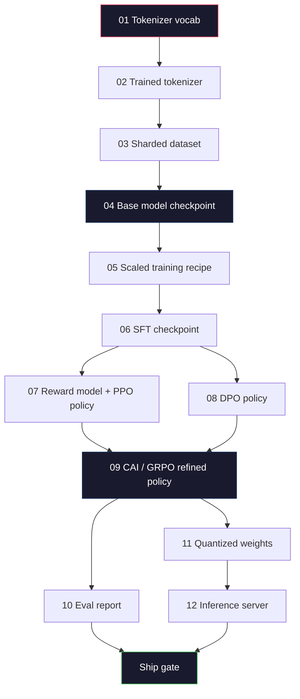
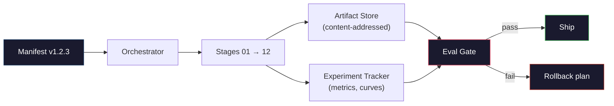

# ساخت خط لوله کامل LLM

> همه چيز از درس اول تا 12 يه مرحله از يک خط لوله است این درس است که این مراحل را به یک مرحله ی تک پایان تبدیل می کند: توکن سازی، پیش از قطار، مقیاس، SFT، خط بندی، ارزیابی، کوانتاسیون، خدمت. شما نماد 70B رو با لپ تاپ آموزش نميدونيد شما لایه ی سازمانی، مانیفیت، دروازه ی ارزیابی و برنامه ی برگشت را تولید خواهید کرد که یک تیم مرزی ۲۰۲۶ برای تصمیم گیری در مورد اینکه چه چیزی ارسال می شود استفاده می کند. اين سنگ پايين است.

**Type:** Build
**Languages:** Python (stdlib)
**Prerequisites:** All Phase 10 lessons 01-12
**Time:** ~120 minutes

## اهداف یادگیری

- ترکیب یازده درس قبلی (توکنیزر، داده ها، پیش آموزش، مقیاس بندی، SFT، RLHF، DPO، CAI، ارزیابی، کوانتاسیون، نتیجه گیری) به یک مشخصات تولید مجدد پایپلی
- قرارداد آثار بین مراحل را تعریف کنید: هر مرحله چه مصرف می کند، چه چیزی تولید می کند و مرحله بعدی چگونه ورودی را تأیید می کند
- سازنده ای بسازید که آزمایشات را ردیابی کند، آثار هنری را هاش کند و تصمیمات در مورد محدودیت های ارزیابی را در اختیار داشته باشد
- طرح بازپرداخت: چه آثار هنری برای بازیافت ارزان هستند، کدامها گران هستند و هزینه یک نقطه بازرسی فاسد چیست

## مشکل

دروس قبلی هر کار. Tokenizer آموزش داده شده. GPT کوچک پیش از آموزش داده شده. مجموعه داده های SFT جمع آوری شده. مدل پاداش آموزش داده شده. DPO اجرا شده. مساوات اندازه گیری شده. وزن های کمی صادر شده. سرور تعبیر شده به صورت پراکنده. هر یک یک یک لپ تاپ است. هر یک دارای کنوانسیون های خود است، مسیرهای خروجی خود است، دانه های خود است.

يه دوره آموزش مرزيه يه دفترچه نيست لاما ۳۴۰۵ب ۳۰ میلیون ساعت H100 در ۵۴ روز طول کشید. DeepSeek-V3 حدود 2.8 میلیون ساعت H800 مصرف کرد در طول این زمان، یک نقطه بازرسی فاسد، یک آلودگی داده، یک بازگشت ارزیابی می تواند یک هفته ساعت دیواری و یک ماه بودجه GPU را برای تیم هزینه کند. راه تیم ها از این امر از طریق بهداشت لوله عبور می کنند: هر مرحله دارای ورودی تعیین کننده، خروجی تعیین کننده، یک مانیست، یک هش و یک دروازه است.

این است که پایپستون. شما نمی توانید پایپست را از پایان به پایان در یک لپ تاپ اجرا کنید. شما می توانید آرژانتور را که مراحل را هماهنگ می کند، مانیف را که اجرا را توصیف می کند، تأیید کننده را که تصمیمات کشتی را در اختیار می گیرد و برنامه بازی را که به شخص ثالث اجازه می دهد کار شما را از یک فایل واحد دوباره اجرا کند، بنویسید. کد کوچک است؛ نظم بزرگ است.

این الگوی از 100M تا 1T بدون تغییر است. همان چهار عنصر - manifest، orchestrator، eval gate، artefact store - Llama 3 را اجرا کنید و همچنین GPT سرگرمی خود را اجرا کنید. تفاوت در اندازه اعداد درون پیکربندی هر مرحله است، نه شکل لوله.

## مفهوم

### دوازده مرحله

هر درس فاز 10 مرحله ای است. اینجا نمودار کامل وابستگی است.



مراحل 07 و 08 می توانند موازی اجرا شوند. همه چیز دیگر یک وابستگی سخت است. تغییر در مرحله 02 (tokenizer) هر آرتیفاکت پایین تر را باطل می کند. تغییر در مرحله 10 (eval) فقط تصمیم کشتی را باطل می کند.

### آشکار

یک مانیست یک فایل واحد است که یک اجرا را به اندازه کافی برای تکرار توصیف می کند. هیچ چیزی که خط لوله تولید می کند نباید به حالت دیگری بستگی داشته باشد که در مانیست نیست. زمینه ها خسته کننده و اجباری هستند.

```
pipeline_version: 1.2.3
seed: 42
git_commit: a1b2c3d4
stages:
  01_tokenizer:
    recipe: bpe_32k
    input_hash: sha256:...
    output_hash: sha256:...
    wall_clock_sec: 3600
    cost_usd: 12
```

هاش خروجی مرحله N هاش ورودی مرحله N+1 است. هر انحراف و لوله متوقف می شود. این نحوه تشخیص فساد داده ها در اوایل است. همچنین این نحوه بررسی یک همکار تیم در قاره دیگر است که بازی مجدد آنها همان اثر شما را تولید کرده است.

در عمل تیم ها از یک طرح کوچک YAML به همراه یک چکگر آشکار که با اجرای موفقیت آمیز قبلی متفاوت است استفاده می کنند. هر دلتا خارج از زمینه های انتظار می رود ( هزینه، ساعت دیوار) یک پرچم قرمز است.

### تایپ کردن آثار هنری

هر مرحله ي محصولي که داره يه آثار نويسنده اي هست نه يه خال فهرست يا يه سرکه ولي يه نوع نامي با يه طرح شناخته شده

| Stage | Artifact Type | Key Fields |
|-------|--------------|-----------|
| 01-02 | Tokenizer | vocab.json, merges.txt, config.json, hash |
| 03 | Dataset | shards[], row count, token count, dedup stats |
| 04-05 | Checkpoint | weights.safetensors, config.json, optimizer state, step count |
| 06 | SFT Model | checkpoint + SFT recipe + data mix |
| 07 | Reward Model | RM checkpoint + preference data hash |
| 08-09 | Policy | checkpoint + reference hash + beta + KL budget consumed |
| 10 | Eval Report | benchmark scores + regression diffs + eval data hash |
| 11 | Quantized Model | quantized weights + calibration data + accuracy delta vs FP16 |
| 12 | Server Spec | endpoint + model hash + config + observability hooks |

تایپ کردن از رایج ترین حالت شکست جلوگیری می کند: با استفاده از یک مرحله 08 درآمدی به عنوان مرحله 06 واردات، ارسال یک مدل آموزش دیده توسط DPO از طریق مسیر SFT. آثار هنری تایپ شده و امضا های مرحله تایپ شده باعث می شوند این اشتباهات شکست زمان تراکم، نه شکست پنج روز.

### دروازه ایال

حمل و نقل "تدريب تمام نشده است". حمل و نقل "تدريب تمام شده و دروازه ارزیابی عبور کرده است". دروازه قبل از شروع مسابقه تعریف شده است.

```
gates:
  mmlu:      >= baseline + 0.5   # no regression
  humaneval: >= baseline + 1.0
  truthfulqa: >= baseline         # no drop
  safety_refusal_rate: <= 0.05
  kl_from_reference: <= 25.0
  cost_total_usd: <= 50000
```

هر دروازه یک حد عددی است. هیچ دروازه ای "به نظر خوب" نیست. هیچ علامت ذهنی وجود ندارد. اگر هر دروازه عبور کند، آثار هنری نشان داده می شود که قابل حمل است. اگر هر دروازه شکست یابد، اجرا تا زمان رد صریح توسط یک بازرس به نام است. که خود در مانیف ثبت شده است.

دو دروازه بیشتر فاجعه ها را می گیرد. دروازه * رجعت* (نموذج جدید باید حداقل به اندازه قبلی در مورد معیار های اصلی خوب باشد) اشکال آموزش را می گیرد. دروازه بودجه *KL * (سیاست هماهنگ شده نباید بیشتر از X از مرجع آن حرکت کند) موازی بیش از حد را می گیرد. هر لوله تولید هر دو را دارد.

### سازنده

یک کد کوچکی که مانیف را می خواند، مراحل را ارسال می کند، آثار هنری را ردیابی می کند و هرگونه نقض قرارداد را متوقف می کند. این هواپیمایی نیست. این کوب فلو نیست. برای بهداشت لوله ها شما چیزی خسته کننده می خواهید که شما نوشتید.

کار سازنده تنگه:

1. روز روز رسانی رو از دفترچه حل کن
2. برای هر مرحله، بررسی کنید که آیا خروجی انتظار می رود در هش صحیح وجود دارد (اگر چنین باشد، از آن عبور کنید).
3. صحنه رو اجرا کن، دستاورده رو ضبط کن، ساعت ديواري و هزینه رو اندازه بگيري.
4. هاشی خروجی را با هاشی ورودی انتظار می رود که در مرحله پایین جریان وجود دارد، تأیید کنید.
5. در صورت شکست، یک مانیست جزئی با مرحله شکست دقیق بنویسید و خارج شوید غیر صفر.

اين 200 سطر از پايتون هست`code/main.py`در اين درس، تحت هود، لوله اصلي از`torchrun`یا`ray`برای اجرای مراحل جداگانه در خوشه ها، اما خود آرژانتور روی یک جعبه اجرا می شود.

### ردیابی آزمایش و ذخیره سازی اثر هنری

دو سیستم خارجی لوله رو لنگر میذارن

**Experiment tracker (wandb, neptune, mlflow).**منحنیات از دست دادن را ثبت می کند، اندازه گیری ارزیابی، تله متری سیستم در هر مرحله. ردیاب جایی است که شما می توانید زمانی که نیاز دارید که مسابقه A را با مسابقه B را سه هفته بعد مقایسه کنید. تیم ها تقریبا همیشه از ردیاب میزبان برای این کار استفاده می کنند - نوشتن وقت خود را از دست می دهد که باید برای تمرین استفاده شود.

**Artifact store (S3, R2, GCS).**ذخیره اشیاء ثابت برای نقاط بازرسی، مجموعه داده ها، توکن ها، گزارش های ارزیابی. آثار با هش مخاطب می شوند، نه با نام فایل. یک نام فایل مانند `latest.pt`یه اسلحه است`ckpt-7b-step-20000-sha256:abc123.safetensors`اين قرارداديه

آرکستر به هر دو نفر می نویسد. ردیاب برای انسان هایی است که به نمودار ها نگاه می کنند. فروشگاه آثار برای مرحله بعدی است که به دنبال ورودی ها است.

### هزینه

یک مسابقه مرز با شماره دلار همراه است. نظم بودجه در دو مکان اتفاق می افتد.

**Pre-run estimate.**از مانیست، FLOPs انتظار می رود (برای پیش آموزش: 6 x پارام x توکن) ، ساعات GPU انتظار می رود (FLOPs / ذروت تولید / بهره برداری) و هزینه دلاری را با نرخ اجاره فعلی محاسبه کنید. اگر تخمین بیش از دروازه بودجه باشد، لوله شروع را رد می کند.

**In-run tracking.**ساعت دیواری مرحله به مرحله و هزینه به مانیف ثبت می شود. پس از هر مرحله، بودجه باقیمانده بررسی می شود. اگر مرحله ای بیش از حد باشد، دروازه مرحله بعدی با بودجه باقیمانده جدید ارزیابی می شود. شما متوجه نمی شوید که وقتی VC تماس می گیرد، پول شما تمام شده است.

هزینه گزارش شده Llama 3 بود$61M. DeepSeek-V3 reported $5.6 میلیون برای مسابقه اصلی پیش از تمرین. نسبت بیشتر بهره وری سخت افزاری و ترکیبی از کارشناسان است -- اما هزینه خاص قابل مشاهده است زیرا هر دو تیم آن را در هر مرحله ردیابی کردند، نه در هر مسابقه.

### بازتولید پذیری در مقابل تعیین کننده

این موارد یکسان نیستند. * قابل تکرار* به معنای همان مانیست به علاوه همان کد به علاوه همان زیرساخت یک نقطه بازرسی با متریک های معادل در جریان پایین تولید می کند. * تعیین کننده* به معنای تولید بیت یکسان است.

آموزش مدرن LLM قابل تکرار است اما تعیین کننده نیست. کاهش ترتیب آموزش توزیع شده، عدم تعیین گرایی هسته GPU (cuBLAS، flash-attn) و گرد کردن دقیق مخلوط به تولید شناور که در سطح 1e-5 بین اجرا ها متفاوت است. این برای معیارهای نهایی خوب است که حرکت نمی کنند. اگر با تفاوت های سطح بیت سعی کنید مشکل مرگبار است. درمان این است که هشتگ ورودی هر مرحله، هشتگ ورودی و متریک سرنامه را ثبت کنید -- اگر این ها مطابقت داشته باشند، اجرا "تبریز" می شود حتی اگر وزن ها با بیت یکسان نباشند.



### برنامه رولی بیک

قبل از شروع مسابقه، آنچه که در هر مرحله از شکست اتفاق می افتد را بنویسید. سه دسته.

- **Cheap to re-run**(ساعت ها): توکنيزر، ارز، کوانتيزيشن، سرور نتيجه
- **Medium**(روز): SFT، DPO، CAI. مدل پایه را نگه دارید؛ فقط مراحل تعادل را دوباره اجرا کنید.
- **Expensive**برنامه پیش از تمرین در اینجا "بازپرداخت" نیست. این "استفاده از آخرین نقطه بازرسی خوب و بازپرداخت مراحل پایین تر با داده های تجدید نظر است".

به دلیل اینکه وابستگی های مرحله ای تایپ شده و هاش شده است، آرکیستراتور می تواند مجموعه برگشت را به طور خودکار محاسبه کند: مرحله شکست خورده و هر بارسلایان را باطل کند. شکست در مرحله 06 (SFT) 06, 07, 08, 09, 10, 11, 12 را باطل می کند. شکست در مرحله 11 (کوانتاسیون) فقط 11 و 12 را باطل می کند. نامگذاری این را در پیش از خود از تسکین در حالی که تیم در ساعت 4 صبح خسته است جلوگیری می کند.

### دستورات تولید در سال 2026 مشاهده شد

اکثر تیم های مرز به روی یک اسکلت هم جمع شدند.

- توکنيزر: 128 هزار BPE با بايت فال باکت.
- پیش از آموزش: توکن های 10-20T، بیشتر وب پلاس کد پلاس مصنوعی. موون یا آدم و Optimizer. FSDP2 یا DeepSpeed ZeRO-3.
- SFT: 500k-2M زوج های دستورالعمل، انسان و مصنوعی مخلوط، با کاهش دقیق در برابر مجموعه ارزیابی.
- هماهنگی: DPO یا CAI + GRPO. RLHF فقط در صورتی که سیگنال ترجیحی برای DPO بیش از حد چند بعدی باشد.
- Eval: MMLU-Pro، MATH، HumanEval+، GPQA، SWE-Bench تایید شده، LiveBench، به علاوه یک مجموعه خصوصی نگه داشته شده که عموم هرگز نمی بیند.
- اندازه گیری: GPTQ یا AWQ ۴ بایت برای خدمت، ارزیابی های ایمنی ۸ بایت برای زمانی که دقت دلتا مهم است.
- خدمت: vLLM، TensorRT-LLM، یا در خانه. دسته بندی مداوم. رمزنگاری مفکوری. تخلیه KV.

هر شش ماهي اعداد عوض ميشه، اسکلت عوض نميکنه

```figure
beam-search
```

## آن را بسازید

کد درس یک آرکیستراتور و یک چکگر آشکار است، نه دو دو نسخه آموزش. هر مرحله با یک جای گیرنده شبیه سازی می شود که یک آرتیفکت خروجی با شکل و هش صحیح تولید می کند. اجرا آرکیستراتور از انتهای تا انتهای ثابت می کند که لوله کشی کار می کند قبل از اینکه پول GPU را در مراحل واقعی بسوزانید.

ببین`code/main.py`برای اجرای کامل. بخش های کلیدی:

- `Manifest`کلاس داده: نسخه خط لوله، تخم، Git commit، مراحل، دروازه ها.
- `Stage`کلاس داده: نام، نوع، ورودی (هاش) ، خروجی (هاش) ، ساعت دیواری، هزینه.
- `Orchestrator.run()`: DAG را حل می کند، مراحل را ارسال می کند، هاش ها را تایید می کند، بروزرسانی ها را آشکار می کند.
- `EvalGate.check()`: آستانه ها را می خواند، با آخرین گزارش ارزیابی مقایسه می کند، پاس/فایل را باز می گرداند.
- `ArtifactStore`(در حافظه) ، قرار دادن / گرفتن با هش، شبیه سازی S3.
- `CostTracker`: در هر مرحله و مجموعی، توقف زمانی که حد حد عبور کند.

خط لوله در`main.py`در این مرحله، 12 مرحله ی جای گیرنده را اجرا می کند، یک مانیست تولید می کند و یک دروازه ارزیابی شکست خورده را برای نشان دادن اینکه یک اجرا انجام شده چگونه به نظر می رسد، انجام می دهد. هر جای گیرنده را برای اسکریپت آموزش واقعی در درس مربوطه تغییر دهید و شما اسکلت یک خط لوله مرزی واقعی را دارید.

## ازش استفاده کن

سير کار قنونيک سه فرمان داره

```
python code/main.py plan    # validate manifest, compute cost estimate, print DAG
python code/main.py run     # execute stages, writing to manifest.out.yaml
python code/main.py gate    # read manifest.out.yaml, apply eval gates, ship-or-hold
```

فرار کن`plan`اکثر خط لوله ها در زمان برنامه ظاهر می شوند - حدودی گمشده دروازه ها، هاش های قدیمی، بیش از حد بودجه.`plan`آزادم، فرار ميکنم`run`با گرفتن حشرات در طرف ارزان پول صرفه جویی کنید

تولیدات `gate`یا هم`SHIP`یا`HOLD: <reason>`یک مسابقه انجام شده شکست نیست، بلکه یک نقطه تصمیم گیری است. یک بازرس نامگذاری شده یا رد می کند (و رد ثبت می شود) یا آنها رد را تایید می کنند.

## -باده

این درس به ما کمک می کند`outputs/skill-llm-pipeline-reviewer.md`. به آن یک مانیف خط خط خط پیشنهاد شده را ارسال کنید و تمام قراردادها را بررسی کنید: تایپ مرحله ای، زنجیره هش، دروازه ها، برنامه بازگشت، تخمین هزینه. از تصویب مانیف با دروازه ارزیابی گم شده، بودجه بدون محدودیت KL یا اجرا که داده های ارزیابی و آموزش را ترکیب می کند، انکار می کند.

## تمرینات

1. ارتفاع آرکستر برای پشتیبانی از اجرای موازی مراحل 07 و 08. از stdlib استفاده کنید `concurrent.futures`ماژول. تایید کنید که آخرین مانیست هر دو مرحله را ثبت می کند و که مرحله 09 هاش ورودی ترکیبی تعیین کننده از هر دو است.

2. دروازه "تحقق آلودگی" اضافه کنید. با توجه به هش مجموعه داده های eval و قطعات مجموعه داده های آموزش، تعادل (مطابق دقیق رشته یا 13 گرم) را محاسبه کنید. دروازه اگر تعادل بیش از 0.1% شکست می خورد. به آن یک مجموعه آموزش آلوده را ارسال کنید و تایید کنید که دروازه در حال اجرا است.

3. برای مرحله 04 (پیش از آموزش) ، FLOPs را به عنوان 6 x پارام x توکن تخمین بزنید، 40٪ MFU (استفاده از مدل FLOPs) را در H100 در 989 TFLOPs BF16 ، در 2.50 $ / GPU-ساعت فرض کنید. تخمین را برای یک مدل 7B که بر روی توکن های 2T آموزش دیده است گزارش دهید. با اعداد Llama 2 منتشر شده مقایسه کنید.

4. یک رول بیک جزئی بسازید. یک شکست در مرحله 09 (CAI) را شبیه سازی کنید، سپس مراحل 09 تا 12 را دوباره اجرا کنید و 01-08 را به زیرنویس نگه دارید. آرکیستر باید آثار زیرنویس را با هش تشخیص دهد و از آنها خارج شود. اندازه گیری ساعت دیواری ذخیره شده در مقابل دوباره اجرا کامل.

5. اضافه کردن قابلیت مشاهده. دامنه های OpenTelemetry را برای هر مرحله ارسال کنید، با ویژگی های پارام، توکن دیده، از دست دادن و هزینه. دامنه ها را به یک جمع کننده محلی هدایت کنید. نکته این نیست که داشبورد ها هستند؛ نکته این است که سلامت هر مرحله از یک شناسه ردیابی قابل ردیابی است.

## اصطلاحات کلیدی

| Term | What people say | What it actually means |
|------|----------------|----------------------|
| Manifest | "The recipe file" | YAML or JSON describing pipeline version, seed, per-stage config, and gate thresholds — sufficient to replay a run |
| Content-addressed | "By hash not name" | Artifacts stored by SHA-256 of their contents, so you can never confuse version A with version B |
| Eval gate | "The ship criteria" | Numeric thresholds on benchmark metrics and safety scores that must pass before an artifact is marked shippable |
| KL budget | "How far alignment drifted" | A cap on cumulative KL(policy || reference) across alignment stages, enforced as a gate |
| MFU | "How much of the GPU you used" | Model FLOPs Utilization — achieved FLOPs divided by theoretical peak. 40% is typical at 70B scale, 55% at 7B |
| Rollback plan | "What we do when it breaks" | Pre-written set of actions per stage on failure: re-run, fall back, retrain with revised inputs |
| Orchestrator | "The conductor" | The process that reads the manifest, dispatches stages, verifies hashes, halts on any contract violation |
| Artifact store | "Versioned S3 for weights" | Immutable content-addressed object store — single source of truth for checkpoints, datasets, eval reports |
| Reproducible | "Same metrics on replay" | Different bit-level weights but equivalent downstream metrics — the realistic target for distributed LLM training |
| Cost gate | "You cannot exceed X" | Pre-run cost estimate plus in-run tracker — the pipeline refuses to start if the estimate exceeds budget |

## خواندن بیشتر

- [Dubey et al., 2024 -- "The Llama 3 Herd of Models"](https://arxiv.org/abs/2407.21783)-- مفصل ترین توصیف عمومی خط خط خط مرزی شامل داده ها، آموزش، هماهنگی، ارزیابی
- [DeepSeek-AI, 2024 -- "DeepSeek-V3 Technical Report"](https://arxiv.org/abs/2412.19437)-- کارایی اول لوله در حدود 1/10 هزینه آموزش کلاس Llama 3
- [Kaplan et al., 2020 -- "Scaling Laws for Neural Language Models"](https://arxiv.org/abs/2001.08361)-- رابطه مقیاس بندی اصلی داده های محاسباتی-پارام
- [Hoffmann et al., 2022 -- "Training Compute-Optimal Large Language Models (Chinchilla)"](https://arxiv.org/abs/2203.15556)-- تصحيحي به "کاپلان" که بودجه هاي داده هاي مدرن را دوباره تصويب ميکنه
- [PyTorch FSDP2 documentation](https://pytorch.org/docs/stable/fsdp.html)-- آموزش توزیع شده با جایگزین کردن FSDP1 در PyTorch 2.4+
- [Weights & Biases LLM Reports](https://wandb.ai/site/solutions/llms/)-- مانیفست های واقعی و تولید ردیابی آزمایش برای اجراهای LLM منبع باز، مفید به عنوان قالب های پلاژی
