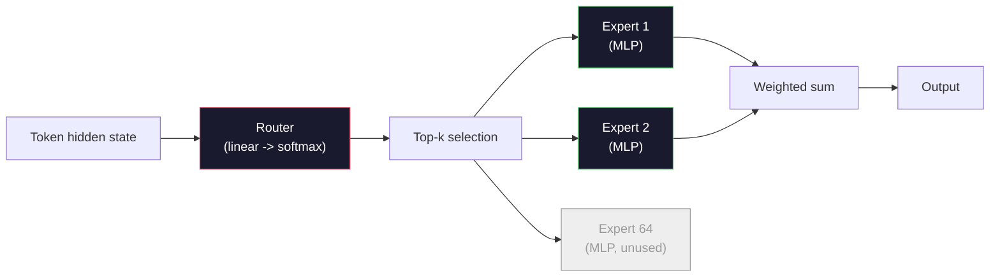

# مدل های باز: راهروهای معماری

> تو در درس 04- يه GPT-2 کوچولو رو از ابتدا ساختي مدل های باز مرزی در سال 2026 با پنج یا شش تغییر کنکریتی، همان خانواده هستند. RMSNorm به جای LayerNorm سوگل بجاي ژيلو به جای موقعیت های آموخته روپ GQA یا MLA به جای MHA کامل. مخلوط کارشناسان در مقیاس ریاضیاتی که شما قبلاً می دانید 95 درصد از آنها را پوشش می دهد. این درس Llama 3، DeepSeek-V3، Mixtral، Qwen و Gemma را در کنار هم می خواند و خط دقیق هر معماری را نام می دهد.

**Type:** Learn
**Languages:** Python (stdlib)
**Prerequisites:** Phase 10, Lessons 04, 05, 12 (Pre-training, Scaling, Inference)
**Time:** ~45 minutes

## اهداف یادگیری

- config.json Llama 3، Mistral، Mixtral، Gemma 2، Qwen 2.5 و DeepSeek-V3 را بخوانید و هر زمینه را توضیح دهید
- تغییر معماری خاص هر مدل در مقایسه با GPT-2 Small را نام ببرید و آن را از اصول اول توجیه کنید
- تعداد پارامترهای محاسبه، اندازه کش KV و حافظه فعال سازی برای هر مدل باز از پیکربندی آن تنها
- برای یک هدف انتشار، مدل باز مناسب را انتخاب کنید با توجه به محدودیت های تاخیر، حافظه و قابلیت

## مشکل

در درس 04 تو 350 سطر از نمپی نوشتی و مدل شکل GPT-2 داشتی. گزارش فنی 200 صفحه ای در Llama 3 405B وجود دارد. غريزه تو اينه که اين حيوانات متفاوت هستن نه، نه، نه، نه، نه، نه، نه، نه، نه، نه، نه، نه، نه، نه، نه، نه، نه، نه، نه، نه، نه، نه، نه، نه، نه، نه، نه، نه، نه، نه، نه، نه، نه، نه، نه، نه، نه، نه، نه، نه، نه، نه، نه، نه، نه، نه، نه، نه، نه، نه، نه، نه، نه، نه، نه، نه، نه، نه، نه، نه، نه، نه، نه، نه، نه، نه، نه، نه، نه، نه، نه، نه، نه، نه، نه، نه، نه، نه، نه، نه، نه، نه، نه، نه، نه، نه، نه، نه، نه، نه، نه، نه، نه، نه، نه، نه، نه، نه، نه، نه، نه، نه، نه، نه، نه، نه، نه، نه، نه، نه، نه، نه، نه، نه، نه، نه، نه، نه، نه، نه، نه، نه، نه، نه، نه، نه، نه، نه، نه، نه، نه، نه، نه، نه، نه، نه، نه، نه، نه، نه، نه، نه، نه، نه، نه، نه، نه، نه. 200 صفحه همان شی را با پنج یا شش اصلاحات با انگیزه خوب و همچنین هزار جزئیات پیاده سازی در مورد مقیاس بندی توصیف می کنند. اسکلت -- گنجانده شدن، بلوک های ترانسفورماتور، توجه، MLP، نورم، سر -- بدون تغییر است.

این درس یک تفاوت است. برای هر خانواده اصلی مدل باز، ما دقیقاً آنچه را از GPT-2 تغییر داده اند، چرا و چه هزینه ای دارد را لیست می کنیم. وقتی شما کار را تمام کردید می توانید یک کارت مدل جدید را بخوانید و آن را به طور ذهنی به خط اصلی GPT-2 ترجمه کنید.

در واقع، وقتی Meta Llama 5 یا DeepSeek V4 را منتشر می کند، نیازی به یک مدل ذهنی جدید نخواهید داشت. شما به پیکربندی نگاه می کنید، ببینید کدام یک از دکمه های شناخته شده حرکت می کنند و می دانید پیامدهای پایین جریان چیست. معماری های 2026 یک جعبه ابزار محدود هستند. هر مدل جدید زیر مجموعه ای متفاوت را انتخاب می کند.

## مفهوم

### هسته ی تغییر ناپذیر

همه مدل های باز autoregressive مشترک هستند:

- ماتریس گنجانیدن توکن (سائز vocab_size x hidden_dim).
- دسته بندی بلوک های N دیکودر: نورم، خود توجه، باقیمانده، نورم، MLP، باقیمانده.
- استاندارد نهایی و سر خطی که به اندازه vocab_size (معمولا با وزن با گنجانده شده) پیش بینی می شود.
- ماسک علتي، از دست دادن ترفند هاي متقاطع بعدی

اين شکليه، بقيه دستگيرها

### شش گره ای که در واقع حرکت می کنند

در هر مدل باز مرز 2024-2026، همان شش انتخاب طراحی بارها و بارها انتخاب می شود:

1. **Normalization.**LayerNorm -> RMSNorm
2. **Positional encoding.**مطلقه آموخته -> RoPE (به علاوه انواع: YaRN، NTK).
3. **Activation.**GELU -> SwiGLU (یا GeGLU).
4. **Attention head sharing.**MHA -> GQA -> MQA -> MLA
5. **Dense vs sparse MLP.**کثافت -> مخلوط متخصص
6. **Pre-norm placement.**قبل از نورم باقی می ماند، بعد از نورم رفته

همه چیز دیگر (جدول زمان یادگیری، ترکیب داده ها، اندازه دسته، طول زمینه) در پیکربندی آموزش زندگی می کند، نه معماری. شش دکمه.

### دکمه 1: RMSNorm

LayerNorm میانگین را از دست می دهد، به std، مقیاس ها و تغییرات تقسیم می شود. RMSNorm فقط مقیاس را حفظ می کند:

```
RMSNorm(x) = x / sqrt(mean(x^2) + eps) * gamma
```

هیچ معادلات معادل. هیچ تعصب. یک ماتمل کمتر در هر توکن. ژانگ و سنریچ (2019) استدلال کردند که با LayerNorm در ترجمه ماشین مطابقت دارد در حالی که 10٪ سریعتر است. هر مدل باز مدرن آن را اجرا می کند.

هزینه: هیچ. مزایای: بهره برداری کوچک، کد ساده تر.

### دکمه دوم: RoPE

گنجانده شدن موقعیت های آموخته شده یک جدول جستجوی 1024 در GPT-2 بود. زمینه 1025 از پایان جدول خارج شده است. مدل ها نمی توانند فراتر از طول تمرین خود را خارج کنند.

نصب موقعیت چرخش (RoPE, Su et al. 2021) با چرخش هر ویکتور Q و K در جفت قبل از محصول نقطه توجه موقعیت را تزریق می کند. زاویه چرخش یک تابع تعیین کننده موقعیت است، بنابراین هیچ چیز یاد گرفته و چیزی برای بیکار شدن نیست. با ترفند های مقیاس بندی (ترپولاسیون آگاه از NTK، YaRN) ، یک مدل آموزش دیده در زمینه 8k می تواند با کاهش دقت متوسط به 128k در نتیجه گیری گسترش یابد.

```
q_rotated = rotate(q, angle(pos))
k_rotated = rotate(k, angle(pos))
score = q_rotated . k_rotated
```

هر Llama، Mistral، Qwen، DeepSeek و Gemma از RoPE استفاده می کنند. Gemma 2 از یک هیبرید استفاده می کند (RoPE در اکثر لایه ها، توجه پنجره های شیفتی محلی در دیگران).

### دکمه سوم: SwiGLU

MLP GPT-2`x -> gelu(xW1 + b1) -> (...)W2 + b2`SwiGLU (Shazeer 2020) فعال سازی را با یک محصول بسته جایگزین می کند:

```
SwiGLU(x) = (xW1) * sigmoid(xW1) * xV
```

دو طرح متوازی به جای یک، با فعال سازی سوئیس بسته شده است. به طور تجربی قوی تر در پیچیدگی هر پارامتر. Llama 2 آن را اتخاذ کرد، همه دنبال کردند. اندازه پنهان MLP معمولاً تنظیم می شود تا تعداد پارامتر کل با MLP کثیف اصلی مطابقت داشته باشد: اگر GPT-2 استفاده شد`ff_dim = 4 * hidden`, SwiGLU استفاده می کند`ff_dim = (2/3) * 4 * hidden = 8/3 * hidden`. .

### گره چهارم: اشتراک گذاری توجه

GPT-2 استفاده شده**Multi-Head Attention (MHA)**: هر سر طرح Q، K، V خودش رو داره

**Multi-Query Attention (MQA, Shazeer 2019)**یک K و یک V را در تمام سرها تقسیم می کند. KV cache را با num_heads کاهش می دهد، که در یک مدل معمولی 12x تا 32x کاهش می یابد. دقت کمی در معیار های سخت کاهش می یابد.

**Grouped-Query Attention (GQA, Ainslie et al. 2023)**در این حالت، G گروه های Q یک K و یک V را به اشتراک می گذارند. Llama 3 8B از GQA با 32 Q سر و 8 KV سر استفاده می کند (G=8), بنابراین KV cache 4x نسبت به MHA کامل کاهش می یابد.

**Multi-Head Latent Attention (MLA, DeepSeek 2024)**K و V را به یک خط پنهان مشترک پایین فشار می دهد و آنها را به سمت بالا به صورت سر باز می کند. علاوه بر این ، KV را به صورت پیش بینی کاهش می دهد و در عین حال بیانگرایی را در هر سر حفظ می کند. DeepSeek-V2 و V3 برای عملکرد طولانی مدت خود به این موضوع متکی هستند.

| Scheme | KV Heads | KV Cache | Accuracy |
|--------|----------|----------|----------|
| MHA    | num_heads | full | best |
| GQA    | num_groups (G < num_heads) | num_heads / G reduction | near-MHA |
| MQA    | 1 | num_heads reduction | small hit |
| MLA    | latent, per-head decompression | smaller than MQA | near-MHA |

برای هر مدل بالاتر از پارامترهای ~ 13B، GQA یا MLA به طور موثر اجباری است. MHA کامل در مقیاس یک فاجعه کیش KV است.

### گره 5: مخلوط کردن کارشناسان

یک MLP کثیف تمام پارامترهای خود را برای هر توکن فعال می کند. یک MLP MoE دارای کارشناسان K در هر بلوک و یک روتر است که کارشناسان top-k را برای هر توکن انتخاب می کند (معمولا top-2). تنها وزن این کارشناسان یک گذرنامه پیش رو برای آن توکن را می بینند.

```
router_logits = xW_r
indices, weights = top_k(router_logits, k=2)
output = sum_i weights[i] * expert[indices[i]](x)
```

جذابیت: شما می توانید 64 متخصص با اندازه 7B هر یک داشته باشید (به همین دلیل تعداد پارامترهای کل بسیار زیاد است) در حالی که فقط 2 نفر از آنها را در هر توکن اجرا می کنید (به همین دلیل محاسبه هر توکن با مدل 7B کثیف مطابقت دارد). Mixtral 8x7B دارای پارامترهای کل 47B است اما فقط 13B را در هر توکن فعال می کند. DeepSeek-V3 دارای 671B پارامترهای کل است اما فقط 37B را در هر توکن فعال می کند.



مزایایی: همان محاسبه، پارامترهای بیشتر، ظرفیت بهتر. معایب: حافظه متخصص هنوز باید در جایی زندگی کند (به همین دلیل سرویس نیاز به VRAM بیشتر از یک معادل کثیف دارد) ، تعادل بار روتر سخت است و تنظیم دقیق روتر در طول تعادل زمینه تحقیقاتی خود است.

### دکمه 6: قبل از نورم باقی می ماند

در این حالت، یک نوع از سیستم های ترانسفورماتور، یک نوع از سیستم های ترانسفورماتور هستند که در آن یک نوع از سیستم های ترانسفورماتور هستند.

### تفاوت مدل به مدل

اینجا میز است که تمام این بتن را می سازد.

| Model | Year | Total Params | Active Params | Norm | Activation | Position | Attention | MoE | Context |
|-------|------|-------------|---------------|------|-----------|----------|-----------|-----|---------|
| GPT-2 Small | 2019 | 124M | 124M | LayerNorm | GELU | Learned | MHA (12 heads) | no | 1k |
| Llama 3 8B | 2024 | 8B | 8B | RMSNorm | SwiGLU | RoPE | GQA (32/8) | no | 128k |
| Llama 3 70B | 2024 | 70B | 70B | RMSNorm | SwiGLU | RoPE | GQA (64/8) | no | 128k |
| Llama 3 405B | 2024 | 405B | 405B | RMSNorm | SwiGLU | RoPE | GQA (128/16) | no | 128k |
| Mistral 7B | 2023 | 7.2B | 7.2B | RMSNorm | SwiGLU | RoPE | GQA | no | 32k |
| Mixtral 8x7B | 2023 | 47B | 13B | RMSNorm | SwiGLU | RoPE | GQA | yes (8 experts, top-2) | 32k |
| Gemma 2 9B | 2024 | 9B | 9B | RMSNorm (pre+post) | GeGLU | RoPE + sliding | GQA | no | 8k |
| Qwen 2.5 72B | 2024 | 72B | 72B | RMSNorm | SwiGLU | RoPE (YaRN) | GQA (64/8) | no | 128k |
| DeepSeek V2 236B | 2024 | 236B | 21B | RMSNorm | SwiGLU | RoPE | MLA | yes (160 experts, top-6) | 128k |
| DeepSeek V3 | 2024 | 671B | 37B | RMSNorm | SwiGLU | RoPE | MLA | yes (256 experts, top-8) | 128k |

ستون ها را اسکن کنید. RMSNorm جهانی است. SwiGLU یا پسر عموی GeGLU آن جهانی است. RoPE جهانی است. GQA جهانی است بالاتر از 7B به جز زمانی که توسط MLA جایگزین می شود. MoE تفاوت در انتهای بالا است.

### خواندن یک config.json

تنظیم Llama 3 8B:

```
{
  "hidden_size": 4096,
  "intermediate_size": 14336,
  "num_hidden_layers": 32,
  "num_attention_heads": 32,
  "num_key_value_heads": 8,
  "max_position_embeddings": 131072,
  "rope_theta": 500000.0,
  "rms_norm_eps": 1e-5,
  "vocab_size": 128256
}
```

هر زمینه با چیزی که قبلاً اجرا کرده اید مطابقت دارد.

- `hidden_size`: ابعاد ادغام
- `intermediate_size`: MLP پوشیده اندازه (3.5x پوشیده -- SwiGLU ریاضی).
- `num_hidden_layers`: عمق سنگ
- `num_attention_heads`: سر های Q
- `num_key_value_heads`: سرای KV (GQA).
- `max_position_embeddings`: طول زمینه آموزش
- `rope_theta`متاسکال آن را از 10k به 500k برای استخراج متن طولانی.
- `rms_norm_eps`: ثبات عددی
- `vocab_size`: توکن ها

تنها از این پارامترها، KV cache و حافظه فعال سازی اوج را محاسبه می کنید.`code/main.py`برای فرمول های دقیق.

### بودجه حافظه فعال سازی

فعال سازی ها بر حافظه آموزشی بالاتر از چند میلیارد پارامتر تسلط دارند. قاعده انگشت برای پیش از آموزش (با کنترل گرادینت):

```
activation_mem ~ batch_size * seq_len * hidden_size * num_layers * bytes_per_element
```

برای Llama 3 8B در دسته 1، seq 8192, BF16, 32 لایه، پنهان 4096: حدود 8 جی بی فقط برای فعال سازی با چکپوائنتینگ، 40 جی بی بدون. به همین دلیل توجه فلاش و توجه حلقه مهم است - آنها محاسبه توجه را دوباره می نویسند تا فعال سازی مناسب باشد.

### بودجه KV Cache

برای نتیجه گیری در حداکثر زمینه:

```
kv_cache = 2 * num_layers * num_kv_heads * head_dim * max_seq_len * bytes_per_element
```

Llama 3 8B در زمینه 128k، BF16، head_dim = پنهان / num_heads = 128:
`2 * 32 * 8 * 128 * 131072 * 2 = 17.2 GB`در هر تسلسل

وزن 8B 16 جی بی در BF16 است. حافظه حافظه KV برای یک سری 128k بزرگتر از وزن است. این فشار حافظه است که تحقیقات GQA، MLA و KV را هدایت می کند.

### وقتی هر مدل برنده می شود

- **Single 80GB GPU, no MoE**: لاما 3 8B، میسترال 7B، جما 2 9B. آسان به خدمت، ابزار گسترده.
- **Single node (8x80GB), big capacity**: لاما 3 70B، کوون 2.5 72B. بالاترين ظرفیت بازي چگال
- **Biggest open capability, accept MoE complexity**: DeepSeek V3، Mixtral 8x22B. بهترین قابلیت در هر FLOP فعال.
- **Long-context needs**: Llama 3 (128k با مقیاس RoPE) ، DeepSeek (منافع MLA).
- **Low-latency serving**: Gemma 2 9B (چندوی پرتاب، محاسبه متن طولانی را قطع می کند).

```figure
rmsnorm-vs-layernorm
```

## آن را بسازید

کد درس یک ماشین حساب است. به هر config.json، آن را چاپ می کند پارامتر شمارش توسط قطعه، KV حافظه در حداکثر زمینه، SwiGLU MLP نسبت، و یک حکم کوتاه در معماری (بساط / GQA / MLA / MoE).

```python
config = {
    "hidden_size": 4096, "intermediate_size": 14336,
    "num_hidden_layers": 32, "num_attention_heads": 32,
    "num_key_value_heads": 8, "vocab_size": 128256,
    "max_position_embeddings": 131072,
}
```

اسکریپت میدان معماری را به لحاظ زمینه انجام می دهد، شمارش پارامای را برای گنجانیدن، توجه (با کاهش GQA) ، MLP (با گسترش SwiGLU) ، قوانین لایه و سر محاسبه می کند. سپس حافظه کش KV را در طول زمینه مشخص شده محاسبه می کند و خلاصه ای چاپ می کند.

ببین`code/main.py`برای اجرای آن.

## ازش استفاده کن

ماشین حساب را در اسکریپت پیکربندی های Llama 3 8B، Mistral 7B، Mixtral 8x7B و DeepSeek V3 اجرا کنید. تجزیه پارامترها را مقایسه کنید. توجه کنید که مدل های MoE تعداد پارامترهای کل را دارند که مدل های کثیف را کوچک می کند اما تعداد پارامترهای فعال که اغلب کوچکتر است. توجه کنید که کیش KV DeepSeek V3 کوچک تر از Llama 3 405B است با وجود داشتن پارامترهای کل بیشتر - که MLA در عمل است.

سپس یک پیکربندی برای هر مدل ای که در محل دارید وصل کنید، خلاصه را بخوانید و تصمیم بگیرید که آیا آن را با GPU شما مطابقت می دهد.

## -باده

این درس به ما کمک می کند`outputs/skill-open-model-picker.md`. با توجه به هدف انتشار (نوع GPU، VRAM، طول زمینه، بودجه تاخیر) و یک مشخصات کار (چات، کد، استدلال، زمینه طولانی) ، آن را توصیه می کند یک مدل باز، یک طرح کوانتاسیون از درس 11 و یک استیک نتیجه گیری از درس 12 با استدلال صریح در مورد شش دکمه معماری.

## تمرینات

1. Qwen 2.5 72B را از HuggingFace بخوانید. پارامترهای کل را از ابتدا محاسبه کنید. با ارزش HF گزارش شده مقایسه کنید و مشخص کنید که هر دلتا از کجا می آید (گروه کم، فاکتور اشتراک KV، و غیره).

2. DeepSeek V3 از 256 متخصص با مسیر 8 بالا استفاده می کند. نسبت کارشناسان فعال به کل کارشناسان را محاسبه کنید و با 2 از 8 در میان Mixtral 8x7B مقایسه کنید. تغییر از کم (25%) به کم (3%) در مورد ظرفیت در هر FLOP چه معنی دارد؟

3. در FP8 این مقدار نصف تعداد BF16 است. چند ردیف موازی را می توانید در یک گره 8xH100 واحد (80GB هر یک = 640GB کل، ناقص وزن حافظه) خدمت کنید؟

4. Gemma 2 لایه های توجه کامل و توجه پنجره های حرکت پذیر را متناوب می کند. ریاضیات را برای کش KV بنویسید وقتی نیمی از لایه ها از پنجره حرکت پذیر 4096 توکن به جای زمینه کامل استفاده می کنند. این چقدر حافظه را در 8k کل زمینه ذخیره می کند؟

5. یک مدل جدید باز مرز پیدا کنید که پس از نوشتن این درس منتشر شد. مشخص کنید که کدام یک از شش دکمه را انتخاب کرده و آیا دکمه هفتم را معرفی کرده است. برنامه درسی در لحظه ای که یک معماری جدید به کار می آید، به نظر می رسد که از زمان گذشته است. هدف این است که میز خود را بدون بازسازی مدل ذهنی خود به روز کنید.

## اصطلاحات کلیدی

| Term | What people say | What it actually means |
|------|----------------|----------------------|
| RMSNorm | "LayerNorm without the mean" | Normalize by root mean square only, with a learned scale — cheaper and comparable to LayerNorm |
| RoPE | "Rotary positions" | Rotate each Q and K vector in 2D pairs by an angle that depends on position — extrapolates beyond training length with scaling tricks |
| SwiGLU | "The new MLP activation" | Gated linear unit with Swish: `(xW1) * sigmoid(xW1) * xV` — standard in every 2024+ open model |
| GQA | "Middle ground attention" | Grouped-Query Attention: G groups of Q heads share one K and one V head — shrinks KV cache without MQA's accuracy hit |
| MLA | "DeepSeek's attention" | Multi-Head Latent Attention: compress K/V into a shared low-rank latent, decompress per head — smallest KV cache for large models |
| MoE | "Sparse experts" | Mixture of Experts: N MLPs per block, router picks top-k per token — huge total params, small active params |
| Top-k routing | "Pick k experts per token" | The router computes a score per expert and activates the k highest — typical k is 2 (Mixtral) to 8 (DeepSeek) |
| YaRN | "Stretch RoPE" | Yet another RoPE extension — interpolates rotary angles to extend context from 8k to 128k+ at inference time |
| Sliding-window attention | "Don't attend to everything" | Each token attends only to the last W tokens — caps attention cost at O(W) per token, used in Gemma 2 and early Mistral |
| Active params | "What runs per token" | For MoE models, the parameter count that sees a forward pass per token (much smaller than total params) — governs per-token FLOPs |

## خواندن بیشتر

- [Dubey et al., 2024 -- "The Llama 3 Herd of Models"](https://arxiv.org/abs/2407.21783)-- مرجع معماری و آموزش برای خانواده ی کثیف Llama 3
- [DeepSeek-AI, 2024 -- "DeepSeek-V3 Technical Report"](https://arxiv.org/abs/2412.19437)-- MLA به علاوه تعادل بار بدون ضرر دستی به علاوه 671B MoE
- [Jiang et al., 2024 -- "Mixtral of Experts"](https://arxiv.org/abs/2401.04088)-- کاغذی مدل باز و متمایز
- [Su et al., 2021 -- "RoFormer: Enhanced Transformer with Rotary Position Embedding"](https://arxiv.org/abs/2104.09864)-- کاغذ RoPE
- [Shazeer, 2020 -- "GLU Variants Improve Transformer"](https://arxiv.org/abs/2002.05202)- سوگل، گگل و دوستان
- [Ainslie et al., 2023 -- "GQA: Training Generalized Multi-Query Transformer Models"](https://arxiv.org/abs/2305.13245)-- مقاله GQA
- [Gemma 2 Team, 2024 -- "Gemma 2: Improving Open Language Models at a Practical Size"](https://arxiv.org/abs/2408.00118)-- ترکیبی از توجه کامل + حرکت، قبل + بعد از استاندارد
- [Qwen Team, 2024 -- "Qwen 2.5 Technical Report"](https://arxiv.org/abs/2412.15115)-- توسعه زمینه ی ی آر این و دستورات آموزش در زمینه ی طولانی
