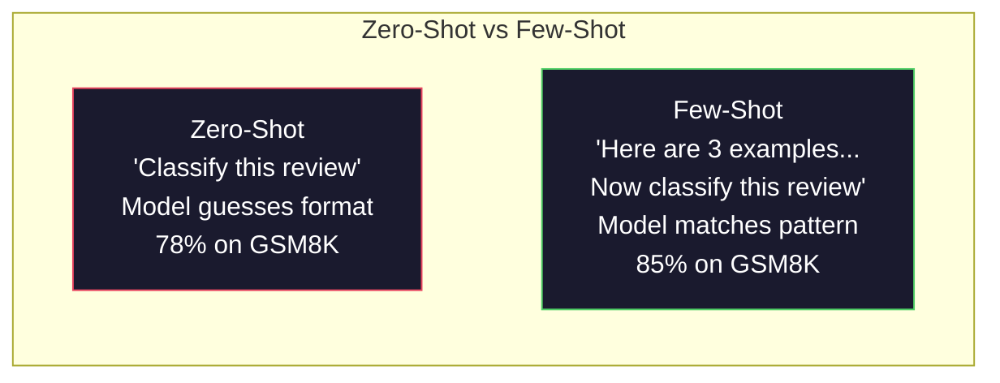
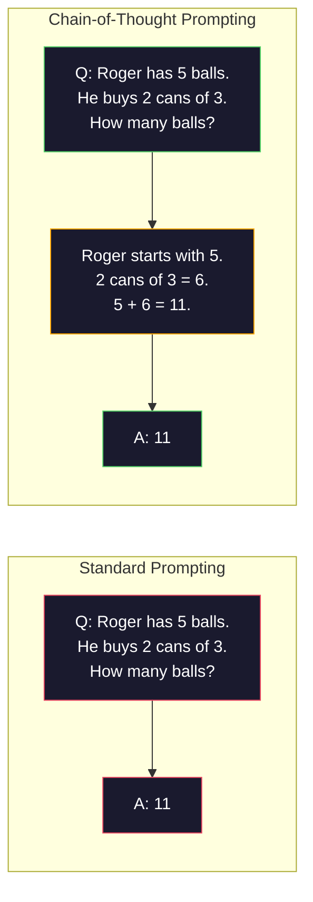
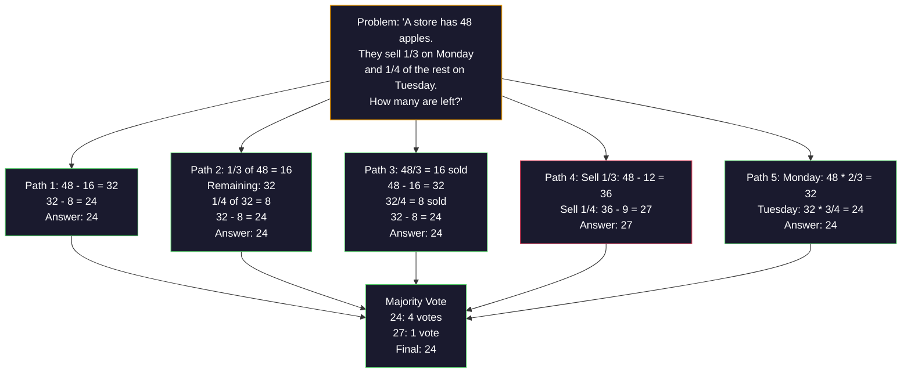
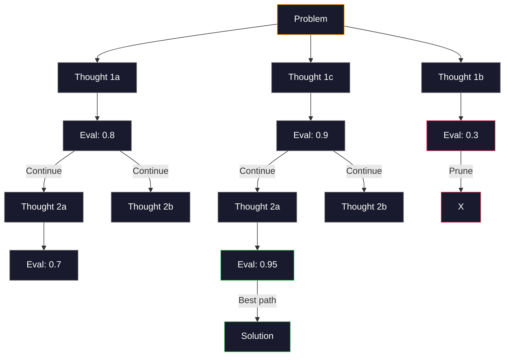

# چند تا گلوله، زنجیره فکر، درخت فکر

> به یک مدل گفتن چه کاری باید انجام دهد، تحریک کردن است. نشان دادن نحوه تفکر به آن مهندسی است. فاصله بین 78 تا 91 درصد دقت در یک مدل، همان کار، همان داده ها، یک مدل بهتر نیست. این یک استراتژی استدلال بهتر است.

**Type:** Build
**Languages:** Python
**Prerequisites:** Lesson 11.01 (Prompt Engineering)
**Time:** ~45 minutes

## اهداف یادگیری

- پیاده سازی چند عکس با انتخاب و فرمت نمونه نمایش هایی که دقت کار را به حداکثر می رساند
- استفاده از استدلال زنجیره ای برای بهبود دقت در مشکلات چند مرحله ای مانند مشکلات کلمات ریاضی
- یک سوال درختی فکر بسازید که راه های استدلال چندگانه را بررسی کند و بهترین را انتخاب کند
- اندازه گیری بهبود دقت از صفر شات در مقابل چند شات در برابر CoT در یک معیار استاندارد

## مشکل

شما یک برنامه آموزش ریاضی ایجاد می کنید. پیام شما می گوید: "این مشکل کلمه را حل کنید". GPT-5 در GSM8K، معیار ریاضیات استاندارد مدرسه ی ابتدایی 94 درصد از زمان درست است. شما فکر می کنید که قبلاً به اوج رسیده اید. شما نمی توانید  زنجیره فکر هنوز هم 3-4 امتیاز اضافه می کند.

پنج کلمه اضافه کنید -- "بگذارید به مرحله به مرحله فکر کنیم" -- و دقت به ۹۱ درصد می رسد. چند نمونه کار شده اضافه کنید و به ۹۵ درصد می رسد. همان مدل. همان دمای. همان هزینه API. تنها تفاوت این است که شما به مدل کاغذ خراش داده اید.

این یک هک نیست. این کار استدلال است. انسان ها مشکلات چند مرحله ای را در یک پرش ذهنی حل نمی کنند. همچنین ترانسفورماتورها. هنگامی که شما یک مدل را مجبور به تولید توکن های میانگین می کنید، این توکن ها بخشی از زمینه برای توکن بعدی می شوند. هر مرحله استدلال بعدی را تغذیه می کند. مدل به معنای واقعی کلمه راه خود را به پاسخ محاسبه می کند.

اما "فکر کنید قدم به قدم" آغاز است نه پایان. اگر شما پنج مسیر استدلال را نمونه کنید و رای اکثریت را بگیرید؟ اگر شما اجازه دهید که مدل درخت امکانات را کشف کند، ارزیابی و شاخه ها را برش دهد؟ اگر شما استدلال را با استفاده از ابزار به هم ببندید؟ اینها فرضیه نیستند. این تکنیک های منتشر شده با پیشرفت های اندازه گیری شده هستند، و شما همه آنها را در این درس ایجاد خواهید کرد.

## مفهوم

### صفر شات در مقابل چند شات: وقتی که مثال ها از دستورالعمل ها بر می گردند

به عنوان مثال، یک نمونه از نمونه ها به صورت مثال به صورت مثال به صورت مثال به صورت مثال به صورت مثال به صورت مثال به صورت مثال به صورت مثال به صورت مثال به صورت مثال به صورت مثال به صورت مثال به صورت مثال به صورت مثال به صورت مثال به صورت مثال به صورت مثال به صورت مثال به صورت مثال به صورت مثال به صورت مثال به صورت مثال به صورت مثال به صورت مثال به صورت مثال به صورت مثال به صورت مثال به صورت مثال به صورت مثال به صورت مثال به صورت مثال به صورت مثال به صورت مثال به صورت مثال به صورت مثال به صورت مثال به صورت مثال به صورت مثال به صورت مثال به صورت مثال به صورت مثال به صورت مثال به صورت مثال به صورت مثال به صورت مثال به صورت مثال به صورت مثال به صورت مثال به صورت مثال به صورت مثال به صورت مثال به صورت مثال به صورت مثال به صورت مثال به صورت مثال به صورت مثال به صورت مثال به صورت مثال به صورت مثال به صورت مثال به صورت مثال به صورت مثال به صورت مثال به صورت مثال به صورت مثال به صورت مثال به صورت مثال به صورت مثال به صورت مثال به صورت مثال به صورت مثال به صورت مثال به صورت مثال به صورت مثال به صورت مثال به صورت مثال به صورت مثال به صورت مثال به صورت مثال به صورت مثال به صورت مثال به صورت مثال به صورت مثال به صورت مثال به صورت مثال به صورت مثال به صورت مثال به صورت مثال به صورت مثال به صورت مثال به صورت مثال به صورت مثال به صورت مثال به صورت مثال به صورت مثال به صورت مثال به صورت مثال به صورت مثال به صورت مثال به صورت مثال به صورت مثال به صورت مثال به صورت مثال به صورت مثال به صورت مثال به صورت مثال به صورت مثال به صورت مثال به صورت مثال به صورت مثال به صورت مثال به صورت مثال به صورت مثال به صورت مثال به صورت مثال به صورت مثال به صورت مثال به صورت مثال به صورت مثال به صورت مثال به صورت مثال به صورت مثال به صورت مثال به صورت مثال به صورت مثال به صورت صورت صورت صورت صورت صورت مثال به صورت صورت صورت صورت صورت صورت مثال به صورت صورت صورت صورت صورت صورت صورت صورت صورت صورت صورت صورت صورت صورت صورت صورت صورت صورت صورت صورت صورت صورت صورت صورت صورت صورت صورت صورت صورت صورت صورت صورت صورت صورت صورت صورت صورت صورت صورت صورت صورت صورت صورت صورت صورت صورت صورت صورت صورت صورت صورت صورت صورت صورت صورت صورت صورت صورت صورت صورت صورت صورت صورت صورت صورت صورت صورت صورت صورت صورت صورت صورت صورت صورت صورت صورت صورت صورت صورت صورت صورت صورت صورت صورت صورت صورت صورت صورت صورت صورت صورت صورت صورت صورت صورت صورت صورت صورت صورت صورت صورت صورت صورت صورت صورت صورت صورت صورت صورت

وی و همکاران (2022) این را در 8 معیار اندازه گیری کردند. برای کارهای ساده مانند طبقه بندی احساسات، صفر شات و چند شات انجام شده در حدود 2٪ از یکدیگر. برای کارهای پیچیده مانند ریاضیات چند مرحله ای و استدلال نمادین، چند شات دقت 10-25٪ بهبود یافته است.

بینش: نمونه ها دستورالعمل های فشرده شده هستند. به جای توصیف فرمت خروجی، آن را نشان می دهید. به جای توضیح فرآیند استدلال، آن را نشان می دهید. مدل الگوی با مثال ها مطابقت دارد تا اینکه دستورالعمل های انتزاعی را تفسیر کند.



**When few-shot wins:**وظایف حساس به فرمت، طبقه بندی، استخراج ساختار یافته، جارگون خاص دامنه، هر کاری که مدل نیاز به مطابقت با یک الگوی خاص دارد.

**When zero-shot wins:**سوالات ساده واقعی، وظایف خلاقانه ای که مثال ها خلاقیت را محدود می کنند، وظایفی که یافتن مثال های خوب سخت تر از نوشتن دستورالعمل های خوب است.

### نمونه انتخاب: ضربات مشابه تصادفی

همه نمونه ها یکسان نیستند. انتخاب نمونه هایی مشابه ورودی هدف از انتخاب تصادفی 5 تا 15٪ در وظایف طبقه بندی بهتر است (Liu و همکارانش، 2022) . سه اصل:

1. **Semantic similarity**: نمونه هایی را انتخاب کنید که نزدیک ترین ورودی را در فضای گنجانده سازی قرار می دهند
2. **Label diversity**: تمام دسته های خروجی را در نمونه های خود پوشش دهید
3. **Difficulty matching**: با سطح پیچیدگی مشکل هدف مطابقت دارد

تعداد مثال های مطلوب برای اکثر وظایف 3-5 است. در زیر 3، مدل برای استخراج الگوی کافی سیگنال ندارد. در بالای 5، شما به بازگشت های کاهش یافته و ضایع پنجره های زمینه ضربه بزنید. برای طبقه بندی با بسیاری از برچسب ها، از یک مثال در هر برچسب استفاده کنید.

### زنجیره تفکر: ارائه مدل های کاغذ سکریچ

به عنوان مثال، در سال 2022، وی و همکارانش در Google Brain، پیشنهادات زنجیره تفکر را معرفی کردند. ایده ساده است: به جای اینکه از مدل فقط پاسخ بخواهید، از آن بخواهید که ابتدا مراحل استدلال خود را نشان دهد.



چرا این کار به صورت مکانیکی انجام می شود؟ هر توکن که یک ترانسفورماتور تولید می کند، به زمینه توکن بعدی تبدیل می شود. بدون CoT، مدل باید تمام استدلال را به حالت پنهان یک گذرگاه پیشروی واحد فشرده کند. با CoT، مدل محاسبات میانگین را به عنوان توکن ها خارج می کند. هر توکن استدلال عمق محاسبات موثر را گسترش می دهد.

**GSM8K benchmarks (grade-school math, 8.5K problems):**

| Model | Zero-Shot | Zero-Shot CoT | Few-Shot CoT |
|-------|-----------|---------------|--------------|
| GPT-4o | 78% | 91% | 95% |
| GPT-5 | 94% | 97% | 98% |
| o4-mini (reasoning) | 97% | — | — |
| Claude Opus 4.7 | 93% | 97% | 98% |
| Gemini 3 Pro | 92% | 96% | 98% |
| Llama 4 70B | 80% | 89% | 94% |
| DeepSeek-V3.1 | 89% | 94% | 96% |

**Note on reasoning models.**مدل هایی مانند O-series (o3 ، o4 مینی) و DeepSeek-R1 قبل از ارسال پاسخ خود زنجیره فکر را در داخل اجرا می کنند. اضافه کردن "بگذارید به مرحله به مرحله فکر کنیم" به یک مدل استدلال فرعی است و گاهی اوقات معکوس است.

دو طعم کوت:

**Zero-shot CoT**در این مقاله، در مقاله "کودجیما" و همکارانش در سال 2022 نشان داده اند که این جمله دقیق تر می شود در تمام وظایف ریاضی، عقل عام و استدلال نمادین.

**Few-shot CoT**: نمونه هایی را ارائه دهید که شامل مراحل استدلال می شوند. موثرتر از CoT صفر شوت است زیرا مدل شکل استدلال دقیق شما را می بیند.

**When CoT hurts**: یادآوری ساده واقعی ("پایه فرانسه چیست؟") ، طبقه بندی یک مرحله ای، وظایف که سرعت بیش از دقت اهمیت دارد. CoT 50-200 توکن هزینه های عمومی استدلال را در هر سوال اضافه می کند. برای کارهای با تولید بالا و کم پیچیدگی، این هزینه تلف شده است.

### خودآمرگی: نمونه های بسیاری، یک بار رای دهید

وانگ و همکاران (2023) خودآمرگی را معرفی کردند. بینش: یک مسیر CoT واحد ممکن است شامل اشتباهات استدلال باشد. اما اگر N مسیرهای استدلال مستقل را نمونه کنید (با استفاده از دمای > 0) و اکثریت رای را در پاسخ نهایی بگیرید، اشتباهات حذف می شوند.



خودآمرگی دقت GSM8K را از 56.5% (CoT واحد) به 74.4% با N=40 در آزمایش های اصلی PaLM 540B بهبود بخشید. در GPT-5 بهبود کمی (97 تا 98 درصد) است زیرا دقت پایه قبلا اشباع شده است. این تکنیک در مدل هایی که 60 تا 85 درصد دقت COT دارند، بهترین نقطه ای است که در آن اشتباهات یک مسیر مکرر اما سیستماتیک نیستند. برای مدل های استدلال (سیریز o، R1) خودآمرگی توسط نمونه گیری داخلی داخلی شامل می شود.

تفاوت: نمونه های N به معنای Nx هزینه API و تاخیر است. در عمل، N=5 بیشترین سود را به دست می آورد. N=3 حداقل برای یک رای معنی دار است. N > 10 برای اکثر وظایف بازده کاهش یافته است.

### درخت فکر: اکتشاف شاخه ای

یاو و همکاران (2023) درخت تفکر (ToT) را معرفی کردند. در حالی که CoT از یک مسیر استدلال خطی پیروی می کند، ToT شاخه های متعددی را بررسی می کند و ارزیابی می کند که پیش از ادامه به دنبال کننده ترین آنها هستند.



توت سه جزء داره:

1. **Thought generation**: تولید چند کاندید گام های بعدی
2. **State evaluation**: هر نامزد نمره (می تواند از خود LLM به عنوان ارزیابی کننده استفاده کند)
3. **Search algorithm**: BFS یا DFS از طریق درخت، برش شاخه های کم امتیاز

در بازی 24 (با استفاده از ریاضیات 4 عدد را ترکیب کنید تا 24 را ایجاد کنید) GPT-4 با دستور استاندارد 7.3% مشکلات را حل می کند. با CoT، 4.0% (CoT در واقع در اینجا درد می کند زیرا فضای جستجو گسترده است). با ToT، 74%.

ToT گران است. هر گره ای در درخت نیاز به LLM تماس است. یک درخت با فرقه گیری عامل 3 و عمق 3 نیاز به تا 39 LLM تماس است. آن را فقط برای مشکلات که فضای جستجو بزرگ است اما قابل ارزیابی -- برنامه ریزی، حل پازل، خلاقانه حل مشکل با محدودیت استفاده کنید.

### واکنش: فکر کردن + عمل کردن

یاو و همکاران (2022) آثار استدلال را با اقدامات ترکیب کردند. مدل بین تفکر (تولید استدلال) و عمل (دعوت به ابزار، جستجو، محاسبات) متناوب است.

```mermaid
graph LR
    Q["Question:\nWhat is the\npopulation of the\ncountry where\nthe Eiffel Tower\nis located?"]
    T1["Thought: I need to\nfind which country\nhas the Eiffel Tower"]
    A1["Action: search\n'Eiffel Tower location'"]
    O1["Observation:\nParis, France"]
    T2["Thought: Now I need\nFrance's population"]
    A2["Action: search\n'France population 2024'"]
    O2["Observation:\n68.4 million"]
    T3["Thought: I have\nthe answer"]
    F["Answer:\n68.4 million"]

    Q --> T1 --> A1 --> O1 --> T2 --> A2 --> O2 --> T3 --> F

    style Q fill:#1a1a2e,stroke:#ffa500,color:#fff
    style T1 fill:#1a1a2e,stroke:#51cf66,color:#fff
    style A1 fill:#1a1a2e,stroke:#e94560,color:#fff
    style O1 fill:#1a1a2e,stroke:#808080,color:#fff
    style T2 fill:#1a1a2e,stroke:#51cf66,color:#fff
    style A2 fill:#1a1a2e,stroke:#e94560,color:#fff
    style O2 fill:#1a1a2e,stroke:#808080,color:#fff
    style T3 fill:#1a1a2e,stroke:#51cf66,color:#fff
    style F fill:#1a1a2e,stroke:#51cf66,color:#fff
```



ReAct در کارهای فشرده دانش، عملکرد خالص CoT را از دست می دهد زیرا می تواند استدلال خود را در داده های واقعی پایه گذاری کند. در HotpotQA (پاسخ دادن به سوالات چند رک) ، ReAct با GPT-4 به 35.1% مطابقت دقیق نسبت به 29.4% برای CoT به تنهایی را به دست می آورد. قدرت واقعی این است که اشتباهات استدلال توسط مشاهدات اصلاح می شود - مدل می تواند برنامه خود را در میان اجرای بروز دهد.

ReAct پایه ای از عوامل هوش مصنوعی مدرن است. هر چارچوب عامل (LangChain، CrewAI، AutoGen) نوعی نوع حلقه تفکر عمل مشاهده را اجرا می کند. شما در مرحله 14 عوامل کامل را ایجاد خواهید کرد. این درس الگوی تحریک را پوشش می دهد.

### تنظیمات ساختاری: برچسب های XML، محدودیتی، سرگوشن

با توجه به اینکه پیام ها پیچیده تر می شوند، ساختار مانع از سردرگمی بخش های مدل می شود. سه رویکرد:

**XML tags**(با کلاود بهتر کار ميکنه، همه جا درست مياد):
```
<context>
You are reviewing a pull request.
The codebase uses TypeScript and React.
</context>

<task>
Review the following diff for bugs, security issues, and style violations.
</task>

<diff>
{diff_content}
</diff>

<output_format>
List each issue with: file, line, severity (critical/warning/info), description.
</output_format>
```

**Markdown headers**(عالمي):
```
## Role
Senior security engineer at a fintech company.

## Task
Analyze this API endpoint for vulnerabilities.

## Input
{api_code}

## Rules
- Focus on OWASP Top 10
- Rate each finding: critical, high, medium, low
- Include remediation steps
```

**Delimiters**(کمترین اما موثر):
```
---INPUT---
{user_text}
---END INPUT---

---INSTRUCTIONS---
Summarize the above in 3 bullet points.
---END INSTRUCTIONS---
```

### زنجیره ای سریع: تجزیه متناوب

برخی از وظایف برای یک پرامپت خیلی پیچیده هستند. زنجیره پرامپت آنها را به مراحل تقسیم می کند، جایی که تولید یک پرامپت به ورودی بعدی تبدیل می شود.


زنجیره ای به سه دلیل سریع تر می چرخد:

1. **Each step is simpler**: مدل یک کار متمرکز را انجام می دهد به جای همه چیز را
2. **Intermediate outputs are inspectable**: شما می توانید بین مراحل تایید و اصلاح کنید
3. **Different steps can use different models**: استفاده از یک مدل ارزان برای استخراج، یک مدل گران برای استدلال

### مقایسه عملکرد

| Technique | Best For | GSM8K Accuracy (GPT-5) | API Calls | Token Overhead | Complexity |
|-----------|----------|------------------------|-----------|----------------|------------|
| Zero-Shot | Simple tasks | 94% | 1 | None | Trivial |
| Few-Shot | Format matching | 96% | 1 | 200-500 tokens | Low |
| Zero-Shot CoT | Quick reasoning boost | 97% | 1 | 50-200 tokens | Trivial |
| Few-Shot CoT | Maximum single-call accuracy | 98% | 1 | 300-600 tokens | Low |
| Self-Consistency (N=5) | High-stakes reasoning | 98.5% | 5 | 5x token cost | Medium |
| Reasoning model (o4-mini) | Drop-in CoT replacement | 97% | 1 | hidden (2-10x internal) | Trivial |
| Tree-of-Thought | Search/planning problems | N/A (74% on Game of 24) | 10-40+ | 10-40x token cost | High |
| ReAct | Knowledge-grounded reasoning | N/A (35.1% on HotpotQA) | 3-10+ | Variable | High |
| Prompt Chaining | Complex multi-step tasks | 96% (pipeline) | 2-5 | 2-5x token cost | Medium |

تکنیک مناسب به سه عامل بستگی دارد: نیاز به دقت، بودجه تاخیر و تحمل هزینه. برای اکثر سیستم های تولید، CoT چند شات با 3 نمونه خودآمرگی عقب نشینی 90 درصد موارد استفاده را پوشش می دهد.

```figure
few-shot-curve
```

## آن را بسازید

ما یک حل مسئله ریاضی را بسازیم که به یک خط واحد ترکیب می کند که چند بار به دنبال کردن، استدلال زنجیره ای فکر و رای گیری مستقل. سپس به ستون های سخت درخت فکر اضافه می کنیم.

اجرای کامل در سال`code/advanced_prompting.py`اينها اجزای اصلي هستن

### مرحله اول: چند عکس نمونه فروشگاه

بخش اول نمونه های چند عکس را مدیریت می کند و مناسب ترین نمونه ها را برای یک مشکل خاص انتخاب می کند.

```python
GSM8K_EXAMPLES = [
    {
        "question": "Janet's ducks lay 16 eggs per day. She eats three for breakfast every morning and bakes muffins for her friends every day with four. She sells every egg at the farmers' market for $2. How much does she make every day at the farmers' market?",
        "reasoning": "Janet's ducks lay 16 eggs per day. She eats 3 and bakes 4, using 3 + 4 = 7 eggs. So she has 16 - 7 = 9 eggs left. She sells each for $2, so she makes 9 * 2 = $18 per day.",
        "answer": "18"
    },
    ...
]
```

هر مثال سه بخش دارد: سوال، زنجیره استدلال و پاسخ نهایی. زنجیره استدلال چیزی است که یک مثال چند شوت معمولی را به یک مثال چند شوت CoT تبدیل می کند.

### مرحله دوم: ساخت یک سریال

سازنده ی پیامک های سیستم، چند نمونه با زنجیره های استدلال و سوال هدف را به یک پیامک واحد جمع می کند.

```python
def build_cot_prompt(question, examples, num_examples=3):
    system = (
        "You are a math problem solver. "
        "For each problem, show your step-by-step reasoning, "
        "then give the final numerical answer on the last line "
        "in the format: 'The answer is [number]'."
    )

    example_text = ""
    for ex in examples[:num_examples]:
        example_text += f"Q: {ex['question']}\n"
        example_text += f"A: {ex['reasoning']} The answer is {ex['answer']}.\n\n"

    user = f"{example_text}Q: {question}\nA:"
    return system, user
```

محدودیت فرمت ("جواب [عدد] است") مهم است. بدون آن، خودآمرگی نمی تواند پاسخ ها را در نمونه ها استخراج و مقایسه کند.

### مرحله سوم: رای گیری مستقل

راه های استدلال N را نمونه کنید و پاسخ اکثریت را بگیرید.

```python
def self_consistency_solve(question, examples, client, model, n_samples=5):
    system, user = build_cot_prompt(question, examples)

    answers = []
    reasonings = []
    for _ in range(n_samples):
        response = client.chat.completions.create(
            model=model,
            messages=[
                {"role": "system", "content": system},
                {"role": "user", "content": user}
            ],
            temperature=0.7
        )
        text = response.choices[0].message.content
        reasonings.append(text)
        answer = extract_answer(text)
        if answer is not None:
            answers.append(answer)

    vote_counts = Counter(answers)
    best_answer = vote_counts.most_common(1)[0][0] if vote_counts else None
    confidence = vote_counts[best_answer] / len(answers) if best_answer else 0

    return best_answer, confidence, reasonings, vote_counts
```

دمای 0.7 مهم است. در دمای 0.0، تمام نمونه های N یکسان خواهند بود، که هدف را شکست می دهد. برای مسیرهای استدلال متنوع، به اندازه کافی تصادفی نیاز دارید اما به اندازه ای که مدل به شکل گبربری تولید کند.

### مرحله چهارم: راه حل فکر

برای مشکلات که استدلال خطی شکست می خورد، ToT رویکردهای متعدد را بررسی می کند و ارزیابی می کند که کدام مسیر امیدوار کننده است.

```python
def tree_of_thought_solve(question, client, model, breadth=3, depth=3):
    thoughts = generate_initial_thoughts(question, client, model, breadth)
    scored = [(t, evaluate_thought(t, question, client, model)) for t in thoughts]
    scored.sort(key=lambda x: x[1], reverse=True)

    for current_depth in range(1, depth):
        next_thoughts = []
        for thought, score in scored[:2]:
            extensions = extend_thought(thought, question, client, model, breadth)
            for ext in extensions:
                ext_score = evaluate_thought(ext, question, client, model)
                next_thoughts.append((ext, ext_score))
        scored = sorted(next_thoughts, key=lambda x: x[1], reverse=True)

    best_thought = scored[0][0] if scored else ""
    return extract_answer(best_thought), best_thought
```

ارزیابی کننده خود یک تماس LLM است. شما از مدل می پرسید: "در مقیاس 0.0 تا 1.0، این مسیر استدلال برای حل مشکل چقدر امیدوار کننده است؟" این بینش اصلی ToT است -- مدل راه حل های جزئی خود را ارزیابی می کند.

### مرحله پنجم: خط لوله کامل

این خط لوله تمام تکنیک ها را با یک استراتژی تشدید ترکیب می کند.

```python
def solve_with_escalation(question, examples, client, model):
    single_answer, _ = few_shot_cot_solve(question, examples, client, model)

    sc_answer, confidence, _, _ = self_consistency_solve(
        question, examples, client, model, n_samples=5
    )

    if confidence >= 0.8 and single_answer == sc_answer:
        return sc_answer, "self_consistency", confidence

    tot_answer, _ = tree_of_thought_solve(question, client, model)
    return tot_answer, "tree_of_thought", None
```

منطق افزایش: ابتدا با ارزشی (CT واحد) تلاش کنید. یک مسیر تعیین کننده ی واحد هیچ سهم رای را نمی دهد، بنابراین بررسی کیفیت آن توافق است: پاسخ دمای صفر باید با پاسخ اکثریت از مسیرهای نمونه ای مطابقت داشته باشد. اگر این اتفاق نیفتد یا اگر اعتماد به نفس کمتر از 0.8 باشد (کم تر از 4 از 5 نمونه موافق هستند) ، به ToT افزایش دهید. این هزینه و دقت را متعادل می کند -- اکثر مشکلات به صورت ارزان حل می شوند، مشکلات سخت محاسبه بیشتری می کنند.

## ازش استفاده کن

### پیام های چند عکس با استفاده از قالب

LangChain پشتیبانی داخلی برای قالب های فوری و تجزیه و تحلیل خروجی را فراهم می کند که الگوهای چند عکس و CoT را ساده می کند:

```python
from langchain_core.prompts import FewShotPromptTemplate, PromptTemplate
from langchain_openai import ChatOpenAI

example_prompt = PromptTemplate(
    input_variables=["question", "reasoning", "answer"],
    template="Q: {question}\nA: {reasoning} The answer is {answer}."
)

few_shot_prompt = FewShotPromptTemplate(
    examples=examples,
    example_prompt=example_prompt,
    suffix="Q: {input}\nA: Let's think step by step.",
    input_variables=["input"]
)

llm = ChatOpenAI(model="gpt-4o", temperature=0.7)
chain = few_shot_prompt | llm
result = chain.invoke({"input": "If a train travels 120 km in 2 hours..."})
```

لانگچين هم داره`ExampleSelector`کلاس های انتخاب شباهت معنوی:

```python
from langchain_core.example_selectors import SemanticSimilarityExampleSelector
from langchain_openai import OpenAIEmbeddings

selector = SemanticSimilarityExampleSelector.from_examples(
    examples,
    OpenAIEmbeddings(),
    k=3
)
```

### پیام های مرتب شده

DSPy استراتژی های پرسپورت را به عنوان ماژول های بهینه سازی می کند. به جای ایجاد دستورات CoT، شما یک امضا را تعریف می کنید و اجازه می دهید DSPy پرسپورت را بهینه سازی کند:

```python
import dspy

dspy.configure(lm=dspy.LM("openai/gpt-4o", temperature=0.7))

class MathSolver(dspy.Module):
    def __init__(self):
        self.solve = dspy.ChainOfThought("question -> answer")

    def forward(self, question):
        return self.solve(question=question)

solver = MathSolver()
result = solver(question="Janet's ducks lay 16 eggs per day...")
```

د. اس. پی.`ChainOfThought`به طور اتوماتیک آثار استدلال اضافه می کنه.`dspy.majority`خودآمرگی را اجرا می کند:

```python
result = dspy.majority(
    [solver(question=q) for _ in range(5)],
    field="answer"
)
```

### مقایسه: از خاکستری به فریم ورک

| Feature | From-Scratch (this lesson) | LangChain | DSPy |
|---------|--------------------------|-----------|------|
| Control over prompt format | Full | Template-based | Automatic |
| Self-consistency | Manual voting | Manual | Built-in (`dspy.majority`) |
| Example selection | Custom logic | `ExampleSelector` | `dspy.BootstrapFewShot` |
| Tree-of-Thought | Custom tree search | Community chains | Not built-in |
| Prompt optimization | Manual iteration | Manual | Automatic compilation |
| Best for | Learning, custom pipelines | Standard workflows | Research, optimization |

## -باده

این درس دو اثر هنری را تولید می کند.

**1. Reasoning Chain Prompt**(`outputs/prompt-reasoning-chain.md`): یک قالب آماده تولید برای چند شات CoT با خودآمیزی.

**2. CoT Pattern Selection Skill**(`outputs/skill-cot-patterns.md`): چارچوب تصمیم گیری برای انتخاب تکنیک استدلال مناسب بر اساس نوع کار، الزامات دقت و محدودیت های هزینه.

## تمرینات

1. **Measure the gap**: 10 مشکل GSM8K را بگیرید. هر یک را با صفر شات، چند شات، صفر شات CoT و چند شات CoT حل کنید. دقت را برای هر یک ثبت کنید. کدام تکنیک بیشترین ارتقاء را در مدل شما می دهد؟

2. **Example selection experiment**برای همان 10 مشکل، مقایسه انتخاب تصادفی نمونه با نمونه های مشابه دستگیری کنید. تفاوت دقت را اندازه گیری کنید. در کدام نقطه کیفیت نمونه مهم تر از مقدار نمونه است؟

3. **Self-consistency cost curve**: خودآمرگی را با N=1, 3, 5, 7, 10 در 20 مشکل GSM8K اجرا کنید. دقت نقشه مقابل هزینه (توتال توکن ها). زانو منحنی برای مدل شما کجاست؟

4. **Build a ReAct loop**: با یک ابزار محاسبات خط لوله را گسترش دهید. هنگامی که مدل یک عبارت ریاضی تولید می کند، آن را با Python اجرا کنید `eval()`اندازه گیری کنید که آیا استدلال مبتنی بر ابزار از CoT خالص بهتر است.

5. **ToT for creative tasks**: حل کننده درخت فکر را برای یک کار خلاقانه نوشتن سازید: "یک داستان شش کلمه ای بنویسید که هم خنده دار و هم غم انگیز باشد". از LLM به عنوان ارزیابی کننده استفاده کنید. آیا اکتشاف شاخه ای نتایج خلاقانه بهتری نسبت به نسل یکبار تولید می کند؟

## اصطلاحات کلیدی

| Term | What people say | What it actually means |
|------|----------------|----------------------|
| Few-shot prompting | "Give it some examples" | Including input-output demonstrations in the prompt to anchor the model's output format and behavior |
| Chain-of-Thought | "Make it think step by step" | Eliciting intermediate reasoning tokens that extend the model's effective computation before producing a final answer |
| Self-Consistency | "Run it multiple times" | Sampling N diverse reasoning paths at temperature > 0 and selecting the most common final answer by majority vote |
| Tree-of-Thought | "Let it explore options" | Structured search over reasoning branches where each partial solution is evaluated and only promising paths are expanded |
| ReAct | "Thinking + tool use" | Interleaving reasoning traces with external actions (search, compute, API calls) in a Thought-Action-Observation loop |
| Prompt chaining | "Break it into steps" | Decomposing a complex task into sequential prompts where each output feeds the next input |
| Zero-shot CoT | "Just add 'think step by step'" | Appending a reasoning trigger phrase to a prompt without any examples, relying on the model's latent reasoning capability |

## خواندن بیشتر

- [Chain-of-Thought Prompting Elicits Reasoning in Large Language Models](https://arxiv.org/abs/2201.11903)-- وی و همکاران 2022. مقاله اصلی CoT از Google Brain. بخش 2-3 را برای نتایج اصلی بخوانید.
- [Self-Consistency Improves Chain of Thought Reasoning in Language Models](https://arxiv.org/abs/2203.11171)وانگ و همکاران 2023. مقاله خودآمرگی. جدول 1 تمام اعداد لازم را دارد.
- [Tree of Thoughts: Deliberate Problem Solving with Large Language Models](https://arxiv.org/abs/2305.10601)-- یاو و همکاران 2023. مقاله ToT. نتایج بازی 24 در بخش 4 برجسته هستند.
- [ReAct: Synergizing Reasoning and Acting in Language Models](https://arxiv.org/abs/2210.03629)-- یاو و همکاران 2022. پایه های عوامل هوش مصنوعی مدرن. بخش 3 حلقه تفکر-عمل- مشاهدات را توضیح می دهد.
- [Large Language Models are Zero-Shot Reasoners](https://arxiv.org/abs/2205.11916)-- کوجیما و همکاران 2022. مقاله "بگذار به مرحله به مرحله فکر کنیم". به طرز شگفت انگیزی موثر است.
- [DSPy: Compiling Declarative Language Model Calls into Self-Improving Pipelines](https://arxiv.org/abs/2310.03714)-- خټاب و همکاران 2023. به عنوان یک مشکل جمع آوری، به عنوان یک مشکل جمع آوری، مطالعه کنید اگر می خواهید فراتر از مهندسی دستی سریع حرکت کنید.
- [OpenAI — Reasoning models guide](https://platform.openai.com/docs/guides/reasoning)-- راهنمای فروشنده در مورد زمانی که زنجیره فکر تبدیل به یک حالت داخلی، قیمت گذاری در هر توکن "بررسی" در مقابل یک ترفند در سطح فوری.
- [Lightman et al., "Let's Verify Step by Step" (2023)](https://arxiv.org/abs/2305.20050)-- مدل های پاداش فرآیند (PRM) که هر مرحله از یک زنجیره را رتبه بندی می کنند؛ سیگنال نظارت استدلال که فقط پاداش های نتیجه ای را به موفقیت می رساند.
- [Snell et al., "Scaling LLM Test-Time Compute Optimally" (2024)](https://arxiv.org/abs/2408.03314)-- مطالعه سیستماتیک طول CoT، نمونه گیری خودآمرگی و MCTS؛ جایی که "فکر کنید قدم به قدم" وقتی دقت مهم تر از تاخیر است.
