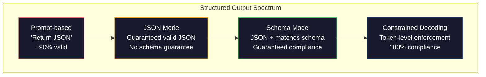
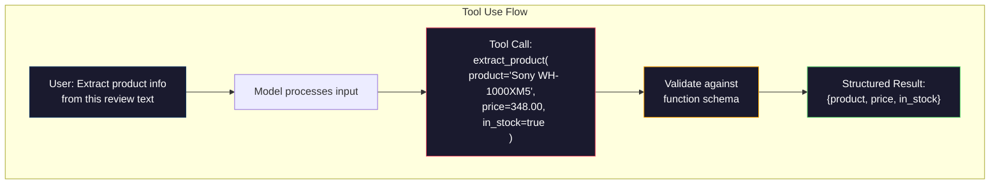

# خروجی های ساختاری: JSON، اعتبار دهی طرح، رمزگذاری محدود

> LLM شما یک رشته را باز می گرداند. برنامه شما به JSON نیاز دارد. این شکاف سیستم های تولید بیشتری را از هر توهم مدل خراب کرده است. خروجی ساختار یافته پل بین زبان طبیعی و داده های تایپ شده است. درست کنید و LLM شما تبدیل به یک API قابل اعتماد می شود. اشتباه کنید و شما با regex در ساعت 3 صبح متن آزاد را تجزیه و تحلیل می کنید.

**Type:** Build
**Languages:** Python
**Prerequisites:** Phase 10, Lessons 01-05 (LLMs from Scratch)
**Time:** ~90 minutes
**Related:**مرحله 5 · 20 (خروجات ساختاری و رمزگذاری محدود) شامل تئوری سطح رمزگذاری (معالجه های Logit FSM / CFG، خاکستری، XGrammar) می شود. این درس بر سطح SDK تولید تمرکز می کند (OpenAI `response_format`، استفاده از ابزار انسان، مربی)  ابتدا مرحله 5 · 20 را بخوانید اگر می خواهید بدانید که در زیر API چه اتفاقی می افتد.

## اهداف یادگیری

- پیاده سازی JSON-mode و schema-restricted output با استفاده از OpenAI و Anthropic API پارامترها
- ایجاد یک لایه تأیید Pydantic که از تولیدات LLM نادرست و آزمایشات مجدد با بازخورد خطا رد می کند
- توضیح دهید که چگونه رمزگذاری محدود مجبور به JSON معتبر در سطح توکن بدون پردازش بعد می شود
- طراحی پیام های استخراج قوی که به طور قابل اعتماد متن غیر ساختار یافته را به ساختار داده های تایپ شده تبدیل می کنند

## مشکل

شما از یک استاد ارشد می پرسید: "نام محصول، قیمت و دستیابی را از این متن استخراج کنید". او پاسخ می دهد:

```
The product is the Sony WH-1000XM5 headphones, which cost $348.00 and are currently in stock.
```

این یک پاسخ کاملا درست است. این نیز کاملا بی فایده برای برنامه شما است. سیستم موجودی شما نیاز دارد.`{"product": "Sony WH-1000XM5", "price": 348.00, "in_stock": true}`شما به یک شی JSON با کلید های خاص، انواع خاص و محدودیت های خاص ارزش نیاز دارید. شما به یک جمله نیاز ندارید.

راه حل ساده: اضافه کردن "جواب در JSON" به درخواست خود را. اين 90 درصد از زمان ها جواب ميده ۱۰ درصد دیگر مدل JSON را در دیوار های کد نشان داده می کند، یا یک پیش فرض مانند "JSON:" را اضافه می کند، یا JSON را با نحو نامطابق تولید می کند زیرا یک دسته را زودتر بسته است. پارسر JSON شما خراب شده لوله ات خراب شده شما اضافه کنید try/except و یک حلقه دوباره تلاش مجدد گاهی اوقات داده های متفاوتی تولید می کند. حالا شما یک مشکل همبستگی در بالای یک مشکل تجزیه دارید.

این یک مشکل مهندسی فوری نیست. این یک مشکل رمزگذاری است. مدل توکن ها را از چپ به راست تولید می کند. در هر موقعیت، احتمالاً توکن بعدی را از یک ذخایر 100K + گزینه انتخاب می کند. اکثر این گزینه ها JSON را در هر موقعیت معین غیرفعال تولید می کنند. اگر مدل فقط ارسال می کند `{"price":`, علامت بعدی باید یک رقم باشد , یک نقل قول (برای رشته)`null`،`true`،`false`هر چیزی که غیرفعال JSON تولید می کند. بدون محدودیت، مدل ممکن است یک کلمه کاملا منطقی انگلیسی را انتخاب کند که در نحوی فاجعه بار اشتباه است.

## مفهوم

### طیف تولیدات ساختاری

چهار سطح کنترل ساختاری وجود دارد که هر کدام از آنها نسبت به گذشته قابل اعتماد تر هستند.



**Prompt-based**("جواب در JSON معتبر"): هیچ اجرای. مدل معمولاً مطابق است اما گاهی اوقات انجام نمی شود. قابلیت اطمینان: ~ 90٪. حالت شکست: آستانه های نشان، متن پیشگویی، خروجی کوتاه شده، ساختار اشتباه.

**JSON mode**: API تضمین می کند که JSON درست باشد. OpenAI `response_format: { type: "json_object" }`این امکان را فراهم می کند. محصول بدون خطا تجزیه و تحلیل خواهد شد. اما ممکن است با طرح انتظارات شما مطابقت نداشته باشد - کلید های اضافی، انواع اشتباه، زمینه های گمشده.

**Schema mode**: API یک طرح JSON را می گیرد و تضمین می کند که خروجی مطابق آن باشد. در سال 2026 هر ارائه دهنده اصلی این را به طور بومی پشتیبانی می کند: OpenAI `response_format: { type: "json_schema", json_schema: {...} }`(همچنین به عنوان `tool_choice="required"`), استفاده از ابزار Anthropic با `input_schema`، و دوقلوها`response_schema`+ `response_mime_type: "application/json"`. محصول دارای کلید ها، انواع و محدودیت های دقیق شما است

**Constrained decoding**در هر موقعیت توکن در طول تولید، دیکودر تمام توکن هایی را که تولید ناتوانی غیرفعال می کنند، پنهان می کند. اگر طرح یک عدد را نیاز دارد و مدل در حال انتشار یک حرف است، این توکن به احتمال صفر تنظیم می شود. مدل فقط می تواند توکن هایی را که منجر به تولید معتبر می شود تولید کند. این چیزی است که حالت ساختاری اوپن آی و کتابخانه هایی مانند خاکستری و راهنما تحت هود اجرا می کنند.

### طرح JSON: زبان قرارداد

طرح JSON نحوه گفتن به مدل (یا لایه تأیید) است که شکل تولید باید داشته باشد. هر سیستم اصلی ساختاری تولید از آن استفاده می کند.

```json
{
  "type": "object",
  "properties": {
    "product": { "type": "string" },
    "price": { "type": "number", "minimum": 0 },
    "in_stock": { "type": "boolean" },
    "categories": {
      "type": "array",
      "items": { "type": "string" }
    }
  },
  "required": ["product", "price", "in_stock"]
}
```

این طرح میگه: محصول باید یک شی با یک رشته باشد `product`، یک عدد غیر منفی`price`، یک بولین`in_stock`، و یک سری اختیاری از رشته ها`categories`هر محصولي که با هم مطابقت نداشته باشه رد ميشه

طرح ها پرونده های سخت را اداره می کنند: اشیاء سرسبز، صف هایی با عناصر تایپ شده، enums (یک رشته را به ارزش های خاص محدود کنید) ، تطابق الگوی (regex در رشته ها) و ترکیب کننده ها (oneOf، anyOf، allOf برای خروجی های چند شکل).

### الگوی پیدانتیک

در پایتون، شما JSON Schema را به دست نمی نویسید. شما یک مدل Pydantic را تعریف می کنید و این برای شما طرح را تولید می کند.

```python
from pydantic import BaseModel

class Product(BaseModel):
    product: str
    price: float
    in_stock: bool
    categories: list[str] = []
```

این همان طرح JSON را به وجود می آورد. کتابخانه Instructor (و SDK OpenAI) مدل های Pydantic را مستقیماً پذیرفته است: کلاس مدل را عبور کنید، یک نمونه معتبر را به دست آورید. اگر محصول LLM مطابقت نداشته باشد، Instructor به طور خودکار دوباره تلاش می کند.

### تماس با تابع / استفاده از ابزار

یک رابط جایگزین برای همان مشکل. به جای اینکه از مدل بخواهید که JSON را مستقیما تولید کند، شما "وسائل" (کار) را با پارامترهای تایپ شده تعریف می کنید. مدل یک تماس عملکردی با استدلال های ساختار یافته را تولید می کند. OpenAI این را "کاربرد عملکردی" می نامد. Anthropic آن را "استفاده از ابزار" می نامد. نتیجه همان است: داده های ساختار یافته.



استفاده از ابزار زمانی ترجیح داده می شود که مدل باید انتخاب کند که کدام تابع را به نام دهد، نه فقط پر کردن پارامترها. اگر شما 10 طرح استخراج مختلف دارید و مدل باید یکی را بر اساس ورودی انتخاب کند، استفاده از ابزار به شما هم انتخاب طرح و هم خروجی ساختار یافته می دهد.

### روش های رایج شکست

حتی با اجرای طرح، خروجی های ساختاری می توانند به روش های ظریف شکست بخورند.

**Hallucinated values**: محصول با طرح مطابقت دارد اما شامل داده های اختراع شده است. مدل تولید می کند `{"price": 299.99}`وقتی متن می گوید 348 دلار. تایید طرح نمی تواند این را بگیرد -- نوع درست است، ارزش اشتباه است.

**Enum confusion**: شما یک میدان را به  محدود می کنید`["in_stock", "out_of_stock", "preorder"]`. محصولات مدل`"available"`-- از نظر معنوی درست است، اما در مجموعه مجاز نیست. رمزگذاری محدود خوب مانع از این می شود. رویکردهای مبتنی بر پرامپت این کار را نمی کنند.

**Nested object depth**: طرح های عمیق (4+ سطح) باعث ایجاد خطاهای بیشتر می شوند. هر سطح سرپوشانی مکان دیگری است که می تواند ساختار را از دست دهد.

**Array length**: مدل ممکن است تعداد زیادی یا کمی از عناصر را در یک آرایه تولید کند.`minItems`و`maxItems`اما همه ارائه دهندگان آن ها را در سطح رمزگذاری اجرا نمی کنند.

**Optional field omission**: مدل فیلدها را که از نظر فنی اختیاری اما از نظر معنوی برای مورد استفاده شما مهم هستند حذف می کند. آنها را به عنوان مورد نیاز در طرح تنظیم کنید حتی اگر گاهی اوقات داده ها از دست رفته باشد - مدل را مجبور کنید تولید کند`null`به طور صریح

```figure
mx-schema-funnel
```

## آن را بسازید

### مرحله 1: اعتبار دهنده طرح JSON

یک اعتبار دهنده را از ابتدا بسازید که بررسی کند آیا یک شیء پایتون با یک طرح JSON مطابقت دارد. این چیزی است که در سمت خروجی اجرا می شود تا تأیید مطابقت باشد.

```python
import json

def validate_schema(data, schema):
    errors = []
    _validate(data, schema, "", errors)
    return errors

def _validate(data, schema, path, errors):
    schema_type = schema.get("type")

    if schema_type == "object":
        if not isinstance(data, dict):
            errors.append(f"{path}: expected object, got {type(data).__name__}")
            return
        for key in schema.get("required", []):
            if key not in data:
                errors.append(f"{path}.{key}: required field missing")
        properties = schema.get("properties", {})
        for key, value in data.items():
            if key in properties:
                _validate(value, properties[key], f"{path}.{key}", errors)

    elif schema_type == "array":
        if not isinstance(data, list):
            errors.append(f"{path}: expected array, got {type(data).__name__}")
            return
        min_items = schema.get("minItems", 0)
        max_items = schema.get("maxItems", float("inf"))
        if len(data) < min_items:
            errors.append(f"{path}: array has {len(data)} items, minimum is {min_items}")
        if len(data) > max_items:
            errors.append(f"{path}: array has {len(data)} items, maximum is {max_items}")
        items_schema = schema.get("items", {})
        for i, item in enumerate(data):
            _validate(item, items_schema, f"{path}[{i}]", errors)

    elif schema_type == "string":
        if not isinstance(data, str):
            errors.append(f"{path}: expected string, got {type(data).__name__}")
            return
        enum_values = schema.get("enum")
        if enum_values and data not in enum_values:
            errors.append(f"{path}: '{data}' not in allowed values {enum_values}")

    elif schema_type == "number":
        if not isinstance(data, (int, float)):
            errors.append(f"{path}: expected number, got {type(data).__name__}")
            return
        minimum = schema.get("minimum")
        maximum = schema.get("maximum")
        if minimum is not None and data < minimum:
            errors.append(f"{path}: {data} is less than minimum {minimum}")
        if maximum is not None and data > maximum:
            errors.append(f"{path}: {data} is greater than maximum {maximum}")

    elif schema_type == "boolean":
        if not isinstance(data, bool):
            errors.append(f"{path}: expected boolean, got {type(data).__name__}")

    elif schema_type == "integer":
        if not isinstance(data, int) or isinstance(data, bool):
            errors.append(f"{path}: expected integer, got {type(data).__name__}")
```

### مرحله دوم: مدل سبک پیدانتیک به طرح

یک کلاس به اسکیما تبدیل کنید. یک کلاس پایتون را تعریف کنید و اسکیما JSON خود بخود تولید کنید.

```python
class SchemaField:
    def __init__(self, field_type, required=True, default=None, enum=None, minimum=None, maximum=None):
        self.field_type = field_type
        self.required = required
        self.default = default
        self.enum = enum
        self.minimum = minimum
        self.maximum = maximum

def python_type_to_schema(field):
    type_map = {
        str: "string",
        int: "integer",
        float: "number",
        bool: "boolean",
    }

    schema = {}

    if field.field_type in type_map:
        schema["type"] = type_map[field.field_type]
    elif field.field_type == list:
        schema["type"] = "array"
        schema["items"] = {"type": "string"}
    elif isinstance(field.field_type, dict):
        schema = field.field_type

    if field.enum:
        schema["enum"] = field.enum
    if field.minimum is not None:
        schema["minimum"] = field.minimum
    if field.maximum is not None:
        schema["maximum"] = field.maximum

    return schema

def model_to_schema(name, fields):
    properties = {}
    required = []

    for field_name, field in fields.items():
        properties[field_name] = python_type_to_schema(field)
        if field.required:
            required.append(field_name)

    return {
        "type": "object",
        "properties": properties,
        "required": required,
    }
```

### مرحله سوم: فیلتر توکن محدود

شبیه سازی رمزگذاری محدود. با توجه به یک رشته JSON جزئی و یک طرح، تعیین کنید که کدام دسته بندی توکن در موقعیت فعلی معتبر هستند.

```python
def next_valid_tokens(partial_json, schema):
    stripped = partial_json.strip()

    if not stripped:
        return ["{"]

    try:
        json.loads(stripped)
        return ["<EOS>"]
    except json.JSONDecodeError:
        pass

    last_char = stripped[-1] if stripped else ""

    if last_char == "{":
        return ['"', "}"]
    elif last_char == '"':
        if stripped.endswith('":'):
            return ['"', "0-9", "true", "false", "null", "[", "{"]
        return ["a-z", '"']
    elif last_char == ":":
        return [" ", '"', "0-9", "true", "false", "null", "[", "{"]
    elif last_char == ",":
        return [" ", '"', "{", "["]
    elif last_char in "0123456789":
        return ["0-9", ".", ",", "}", "]"]
    elif last_char == "}":
        return [",", "}", "]", "<EOS>"]
    elif last_char == "]":
        return [",", "}", "<EOS>"]
    elif last_char == "[":
        return ['"', "0-9", "true", "false", "null", "{", "[", "]"]
    else:
        return ["any"]

def demonstrate_constrained_decoding():
    partial_states = [
        '',
        '{',
        '{"product"',
        '{"product":',
        '{"product": "Sony"',
        '{"product": "Sony",',
        '{"product": "Sony", "price":',
        '{"product": "Sony", "price": 348',
        '{"product": "Sony", "price": 348}',
    ]

    print(f"{'Partial JSON':<45} {'Valid Next Tokens'}")
    print("-" * 80)
    for state in partial_states:
        valid = next_valid_tokens(state, {})
        display = state if state else "(empty)"
        print(f"{display:<45} {valid}")
```

### مرحله چهارم: لوله استخراج

همه چیز را در یک خط لوله استخراج ترکیب کنید: یک طرح تعریف کنید، یک LLM را شبیه سازی کنید که تولید ساختار یافته را تولید کند، تولید را تأیید کنید و دوباره تلاش کنید.

```python
def simulate_llm_extraction(text, schema, attempt=0):
    if "headphones" in text.lower() or "sony" in text.lower():
        if attempt == 0:
            return '{"product": "Sony WH-1000XM5", "price": 348.00, "in_stock": true, "categories": ["audio", "headphones"]}'
        return '{"product": "Sony WH-1000XM5", "price": 348.00, "in_stock": true}'

    if "laptop" in text.lower():
        return '{"product": "MacBook Pro 16", "price": 2499.00, "in_stock": false, "categories": ["computers"]}'

    return '{"product": "Unknown", "price": 0, "in_stock": false}'

def extract_with_retry(text, schema, max_retries=3):
    for attempt in range(max_retries):
        raw = simulate_llm_extraction(text, schema, attempt)

        try:
            data = json.loads(raw)
        except json.JSONDecodeError as e:
            print(f"  Attempt {attempt + 1}: JSON parse error -- {e}")
            continue

        errors = validate_schema(data, schema)
        if not errors:
            return data

        print(f"  Attempt {attempt + 1}: Schema validation errors -- {errors}")

    return None

product_schema = {
    "type": "object",
    "properties": {
        "product": {"type": "string"},
        "price": {"type": "number", "minimum": 0},
        "in_stock": {"type": "boolean"},
        "categories": {"type": "array", "items": {"type": "string"}},
    },
    "required": ["product", "price", "in_stock"],
}
```

### مرحله پنجم: کامل خط لوله را اجرا کنید

```python
def run_demo():
    print("=" * 60)
    print("  Structured Output Pipeline Demo")
    print("=" * 60)

    print("\n--- Schema Definition ---")
    product_fields = {
        "product": SchemaField(str),
        "price": SchemaField(float, minimum=0),
        "in_stock": SchemaField(bool),
        "categories": SchemaField(list, required=False),
    }
    generated_schema = model_to_schema("Product", product_fields)
    print(json.dumps(generated_schema, indent=2))

    print("\n--- Schema Validation ---")
    test_cases = [
        ({"product": "Test", "price": 10.0, "in_stock": True}, "Valid object"),
        ({"product": "Test", "price": -5.0, "in_stock": True}, "Negative price"),
        ({"product": "Test", "in_stock": True}, "Missing price"),
        ({"product": "Test", "price": "ten", "in_stock": True}, "String as price"),
        ("not an object", "String instead of object"),
    ]

    for data, label in test_cases:
        errors = validate_schema(data, product_schema)
        status = "PASS" if not errors else f"FAIL: {errors}"
        print(f"  {label}: {status}")

    print("\n--- Constrained Decoding Simulation ---")
    demonstrate_constrained_decoding()

    print("\n--- Extraction Pipeline ---")
    texts = [
        "The Sony WH-1000XM5 headphones are priced at $348 and currently available.",
        "The new MacBook Pro 16-inch laptop costs $2499 but is sold out.",
        "This is a random sentence with no product info.",
    ]

    for text in texts:
        print(f"\n  Input: {text[:60]}...")
        result = extract_with_retry(text, product_schema)
        if result:
            print(f"  Output: {json.dumps(result)}")
        else:
            print(f"  Output: FAILED after retries")
```

## ازش استفاده کن

### تولیدات ساختار یافته OpenAI

```python
# from openai import OpenAI
# from pydantic import BaseModel
#
# client = OpenAI()
#
# class Product(BaseModel):
#     product: str
#     price: float
#     in_stock: bool
#
# response = client.beta.chat.completions.parse(
#     model="gpt-5-mini",
#     messages=[
#         {"role": "system", "content": "Extract product information."},
#         {"role": "user", "content": "Sony WH-1000XM5, $348, in stock"},
#     ],
#     response_format=Product,
# )
#
# product = response.choices[0].message.parsed
# print(product.product, product.price, product.in_stock)
```

حالت خروجی ساختار یافته OpenAI از رمزگذاری محدود داخلی استفاده می کند. هر توکن تولید شده توسط مدل تضمین شده است که با طرح Pydantic مطابقت دارد. نیازی به تکرار نیست. نیازی به اعتبارگذاری نیست. محدودیت در فرآیند رمزگذاری پخته می شود.

### استفاده از ابزار انسان

```python
# import anthropic
#
# client = anthropic.Anthropic()
#
# response = client.messages.create(
#     model="claude-opus-4-7",
#     max_tokens=1024,
#     tools=[{
#         "name": "extract_product",
#         "description": "Extract product information from text",
#         "input_schema": {
#             "type": "object",
#             "properties": {
#                 "product": {"type": "string"},
#                 "price": {"type": "number"},
#                 "in_stock": {"type": "boolean"},
#             },
#             "required": ["product", "price", "in_stock"],
#         },
#     }],
#     messages=[{"role": "user", "content": "Extract: Sony WH-1000XM5, $348, in stock"}],
# )
```

انتروپک از طریق استفاده از ابزار به محصول ساختاری دست می یابد. مدل یک تماس ابزار را با استدلال های ساختاری که با input_schema مطابقت دارند، ارسال می کند. نتیجه مشابه، سطح API متفاوت است.

### کتابخانه آموزگاران

```python
# pip install instructor
# import instructor
# from openai import OpenAI
# from pydantic import BaseModel
#
# client = instructor.from_openai(OpenAI())
#
# class Product(BaseModel):
#     product: str
#     price: float
#     in_stock: bool
#
# product = client.chat.completions.create(
#     model="gpt-5-mini",
#     response_model=Product,
#     messages=[{"role": "user", "content": "Sony WH-1000XM5, $348, in stock"}],
# )
```

مربی هر مشتری LLM را بسته می کند و با تأیید دوباره خودکار را اضافه می کند. اگر اولین تلاش تأیید ناموفق شود، خطاهای را به عنوان زمینه به مدل ارسال می کند و از آن می خواهد که محصول را اصلاح کند. این با هر ارائه دهنده کار می کند، نه فقط OpenAI.

## -باده

این درس به ما کمک می کند`outputs/prompt-structured-extractor.md`-- یک قالب پاسخگو قابل استفاده مجدد که داده های ساختاری را از هر متن با یک تعریف اسکیما استخراج می کند. به آن یک اسکیما JSON و متن غیر ساختاری می دهد و JSON معتبر را باز می گرداند.

همچنین تولید می کند`outputs/skill-structured-outputs.md`-- چارچوب تصمیم گیری برای انتخاب استراتژی ساختاری درست بر اساس ارائه دهنده، نیازهای قابل اعتماد و پیچیدگی طرح.

## تمرینات

1. توسعه اعتبار دهنده اسکیما برای پشتیبانی `oneOf`(داده ها باید دقیقا با یکی از چندین طرح مطابقت داشته باشند) این در حال انجام خروجی چند شکل است - به عنوان مثال، یک میدان که می تواند یا یک`Product`یا یک`Service`اشیاء با اشکال مختلف

2. یک ابزار "Schema diff" بسازید که دو طرح را مقایسه کند و تغییرات شکسته (ملک های مورد نیاز حذف شده، انواع تغییر شده) را در مقابل تغییرات غیر شکسته (ملک های اختیاری اضافه شده، محدودیت های آرام) شناسایی کند. این برای نسخه سازی طرح های استخراج شما در تولید ضروری است.

3. یک شبیه ساز رمزگذاری محدود واقع گرایانه تر را پیاده سازی کنید. با توجه به یک طرح JSON و یک ذخایر لغاتی از 100 توکن (حروف، اعداد، امتیاز، کلمات کلیدی) ، قدم به قدم از طریق تولید حرکت کنید، توکن های باطل را در هر موقعیت پنهان کنید. اندازه گیری کنید که درصد از ذخایر لغات در هر مرحله معتبر است.

4. یک مجموعه ارزیابی استخراج بسازید. 50 توضیحات محصول را با خروجی JSON دست نشان داده شده ایجاد کنید. لوله استخراج خود را در تمام 50 مورد اجرا کنید و مطابقت دقیق، دقت سطح میدان و مطابقت نوع را اندازه گیری کنید. شناسایی کنید که کدام زمینه ها سخت ترین برای استخراج درست هستند.

5. برای هر میدان استخراج شده، تخمین بزنید که مدل چقدر مطمئن است (بر اساس احتمالات توکن، یا با اجرا استخراج 3 بار و اندازه گیری ثبات).

## اصطلاحات کلیدی

| Term | What people say | What it actually means |
|------|----------------|----------------------|
| JSON mode | "Returns JSON" | API flag that guarantees syntactically valid JSON output, but does not enforce any particular schema |
| Structured output | "Typed JSON" | Output that matches a specific JSON Schema with correct keys, types, and constraints |
| Constrained decoding | "Guided generation" | At each token position, mask out tokens that would produce invalid output -- guarantees 100% schema compliance |
| JSON Schema | "A JSON template" | A declarative language for describing the structure, types, and constraints of JSON data (used by OpenAPI, JSON Forms, etc.) |
| Pydantic | "Python dataclasses+" | Python library that defines data models with type validation, used by FastAPI and Instructor to generate JSON Schemas |
| Function calling | "Tool use" | LLM outputs a structured function invocation (name + typed arguments) instead of free text -- OpenAI and Anthropic both support this |
| Instructor | "Pydantic for LLMs" | Python library that wraps LLM clients to return validated Pydantic instances, with automatic retry on validation failure |
| Token masking | "Filtering the vocabulary" | Setting specific token probabilities to zero during generation so the model cannot produce them |
| Schema compliance | "Matches the shape" | The output has every required field, correct types, values within constraints, and no extra disallowed fields |
| Retry loop | "Try again until it works" | Send validation errors back to the model and ask it to fix the output -- Instructor does this automatically, up to a configurable max |

## خواندن بیشتر

- [OpenAI Structured Outputs Guide](https://platform.openai.com/docs/guides/structured-outputs)-- اسناد رسمی برای رمزگذاری محدود مبتنی بر طرح JSON در API OpenAI
- [Willard & Louf, 2023 -- "Efficient Guided Generation for Large Language Models"](https://arxiv.org/abs/2307.09702)-- مقاله Outlines، توصیف چگونگی جمع آوری طرح های JSON به ماشین های حالت محدود برای محدودیت های سطح توکن
- [Instructor documentation](https://python.useinstructor.com/)-- کتابخانه استاندارد برای دریافت نتایج ساختاری از هر LLM با تایید و آزمایش های Pydantic
- [Anthropic Tool Use Guide](https://docs.anthropic.com/en/docs/tool-use)-- چگونه کلاود از طریق استفاده از ابزار با JSON Schema input_schema
- [JSON Schema specification](https://json-schema.org/)-- مشخصات کامل زبان اسکیم که توسط هر سیستم اصلی ساختاری استفاده می شود
- [Outlines library](https://github.com/outlines-dev/outlines)-- تولید محدود منبع باز با استفاده از regex و JSON Schema که به ماشین های حالت محدود مرتب شده است
- [Dong et al., "XGrammar: Flexible and Efficient Structured Generation Engine for Large Language Models" (MLSys 2025)](https://arxiv.org/abs/2411.15100)-- موتور گرائمری مدرن فعلی؛ جمع آوری خودکار فشار که توکن ها را در ~ 100 ns / توکن پنهان می کند.
- [Beurer-Kellner et al., "Prompting Is Programming: A Query Language for Large Language Models" (LMQL)](https://arxiv.org/abs/2212.06094)-- چارچوب ورق LMQL محدود کردن رمزگذاری به عنوان یک زبان جستجو با محدودیت های نوع و ارزش است.
- [Microsoft Guidance (framework docs)](https://github.com/guidance-ai/guidance)-- تولیدی محدود مبتنی بر قالب؛ مکمل بیگانه فروشنده برای Outlines و XGrammar.
