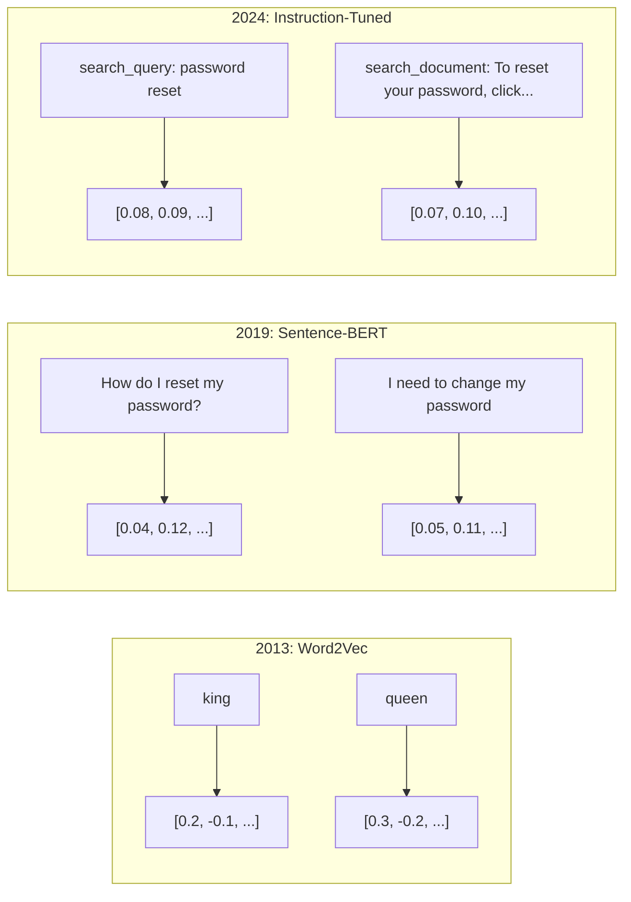
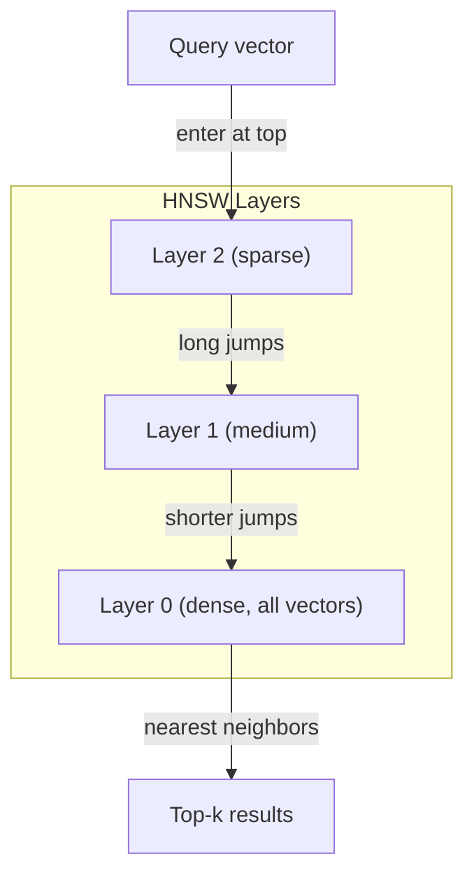
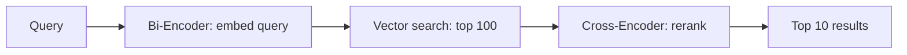

# ادغام ها و نمایشگرهای ویکتور

> متن منحصراست. ریاضیات مستمر است. هر بار که از یک کارشناسی ارشد می خواهید اسناد مشابهی پیدا کند، معنی را مقایسه کند، یا فراتر از کلمات کلیدی جستجو کند، شما به یک پل بین این دو جهان اعتماد می کنید. این پل یک پیوند است. اگر شما پیوند را درک نمی کنید، شما هوش مصنوعی مدرن را درک نمی کنید. شما فقط از آن استفاده می کنید.

**Type:** Build
**Languages:** Python
**Prerequisites:** Phase 11, Lesson 01 (Prompt Engineering)
**Time:** ~75 minutes
**Related:**مرحله 5 · 22 (سوال عمیق مدل های گنجانده) شامل فشرده و نادر و چند ویکتور، تراش ماتریوشکا و انتخاب مدل در هر محور است. این درس بر روی خط تولید (ویکتور DB، HNSW، ریاضیات شباهت) تمرکز دارد. قبل از انتخاب یک مدل، مرحله 5 · 22 را بخوانید.

## اهداف یادگیری

- تولید ادغام متن با استفاده از ارائه دهندگان API و مدل های منبع باز و محاسبه شباهت کوسین بین آنها
- توضیح دهید که چرا گنجانده شده ها مشکل عدم مطابقت لغات را که جستجو کلمات کلیدی نمی تواند حل کند، حل می کنند.
- ایجاد یک شاخص جستجو معنوی که اسناد را به معنی به جای مطابقت دقیق کلمات کلیدی به دست آورد
- با استفاده از معیار های بازیافت (precision@k، recall) کیفیت ادغام را ارزیابی کنید و مدل ادغام مناسب را برای کار خود انتخاب کنید

## مشکل

شما ۱۰ هزار بلیط پشتیبانی دارید. یک مشتری می نویسد "پرداختم انجام نشده است". شما باید بلیط های مشابه گذشته را پیدا کنید. جستجوی کلمات کلیدی بلیط هایی را پیدا می کند که حاوی "پرداخت" و "پرداخت نشده است". "معاملات شکست خورده است" را از دست می دهد، "حساب رد شده است" و "خطای صورتحساب". این بلیط ها دقیقا همان مشکل را با کلمات کاملاً متفاوت توصیف می کنند.

این مشکل عدم مطابقت لغات است. زبان انسان ده ها روش برای گفتن همان چیز دارد. جستجوی کلمات کلیدی هر کلمه را به عنوان یک نماد مستقل بدون معنی می داند. نمی تواند بداند که "منعت" و "مطابق نشد" به همان مفهوم اشاره دارند.

شما نیاز به یک نمایش از متن دارید که معنی، نه املا، شباهت را تعیین کند. شما نیاز به راهی برای قرار دادن "تادیه من به صورت کامل انجام نشد" و "تعامل رد شد" در یک فضای ریاضی، در حالی که "تادیه من به موقع رسید" را دور تر فشار می دهید علیرغم اینکه کلمه "تادیه" را به اشتراک بگذارید.

این نمایش یک ادغام است.

## مفهوم

### پیوند کاری چیست؟

یک گنجانده یک ویکتور کثیف از اعداد نقطه شناور است که معنی متن را نشان می دهد. کلمه " کثافت " مهم است - هر ابعاد حاوی اطلاعات است، برخلاف نمایش های نادر (کسه کلمات، TF-IDF) که در آن بیشتر ابعاد صفر هستند.

" گربه روی فرش نشسته" چیزی شبیه به`[0.023, -0.041, 0.087, ..., 0.012]`-- لیست از اعداد 768 تا 3072 بسته به مدل. این اعداد معنی را رمزگذاری می کنند. شما هرگز مستقیماً آنها را بررسی نمی کنید. شما آنها را مقایسه می کنید.

### پیشرفت Word2Vec

در سال 2013، توماس میکولوف و همکارانش در گوگل Word2Vec را منتشر کردند. بینش اصلی: آموزش یک شبکه عصبی برای پیش بینی یک کلمه از همسایه های خود (یا همسایه ها از یک کلمه) ، و وزنه های لایه پنهان به نمایشگرهای ویکتور معنادار تبدیل می شوند.

نتیجه مشهور:

```
king - man + woman = queen
```

ریاضیات ویکتور در گنجانده های کلمه روابط معنوی را ضبط می کند. جهت از "مرد" به "زن" تقریباً مشابه جهت از "پادشاه" به "ملکه" است. این لحظه بود که میدان متوجه شد که هندسه می تواند معنای را رمزگذاری کند.

Word2Vec 300 بعدی وکتور تولید کرد. هر کلمه یک وکتور بدون توجه به زمینه داشت. "بانک" در "بانک رودخانه" و "حساب بانکی" دارای ادغام مشابهی بودند. این محدودیت منجر به دهه بعدی تحقیق شد.

### از کلمات به جملات

ورڈ های گنجانده شده نشان دهنده یک توکن است. سیستم های تولید نیاز به گنجانده شدن جملات، پاراگراف ها یا اسناد کامل دارند. چهار رویکرد به وجود آمده است:

**Averaging**: میانگین تمام متری کلمات را در جمله بگیرید. ارزان، ضایع کننده، برای متن کوتاه شگفت انگیز مناسب. ترتیب کلمات را کاملاً از دست می دهد - "سگ آدم را گاز می گیرد" و "سگ آدم را گاز می گیرد" ورق های یکسان را دریافت می کنند.

**CLS token**: مدل های ترانسفورماتور (BERT، 2018) یک توکن ویژه [CLS] را وارد می کنند که کل ورودی را نشان می دهد. بهتر از متوسط است اما توکن [CLS] برای پیش بینی جمله بعدی آموزش دیده است، نه شباهت.

**Contrastive learning**: آموزش مدل به طور صریح برای فشار دادن زوج های مشابه به یکدیگر و زوج های متفاوت به یکدیگر. Sentence-BERT (Reimers & Gurevych، 2019) از این رویکرد استفاده کرد و پایه گذاری برای مدل های گنجانده مدرن شد. با توجه به "چگونه رمز عبور خود را تنظیم مجدد کنم؟" و "من باید رمز عبور خود را تغییر دهم"، مدل یاد می گیرد که این دو باید متری تقریبا یکسان داشته باشند.

**Instruction-tuned embeddings**: آخرین رویکرد. مدل هایی مانند E5 و GTE یک پیشگویی وظیفه را پذیرفته اند ("search_query:", "search_document:") که به مدل می گوید چه نوع ادغام را تولید کند. این اجازه می دهد تا یک مدل به چندین کار خدمت کند.



### مدل های مدرن پیوند

بازار به چند گزینه درجه تولید (نمره MTEB در اوایل سال 2026، MTEB v2) تقسیم شده است:

| Model | Provider | Dimensions | MTEB | Context | Cost / 1M tokens |
|-------|----------|-----------|------|---------|------------------|
| Gemini Embedding 2 | Google | 3072 (Matryoshka) | 67.7 (retrieval) | 8192 | $0.15 |
| embed-v4 | Cohere | 1024 (Matryoshka) | 65.2 | 128K | $0.12 |
| voyage-4 | Voyage AI | 1024/2048 (Matryoshka) | 66.8 | 32K | $0.12 |
| text-embedding-3-large | OpenAI | 3072 (Matryoshka) | 64.6 | 8192 | $0.13 |
| text-embedding-3-small | OpenAI | 1536 (Matryoshka) | 62.3 | 8192 | $0.02 |
| BGE-M3 | BAAI | 1024 (dense+sparse+ColBERT) | 63.0 multilingual | 8192 | Open-weight |
| Qwen3-Embedding | Alibaba | 4096 (Matryoshka) | 66.9 | 32K | Open-weight |
| Nomic-embed-v2 | Nomic | 768 (Matryoshka) | 63.1 | 8192 | Open-weight |

MTEB (Masssive Text Embedding Benchmark) v2 100+ کار را در سراسر بازیافت، طبقه بندی، دسته بندی، رتبه بندی مجدد و خلاصه پوشش می دهد. بالاتر بهتره تا سال 2026، مدل های با وزن باز (Qwen3-Embedding، BGE-M3) در اکثر محورها با مدل های میزبان بسته مطابقت دارند یا آنها را شکست می دهند. جمیانی ایمبدنینگ 2 منجر به بازیافت خالص می شود؛ سفر / همبستگی منجر به دامنه های خاص (مالی، قانون، کد) می شود. همیشه قبل از انجام کاری به سوالات خودتون بنظرتون بده

### متریک های مشابه

با توجه به دو متری که در آن ها قرار دارد، سه راه برای اندازه گیری این است که چقدر شبیه هستند:

**Cosine similarity**: کوسین زاویه بین دو متری. از -1 (قابل) تا 1 (جهای یکسان) متفاوت است. اندازه را نادیده می گیرد - یک جمله 10 کلمه و یک سند 500 کلمه می تواند 1.0 را به دست آورد اگر آنها به سمت مشابه اشاره کنند. این پیش فرض برای 90٪ موارد استفاده است.

```
cosine_sim(a, b) = dot(a, b) / (||a|| * ||b||)
```

**Dot product**: محصول داخلی خام دو متری. مشابهی با مشابهی کوسین هنگامی که متری ها عادی می شوند (طول واحد). سریعتر برای محاسبه. گنجانده های OpenAI عادی می شوند، بنابراین محصول نقطه و کوسین رتبه بندی مشابه را می دهند.

```
dot(a, b) = sum(a_i * b_i)
```

**Euclidean (L2) distance**: فاصله خط مستقیم در فضای بردار. کوچکتر = مشابهتر. حساس به تفاوت های بزرگی. زمانی استفاده کنید که موقعیت مطلق در فضا مهم باشد، نه فقط جهت.

```
L2(a, b) = sqrt(sum((a_i - b_i)^2))
```

چه زمانی باید از آن استفاده شود:

| Metric | Use when | Avoid when |
|--------|----------|------------|
| Cosine similarity | Comparing texts of different lengths; most retrieval tasks | Magnitude carries information |
| Dot product | Embeddings are already normalized; maximum speed | Vectors have varying magnitudes |
| Euclidean distance | Clustering; spatial nearest-neighbor problems | Comparing documents of wildly different lengths |

### پایگاه داده های ویکتور و HNSW

یک جستجوی شباهت با نیروی خام، جستجو را با هر ویکتور ذخیره شده مقایسه می کند. در یک میلیون ویکتور با ابعاد 1536، این 1.5 میلیارد عملیات چندان اضافه کردن در هر جستجو است. خیلی کند.

پایگاه داده های ویکتور با الگوریتم های نزدیکترین همسایه (ANN) این مسئله را حل می کنند. الگوریتم غالب HNSW (Hirarchical Navigable Small World) است:

1. یک نمودار چند لایه از متری ها را بسازید
2. لایه های بالای آن ها کمیاب هستند - ارتباطات طولانی بین خوشه های دور
3. لایه های پایین باریک هستند - ارتباطات ذره ای نازک بین متری های نزدیک
4. جستجو از طبقه بالا شروع می شود، به طمع به سمت پایین می رود تا بهبود یابد
5. نتایج top-k را در زمان O(log n) به جای O(n) باز می آورد

HNSW با کاهش دقت کوچک (معمولا 95 تا 99٪ بازپس) به افزایش سرعت عظیم معامله می کند. در 10 میلیون متری، نیروی خام ثانیه طول می کشد. HNSW میلی ثانیه طول می کشد.



گزینه های تولید:

| Database | Type | Best for | Max scale |
|----------|------|----------|-----------|
| Pinecone | Managed SaaS | Zero-ops production | Billions |
| Weaviate | Open source | Self-hosted, hybrid search | 100M+ |
| Qdrant | Open source | High performance, filtering | 100M+ |
| ChromaDB | Embedded | Prototyping, local dev | 1M |
| pgvector | Postgres extension | Already using Postgres | 10M |
| FAISS | Library | In-process, research | 1B+ |

### استراتژی های شکستن

اسناد برای قرار دادن به شکل ویکتورهای تک تک طولانی هستند. یک PDF ۵۰ صفحه ای ده ها موضوع را پوشش می دهد - قرار دادن آن به طور متوسط همه چیز می شود، شبیه به هیچ چیز خاص. شما اسناد را به قطعات تقسیم می کنید و هر یک را درمی آورید.

**Fixed-size chunking**: تقسیم هر N توکن با M-توکن ها همپوشانی. ساده و قابل پیش بینی. کار می کند خوب زمانی که اسناد ساختار واضح ندارند. یک 512 توکن قطعه با 50 توکن ها همپوشانی: قطعه 1 توکن های 0-511 است، قطعه 2 توکن های 462-973 است.

**Sentence-based chunking**: تقسیم در مرزهای جمله، گروه بندی جمله ها تا رسیدن به حد نشانه. هر قطعه حداقل یک جمله کامل است. بهتر از اندازه ثابت است زیرا شما هرگز یک فکر را به نصف قطع نمی کنید.

**Recursive chunking**در این قسمت، در حد اول، در حد بزرگ ترین حد (سرامون بخش) تقسیم کنید. اگر هنوز هم بزرگ باشد، در حد حد بند، سپس حد جمله، سپس حد شخصیت، این حد لانگ چین است.`RecursiveCharacterTextSplitter`و برای بدن های شکل مخلوط خوب کار می کند.

**Semantic chunking**: هر جمله را دربرگیرید، سپس جمله های متوالی را که دربرگیرنده های آنها مشابه هستند گروه کنید. هنگامی که شباهت دربرگیرنده ها زیر یک حد کاهش می یابد، یک قطعه جدید را شروع کنید. گران قیمت ( نیاز به دربرگیرنده هر جمله به صورت جداگانه) اما قطعه های منسجمترین را تولید می کند.

| Strategy | Complexity | Quality | Best for |
|----------|-----------|---------|----------|
| Fixed-size | Low | Decent | Unstructured text, logs |
| Sentence-based | Low | Good | Articles, emails |
| Recursive | Medium | Good | Markdown, HTML, mixed docs |
| Semantic | High | Best | Critical retrieval quality |

نقطه خوش برای اکثر سیستم ها: 256-512 قطعه توکن با 50 توکن همپوشانی.

### دو کدگر در مقابل کراس کدگر

یک دو کدگر به طور مستقل جستجو و اسناد را دربر می گیرد، سپس متری را مقایسه می کند. سریع - شما یک بار جستجو را دربر می گذارید و با ورودی های پیش محاسبه شده سند مقایسه می کنید. این چیزی است که برای بازیافت استفاده می کنید.

یک کراس کودر سوال و یک سند را به عنوان یک ورودی واحد می گیرد و نمره مرتبطی را تولید می کند. آهسته - هر جفت سوال و سند را از طریق مدل کامل پردازش می کند. اما بسیار دقیق تر است زیرا می تواند در طول سوالات و توکن های سند همزمان شرکت کند.

الگوی تولید: دو کدگر 100 کاندیدای برتر را بازمی گیرد، کراس کدگر آنها را به 10 درجه برتر می رساند. این خط لوله بازمی گیرد و سپس رتبه را تغییر می دهد.



مدل های رتبه بندی مجدد: Cohere Rerank 3.5 ($ 2 در هر 1000 سوال) ، BGE-reranker-v2 (آزاد، منبع باز) ، Jina Reranker v2 (آزاد، منبع باز).

### متریوشکا

در قالب یک ویکتور 1536 بعدی، 1536 تیر استفاده می شود. بدون آموزش مجدد نمی توان به 256 بعدی کوتاه کرد.

آموزش نمایندگی ماتریوشکا (Kusupati et al., 2022) این مسئله را حل می کند. مدل به گونه ای آموزش داده شده است که اولین ابعاد N مهمترین اطلاعات را به دست آورد، مانند یک عروسک تخم ریزی روسی. کوتاه کردن یک ماتریوشکا 1536d که به 256 ابعاد گنجانده شده است، دقت خاصی را از دست می دهد اما همچنان کاربردی است.

متن 3 کوچک و متن 3 بزرگ از طریق OpenAI پشتیبانی از ماتریوشکا ترونکشن `dimensions`پارامتر: درخواست 256 ابعاد به جای 1536 ذخیره سازی را 6 برابر کاهش می دهد و در مقادیر معیاری MTEB تقریباً 3-5% از دست می دهد.

### کوانتزیزاسیون دوگانه

یک 1536-بعدی گنجانده شده به عنوان float32 استفاده می کند 6,144 بایت. ضرب به 10 میلیون سند: 61 جی بی فقط برای متری.

کوانتاسیون دوگانه هر شناور را به یک بیت تبدیل می کند: ارزش های مثبت به 1، ارزش های منفی به 0 تبدیل می شوند. ذخیره سازی از 6,144 بایت به 192 بایت کاهش می یابد - کاهش 32x. شباهت با استفاده از فاصله هامینگ محاسبه می شود (تعداد بیت های متفاوت) که پردازنده ها می توانند در یک دستورالعمل انجام دهند.

دقت در بازخواستن حدود 5-10 درصد است. الگوی رایج: کوانتاسیون دوگانه برای جستجوی اولین عبور از میلیون ها متری، سپس دوباره با متری کامل دقیق top-1000 را نشان دهید. این به شما 95٪ + دقت کامل در حافظه 32 برابر کمتر می دهد.

```figure
cosine-similarity
```

## آن را بسازید

ما یک موتور جستجو معنوی را از ابتدا ساختیم بدون پایگاه داده ویکتور هیچ API داخلی و پاک پایتون با ریاضیات

### مرحله ی اول: تکه زدن متن

```python
def chunk_text(text, chunk_size=200, overlap=50):
    words = text.split()
    chunks = []
    start = 0
    while start < len(words):
        end = start + chunk_size
        chunk = " ".join(words[start:end])
        chunks.append(chunk)
        start += chunk_size - overlap
    return chunks


def chunk_by_sentences(text, max_chunk_tokens=200):
    sentences = text.replace("\n", " ").split(".")
    sentences = [s.strip() + "." for s in sentences if s.strip()]
    chunks = []
    current_chunk = []
    current_length = 0
    for sentence in sentences:
        sentence_length = len(sentence.split())
        if current_length + sentence_length > max_chunk_tokens and current_chunk:
            chunks.append(" ".join(current_chunk))
            current_chunk = []
            current_length = 0
        current_chunk.append(sentence)
        current_length += sentence_length
    if current_chunk:
        chunks.append(" ".join(current_chunk))
    return chunks
```

### مرحله دوم: ساخت یک برنامه از ابتدا

ما یک ورق گذاری کثیف ساده با استفاده از TF-IDF با نرمال سازی L2 اجرا می کنیم. این یک ورق گذاری عصبی نیست، اما به همان قرارداد عمل می کند: متن در، ویکتور اندازه ثابت، متن های مشابه ویکتورهای مشابه تولید می کنند.

```python
import math
import numpy as np
from collections import Counter

class SimpleEmbedder:
    def __init__(self):
        self.vocab = []
        self.idf = []
        self.word_to_idx = {}

    def fit(self, documents):
        vocab_set = set()
        for doc in documents:
            vocab_set.update(doc.lower().split())
        self.vocab = sorted(vocab_set)
        self.word_to_idx = {w: i for i, w in enumerate(self.vocab)}
        n = len(documents)
        self.idf = np.zeros(len(self.vocab))
        for i, word in enumerate(self.vocab):
            doc_count = sum(1 for doc in documents if word in doc.lower().split())
            self.idf[i] = math.log((n + 1) / (doc_count + 1)) + 1

    def embed(self, text):
        words = text.lower().split()
        count = Counter(words)
        total = len(words) if words else 1
        vec = np.zeros(len(self.vocab))
        for word, freq in count.items():
            if word in self.word_to_idx:
                tf = freq / total
                vec[self.word_to_idx[word]] = tf * self.idf[self.word_to_idx[word]]
        norm = np.linalg.norm(vec)
        if norm > 0:
            vec = vec / norm
        return vec
```

### مرحله سوم: عملکردهای مشابه

```python
def cosine_similarity(a, b):
    dot = np.dot(a, b)
    norm_a = np.linalg.norm(a)
    norm_b = np.linalg.norm(b)
    if norm_a == 0 or norm_b == 0:
        return 0.0
    return float(dot / (norm_a * norm_b))


def dot_product(a, b):
    return float(np.dot(a, b))


def euclidean_distance(a, b):
    return float(np.linalg.norm(a - b))
```

### مرحله 4: شاخص ویکتور با جستجوی نیروی ناب

```python
class VectorIndex:
    def __init__(self):
        self.vectors = []
        self.texts = []
        self.metadata = []

    def add(self, vector, text, meta=None):
        self.vectors.append(vector)
        self.texts.append(text)
        self.metadata.append(meta or {})

    def search(self, query_vector, top_k=5, metric="cosine"):
        scores = []
        for i, vec in enumerate(self.vectors):
            if metric == "cosine":
                score = cosine_similarity(query_vector, vec)
            elif metric == "dot":
                score = dot_product(query_vector, vec)
            elif metric == "euclidean":
                score = -euclidean_distance(query_vector, vec)
            else:
                raise ValueError(f"Unknown metric: {metric}")
            scores.append((i, score))
        scores.sort(key=lambda x: x[1], reverse=True)
        results = []
        for idx, score in scores[:top_k]:
            results.append({
                "text": self.texts[idx],
                "score": score,
                "metadata": self.metadata[idx],
                "index": idx
            })
        return results

    def size(self):
        return len(self.vectors)
```

### مرحله پنجم: موتور جستجو معنوی

```python
class SemanticSearchEngine:
    def __init__(self, chunk_size=200, overlap=50):
        self.embedder = SimpleEmbedder()
        self.index = VectorIndex()
        self.chunk_size = chunk_size
        self.overlap = overlap

    def index_documents(self, documents, source_names=None):
        all_chunks = []
        all_sources = []
        for i, doc in enumerate(documents):
            chunks = chunk_text(doc, self.chunk_size, self.overlap)
            all_chunks.extend(chunks)
            name = source_names[i] if source_names else f"doc_{i}"
            all_sources.extend([name] * len(chunks))
        self.embedder.fit(all_chunks)
        for chunk, source in zip(all_chunks, all_sources):
            vec = self.embedder.embed(chunk)
            self.index.add(vec, chunk, {"source": source})
        return len(all_chunks)

    def search(self, query, top_k=5, metric="cosine"):
        query_vec = self.embedder.embed(query)
        return self.index.search(query_vec, top_k, metric)

    def search_with_scores(self, query, top_k=5):
        results = self.search(query, top_k)
        return [
            {
                "text": r["text"][:200],
                "source": r["metadata"].get("source", "unknown"),
                "score": round(r["score"], 4)
            }
            for r in results
        ]
```

### مرحله ۶: مقایسه متریک های مشابه

```python
def compare_metrics(engine, query, top_k=3):
    results = {}
    for metric in ["cosine", "dot", "euclidean"]:
        hits = engine.search(query, top_k=top_k, metric=metric)
        results[metric] = [
            {"score": round(h["score"], 4), "preview": h["text"][:80]}
            for h in hits
        ]
    return results
```

## ازش استفاده کن

با یک API تولید شامل، معماری یکسان باقی می ماند. تنها پیوند دهنده تغییر می کند:

```python
from openai import OpenAI

client = OpenAI()

def openai_embed(texts, model="text-embedding-3-small", dimensions=None):
    kwargs = {"model": model, "input": texts}
    if dimensions:
        kwargs["dimensions"] = dimensions
    response = client.embeddings.create(**kwargs)
    return [item.embedding for item in response.data]
```

تراکم ماتریوشکا با OpenAI -- همان مدل، ابعاد کمتر، ذخیره سازی کمتر:

```python
full = openai_embed(["semantic search query"], dimensions=1536)
compact = openai_embed(["semantic search query"], dimensions=256)
```

256-d vektor 6x ذخیره سازی کمتر را مصرف می کند. برای 10 میلیون سند، این 10 GB در مقابل 61 GB است. از دست دادن دقت تقریبا 3-5% در معیار های استاندارد است.

براي رتبه ي جديد با "کوهر":

```python
import cohere

co = cohere.ClientV2()

results = co.rerank(
    model="rerank-v3.5",
    query="What is the refund policy?",
    documents=["Full refund within 30 days...", "No refunds after 90 days..."],
    top_n=3
)
```

برای ادغام های محلی بدون وابستگی API:

```python
from sentence_transformers import SentenceTransformer

model = SentenceTransformer("BAAI/bge-small-en-v1.5")
embeddings = model.encode(["semantic search query", "another document"])
```

کلاس ویکتور انندکس از ساخت ما با هر یک از این کار می کند. تابع گنجانده را تغییر دهید، منطق جستجو را حفظ کنید.

## -باده

این درس نتیجه می دهد:
- `outputs/prompt-embedding-advisor.md`-- یک دستور برای انتخاب مدل ها و استراتژی های گنجانده برای موارد استفاده خاص
- `outputs/skill-embedding-patterns.md`-- يه مهارت که به ماموران مي آموزد چطوري از گنجينه ها در توليد به طور موثر استفاده کنن

## تمرینات

1. **Metric comparison**: 5 سوال مشابه را با استفاده از شباهت کوسین، محصول نقطه و فاصله یوکلیدی با استفاده از اسناد نمونه اجرا کنید. نتایج سه موردی را برای هر یک ثبت کنید. برای کدام سوالات متریک ها مخالفند؟ چرا؟

2. **Chunk size experiment**: فهرست اسناد نمونه با اندازه قطعات 50، 100، 200 و 500 کلمه. برای هر یک از آنها 5 سوال انجام دهید و نمره مشابهی 1 را ثبت کنید. رابطه بین اندازه قطعات و کیفیت بازیافت را نشان دهید. نقطه ای را پیدا کنید که قطعات بزرگتر شروع به درد می کنند.

3. **Matryoshka simulation**: ساخت یک SimpleEmbedder که 500-d ویکتور تولید می کند. به 50، 100، 200 و 500 ابعاد تراش. اندازه گیری چگونگی کاهش یادآوری بازیافت در هر تراش. این شبیه سازی رفتار ماتریوشکا بدون نیاز به ترفند واقعی آموزش.

4. **Binary quantization**: از موتور جستجو استفاده کنید، آن ها را به دوگانه تبدیل کنید (1 اگر مثبت، 0 اگر منفی) و جستجوی فاصله هامینگ را اجرا کنید. نتایج 10 برتر را با شباهت کامل کوسین مقایسه کنید. درصد تعادل را اندازه گیری کنید.

5. **Sentence-based chunking**: عوض کردن اندازه ی ثابت به `chunk_by_sentences`. همان سوال ها را انجام دهید و نمرات بازیافت را مقایسه کنید. آیا احترام به مرز های جمله نتایج را بهبود می بخشد؟

## اصطلاحات کلیدی

| Term | What people say | What it actually means |
|------|----------------|----------------------|
| Embedding | "Text to numbers" | A dense vector where geometric proximity encodes semantic similarity |
| Word2Vec | "The OG embedding" | 2013 model that learned word vectors by predicting context words; proved vector arithmetic encodes meaning |
| Cosine similarity | "How similar are two vectors" | Cosine of the angle between vectors; 1 = identical direction, 0 = orthogonal, -1 = opposite |
| HNSW | "Fast vector search" | Hierarchical Navigable Small World graph -- multi-layer structure enabling O(log n) approximate nearest neighbor search |
| Bi-encoder | "Embed separately, compare fast" | Encodes query and document independently into vectors; enables pre-computation and fast retrieval |
| Cross-encoder | "Slow but accurate reranker" | Processes query-document pair jointly through the full model; higher accuracy, no pre-computation |
| Matryoshka embeddings | "Truncatable vectors" | Embeddings trained so the first N dimensions capture the most important information, enabling variable-size storage |
| Binary quantization | "1-bit embeddings" | Converting float vectors to binary (sign bit only) for 32x storage reduction with Hamming distance search |
| Chunking | "Split docs for embedding" | Breaking documents into 256-512 token segments so each can be independently embedded and retrieved |
| Vector database | "Search engine for embeddings" | Data store optimized for storing vectors and performing approximate nearest neighbor search at scale |
| Contrastive learning | "Train by comparison" | Training approach that pushes similar pair embeddings together and dissimilar pair embeddings apart |
| MTEB | "The embedding benchmark" | Massive Text Embedding Benchmark -- 56 datasets across 8 tasks; standard for comparing embedding models |

## خواندن بیشتر

- مایکولوف و همکارانش، "تقدیر موثر نمایش داده های کلمه در فضای ویکتور" (2013) - مقاله Word2Vec که انقلاب گنجاندن را با مقایسه پادشاه- ملکه آغاز کرد
- ریمرز و گوروویچ، "Sentence-BERT: Embeddings Sentence using Siamese BERT-Networks" (2019) -- چگونه دو کدگر را برای شباهت در سطح جمله آموزش دهیم، پایه ی مدل های مدرن گنجانده شدن
- کوسوپاتی و همکارانش، "علم نمایندگی ماتریوشکا" (2022) - تکنیک پشت گنجانده های ابعاد متغیر که OpenAI برای گنجانده شدن متن استفاده کرد-3
- مالکوف و یاشونین، "کارآمد و قوی نزدیکترین همسایه با استفاده از گراف های جهان کوچک شناور سلسله مراتبی" (2018) - مقاله HNSW، الگوریتم پشت اکثر جستجوی متری تولید
- راهنمای ادغام OpenAI (platform.openai.com/docs/guides/embeddings) - مرجع عملی برای مدل های ادغام متن-3 از جمله کاهش ابعاد ماتریوشکا
- جدول MTEB (huggingface.co/spaces/mteb/leaderboard) - معیار واقعی مقایسه تمام مدل های گنجانده شده در میان وظایف و زبان ها
- [Muennighoff et al., "MTEB: Massive Text Embedding Benchmark" (EACL 2023)](https://arxiv.org/abs/2210.07316)-- معیار تعریف 8 دسته از وظایف (تصنیف، گروه بندی، طبقه بندی جفت، رتبه بندی مجدد، بازیافت، STS، خلاصه، استخراج بیتکس) که در جدول رتبه بندی گزارش می شود؛ قبل از اعتماد به هر نمره MTEB، بخوانید.
- [Sentence Transformers documentation](https://www.sbert.net/)-- مرجع کاینونیکی برای دو کدگر در مقابل کراس کدگر، استراتژی های جمع آوری، و لوله مصرف تقسیم-بازخورد-مخزن RAG این درس اجرا می کند.
